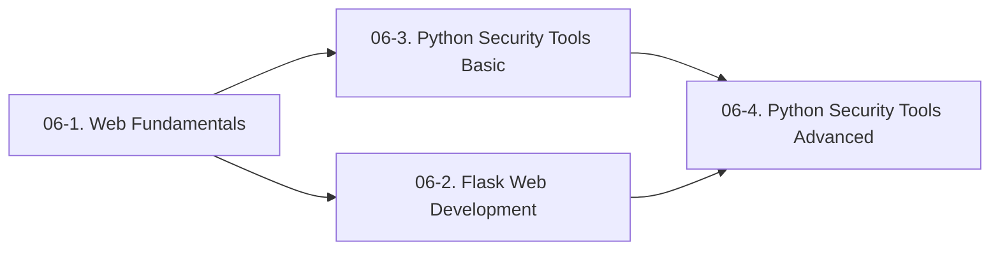

# 06. This Is Python<!-- omit in toc -->

- **Positioning**: From scratch, arm your security toolchain with Python.

- **Core Goal**: After completing this series, you will have complete hands-on Python capability—from Web fundamentals to Flask development, from web scraping to GUI, from basic scripting to advanced security tools.

---

## Table of Contents<!-- omit in toc -->

- [Preface](#preface)
- [Series Structure](#series-structure)
- [Course Introductions](#course-introductions)
  - [06-1. Web Fundamentals Crash Course](#06-1-web-fundamentals-crash-course)
  - [06-2. Flask Web Development](#06-2-flask-web-development)
  - [06-3. Writing Security Tools in Python (Basic)](#06-3-writing-security-tools-in-python-basic)
  - [06-4. Writing Security Tools in Python (Advanced)](#06-4-writing-security-tools-in-python-advanced)
- [Learning Path](#learning-path)
- [Relationship with Other Night Keeper's Book Tutorials](#relationship-with-other-night-keepers-book-tutorials)
- [Prerequisites](#prerequisites)
- [FAQ](#faq)

---

## Preface

*After completing 05, Kate had mastered the basics of penetration testing—she had attacked the Metasploitable target with Kali, captured packets with Burp Suite, and analyzed HTTP traffic with Wireshark. But she discovered a problem:*

> *"I've used a lot of tools written by others—SQLMap, Nmap, dirsearch. I know what they can do, but I don't know how they're written. What if one day I encounter a scenario where none of these tools can get the job done—what do I do?"*

*"You'll need to write your own. Python is the 'universal glue' of the penetration testing world—from information gathering to exploit development, from web scraping to graphical interfaces, it's everywhere. This series teaches you Python from scratch, not to help you pass an exam, but to give you the ability to write your own tools."*  

Python's position in the security field isn't because it's the fastest language (it's not), nor because it's the most secure language (it's also not). It's because it's the language with the **highest development efficiency**. You have an idea—write a script to automatically scan target ports, batch-verify vulnerabilities, parse log files—and you can have a working version running in Python in half an hour. In penetration testing, speed often matters more than elegance. What you need is a tool that works today, not a perfect architecture three months from now.

What's more, Python's third-party library ecosystem is a treasure trove for security practitioners. `requests` lets you send HTTP requests in three lines of code, `paramiko` lets you remotely control servers via SSH, `scapy` lets you construct and parse network packets, `beautifulsoup4` lets you parse HTML pages. These libraries have already handled the low-level details for you—you only need to focus on the security problem you're trying to solve.

This series won't teach you every syntactic detail of Python. It only teaches you **the part of Python most commonly used in security scenarios**. You don't need to know Python's memory management mechanism, but you absolutely need to know how to send HTTP requests with Python. You don't need to know what Python's metaclasses are, but you absolutely need to know how to parse command-line arguments with Python. You're not here to learn a programming language—you're here to learn how to use a programming language to solve security problems.

> *In this series, Kate will learn Python from scratch alongside you. She'll write her first web scraper, her first GUI tool, her first port scanner. She'll build her own target environment in Flask, then attack it with her own security tools. She'll make mistakes, step into pitfalls, and stare blankly at an error message at 2 a.m.—and then she'll fill in those pits together with you, one by one.*
>
> **All the error demonstrations you see in the 06 series were written by Kate. She's responsible for crashing; you're responsible for learning.**
>
> —— The Night Keeper

---

## Series Structure

*06. This Is Python* is a series divided into four sub-courses:

| # | Tutorial | Status | Link |
| :--- | :--- | :--- | :--- |
| **06-1** | Web Fundamentals Crash Course | :construction: Writing | [Start Reading](<./06-1. Web 通识扫盲课/06-1. Web 通识扫盲课.md>) |
| **06-2** | Flask Web Development | :pencil: Planned | Coming soon |
| **06-3** | Writing Security Tools in Python (Basic) | :pencil: Planned | Coming soon |
| **06-4** | Writing Security Tools in Python (Advanced) | :pencil: Planned | Coming soon |

---

## Course Introductions

### 06-1. Web Fundamentals Crash Course

**Who it's for**: Absolute beginners who have never touched Web development. If you don't know what HTML is, can't tell the difference between frontend and backend, and don't know what happens when you press Enter in your browser—this course is for you.

**What you'll learn**:

- **The Birth and Development of the Web**: Starting from a research paper proposal by Tim Berners-Lee. Why did he invent the Web? What three things did he invent? What did the world's first website look like? Where did the name "Web" come from?
- **The Browser Wars**: How Mosaic got ordinary people using browsers? How Netscape ruled the Internet of the 1990s? How Microsoft won the first browser war with IE? How Firefox and Chrome later caught up from behind? The JavaScript, Cookies, and SSL left behind by this war—all of them are waiting for you today on your path to learning security.
- **The Difference Between Frontend and Backend**: What displays in the browser is the frontend, what runs on the server is the backend. How do they communicate via HTTP? The Web three-tier architecture and Mermaid sequence diagram you learned in 05 Chapter 1 will be reawakened here.
- **HTML Basics**: HTML is not a programming language—it's a markup language. `<h1>` is a heading, `<p>` is a paragraph, `<form>` is a form. You'll hand-write your first webpage in this section.
- **CSS Basics**: CSS turns a webpage from "black text on white paper" into "colorful, with layout." You'll learn selectors, properties, and values—three concepts are enough to write presentable styles.
- **JavaScript Basics**: JavaScript makes webpages "come alive." You'll hand-write a piece of JS: click a button, and a popup says "Keeper, I'm here." You made this popup appear when you personally verified XSS in 05 Chapter 2—now you'll know how it popped up.
- **HTTP Protocol**: You already learned HTTP in 05 Chapter 4—here you'll revisit it in a more intuitive way. The difference between GET and POST, what 200 OK and 404 Not Found mean, and how Cookies and Sessions make the "stateless" HTTP "stateful."
- **Developer Tools**: Press F12, and you can see through the internal structure of a webpage. The Elements tab for viewing HTML and CSS, the Console tab for executing JavaScript, the Network tab for monitoring all network requests. The Burp Suite you installed in 05 is essentially a more powerful "Network tab."

**Why learn it**: To attack Web applications, you first need to understand how the Web works. Without knowing HTML, source code is just gibberish to you. Without knowing HTTP, you won't know what the packets Burp Suite captures mean. Without knowing JavaScript, you can't understand why XSS can steal Cookies.

**What you'll be able to do after**: Understand "what happens when you type a URL and press Enter," read webpage source code, know how frontend and backend communicate via HTTP, and use F12 to see through the internal structure of a webpage. You'll know that the Web is not magic—it's a set of rules that can be understood and attacked.

**Relationship with subsequent courses**: 06-1 is the common foundation for both 06-2 and 06-3. You must first understand how the Web works before you can write Web applications (06-2) and web scrapers (06-3).

---

### 06-2. Flask Web Development

**Who it's for**: Readers who have completed 06-1, or who already have basic HTML/HTTP knowledge.

**What you'll learn**:

- **Flask Framework Basics**: What is Flask? Why choose it over Django? Get a website running in a few lines of code—`from flask import Flask`
- **Routes and View Functions**: What does `@app.route('/')` mean? When a user visits different URLs, how does Flask know what content to return?
- **Template Rendering**: How to combine HTML templates with Python data? `render_template` lets you dynamically generate webpages.
- **Form Handling**: When a user fills out a form, how does Flask receive the data? How to handle GET and POST in Flask?
- **Database Operations**: How does Flask connect to a database? How to use SQLAlchemy to operate a database? The data you write will be persistently stored.
- **Deployment**: Once you've written your Flask application, how do you get it actually running on a server? Basic configuration of Gunicorn + Nginx.

**Why learn it**: You'll need your own "home target" to test security tools in the future. Build a Web application yourself with Flask—you'll both learn backend development and have a completely legitimate testing target. You can deliberately leave vulnerabilities in your Flask application (SQL injection, XSS, file upload) and then attack it with your own security tools. **With a target you built yourself, you know better than anyone where the vulnerabilities are hidden.**

**What you'll be able to do after**: Independently develop simple Web applications with Flask and understand the basic workflow of backend development. You'll be able to build a complete website with a database, user login, and form submission.

**Relationship with subsequent courses**: 06-2 is an optional prerequisite for 06-4. The Flask application you build will be your "home target" for testing your own security tools. After completing 06-4, you can go back to your Flask application and write an automated scanning script to check if it has SQL injection vulnerabilities.

---

### 06-3. Writing Security Tools in Python (Basic)

**Who it's for**: Readers who have already mastered basic Python syntax (variables, functions, loops, `import`) and want to write practical tools. If you already know how to use `pip install` and can write simple `for` loops and `if` statements, you're ready to start this course.

**What you'll learn**:

- **Python Web Scraping**: Starting from sending HTTP requests with the `requests` library, to parsing HTML pages with `BeautifulSoup`. From simple static page fetching to simulating login, handling Cookies, and bypassing anti-scraping strategies. Web scraping and information gathering are fundamentally the same thing—automated information collection. The scrapers you write are your own information-gathering tools.
- **GUI Development**: Use Tkinter (Python's built-in standard GUI library) to wrap your scripts in a graphical interface. Command-line tools only you can use; GUI tools your teammates can also use. Windows, buttons, input boxes, text boxes—learn these four widgets, and you can wrap any script in a GUI.

**Why learn it**: You've written a powerful penetration testing script, but others have to open the command line to use it—too intimidating. Package your tools as programs with interfaces, and others can use them with a double-click. The tools you write during penetration testing projects will ultimately need to be handed over to clients or teammates. They don't understand the command line; they need a button they can click.

**What you'll be able to do after**: Package scripts as GUI tools that others can use with a double-click. Write web scrapers to automate information collection. You'll have the ability to automate repetitive tasks—no more manually repeating the same operations.

**Relationship with subsequent courses**: 06-3 is an optional prerequisite for 06-4. 06-3 teaches you "how to write tools for others to use," 06-4 teaches you "how to write tools for yourself to use." There's no fixed dependency between the two—you can learn GUI first then security scripting, or the other way around.

---

### 06-4. Writing Security Tools in Python (Advanced)

**Who it's for**: Readers who have completed 06-3, or who already have some Python foundation and want to write professional security tools.

**What you'll learn**:

- **Principles and Writing of Port Scanners**: You've used Nmap, but how does it actually work under the hood? TCP SYN scan, TCP Connect scan, UDP scan—you'll implement your own streamlined version of Nmap.
- **Weak Password Brute-Force Tools**: You've used Hydra, but how does it actually work? You'll write your own brute-force script, targeting SSH, FTP, MySQL, and HTTP Basic Auth one by one.
- **Log Analysis Scripts**: You have dozens of GB of access logs—how do you extract traces of attackers from them? Parse log files with Python, extract suspicious IPs, and tally attack sources.
- **Automated SQL Injection Detection Scripts**: You've manually tested SQL injection—but what if you have hundreds of URLs to test? You'll write a script that batch-detects SQL injection vulnerabilities.

**Why learn it**: When SQLMap can't extract an injection, and when Nmap isn't scanning precisely enough, you need to write your own script. You don't need to reinvent the wheel—but you need to know how to customize it. Others' tools are general-purpose; your scripts are targeted—aimed at the specific system, specific vulnerability, specific scenario you're currently penetrating. This is the core competitive edge of a penetration testing engineer.

**What you'll be able to do after**: Automate tedious penetration testing work—click a button, let the computer do the work for you, then go grab a cup of coffee.

**Relationship with subsequent courses**: 06-4 is the endpoint of this series and the bridge to 07 *Rust: The Ash War*. When you find that Python's performance isn't enough—port scanning too slow, brute-force dictionary too large, log analysis too laggy—that's when you need Rust.

---

## Learning Path

The design of this series follows the principle of **step-by-step progression, front-to-back connection**:



**Recommended Path**:

1. **Start with 06-1**: Regardless of whether you have prior programming experience, first understand the basic workings of the Web—HTML, CSS, JavaScript, HTTP. These are the foundation for writing Web applications and security tools later. This course doesn't teach Python—it only teaches the Web. You need to know what the Web is before you can use Python to operate on the Web.
2. **Choose either of the two branches**:
   - **Flask path** (06-2): You want to build your own Web target and dive deep into backend development. This path suits readers who want to understand "how websites are built."
   - **Scraping + GUI path** (06-3): You want to immediately write usable tools for others. This path suits readers who want to see quick results.
3. **Converge at 06-4**: Whichever branch you choose, you'll eventually return to security tool development—port scanners, weak password brute-force, log analysis scripts. 06-4 is the endpoint of the entire series and the watershed moment where you go from "someone who uses tools" to "someone who builds tools."

**If you already have a Python foundation**, you can skip the basics in 06-1 and 06-2 and start directly from 06-3. But it's recommended to at least skim 06-1—many Python developers have only a vague understanding of HTTP protocol and browser workings, and this will slow you down when writing Web penetration tools.

**If you already have Web development experience** (can use Flask or Django), you can jump directly to 06-4. But it's recommended to at least skim 06-3—web scraping and information gathering are among the most practical skills for penetration testing.

---

## Relationship with Other Night Keeper's Book Tutorials

| Tutorial | Relationship with *This Is Python* |
| :--- | :--- |
| **01. Mastering Markdown** | All the Python code, notes, and documentation you write will be composed in Markdown. The code block syntax highlighting you learned in 01—` ```python `—will be used in every lesson. |
| **02. Mastering VS Code** | VS Code is the most comfortable editor for writing Python—intelligent autocompletion, debug breakpoints, integrated terminal. The `Ctrl+Shift+P` command palette you learned in 02 will be used when installing Python plugins. |
| **03. VIM: From Entry to Decency** | When you need to remotely log into a server to edit Python scripts, VIM is your only option. The `:wq` you learned in 03 will save your life at that moment. |
| **04. Git & GitHub by the Horns** | Every Python tool you write should be version-managed with Git and open-sourced on GitHub. The `git push origin main` you learned in 04 will be used every time you finish a new feature. |
| **05. This Is Cybersecurity** | The Python series is the "weapon factory" for 05—05 teaches you attack theory (SQL injection principles, XSS principles, file upload principles), 06 teaches you to build attack tools (SQL injection detection scripts, XSS payload generators, file upload vulnerability scanners). After 05 you know "why to attack," after 06 you know "how to attack." |
| **07. Rust: The Ash War** | Python is the sharp tool for rapid development; Rust is the ultimate weapon for high performance. When your Python port scanner is too slow, your Python brute-force script can't handle a large dictionary—that's when you need Rust. |

---

## Prerequisites

**06-1** of this series is truly zero-baseline—you don't need any programming experience. You just need to be able to open a browser and write Markdown in VS Code (which you already learned in 01).

Starting from **06-2**, you need some Python foundation. If you've never written Python at all, it's recommended to first go through a Python introductory book (like the first 11 chapters of *Python Crash Course*)—variables, lists, dictionaries, `if`/`for`/`while`, functions, classes, file I/O. You don't need to memorize all this basic syntax, but you need to be able to recognize that `def xxx():` is defining a function and `import requests` is importing a library.

If you don't want to buy an extra book, you can also follow 06-2 and learn as you go—the tutorial will explain the meaning of each line of code but won't spend extensive space explaining Python's basic syntax. When you encounter syntax you don't understand, search for "Python list how to use" or "Python function definition," and you'll learn Python through hands-on practice.

---

## FAQ

**Q: Can I really learn Python from scratch?**
A: 06-1 is a true zero-baseline entry—you don't need any programming experience. Starting from 06-2, you need some Python foundation, but you don't need to be an expert. You just need to be able to read basic syntax; the rest you'll learn through hands-on practice in real scenarios. You don't need to spend three months systematically learning Python first and then come back—jump straight in, look up unfamiliar syntax on the spot, it's more efficient. You learned Markdown the same way—you started by typing `# Heading` directly, not by memorizing all the syntax first.

**Q: Why Flask and not Django?**
A: Flask is lighter. You can get a website running in just a few lines of code, making it more beginner-friendly. Django has more features but is also heavier—it comes with ORM, authentication system, admin panel out of the box. Beginners facing a pile of concepts right at the start are easily discouraged. And your goal is "building a target for testing security tools"—Flask's lightness perfectly meets that need. You don't need Django's enterprise-level features.

**Q: Why Tkinter and not PyQt or Electron?**
A: Tkinter is Python's built-in standard GUI library. You don't need to install anything extra—just having Python installed is enough. PyQt is more powerful but larger, requires additional installation, and has complex commercial licensing. Electron is a frontend framework requiring HTML/CSS/JS, not a native Python solution. For the goal of "wrapping scripts into tools with an interface," Tkinter is fully sufficient—windows, buttons, input boxes, text boxes: four widgets cover 90% of needs.

**Q: Can I skip 06-1 and go straight to 06-2?**
A: If you already understand the following questions, you can skip 06-1: What does the browser do after you type a URL and press Enter? What do HTML, CSS, and JavaScript each do? What's the difference between GET and POST? What do 200 OK and 404 Not Found mean? What's the relationship between Cookies and Sessions? If you only have a vague sense of these questions, it's recommended to at least skim 06-1—it only takes an hour or two but will help you clarify all the basic concepts of the Web. These foundations will keep working in your head later when you write scrapers, penetration tools, and analyze Web vulnerabilities.

**Q: What can I do after completing this series?**
A: After 06-1, you can understand the basic workings of the Web. After 06-2, you can build your own Web applications with Flask. After 06-3, you can write GUI Python tools for others to use. After 06-4, you can write your own port scanners, brute-force scripts, and log analysis tools. You can open-source them on GitHub and put them in your resume. When you interview for a penetration testing engineer position and the interviewer asks "Do you know Python?", you open GitHub and show them—this is the port scanner you wrote, this is the weak password brute-force script you wrote, this is the log analysis tool you wrote. More convincing than any certificate.

---

**Start Reading: [06-1. Web Fundamentals Crash Course](<./06-1. Web 通识扫盲课/06-1. Web 通识扫盲课.md>)** 🔪
