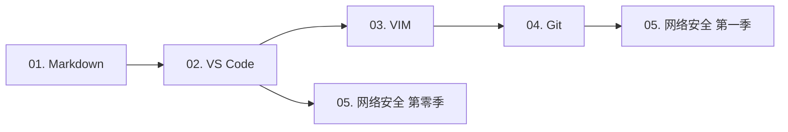
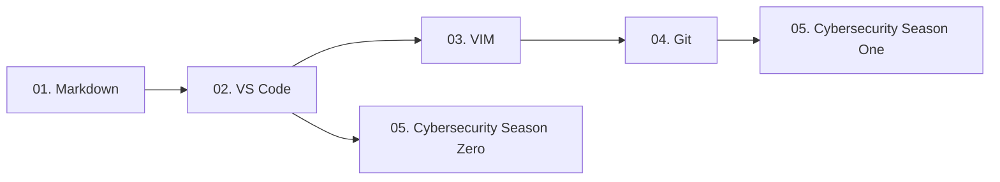

# 守夜者之书 / The Night Keeper's Book

## 目录 / Table of Contents

- [守夜者之书 / The Night Keeper's Book](#守夜者之书--the-night-keepers-book)
  - [目录 / Table of Contents](#目录--table-of-contents)
  - [中文版](#中文版)
    - [📖 这是什么](#-这是什么)
    - [📚 这里有什么](#-这里有什么)
    - [🚀 从哪里开始](#-从哪里开始)
      - [各教程介绍](#各教程介绍)
      - [怎么学？](#怎么学)
    - [🌐 关于守夜者](#-关于守夜者)
    - [📄 许可证](#-许可证)
  - [English version](#english-version)
    - [📖 What is this?](#-what-is-this)
    - [📚 What's inside?](#-whats-inside)
    - [🚀 Where to start?](#-where-to-start)
      - [Tutorial Introductions](#tutorial-introductions)
      - [How to learn?](#how-to-learn)
    - [🌐 About the Night Keepers](#-about-the-night-keepers)
    - [📄 License](#-license)

---

## 中文版

> 从零开始学安全。每天2小时，雷打不动。

---

### 📖 这是什么

这是一个**公开的学习笔记仓库**，记录一名守夜者从零开始学习网络安全的完整过程。

我是 **TheSilentOne-creator**（沉默者），守夜者的一员。我相信：

> 五年后、十年后、二十年后，世界和时间会给我们答案。

---

### 📚 这里有什么

- **📝 学习笔记**：每天学的内容，整理成笔记
- **📐 教程系列**：从零开始的教程，中英双语
- **💻 代码练习**：写过的脚本、工具

---

### 🚀 从哪里开始

- 📘 **基础工具与协作系列**（守夜者的利剑与盾牌）
- 💻 **网络安全世界**（守夜者的战场与使命）

| # | 教程 | 状态 | 链接 |
| :--- | :--- | :--- | :--- |
| 01 | **玩转 Markdown** | 🚧 编写中 | [开始阅读](<./中文 (Chinese)/01. 玩转 Markdown/01.玩转 Markdown.md>) |
| 02 | **玩转 VS Code** | 🚧 编写中 | [开始阅读](<./中文 (Chinese)/02. 玩转 VS Code/02. 玩转 VS Code.md>) |
| 03 | **十节课极简入门 VIM** | 📝 等待中 | 敬请期待 |
| 04 | **拿捏 Git 与 GitHub** | 📝 等待中 | 敬请期待 |
| 05 | **这才是网络安全 (全六季)** | 📝 等待中 | 敬请期待 |
| 06 | `[进阶]` **用 Python 写安全工具** | 📝 等待中 | 敬请期待 |
| 07 | `[进阶]` **这才是人可以看懂的 Rust 教程** | 📝 等待中 | 敬请期待 |
| 08 | `[进阶]` **详解计算机科学丛书** | 📅 计划中 | 敬请期待 |

> 所有教程采用**中英双语**编写：先用中文写完，再翻译成英文。

#### 各教程介绍

1. **玩转 Markdown** -- 别再傻乎乎地用记事本写笔记了！  
   - 你是不是还在忍受Word排版时图片乱飞、格式崩溃的痛苦？或者写了半天笔记，粘到网页上丑得自己都不想看？  
   - **Markdown** 就是来解决这个问题的。它像极了武林秘籍里的 **“轻功”** ——学起来只需要十分钟，但用好了能让你飞一辈子。  
   - 这套教程不跟你讲复杂的语法树，只教你在写代码笔记、写GitHub Readme、甚至写书时，**那最常用的5%语法**。  
   - **学完这一课，你将解锁：** 优雅地写出一份连程序员看了都想Star的笔记，从此告别鼠标狂点格式刷的原始时代。
2. **玩转 VS Code** -- 武装你的“瑞士军刀”
   - 如果把写代码比作做饭，那VS Code就是你的**厨房工作台**。你可以用它切菜（写代码）、看火候（调试）、甚至下单买菜（Git集成）。  
   - 很多人用了好几年VS Code，还把它当成一个高级记事本——就像买了辆法拉利却只用来推着走。  
   - 本教程手把手教你装上那些 **“开了挂”的插件** ：远程写服务器代码、AI帮你补全、一键格式化乱糟糟的代码。  
   - **学完这一课，你将解锁：** 一个能让你在任何地方（甚至iPad上）写代码的云端开发环境，让写代码变成一种享受。
3. **十节课极简入门 VIM** -- 没有图形界面？那就用键盘征服世界
   - 听好了，菜鸟。当你还在纠结用鼠标点击“保存”按钮时，真正的黑客早已在VIM里键入 `:wq` 潇洒离去。
   - VIM是Linux系统里的 **“文字游戏”** ，它的学习曲线陡峭得像悬崖。但只要你爬上去了，就能体验到“手不离键盘，思绪如流水”的快感。
   - 我们只讲10节课，绝不让你背那些一辈子用不到的花哨命令。你只需要学会：**怎么进去、怎么改字、怎么保存、怎么拍桌子骂娘然后退出。**
   - **学完这一课，你将解锁：** 在任何一个服务器上（哪怕只有命令行）都能流畅写代码的底气，以及成为室友眼中的“键盘侠”。
4. **拿捏 Git 与 GitHub** -- 别再把你的代码存桌面了！
   - 你一定经历过这种绝望：`毕业论文_最终版.doc`、`毕业论文_最终版2.doc`、`毕业论文_打死也不改版.doc`……
   - **Git** 就是专门治这种“版本混乱”病的。它不仅记下了你每次改了啥，还能让你一键回到“昨天下午那个还没改崩的状态”。
   - 而 **GitHub** 是程序员的“朋友圈”，也是最牛逼的代码仓库。这套教程会教你：**如何把代码白嫖（Fork）下来、如何更新、以及如何把你的开源项目变成简历上的亮点。**
   - **学完这一课，你将解锁：** 拥有一个绿油油的GitHub贡献墙，以及那句让你底气十足的：“来，先 Fork 我的项目。”
5. **这才是网络安全 (全六季)** -- 省下一万块的培训，**免费**看完这一套
   - 你有没有过这种经历：看了好多碎片化的文章，觉得“我行了”，一上手发现“我啥也不会”？
   - 全六季采用 **“相声式”教学法** —— 保证没有昏昏欲睡的理论，只有让你笑完还能记住的攻击手法。比如：“什么叫XSS？就是你在我评论区发了个脚本，我一打开网页，弹窗说‘你被耍了’。”
   - 从Web渗透到内网漫游，从信息收集到日志溯源，这条路我给你铺好了，你只需要跟着走。
   - **学完这一课，你将解锁：** 完整的网络安全知识体系 + 一套可以在面试官面前侃侃而谈的实战项目经验。
6. `[进阶]` **用 Python 写安全工具** -- 不要重复造轮子，但要学会改装轮子
   - 只会用别人写好的工具，你永远是个脚本小子。
   - 当 SQLMap 跑不出注入时，当 Nmap 扫得不够精细时，你需要自己写一个脚本。
   - 这套教程不讲爬虫和Web开发，只讲**网安视角的Python**：写一个端口扫描器、写一个弱口令爆破工具、写一个日志分析脚本。
   - **学完这一课，你将解锁：** 把枯燥的渗透工作自动化——点一下鼠标，让电脑帮你干活，然后你去喝杯咖啡。
7. `[进阶]` **这才是人可以看懂的 Rust 教程** -- C++ 太难？Python 太慢？来试试 Rust
   - 网安圈的未来趋势是什么？**Rust**。它的速度快得像C，内存安全得像Java，编译报错贴心得像你妈。
   - 市面上Rust教程的特点就是“入门到放弃”，因为所有权、生命周期这些概念太抽象了。
   - 这里是 **“人话版”**。我会把 `所有权` 比喻成“图书馆借书规则”，把 `生命周期` 比喻成“牛奶的保质期”。
   - **学完这一课，你将解锁：** 一门未来的底层系统语言能力，让你在写Shellcode或POC时，拥有极致的速度和极低的崩溃率。
8. `[进阶]` **详解计算机科学丛书** -- 追随计算机科学的初心，用“大块头”体会编程之道
   - 如果你觉得看完了上面的教程，感觉自己“啥都会了但又啥都不会”，说明你缺了**内功**。
   - 这是一份读书笔记/伴读指南。针对那些经典的“黑皮书”（如《计算机网络》、《深入理解计算机系统》）。
   - 我不会帮你读书，但我告诉你**哪些章节是面试必考的、哪些算法是写Exploit必用的、哪些理论可以跳过。**
   - **学完这一课，你将解锁：** 一颗计算机科学的大脑。从此以后，任何新的漏洞和框架在你眼里，都不过是基础原理的排列组合。

---

#### 怎么学？

本教程完全面向零基础，哪怕你连最基本的工具都不会用。

为了让基础工具（`01`~`04`）的学习不枯燥，并让你尽快接触到安全知识的乐趣，建议你按照以下路径学习：

1. **务必先学 `01. 玩转 Markdown`**  
   这是你写文档、做笔记，乃至**写漏洞报告** 时都要使用的一种**标记语言**（类似于 Word，但是纯文本！）。它是整个学习旅程的书写基础。

2. **接下来学习 `02. 玩转 VS Code`**  
   学好了这将是你写代码、做笔记、写 Markdown……的**利器**，你的核心工作台。

3. **下一个 `03. 十节课极简入门 VIM` 学起来有一点难度**  
   但你不得不学。因为等你以后~~黑进~~操作服务器时，系统自带的编辑器不是 VSCode，而是 VIM。  
   **为了补偿你这受伤的小心灵，一边学习 VIM，一边可以看看 `05. 这才是网络安全 (全六季)` 的第零季 —— “火种”。**  
   这一季将带你追寻最初的黑客精神与文化，~~纯属于是听故事了~~，但这将非常有意思，让你理解安全圈的缘起。

4. **如果你终于学完、学透了 VIM，那么下一个就是 `04. 拿捏 Git 与 GitHub`**  
   这俩货能干什么，我们已在前面介绍过了。  
   你可以开始**一边**学习 Git 与 GitHub，**一边**开始正式进入 `05. 这才是网络安全` 的第一季学习啦！

接下来的 `这才是网络安全 (全六季)` 就可以按照顺序深入学习了。

---

### 🌐 关于守夜者

我是守夜者的一员。守夜者是一个技术学习社区。

- **我们相信**：从零开始，一起进步
- **我们不做**：非法攻击、盈利、暴露成员身份

**守夜者宣言**：长夜将至，我从今开始守夜，今夜如此，夜夜皆然。

---

> **加入我们**:  
> 如果你也在从零开始，想找个人一起守夜，Fork 这个仓库，写下你的第一行笔记。  
> Fork后，在 `/community/` 下新建 `你的名字.md`，写下你今天的收获。

---

### 📄 许可证

本仓库内容采用 [CC BY-NC-SA 4.0](https://creativecommons.org/licenses/by-nc-sa/4.0/) 协议（署名-非商业性使用-相同方式共享）。

---

## English version

> *Learning security from scratch. Two hours a day, rain or shine.*

---

### 📖 What is this?

An open notebook documenting my journey from zero to cybersecurity.

I am **TheSilentOne-creator** (The Silent One), a member of the Night Keepers. I believe:

> *Five years, ten years, twenty years from now—the world and time will give us the answer.*

---

### 📚 What's inside?

- **📝 Learning Notes**: Daily study notes, organized and distilled
- **📐 Tutorial Series**: Step-by-step tutorials, bilingual (Chinese / English)
- **💻 Code Practice**: Scripts and tools I've written along the way

---

### 🚀 Where to start?

- 📘 **Core Tools & Collaboration** (The Night Keeper's Sword & Shield)
- 💻 **The World of Cybersecurity** (The Night Keeper's Battlefield & Mission)

| # | Tutorial | Status | Link |
| :--- | :--- | :--- | :--- |
| 01 | **Mastering Markdown** | 🚧 Writing | [Start Reading](<./English (英文)/01. Mastering Markdown/01.Mastering Markdown.md>) |
| 02 | **Mastering VS Code** | 📝 Planned | Coming soon |
| 03 | **VIM in 10 Lessons** | 📝 Planned | Coming soon |
| 04 | **Git & GitHub by the Horns** | 📝 Planned | Coming soon |
| 05 | **This Is Cybersecurity (6 Seasons)** | 📝 Planned | Coming soon |
| 06 | `[Advanced]` **Writing Security Tools in Python** | 📝 Planned | Coming soon |
| 07 | `[Advanced]` **A Rust Tutorial Humans Can Actually Read** | 📝 Planned | Coming soon |
| 08 | `[Advanced]` **The Computer Science Canon Explained** | 📅 Planned | Coming soon |

> *All tutorials are bilingual: first written in Chinese, then translated into English.*

#### Tutorial Introductions

1. **Mastering Markdown** -- Stop using Notepad like a caveman!
    - Are you still suffering from images flying everywhere and formats crashing in Word? Or have you written pages of notes that look so ugly on a webpage you don't even want to look at them?
    - **Markdown** is here to solve that. It's like the legendary **"Qinggong"** (lightness skill) in martial arts novels—takes ten minutes to learn, but using it well will make you fly for a lifetime.
    - This tutorial won't bore you with complex syntax trees. It only teaches you the **top 5% of syntax** you'll actually use for code notes, GitHub Readmes, and even writing books.
    - **What you'll unlock:** The ability to elegantly write notes that even a programmer would want to Star, bidding farewell to the primitive era of frantically clicking the format painter with your mouse.
2. **Mastering VS Code** -- Arm your "Swiss Army Knife"
    - If writing code is like cooking, then VS Code is your **kitchen workbench**. You can use it to chop vegetables (write code), watch the heat (debug), and even order groceries (Git integration).
    - Many people use VS Code for years but treat it like a fancy Notepad—it's like buying a Ferrari and only using it to push it around.
    - This tutorial will walk you through installing those **"cheat-code" plugins**: writing code on a remote server, AI-powered auto-completion, and formatting messy code with one click.
    - **What you'll unlock:** A cloud development environment that lets you write code anywhere (even on an iPad), turning coding into pure enjoyment.
3. **VIM in 10 Lessons** -- No GUI? Conquer the world with your keyboard.
    - Listen up, rookie. While you're still fumbling with the mouse to click the "Save" button, a true hacker has already typed `:wq` in VIM and left the building.
    - VIM is the **"text-based game"** in Linux systems. Its learning curve is as steep as a cliff. But once you climb it, you'll experience the flow state of "hands never leaving the keyboard, thoughts flowing like water."
    - We only cover 10 lessons. I won't make you memorize fancy commands you'll never use. You just need to learn: **how to enter, how to change text, how to save, and how to slam the table, curse, and exit.**
    - **What you'll unlock:** The confidence to smoothly write code on any server (even one with only a command line), and the status of becoming the "Keyboard Warrior" in the eyes of your roommates.
4. **Git & GitHub by the Horns** -- Stop saving your code to your desktop!
    - You've definitely experienced this despair: `Thesis_Final.doc`, `Thesis_Final_v2.doc`, `Thesis_I_Swear_This_Is_The_Last_One.doc`...
    - **Git** is the cure for this "version chaos" disease. It not only remembers every change you made, but also lets you instantly return to "that state yesterday afternoon before everything broke."
    - And **GitHub** is the programmer's "social circle" and the most awesome code repository. This tutorial will teach you: **how to clone code for free (Fork), how to update it, and how to turn your open-source project into a highlight on your resume.**
    - **What you'll unlock:** A super green GitHub contribution wall, and the confidence to say: "Hey, just Fork my project first."
5. **This Is Cybersecurity (6 Seasons)** -- Save yourself the cost of a training course. Watch this for **free** instead.
    - Ever had this experience: read tons of fragmented articles, felt like "I've got this," then actually tried something and realized "I know nothing"?
    - All six seasons use a **"Comedy Show" teaching style**—no boring theories, only attack techniques you'll remember after a good laugh. Like: "What's XSS? It's when someone posts a script in my comments, and when I open the page, a popup says 'You got pwned.'"
    - From Web penetration testing to intranet roaming, from information gathering to log tracing, I've paved this path for you. You just need to follow it.
    - **What you'll unlock:** A complete cybersecurity knowledge system + a set of hands-on project experiences you can confidently discuss in front of an interviewer.
6. `[Advanced]` **Writing Security Tools in Python** -- Don't reinvent the wheel, but learn how to customize it.
    - If you only use tools others have written, you'll always be a script kiddie.
    - When SQLMap can't extract an injection, and when Nmap isn't scanning precisely enough, you need to write your own script.
    - This tutorial isn't about web scraping or web development. It's about **Python from a security perspective**: writing a port scanner, a weak password brute-force tool, a log analysis script.
    - **What you'll unlock:** The ability to automate tedious penetration testing—click a button, let the computer do the work for you, then go grab a cup of coffee.
7. `[Advanced]` **A Rust Tutorial Humans Can Actually Read** -- C++ too hard? Python too slow? Try Rust.
    - What's the future trend in cybersecurity? **Rust**. Its speed is like C, its memory safety is like Java, and its compiler error messages are as caring as your mom.
    - Most Rust tutorials on the market are "from beginner to giving up," because concepts like Ownership and Lifetimes are too abstract.
    - This is the **"human language" version**. I'll explain `Ownership` as "library borrowing rules" and `Lifetimes` as "milk expiration dates."
    - **What you'll unlock:** A future-proof systems language skill, giving you extreme speed and extremely low crash rates when writing Shellcode or POCs.
8. `[Advanced]` **The Computer Science Canon Explained** -- Return to the heart of computer science. Grasp the Tao of programming through these mighty tomes.
    - If you finish the tutorials above and feel like you "know everything and nothing at all," it means you're lacking **inner strength**.
    - This is a reading guide/companion. It's targeted at those classic "black books" (like *Computer Networking*, *Computer Systems: A Programmer's Perspective*).
    - I won't read the book for you, but I will tell you **which chapters are must-knows for interviews, which algorithms are essential for writing exploits, and which theories you can skip.**
    - **What you'll unlock:** A computer science brain. From then on, any new vulnerability or framework will just look like permutations and combinations of fundamental principles.

---

#### How to learn?

This tutorial is entirely for absolute beginners, even if you don't know the most basic tools.

To keep the foundational tools (`01`–`04`) from feeling boring and to get you into the fun of security knowledge as soon as possible, here's the recommended learning path:

1. **Start with `01. Mastering Markdown`**  
   This is the **markup language** (think Word, but pure text!) you'll use for writing documents, taking notes, and even **drafting vulnerability reports**. It's the writing foundation of your entire journey.

2. **Next, move on to `02. Mastering VS Code`**  
   Once mastered, this will be your **ultimate weapon** for writing code, taking notes, composing Markdown… your core workbench.

3. **Then comes `03. VIM in 10 Lessons` — it's a bit challenging**  
   But you have to learn it. Because when you're finally ~~hacking into~~ operating a server, the built-in editor won't be VSCode—it'll be VIM.  
   **To soothe your bruised soul, while you're learning VIM, you can start watching the "Season Zero — The Spark" of `05. This Is Cybersecurity`.**  
   This season takes you back to the original hacker spirit and culture. It's basically story time, but it's incredibly fun and helps you understand the roots of the security world.

4. **Once you've finally learned and internalized VIM, the next stop is `04. Git & GitHub by the Horns`**  
   You already know what these two do.  
   At this point, you can **split your time**: continue with Git & GitHub on one side, and officially dive into **Season One** of `05. This Is Cybersecurity` on the other!

After that, you can follow the rest of `This Is Cybersecurity (6 Seasons)` in order.

---

### 🌐 About the Night Keepers

I am a member of the Night Keepers, a tech learning community.

- **We believe**: Start from zero. Progress together.
- **We do not engage in**: Illegal attacks, profit-making, or exposing members' identities.

**The Night Keeper's Oath**: *Night gathers, and now my watch begins. This night, and all nights to come.*

---

> **Join us**:  
> If you're also starting from zero and looking for someone to keep watch with, Fork this repository and write your first note.  
> After forking, create a new file under `/community/` named `your-name.md` and write down what you learned today.

---

### 📄 License

*This repository is licensed under the [CC BY-NC-SA 4.0](https://creativecommons.org/licenses/by-nc-sa/4.0/) license (Attribution-NonCommercial-ShareAlike).*
