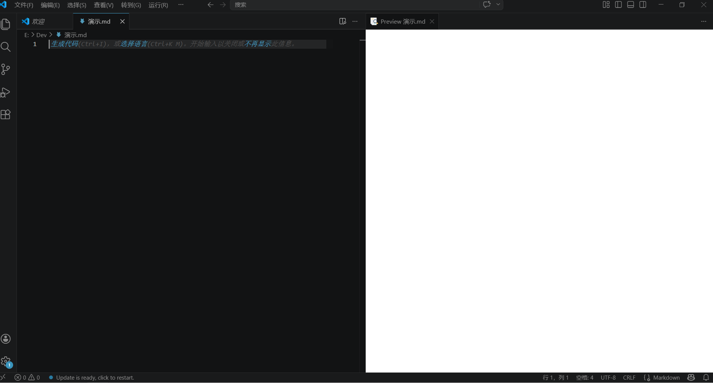

# 01. 玩转 Markdown

## 目录

- [01. 玩转 Markdown](#01-玩转-markdown)
  - [目录](#目录)
  - [前言](#前言)
  - [第一章 - 先别急着写字，磨刀不误砍柴工](#第一章---先别急着写字磨刀不误砍柴工)
    - [1.1 把 VSCode 请进家门](#11-把-vscode-请进家门)
    - [1.2  给 VSCode 上点“科技与狠活”（装插件）](#12--给-vscode-上点科技与狠活装插件)
  - [第二章 - Markdown 介绍与发展](#第二章---markdown-介绍与发展)
    - [2.1 Markdown 是个什么玩意儿？](#21-markdown-是个什么玩意儿)
      - [2.1.1 它的爹是谁？（起源）](#211-它的爹是谁起源)
      - [2.1.2 谁说了算？（演进）](#212-谁说了算演进)
    - [2.2 接下来的闯关路线图](#22-接下来的闯关路线图)
  - [第三章 - 排版基本功](#第三章---排版基本功)
    - [3.1 快速入门](#31-快速入门)
    - [3.2 标题](#32-标题)
    - [3.3 粗体和斜体](#33-粗体和斜体)
    - [3.4 段落与换行](#34-段落与换行)
    - [3.5 分割线](#35-分割线)
    - [3.6 删除线](#36-删除线)
  - [第四章 - 高级内容组织](#第四章---高级内容组织)
    - [4.1 行内代码与围栏代码块](#41-行内代码与围栏代码块)
      - [4.1.1 行内代码：只“框”住几个词](#411-行内代码只框住几个词)
      - [4.1.2 代码块：展示多行代码的“橱窗”](#412-代码块展示多行代码的橱窗)
      - [4.1.3 语法高亮：让代码穿上“彩虹色”的外衣](#413-语法高亮让代码穿上彩虹色的外衣)
    - [4.2 引用与转义](#42-引用与转义)
      - [4.2.1 引用：把别人的话装进“对话框”](#421-引用把别人的话装进对话框)
      - [4.2.2 转义：让特殊符号“变回普通文字”](#422-转义让特殊符号变回普通文字)
    - [4.3 表情符号](#43-表情符号)
      - [4.3.1 语法：两个冒号夹一个名字](#431-语法两个冒号夹一个名字)
      - [4.3.2 怎么输入？两种真实方式](#432-怎么输入两种真实方式)
      - [4.3.3 常用表情速查](#433-常用表情速查)
      - [4.3.4 什么时候用表情？什么时候别用？](#434-什么时候用表情什么时候别用)

---

## 前言

Hello world !

各位同学好，欢迎翻开这本《守夜者之书》第一页。

先问个扎心的问题：你用 Word 写文档的时候，有没有过这种经历？

调个标题字号？你得先瞄准那个小小的下拉菜单，精准得像拆炸弹，稍有不慎整段文字就**集体叛变**成二号标题。
插个图片？嘿！文字瞬间像受惊的哈士奇，满屏乱窜，你拽都拽不住。
好不容易满头大汗排好版，微信发给老板/老师，对面一个 WPS 打开——**轰！** 排版瞬间崩成毕加索的《格尔尼卡》，扭曲、抽象、还带着一丝对你审美的嘲讽。

**这，就是二进制格式的“福报”。**

Word 文档就像个加密的保险箱，Git 这种版本管理神器往里一看，只看见一堆 0101 乱码，根本不知道你改了啥。

而 **Markdown**，就是来解救你的白衣骑士。它告诉你：**放下鼠标，立地成佛，双手不离开键盘，天下我有。**

它就是 2004 年由一位叫约翰•格鲁伯的大神搞出来的**轻量级标记语言**。简单说，就是用几个简单的符号代替鼠标点来点去。

**本套 Markdown 教程各章速览。**

| 章 | 内容 | 定位 |
| :--- | :--- | :--- |
| 第一章 | 磨刀（VSCode 安装+插件） | 工具准备 |
| 第二章 | Markdown 介绍与发展 | 世界观 |
| 第三章 | 排版基本功 | 文字格式 |
| 第四章 | 高级内容组织 | 结构排版 |
| 第五章 | 手把手写第一个 README | 综合实战 |
| 第六章 | 六神装详解 + 写作效率技巧 | 插件深度使用 |

本教程的规矩只有一条：

**请把手放在键盘上，跟着敲！** 肌肉记忆不是看出来的，是敲断手……啊不是，是敲出来的。禁止开着教程当电视剧看！

---

## 第一章 - 先别急着写字，磨刀不误砍柴工

俗话说得好：**工欲善其事，必先利其器**。 写 Markdown 用什么写？记事本当然能写，但那相当于用指甲刀砍树——意志力的无谓消耗。

| 编辑器 | 江湖绰号 | 看家本领 | 财力消耗 | 忠告 |
| :---- | :---- | :---- | :---- | :---- |
| **Typora** | 隐居的美人 | 所见即所得，美得像初恋 | 💰 **已嫁入豪门**（收费） | 白嫖党慎入，情怀党随意 |
| **VSCode** | **变形金刚** | 装个插件能从玩具车变歼星舰 | 🆓 **白嫖党的耶路撒冷** | **本教程钦定御驾** |
| **记事本** | 指甲刀 | 能剪指甲，也能剪钢丝（如果你命硬） | 🆓 系统自带的尊严 | **用这写MD等于自虐，请放过自己** |

市面上编辑器很多，但论**扩展性**和**白嫖指数**，还得是这位号称 **“宇宙第一编辑器”** 的 ——

**Visual Studio Code (简称 VSCode)。**

别看它是个代码编辑器，装起插件来，它就能原地变身成**顶级 Markdown 写作神器**。这就好比给你的五菱宏光装上了喷气式发动机。

### 1.1 把 VSCode 请进家门

去官网 [https://code.visualstudio.com/Download](https://code.visualstudio.com/Download) 挑个对应你系统的版本。

**⚠️ 警报！Windows 用户请立正站好！**
安装界面弹出来的时候，睁大你的钛合金眼，**务必**把这两个勾勾打上：

- ☑ 添加到右键菜单（**不打勾** = 未来每次打开文件都像西天取经，你得一层层翻文件夹）
- ☑ 添加到 PATH（**不打勾** = 以后在命令行装X时，电脑会无情地回复你 `'code' 不是内部或外部命令`，让你当场社死）

其他步骤无脑 `Next`，谁要是卡在这步装不上，建议回退去用记事本（开玩笑的）。

> 更多内容，参见 `02. 玩转 VS Code`

安装完成后启动 VS Code，你会看到这样的界面：


### 1.2  给 VSCode 上点“科技与狠活”（装插件）

打开 VSCode，满屏英文？别慌，咱先给它披上中文的皮。

1. 点左边那个**四个方块** 的图标（那是扩展商店）。
2. 搜 `Chinese`，认准那个小地球图标，安装、重启。好了，亲切了。


接下来是**灵魂注入**环节。下面这几个插件，请**无脑**装上，它们是让你在 Markdown 世界里横着走的**六神装：**

- **Markdown All in One** (ID: yzhang.markdown-all-in-one)
  - *外号：三相之力。* 敲 `Enter` 自动续行，敲快捷键自动生成目录。没它你就得**手动挡**开到吐血，还得手动敲 `<h1>` 标签，累死。

- **Markdown Preview Enhanced** (ID: shd101wyy.markdown-preview-enhanced)
  - *外号：远见改造（写轮眼升级版）。* 左边写天书，右边看真经。**写代码、画流程图、导出PPT**，别人还在用Word转PDF，你已经直接生成发布会级幻灯片了。这是**必杀技**。

- **Paste Image** (ID: mushan.vscode-paste-image)
  - *外号：疾行之靴 + 闪现。* 连招：Win+Shift+S 截图 → 回文档 Ctrl+V。**啪的一下，很快啊！** 你还在找“插入图片”按钮？对不起，我图都已经插完开始喝咖啡了。**就问你爽不爽？**

- **Markdown Table** (ID: TakumiI.markdowntable)
  - *外号：表哥/表姐制造机。* 表格格式化一键对齐，专治强迫症。让你从此告别用空格键对齐表格的原始人生活。

- **Markdown Lint** (ID: DavidAnson.vscode-markdownlint)
  - *外号：你的语文老师•灵魂形态。* 你瞎写空格、滥用标题，它立马**红线波浪伺候**。别嫌烦，这叫**优雅的鞭策**，帮你戒掉乱敲空格的恶习，养成良好的书写习惯。

- **Markdown Emoji** (ID: bierner.markdown-emoji)
  - *外号：表情包斗士。* 写作不带点 :smile: :dog: :+1: ，好意思说自己是21世纪网民？ :joy:

**装完这些，你的 VSCode 已经不是编辑器了，它是高达。**

---

## 第二章 - Markdown 介绍与发展

> **守夜者之誓：**  
> **鼠标是我的枷锁，键盘是我的利剑。**  
> **从今夜开始，我将不碰格式刷、不调行间距、不看那该死的预览乱跳。**  
> **我将用符号与文字铸就秩序，我是黑暗排版中的火焰，我是二进制乱码的破壁人。**  
> **我将此生献给纯文本的荣光，今夜如此，夜夜皆然。**

（好，中二病发完了，我们说正事……）

在日常工作和互联网写作中，Markdown 几乎随处可见，并且扮演着越来越重要的角色。

不管你是不是程序员，只要关乎写作，都离不开Markdown。

知乎、简书、CSDN、GitHub、WordPress、印象笔记、有道笔记等都支持Markdown，Markdown俨然已成为最流行的“写作语言” 。

本章我们就一起来搞清楚 Markdown 到底是什么，以及如何学习 Markdown 。

---

### 2.1 Markdown 是个什么玩意儿？

**一句话人话：** Markdown 就是用键盘写文章时的**排版快捷键。**

你想啊，在 Word 里加粗得用鼠标点个 **B**，Markdown 里只需要在字两边加两个 **`**`** 星号 —— `**加粗**`。你的手根本不用离开键盘去摸那个冷冰冰的鼠标。

---

#### 2.1.1 它的爹是谁？（起源）

2004年，一个叫约翰•格鲁伯的程序员老哥，对着屏幕里的 `<p><strong><em>` 陷入了沉思。

那一刻，他仿佛不是在写文章，而是在**给文字做开颅手术**。

他一拍桌子，怒吼一声：**“我就想加个粗体，为什么要伺候这么多尖括号？！”**

于是，为了全人类的懒，Markdown 诞生了。

这玩意儿牛就牛在：**你看着源码读，甚至觉得比渲染后的排版还好读。** 这是真正意义上的“所见即所思”。它最大的优点就是：**源码长得跟最终效果差不多**，一眼就能看懂，而不是一堆天书代码。

---

#### 2.1.2 谁说了算？（演进）

这就好比武林。最初祖师爷创了一套拳法（基础语法）。后来弟子们发现这套拳打不死人（不能画表格、不能写公式），就各自发明了**独门暗器**（扩展语法）。

这一下就乱套了。你在 A 编辑器写的表格，到了 B 编辑器就成了一坨翔。为啥？**标准不统一！**

于是有人站出来说：**“别打了！都听我的！”** 这就有了 **CommonMark** 规范。

而在众多门派中，**GitHub Flavored Markdown** (简称 GFM) 这一派势力最大。因为全球最大的~~同性交友网站~~程序员社区就是 GitHub 。

**结论：咱们学的就是 GFM，跟着大佬走，有肉吃。**

---

### 2.2 接下来的闯关路线图

既然来到了《守夜者之书》，就别想着躺着看完了。

接下来，我们不会像其他教程那样给你念字典。

我们将直接进入 **“地狱级实战”：**

1. **第一关（下一章）：排版起手式** —— 先让你的字**变粗、变大、变颜色**，三分钟写出比 Word 还干净的文章。

2. **第二关：代码与诗人的浪漫** —— 教你如何在文档里优雅地贴代码，让你的程序员朋友对你刮目相看。

3. **第三关：表哥表姐速成班** —— 用键盘画出一张完美对齐的表格，效率吊打 Excel 鼠标流。

**别愣着了，翻页吧！下一章，我们动真格的！**

---

## 第三章 - 排版基本功

> **闯关倒计时：第一章（磨刀）✅ · 第二章（拜神）✅ · 第三章（动手）🔴 进行中**

从这一章开始，我们不再只是围观这把“键盘圣剑”，而是要**亲手握住剑柄，挥出第一道剑气**。

你准备好了吗？

---

### 3.1 快速入门

首先，请大家打开我们在第一章恭恭敬敬请进家门的 **VS Code**。

按下 `Ctrl + N` 新建一个文件（当然，你也可以用鼠标点顶部的按钮，但这不符合我们 **“双手不离开键盘”** 的逼格）。

紧接着按下 `Ctrl + S` 保存。你可以自己选个风水宝地来存放它，并给它起个名字。

但是！**注意！敲黑板！**

文件名后面**必须**跟上 `.md` 或者 `.markdown`。

不写后缀？那 VS Code 和你的电脑就会对着这个文件**大眼瞪小眼**：

“你谁啊？Markdown？TXT？还是来自外星的乱码？”

它们猜不透，就会**集体摆烂**——语法高亮？不给。实时预览？想得美。

`.md` 是 Markdown 的缩写。两者任选其一，但老江湖们通常都选 `.md`——简洁就是力量，少敲三个字母，键盘寿命都能延长三天。

记住：`.md` 是你和电脑之间的**接头暗号**。对上暗号，大门才开。

（更多的 VS Code 骚操作，我们将在《守夜者之书》的下一个系列里详细讲解。催更请至 `Issues`）

保存好之后，请点击编辑器右上角那个小小的放大镜图标。

**啪的一下！** 右边弹出一个白花花的区域。

就像这样：


这个白屏幕就是我们的 **Markdown 高级渲染**——为什么说高级？因为我们装了 `Markdown Preview Enhanced`，这就是传说中的 **“写轮眼”**。一会儿我们敲字，左边的天书就会在右边**原地显形**。

我们强烈建议你：**左边敲字，右边看效果。** 体验感直接拉满，爽度翻倍！

---

### 3.2 标题

在 Markdown 的世界里，标题有两种实现方式。

虽然最终效果差不多，但知名度却是**一个天上，一个地下**。我们先来参观一下那个“地下”的。

第一种，叫 **底线标题法**。这种方法极其小众，难用到很多大牛都不承认它的存在（也可能真不知道）。

本着 **“来都来了”** 的精神，我们认识一下就行：

```markdown
一号标题
===

二号标题
---
```

亲手一个字一个字敲进去，**严禁复制粘贴**！手指不累，记忆不深。


你需要知道的几点：

1. `=` 底线表示**一级标题**。
2. `-` 底线表示**二级标题**。
3. 底线符号的数量**至少两个**。
4. 这种语法**只**支持这两级标题——三、四、五、六级标题？对不起，它**罢工**了。这就是它被江湖抛弃的根本原因：不仅写起来麻烦，限制还多，根本不够用。
5. 文档最后记得打一个空行，这是惯例。不打？**Markdown Lint** 老师会立刻给你画一道**黄色波浪线**，虽然不影响渲染，但就像脸上长了个痘痘，不疼，但碍眼。
6. 所以，听话，打上空行。一来安抚你的强迫症，二来大家都这么做（倔种除外）。

---

好了，**废柴**介绍完毕，接下来有请我们的**主角**闪亮登场——

**🔴 井号标题法！！！**

语法干净得像刚拖过的地板：

```markdown
# 一级标题

## 二级标题

### 三级标题

#### 四级标题

##### 五级标题

###### 六级标题

```


规矩如下，请刻进肌肉记忆：

1. 在行首插入 `#` 即可召唤标题。
2. `#` 的数量 = 标题的等级（一个是一级，两个是二级，以此类推）。
3. `#` 后面**必须**加一个空格。不加？波浪线和渲染失败二选一。
4. 标题下面建议加一个空行——美观，且方便阅读。想象一本书的标题紧贴着正文，那叫一个**窒息**。
5. Markdown 中最多只支持**前六级标题**。想写七级？抱歉，那是**小说目录**，Markdown 不伺候。

**结论：请无脑使用井号标题法，把底线标题法忘了吧。它不值得你留恋。**

---

再来点**养成好习惯**的细节：

建议标题前后都空一行（标题在文档开头除外）；`#` 与标题文本之间也要有**1个空格**，否则阅读起来就像看人**蒙面说话**，费劲。

**✅ 正确示范：**

```markdown
一点文字
   
# 一级标题
   
一点文字
   
## 二级标题
   
一点文字
```

**❌ 错误示范（别学）：**

```markdown
一点文字
 ## 二级标题
一点文字
```

注意看——错误示范里的 `#` **前面多了一个空格**，这就好比站队时你故意往旁边横跨一步，虽然不影响大局，但**强迫症看了会死**。

---

最后，别做**空格侠**。标题要写在行首，结尾也不要有多余的空格——那就像**句号前面愣是塞了个空气**，看着难受。

**✅ 正确示范：**

```markdown
# 一级标题
```

**❌ 错误示范（别学，这里标题前后各加了一个空格，渲染了可能看不出来）：**

```markdown
 # 一级标题 
```

注意看——错误示范的 `#` 前面有空格，末尾也有空格。这就是**带刺的标题**，能跑但硌脚。

---

**🎉 恭喜！你已经掌握了 Markdown 世界的第一道大门——标题。**  

下一节，我们该让文字**变粗、变斜**了。准备好了吗？守夜人。🔥

---

### 3.3 粗体和斜体

在 Word 里，你想加粗一段字：

选中 → 鼠标挪到左上角 → 瞄准那个 **B** 图标 → 点击。

手离开键盘三次，耗时三秒，灵魂损耗若干。

在 Markdown 里？手指不挪窝，敲两个星号，完事。

---

**粗体**有两种召唤方式：

```markdown
**我是粗体，星号护体**
__我也是粗体，下划线护体__
```

*斜体*也有两种：

```markdown
*我是斜体，一颗星*
_我也是斜体，一根下划线_
```

实现效果如下：


⚠️ 但是！看到那条黄色波浪线没有？

别慌，你的眼睛没花，语法也没写错。

那波浪线是 Markdown Lint 教官 发出的 “啧——”。

它在告诉你：

> “下划线这套剑法能杀人，但不是正统。在守夜人的军营里，我们统一用 星号。”

规矩总结：

| 效果 | 推荐写法（正统） | 不推荐（野路子，会挨骂） |
| :--- | :-------------- | :--------------------- |
| **粗体** | `**用星号**` | `__用下划线__` |
| *斜体* | `*用星号*` | `_用下划线_` |

**结论：请无脑用星号 `*`，让波浪线远离你的屏幕。** 你的强迫症会感谢你的。

---

**🧐 Markdown Lint 为什么偏袒星号？**

这就得请出 **Markdown Lint 的第 49 条家规（Rule MD049）** 和 **第 50 条家规（Rule MD050）** 了。

这两条规定翻译成人话就是：

> **“要加粗？请统一用星号 `**`，别用下划线 `__`。”**
> **“要斜体？请统一用星号 `*`，别用下划线 `_`。”**

理由是：

**1. 避免歧义**——下划线太忙了。

下划线 `_` 在编程世界里是个大忙人：变量名 `my_variable_name`、文件名 `final_draft_v2.md`、Python里的私有方法 `__init__`……

编辑器看到一堆下划线，就像交警看到一个路口同时亮红绿灯和绿灯——它得停下来猜：“你到底是让我加粗，还是你真的想打下划线？”

用星号？不存在这个问题。星号就是星号，干净，纯粹，没有二义性。

**2. 统一江湖规矩**——别让队友眼睛累。

想象你加入一个守夜人小队，写同一份文档：

- 你：用 `**星号**` 加粗，干净利落。

- 队友A：用 `__下划线__` 加粗，野路子。

- 队友B：两种混着用，心情好就切一种。

代码审查的时候，这份文档看起来就像**方言大杂烩**——四川话混东北话再掺点粤语，能看懂，但累死。

统一用星号，就是统一讲普通话。省心，省眼，省命。

---

**🎭 用守夜人的话来说:**  

想象 Markdown Lint 是你的**剑术教官**：

你左手舞了个剑花（`**`），漂亮，标准！

你右手也舞了个剑花（`__`），也能杀人，但在正统剑谱里……

> “你这是野路子剑法，战场上能用，但我不能给你颁发‘标准守夜人’勋章。”

教官给你的波浪线，就是那声 **“啧——”**，加上一个恨铁不成钢的眼神。

---

**💡 守夜人铁律:**  

**单独一行的加粗**，Markdown Lint 可能会给你画波浪线。

别去研究"什么情况会触发，什么情况不会"——那是和风车战斗。

**一句话解决方案：**

如果它是个标题 → 用 `#`，别用加粗。

如果它不是标题 → 让它跟着正文走，别让它一个人站岗。

**有没有办法把它调试没呢？**  

有的包有的兄弟！

你可以尝试在单独一行加粗的后面(星号 **外面** ，不是里面)打上两个 `Space` ,奇迹出现了，波浪线居然消失了？！

虽然并不影响最终的预览效果，但至于为什么这么干就没有波浪线了。

其实是因为加了两个空格就会被 Markdown Lint 认为是段落 **而不是** 一个 “假标题”。

我们将会在下一章中讲解。

but 你的时间是拿来写作的，不是拿来哄 Lint 的。教官“啧”就“啧”吧，你写得爽就行。

---

### 3.4 段落与换行

在 Markdown 里，“换行”这件事，比你想的复杂**那么一丁点**。

你有没有过这种经历？

在编辑器里明明敲了回车另起一行，渲染出来却**粘在一起**，像两块融化的巧克力——你以为分了，其实没分。

这不是 Bug，这是 Markdown 的 **个性**。

---

**🎭 守夜人的理解方式:**  

想象 Markdown 是一个**排版机器人**。

你负责说，它负责排。

机器人没有感情，但规矩很死、执行很公平：

| 你想干嘛 | 你这么敲 | 机器人脑子里想的是 |
| :--- | :--- | :--- |
| 另起一段 | 敲**两次**回车（中间留个空行） | “收到，开新段。上一段结束，下一段请。” |
| 段内换行 | 上一行末尾敲**两个空格**，再回车 | “收到，换行但还是一家人。紧凑排版是吧？懂。” |
| 啥也不干 | 直接敲一次回车 | “啊？你刚才说话了吗？这行还没完呢，继续继续——” |

看明白了没？

机器人只听两种指令：**空行**（分段）和**两个空格+回车**（段内换行）。

**单次回车**在它耳朵里，就是个清喉咙的声音，不算数。

---

**📜 规矩条文版（给喜欢抠字眼的人）:**  

1. 行与行之间**没有空行** → 视为**同一段落**。
2. 行与行之间**有空行** → 视为**不同段落**。
3. **空行** = 这一行什么都没有，或者只有空格和制表符（反正你肉眼看不见就算数）。
4. 想在**段内换行**？→ 上一行末尾插 **两个以上空格**，然后回车。

---

**🔍 上代码，看真相**  

```markdown
# 3.4 段落与换行

## 没有空行
第一段
第二段

## 有空行
第一段

第二段

## 段内换行
第一段(结尾有两个看不见的空格)  
第二段

```

在你的 VS Code 预览里，这三个例子渲染出来长得**完全不一样**。

但源码里的差别，小到你会以为自己在玩“找不同”：

- 第一个例子中间**没有空行**。
- 第二个例子中间**插了一个空行**。
- 第三个例子第一行末尾**偷偷藏了两个空格**。

---

**🙋 读者心态崩了：“这不都一样吗？！”**  

如果你看着源码觉得“这不都差不多”，先别怀疑自己的视力。

那是因为 VS Code 的源码视图太“干净”了——空格和空行在你眼皮底下**隐身**。

**请立刻做这个实验，三分钟，别跳过：**

1. 把上面「段内换行」那两行代码**亲手敲一遍**（复制粘贴的走开，肌肉记忆是敲出来的）。
2. 在「第一段」后面**狠狠敲两个空格**，然后回车。
3. 点右上角的**预览放大镜**，左眼看源码，右眼看预览。

看见没？**魔法出现了。**

- 没有空行的 → 粘成一坨，像没切开的年糕。
- 有空行的 → 段落分明，清清爽爽，像整理过的书架。
- 段内换行的 → 换了行，但行间距不增，像写诗的换行——紧凑，优雅，没废话。

---

**💡 换行最佳实践（守夜人内部手册，不外传）**  

Markdown 给了你换行的权力，但没教你怎么用得优雅。

以下是三条老兵**拿命换来的经验**：

1. **一行超过 80 个字符？果断换行。**
  别让读者的眼珠子从左跑到右像跑马拉松。80 个字符差不多就是一条老式终端的宽度，这个数字是从打字机时代传下来的老兵智慧——用上它，你的文档在手机、平板、电脑上都不会崩成一根细面条。

2. **一句话结束（。！？）之后，换行。**
  把“一句话一行”刻进你的肌肉记忆里。
  现在你觉得无所谓，但三个月后你回来改稿子，你会跪着感谢现在的自己——因为改一行不会连累隔壁行，依赖关系清零，幸福指数拉满。

3. **贴了巨长的 URL？换行。**
  别让一个链接把整段文字撑成宽屏电影画幅。
  （这个我们会在后面的「链接」一节细讲，保证你不会再被 URL 搞崩排版）

---

**🎉 段落换行，通关！**

你现在已经掌握了 Markdown 世界里最不起眼、但最容易被坑的基本功。

---

### 3.5 分割线

你有没有过这种经历？

写了一篇文章，上半段在讲“如何安装 VSCode”，下半段突然跳到“Markdown 的起源”。两段之间没有明显的界限，读者看着看着就懵了：

> “嗯？刚才不是在教安装吗？怎么突然开始讲历史了？”

这时候，你就需要一条 **分割线**。

它像一道“视觉护栏”——告诉读者：**前面的内容已经讲完了，接下来是新的话题。**

---

**一. 语法：三种写法，效果一样**  

Markdown 里，分割线可以用三种符号表示：

```markdown
---

***

___
```

三个减号、三个星号、三个下划线，效果**完全一样**：


渲染出来都是一条横线，把上下两段内容隔开。

> **守夜人建议：用 `---`（三个减号）。**  
> 原因：  
>
> - `***` 容易跟列表搞混（你还记得吗？无序列表也是用 `*`）。  
> - `___` 容易跟粗体/斜体搞混（下划线在 Markdown 里本来就不推荐用）。  
> - `---` 最干净，最不容易被误解。

---

**二. 最重要的规则：上下都要空行**  

这是新手翻车率最高的地方，没有之一。

**✅ 正确写法：**  

```markdown
这是上一段的内容

---

这是下一段的内容

```

分割线**前面空一行，后面空一行。**

**❌ 错误写法（别学）：**  

```markdown
这是上一段的内容
---
这是下一段的内容

```


没有空行的情况下，`---` 可能被 Markdown 解析器“认错”：

| 你写了 | 解析器以为 |
| :--- | :--- |
| 这是标题`\n`--- | 二级标题（底线标题法） |
| 文字`\n`---`\n`文字 | 看心情，可能变分割线，可能报错 |

> Tips: `\n`在计算机领域指**换行**，列表里不可以嵌套代码块，所以辛苦大家了

**你不需要记这些复杂的规则。**  

你只需要记住一条铁律：

> **分割线上下各留一个空行，它永远不会背叛你。**

---

**三. 实战：什么时候该用分割线？**  

| 场景 | 要不要用 | 举例 |
| :--- | :--- | :--- |
| 章节与章节之间 | ✅ 推荐 | 第三章结尾 → 第四章开头 |
| 正文与附注之间 | ✅ 推荐 | 教程正文 → “守夜者小贴士” |
| 两条不相关的信息之间 | ✅ 推荐 | “今天的天气” → “明天的股市预测” |
| 同一个话题内的细分 | ❌ 别用 | 标题就够了，别每段之间都来一条线 |

> **守夜人铁律：**  
> 分割线是“话题转换器”，不是“装修材料”。  
> 用多了，文档看起来像被五马分尸。克制一点。

---

**四. 避坑指南**  

| 现象 | 原因 | 解决方案 |
| :--- | :--- | :--- |
| `---` 变成了一行文字“—”（没分割线） | 忘了空行，解析器当成普通文本处理了 | 上下各加一个空行 |
| `---` 变成了一级标题 | 忘了空行，解析器当成了底线标题 | 上下各加一个空行 |
| 页面被一条线拦腰斩断 | 用得太多了 | 删掉几根，保留真正需要的地方 |

**下一节，我们要学“删除线”——也就是给文字画一道优雅的横杠。**  

写错了不想删？说过的话想收回？`~~` 两个波浪线，一秒搞定。 🔥

---

### 3.6 删除线

有时候，你写了一句话，过了三秒又后悔了。

比如：

> “我精通 C++。”

你想了想，觉得这话有点狂，但又不想删掉——因为它代表了**曾经的自信**。

这时候，你就需要 **删除线**。

它让文字不被删掉，但被划掉。读者能看到它，但知道它“不作数”。

---

**语法：两个波浪线，左右各一**  

```markdown
~~我精通 C++~~
```

效果：


语法就是 `~~` 包住你想划掉的文字，左右各两个波浪线。

---

**什么时候用删除线？**  

| 场景 | 示例 |
| :--- | :--- |
| 自我纠正 | `“这个问题很简单 ~~其实我也不会~~”` |
| 更新信息 | `“会议在 ~~周三~~ 周四下午两点”` |
| 自嘲/吐槽 | `“我的代码 ~~完美运行~~ 崩了”` |
| GitHub 任务列表搭配 | `- [x] ~~已废弃的方案~~` |

> **守夜人建议：** 删除线是**调味料**，不是**主食**。一篇文章划掉太多内容，读者会怀疑你到底有没有定稿。克制一点，只在关键时刻用。

---

**🎉 第三章，通关！**

你现在已经掌握了 Markdown **排版基本功**的全部六项技能：

- 快速入门（创建文件 + 预览）
- 标题（井号法 + 底线法）
- 粗体与斜体（星号 vs 下划线）
- 段落与换行（空行分段 + 双空格换行）
- 分割线（`---` + 空行规则）
- 删除线（`~~` 划掉一切）

这些技能足够你写出一篇格式清晰、重点突出的文章了。

下一章，我们要进入**高级内容组织**——列表、链接、图片、代码块、表格……让你的文档从“能看”升级到“好看”。

守夜人，翻页！🔥

---

## 第四章 - 高级内容组织

---

### 4.1 行内代码与围栏代码块

你是不是经常遇到这种情况：

在文章里想写一个 `print("Hello, world!")`，结果 “print” 被解析器当成了普通文字，括号也变成了奇奇怪怪的符号。更离谱的是，写 Markdown 教程时想给别人展示 `**粗体**` 的用法，结果自己的教程里直接变成了 **粗体**——这就像你教别人怎么变魔术，结果自己在台上先穿帮了。

这就是本节要解决的所有问题。

---

#### 4.1.1 行内代码：只“框”住几个词

在段落里单独提某个变量名、函数、文件路径、或者一个短短的代码片段的时候，就需要用到 **行内代码**。

语法极其简单：**用一对反引号（`` ` ``）把目标内容包起来。**

```markdown
在 Python 里，打印东西要用 `print()` 函数。
你的 VSCode 配置文件在 `settings.json` 里。
别记错了，`**粗体**` 用的是星号，不是下划线。
```

效果：


注意第三行：我们成功地向读者展示了 `**粗体**` 的源码，它没有被渲染成 **粗体**。这就是行内代码的“保护罩”功能——里面写什么，就显示什么，Markdown 解析器不碰它。

**如果代码里本身就带反引号怎么办？**

比如你想展示 `` `code` ``（一个被反引号包着的单词）。外层用双反引号包起来：

```markdown
`` `code` ``
```

规则：最外层用两个反引号，里面正常写一个反引号。同理，如果里面有两个反引号，最外层就用三个——以此类推。

---

#### 4.1.2 代码块：展示多行代码的“橱窗”

行内代码只能放一两行。如果你要展示一段完整的代码，比如：

```python
def hello():
    for i in range(3):
        print(f"Hello, world! {i}")
```

用反引号一行行包？你会疯。读者也会疯。

这时候需要 **代码块**。

---

**2.1 基础写法：缩进**  

把代码整体往右缩进 **四个空格**（或者一个制表符 Tab）：

```markdown
这是一段文字前面的说明。

    def hello():
        print("Hello, world!")

这是一段文字后面的说明。
```

效果：代码块会被单独渲染，保持原有的缩进格式。

但这个方法有致命缺陷：**一次只能缩进一级，多级缩进根本分不清是代码还是列表。** 而且每次都要敲空格，手会酸。现在几乎没人用这种方法写代码块了，了解一下就行。

---

**2.2 主流写法：围栏代码块**  

用 **三个反引号** ````` 把代码“围”起来。围栏上下各一行，代码夹中间：

```markdown
    ```
    def hello():
        print("Hello, world!")
    ```
```

这就是围栏代码块。比缩进法好十倍的原因：

- 不需要手动缩进
- 代码格式原样保留（空格、空行、缩进都在）
- 一眼就能看出哪里开始、哪里结束

而且围栏代码块还可以 **嵌套**：如果你要在代码块里展示一段带有三个反引号的代码？最外层用四个反引号即可：

```markdown
    ````
    ```
    这是代码块里展示的三个反引号
    ```
    ````
```


咦？为啥这里会有**黄色波浪线** 呢？哪里出错了？

---

#### 4.1.3 语法高亮：让代码穿上“彩虹色”的外衣

你注意到没有，上面的代码块里，`def`、`print`、`"Hello, world!"` 显示成了不同的颜色？

这就是 **语法高亮**。在三个反引号后面加上语言名称，Markdown 解析器就知道“这段代码是 Python”，自动帮你染色：

```markdown
    ```python
    def hello():
        print("Hello, world!")
    ```
```

常用的语言标注：

| 语言 | 标注 | 效果 |
| :--- | :--- | :--- |
| Python | `python` | 关键字、字符串、函数分别染色 |
| JavaScript | `javascript` 或 `js` | 同样的逻辑 |
| HTML | `html` | 标签高亮 |
| Bash/Shell | `bash` | 命令、参数染色 |
| JSON | `json` | 键名和值分开显示 |
| 不标注 | 什么都不写 | 全部一种颜色，没有高亮 |

> **守夜人心法：** 哪怕你只是写一段伪代码，也加上语言标注。没有高亮的代码块就像没有调味料的白水煮面——能吃，但读者不想吃。

---

**回到前面黄色波浪线的问题**  

现在你应该明白了：那段被 Lint 教练画波浪线的代码块，是因为**你没有标注语言**。Markdown Lint 的第 40 条家规（Rule MD040）规定：

> “围栏代码块必须标注语言。不标注？波浪线伺候。”

加上 `markdown` 或 `bash`，波浪线立刻消失。

---

**🎉 行内代码与代码块，通关！**

你现在已经可以：

- 用反引号框住行内代码
- 用围栏代码块展示多行代码
- 标注语言让代码高亮
- 处理反引号嵌套

下一节，我们学 **引用与转义**——也就是怎么优雅地引用别人的话，以及在 Markdown 里显示那些“被占用的符号”。

守夜人，继续敲！🔪

---

### 4.2 引用与转义

有时候，你不是在写自己的话，而是在引用别人的。

有时候，你写了一个 `#`，本意是“井号”，Markdown 却把它当成了“一级标题”。

这一节，我们解决这两个问题。

---

#### 4.2.1 引用：把别人的话装进“对话框”

**1.1 基础引用**  

在行首加一个 `>`，后面跟一个空格，然后写内容：

```markdown
> 长夜将至，我从今开始守夜，今夜如此，夜夜皆然。
```

效果：


渲染出来就像微信聊天里的引用气泡——一条竖线 + 缩进的文字，告诉读者：“这是引用的内容，不是我说的。”

**1.2 多段落引用**  

如果一个引用有好几段，每一段前面都要加 `>`。空行那行也要加一个 `>`，不然引用就断了：

```markdown
> 第一段引用的内容。  
>
> 第二段引用的内容。  
```

效果：


注意空行前面的 `>` 不能省。省了的话，两个引用就分家了——上面一个，下面一个，中间隔了道缝。

除了单个 `>` 为一行外，你的每一个引用的句子后面都建议加上两个空格，告诉 Markdown ，这是一个段落！

如果你不加，在 VSCode 里看不出来什么，一旦你把笔记传到 GitHub 上后，呵呵呵……（邪恶一笑😈）

也没什么，就是所有引用都粘成一坨了，加上空格就不会这样。

**1.3 嵌套引用**  

引用里还可以套引用，像俄罗斯套娃：

```markdown
> 外层引用。  
>
>> 内层引用，前面加两个 `>` 。  
>
> 回到外层引用。  
```

效果：


每多一层嵌套，前面多加一个 `>`。

**1.4 引用里塞代码、列表、标题**  

引用块不只是装文字，里面可以塞任何 Markdown 元素：

```markdown
> ### 守夜人铁律
>
> - 键盘不烂，学习不断。  
> - 鼠标不放，进度不慌。  
>
> 在终端里输入：  
>
> ```bash
> git commit -m "Keep the watch"  
> ```
```

效果：


引用块里塞代码块有一个坑：代码块的缩进规则和列表里一样——围栏代码块的 ` ``` ` 前面需要多缩进一些空格，和引用内容对齐。不过大多数编辑器（包括 VS Code）会自动帮你处理好，不用手数。

**1.5 引用什么时候用？**  

| 场景 | 示例 |
| :--- | :--- |
| 引用经典语录 | `> 长夜将至，我从今开始守夜` |
| 标注参考资料 | `> 以上数据来自 2025 年网络安全报告` |
| 提示/警告/注意 | `> **⚠️ 注意：** 这个操作不可逆！` |
| 幽默吐槽 | `> 我精通 C++ —— 我三年前说的` |

> **守夜人铁律：** 引用是“别人的话”，不是“自己的话”。别用引用来写正文——读者会困惑你到底是在引用还是在自言自语。

---

#### 4.2.2 转义：让特殊符号“变回普通文字”

**2.1 问题：当文字遇到 Markdown 关键字**  

你在写 Markdown 笔记时，经常需要展示 `#`、`*`、`-`、`>` 这些符号本身——而不是让它们被解析成标题、粗体、列表、引用。

比如你想写：

```markdwon
> 在 Markdown 里，`#` 表示标题。
```

但如果你直接写：

```markdown
# 表示标题
```

渲染出来就变成了一个一级标题——啥也没有，只有“表示标题”三个字变成了一级标题。

**2.2 解决方案：反斜杠 `\`**  

在任何一个 Markdown 特殊符号前面加一个反斜杠 `\`，这个符号就“变回普通文字”：

```markdown
\# 表示标题  
\* 表示斜体  
\- 表示列表  
\> 表示引用  
\` 表示行内代码  
```

效果：


**2.3 哪些符号需要转义？**  

| 符号 | 在 Markdown 里的含义 | 转义后显示 |
| :--- | :--- | :--- |
| `\` | 转义符本身 | `\\` → \\ |
| `` ` `` | 行内代码 | `` \` `` → \` |
| `*` | 斜体 / 无序列表 | `\*` → \* |
| `_` | 斜体 / 粗体 | `\_` → \_ |
| `#` | 标题 | `\#` → # |
| `-` | 无序列表 / 分割线 | `\-` → \- |
| `>` | 引用 | `\>` → \> |
| `[ ]` | 链接 | `\[` → \[ |
| `( )` | 链接地址 | `\(` → \( |

**2.4 行内代码也能“保护”符号**  

除了反斜杠，行内代码也是一个“保护罩”。在反引号里，所有 Markdown 特殊符号都会原样显示：

```markdown
如果你想展示 `#` 的用法，直接把它放进反引号里。
```

效果：如果你想展示 `#` 的用法，直接把它放进反引号里。

> **守夜人心法：** 展示单个符号 → 用反引号。展示一行完整的 Markdown 语法 → 用代码块。反斜杠是“最后一招”，不到不得已不用它——读起来太丑。

---

**🎉 引用与转义，通关！**  

你现在已经可以：

- 用 `>` 优雅地引用别人的话
- 嵌套引用、引用里塞代码块
- 用 `\` 让特殊符号“变回普通文字”
- 在反引号里安全地展示任何 Markdown 符号

下一节，我们要学 **表情符号** ——给文档加一点 :smile: :dog: :+1: 的魔法。 🔥

---

### 4.3 表情符号

在 Markdown 里，你可以用几个简单的字符，敲出表情符号。

比如 `:smile:` 变成 😄，`:dog:` 变成 🐶，`:+1:` 变成 👍。

这节很短——因为语法实在没什么可讲的。真正的重头戏是**怎么找到那些表情的代码**。

---

#### 4.3.1 语法：两个冒号夹一个名字

```markdown
:表情代码:
```

- 左边一个冒号 `:`
- 右边一个冒号 `:`
- 中间是表情的**英文名字**

```markdown
:smile: :dog: :+1: :joy: :heart: :fire:
```

效果：


---

#### 4.3.2 怎么输入？两种真实方式

**方式一：手敲代码**  

记住几个常用的表情代码，直接敲。我们前面已经在用的 `:smile:` `:joy:` `:+1:` 就是手敲的。

**方式二：系统自带的表情键盘**  

- **Windows**：`Win + .`（句号键）
- **macOS**：`Fn + E` 或 `Control + Command + 空格`

这会弹出系统自带的表情选择器，点一下就能插入 😄。但注意——这是插入**真表情**，不是 `:smile:` 代码。在 VS Code 编辑器和 GitHub 上都能正常显示。

**方式三：上网查**  

去 [emojipedia.org](https://emojipedia.org) 搜一个表情，复制它的 `:shortcode:` 回来用。

> **守夜人心法：** 不用背。记住几个最常用的（`:smile:` `:+1:` `:fire:` `:warning:`），剩下的用 `Win+.` 或上网查。写教程又不是考单词。

---

#### 4.3.3 常用表情速查

| 表情 | 代码 | 什么时候用 |
| :--- | :--- | :--- |
| 😄 | `:smile:` | 表示友好、开心 |
| 😂 | `:joy:` | 笑到流泪 |
| ❤️ | `:heart:` | 感谢、喜欢 |
| 👍 | `:+1:` | 赞同、支持 |
| 🔥 | `:fire:` | 热门、重要 |
| ⚠️ | `:warning:` | 警告、注意 |
| ✅ | `:white_check_mark:` | 已完成、正确 |
| ❌ | `:x:` | 错误、取消 |
| 🚧 | `:construction:` | 施工中、待完成 |
| 📝 | `:memo:` | 笔记、记录 |
| 💡 | `:bulb:` | 小提示、灵感 |
| 🎉 | `:tada:` | 庆祝、恭喜 |

**So `Markdown Emoji` 插件到底干了啥？**  

我们在 01 里装的六神装之一——`Markdown Emoji`，它的作用是**在 VS Code 编辑器中把 `:smile:` 显示成 😄**，让你不用开预览就能看到效果。

但它**不提供补全、不提供选择器**。它只是让你的源码里多了一点“所见即所得”的感觉。

---

#### 4.3.4 什么时候用表情？什么时候别用？

| 场景 | 建议 |
| :--- | :--- |
| GitHub README | ✅ 加几个，让页面有生气 |
| 教程正文 | ✅ 用 ⚠️ 💡 ✅ 这类功能性表情，帮助读者快速识别信息类型 |
| 技术文档、论文、报告 | ❌ 别用。会显得不专业 |
| 一页超过 10 个表情 | ❌ 太多了，像聊天记录，不像教程 |

> **守夜人铁律：** 表情是**调味料**，不是**主食**。一页文档塞满 😂🔥👍，读者会以为自己在刷微博。

---

**🎉 表情符号，通关！**

你现在已经可以：

- 用 `:表情代码:` 敲出表情
- 用 `Win+.`（Windows）或 `Fn+E`（macOS）插入系统表情
- 查 emojipedia 找到任何表情的代码
- 在合适的场景用表情，在正式文档里克制

下一节，我们要学 **列表完全指南**——有序、无序、嵌套、任务列表，一节全搞定。

守夜人，继续敲！🔪

---

<!--

第四章 - 高级内容组织
├── 4.1 行内代码与围栏代码块 ✅ 已完成
├── 4.2 引用与转义 ✅ 已完成
├── 4.3 表情符号 ✅ 已完成
├── 4.4 列表完全指南（有序/无序/嵌套/任务列表）
├── 4.5 链接与图片（基础写法 + 图片跳转链接 + 自动链接）
├── 4.6 表格
├── 4.7 锚点与脚注
├── 4.8 排版技巧（对齐、缩进、空行、换行、80字符规则）
├── 4.9 HTML 救场（字体颜色、图片尺寸、居中、折叠面板）
├── 4.10 序列图、流程图与 Mermaid

第四章 手把手写第一个 README

第六章 VSCode 六神装详解
2.3 排版技巧
2.3.1 推荐的排版样式
2.3.2 排版样式对比
2.3.3 关于空格
2.3.4 全角和半角
2.3.5 正确的英文大小写
第五章 HTML 标签救场（Markdown 语法实现不了的东西）
6.1 Markdown All in One 自动生成目录（Ctrl+Shift+P → Create Table of Contents）、自动续行、快捷键补全 目录更新、列表续行 
6.2 Markdown Preview Enhanced 实时预览、导出 PDF/HTML/PPT、画流程图 预览快捷键、导出配置 
6.3 Paste Image 截图直接粘贴、图片自动保存到指定文件夹 Win+Shift+S → Ctrl+V 连招 
6.4 Markdown Table 一键格式化表格、自动对齐 表格快捷键、对齐语法 
6.5 Markdown Lint 规则解释（MD049/MD050/MD004）、波浪线管理 哪些规则该关、哪些该留 
6.6 Markdown Emoji 表情语法 :smile: 、补全提示 常用表情速查表 
6.7 写作效率技巧（番外） 路径跳转、笔记格式规范、多光标、分屏 综合实战技巧 

---

#### 3.1.4 列表之有序与无序

在 Markdown 中，列表有两种：**有序列表**和**无序列表**。

- 有序列表：用 `数字 + 英文句号 + 空格` 开头。
- 无序列表：用 `*`、`+` 或 `-` 加一个空格开头。

下面直接看实例：

```markdown
# 3.1.4 列表之有序与无序

## 有序列表

1. 我有一个梦想
2. 我有两个梦想
3. 我有三个梦想
4. 我有四个梦想

## 无序列表

* 用【*】标记无序列表
* 用【*】标记无序列表
* 用【*】标记无序列表
* 用【*】标记无序列表

+ 用【+】标记无序列表
+ 用【+】标记无序列表
+ 用【+】标记无序列表
+ 用【+】标记无序列表

- 用【-】标记无序列表
- 用【-】标记无序列表
- 用【-】标记无序列表
- 用【-】标记无序列表

```

效果如下


---

**⚠️ 等等——那条黄色波浪线又来了！**

没错，这次 Lint 教官的“啧——”是冲着 `+/*` 号来的。

---

**🧐 为什么 + 号会触发波浪线？**

请出 **Markdown Lint 第 4 条家规（Rule MD004）**：

> “无序列表的标记符号，全文档必须统一。别一会儿用 `*`，一会儿又用 `+`，再换 `-` —— 你当这是调酒呢？”

在例子里，三种符号同时出现，Lint 就报警了。它不在乎你用什么，但它在乎你**从一而终**。

---

**📊 三种符号，怎么选？**

| 符号 | 江湖评价 | 推荐指数 |
| :--- | :----- | :------- |
| `-` | 最通用，GitHub、Typora、VS Code 都默认认它 | ⭐⭐⭐⭐⭐ |
| `*` | 也很常见，视觉上更“轻”一点 | ⭐⭐⭐⭐ |
| `+` | 能用，但容易触发 Lint 波浪线，看着像乱入的加号 | ⭐⭐ |

**结论：无脑用 `*`。** 把 `+` 和 `-` 留给你以后写数学公式和分隔线的时候用。

---

**💡 守夜人最佳实践**  

**1. 有序列表的数字，不用手动维护。**

你写了：

```markdown
1. 第一项
2. 第二项
3. 第三项
```

但其实你全部写 `1.` 也行：

```markdown
1. 第一项
1. 第二项
1. 第三项
```

渲染出来后，Markdown 会自动帮你把数字加上去。这意味着你以后在中间插入一项，不用手动改后面所有编号——机器替你数，省心省命。

**2. 列表和多段落的配合（预告一下）**  

有时候列表里不止一句话，还有代码块、引用、甚至是嵌套的子列表。这些东西放一起时，缩进就是你的“排版契约”，写错一个空格就全线崩盘。

（别怕，我们会在下一节 **“列表的进阶用法”** 里专门拆解——缩进、嵌套、列表里塞代码，一个不落。）

---

**🎉 有序与无序，通关！**

你现在已经可以随手写出结构清晰、符号统一的列表了。

下一节，我们要讲 **“列表的进阶用法”** —— 让读者从你的文字，一键跳进另一个世界。

---

#### 3.1.5 列表进阶

在上一节，你已经学会了列表的基本功。但 Markdown 的列表远不止排排坐、吃果果——它能嵌套、能塞代码块、能玩出“俄罗斯套娃”的效果。

今天，我们就把列表的“隐藏技能”全部点开。但丑话说在前面：**列表进阶是 Markdown 新手翻车率最高的路段**——缩进不对，全军覆没。慢一点，敲准每一个空格，你比机器更聪明。

---

**🔹 嵌套列表 —— 给列表装上“子弹夹”**  

有时候，你需要在一条列表项下面再分几个小点。比如：

```markdown
- 水果
  - 苹果
  - 香蕉
- 蔬菜
  - 白菜
  - 萝卜
```

效果如下：


建议你用**空格**而不是 Tab。虽然 Tab 更快，但不同编辑器对 Tab 的宽度解释不一样——你的 Tab 在 VS Code 里是 2 个空格，到了 GitHub 上可能变成 8 个，缩进直接崩盘。**空格是 Markdown 世界的硬通货。**

缩进对了，渲染出来就是漂亮的层级关系；缩进错了，就是一团乱码。

---

**🔹 列表里塞代码块 —— 新手的第一场“车祸”**  

这是 Markdown 新手翻车率最高的操作，没有之一。我先给你看一个**错误示范**，这可能是你本能想写的：

```markdown
1. 打开终端
2. 输入以下命令: 

    ```bash
    echo "Hello, Night Keeper!"
    ```
3. 按下回车

```

**千万别这么写！** 如果你照着敲进去，预览会崩成两截，列表直接断开。本人亲身经历，当时对着屏幕怀疑人生整整五分钟。

**为什么会翻车？**  

列表项下面的代码块，开头三个反引号前面必须比列表项本身**多缩进两个空格**。上面那个错误写法，`` ``` `` 前面只有三个空格，机器认不出来它属于列表项 2，于是列表当场断裂。

**✅ 正确写法：**

```markdown
1. 打开终端
2. 输入以下命令：

    ```bash
    echo "Hello, Night Keeper!"
    ```
3. 按下回车

```


**守夜人心法：**  

- `` ``` `` 前面是 **四个空格**（和列表项文字 `输入以下命令：` 对齐）。  
- 代码内容前面也是四个空格。  
- 结束的 `` ``` `` 前面也是四个空格。  
- 结束之后空一行，再写 `3. 按下回车`，让列表继续。

**一句话缩进公式：**  

| 场景 | 缩进公式 |
| :--- | :--- |
| 无序列表 `-` 后面的子内容 | 缩进 **2个空格** |
| 有序列表 `1.` 后面的子内容 | 缩进 **3个空格**（对齐到文字开头） |
| 列表里的代码块 | 代码块整体比列表项**多缩进2个空格** |
| 列表里的引用 `>` | 同上，`>` 前面多缩进2个空格 |

记住这个公式，这辈子不会再掉进这个坑。

---

**🔹 列表里塞引用 —— 假装自己很博学**  

同样的缩进规则也适用于引用：

```markdown
- 守夜者宣言：

  > 长夜将至，我从今开始守夜，今夜如此，夜夜皆然。

- 守夜者铁律：

  > 键盘不烂，学习不断。

```

效果如下：


**守夜人心法：** 引用符号 `>` 前面缩进了两个空格（和列表项文字对齐），这样引用就被“锁”在列表项里面了。如果你不缩进，引用会挣脱列表，独立成段。

---

**🔹 有序与无序混排 —— 列表世界的“混血儿”**  

你可以在有序列表里嵌套无序列表，反过来也行：

```markdown
1. 打开冰箱门
   - 检查冰箱里有没有大象
   - 如果有，先把它请出去
2. 把大象放进去
3. 关上冰箱门

```

效果如下：


**规则不变：** 不管怎么混，子列表始终比父列表(或者说上一级列表)**多缩进两个空格**。

---

**🔹 任务列表 —— 给你的待办清单打钩**  

这是 GitHub 上最受欢迎的扩展语法之一：

```markdown
- [ ] 学习 Markdown 基础语法
- [x] 安装 VS Code
- [ ] 写完第三章
- [ ] 买一包咖啡豆
```

效果如下：


`- [ ]` 是未完成，`- [x]` 是已完成。在 GitHub 的 Issue 和 Pull Request 里，这个功能是**装X神器**。

---

**🔹 列表的“叛徒”—— 数字自动纠正**  

有序列表有一个让人又爱又恨的“智能”：它会**自动纠正你的数字**。

这个我们在上一节中浅浅提到过一点。

你明明写的是：

```markdown
1. 第一项
1. 第二项
1. 第三项

```

渲染出来却变成了：

1. 第一项
2. 第二项
3. 第三项

**优点：** 你再也不用手动改编号了，插入一项不用改后面所有数字。

**一个小实验：** 如果你想从某个数字开始（比如 `3`），你只需要这样写：

```markdown
3. 第三项
1. 第四项（虽然写了 1，渲染出来还是 4）
1. 第五项（同上，变成 5）

```

渲染结果：


Markdown 只看你**第一个列表项的数字**，后面的数字随便写，它会自动帮你递增。这个设计让插入新项变得极其方便——你永远不需要手动改编号。

---

你现在已经掌握了列表的**五大隐藏技能**：嵌套、塞代码（踩过坑了）、塞引用、混排、任务列表。缩进是你手中的剑，握稳了，列表任你玩。

下一节，我们要给文字加上**链接**——让你的文档不再是孤岛，一键跳进另一个世界。

---

#### 3.1.6 链接与图片

链接和图片是 Markdown 世界里最常用的两个“跳转魔法”——链接让读者一键跳进另一个世界，图片让文档从黑白变彩色。

它们俩的语法长得像亲兄弟，区别只有一个：**图片多一个 `!`**。

| 类型 | 语法 | 效果 |
| :--- | :--- | :--- |
| 链接 | `[文字](地址)` | 可点击的文字 |
| 图片 | `` | 一张图 |

记住这个区别，剩下的规则几乎一样。

---

##### 一. 链接

---

**1.1 基础写法（内联式）**  

最常用的写法，没有之一：

```markdown
[守夜者之书仓库](https://github.com/TheSilentOne-creator/The-Night-Keeper-s-Book)

```

- 方括号 `[]` 里放**点击时会显示的文字**。
- 圆括号 `()` 里放**点击后跳转的地址**。

效果：点击“守夜者之书仓库”，直接跳转到 GitHub。

> **⚠️ 记住：`[]` 和 `()` 都是英文符号。中文括号不行，Markdown 不认。**

---

**1.2 进阶写法（引用式）**  

如果你写了一篇长文档，同一个链接要被引用好几次——比如你反复提到“守夜者之书”的 GitHub 地址。

内联式的问题：每次都要把完整 URL 写一遍，又长又容易写错。

引用式的做法：

```markdown
# 正文里只写标签
你可以去 [守夜者之书][1] 看看。  
另外，[1] 里面还有英文版。

# 文档末尾统一放地址
[1]: https://github.com/TheSilentOne-creator/The-Night-Keeper-s-Book
```

**标签不一定是数字，也可以是文字：**  

```markdown
[守夜者之书][gh]

[gh]: https://github.com/TheSilentOne-creator/The-Night-Keeper-s-Book
```

甚至可以用“隐式链接”——连标签都省了：

```markdown
[守夜者之书][]   # 它会自动去找 [守夜者之书]: xxx

[守夜者之书]: https://github.com/TheSilentOne-creator/The-Night-Keeper-s-Book
```

> **什么时候用引用式？**  
>
> - 同一个链接在文档里出现 **3 次以上** → 引用式能省一半打字量  
> - 写书、写长报告、写技术文档 → 引用式是标配

---

**1.3 给链接加“悬浮提示”**  

鼠标悬停在链接上时，会弹出一段文字：

```markdown
[守夜者之书](https://github.com/... "码农的耶路撒冷")
```

引号里的内容不会显示在页面上，只在鼠标悬停时出现。适合用来加注释或者玩梗。

---

**1.4 跳转到文档内的某个章节（锚点）**  

你可以让点击链接后，**不跳去别的网站，而是跳转到本文档的另一个位置**。

```markdown
[回到标题那一节](#311-标题)
```

`#`后面的内容是**目标标题的“身份证号”**（官方叫“锚点”）。

锚点的生成规则：

- 所有字母变成**小写**
- 空格变成 `-`
- 去掉标点符号（`,`、`.`、`。`、`？` 等）

比如 `# 3.1.1` 标题 这个标题，锚点就是 `#311-标题`。

> **💡 懒人做法：**  
> 装了我们之前提到的 `Markdown All in One` 插件后，直接 `Ctrl+Shift+P` 输入 `Create Link to File`，选择目标标题，插件自动生成锚点，不用手敲。  
> 不过你也可以更懒一点：直接输入`#`，`Markdown All in One`会给你跳出一个下拉菜单，用上下键选择，按回车键确定。

---

**1.5 绝对路径 vs 相对路径**  

这是写文档时最容易踩的坑之一。

| 类型 | 示例 | 什么时候用 |
| :--- | :--- | :--- |
| **绝对路径** | `https://github.com/.../file.md` | 指向**外部网站** |
| **相对路径** | `./第三章/3.1.6-链接与图片.md` | 指向**同一仓库**内的文件 |

**守夜者铁律：教程内部的所有引用，一律用相对路径。**

为什么？

- 绝对路径是指向“别人家的房子”。一旦那个网站挂了、搬家了、改域名了，你的链接就断了。
- 相对路径是指向“自己家的房子”。以后你的整个仓库被别人 Fork 到本地，所有链接依然有效。

**相对路径速成：**  

| 写法 | 含义 | 示例 |
| :--- | :--- | :--- |
| `./` | 当前目录 | `./图片/logo.png` → 当前文件夹下的“图片”文件夹 |
| `../` | 上一级目录 | `../README.md` → 退回上一层文件夹，找到 README |

> **新手最容易犯的错：**  
> 把图片放在 `Images/` 文件夹，文档在根目录，结果写了 `Images/photo.png`（漏了 ./）。某些解析器能猜对，某些会报错。**养成习惯，写上 `./`，不差这两下键盘。**

---

**1.6 链接避坑指南**  

| 现象 | 原因 | 解决方案 |
| :--- | :--- | :--- |
| 点链接没反应 | `[]` 和 `()` 之间有空格 | 删掉空格：`[文字](地址)` |
| 跳转到了奇怪的页面 | 地址忘了写 `https://` | 写成 `[GitHub](https://github.com)` |
| 锚点跳不动 | 锚点生成错了（中文标点、大小写） | 用插件自动生成，别手敲 |
| 图片裂了 | 相对路径写错了 | 用 `./` 开头，确认文件确实在那个位置 |

---

##### 二. 图片

---

图片的语法是链接语法的“亲弟弟”——前面多一个 `!`：

```markdown

```

---

**2.1 图片的两种来源**  

**来源一：网页图片**  

```markdown

```

缺点：如果图片服务器挂了，你的图也跟着挂。文档的命运掌握在别人手里。

**来源二：本地图片（推荐）**  

```markdown

```

图片和文档放在同一个仓库里，你说了算。

> **💡 配合 Paste Image 插件食用更佳：**  
> `Win+Shift+S` 截图 → 回到 VSCode 按 `Ctrl+V` → 图片自动保存到指定文件夹，路径自动生成。全程不用碰鼠标。

---

**2.2 图片太大？改尺寸**  

Markdown 本身不支持设置图片宽高。但有两个办法：

**办法一：HTML 救场（通用，但有例外）**  

````html

````

**绝大部分平台**（包括 GitHub）会认 `width` 和 `height` 属性。

> **⚠️ 注意：**  
> 少数极简主义的解析器会忽略 HTML 标签。比如某些纯文本渲染器……算了，你大概率不会用到它们。

**办法二：GFM 扩展语法（不通用）**  

```markdown

```

`=300x200` 表示宽 300 像素、高 200 像素。

**但 GitHub 不支持这种写法**，只在少数编辑器里生效。

**守夜人建议：** 用 HTML 的 `img` 标签，最稳妥。

---

**2.3 图片居中？也用 HTML**  

Markdown 图片默认左对齐。想居中？

```html
<div align="center">
  
</div>
```

> 关于 HTML 能“救”哪些 Markdown 做不到的事，我们第五章专门讲。

---

**2.4 图片加链接（点击图片跳转）**  

把图片的“整段语法”塞进链接的方括号里：

```markdown
[](https://github.com/TheSilentOne-creator)
```

效果：图片显示出来，点一下图片就跳转到 GitHub 仓库。

这是 GitHub README 里的装X利器——放一张项目截图，点一下就跳转到演示页面。

---

**2.5 图片路径管理规范（血的教训）**  

很多人的教程写到“插图片”就停了，**不教你怎么组织图片文件**。结果读者写了几章后，`Images` 文件夹里塞了几百张图，分不清哪张是哪章的。

**守夜者规范：**  

```text
Your-Repo/
├── 第一章/
│   ├── 01-教程.md
│   └── Images/
│       └── chapter-1/
│           ├── screenshot-1.png
│           └── screenshot-2.png
├── 第二章/
│   ├── 02-教程.md
│   └── Images/
│       └── chapter-2/
│           └── ...
```

**规则：**  

1. 每章有自己的 `Images` 文件夹
2. 图片按章节分文件夹（`chapter-1`、`chapter-2`）
3. 图片命名用英文 + 数字（`screenshot-1.png`），别用中文（某些 Git 客户端会乱码）
4. 引用路径：``

养成这个习惯，写 100 章都不会乱。

---

**2.6 图片避坑指南**  

| 现象 | 原因 | 解决方案 |
| :--- | :--- | :--- |
| 图片裂了（显示个小图标） | 路径写错了 | 检查 `./` 和 `../`，确认文件确实在 |
| 路径有空格 | `./my images/photo.png` | 用 <> 包起来：`<./my images/photo.png>` |
| GitHub 上图片不显示 | 文件名有中文或空格 | 改成英文 + 下划线 |
| 本地能看到，推送后裂了 | 路径大小写写错了 | Windows 不区分大小写，Linux/GitHub 区分。`Image ≠ image` |

> **最后一个坑最阴间：**  
> 你在 Windows 上写 `./Images/photo.png`，文件夹叫 `images`（小写 i），本地能显示（Windows 不区分大小写）。推送到 GitHub（Linux 服务器）后，**图片裂了**。因为 Linux 眼里 `Images ≠ images`。  
>
> **解决方案：** 从一开始就统一用小写，或者统一首字母大写。别混用。

---

##### 三. 本节小结

恭喜你学完了这一章，你已经学会了:

- [x] 内联式链接 `[]()`
- [x] 引用式链接（数字/文字/隐式）
- [x] 锚点跳转（手动 + 自动）
- [x] 相对路径 ./ 和 ../
- [x] 图片插入 ``
- [x] 图片改尺寸 / 居中 / 加链接
- [x] 图片路径管理规范
- [x] 大小写不一致的阴间 Bug

**恭喜，你已经不是“会插链接和图片”的人了。**  

**你是“能讲清楚链接和图片所有细节”的人。**  

这节内容有点多，不用一次全记住。

用到的时候回来翻，它就是你的“查询手册”。

**下一节，我们来学分隔线 —— 给文章画一道华丽的分割。**

---

-->