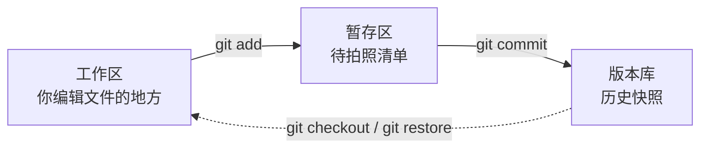

# 04. 拿捏 Git 与 GitHub<!-- omit in toc -->

**定位**：从零开始掌握版本控制和开源协作，让你的代码有历史、有备份、有观众。

**核心目标**：学完本课程，你将能独立用 Git 管理自己的项目，用 GitHub 开源发布你的代码，并参与开源社区的协作。

---

## 目录<!-- omit in toc -->

- [前言：为什么你的代码需要一个“时光机”](#前言为什么你的代码需要一个时光机)
- [第一章：Git 是什么？——你的代码时光机](#第一章git-是什么你的代码时光机)
  - [1.1 没有 Git 的世界：毕业论文的地狱版本号](#11-没有-git-的世界毕业论文的地狱版本号)
  - [1.2 Git 是如何实现版本管理的？](#12-git-是如何实现版本管理的)
  - [1.3 Git 和 GitHub 是什么？](#13-git-和-github-是什么)
  - [1.4 安装 Git](#14-安装-git)
  - [1.5 仓库是什么？—— `git init` 创建你的第一个仓库](#15-仓库是什么-git-init-创建你的第一个仓库)
- [第二章：第一次提交 —— 你的代码里程碑](#第二章第一次提交--你的代码里程碑)
  - [2.1 工作区、暂存区、版本库：Git 的三个“房间”](#21-工作区暂存区版本库git-的三个房间)
  - [2.2 添加文件到暂存区：`git add` 到底做了什么](#22-添加文件到暂存区git-add-到底做了什么)
  - [2.3 查看文件状态：`git status` 告诉你什么变了](#23-查看文件状态git-status-告诉你什么变了)
  - [2.4 提交：`git commit` 把改动写进历史](#24-提交git-commit-把改动写进历史)
  - [2.5 提交说明怎么写：好习惯从第一条 `commit message` 开始](#25-提交说明怎么写好习惯从第一条-commit-message-开始)
  - [2.6 修改文件和提交：重复上面的循环](#26-修改文件和提交重复上面的循环)
  - [2.7 动手：给守夜者笔记仓库做第一次提交](#27-动手给守夜者笔记仓库做第一次提交)
- [第三章：查看历史——你的代码都经历了什么](#第三章查看历史你的代码都经历了什么)
  - [3.1 `git log`：查看所有提交记录](#31-git-log查看所有提交记录)
  - [3.2 `git diff`：看看你改了哪一行](#32-git-diff看看你改了哪一行)
  - [3.3 `git show`：查看某一次提交的具体内容](#33-git-show查看某一次提交的具体内容)

<!--
  - [3.4 动手：查看守夜者笔记的提交历史](#35-动手查看守夜者笔记的提交历史)
- [第四章：撤销与回滚——后悔药怎么吃](#第四章撤销与回滚后悔药怎么吃)
  - [4.1 修改最后一次提交：`git commit --amend`](#41-修改最后一次提交git-commit---amend)
  - [4.2 撤销 `git add`：把文件从暂存区撤回来](#42-撤销-git-add把文件从暂存区撤回来)
  - [4.3 撤销工作区的修改：`git restore` 找回被改坏的文件](#43-撤销工作区的修改git-restore-找回被改坏的文件)
  - [4.4 回滚到历史版本：`git reset` 和 `git revert` 的区别](#44-回滚到历史版本git-reset-和-git-revert-的区别)
  - [4.5 动手：故意把代码改坏，再把它救回来](#45-动手故意把代码改坏再把它救回来)
- [第五章：分支——平行世界的你](#第五章分支平行世界的你)
  - [5.1 为什么需要分支：同时写教程和修 bug 的场景](#51-为什么需要分支同时写教程和修-bug-的场景)
  - [5.2 创建和切换分支：`git branch` 和 `git checkout`](#52-创建和切换分支git-branch-和-git-checkout)
  - [5.3 合并分支：`git merge` 把两条线合成一条](#53-合并分支git-merge-把两条线合成一条)
  - [5.4 解决冲突：当两条分支改动了同一个文件](#54-解决冲突当两条分支改动了同一个文件)
  - [5.5 分支策略：`main` 放稳定版，`dev` 放开发版](#55-分支策略main-放稳定版dev-放开发版)
  - [5.6 动手：在分支上写教程，写完了合并回主线](#56-动手在分支上写教程写完了合并回主线)
- [第六章：GitHub——把你的代码托管到云上](#第六章github把你的代码托管到云上)
  - [6.1 什么是 GitHub：不只是代码仓库，还是程序员的社交网络](#61-什么是-github不只是代码仓库还是程序员的社交网络)
  - [6.2 注册 GitHub 账号，创建你的第一个远程仓库](#62-注册-github-账号创建你的第一个远程仓库)
  - [6.3 关联远程仓库：`git remote add` 和 `git push`](#63-关联远程仓库git-remote-add-和-git-push)
  - [6.4 推送和拉取：`git push` 和 `git pull` 的完整循环](#64-推送和拉取git-push-和-git-pull-的完整循环)
  - [6.5 动手：把《守夜者之书》推送到 GitHub](#65-动手把守夜者之书推送到-github)
- [第七章：协作——和其他人一起写代码](#第七章协作和其他人一起写代码)
  - [7.1 Fork：把别人的仓库复制到自己的账号下](#71-fork把别人的仓库复制到自己的账号下)
  - [7.2 Clone：把远程仓库拉取到本地](#72-clone把远程仓库拉取到本地)
  - [7.3 Pull Request：向原仓库贡献你的修改](#73-pull-request向原仓库贡献你的修改)
  - [7.4 Issues：提 bug、提建议、讨论问题的地方](#74-issues提-bug提建议讨论问题的地方)
  - [7.5 开源协作礼仪：如何礼貌地参与一个开源项目](#75-开源协作礼仪如何礼貌地参与一个开源项目)
  - [7.6 动手：Fork 一个开源项目，提交你的第一个 Pull Request](#76-动手fork-一个开源项目提交你的第一个-pull-request)
- [第八章：GitHub Pages——免费的静态网站托管](#第八章github-pages免费的静态网站托管)
  - [8.1 什么是 GitHub Pages：你的仓库就是一个网站](#81-什么是-github-pages你的仓库就是一个网站)
  - [8.2 发布你的 README 为网站](#82-发布你的-readme-为网站)
  - [8.3 用 GitHub Pages 搭建你的个人博客](#83-用-github-pages-搭建你的个人博客)
  - [8.4 动手：把《守夜者之书》发布到 GitHub Pages](#84-动手把守夜者之书发布到-github-pages)
- [第九章：Git 高级技巧——那些让你效率翻倍的命令](#第九章git-高级技巧那些让你效率翻倍的命令)
  - [9.1 `.gitignore`：告诉 Git 哪些文件不用管](#91-gitignore告诉-git-哪些文件不用管)
  - [9.2 `git stash`：暂存当前未完成的工作](#92-git-stash暂存当前未完成的工作)
  - [9.3 `git rebase`：整理你的提交历史](#93-git-rebase整理你的提交历史)
  - [9.4 `git tag`：给重要版本打标签](#94-git-tag给重要版本打标签)
  - [9.5 动手：整理《守夜者之书》的提交历史，发布第一个版本标签](#95-动手整理守夜者之书的提交历史发布第一个版本标签)
- [第十章：总结与展望](#第十章总结与展望)
  - [10.1 你学会了什么？](#101-你学会了什么)
  - [10.2 接下来怎么继续练习 Git 和 GitHub？](#102-接下来怎么继续练习-git-和-github)
  - [10.3 用 Git 管理你的所有项目](#103-用-git-管理你的所有项目)
-->

---

## 前言：为什么你的代码需要一个“时光机”

*Kate 在 03 学完了 Vim。她看着自己电脑上那些文件——`毕业论文_最终版.doc`、`毕业论文_最终版2.doc`、`毕业论文_打死也不改版.doc`——摇了摇头。她说：*

> *“这些文件名……我以前就是这么存文档的。每一版都另存一个新文件，文件名字越来越长，最后自己也分不清哪一版才是最新的。改了一次，怕改坏了，又不敢把旧文件删掉——结果桌面上堆了十几个版本。”*
>
> “你现在知道你缺什么了吗？”
>
> *“一个能帮我记住每一版改了什么的工具？”*
>
> “对。它叫 Git。你用 Markdown 写笔记、用 VS Code 编辑、用 Vim 在服务器上改配置——但你没有 Git，你的所有文件都是‘一次性’的。改坏了就是改坏了，没有后悔药。Git 给你的文件装上时光机。”

**为什么你需要 Git？**  

你写笔记、写教程、写代码——文件在变。今天加一段，明天删一行，后天改个错别字。没有 Git，你只能用“另存为”来保存不同版本。三个月后你回头找“昨天下午那个还没改崩的版本”，发现桌面上有 15 个文件，名字从 `最终版` 到 `最终版7` 到 `打死也不改版` 到 `真的不改版` 到 `再改是狗`。

Git 把你从这种泥潭里拉出来。它记录的是**修改历史**，不是文件的完整副本。你每完成一次阶段性改动，就做一次“提交”（commit）。Git 记录下这次提交的所有修改——哪个文件改了、改了哪一行、什么时候改的、谁改的。以后任何时候，你可以回顾任何一次提交，对比任意两次提交之间的差异，把文件恢复到任何一个历史状态。你不再需要“另存为”了——你只需要做一次提交，Git 就帮你记住了那一刻的文件状态。

但 Git 的价值不只在于“后悔药”。Git 还有一个更深远的意义：**让协作成为可能**。你不是一个人在写东西。你和其他人共同维护一个项目——每个人在自己的电脑上修改文件，通过 Git 把修改合并到一起，同时保留每个人改了什么、什么时候改的、为什么这样改。没有 Git，协作只能靠“发文件给我，我改完发给你”。有了 Git，全世界几百万程序员可以同时维护同一个项目——你能想象这是怎么办到的吗？答案就在这本教程里。

**这本教程怎么带你学 Git？**  

Git 的核心操作不多——`init`、`add`、`commit`、`log`、`diff`、`restore`、`branch`、`merge`、`push`、`pull`。十个命令，覆盖了你 90% 的工作。但 Git 不是靠背命令学会的。它是一套**工作流**——一种组织文件修改的方式。你需要在一个真实的项目里反复练习，直到这些命令成为你的肌肉记忆。

每一个学 Git 的人都应该在真实项目上练习。这本教程的每一个“动手”环节都围绕**《守夜者之书》仓库**展开。第一章你创建仓库，第二章你第一次提交，第三章你查看历史，第四章你撤销和回滚，第五章你在分支上写教程，第六章你把它推送到 GitHub，第七章你参与开源协作，第八章你把它发布成网站，第九章你整理提交历史、发布版本标签。

到第十章结束时，你的《守夜者笔记》仓库已经推送到了 GitHub，有了完整的提交历史，甚至被发布到了 GitHub Pages。你不再是一个只会写文件的作者——你是一个用 Git 管理项目、用 GitHub 托管项目、用 Pull Request 参与开源协作的开发者。

**前置知识**  

你不需要任何编程基础。你只需要会使用终端——在 05 第三章你已经学过基本的命令行操作，知道怎么 `cd` 切换目录、怎么输入命令、怎么看输出。你在 01 学过 Markdown，你的所有笔记和教程都是 `.md` 文件。Git 天生适合管理 Markdown 文件——纯文本格式让 Git 能精确追踪每一行改动，你在 01 里踩过的 Markdown 空格坑，Git 一眼就能帮你找出来。

**怎么学？**  

每一章先讲概念，再动手练习。概念部分只讲你当下需要知道的——不多也不少。动手部分用《守夜者之书》仓库做主线项目，每一步都踩在前一步的基础上。

你不需要一次全懂。Git 的学习曲线不是一条直线——它像爬山，有一些陡坡。`分支`和`合并`是很多人的卡点。没关系，卡住了就回到动手环节，把命令再敲一遍。Git 不是在脑子里学会的，是在手指上学会的。

> *Kate 打开终端，看到光标在闪。她说：“来吧，给我的《守夜者笔记》装上时光机。”*
>
> *“好。第一章，我们先认识一下 Git——你的代码时光机。”*

---

## 第一章：Git 是什么？——你的代码时光机

*Kate 在前言里看到了那些“毕业论文_最终版.doc”的故事。她问了一个问题：*

> *“我确实在用‘另存为’管理版本，而且效果很糟。但 Git 真的能解决这个问题吗？它到底是怎么记录我的每一次修改的？”*
>
> “好问题。这一节先让你看到没有 Git 的世界有多痛苦，然后告诉你 Git 是怎么把这个问题解决掉的。”

---

### 1.1 没有 Git 的世界：毕业论文的地狱版本号

假如你在写毕业论文。第一天，你写好了初稿，保存为 `论文.doc`。

- 第二天，导师说“第一章的引言要改一下”。你改了，怕改坏，把新版本另存为 `论文_修改版.doc`。

- 第三天，导师说“引用格式不对”。你改了，又另存为 `论文_修改版2.doc`。

- 第四天，导师说“参考文献太少，加十篇”。你改了，又另存为 `论文_修改版3.doc`。

- 第五天，导师说“还是用回修改版2的引言，但保留修改版3的参考文献”。你打开 `论文_修改版2.doc`，复制引言，打开 `论文_修改版3.doc`，粘贴引言，重新整理，另存为 `论文_最终版.doc`。

- 第六天，导师说“这个最终版的基础还是有问题，用回修改版1，但加上修改版2的第三章”。你开始打开三个文件对照着看，眼睛在三个窗口之间来回扫，试图手动合并不同版本的优点。此时你的桌面上有：

```text
论文.doc
论文_修改版.doc
论文_修改版2.doc
论文_修改版3.doc
论文_最终版.doc
论文_最终版2.doc
论文_打死也不改版.doc
论文_真的不改版.doc
论文_再改是狗.doc
```

九个文件，每个文件里都有一些“这一段是好的，那一段是废的”。你不知道哪个文件是最新的，不知道哪个文件里哪个段落是你要的，不知道“修改版2”和“最终版”之间到底差了什么。你只知道一件事：**再这样下去要疯了。**

> *Kate 说：“我看着我自己的桌面——就是这样的。每个版本都留着，因为不敢删。但每个版本之间差了哪几行，我完全不知道。我只能一个一个打开对比。”*
>
> “这就是没有 Git 的世界。你保存的是文件的**完整副本**——每个版本都是完整的一份，版本之间差了什么，全靠你肉眼对比。文件越多，越乱，越不敢删，越不知道哪个是最新的。”

**Git 解决这个问题的方式完全不同。**

Git 不保存“完整副本”。它保存的是**修改记录**。

你写好了初稿，做一次提交——Git 记录下整个文件的当前状态，给它拍了一张“快照”，标上“这是第一版”。

你改了引言，做一次提交——Git 记录下**你改了哪些行**，以及“这是第二版，基于第一版改的”。

你改了引用格式，做一次提交——Git 记录下**你改了哪些行**，以及“这是第三版，基于第二版改的”。

你加了十篇参考文献，做一次提交——Git 记录下**你改了哪些行**，以及“这是第四版，基于第三版改的”。

现在你可以做这些事：

- **查看任何一个历史版本**：一条命令，回到“第一版”的状态——初稿，什么都没有改。
- **对比任意两个版本**：一条命令，显示“第二版和第三版之间到底差了什么”——哪一行被改了、改成什么了。
- **回到任何一个版本**：你觉得第四版写砸了，一条命令，文件恢复到第三版。
- **合并不同版本的修改**：导师说“用第三版的引言，但要保留第四版的参考文献”——Git 帮你自动合并，你只需要处理冲突的部分。

你的桌面上不再有九个文件了。你只有一个文件——`论文.md`（用 Markdown 写，你已经在 01 学过了）。和它一起的，是一长串提交记录，每条记录都告诉你“这次改了什么、为什么改、什么时候改的”。这不是九个文件——这是一条时间线。你可以在时间线上自由穿梭。

> *Kate 说：“所以 Git 不是‘自动保存’——自动保存是保存最新版。Git 是保存**每一个版本**，并且记住版本之间的关系。我把论文比作一条河，Git 就是河上的桥——我可以在任何一个桥墩上停下来，看看那时候河水的样子。”*

---

### 1.2 Git 是如何实现版本管理的？

*Kate 在上一节看到了 Git 能做什么。她靠在椅背上，想了一会儿，然后说：*

> *“我知道了 Git 能回到任何历史版本、能对比不同版本的差异。但我有点好奇——它到底是怎么做到的？它是不是把我的每个版本都完整存了一份？那我的硬盘不是早就爆了？”*
>
> “这个问题问得很有档次。Git 的实现方式确实不是‘每个版本存一份完整副本’。它用了一套很巧妙的设计。我不给你讲代码，只讲思想——这套思想，是你理解 Git 所有行为的关键。”

**核心思想：快照，而不是差异**  

大多数版本管理系统的思路是：**记录文件每次改了什么**。就像记账：

```text
版本1：有 A、B、C 三个文件
版本2：A 文件第 3 行加了 xxx，B 文件删了
版本3：C 文件改了 yyy
```

Git 不这么干。Git 的思路是：**每次提交，直接给整个项目拍一张“全家福”。**

你没看错，是**整个项目**。所有文件的当前状态，咔嚓一下，全存下来。

这时候你肯定想：这不得把硬盘撑爆？

这就是 Git 最精妙的地方。

**文件的“身份证”：内容指纹**  

Git 不给文件起名字——它给每个文件的**内容**计算一串独特的字符。这串字符叫“哈希值”。它有两个特性：

1. **唯一性**：同样的内容，永远算出同一串字符。内容哪怕改了一个标点，算出来的字符就完全不一样了。
2. **不可逆**：从这串字符反推不出文件内容。

这串字符，就成了文件内容的“指纹”。指纹一样，内容就一样。指纹不一样，内容一定改过了。

**怎么存？——“只要指纹没变，就不用再存一遍”**  

当你提交一个新版本时，Git 会遍历项目里所有文件：

- **对于内容没变的文件**：它的指纹跟上一个版本一样。Git 说：“这个文件我仓库里已经有了，不用再存了，记个引用就行。”
- **对于内容变了的文件**：计算新的指纹，把新内容存进去。

所以，你看起来 Git 给每个版本都拍了“整个项目的快照”，实际上，**那些没变动的文件，只是在新快照里记了个引用，并没有占用新的存储空间。**

这就像你每年拍一张全家福。照片上的人，今年和去年长得一样，就不用重新“制造”这个人——在照片上标注“还是去年那个人”就行。只有变了的人，才需要更新。

**版本本身长什么样？——一条链子**  

每次提交，Git 都会创建一个“提交记录”。这个记录里存着四样东西：

1. 这个版本的项目快照——项目里所有文件的指纹
2. 作者和时间——谁在什么时候提交的
3. 提交说明——你写的 commit message
4. **指向上一个版本的指针**——关键！它记住了“我是基于哪一个版本改出来的”

这个“指向上一个版本”的设计，让所有版本串联成了一条链子：

```text
A → B → C → D
↑   ↑   ↑   ↑
v1  v2  v3  v4
```

每个节点都是那个时刻完整项目的快照。你想回到 B 版本？Git 只需要找到 B 这个提交记录，然后根据它记录的文件指纹，把所有文件还原出来。

这就是**时空穿越**的本质。不是“撤销”了改动，而是重新“播放”了那个瞬间的一切。

**分支：只是一个会移动的指针**  

你之前听过“分支”这个词吗？在 Git 里，分支简单得让人吃惊。

Git 有一个特殊指针叫 `HEAD`，它指向你当前在哪个位置。而一个分支名（比如 `main`、`dev`），本质上就是一个**指向某个提交记录的指针。**

当你新建一个分支并提交时：

- Git 创建一个新的提交记录，它的“上一个版本”指向你当时所在的那个版本
- 然后把分支指针移到这个新提交上

两个分支共享着相同的“历史基础”，只是因为指针指向了不同的提交，就可以各自往下生长。分支不是一个副本——它只是一个标签，贴在某一个版本上。

**合并为什么通常很轻松？**

因为 Git 的合并，不是比对你的文件和我的文件“哪里不一样”。而是：

> **找到两个分支的共同起点，然后看：**  
> “从起点到我，改了这些文件。”  
> “从起点到你，改了这些文件。”  
>
> ——如果我们改的是不同文件，或者同一个文件的不同位置，Git 直接自动合并。只有我们改了同一个文件的同一行，Git 才会说：“我搞不定了，你来吧。”（这就是“冲突”。）

**总结：Git 的版本管理，是一套“基于内容指纹的智能档案库”**  

它不是给文件编号，不是存差异，而是：

> **用文件内容的指纹作为索引，构建了一个“只要没变，就不用重存”的智能档案库。然后用链子组织版本，用指针管理分支。**

所以，Git 的仓库为什么这么“瘦”？因为它**几乎不存重复的东西**。为什么可以随便建分支？因为**分支只是一个指针，几乎是零成本**。为什么可以飞速穿梭历史？因为它还原一个版本，就是把那个时刻的“文件指纹”指过去——瞬间完成。

你所有的代码、回滚、分支、合并，背后都是这套优雅的、基于指纹的“时空档案系统”在默默运转。

从这个角度看，Git 与其说是一个版本管理工具，不如说是一座用指纹建造的“时间博物馆”。每一个 commit，都是那个时刻你项目的完美复制品，静静地躺在馆里，等待你随时穿越回去。

> *Kate 听完，沉默了几秒。然后她说：“所以 Git 不存重复的东西——它只存变化的文件。没变的文件，它就记一句‘和上个版本一样’。这就像一个聪明的图书管理员，不会把同一本书抄十遍，只是在目录里标注‘这本书在 A 书架第三层’。”*
>
> “对。而且这个图书管理员有一双极其敏锐的眼睛——文件内容哪怕改了一个标点，它都能立刻认出来。凭的就是那个内容指纹。指纹一样就是一样，不一样就是不一样，没有模棱两可。”
>
> *“……那这个图书管理员住在我电脑上吗？我怎么才能用到它？”*
>
> “它确实住在你电脑上——但它不是图形界面，是一个命令行工具。而且它有一个孪生兄弟叫 GitHub，专门负责把你的时间博物馆放到网上，让全世界都能看到。下一节，我们先把 Git 和 GitHub 这两个东西分清楚，然后把它们请到你的电脑上。”

下一节，我们要学习 **Git 和 GitHub 是什么**——一个是你电脑上的版本管理工具，一个是托管仓库的网站。很多人把它俩混为一谈，但它们是完全不同的两样东西。🔪

---

### 1.3 Git 和 GitHub 是什么？

> *“我大概明白了——Git 是一个聪明的图书管理员，用指纹识别文件变化，给项目建了一座时间博物馆。但我还有一个问题：Git 和 GitHub 是一回事吗？我总听人把这两个词连在一起说，好像它们是同一个东西。”*
>
> “好问题。这一节把这两个名字拆开，顺便说说 Git 是从哪来的。”

#### 1.3.1 什么是版本管理？<!-- omit in toc -->

在讲 Git 和 GitHub 之前，先把“版本管理”这个词说清楚。你在 1.1 节已经感受过没有版本管理的痛苦——九个毕业论文文件，不知道哪个是最新的。版本管理，就是**帮你管理文件每一次改动的工具**。

你写的每一篇笔记、每一章教程、每一段代码，都在不停变化。今天加一段，明天删一行，后天改个错别字。版本管理工具负责记录这些变化——什么时候改的、改了哪里、改成什么了。让你随时可以回头查看“昨天下午那个还没改崩的版本”，对比“这一版和上一版差了什么”，甚至在改坏了的时候一键回到历史状态。

于是你想，如果有一个这样的一个软件，不但能自动帮我记录每次文件的改动，还可以让导师协作编辑，这样就不用自己管理一堆类似的文件了，也不需要把文件传来传去。如果想查看某次改动，只需要在软件里瞄一眼就可以，岂不是很方便？

这个理想软件用起来就应该像这个样子，能记录每次文件的改动：

| 版本 | 文件 | 用户 | 说明 | 日期 |
| :--- | :--- | :--- | :--- | :--- |
| 1 | 论文.doc | Kate | 写好了初稿 | X 月 X 日 |
| 2 | 论文.doc | 导师 | 改了第一章的引言要 | X 月 X 日 |
| 3 | 论文.doc | Kate | 更改引用格式 | X 月 X 日 |
| 4 | 论文.doc | Kate | 参考文献太少，加十篇 | X 月 X 日 |
| 5 | 论文.doc | Kate | 用回版本 2 的引言，但保留版本 3 的参考文献 | X 月 X 日 |
| 6 | 论文.doc | 导师 | 用回版本 1，但加上版本 2 的第三章 | X 月 X 日 |

这样，你就结束了手动管理多个“版本”的史前时代，真正进入到了版本控制。

Git 是目前最流行的版本管理工具——不是因为它是第一个，而是因为它最好用、最快、最灵活。

---

#### 1.3.2 Git 的起源与历史<!-- omit in toc -->

Git 诞生于 2005 年，作者是 **Linus Torvalds**。

这个名字你你将会在以后读到他的很多故事。1991 年，21 岁的芬兰大学生 Linus 写了一个“业余项目”叫 Linux，发布到网上让所有人免费使用。

*——三十年后，Linux 运行在全世界 90% 以上的服务器上，整个互联网的“地基”就是它。*  

Linus 虽然创建了 Linux ，但 Linux 的壮大是靠全世界热心的志愿者参与的，来自全球几百家公司的几千名开发者为 Linux 编写代码，那 Linux 的代码是如何管理的呢？

*在 2002 年以前，世界各地的志愿者把源代码文件通过 diff 的方式发给 Linus，然后由 Linus 本人通过手工方式合并代码！*  

管理这么大规模的项目，肯定需要一个版本管理工具。

所以到了2002年，Linux 系统已经发展了十年了，代码库之大让 Linus 很难继续通过手工方式管理了，社区的弟兄们也对这种方式表达了强烈不满，于是 Linus 选择了一个商业的版本控制系统 BitKeeper ，BitKeeper 的东家 BitMover 公司出于人道主义精神，授权 Linux 社区免费使用这个版本控制系统。

接下来发生的事情嘛……

> *“到了 2005 年，开发 BitKeeper 的商业公司同 Linux 内核开源社区的合作关系结束，他们收回了 Linux 内核社区免费使用 BitKeeper 的权力。”*
>
> *——Git 官方文档*

但~~根据野史记载~~实际却是社区牛人聚集，不免沾染了一些梁山好汉的江湖习气。Andrew 试图破解 BitKeeper 的协议（这么干的其实也不只他一个），被 BitMover 公司发现了，于是 BitMover 公司怒了，要收回 Linux 社区的免费使用权。

Linus 可以向 BitMover 公司道个歉，保证以后严格管教弟兄们，嗯，这是不可能的。实际情况是这样的：

Linus 用了**两周**时间，用 C 语言写完了 Git 的核心设计。他的目标很明确：**快、分布式、安全**。

- **快**：Git 的哈希快照设计让它在大规模项目上依然飞快。几千名开发者同时提交，Git 处理得过来。
- **分布式**：每个开发者的电脑上都有一份完整的仓库。你可以离线工作，不需要时刻连着服务器。
- **安全**：用内容指纹（哈希值）来验证文件是否被篡改。文件如果被改过，Git 一定能发现。

“Git”这个名字是 Linus 起的。在英式俚语里，“git”是“蠢货”“讨厌的人”的意思。Linus 自嘲说：“我自私，我把我所有的项目都用自己的名字命名。Linux 是 Linus 的，Git 是 git 的。”（这个“git”指的是他自己——他觉得自己就是个“讨厌的蠢货”。）这种自嘲式命名，你以后在 Geek （极客）圈会经常见到——黑客喜欢自嘲。

> *Kate 说：“Linus 用两周写了一个全世界最流行的版本管理工具。而且他还用‘蠢货’给它命名。我在 01 里学 Markdown 的时候，也是冲着‘用键盘排版’去的。这些工具的背后，全是这种‘不高兴就自己造一个’的人。”*
>
> “对。这就是极客精神——Linus 曾说过：‘你不需要在一开始就做出完美的产品。你只需要做出一个让其他人觉得可以用、然后一起把它变得更好的东西。’Git 也是这么来的。他为了自己的需要写了第一版，然后全世界的开发者一起把它变成了今天这个样子。”
>
> *“历史总是这么巧合，如果当年 BitMover 公司没有收回版权……”*
>
> “——那么我们将不会看到现在的 Git。”

---

#### 1.3.3 什么是 GitHub？<!-- omit in toc -->

Git 和 GitHub 不是一回事。很多菜鸟把这两个词混着用，但它们是完全不同的东西。

**Git 是一个工具**——你安装在自己电脑上的一个程序。它负责管理你本地文件的版本历史。你用 Git 做提交、查看历史、创建分支、回滚版本——所有操作都在你自己的电脑上完成，不需要互联网连接。

**GitHub 是一个网站**——一个托管 Git 仓库的在线平台。你在自己电脑上用 Git 管理好项目之后，把整个仓库“推送”（push）到 GitHub 上。GitHub 帮你把仓库托管在云端——你的代码有了一份在线备份，别人也能看到、下载、甚至提交修改。

打个比方：Git 是你的**相机**——拍照、拍视频、存储照片。GitHub 是你的**云相册**——你把照片上传上去，别人能看，你也能随时下载回来。相机和云相册是两个不同的东西——没有相机你拍不了照片，但没有云相册你也能拍照，只是照片只能自己看。

| 维度 | Git | GitHub |
| :--- | :--- | :--- |
| **是什么** | 版本管理工具 | 代码托管网站 |
| **装在哪** | 你自己的电脑上 | 互联网上的远程服务器 |
| **干什么** | 记录文件修改历史 | 存储 Git 仓库，提供协作功能 |
| **需要联网吗** | 不需要 | 必须联网 |
| **其他同类** | 有替代品（Mercurial 等） | 同类网站有 GitLab、Gitee 等 |

**GitHub 不只有托管仓库。** 它还提供了很多 Git 之外的功能：

**Issues（问题追踪）**  

你在 GitHub 仓库里看到了一个问题？点进 Issues 标签，新建一个 Issue，描述你遇到的问题——比如“第三章的链接跳转错了”“这个安装步骤在 Windows 11 上跑不通”。仓库的维护者会看到你的 Issue，回复你、修复问题、关闭 Issue。

**Pull Request（协作的核心）**  

你看到了一个开源项目，想贡献一点自己的修改 —— 修一个 bug、加一个新功能、改一个错别字。你不是仓库的主人，不能直接改它的代码。于是你 Fork 一份到自己的账号下（等于把仓库复制了一份到你的 GitHub），在自己那份里修改，然后提交一个 Pull Request——告诉原仓库的主人：“我做了一些修改，你要不要看看？如果合适，请把我的修改合并进来。”原仓库的主人看到你的请求，审查你的修改，选择接受或拒绝。Pull Request 是开源协作的枢纽——全球所有开源项目的贡献者，都是通过它和项目维护者沟通的。

**Actions（自动化）**  

你可以设置一个工作流——比如每次有人 push 代码，GitHub 自动运行测试、检查代码风格、部署到服务器。Actions 让你把重复性工作交给 GitHub 自动执行。你以后把《守夜者之书》仓库配置成“每次提交自动生成 PDF 版本”，用的就是 Actions。

**Pages（免费静态网站托管）**  

你的仓库可以直接变成一个网站。你把 Markdown 文件转换成 HTML，放进一个叫 `gh-pages` 的分支里，GitHub 自动帮你发布成一个静态网站。你的《守夜者笔记》以后就可以用 Pages 发布成在线教程——读者输入一个网址就能阅读，不需要下载仓库。

这些功能让 GitHub 从“代码仓库”变成了**程序员的社交网络**。你在上面关注别人、给别人的项目点赞（Star）、Fork 别人的代码、参与讨论、贡献代码。你的 GitHub 主页，就是你的程序员名片。

> *Kate 说：“所以 Git 是我电脑里的相机，GitHub 是云相册。我在 01 里给仓库配的徽章、写的 README——那是云相册里的展示页。但我还没学会怎么用相机拍照、怎么把照片传到云相册。”*
>
> “对。但在拍照之前，你手里还没有相机。下一节，我们把相机装上——安装 Git。”

下一节，我们要学习 **安装 Git**——在你的系统上安装 Git，配置你的用户名和邮箱，为第一次提交做准备。🔪

---

### 1.4 安装 Git

> *Kate 在上一节搞清楚了 Git 和 GitHub 的区别。她说：“Git 是相机，GitHub 是云相册——这个比喻我记住了。但我电脑上现在没有相机。我先得把 Git 装上。”*  
>
> “对。装 Git 很快。你只需要根据你的操作系统选一种方式。”

---

#### 1.4.1 Windows 安装 Git<!-- omit in toc -->

打开 PowerShell 或 CMD，输入：

```powershell
winget install Git.Git
```

`winget` 是 Windows 自带的包管理工具。这行命令会从微软的软件仓库下载并安装 Git。

安装完成后，**关闭当前的终端窗口，重新打开一个新窗口**（这一步很重要——不重新打开，终端不会识别新安装的 Git）。然后输入：

```powershell
git --version
```

如果输出版本号（比如 `git version 2.47.x`），安装成功。


---

#### 1.4.2 macOS 安装 Git<!-- omit in toc -->

打开终端，先安装 Homebrew（如果你在 05 第三章已经装过了，跳过这一步）：

```bash
/bin/bash -c "$(curl -fsSL https://raw.githubusercontent.com/Homebrew/install/HEAD/install.sh)"
```

然后用 Homebrew 安装 Git：

```bash
brew install git
```

验证：

```bash
git --version
```

---

#### 1.4.3 Linux 安装 Git<!-- omit in toc -->

在终端里输入：

```bash
sudo apt install git -y
```

验证：

```bash
git --version
```

---

#### 1.4.4 配置你的身份<!-- omit in toc -->

Git 装好之后，你需要告诉它“你是谁”。每一次提交都会附带你的身份信息——用户名和邮箱。这些信息会出现在提交记录里，告诉别人（和未来的你自己）这次提交是谁做的。

在终端里输入：

```bash
git config --global user.name "你的名字"
git config --global user.email "你的邮箱"
```

`--global` 表示这个配置对你的电脑上所有 Git 仓库生效，不只是当前这一个。你只需要配置一次。

你可以用你 GitHub 账号的用户名和邮箱——这样以后推送到 GitHub 时，提交记录会自动关联到你的 GitHub 账号，你的 GitHub 主页上就会显示你的贡献记录（那些绿色的小方块）。

**验证配置是否成功：**

```bash
git config --list
```

会列出你所有的 Git 配置，包括刚刚设置的用户名和邮箱。

> *Kate 输入了 `git config --global user.name "Kate"` 和 `git config --global user.email "kate@example.com"`，然后 `git config --list` 查看了配置。她说：“所以 Git 现在知道我是谁了。以后我做的每一次提交，都会标上我的名字和邮箱。”*
>
> “对。而且这些信息是永久记录在提交历史里的——不管过了多久，别人翻到你的提交记录，都知道那一次是你做的。所以用户名和邮箱要填真实的、你愿意公开的。”
>
> *“……我现在填的是 Kate。我可以用真名吗？”*
>
> “可以，也可以一直用 Kate。取决于你想不想让未来的同事和面试官知道这个仓库是你做的。很多人用真实姓名，也有很多人用网名。这是你的选择。”

---

**修改用户名和邮箱**  

如果配置的时候手滑拼错了，或者以后想换一个名字（比如你之前用真名，现在想换成网名），不需要重新安装 Git——直接重新运行配置命令，新值会覆盖旧值：

```bash
git config --global user.name "新的名字"
git config --global user.email "新的邮箱"
```

改完之后，用 `git config --list` 验证。以后的新提交会使用新的名字和邮箱。注意：**之前已经提交过的历史记录不会改变**——旧提交上仍然显示旧名字。Git 只在新提交里使用新配置。如果你想让旧提交也换成新名字，需要改写历史——那是第九章 `git rebase` 的内容，现在不用管。

**查看单独某一项配置：**

```bash
git config --global user.name
git config --global user.email
```

不需要看整个列表，只查你想看的那一项。

**把默认分支名设为 main**  

Git 的默认分支名曾经是 `master`。2020 年，全球开发者社区发起了一场行动，把它改成了更中性的 `main`——GitHub 随后也采用了 `main` 作为新仓库的默认分支名。但有些版本的 Git 在你电脑本地创建新仓库时，仍然默认使用 `master`。

为了统一，你可以在 Git 配置里设置默认分支名为 `main`：

```bash
git config --global init.defaultBranch main
```

这条命令的意思是：以后每次用 `git init` 创建新仓库，默认分支名都是 `main`，而不是 `master`。你在 5.3 节学分支策略时用到的“主线”，指的就是这个 `main`。

验证配置是否生效：

```bash
git config --global init.defaultBranch
```

看到 `init.defaultbranch=main` 就说明配置成功了。

> *Kate 关掉了终端，又打开了一个新窗口，输入 `git --version`——版本号正常显示。她说：“相机装好了，电池也装上了。接下来怎么拍照？”*
>
> “下一节，我们创建你的第一个 Git 仓库。把你的《守夜者笔记》文件夹变成一个有历史记录的项目。”*

---

### 1.5 仓库是什么？—— `git init` 创建你的第一个仓库

*Kate 在上一节配好了名字、邮箱、默认分支名。她打开终端，盯着一行空白的命令行，说：*

> *“相机装好了。现在怎么拍照？我是不是要先把照片存在一个相册里？”*
>
> “对。那个相册就叫仓库。我们先用 `git init` 创建它。”

---

#### 1.5.1 仓库是什么？<!-- omit in toc -->

仓库（repository，缩写 repo）是 Git 用来存放项目的**一个文件夹**。这个文件夹和普通文件夹的区别只有一点：它里面多了一个隐藏的 `.git` 目录。这个 `.git` 目录是 Git 的“监控室”——你所有的提交记录、分支、配置、文件指纹全存在这里。有了 `.git`，你就能用 Git 追踪这个文件夹里所有文件的变动。

创建仓库的方式就是进入项目文件夹，输入 `git init`。这条命令会在当前文件夹里建好 `.git` 目录，把这个普通文件夹变成 Git 仓库。

> *Kate 说：“听起来好简单——就一个隐藏文件夹。那我之前桌面上那一大堆毕业论文文件夹，其实只要在其中一个里面输入 `git init`，它就能变成仓库了？”*
>
> “对。而且这个 `.git` 目录很轻量。你在 1.2 节学过 Git 用文件指纹去重，所以 `.git` 里不会存一堆重复副本。”

---

#### 1.5.2 动手：创建你的第一个仓库<!-- omit in toc -->

**第一步：创建一个项目文件夹**  

在你的电脑上找一个你找得到的地方（比如桌面或 `D:\Dev\Git`），创建一个文件夹。我们给它起名叫 `my-first-repo`：

```bash
mkdir my-first-repo
```

**第二步：进入这个文件夹**  

```bash
cd my-first-repo
```

**第三步：初始化仓库**  

```bash
git init
```

终端会显示类似这样的输出：

```bash
Initialized empty Git repository in /path/to/my-first-repo/.git/
```

这句话的意思：“在这个文件夹里创建了一个空的 Git 仓库。”

**第四步：验证 `.git` 目录已经创建**  

输入：

```bash
ls -a
```

`-a` 参数让 `ls` 显示隐藏文件。你会看到：

```text
.  ..  .git
```

那个 `.git` 目录就是 Git 的监控室。你的文件夹现在是一个 Git 仓库了。

> *Kate 在终端的输出里看到 `.git`，说：“这就完了？就三行命令，我的文件夹就变成仓库了？我还以为要填一堆表格、做一堆配置。”*
>
> “就这三行。Git 的很多操作都是这样——命令很短，但每一行都在做一件具体的事。`mkdir` 建文件夹，`cd` 进去，`git init` 变成仓库。”

---

#### 1.5.3 仓库里什么还没有？<!-- omit in toc -->

`git init` 创建的仓库是**空的**。它知道你要开始追踪文件了，但还没有追踪任何文件。你的项目文件夹里目前也什么都没有——没有 README，没有笔记，没有代码。接下来的章节，你会往这个文件夹里放文件，用 `git add` 把它们加入追踪，用 `git commit` 把它们的当前状态拍成快照。

> *Kate 用 `ls -a` 确认了 `.git` 目录存在，然后问：“那我现在这个仓库里有历史吗？”*
>
> “还没有。一个空仓库，连一次提交都没有。它像一个刚开张的博物馆——建筑建好了，但展厅里一件展品都没有。下一章，我们往里面放第一件展品，然后给它拍第一张快照。”
>
> *“……拍照之前，我得先知道怎么拍。”*
>
> “这就是第二章的内容。`git add` 把文件放进相机的取景框，`git commit` 按下快门。这两条命令，是你以后每一天都会用到的核心。你的第一张照片，就是你的代码的第一个里程碑。”

下一章，我们要学习**第二章：第一次提交——你的代码里程碑**。你将把文件加入 Git 的追踪，创建你的第一次提交，在自己的仓库里留下第一个历史节点。🔪

---

## 第二章：第一次提交 —— 你的代码里程碑

*Kate 在第一章创建了她的第一个 Git 仓库。她用 `ls -a` 看到了 `.git` 目录，但她心里有个疑问：*

> *“仓库是空的，`.git` 是监控室。那我现在写一个文件进去，Git 是怎么‘看到’它的？我改了文件，Git 又是怎么‘记住’这个改动的？我总觉得里面有个黑箱子，我不知道东西是怎么流动的。”*
>
> “你的直觉没错——Git 确实有一套‘三个房间’的工作流。理解了这三个房间，Git 的所有操作就不再神秘了。”

---

### 2.1 工作区、暂存区、版本库：Git 的三个“房间”

Git 用“快照”来记录版本。但快照不是自动拍的——你需要手动告诉 Git“什么时候拍”。在“你改了文件”和“快照被拍下”之间，文件经过了三个不同的区域。理解这三个区域，你就理解了 Git 的核心工作流。

#### 2.1.1 三个“房间”分别是什么？<!-- omit in toc -->

想象你在家写作业。书桌上摊着你的本子和笔，你正在写。写完了，你把本子装进书包。第二天，老师把作业收走，登记在一个册子里。

Git 的工作流和这个过程几乎一样。它把文件的存放位置分成了三个“房间”：

**第一个房间：工作区（你的书桌）**  

工作区就是你的项目文件夹。你在里面写的所有文件、做的所有修改——现在正在发生的改动，都发生在工作区里。你用 VS Code 打开 `my-first-repo` 文件夹，创建一个 `README.md`，在里面写一行字，保存。这个时候，你的 `README.md` 文件就在工作区里，Git 看到了它，但还没有把它记录到任何地方。

工作区是三个房间里最“随意”的一个。你可以随便改、随便删、随便新建文件。Git 不会拦着你，也不会自动替你保存什么。你的文件在工作区里的每一次变化，都只是“发生了一次变化”，并没有被 Git 记住。

如果这个时候你的电脑断电了，你刚写的那行字就丢了——因为 Git 还没把它记下来。工作区里的东西是“裸奔”的，没有任何历史保护。

**第二个房间：暂存区（你的书包）**  

暂存区是工作区和版本库之间的中转站。它的作用是：让你决定“哪些改动要提交，哪些暂时不提交”。

你改了三个文件，但其中两个是写好的，一个还写到一半。你不想把写到一半的文件提交上去。于是你用一条命令——`git add 文件名`——把写好的那两个文件“放进了暂存区”。暂存区就像一个清单，里面记着“这两个文件的改动，我已经准备好了”。

另外那个还没写完的文件留在工作区，继续改。

暂存区可以理解成你在超市买东西时的小推车。货架上是工作区，你在货架上挑挑拣拣，把想要的东西放进小推车（暂存区）。结账时，收银员只扫描你小推车里的东西——货架上没拿进小推车的，不会被结账。

**第三个房间：版本库（老师的登记册）**  

版本库就是 `.git` 目录。你每次提交——用一条叫 `git commit` 的命令——Git 会把暂存区里的所有内容打包成一张快照，永久地存进版本库。从这一刻起，这个版本就进入了 Git 的历史记录。你可以查看它、对比它、回滚到它。

版本库是三个房间里最“安全”的一个。东西一旦进去，就永远不会丢。即使你之后把文件改坏了、删掉了，你随时可以从版本库里把它找回来。

---

#### 2.1.2 文件是怎么在三个房间之间流动的？<!-- omit in toc -->

把这个流程画出来，它长这样：



你写文件 → 用 `git add` 把它放进暂存区 → 用 `git commit` 把暂存区的内容拍成快照存进版本库。这就是 Git 的完整工作流。你以后每一天都会在这个流程里循环。

> *Kate 在笔记本上画了三个方格，用箭头连起来。她说：“所以文件先在工作区被修改，然后我用手推车（`git add`）把它推到暂存区，最后结账（`git commit`）把暂存区里的所有东西打包成一张快照，存进版本库。一次提交就是一个结账动作。”*
>
> “这个比喻可以。不过有个细节要记住：`git commit` 只提交暂存区里的东西。工作区里没被 `git add` 的改动，不会被提交。所以每次提交前，你都要先想清楚——哪些改动该进去，哪些该留在工作区继续改。”*
>
> *“……这就像我结账前，先检查一下小推车里都有什么。”*
>
> “而且 Git 还提供了一条命令，专门帮你看清楚小推车里现在有什么——`git status`。下一节，我们看看这条命令怎么用。”*

---

### 2.2 添加文件到暂存区：`git add` 到底做了什么

*Kate 在上一节理解了三个“房间”的概念。她看着自己空空的 `my-first-repo` 文件夹，说：*

> *“我懂了——文件先在工作区被修改，然后用 `git add` 放进暂存区，最后 `git commit` 提交到版本库。但我现在还不知道 `git add` 具体要输入什么。它怎么知道我要添加哪个文件？”*
>
> “`git add` 后面要跟文件名。它做的只有一件事：把指定的文件加入暂存区，告诉 Git‘这个文件的改动我准备好了’。”

#### 2.2.1 在动手之前，先建一个文件<!-- omit in toc -->

你的 `my-first-repo` 文件夹现在是空的。先用 VS Code（或者随便什么编辑器）在里面创建一个文件 `README.md`，写入一行：

```markdown
# 我的第一个 Git 仓库
```

保存。现在你的工作区里有一个 `README.md` 文件。Git 能看到这个文件，但还没有开始追踪它——这个文件还没有被加入任何历史记录。它只是躺在工作区里的一个“未被追踪”的新文件。

#### 2.2.2 执行 `git add`<!-- omit in toc -->

在终端里输入：

```bash
git add README.md
```

这条命令把 `README.md` 加入暂存区。暂存区里现在有了一条记录：“`README.md` 这个文件已经准备好提交了”。文件内容本身还没有进入历史——它只是被标记为“准备就绪”。

**`git add` 后面跟文件名**。文件名要写完整，包括后缀——`README.md`，不是 `README`。如果文件名有空格，用双引号包起来。

你可以一次添加多个文件：

```bash
git add 文件1 文件2 文件3
```

也可以一次添加当前文件夹里的所有文件：

```bash
git add .
```

`.` 表示当前目录。这条命令把当前文件夹里所有改动的文件全部添加进暂存区。你以后写教程、写代码时，最常用的就是 `git add .`——改完一批文件，全部添加，然后提交。

但注意：**`git add .` 是把所有改动全部添加。如果你有某个文件不想提交，就不要用 `.`**，用 `git add 文件名` 一个一个添加，跳过不想提交的那个。

> *Kate 在终端里输入了 `git add README.md`，没有任何输出——终端只是安静地回到了命令行提示符。她说：“这就完了？它什么都没说，我怎么知道文件真的进暂存区了？”*
>
> “Git 的哲学是‘没有消息就是好消息’。如果命令执行成功，Git 通常什么也不说。如果出错了，它会明确告诉你哪里错了。你想确认文件有没有进暂存区，需要另一条命令——它专门帮你查看‘现在文件都在哪个房间’。下一节，我们讲这条命令。”

#### 2.2.3 小结<!-- omit in toc -->

| 命令 | 作用 | 什么时候用 |
| :--- | :--- | :--- |
| `git add 文件名` | 把指定的文件加入暂存区 | 你只改了这一个文件 |
| `git add 文件1 文件2` | 把多个文件加入暂存区 | 你改了这几个文件，但还有其他文件没改完 |
| `git add .` | 把当前文件夹里所有改动加入暂存区 | 你改完了一批文件，全部准备提交 |

> *Kate 在笔记本上写下了这三条命令。她说：“所以 `git add` 后面跟的就是文件名——和 `cp`、`mv` 那些命令一样，后面跟操作对象。`git add .` 是特殊情况——`.` 代替了所有文件。”*
>
> “对。`git add` 和 `git commit` 是 Git 最重要的两条命令。你现在学会了第一条。但文件还停在暂存区——它还没有真正进入历史。下一步，就是 `git commit`。”

---

### 2.3 查看文件状态：`git status` 告诉你什么变了

*Kate 在上一节输入了 `git add README.md`，但终端什么都没输出。她不知道文件到底有没有进暂存区。她说：*

> *“上个问题你还没回答我——我怎么知道 `git add` 成功了？”*
>
> “用 `git status`。这条命令是 Git 里最常用的诊断工具。它告诉你每个文件现在在哪个房间。”

#### 2.3.1 `git status` 告诉你三件事<!-- omit in toc -->

`git status` 的核心作用就一个：**查看当前仓库的状态**。具体来说，它告诉你：

1. **你当前在哪个分支**——第一行 `On branch main` 告诉你
2. **有哪些文件被改动但还没放进暂存区**——这些改动还在工作区
3. **有哪些文件已经在暂存区里等待提交**

```bash
git status
```

现在你的仓库状态是——`README.md` 已经被 `git add` 进了暂存区。运行 `git status`，你会看到：

```bash
On branch main

No commits yet

Changes to be committed:
  (use "git rm --cached <file>..." to unstage)
  new file:   README.md
```

我们一行一行拆开看：

**`On branch main`**——你当前在 `main` 分支上。你在第一章配置过默认分支名，所以这里显示的是 `main`。

**`No commits yet`**——这个仓库还没有任何提交。你的 `README.md` 还在暂存区，还没有进入版本库。

**`Changes to be committed:`**——这是最重要的部分。它下面列出的所有文件，都已经在暂存区里了——它们是你“准备提交”的改动。

**`new file:   README.md`**——`README.md` 是一个新文件。Git 之前从没见过它，现在你把它加入了暂存区，它变成了一个“待提交的新文件”。

> *Kate 盯着 `new file: README.md` 这行字，说：“所以 `git status` 就是我的‘三房间地图’——它告诉我，README.md 已经不在工作区里裸奔了，它已经进了暂存区。那个 `new file:` 就是 Git 给它贴的标签，意思是‘这是新来的’。”*
>
> “对。`new file:` 是 Git 对文件状态的一种描述。以后你还会见到 `modified:`（被修改的）和 `deleted:`（被删除的）。`git status` 会用不同的标签告诉你每个文件经历了什么变化。”*

---

#### 2.3.2 `git status` 常见的几种状态<!-- omit in toc -->

你在实际写项目的过程中，`git status` 会显示不同的文件状态。以下是你最常遇到的几种：

| 状态 | 含义 | Git 的标签 |
| :--- | :--- | :--- |
| 新文件，还没有加进暂存区 | 在工作区里裸奔 | `Untracked files:` |
| 新文件，已经加进暂存区 | 等待提交 | `new file:` |
| 已追踪文件，被修改但还没加进暂存区 | 改动在工作区 | `Changes not staged for commit:` |
| 已追踪文件，修改后已加进暂存区 | 等待提交 | `modified:` |
| 文件被删除 | 工作区里没有了 | `deleted:` |

---

#### 2.3.3 动手：体验一下工作区改动的状态<!-- omit in toc -->

修改你的 `README.md`，把内容改成：

```markdown
# 我的第一个 Git 仓库

这是第二行。
```

保存。然后运行：

```bash
git status
```

你会看到类似：

```bash
On branch main

No commits yet

Changes to be committed:
  (use "git rm --cached <file>..." to unstage)
  new file:   README.md

Changes not staged for commit:
  (use "git add <file>..." to update what will be committed)
  (use "git restore <file>..." to discard changes in working directory)
  modified:   README.md
```

注意——同一个文件出现了两次：

**第一次**：`new file: README.md`，在 `Changes to be committed:` 下面。这是你刚才 `git add` 的那个版本——一个“新文件”等待提交。

**第二次**：`modified: README.md`，在 `Changes not staged for commit:` 下面。这是你刚才修改的第二行——改动还停留在工作区，还没有被 `git add`。

同一个文件，两个不同版本的改动，分别待在两个不同的房间里。这就是 Git 三个房间模型最直观的体现：暂存区里有一个版本，工作区里有一个更新的版本。你还没有告诉 Git“我连第二行也准备好了”。

> *Kate 盯着两行 README.md，说：“所以 `git status` 帮我看得清清楚楚——暂存区里躺着第一版，工作区里还堆着第二版的改动。一个在包里，一个在桌上。”*
>
> “对。如果你现在执行 `git commit`，只有暂存区里的那个版本会被提交——第一版。第二版的改动还在工作区，不会被拍进快照。想把它也提交，你得再执行一次 `git add README.md`。”*

#### 2.3.4 `git status` 什么时候用？<!-- omit in toc -->

答案是：**任何时候不确定的时候就跑一遍**。提交前跑一遍，看看哪些文件被添加了、哪些漏了。提交后跑一遍，确认工作区干净了。改完文件后跑一遍，看看改动有没有进暂存区。它是 Git 里最安全的命令——只读，不做任何修改。你跑多少次都不会出错。

> *Kate 在笔记本上写下了 `git status`，在旁边画了一个小眼睛，标注“只读命令——随时可以跑”。她说：“这条命令以后会变成我的肌肉记忆，跟保存文件一样频繁。”*
>
> “对。你以后的实际工作流就是：改文件 → `git status` 看看改了什么 → `git add` 添加 → `git status` 确认进包了 → `git commit` 提交 → `git status` 确认工作区干净了。一遍循环，三四次 `git status`。它不是可选工具，是你确认每一步都没走错的检查点。”*

---

### 2.4 提交：`git commit` 把改动写进历史

*Kate 在上一节学会了 `git status`。她的 `README.md` 已经躺在暂存区里，等着最后一步。她看着终端，说：*

> *“文件进书包了，我也确认过了。现在怎么把它交给老师？”*
>
> “`git commit`。这是最后一步——把暂存区里的所有东西打包成一张快照，永久写进 Git 的历史。”

---

#### 2.4.1 执行你的第一次提交<!-- omit in toc -->

在终端里输入：

```bash
git commit -m "第一次提交：创建 README"
```

回车。终端会输出类似这样的信息：

```bash
[main (root-commit) a1b2c3d] 第一次提交：创建 README
 1 file changed, 1 insertion(+)
 create mode 100644 README.md
```

这行输出包含几个关键信息：

- **`main`**：你当前所在的分支
- **`root-commit`**：这是这个仓库的第一个提交——没有父提交，是所有历史的起点
- **`a1b2c3d`**：这次提交的编号（哈希值的前几位）。你在 1.2 学过，每个提交都有一个唯一的内容指纹
- **`1 file changed, 1 insertion(+)`**：一个文件被改动了，新增了一行
- **`create mode 100644 README.md`**：创建了 `README.md` 这个文件

**你的第一次提交完成了。**

> *Kate 看到了 `root-commit` 和那串 `a1b2c3d`。她说：“所以这个提交就是我的仓库历史的第一块基石。后面每一次提交都会挂在它后面，形成一条链。我现在有一条只有一个节点的历史了。”*
>
> “对。而且这个节点已经永久地躺在版本库里了。你现在可以放心地修改、删除、甚至把 `README.md` 删掉——你随时能从版本库里把它找回来。”

#### 2.4.2 `-m` 是什么？<!-- omit in toc -->

`git commit` 后面跟的 `-m` 是 **message**（消息）的缩写。它后面的双引号里，是你给这次提交写的**提交说明**——用一句话告诉未来的自己（和看这个仓库历史的人）：“这一次我做了什么”。

```bash
git commit -m "你的提交说明"
```

提交说明是必须的。如果你输入 `git commit` 不加 `-m`，Git 会打开一个文本编辑器，让你在里面写提交说明。在 Linux 上，这个编辑器可能是 Vim（你在 03 学过的那个）——如果你没配置过，打开之后可能不知道怎么退出。**所以初学者一律用 `-m` 直接在命令行里写提交说明，不进入编辑器。**

提交说明怎么写？你需要形成一套自己的风格：

```bash
Finish: zh-01-2.4   # 完成
Update: zh-01-2.3   # 更新
Add: en-03-2.1      # 添加
Fix: eh-01-2.4      # 修复
```

这是你的个人风格。用你自己能看懂的方式写就行。最重要的是——**写清楚这次做了什么**。三个月后你翻历史记录，看到一条 `修复了那个 bug`，你会完全想不起来是哪个 bug。但看到一条 `修复登录页 SQL 注入漏洞`，你一秒就知道这次改了什么。

---

#### 2.4.3 提交前的检查清单<!-- omit in toc -->

每次提交前，问自己三个问题：

1. **我的文件在暂存区里吗？** 用 `git status` 确认。只有暂存区里的改动会被提交。工作区里没 `git add` 的改动，不会被提交。
2. **我有没有不小心添加了不该提交的文件？** `git status` 会列出所有暂存区里的文件。看一眼，有没有漏网之鱼——比如你不想提交的草稿、临时文件、测试用的东西。
3. **我的提交说明写清楚了吗？** 不要写“更新”“修改”“修了个东西”。写清楚具体做了什么。

> *Kate 在笔记本上画了一个提交流程图：*
>
> *“改文件 → `git status` → `git add` → `git status` → `git commit -m "说明"`”*
>
> *她说：“每次提交前，`git status` 至少跑两遍——添加前一遍，确认改了什么；添加后一遍，确认进的都进了、没进的都是我想留着的。”*
>
> “这就是 Git 的标准工作流。你现在已经完整跑通了第一遍循环。下一节，我们把这个循环再跑一遍——修改文件，再提交一次。你会看到历史从一条只有一个节点的链，变成两个节点的链。”*

#### 2.4.4 小结<!-- omit in toc -->

| 命令 | 作用 | 什么时候用 |
| :--- | :--- | :--- |
| `git commit -m "说明"` | 把暂存区的所有内容提交进版本库 | 每次完成一个阶段性改动之后 |
| `git commit "说明"` 省略 `-m` | 打开文本编辑器写提交说明 | 不推荐初学者使用 |

> *Kate 看着终端里的提交信息，说：“所以 `git commit -m` 就是在包上贴一张纸条，然后把它交给老师。纸条上写着‘我这次做了什么’。”*
>
> “而且这张纸条是永久的。它跟着这个提交一起躺在历史里，谁翻到这个提交，都会看到你写的那句话。你写什么，未来的读者就看到什么。”*

---

### 2.5 提交说明怎么写：好习惯从第一条 `commit message` 开始

*Kate 在第二章提交了三次。每次她写提交说明的时候都犹豫了一下——第一次写“第一次提交：创建 README”，第二次写“加了点内容”，第三次写“又改了一下”。她看着自己的历史记录，说：*

> *“我的提交说明好乱。第一条还算清楚，第二条和第三条……‘加了点内容’‘又改了一下’——三个月后我回来看，完全不知道我当时做了什么。”*
>
> “所以这一节专门讲提交说明。它不是你随便填的空——它是你留给未来的自己的留言。”

#### 2.5.1 为什么提交说明重要？<!-- omit in toc -->

提交说明（commit message）是你每次提交时写的那句话。它跟着这次提交永久地躺在 Git 历史里。它的读者有两个：**未来的你**和**其他看这个仓库的人**。

三个月后你翻历史记录，看到一条 `修复了 bug`——哪个 bug？你完全想不起来。看到一条 `修复登录页 SQL 注入漏洞`——你一秒就知道这次改了什么，甚至能立刻找到对应的代码位置。

别人看你的仓库，第一印象不是你的代码——是提交历史。一个提交说明混乱的仓库，说明作者工作习惯差。一个提交说明清晰的仓库，说明作者严谨、专业、好合作。你在 7.5 节学开源协作时，提交说明更是直接影响别人要不要接受你的 Pull Request。

#### 2.5.2 一条好提交说明的三要素<!-- omit in toc -->

| 要素 | 说明 | 坏的例子 | 好的例子 |
| :--- | :--- | :--- | :--- |
| **动词开头** | 说明“做了什么事” | `bug 修复` | `修复登录页 SQL 注入漏洞` |
| **说清楚范围** | 改的是哪个文件、哪个功能 | `更新` | `更新 README 学习路线图` |
| **一条说一件事** | 不要把五个改动塞进一条提交 | `改了样式和内容还有路由` | 拆成两三条提交，每条只做一件事 |

你不必记住几十种提交说明的模板。你只需要做到：**让三个月后的自己，不用看代码，只看提交说明，就能知道这次改了什么。**

#### 2.5.3 几个反例<!-- omit in toc -->

在正式协作中，这几种提交说明会被认为不够专业：

| 提交说明 | 为什么不行 |
| :--- | :--- |
| `123` | 对别人来说毫无意义 |
| `保存一下` | 没说保存了什么 |
| `修改了文件，更新了代码，加了点东西` | 三件事挤在一条里，没法追溯 |
| `修复了一个 bug` | 哪个 bug？哪个文件？什么表现？ |

> *Kate 在笔记本上写下一行：“提交说明 = 写给未来的自己的留言。要不写清楚，要不别怪三个月后的自己骂人。”*

---

### 2.6 修改文件和提交：重复上面的循环

*Kate 在上一节完成了她的第一次提交。她看着 `git status` 显示的工作区干干净净，说：*

> *“第一次提交成功了，历史里有了一个节点。但如果我继续写下去——再改几行、再加一个文件——我还需要把整套流程重新跑一遍吗？”*
>
> “对。而且这套流程会变成你未来每一天的肌肉记忆。这一节我们把它再跑一遍，让它不再需要经过大脑思考。”

---

#### 2.6.1 标准循环：改 → 看 → 加 → 确认 → 提交<!-- omit in toc -->

你在 2.1 到 2.5 学过的所有命令，合在一起就是一套完整的循环：

> 改文件 → `git status` → `git add` → `git status` → `git commit -m "说明"`

**第一步：改文件**  

打开 `README.md`，在最后加一行：

```markdown
# 我的第一个 Git 仓库

这是第二行。

这是第三行，记录我的学习进度。
```

保存。

**第二步：`git status`——看看改了什么**

```bash
git status
```

你会看到类似：

```bash
On branch main

Changes not staged for commit:
  (use "git add <file>..." to update what will be committed)
  (use "git restore <file>..." to discard changes in working directory)
  modified:   README.md
```

注意这次的标签是 **`modified:`**，不是 `new file:`。因为 `README.md` 已经被 Git 追踪了——它是“被修改的文件”，不是“新文件”。改动还在工作区，没有被加进暂存区。

**第三步：`git add`——把改动放进暂存区**

```bash
git add README.md
```

**第四步：`git status`——确认改动进了暂存区**

```bash
git status
```

这次输出：

```bash
On branch main

Changes to be committed:
  (use "git rm --cached <file>..." to unstage)
  modified:   README.md
```

`modified: README.md` 出现在 `Changes to be committed:` 下面——改动已经进了暂存区。

**第五步：`git commit -m`——提交**

```bash
git commit -m "在 README 中新增第三行"
```

回车。终端输出：

```bash
[main a1b2c3d] 在 README 中新增第三行
 1 file changed, 1 insertion(+)
```

**你的第二次提交完成了。** 历史从一条只有一个节点的链，变成了两个节点的链。

> *Kate 把这五步流程敲完，说：“我好像已经能背下来了——改、看、加、看、提交。中间看两次 `git status`，一次看改动在哪，一次确认改动进了包。”*
>
> “这就是 Git 的标准工作流。你以后写教程、写代码、写任何项目，每一天都在重复这五个动作。它不需要思考——它会变成你的肌肉记忆。你只需要在做之前想清楚一件事：这次提交，我要提交什么？”*

#### 2.6.2 为什么中间要看两次 `git status`？<!-- omit in toc -->

很多 Git 新手会觉得中间看两次 `git status` 很啰嗦——直接 `git add .` 然后 `git commit` 不就行了？

对于目前只有一两个文件的小仓库，确实可以直接 `git add .` 一步到位。但未来你的仓库会有几十个文件，其中可能混着：正式内容、临时草稿、测试文件、不想提交的敏感信息。`git add .` 会把所有东西一股脑全塞进暂存区——包括你不想提交的。

所以养成习惯：**提交前至少看一次 `git status`，确认暂存区里都是你想提交的东西。** 这是一道安全网，防止你误提交。你在 2.4 学过：只有暂存区里的内容会被提交。如果暂存区里有不该出现的东西，你还有机会把它撤回来（第四章会学怎么撤销 `git add`）。

> *Kate 说：“所以 `git status` 不是啰嗦——是检查点。就像出门前检查钥匙、手机、钱包一样。跑一遍只要一秒，但能防止我把草稿误提交上去。”*
>
> “而且以后你会遇到更复杂的场景——改了五个文件，只想提交其中两个。那时候你就知道中间的 `git status` 有多重要了。现在先把这个习惯养成，以后就少踩很多坑。”*

#### 2.6.3 你的仓库现在长什么样？<!-- omit in toc -->

到目前为止，你已经做了两次提交。仓库历史长这样：

```text
A → B
↑   ↑
v1  v2
```

- **v1**：创建 README，第一行
- **v2**：新增第三行

两个提交，一条链。未来每一章你都会在这个链上继续追加新的节点。

> *Kate 说：“我现在有点感觉了——Git 就是一条不断延伸的时间线。我每提交一次，时间线就往前推一格。回看历史，就是沿着时间线往回走。”*
>
> “对。而且你现在已经有了一个本地仓库、两个提交。但你知道最棒的是什么吗？你的《守夜者之书》——那个你写了十几万字的仓库——它现在还没有用上 Git。下一节，我们把你这套教程变成一个有历史记录的 Git 仓库。”

下一节是**动手：给守夜者笔记仓库做第一次提交**。你将把《守夜者之书》的本地文件夹转变成一个 Git 仓库，创建它的第一次提交，然后回看自己走过的每一步。🔪

---

### 2.7 动手：给守夜者笔记仓库做第一次提交

> *Kate 在 2.6 节用 `my-first-repo` 练了两轮提交循环。她说：“我已经在测试仓库里跑通过两遍了。但我一直在用一个临时文件夹练习——真正的《守夜者之书》还在我的桌面上裸奔，连 Git 都没装。”*
>
> “这一节，我们把它收进 Git 的庇护之下。而且这一节的练习和之前不一样——我要你故意做一件有点违背直觉的事，让你彻底搞懂三个房间的关系。”

#### 2.7.1 第一步：把《守夜者之书》变成 Git 仓库<!-- omit in toc -->

在你的《守夜者之书》项目根目录下打开终端，执行：

```bash
git init
```

如果这个文件夹此前从未被 Git 管理过，你会看到：

```bash
Initialized empty Git repository in /path/to/守夜者之书/.git/
```

现在你的教程有了一个空的版本库——还没有任何提交。

#### 2.7.2 第二步：修改一个文件（工作区发生改动）<!-- omit in toc -->

用 VS Code 打开你的《守夜者之书》根目录下的 `README.md`，在末尾加一行：

```markdown
## 更新日志

- 2026-08-23：开始用 Git 管理本仓库
```

保存。`git status` 看看状态：

```bash
git status
```

你会看到 `modified: README.md` 出现在 `Changes not staged for commit:` 下面——改动在工作区，还没进暂存区。

#### 2.7.3 第三步：把文件加进暂存区<!-- omit in toc -->

```bash
git add README.md
```

`git status` 再看：

```bash
git status
```

`modified: README.md` 出现在了 `Changes to be committed:` 下面——改动进了暂存区。

#### 2.7.4 第四步：再修改一次同一个文件（关键步骤！）<!-- omit in toc -->

现在，**不要提交**。回到 VS Code，在 `README.md` 里再加一行：

```markdown
- 2026-08-21：学习 Git 三个房间的工作流
```

保存。再跑 `git status`：

```bash
git status
```

你会看到**同一个文件出现了两次**：

```bash
Changes to be committed:
  modified:   README.md

Changes not staged for commit:
  modified:   README.md
```

两个 `README.md`，分别躺在两个不同的房间。第一个是你加进暂存区的版本——里面只有第一行更新日志。第二个是工作区里的新改动——里面多了第二行更新日志。

> *Kate 看到两行 `modified: README.md`，说：“这就是三个房间最直观的证据。暂存区里锁住了一个版本，工作区里又长出了一个新版本。同一个文件，两个不同状态，分别待在两个房间。”*
>
> “对。如果你现在直接 `git commit`，提交的只有暂存区里的那个版本——只包含第一行更新日志。工作区里刚加的第二行不会被提交。你可以现在试试——提交，然后用 `git log` 看看提交的内容，再用 `git status` 看看工作区还剩什么。”*

#### 2.7.5 第五步：直接提交（只提交暂存区的内容）<!-- omit in toc -->

```bash
git commit -m "README 增加更新日志"
```

然后看两个东西。

**先看历史：**

```bash
git log --oneline
```

`--oneline` 让每条提交只显示一行。你会看到第一个提交，里面是“README 增加更新日志”。这个提交里只有**第一行更新日志**——工作区里的第二行没被提交。

**再看状态：**

```bash
git status
```

你会看到：

```bash
Changes not staged for commit:
  modified:   README.md
```

第二行更新日志还在工作区里，等待你的下一步操作。至此，三个房间的关系已经刻进你的脑子：暂存区只提交你 `git add` 进去的东西，工作区没 `git add` 的改动永远不会被提交。

#### 2.7.6 收尾：把第二行也提交了<!-- omit in toc -->

```bash
git add README.md
git commit -m "README 增加 Git 工作流学习记录"
```

> *Kate 把流程走完，看着 `git status` 终于显示工作区干净。她说：“这和我之前想的完全不一样。我以为提交会把所有改动都打包——结果它只打包暂存区里的。工作区里的第二行还在裸奔，差点就漏了。”*
>
> “这就是三个房间模型最重要的意义。`git commit` 不是保存当前文件夹——它只保存暂存区。你每次提交前，都要问自己：暂存区里有什么？工作区里有没有漏掉该加的？该不该一起提交？这个习惯，会在你未来每一次多文件、多任务提交时救你。”*

---

## 第三章：查看历史——你的代码都经历了什么

*Kate 在第二章给《守夜者笔记》做了第一次和第二次提交。她看着终端里一行行执行过的命令，说：*

> *“我做了提交，Git 说‘1 file changed’。但这些提交到底记在哪里？我想看看我的仓库从创建到现在经历了什么——有没有一条命令能列出所有提交？”*
>
> “有。`git log`。这是你回望时间线的望远镜。”

---

### 3.1 `git log`：查看所有提交记录

在终端里输入：

```bash
git log
```

你会看到类似这样的输出：

```bash
commit a1b2c3d4e5f6g7h8i9j0k1l2m3n4o5p6q7r8s9t0
Author: Kate <kate@example.com>
Date:   Fri Aug 21 20:30:00 2026 +0800

    README 增加 Git 工作流学习记录

commit 1234567890abcdef1234567890abcdef12345678
Author: Kate <kate@example.com>
Date:   Fri Aug 21 20:00:00 2026 +0800

    README 增加更新日志
```

输出从最新到最旧排列，每条提交包含四部分：

- **`commit` 后面那串字符**：这是提交的完整哈希值——你在 1.2 学过，它就是这次提交的“身份证”。每个提交都有独一无二的一串。
- **`Author`**：谁做了这次提交——就是你在 1.4 配置的用户名和邮箱。
- **`Date`**：提交的日期和时间。
- **最下面缩进的那行**：你写的提交说明——`-m` 后面的那句话。

> *Kate 看到自己的名字和邮箱出现在每条提交里，说：“这就是我的时间线。每条提交都写着谁在什么时候做了什么。而且它从最新到最旧排——最新的在最上面，越往下越早。”*
>
> “对。`git log` 默认按时间倒序排列。你以后翻历史，第一眼看到的就是最近一次改动。”*

#### 3.1.1 `git log --oneline`：每条提交只显示一行<!-- omit in toc -->

完整的 `git log` 输出很长——如果你有几十条提交，光哈希值就占好几行。大多数时候你只需要一个简洁的列表。加 `--oneline` 参数：

```bash
git log --oneline
```

输出变成一行一条：

```bash
a1b2c3d README 增加 Git 工作流学习记录
1234567 README 增加更新日志
```

每行只显示两样东西：**哈希值的前七位**（足够区分不同的提交了）和**提交说明**。以后你需要快速浏览历史时，用 `git log --oneline` 就够了。

> *Kate 敲了 `git log --oneline`，说：“这个清爽多了。就像看一条压缩后的时间线，每一格只有编号和一句说明。想看细节再翻完整的 `git log`。”*
>
> “对。你以后写教程时，提交多了，满屏的完整哈希和日期反而看不清结构。`--oneline` 是你最常用的历史浏览命令。”*

#### 3.1.2 限定显示条数：`git log -n`<!-- omit in toc -->

如果你只想知道最近三次提交，不想看全部历史：

```bash
git log --oneline -3
```

`-3` 表示只显示最近 3 条。换成 `-5` 就显示最近 5 条。当你有一百条提交时，这个参数能帮你只看最近的几个。

> *Kate 说：“所以 `git log` 是完整版，`--oneline` 是精简版，`-n` 是‘我只要最近的几条’。三个参数一组合，我想怎么看历史就怎么看。”*
>
> “对。以后还会有更多参数，但你现在记住这三个就够用了。`git log` 是一台望远镜，你可以调焦距，也可以限定范围——核心都在这三个参数里。”*

#### 3.1.3 小结<!-- omit in toc -->

| 命令 | 作用 | 什么时候用 |
| :--- | :--- | :--- |
| `git log` | 查看完整提交历史 | 需要看谁在什么时候提交了什么 |
| `git log --oneline` | 每条提交只显示一行 | 快速浏览历史结构 |
| `git log --oneline -3` | 只显示最近三条提交 | 只想看最近的改动 |

---

### 3.2 `git diff`：看看你改了哪一行

*Kate 在上一节学会了 `git log`，能看到提交历史。但她还有一个问题：*

> *“`git log` 告诉我‘什么时候、谁、提交了什么说明’。但它不告诉我‘具体改了哪一行’。我想知道某一次提交到底动了文件的哪个位置——有没有命令能看到？”*
>
> “有。`git diff`。它是你的放大镜，能看到文件里每一处改动的细节。”

---

#### 3.2.1 `git diff` 查看工作区的改动<!-- omit in toc -->

`git diff` 不带任何参数时，比较的是**工作区**和**暂存区**之间的差异。简单说：它显示你“改了但还没 `git add`”的那些内容。

先在 `README.md` 里做一个小改动。打开文件，在末尾加一行：

```markdown
- 2026-08-24：学习 git diff 命令
```

保存。然后运行：

```bash
git diff
```

你会看到类似这样的输出：

```diff
diff --git a/README.md b/README.md
index 1234567..89abcde 100644
--- a/README.md
+++ b/README.md
@@ -5,3 +5,4 @@
 - 2026-08-24：开始用 Git 管理本仓库
 - 2026-08-24：学习 Git 三个房间的工作流
+- 2026-08-24：学习 git diff 命令
```

别被这一堆符号吓到。拆开来看：

- **`--- a/README.md`**：改动前的文件（`a` 表示旧版本）
- **`+++ b/README.md`**：改动后的文件（`b` 表示新版本）
- **`@@ -5,3 +5,4 @@`**：告诉你改动位置——旧文件从第 5 行开始，共 3 行；新文件从第 5 行开始，共 4 行
- **`+` 开头的那行**：新增加的内容——`+` 号后面的 `- 2026-08-21：学习 git diff 命令` 是你刚加的那一行
- **`-` 开头的那行**（这个例子里没有）：被删除的内容

`git diff` 用 `+` 和 `-` 来标记每一处改动。`+` 表示新增，`-` 表示删除。以后你看到这两个符号，就立刻知道文件哪里变了。

> *Kate 盯着 `+` 号那行说：“所以我刚加的那一行，在 `git diff` 里就是一行带 `+` 的文字。这就是我改动过的证据——具体到行。”*
>
> “对。`git diff` 的精度是行级别的。它不用你肉眼看两个文件哪里不一样——它直接告诉你第几行、加了什么、删了什么。”*

#### 3.2.2 `git diff` 和 `git add` 的关系<!-- omit in toc -->

`git diff` 有个微妙的行为你需要知道：**它只显示工作区和暂存区之间的差异。** 一旦你把文件 `git add` 进暂存区，`git diff` 就不再显示这个文件的改动了——因为暂存区和工作区现在一样了。

试试看：

```bash
git add README.md
git diff
```

什么也不会输出。因为那行新增的内容已经被加进了暂存区——工作区和暂存区一致，`git diff` 找不到差异。

如果你想看**暂存区和版本库**之间的差异（也就是“将要被提交的内容”），用：

```bash
git diff --cached
```

`--cached` 表示比较暂存区和最近一次提交之间的差异。你会看到刚才那行 `+` 号的内容再次出现——因为暂存区里有一个版本，版本库里是旧版本，两者差了一行。

> *Kate 试了两条命令，说：“`git diff` 看的是工作区和暂存区的差别，`git diff --cached` 看的是暂存区和版本库的差别。我要在 `git add` 前后各看一次，才能完整追踪一个改动的移动轨迹。”*
>
> “对。这正是三个房间模型的延伸。工作区、暂存区、版本库——两两之间的差异，都可以用 `git diff` 的不同参数来查看。你现在掌握了两条最常用的。”*

#### 3.2.3 小结<!-- omit in toc -->

| 命令 | 作用 | 什么时候用 |
| :--- | :--- | :--- |
| `git diff` | 查看工作区和暂存区之间的差异 | 你改了文件但还没 `git add`，想看具体改了什么 |
| `git diff --cached` | 查看暂存区和版本库之间的差异 | 你已经 `git add`，想看将要提交的内容 |

> *Kate 在笔记本上画了两个箭头：工作区 ←→ 暂存区（`git diff`），暂存区 ←→ 版本库（`git diff --cached`）。她说：“三个房间，两两对比。`git diff` 就是我的行级别放大镜。”*

---

### 3.3 `git show`：查看某一次提交的具体内容

*Kate 在上一节学会了 `git diff`，能看工作区和暂存区的行级差异。但她还有一个需求：*

> *“`git diff` 只能看‘还没提交’的改动。如果我想看‘已经提交’的某一次提交，具体改了哪一行——比如我第二次提交到底加了什么内容——用哪个命令？”*
>
> “`git show`。它专门用来查看某一次提交的完整信息。”

#### 3.3.1 `git show` 查看最近一次提交<!-- omit in toc -->

什么都不加，直接输入：

```bash
git show
```

它会显示**最近一次提交**的完整信息——提交的哈希值、作者、日期、提交说明，以及这次提交具体改动了哪些行。输出的大致结构：

```bash
commit a1b2c3d4e5f6g7h8i9j0k1l2m3n4o5p6q7r8s9t0
Author: Kate <kate@example.com>
Date:   Fri Aug 21 20:30:00 2026 +0800

    README 增加 Git 工作流学习记录

diff --git a/README.md b/README.md
index 89abcde..fedcba9 100644
--- a/README.md
+++ b/README.md
@@ -5,3 +5,4 @@
 - 2026-08-21：开始用 Git 管理本仓库
 - 2026-08-21：学习 Git 三个房间的工作流
+- 2026-08-21：学习 git diff 命令
```

前半部分是提交信息——和 `git log` 看到的内容一样。后半部分是你熟悉的 `+` 和 `-` 符号——和 `git diff` 看到的格式一样。`git show` 把两者合并了：一次提交的“身份证信息”和“改了哪些行”，一次性全给你。

> *Kate 说：“所以 `git show` 就是 `git log` 加 `git diff` 的合体。它选一个提交，先给你看它是什么，再给你看它改了什么。”*
>
> “精准。`git log` 给你提交清单，`git show` 给你某一条提交的完整解剖图。”*

#### 3.3.2 `git show` 查看指定的某一次提交<!-- omit in toc -->

如果你要看的历史不是最近一次——比如你想看第一次提交——需要告诉 `git show` 你想看哪一条。用哈希值指定：

```bash
git show 1234567
```

`1234567` 是你在 `git log --oneline` 里看到的某条提交的哈希值前七位。你也可以用完整的哈希值——前七位足够区分不同的提交了。

怎么拿到哈希值？先跑 `git log --oneline`：

```bash
git log --oneline
```

输出示例：

```text
a1b2c3d README 增加 Git 工作流学习记录
1234567 README 增加更新日志
```

你想看第一次提交（`1234567` 那条）：

```bash
git show 1234567
```

它会显示“README 增加更新日志”这次提交的完整信息——第一次提交时文件是什么样、加了哪几行。

> *Kate 用 `git show 1234567` 看到了自己的第一次提交，说：“这就是我仓库历史的开端。第一版 README 长什么样、加了什么，全都能看到。时光机不仅能回到过去，还能让我看到过去那个时刻的每一个细节。”*
>
> “对。`git log` 是时间线目录，`git show` 是翻到目录里的某一页，看那一页上写了什么。”*

#### 3.3.3 小结<!-- omit in toc -->

| 命令 | 作用 | 什么时候用 |
| :--- | :--- | :--- |
| `git show` | 查看最近一次提交的完整信息和改动内容 | 刚提交完，想回顾自己改了哪几行 |
| `git show 哈希值` | 查看指定某一次提交的完整信息和改动内容 | 想翻历史里的某一条提交 |

> *Kate 在笔记本上写下了三条命令的关系：`git log` 看目录，`git show` 看详情，`git diff` 看还没提交的改动。她说：“三条命令，覆盖了‘看历史’的全部需求。”*

---
