# 1. 这才是网络安全·第一季：筑基<!-- omit in toc -->

---

## 目录<!-- omit in toc -->

- [前言](#前言)
- [第一章 - 网络安全导论](#第一章---网络安全导论)
  - [1.1 网络安全的定义与价值 —— 你每天都在做安全，只是不知道](#11-网络安全的定义与价值--你每天都在做安全只是不知道)
  - [1.2 安全四大法律法规 —— 不是背条文，是知道红线在哪](#12-安全四大法律法规--不是背条文是知道红线在哪)
  - [1.3 安全职业道德 —— 技术是剑，道德是剑鞘](#13-安全职业道德--技术是剑道德是剑鞘)
  - [1.4 漏洞相关概念 —— 一个漏洞从出生到被载入史册的一生](#14-漏洞相关概念--一个漏洞从出生到被载入史册的一生)
  - [1.5 网络安全等级保护制度 2.0 —— 守夜者的城墙设计规范](#15-网络安全等级保护制度-20--守夜者的城墙设计规范)
  - [1.6 行业岗位与认证 —— 你想成为哪一种守夜者？](#16-行业岗位与认证--你想成为哪一种守夜者)
- [第二章 - 渗透测试基础](#第二章---渗透测试基础)
  - [2.1 渗透测试概念 —— 渗透测试员的作业指导书](#21-渗透测试概念--渗透测试员的作业指导书)
  - [2.2 PTES 渗透测试执行标准 —— 渗透测试员的作业指导书](#22-ptes-渗透测试执行标准--渗透测试员的作业指导书)
  - [2.3 本章小结 —— 从“我知道了”到“我做到了”](#23-本章小结--从我知道了到我做到了)
- [第三章 - 渗透环境搭建](#第三章---渗透环境搭建)
  - [3.1 Python 安装与多版本管理 —— 给渗透测试工具箱配一把“万能钥匙”](#31-python-安装与多版本管理--给渗透测试工具箱配一把万能钥匙)
  - [3.2 Java/JDK 安装与环境变量配置 —— 给渗透测试工具箱装上“通用引擎”](#32-javajdk-安装与环境变量配置--给渗透测试工具箱装上通用引擎)
  - [3.3 Burp Suite 社区版安装与配置 —— 渗透测试员的“手术台”](#33-burp-suite-社区版安装与配置--渗透测试员的手术台)
  - [3.4 VMware 虚拟机安装 —— 给渗透测试工具箱配一个“数字沙盒”](#34-vmware-虚拟机安装--给渗透测试工具箱配一个数字沙盒)
  - [3.5 导入 Metasploitable 2 靶场虚拟机 —— 立起第一个靶子](#35-导入-metasploitable-2-靶场虚拟机--立起第一个靶子)
  - [3.6 Kali Linux 安装与基本配置 —— 给武器库装上第一把“万能军刀”](#36-kali-linux-安装与基本配置--给武器库装上第一把万能军刀)
  - [3.7 演示：虚拟机破坏与快照还原 —— 亲手搞崩一台服务器，再一键救回来](#37-演示虚拟机破坏与快照还原--亲手搞崩一台服务器再一键救回来)
- [第四章 - 网络通信基础](#第四章---网络通信基础)
  - [4.1 网络通信基础 —— 从“传纸条”到“全球互联”](#41-网络通信基础--从传纸条到全球互联)
  - [4.2 IP 地址与子网划分 —— 快递单上的收件地址怎么写](#42-ip-地址与子网划分--快递单上的收件地址怎么写)
  - [4.3 常见网络协议 —— 浏览器背后那群“隐形跑腿的”](#43-常见网络协议--浏览器背后那群隐形跑腿的)
  - [4.4 网络抓包分析工具 Wireshark —— 网络世界的 X 光机和显微镜](#44-网络抓包分析工具-wireshark--网络世界的-x-光机和显微镜)
- [第五章 - Windows 安全基础](#第五章---windows-安全基础)
  - [5.1 Windows 常用命令行 —— 黑框框里的第一行命令](#51-windows-常用命令行--黑框框里的第一行命令)
  - [5.2 Windows 用户账户与权限管理 —— 谁有钥匙、谁能开门](#52-windows-用户账户与权限管理--谁有钥匙谁能开门)
  - [5.3 Windows 注册表与系统服务 —— Windows 的“中枢神经”](#53-windows-注册表与系统服务--windows-的中枢神经)
  - [5.4 Windows 命令行速记指南 —— 不是背字典，是记住最常用的那几把刀](#54-windows-命令行速记指南--不是背字典是记住最常用的那几把刀)
  - [5.5 启动项与计划任务 —— 攻击者最喜欢的三扇“后门”](#55-启动项与计划任务--攻击者最喜欢的三扇后门)
  - [5.6 Windows Defender 防火墙配置 —— 你电脑的第一道门禁](#56-windows-defender-防火墙配置--你电脑的第一道门禁)
  - [5.7 Windows Defender 杀毒软件配置 —— 你电脑的“免疫系统”](#57-windows-defender-杀毒软件配置--你电脑的免疫系统)
- [第六章 - Linux 安全基础](#第六章---linux-安全基础)
  - [6.1 Linux 系统简介 —— 不是重新学，是平移](#61-linux-系统简介--不是重新学是平移)
  - [6.2 用户管理与权限 —— 谁能进、谁能动、谁能改](#62-用户管理与权限--谁能进谁能动谁能改)

---

## 前言

Hello World!

如果你是从《第零季·火种》一路读过来的——欢迎回来。你已经认识了那些在黑暗中点亮火种的人，也读完了守夜者的宣誓词。你已经有了一颗“守夜者的心”。

如果你直接翻开了这一季——没关系。你只需要知道一件事：**网络安全不是一堆冷冰冰的命令和协议。它是一群人在漫漫长夜里，用自己的技术和信念，守护着你看不到的疆域。** 而你，即将成为他们中的一员。

《第一季：筑基》要做什么？

筑基，就是打地基。这一季的目标非常明确：**让你拿到 NISP 一级证书所需的所有基础知识，并建立起网络安全的完整骨架。**

NISP（国家信息安全水平考试）是中国信息安全测评中心颁发的入门级安全认证。很多高校已经把它作为信息安全专业的毕业要求了——学完这一季，你不仅能去考证，更重要的是，你会知道这个行业有多大、有多深、有哪些门你可以推开。

**每一节末尾都有 NISP 考点提示。每一章都是你考证路上的一块垫脚石。**

但你不会只是在“备考”。

Kate 会和你一起学。

她会在每一节提问、踩坑、画图、做笔记。她会替你说出那些“我不敢问”的问题。

她不是完美的学霸。她是另一个从零开始的守夜者。

她的笔记本上画满了图表和总结——如果你不知道这一节在讲什么，翻到小节结尾，看看 Kate 画了什么。

**本教程的规矩：**

只有一条：**打开你的环境，跟着敲。**

每一章都有动手环节。你可以用自己搭建的虚拟机、用在线靶场、甚至用你正在看教程的这台电脑——前提是你知道自己在做什么，并且不会触犯 1.2 节讲的那四条法律底线。

Kate 会在每一节等你。

她会敲错，然后改回来。她会提问，然后找到答案。她会画图，然后恍然大悟。

你不需要比她更聪明——你只需要和她一样不放弃。

准备好了吗？

第一章，我们从“网络安全的定义”开始——也就是你每天都在做、但从没意识到自己在做的那些事。

> *Kate 新建了一个 Markdown 文档。她在页面最上方敲了三个字：“第一季。”然后她画了一条横线。横线下方写了一行小字：*
>
> *“目标：拿到 NISP 一级。每天 2 小时，雷打不动。”*  
>
> *她把笔放下来，活动了一下手指。她的键盘已经摆正了。*

---

## 第一章 - 网络安全导论

---

### 1.1 网络安全的定义与价值 —— 你每天都在做安全，只是不知道

Kate 今天出门的时候，站在门口发了三十秒呆。

她在检查自己有没有锁门。她先推了一下门把手——锁了。又走到窗边检查了窗锁——也锁了。最后她拉开抽屉看了一眼自己的日记本还在不在——还在。

然后她发了一条消息给我：“我刚发现，我每天出门前都在做‘安全检查’。门锁是机密性，窗锁是完整性，日记本藏好也是机密性。”

我说：“你已经理解网络安全的本质了。”

---

#### 1.1.1 你每天都在做安全，只是你不知道<!-- omit in toc -->

教科书上对网络安全的定义是：*“保护网络系统中的硬件、软件和数据，不因偶然或恶意的原因遭到破坏、更改或泄露，保证系统连续、可靠、正常地运行。”*

读起来是不是有点绕？

翻译成人话就是：**让你的东西不被偷、不被改、在你要用的时候能用。**

这和你在物理世界里做的事一模一样。你锁门，是不想让陌生人进来。你给手机设密码，是不想让别人翻你的相册。你把重要文件备份到云盘，是怕电脑坏了找不回来。

网络安全就是把这些“物理世界里的安全意识”搬到数字世界——只不过，工具不一样了：

- 物理世界的锁是金属做的。
- 数字世界的锁是密码、加密算法、访问控制、防火墙规则、入侵检测系统。

工具变了，逻辑没有变。

安全界把这三种保护总结成三个词，叫 **CIA三元组**。

别被这个名字唬住。它跟美国中央情报局（CIA）没有任何关系。这三个字母是三个英文单词的首字母，代表了网络安全的三个核心目标：

- **机密性（Confidentiality）**——只有你，或者你授权的人，才能看你的东西。  
  你的日记本、银行卡余额、聊天记录——未经你允许，谁都不能看。

- **完整性（Integrity）**——你存的东西，没有被别人偷偷改过。  
  你的成绩单、银行转账记录、你写的代码——如果有人在你不知情的时候改了一笔，你可能毕业不了、钱没了、项目崩了。

- **可用性（Availability）**——你想用的时候，它就能用。  
  期末考试前一晚，你想打开笔记复习，结果服务器崩了——这叫可用性被破坏。笔记还在，但你看不到。

> *Kate插了一句：“所以安全不是越严越好，是‘刚刚好’。门锁太复杂，你自己都进不去——那不是安全，是自残。”*  
>
> “精准。安全是平衡的艺术，不是追求极致。”

你加一把锁，能挡住攻击者，但也可能挡住了你自己。安全工程师的日常，就是在三者之间找到一个“刚刚好”的位置。

---

#### 1.1.2 网络安全到底保护什么？<!-- omit in toc -->

既然目标是保护，那保护的到底是“什么”？

说“保护电脑”是准确的，但不完整。网络安全要保护的，是四个层次的东西——每一层都可能被攻击者盯上。

**第一层：硬件**  
你的电脑、手机、路由器、服务器——这些是物理设备。如果有人直接把你笔记本电脑偷走了，里面装的防火墙、杀毒软件全都没有用。物理安全是整个安全体系的地基。门禁、监控、硬盘加密——这些都是在保护这一层。

**第二层：软件**  
操作系统、浏览器、APP、数据库——这些是每天都在用的软件。软件是人写的，人必然会犯错。每一个错误都可能变成一个安全漏洞。你手机上的 APP 为什么老是提示更新？很多时候不是加新功能，是发现了漏洞，紧急补上。

**第三层：数据**  
照片、文档、聊天记录、代码仓库——这些才是你在数字世界里真正有价值的东西。硬件可以再买，软件可以重装，但数据丢了就是丢了。你的学习笔记、GitHub 仓库里的代码——这些价值远超硬件本身。

**第四层：人**  
这是整个安全体系里最薄弱的一环。再强的加密算法、再复杂的防火墙，都架不住有人在电话里把密码告诉了“技术支持人员”。很多攻击者根本不碰技术——他们直接打电话给目标公司的员工，假装成 IT 部门，说“我需要你的密码帮你重置邮箱”。这种攻击叫**社会工程学**，成功率远超你的想象。（《第零季·火种》里讲过，头号黑客凯文·米特尼克就是社会工程学的大师。）

> *Kate说：“所以最安全的电脑，是从来不联网、不插 U 盘、不给任何人用的那一台。”*  
>
> “对。但那样的电脑除了当镇纸，什么用也没有。”

安全不是让电脑“绝对安全”。安全是让电脑既“有用”又“安全”——找到那个平衡点。

---

#### 1.1.3 网络安全从哪些方向入手？<!-- omit in toc -->

网络安全这个领域太庞大了。一个人不可能什么都会。

所以这个行业分成了几个主要方向——你不需要全精通，但你应该知道，自己未来可能站在哪个位置。

| 方向 | 干什么的 | 你在本系列会学到 |
| :--- | :--- | :--- |
| **网络安全** | 守城门的。管防火墙、管VPN、管DDoS防御。核心问题是“谁能进来、谁不能进来” | Wireshark抓包、iptables配置、IDS/IPS部署 |
| **系统安全** | 守城墙的。管服务器加固、补丁管理、漏洞利用与权限提升。核心问题是“如果有人进来了，他能走多远” | Linux权限配置、Windows域渗透、提权技巧 |
| **应用安全** | 守城堡内部的。管Web漏洞、代码审计、API安全。这是目前漏洞最密集的战场 | SQL注入、XSS、CSRF、文件上传漏洞 |
| **密码学** | 造锁的。研究加密算法、数字签名、哈希函数。这是所有安全机制的数学地基 | AES、RSA、SHA-256、TLS握手协议 |

你在后面几季会陆续接触这些方向。现在不用急着选方向——先把基础打好，走着走着，你的偏向自然会浮现。

---

#### 1.1.4 白帽、黑帽、灰帽——你在哪个阵营？<!-- omit in toc -->

你在《第零季·火种》里已经读过黑客的历史。现在你需要知道：在今天的网络世界里，黑客分三个阵营。

**白帽：合法守护者**  

经过授权才测试系统，发现漏洞后负责任地报告给厂商，等厂商修复后才公开细节。渗透测试工程师、漏洞赏金猎人、安全研究员——这些都是白帽的日常角色。凯文·米特尼克出狱后就是白帽——他用同样的技术，合法地保护那些他曾经入侵过的系统。

**黑帽：违法入侵者**  

未经授权入侵系统，窃取数据、加密文件勒索赎金、把漏洞卖给地下市场。新闻里“某某公司遭黑客攻击，数千万用户数据泄露”——背后是黑帽。

**灰帽：未经授权但无恶意**  

可能发现了漏洞，忍不住验证了一下，没有造成破坏，也没有经过授权。灰帽的行为在法律上仍然是违规的。“我只是进去看看，什么都没动”——在法庭上不能作为免责理由。

> *Kate说：“所以白帽和黑帽的区别，不是技术水平，是有没有授权？”*  
>
> “对。同一个漏洞利用技术，白帽用它来证明漏洞存在、帮厂商修好；黑帽用它来偷数据、搞破坏。技术一样，目的不同，结果不同。”

*Kate低头在笔记上画了一条线：*

- `白帽 = 有授权 + 做好事`
- `黑帽 = 无授权 + 做坏事`
- `灰帽 = 无授权 + 没做坏事（但随时可能被当成黑帽）`

“我今天下午要给自己多画一行注释。”Kate说，“**决定你是白是黑的，不是你会什么，是你用这些技能做什么。** ”

---

#### 1.1.5 网络安全值多少钱？<!-- omit in toc -->

你可能觉得“学安全是为了防止被黑”。

这是一部分原因。但不是全部。

网络安全本身就是一个巨大的产业，价值体现在三个层面：

**个人层面**：保护你的隐私、财产、名誉。你爸妈的手机为什么经常收到诈骗短信？因为他们的个人信息在某个数据泄露事件中被卖掉了。你学了网络安全，就能教会他们识别钓鱼短信、设置强密码、开启双重认证。

**企业层面**：保护商业机密、业务连续、用户信任。2017年，美国信用机构Equifax因为一个没修补的漏洞，泄露了1.47亿美国人的社保号、驾照号、信用卡号。CEO引咎辞职，公司市值蒸发数十亿美元。一个漏洞，毁掉一个帝国。

**国家层面**：保护关键基础设施——电网、水坝、核电站、军事指挥系统。2010年的震网病毒（Stuxnet），通过感染伊朗核设施的 PLC 控制器，悄然改变了离心机的转速，导致大量离心机在运转中损毁。这是人类历史上第一个造成物理破坏的数字武器——它证明了“网络攻击可以杀人”不再只是科幻情节。

> *Kate沉默了几秒，说：“所以我们现在学的东西……以后可能真的会影响几百万人的安全？”*  
>
> “对。这就是守夜者的职责。你守护的不是代码，是代码背后的人。”

---

#### 1.1.6 本节小结<!-- omit in toc -->

这一节讲了五件事：

1. **网络安全的本质**：保护机密性（不泄露）、完整性（不被改）、可用性（用得了）——和你出门锁门窗的逻辑一模一样。
2. **保护对象分四层**：硬件、软件、数据、人。最薄弱的一环永远是“人”。
3. **行业四大方向**：网络安全（守城门）、系统安全（守城墙）、应用安全（守城堡内部）、密码学（造锁）。你不需要全精通，但要知道各自在干什么。
4. **白帽/黑帽/灰帽**：区别不是技术，是授权和目的。
5. **安全的价值**：从个人隐私到国家安全，这不是技术问题，是关乎每个人生存的底线。

> 🎯 **NISP 一级考点**：CIA 三元组的定义与三个性质的区别，是选择题高频考点。机密性、完整性、可用性各自对应什么攻击场景？关上书本，试着用你自己的话说一遍——如果三个场景中有一个你会卡住，那这个地方就是你复习的重点。
>
> 📝 **守夜者手记**：检查你手机的锁屏方式。是密码？指纹？面部识别？还是没有锁屏？如果现在有人拿起你的手机，能不能直接看到你相册里的照片？如果答案是“能”——现在就去设置一个锁屏。截一张设置成功的图，放进今天的笔记里。

---

### 1.2 安全四大法律法规 —— 不是背条文，是知道红线在哪

*Kate 正在刷一个安全论坛。她看到一篇帖子，标题是“16岁高中生挖到某平台漏洞，被厂商报警”。她截图发给我，问了一句：*

> *“挖漏洞犯法吗？我未成年会不会被抓？”*
>
> “好问题。这节就是给你准备的——不讲故事，讲红线。故事可以记不住，但法律必须背熟。”

---

#### 1.2.1 你发现了一个漏洞<!-- omit in toc -->

你用扫描器扫了一个网站，发现登录框有SQL注入。你输入了 `' OR 1=1 --`，绕过了登录，进了后台。你很兴奋，截图发了朋友圈：“拿下某电商网站后台。”

**十五分钟后，民警敲了你家的门。**

你触犯了《中华人民共和国网络安全法》第二十七条。

> Kate 的警报声：“我看到漏洞 → 不着急动手，先问自己——我拿到授权了吗？”

---

**法律原文 · 关键词 · 记忆口诀**  

- **法律名称**：《中华人民共和国网络安全法》
- **适用条款**：第二十七条
- **原文摘录**：
- > “任何个人和组织不得非法侵入他人网络、干扰他人网络正常功能、窃取网络数据。”

**关键词（背这三个）**：

- **非法侵入**（没授权就进去）
- **干扰功能**（DDoS、瘫痪系统）
- **窃取数据**（把数据弄走）

**记忆口诀**：

> “网络不是自由地，侵入干扰窃数据，三条红线别碰去。”

**合法路径（顺便记住）**：

- 漏洞赏金平台（补天、漏洞盒子）→ 平台授权
- 自己搭靶场（DVWA、sqli-labs）→ 自己授权
- 真实网站 → 先拿**书面授权**（邮件也算）

---

#### 1.2.2 你拿走了一份“数据”<!-- omit in toc -->

你在公司做渗透测试，同事发给你一份客户数据库。测试完成后，你顺手拷进自己的移动硬盘，想着“回家再分析分析”。

**一周后，公司发现数据泄露，追查到了你。**

你触犯了《中华人民共和国数据安全法》第三十二条。

> Kate 的警报声：“数据的主人不是我。我是在替别人保管，不是拥有了它。”

---

**法律原文 · 关键词 · 记忆口诀**  

- **法律名称**：《中华人民共和国数据安全法》
- **适用条款**：第三十二条
- **原文摘录**：
- > “任何组织和个人不得窃取或以其他非法方式获取数据。”

**关键词（背这三个）**：

- **窃取**（偷）
- **非法获取**（未经授权就拿）
- **数据处理活动**（收集、存储、使用、加工、传输、提供、公开）

**记忆口诀**：

> “数据有主别乱拿，处理活动要合法。窃取非法两条线，碰了就要付出代价。”

**合法路径（顺便记住）**：

- 只在授权环境中处理敏感数据
- 用完即删，不留副本
- 发现漏洞 → 报告，不要自己去验证

---

#### 1.2.3 你写了一款“安全工具”<!-- omit in toc -->

你写了一个端口扫描器，开源到 GitHub，还写了一篇教程：“如何用这个工具扫描任意网站。”

**三个月后，有人用你的工具扫描了政府网站。民警再次敲了你家的门。**

你可能构成《中华人民共和国刑法》第二百八十七条之二——“帮助信息网络犯罪活动罪”。

> Kate 的警报声：“我在给谁提供武器？我的教程是在教人‘可以用它做什么’，还是在教人‘可以用它合法做什么’？”

---

**法律原文 · 关键词 · 记忆口诀**  

- **法律名称**：《中华人民共和国刑法》
- **适用条款**：第二百八十七条之二（帮助信息网络犯罪活动罪）
- **原文摘录**：
- > “明知他人利用信息网络实施犯罪，为其提供技术支持……情节严重的，处三年以下有期徒刑或者拘役，并处或者单处罚金。”

**关键词（背这三个）**：

- **明知**（你知道他在犯罪）
- **技术支持**（你帮他做了工具）
- **情节严重**（后果多大决定判多重）

**记忆口诀**：

> “明知犯罪还帮忙，技术支持是同党。代码能跑不算赢，写在明处才安全。”

**合法路径（顺便记住）**：

- 代码里加授权声明：“仅用于合法授权测试”
- 教程里反复强调：必须经过明确授权
- 发现被滥用 → 立即删除并配合调查

---

#### 1.2.4 你负责的系统被黑了<!-- omit in toc -->

你在公司做安全运维。某天发现官网被篡改，首页被换成“Hacked by xxx”，后台数据被加密。你慌了，手动恢复了首页，覆盖了日志，当作什么都没发生过。

**公司被罚款数十万，你被开除。**

你触犯了《中华人民共和国网络安全法》第二十五条——不是因为你被黑，是因为你没有按规定报告。

> Kate 的警报声：“被黑不是我的错。但掩盖被黑的事实，就是我的错了。”

---

**法律原文 · 关键词 · 记忆口诀**  

- **法律名称**：《中华人民共和国网络安全法》
- **适用条款**：第二十五条
- **原文摘录**：
- > “网络运营者应当制定网络安全事件应急预案……在发生危害网络安全的事件时，立即启动应急预案，采取相应的补救措施，并按照规定向有关主管部门报告。”

**关键词（背这三个）**：

- **应急预案**（提前准备好的流程）
- **补救措施**（止损、恢复）
- **向主管部门报告**（不是自己偷偷修好就完事了）

**记忆口诀**：
> “被黑先别急着修，保留证据是上头。应急预案要启动，主管部门必须有。”

**合法路径（顺便记住）**：

1. 断网
2. 保留现场（日志、镜像）
3. 启动应急预案
4. 向主管部门报告
5. 恢复业务
6. 事后复盘

---

#### 1.2.5 总表：四部法律 · 一句话考点<!-- omit in toc -->

| 法律名称 | 核心红线（一句话） | 关键词（三个） | 记忆口诀 |
| :--- | :--- | :--- | :--- |
| **《网络安全法》** | 未经授权不得侵入他人网络 | 非法侵入 / 干扰功能 / 窃取数据 | 网络不是自由地，侵入干扰窃数据 |
| **《数据安全法》** | 数据有主，不能私自带走 | 窃取 / 非法获取 / 数据处理活动 | 数据有主别乱拿，处理活动要合法 |
| **《个人信息保护法》** | 处理个人信息必须取得同意或合法依据 | 告知同意 / 最小必要 / 个人信息权益 | 个人信息受保护，告知同意是底线 |
| **《刑法》相关条款** | 明知他人犯罪还提供技术支持 = 共犯 | 明知 / 技术支持 / 情节严重 | 明知犯罪还帮忙，技术支持是同党 |

**考法提醒（NISP一级）**：

- 选择题常考：**“以下哪个行为违反了《数据安全法》？”**
- 干扰项通常是“把行为套错法律”——所以你要记住的是：**网络安全法管“入”，数据安全法管“拿”，个人信息保护法管“用”，刑法管“帮”。**

> 🎯 **NISP 一级考点**：四部法律的管辖范围区分，是选择题高频考点。
>
> 📝 **守夜者手记**：今天做一件事——打开你电脑的文件管理器，找到任何一个“来源不明”的数据文件（比如网上下载的密码字典、别人发给你的用户名单）。如果它的来源不合法，或者你没有保存它的合法理由——用安全删除方式删掉它（Linux/macOS用`shred`，Windows用`cipher /w:C:\`）。然后在本子上记一笔：“今天删了一个不该有的数据。”

*Kate看完这四条底线，沉默了几秒，说：“所以法律不是来吓我的。法律是来保护我的——前提是我别自己先越线。”*  

“对。法律画了一个圈，圈里是合法，圈外是违法。但有些事，法律没说清楚——因为它还没追上新技术的脚步。”

*“……那这个时候我靠什么判断？”*  

“靠道德。下一节——安全职业道德。我带你看看在法律管不到的地方，怎么做一个别人信得过的人。”

下一节，我们要深入探讨**安全职业道德**——白帽与黑帽的真正分界线、三个真实违法案例的教训，以及守夜者的六条职业道德守则。🔪

---

### 1.3 安全职业道德 —— 技术是剑，道德是剑鞘

> *Kate 在学完法律之后，问了我一个问题：“法律规定了‘不能做什么’。但如果某件事法律没说清楚，或者法律管不到——我怎么知道该不该做？”*
>
> “那就不是法律问题了。是道德问题。”

---

#### 1.3.1 法律是底线，道德是高线<!-- omit in toc -->

想象一条河。河边立着一块牌子：“禁止游泳”。这是法律——你游了就罚款。

但河边没有牌子说“禁止往河里扔垃圾”。法律没规定，你可以扔。但你不会扔——因为你知道这条河是下游村子喝的水。

这不是法律约束你，是你的道德约束你。

网络安全这个行业，充斥着类似的灰色地带。法律不可能追得上技术的迭代速度——新的攻击手法、新的漏洞利用方式、新的数据收集方式每天都在出现。等法律跟上，可能已经过去了很多年。在这段“法律空白期”里，你靠什么做决策？

**——靠职业道德。**

| 约束类型 | 来源 | 惩罚方式 | 举例 |
| :--- | :--- | :--- | :--- |
| **法律** | 国家立法 | 罚款、有期徒刑、吊销执照 | 未经授权入侵系统 → 触犯《网络安全法》 |
| **道德** | 行业共识与个人良知 | 名誉损失、社区驱逐、良心谴责 | 挖到漏洞后偷偷卖给黑产 → 不犯法（在某些灰色地带），但你会被安全社区公开唾弃 |

法律告诉你“不能做什么”。道德告诉你“该不该做”。法律是最低的栏杆，道德是你自己设的护栏。跨过法律的栏杆，你进监狱。跨过道德的护栏，你未必进监狱，但你失去了同行对你的尊重——在这个行业里，失去尊重等于失去一切。

*Kate 说：“所以道德不是约束，是保护。保护我不变成一个‘有技术没人品的人’。”*  

---

#### 1.3.2 知道谁是白帽之后，真实世界里怎么判断？<!-- omit in toc -->

你在 1.1.4 已经知道了定义：`白帽 = 有授权`，`黑帽 = 无授权+做坏事`，`灰帽 = 无授权+没做坏事`。

那我现在问你一个问题：**你能在30秒内判断下面这个人是什么颜色吗？**

某人在一个公开的网站上发现了一个文件上传漏洞。他没有上传任何恶意文件，只是上传了一张1x1像素的透明PNG，证明文件上传功能可用。然后他关闭了页面，什么也没做。他没有联系厂商，也没有公开这个漏洞——他只是自己知道了。

他是白帽、黑帽、灰帽？

答案是**灰帽**——因为他没有授权就进行了测试。他上传的 PNG 虽然无害，但“未经授权测试”这一行为本身就让他越界了。在合法合规的视角里，动机好坏并不改变行为的性质。

真实世界的判断不是“你做了好事还是坏事”，而是 **“你用什么方式做事”**。一个行为可能同时符合“动机好”和“行为违规”——法院先看行为，再看动机。

> *Kate说：“所以真实世界里没有一个‘道德裁判’会走过来告诉你‘你是白帽，继续’。你只能自己判断——而且你判断错了，买单的是你自己。”*
>
> “对。这一节剩下的时间，我们就来做判断练习。”

---

#### 1.3.3 三个真实案例——不是让你同情，是让你记住别犯<!-- omit in toc -->

下面这些案例不是“杜撰的教学素材”。它们每一个都真实发生过。

**案例一：白帽的越界**  

2021年，某安全公司的渗透测试工程师，在对客户系统进行授权测试时，发现了一台不属于授权范围但和客户系统处于同一内网的服务器。他出于“好奇”，对那台服务器也进行了漏洞探测。

客户发现了这次“越界测试”，直接报警。这名工程师被行政拘留十五日。

**教训**：授权合同上写的范围，一个字都不能超。在合同范围内，你是合法的安全研究员。跨出合同范围一步，你是非法入侵者。

> *Kate在笔记上写：“合同范围 = 我的活动范围。超出范围 = 非法入侵。不管动机多好。”*

**案例二：灰帽的好意变坏事**  

2019年，一名年轻的安全研究员发现了一个可能影响数百万智能家居设备的漏洞。他尝试联系厂商的安全部门，但连续几周没有收到任何回复。于是他做了一个决定：在社交媒体上公开发布了漏洞的完整技术细节和利用代码，想以此“施压”厂商尽快修复。

结果是：漏洞确实很快被修复了，但在他公开到修复之间的 72 小时里，有攻击者利用他公开的利用代码，成功入侵了大量未打补丁的设备。

**教训**：你公布的不是一段技术细节，你公布的是一个可以被任何人利用的攻击武器。负责任披露的流程——先私下报告、给厂商合理的修复时间、修复后再公开——不是为了保护厂商，是为了保护那些使用了厂商产品的用户。

> *Kate在笔记上写：“好事办砸，比不办更糟。公开不是施压方式——公开是最后一次当黑客。”*

**案例三：学生的“试一下”**  

2022 年，一名大学网络安全专业的学生，在打 CTF 比赛时接触到了某真实网站的漏洞。比赛结束后，出于“想验证一下自己学到的技术”的冲动，他用比赛中学到的方法对该网站进行了一次未授权的渗透测试。他成功进入了后台，没有删除任何数据，没有篡改任何信息，只是截了一张后台管理界面的截图。

网站的安全系统检测到了异常登录，追查到了他的 IP 地址。他被学校通报批评，被取消学位证书资格，在档案中留下了永久的不良记录。

**教训**：你不是“坏人”，你没有“恶意”，你只是“想试一下”。但法律不关心你的动机——法律只关心你的行为。在未经授权的系统上“试一下”，是你整个职业生涯里最不能做的一件事。

> *Kate看完这三个案例，沉默了一会儿，然后在本子上写下了三个人的共同点：*
>
> *“他们都觉得自己不会出事。第一个觉得有合同护着，结果出了合同范围。第二个觉得自己在做好事，结果好事变坏事。第三个就是‘想试一下’，结果一试就没了。”*
>
> *她把这三行字框了起来，在旁边写了一行大字：“别觉得。”*

---

#### 1.3.4 守夜者的职业道德守则 —— 不是别人定的，是你自己选的<!-- omit in toc -->

这一节是你在《第一季》里读到的最重要的一页。它不教你任何技术命令，但它会决定你的技术生涯能走多远。

以下是守夜者社区的职业道德守则。你可以不念出来，但请你读完它，然后决定：**“这几条里面，我愿意用哪几条来约束自己？”**

1. **授权先行**：每一次安全测试必须在获得明确书面授权之后才能开始。合同是你唯一的护身符。
2. **不造成实际损害**：测试过程中不删除、不修改、不泄露目标系统的任何数据。发现漏洞后，验证存在即可，不要深入利用。
3. **负责任披露**：发现漏洞后，首先私下报告给厂商，并给予合理的修复时间。在厂商发布修复方案之前，不公开漏洞的任何技术细节。
4. **数据保护**：测试过程中接触到的任何数据，都是属于客户的，不属于你。测试完成后，必须彻底清除所有临时数据。
5. **不炫耀**：挖到漏洞不截图发朋友圈。安全论坛上不公开讨论未修复漏洞的细节。
6. **持续学习，保持谦逊**：安全技术更新极快，你永远不可能“什么都会”。遇到不确定的问题，诚实地告诉对方“我不知道，但我可以帮你查”。

*Kate把这六条抄进了她的笔记本。她不是全部抄完就翻页——她停下来，对着每一条问了自己一个问题：*

- 第一条：“我现在每天学的东西，有没有任何一条是‘没有授权就做的’？”——答案：没有。好，继续。
- 第二条：“我写代码的时候，有没有删过别人的数据？”——答案：没有。好，继续。
- 第三条：“我如果发现一个真漏洞，会第一时间发朋友圈吗？”——她想了想，在旁边画了一个叉：“不会。我会先找厂商。”
- 第四条：“我电脑上有客户数据吗？”——答案：没有。好，继续。
- 第五条：“我上次在论坛上发的帖子，有没有涉及未公开的漏洞细节？”——她翻回去看了一眼，然后画了一个勾：“没有。”
- 第六条：“我今天有没有说过‘这个我懂’但其实不懂？”——她犹豫了一下，然后画了一个圈：“……以后会注意。”

*她把这一页折了一个角。她没说什么“我准备好了”之类的话——她只是把这一页折了一个角，然后翻到了下一节。*

---

#### 1.3.5 本节小结<!-- omit in toc -->

| 维度 | 核心内容 |
| :--- | :--- |
| **法律与道德的区别** | 法律是底线（不能做什么），道德是高线（该不该做） |
| **真实世界的判断标准** | 判断一个行为靠的不是动机，是授权、行为、后果 |
| **三个真实案例的教训** | 白帽越界、灰帽的好意变坏事、学生的“试一下”——共同教训是“别觉得没事” |
| **守夜者六条守则** | 授权先行、不造成损害、负责任披露、数据保护、不炫耀、持续学习 |

> 🎯 **NISP 一级考点**：白帽、黑帽、灰帽的定义与区别是基础题。授权是区分白帽与黑帽的唯一标准——技术水平再高，没有授权就是黑帽。考试时看到“未经授权的入侵行为”，不管动机多好，都是违法。
>
> 📝 **守夜者手记**：假设你发现了一个漏洞——不是靶场里的，是真的。你朋友说：“截图发朋友圈，肯定爆火。”你师兄说：“先别公开，我去帮你报告。”你导师说：“写进论文，我处理。”——你会怎么做？写一句话到今天的笔记里，然后打开1.3.4的六条守则，对比一下你的选择和哪几条一致、哪几条不一致。

---

### 1.4 漏洞相关概念 —— 一个漏洞从出生到被载入史册的一生

*Kate 在前三节学了法律和道德，觉得自己已经知道了“什么不能做”和“怎么做才是对的”。但她还有一个根本的问题没问。*

> *“漏洞到底是什么？我发现了它，接下来会发生什么？”*
>
> “好问题。一个漏洞从程序员打错一个字开始，到最后被写进全球安全数据库成为教科书——中间要经过很多人、很多流程。这一节，你跟着一个漏洞走完它的一生。”

---

#### 1.4.1 漏洞到底是什么？<!-- omit in toc -->

2021 年 12 月，一个叫 Chen Zhaojun 的阿里云安全研究员在测试时发现了一个奇怪的现象。他在一个广泛使用的 Java 日志组件 Log4j 中输入了一串特殊构造的字符串，结果Log4j不仅把他输入的字符串打印了出来，还**主动连接了他指定的外部服务器**。

他立刻意识到这意味着什么：如果一个攻击者在聊天框、用户名输入框、邮件标题——任何会被 Log4j 记录的地方——输入这串特殊字符串，Log4j就会去连接攻击者控制的服务器，然后下载并执行攻击者放在服务器上的恶意代码。

这就是**Log4Shell漏洞**，CVE 编号CVE-2021-44228，CVSS 评分 10.0（满分，史上最高级别）。安全界对它的评价是：“过去十年最严重的漏洞。”几乎所有使用 Java 的大公司、政府机构、云服务——从苹果到微软到腾讯——全部受影响。

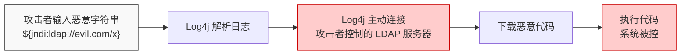

而这一切的起点是什么？是一个程序员在写Log4j的时候，为了方便用户自定义日志格式，加了一个“如果日志中包含特定格式的字符串，就去查找对应的资源”的功能。他本意是好的——让你可以在日志里引用远程配置。但他没有对这个“查找”行为做足够的安全限制。**一个善意的功能，一个疏忽的限制，等于一个满分的漏洞。**

- **漏洞的定义，教科书版**：计算机信息系统在硬件、软件、协议的具体实现或系统安全策略上存在的缺陷，可以使攻击者在未授权的情况下访问或破坏系统。

- **漏洞的定义，Kate版**：程序员不小心留下的一道门缝。不是黑客撬开的，是本来就没关严。

> *Kate说：“所以Log4Shell不是某个天才黑客发明的攻击手法——是一个程序员为了方便别人写日志，不小心留下了一个能被人利用的功能。”*  
>
> “对。漏洞不是恶意代码——漏洞是‘预期行为’和‘实际行为’之间的差距。预期：用户只能输入普通文字。实际：用户输入特殊构造的字符串后，Log4j会去执行远程命令。这中间的差距，就是漏洞本身。”

---

#### 1.4.2 谁在挖漏洞？——五种“猎人”<!-- omit in toc -->

漏洞不会自动跳出来说“我在这里”。需要有人去发现它们。

| 猎人类型 | 他们在干什么 | 动机 |
| :--- | :--- | :--- |
| **安全研究员** | 以挖漏洞为职业。可能是安全公司的员工，也可能是独立的漏洞赏金猎人 | 职业、成就感、赏金 |
| **恶意攻击者** | 黑帽黑客、网络犯罪团伙、国家级APT组织。他们也在找漏洞，但不是为了修复，是为了利用 | 金钱、政治目的、破坏欲 |
| **开发者自己** | 程序员在写代码或做代码审查时，偶然发现自己或同事留下的逻辑缺陷 | 职业责任 |
| **普通用户** | 在使用软件时意外触发了一个bug，恰好懂一点技术，意识到这个bug可能不只是让软件崩溃 | 好奇心 |
| **AI 与自动化工具** | 模糊测试引擎向程序输入海量随机数据，观察程序会不会崩溃；AI 代码审计工具扫描源代码 | 程序指令 |

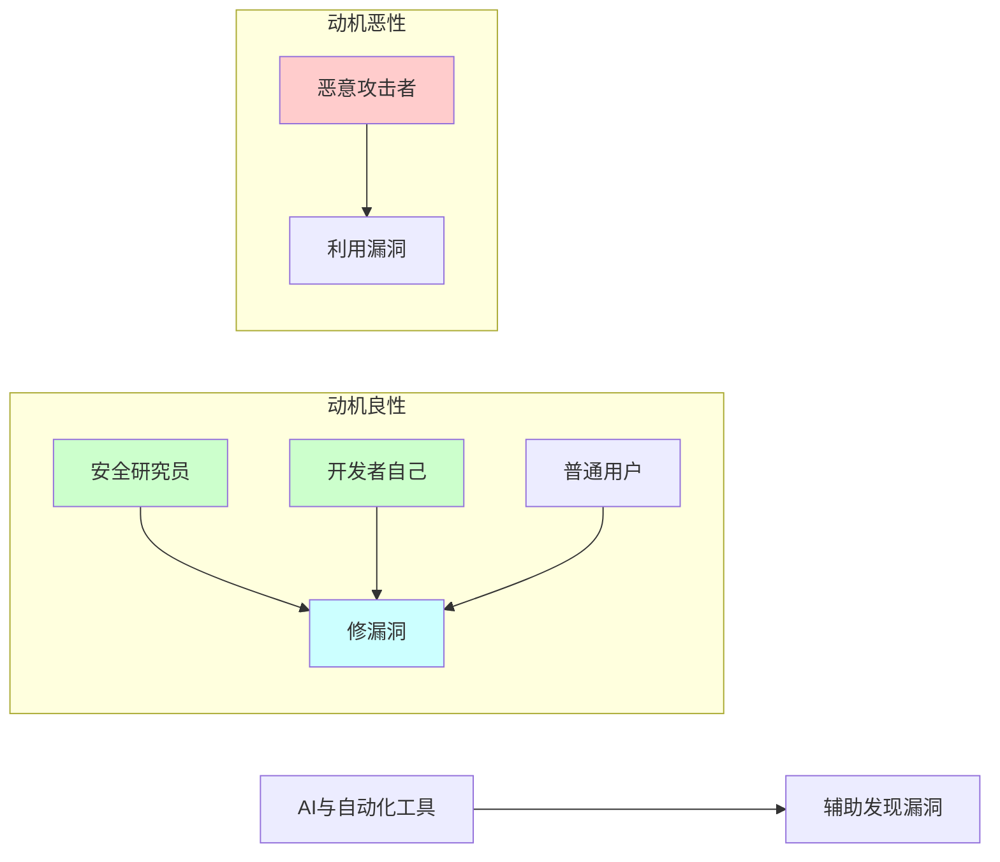

> *Kate说：“所以发现漏洞的人，有的想修好它，有的想利用它。同一个漏洞，落在不同的人手里，命运完全不同。”*
>
> “对。这就是为什么你要先学法律和道德——你发现漏洞之后怎么做，决定了你是安全研究员，还是攻击者。”

---

#### 1.4.3 发现漏洞之后怎么办？——漏洞披露流程<!-- omit in toc -->

假设你发现了Log4Shell。你验证了它确实存在——不是误报，不是偶然。现在，你怎么办？

漏洞的发现时刻，安全界管它叫 **“Day 0”** 或者 **0 Day**。在这之前，这个漏洞已经存在了很多年，但没有人知道它。从这一刻开始，它进入了生命的倒计时。

**第一步：向厂商报告**  

你把漏洞详情写成一份报告，通过厂商的漏洞接收渠道提交。你不会马上公开——你给厂商留出修复时间。

**第二步：厂商验证与修复**  

厂商的安全团队收到报告后，会验证漏洞是否真实存在。如果确认存在，厂商开始开发修复方案。这个阶段，你对漏洞的保密就是对全世界用户的保护——一旦提前泄露，攻击者会比你更快行动。

**第三步：获取CVE编号**  

CVE（Common Vulnerabilities and Exposures）是全球最通用的漏洞标识体系——你可以把它理解成“漏洞的身份证号码”。每个公开漏洞都有自己的 CVE 编号，格式是 `CVE-年份-数字`。Log4Shell的编号是 `CVE-2021-44228`——2021年发现的第 44228 个公开漏洞。

CVE编号的申请流程独立于厂商的修复进度。你可以在发现漏洞后就向 MITRE 申请保留一个编号，等厂商公开修复方案时再同步公布。也可以等厂商修复方案发布后，再补申请。两种方式都有，区别在于：如果漏洞已被公开利用，提前申请编号可以更快地让防御方知道“这个漏洞有官方编号，需要加急修补”。

有了这个编号，全世界的安全从业者都可以用同一个名字来称呼这个漏洞。

**第四步：公开发布与存档**  

厂商发布修复方案后，全球各大漏洞数据库会收录这个漏洞——NVD（美国国家漏洞数据库）、CNNVD（中国国家信息安全漏洞库）、CNVD（中国国家信息安全漏洞共享平台）。安全从业者可以在这些数据库中查询漏洞的详细信息。

每一个被公开的漏洞，都是一份教材。你从中学到的，不只是“这个漏洞怎么修”，还有“这个漏洞是怎么产生的”“如何在我的代码中避免类似的问题”。

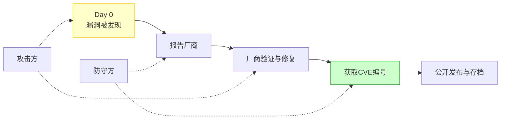

> *Kate在笔记本上画了一条时间线：“发现 → 报告 → 修复 → 编号 → 存档。”*
>
> *她在这条线的起点写了一个数字：“0”。*
>
> “Day 0？”
>
> *“对。漏洞被发现的那一天，就是Day 0。它从这一刻开始被计时。计时到厂商发布补丁的那一天，叫Day N。N越小，影响越小。从Day 0到Day N之间，是防守方和攻击方的赛跑——防守方在加急测试补丁，攻击方在加急写利用代码。谁先完成，谁赢。”*

---

#### 1.4.4 在国内挖到漏洞怎么报告<!-- omit in toc -->

无论你通过哪个渠道报告，第一步都是先确认这个目标在不在授权范围内。不在授权范围内就开始测试，你就是非法入侵。

确认授权之后，接下来你需要知道两条路：

**第一条路：SRC——国内互联网公司的漏洞接收平台**  

SRC 是 Security Response Center（安全应急响应中心）的缩写。国内几乎所有主流互联网公司都建有自己的 SRC——阿里安全响应中心、腾讯安全应急响应中心、字节跳动SRC、百度SRC、美团SRC……它们有专门的团队负责接收、验证和奖励白帽提交的漏洞报告。

SRC 的流程比你直接发邮件给厂商更规范：`提交 → 验证 → 定级与奖励 → 修复与关闭`。SRC 不只是赚钱的地方。它是你踏入安全行业的第一份“成绩单”。你通过SRC提交了多少个有效漏洞、漏洞的质量如何——这些数据可以直接写进你的简历里。

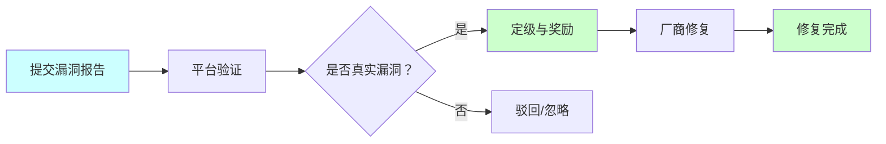

**第二条路：国家规定——《网络产品安全漏洞管理规定》**  

2021年9月1日，工信部、网信办和公安部联合发布了《网络产品安全漏洞管理规定》。这部规定对整个漏洞生命周期作了明确的合规要求。对你来说，有三条最核心：

1. **发现漏洞后，2 日内向工信部报告**。你在国内合法地挖漏洞，你有义务在发现后 48 小时内向国家主管部门报告。
2. **禁止将漏洞出售或提供给境外组织或个人**。一个未被修复的漏洞如果落入境外APT组织手中，可能被武器化。
3. **禁止公开发布或传播未修复的漏洞细节**。在厂商发布补丁之前公开漏洞细节，属于违规行为。

> **实操说明**：你在国内合法SRC平台提交漏洞的，平台会代为向工信部履行报告义务。你不需要自己额外单独上报，但需要确保你提交的平台是国家认可的、正规的SRC平台。
>
> *Kate说：“所以我现在就可以注册一个 SRC 账号，在授权范围内测试，提交我的第一个漏洞？”*
>
> “对。但注意——你测试的目标必须在SRC的授权范围内。超出授权范围，你就触犯了《网络安全法》第二十七条。另外，SRC给了你‘测试授权’，但《网络产品安全漏洞管理规定》要求的是‘发现后2日内报告’——这是两套独立的合规要求，你都要满足。”

---

#### 1.4.5 本节小结<!-- omit in toc -->

| 概念 | 一句话总结 |
| :--- | :--- |
| **漏洞的定义** | 程序员留下的门缝。不是恶意代码，是预期行为和实际行为之间的差距 |
| **五种猎人** | 安全研究员修漏洞，攻击者用漏洞。同一道门缝，不同的目的 |
| **披露流程** | 发现 → 报告 → 修复 → 编号 → 存档。Day 0到Day N，是防守方和攻击方的赛跑 |
| **SRC** | 国内互联网公司的漏洞接收平台，新手练手、攒经验、攒积分的最佳入口 |
| **CVE** | 漏洞的“身份证号码”，全球通用 |
| **《网络产品安全漏洞管理规定》** | 发现漏洞2日内报告工信部（SRC平台代报），禁止出售给境外，禁止提前公开 |

> 🎯 **NISP 一级考点**：漏洞的定义、CVE的全称与作用（Common Vulnerabilities and Exposures，漏洞的“身份证号码”）。SRC的全称是Security Response Center（安全应急响应中心），国内主流SRC平台的名字至少要能说出一两个。
>
> 📝 **守夜者手记**：注册一个SRC平台的账号（比如补天、漏洞盒子），完成实名认证。把注册成功的截图放进今天的笔记里，备注注册日期——你不需要在今天提交漏洞，但第一步是让账号“活着”。

---

#### 1.4.6 此时此刻，全世界正在发生什么？<!-- omit in toc -->

现在，打开这个链接：[https://threatmap.checkpoint.com](https://threatmap.checkpoint.com)

你看到的是一张世界地图。地图上不断有彩色弧线在飞跃，不断有攻击点在闪烁。这张地图是Check Point公司提供的**网络威胁实时地图**，它展示的是此时此刻正在全球发生的网络攻击——每一条彩色弧线代表一次攻击从源IP到目标IP的跃迁。


> *Kate打开了这个链接，盯着屏幕看了整整三十秒。屏幕上的弧线像暴雨一样在各大洲之间穿梭，右下角的攻击数字在疯狂跳动。*
>
> *然后她说：“我以前觉得‘黑客攻击’是电影里那种——一个人坐在黑屋子里，手指飞快地敲键盘。原来不是。原来攻击是自动化、规模化、24小时不停的。我睡觉的时候，攻击还在继续。”*

这张地图让你看到三件事：

1. **网络攻击是持续的、自动化的**。它不是某个黑客躲在阴暗房间里手动操作，而是由僵尸网络、扫描器、蠕虫病毒自动完成的——它们7×24小时不间断地扫描整个互联网
2. **攻击来源和目标是全球分布的**。地图上每一条弧线都是真实的。那些闪烁的攻击点，每一个都可能是一台被攻陷的服务器
3. **没有哪个国家是孤岛**。网络空间没有物理边界。你保护的不是一间上锁的房间，而是一条永远在流动的河

> **注意**：如果你的网络无法访问 [https://threatmap.checkpoint.com](https://threatmap.checkpoint.com)，可以搜索以下国内可访问的替代方案：
>
> - **微步在线威胁情报**（[https://x.threatbook.com](https://x.threatbook.com)）——搜索“全球攻击实时地图”或直接访问其威胁可视化页面
> - **360网络安全态势感知**——访问360官网搜索“安全态势感知”查看公开数据
> - **绿盟科技威胁情报中心**——搜索“绿盟威胁情报”查看相关可视化展示
>
> 不同平台的地图可能稍有差异，但你会看到同样的事实：此时此刻，攻击从未停止。

*Kate关掉了威胁地图，说：“我以后看任何一个漏洞，都会想到这张地图。漏洞不是教科书上的一个案例——是地图上的一条弧线。”*  

*“对。那你知道这些弧线打到的目标，是怎么防护的吗？不是靠某个天才黑客在最后关头拦截攻击——是靠一套运行了二十多年的制度，要求所有重要的网络系统在攻击发生之前，就已经把门锁好了。”*  

*“什么制度？”*  

*“等保。网络安全等级保护制度。下一节，我带你看看守夜者的城墙是怎么设计的。”*  

> 📝 **守夜者手记（附加）**：打开威胁地图，截图保存到你的Markdown笔记里，在截图下面写一句话：“20XX年X月X日，我第一次看到全球网络攻击实时地图。这一天，我决定成为守夜者。”

---

### 1.5 网络安全等级保护制度 2.0 —— 守夜者的城墙设计规范

*Kate 在1.4节看到了全球网络威胁实时地图，知道了“战争从未停止”。然后她问了一个问题：*

> *“那我们这边有什么防护？总不能让每家公司自己随便搭个防火墙就完了吧？”*
>
> “当然不是。中国有一套强制性的网络安全保护制度，要求所有重要的网络系统必须按照国家标准进行防护。这套制度叫——等保。”

---

#### 1.5.1 等保是什么？为什么你需要知道它？<!-- omit in toc -->

**等保**，全称是**网络安全等级保护制度**。它的核心逻辑只有一句话：**你的网络系统有多重要，你就必须通过多高级别的安全检查。**

这个逻辑和你日常生活中很多场景一模一样。医院做手术要无菌环境，银行金库要防爆门，核电站要抗震设计——不同的设施有不同的安全标准。等保就是把同样的“分级保护”逻辑应用到了网络系统上。

等保不是新东西。它的前身可以追溯到 1994 年国务院发布的《计算机信息系统安全保护条例》，那是中国第一次在法律层面提出“计算机信息系统实行安全等级保护”的概念。2008 年发布的等保 1.0 主要针对传统 IT 系统，2019 年发布的等保 2.0 将保护范围扩展到了云计算、物联网、移动互联网、工业控制系统等所有新技术领域。

**为什么你需要知道等保？**

因为等你学完这套教程、进入安全行业之后，你会有很大概率直接参与客户系统的等保测评和整改工作。这是国内安全服务行业最重要的业务之一。你不需要现在就记住等保的全部技术细节，但你需要理解等保的核心逻辑——因为未来你写的每一份渗透测试报告、每一次漏洞修复建议、每一次安全加固方案，都绕不开“这个系统是等保几级”这个前提。

> *Kate说：“所以等保不是技术，是规矩。技术是‘怎么防’，规矩是‘防到什么程度算合格’。”*
>
> “精准。技术决定你能防什么，规矩决定你必须防到什么程度。”

---

#### 1.5.2 等保的五个级别：你的系统有多重要？<!-- omit in toc -->

等保根据系统被破坏后可能造成的危害程度，将网络系统划分为五个安全保护等级。级别越高，要求越严。

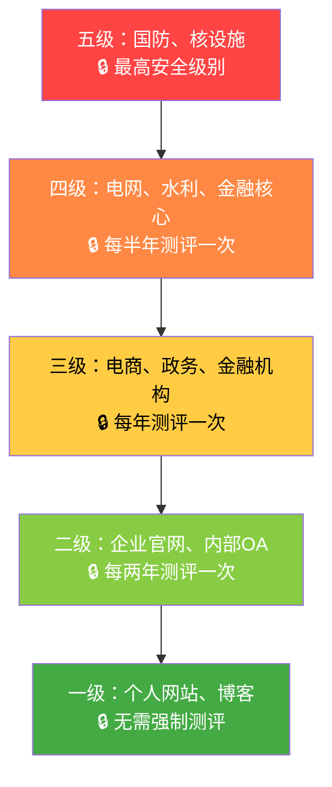

| 级别 | 适用对象 | 被破坏后的后果 | 测评频率 |
| :--- | :--- | :--- | :--- |
| **一级** | 个人网站、博客 | 对个人合法权益造成轻微损害 | 不需要强制测评 |
| **二级** | 企业官网、内部OA系统 | 对个人合法权益造成严重损害，或对社会秩序造成轻微危害 | 每两年至少一次 |
| **三级** | 电商平台、政务系统、金融机构 | 对社会秩序和公共利益造成严重危害，或对国家安全造成轻微危害 | 每年至少一次 |
| **四级** | 国家关键基础设施（电网、水利） | 对社会秩序和公共利益造成特别严重危害，或对国家安全造成严重危害 | 每半年至少一次 |
| **五级** | 国防、核设施等最高安全系统 | 对国家安全造成特别严重危害 | 特殊频率 |

对于绝大多数安全从业者来说，工作中接触最多的是**二级和三级**。二级是一般企业系统的标配，三级是涉及大量用户数据和金融交易的系统必须达到的标准。

> *Kate说：“所以一个电商平台，至少等保三级。一个学校的学生管理系统，大概等保二级。一个核电站的控制系统，等保四级起步。”*
>
> “对。你以后接客户项目的时候，第一件事就是确认客户系统的等保级别。因为这直接决定了你的渗透测试能做什么、不能做什么、交付的报告长什么样。”

---

#### 1.5.3 等保的五个环节：不是考一次试就结束了<!-- omit in toc -->

很多人以为等保就是“测一次，拿个证”。不是。等保是一个持续循环的过程，包含五个标准环节：

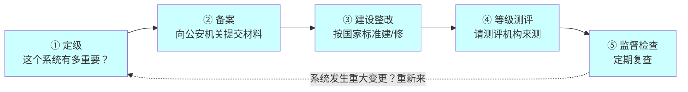

**环节一：定级**  

你的系统属于哪个级别？不是你自己说了算，是根据系统被破坏后可能造成的危害程度来客观评估的。定级需要组织专家评审，并报主管部门备案。

**环节二：备案**  

定级完成后，需要向**所在地市级以上公安机关的网络安全保卫部门（网安部门）**提交备案材料。二级及以上系统必须在公安机关备案。备案材料包括：定级报告、系统拓扑图、安全建设方案、安全测评报告（如已有）等。

> **实操提示**：具体备案流程和所需材料清单可以在当地公安机关官网的“政务服务”栏目中查询，或直接咨询当地网安部门的对外服务窗口。不同地区的备案流程可能略有差异，以当地公安机关发布的最新指引为准。

**环节三：建设整改**  

根据你的定级结果，按照对应的国家标准进行安全建设或整改。三级系统必须满足300多项安全要求，涵盖物理安全、网络安全、主机安全、应用安全、数据安全、安全管理等十大维度。

**环节四：等级测评**  

建设整改完成后，由具有资质的测评机构对你的系统进行安全测评。测评通过后，出具测评报告。注意：测评机构必须是国家认可的、具有等保测评资质的机构。

**环节五：定期监督检查**  

测评通过之后不是“永久有效”。公安机关会定期对备案系统进行监督检查。三级系统每年至少测评一次，四级系统每半年至少测评一次。如果系统发生重大变更（比如架构调整、核心业务更换），需要重新定级和测评。

> *Kate说：“所以等保不是‘考完拿证就完了’，是‘每年都要考一次’。这比期末考试还严格。”*
>
> “对。期末考试你可以临时抱佛脚，等保测评你抱不了。因为你每天产生的数据、每天运行的业务、每天面对的攻击——这些都会影响你下一次测评的结果。等保不是让你‘通过一次考试’，是让你‘持续保持安全状态’。”

---

#### 1.5.4 等保 2.0 的新变化<!-- omit in toc -->

等保2.0相比1.0，有几个关键变化。

**变化一：保护范围扩大**  

1.0主要管传统IT系统——机房里的服务器、交换机、防火墙。2.0将保护范围扩展到了云计算平台、移动互联网应用、物联网设备、工业控制系统。这意味着你未来可能不仅要给客户的服务器做等保测评，还要给他们的云上业务系统、手机APP、智能设备做等保。

**变化二：安全要求重构为“一个中心、三重防护”**  

2.0将原来的十大安全要求重构为“一个中心、三重防护”：

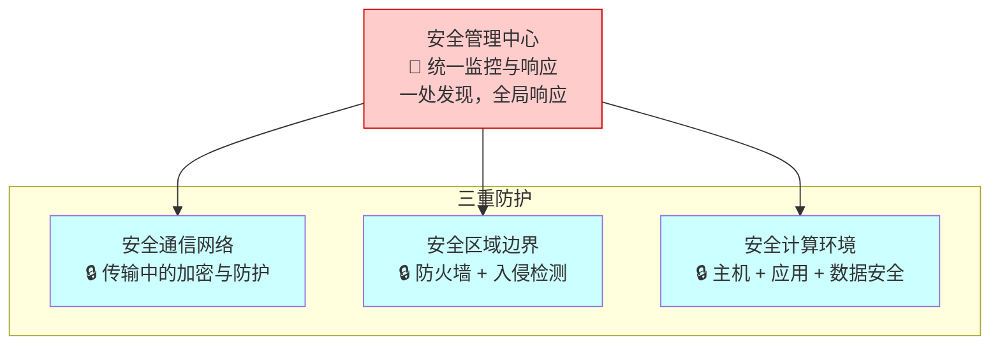

- **一个中心**：安全管理中心。对所有安全设备和安全策略进行集中管理和监控，实现“一处发现、全局响应”。
- **三重防护**：安全计算环境（保护运行在服务器上的操作系统和应用软件）、安全区域边界（在内外网之间、不同安全等级的区域之间建立防护和监控）、安全通信网络（保护数据在网络中传输时的机密性和完整性）。

**变化三：增加了对新型攻击的防护要求**  

2.0新增了对APT（高级持续性威胁）攻击、供应链攻击、社会工程学攻击的防护要求。这些在1.0时代没有明确要求。

> *Kate说：“所以等保2.0不只是‘把门锁好’，是‘有人在门口转悠你也要能发现、有人在窗户外往里看你也要知道、你家水管被人动了手脚你也能查出来’。”*

---

#### 1.5.5 等保和你的关系<!-- omit in toc -->

你可能觉得：“等保是企业的事，跟还在学技术的我有什么关系？”

**关系一：等保是你的职业护城河。**

等保测评和整改是安全服务行业最大的稳定业务来源。几乎所有和政府、国企、金融机构打交道的IT项目，都必须通过等保测评。这意味着未来你的客户中，有一大批人是冲着“帮我通过等保”来的，而不是“帮我找漏洞”。找漏洞是锦上添花，通过等保是刚需。

**关系二：等保是你的工作边界。**

你将来为客户做渗透测试的时候，等保级别直接决定了你工作时的合规边界。三级的系统，你必须严格按照三级的测评标准来检查，发现的问题必须按三级的整改要求来写建议。你的测试报告需要满足等保测评的规范——渗透测试报告可以直接作为等保测评的一部分支撑材料。

**关系三：等保是你的护身符。**

你在1.2节学过法律——未经授权，不能碰别人的系统。而等保测评是一种法定授权：你作为测评机构的工程师，在法律授权范围内对客户系统进行安全测试。这意味着你不需要自己去跟客户谈“能不能测”，法律已经规定了客户必须接受定期测评。

> *Kate说：“所以等保不只是‘规矩’，是我的饭碗、我的工作范围、我的护身符——三位一体。”*
>
> “精准。你现在不需要精通等保的全部技术细节，但你需要在脑子里留一个位置给它。等你以后写渗透测试报告的时候，你会感谢今天这一节——因为你知道报告的格式和内容要求是从哪来的。”

---

#### 1.5.6 本节小结<!-- omit in toc -->

| 概念 | 一句话总结 |
| :--- | :--- |
| **等保是什么** | 网络安全的建筑规范——系统有多重要，就得多安全 |
| **五个级别** | 一级个人博客，五级国防系统。你工作里最常见的是二级和三级 |
| **五个环节** | 定级→备案→整改→测评→检查，不是考一次就完了，是年年考 |
| **2.0变化** | 范围扩大到云、物联网、工控；结构变成“一个中心、三重防护” |
| **和你的关系** | 是你的饭碗（刚需业务）、你的边界（合规要求）、你的护身符（法定授权） |

> 🎯 **NISP 一级考点**：等保全称是“网络安全等级保护制度”，五个级别中二级和三级最常见。定级→备案→整改→测评→监督检查，五个环节的名称和作用要能说出来。等保2.0的“一个中心、三重防护”是简答题高频考点——一个中心是安全管理中心，三重防护是安全计算环境、安全区域边界、安全通信网络。
>
> 📝 **守夜者手记**：想想你学校的教务系统。它存着几万学生的个人信息——姓名、身份证号、成绩、家庭住址。如果这个系统被黑了，这些数据全泄露了——你觉得它应该定几级？为什么？写一句话到今天的笔记里。

---

#### 1.5.7 下一节预告<!-- omit in toc -->

*Kate在笔记本上画了一座五层塔。每层标了一个级别：一至五。塔旁边画了一个循环箭头，标着：定级→备案→整改→测评→检查。箭头下面写：“每年都要跑一圈。”*  

> *她合上笔记本，说：“等保我知道了。但有一个问题我从第一节就想问——这个行业里到底有哪些工作岗位？我学完之后，能做什么？”*
>
> “好问题。第一章最后一节，就是回答这个问题的。”

下一节，我们要看看网络安全行业的**岗位全景图与职业认证**——渗透测试工程师、安全运维、安全架构师、漏洞研究员……每一种岗位在做什么、需要什么技能、可以考什么证书来证明你的能

---

### 1.6 行业岗位与认证 —— 你想成为哪一种守夜者？

*Kate 学完了法律、道德、漏洞、等保，终于问出了那个她从第一节就想问的问题：*

> *“这个行业里到底有哪些工作岗位？我学完之后，能做什么？”*
>
> “好问题。这节就是为你准备的——先看岗位，再看证书。岗位是你要站的位置，证书是你能站上去的证明。”

---

#### 1.6.1 网络安全行业的三种角色<!-- omit in toc -->

如果把网络安全行业比作一座城，城里有三种人：**攻城的、守城的、造武器的。**

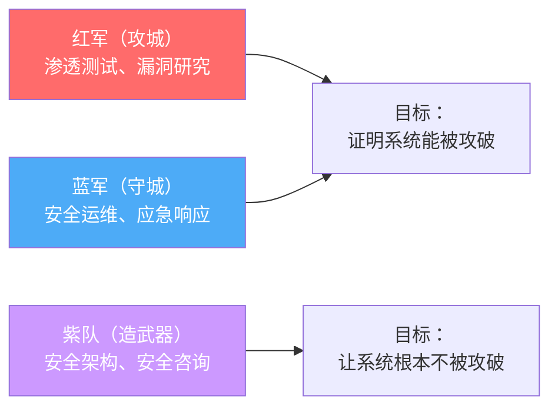

| 角色类型 | 干什么的 | 代表岗位 |
| :--- | :--- | :--- |
| **红军（攻城）** | 模拟攻击，找漏洞，证明系统能被攻破 | 渗透测试工程师、漏洞研究员、红队成员 |
| **蓝军（守城）** | 防御、监控、应急响应，保证系统不被攻破 | 安全运维工程师、安全分析师、应急响应工程师 |
| **紫队（建城）** | 设计安全架构、制定安全策略、把安全从“补丁”变成“地基” | 安全架构师、安全顾问、安全合规工程师 |

> **紫队不是“红蓝混合”，是“安全建设者”。** 红军证明“你的城墙有裂缝”，蓝军保证“裂缝被堵上了”，紫队设计“城墙怎么建才能没有裂缝”。

*Kate说：“所以红军是找茬的，蓝军是补漏的，紫队是画图纸的。”*  

“精准。而且这三个角色的收入和发展路径完全不同。你选哪一个，决定了你未来每天的工作内容。”

---

#### 1.6.2 常见岗位画像<!-- omit in toc -->

**渗透测试工程师（红军核心）**  

你受客户委托，在合同授权范围内对他们的系统进行模拟攻击。你的工作成果是一份渗透测试报告——里面记录了你发现了哪些漏洞、怎么发现的、漏洞有多严重、应该怎么修。你的日常是：用扫描器扫端口、用Burp Suite抓包、手工测试SQL注入和XSS、写漏洞利用脚本、绕过WAF、尝试提权。你的面试官会问你：“你挖过多少漏洞？有CVE编号吗？SRC排名多少？”

**安全运维工程师（蓝军核心）**  

你负责维护公司的防火墙、IDS/IPS、WAF、SIEM，监控安全告警，处置安全事件。你的日常是：看日志、配规则、打补丁、做加固、写应急预案。凌晨三点服务器告警响了，你要爬起来看是不是真的攻击还是误报。你的面试官会问你：“你管过多少台服务器？遇到过什么类型的攻击？怎么溯源的？”

**安全分析师**  

你在安全运营中心（SOC）工作，面前有多块屏幕，上面滚动着实时安全告警。你的工作是：从海量告警中识别出真正的攻击（而不是误报），分析攻击手法，溯源攻击来源，输出威胁情报。

**漏洞研究员**  

你的工作是找漏洞——在操作系统、浏览器、数据库、IoT设备、工控系统中找那些没人发现过的漏洞。你可能花几个月的时间逆向工程一个软件，研究它的内部逻辑，最终发现一个高危漏洞。这个漏洞如果被分配了CVE编号，全世界都会记住你的名字。

**安全架构师（紫队核心）**  

你不是在第一线攻防，你是在设计整个系统的安全架构。你决定网络怎么分区、身份认证怎么做、加密策略怎么定、安全监控怎么布。安全架构师不是“跳过去”的岗位，是“走过去”的。它通常需要十年以上的安全从业经验——因为你的每一个设计决策都会影响整个公司的安全水位。

你现在不需要去想十年后的事，只需要知道：所有红军和蓝军的经验，最终都会汇聚到这里。渗透测试做得多了，你会自然开始思考“如果我在设计阶段就避免这个漏洞”；安全运维做得久了，你会自然开始思考“如果网络分区换一种方式，攻击者就没法横向移动了”。那一步，是走出来的，不是跳过去的。

> *Kate说：“渗透测试听起来最酷——每天都在攻击。但安全运维也很重要——没人守城，城墙早晚被攻破。安全架构师太远了，那是十几年的目标。”*
>
> “你不需要现在就选。第一章让你看到全景——后面每一季都会对应这些岗位的具体技能。等你把基础学完，你自然知道自己更擅长攻、守、还是建。”

---

#### 1.6.3 网络安全认证体系<!-- omit in toc -->

你说你技术好，怎么证明？你说你挖过漏洞，面试官凭什么信你？网络安全行业有自己的一套认证体系。证书不是万能的，但没有证书，你在求职时会比有证书的人多费很多口舌来证明自己。

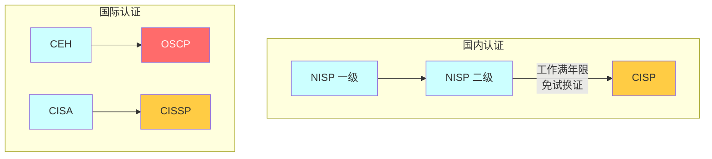

**国内认证**  

| 证书 | 全称 | 适合谁 | 为什么重要 |
| :--- | :--- | :--- | :--- |
| **NISP** | 国家信息安全水平考试 | 在校学生，入门级 | 中国信息安全测评中心颁发，很多高校信息安全专业的毕业要求之一。分一级和二级，**二级持证者在满足CISP工作经验要求后可免试换CISP证书** |
| **CISP** | 注册信息安全专业人员 | 从业2年以上的安全从业者 | 国内政企单位安全岗位的准入门槛 |

**国际认证**  

| 证书 | 全称 | 适合谁 | 为什么重要 |
| :--- | :--- | :--- | :--- |
| **CISSP** | 国际注册信息系统安全专家 | 5年以上安全从业经验的管理者 | 全球最权威的安全管理类认证 |
| **OSCP** | 国际渗透测试认证 | 渗透测试方向，技术硬核 | 全球含金量最高的渗透测试认证之一。24小时实战考试——给你几台靶机，你必须攻破它们并写出完整的渗透测试报告 |
| **CEH** | 国际注册道德黑客 | 安全入门 | 理论为主，覆盖面广，适合作为第一张国际安全证书 |

> *Kate说：“所以NISP是学生的第一张证，CISP是国内政企的敲门砖，CISSP是安全总监的标配，OSCP是渗透测试的硬通货。”*
>
> “精准。你现在是学生，如果将来想在国内政企单位做安全，NISP是你最该先拿的证。如果你将来想去互联网公司做渗透测试，OSCP是你简历上最亮眼的证明。”

**你应该怎么规划考证？**

| 阶段 | 建议证书 | 说明 |
| :--- | :--- | :--- |
| **在校期间** | NISP一级或二级 | 学生专属，门槛低 |
| **从业0-2年** | CEH或OSCP | 想走技术路线冲OSCP，想先了解全貌考CEH |
| **从业2-5年** | CISP | 国内政企岗位的硬性要求 |
| **从业5年以上** | CISSP | 安全管理方向的巅峰认证 |

---

#### 1.6.4 没有证书怎么办？<!-- omit in toc -->

证书需要钱、需要时间、需要工作经验。你现在一个都没有，正常。

没有证书的时候，用什么证明你的能力？

**第一，挖漏洞，攒 SRC 排名。** 你在1.4节已经知道 SRC 是什么。注册几个主流 SRC 平台，在授权范围内挖漏洞、交报告。你提交的每一个有效漏洞，都是一份比证书更有说服力的证据。

**第二，写笔记，积累GitHub仓库。** 你正在读的《守夜者之书》，本身就是一个最好的例子。一个长期维护、结构清晰、内容专业的GitHub仓库，比十张证书更能证明你的学习能力和技术深度。

**第三，打CTF，积累比赛成绩。** CTF（Capture The Flag）是网络安全竞赛。你在比赛中破解的每一道题，都是对你技术水平的实战检验。即使没有拿到名次，你赛后写的Writeup（解题思路复现）也是一份高质量的学习笔记。

**第四，搭建个人博客，持续输出技术文章。** 你把学到的每一个知识点写成文章，公开发布。一年之后，你会有几十篇技术文章挂在自己的博客上。面试官Google你的名字，会看到你写的漏洞复现、你写的安全工具、你写的学习笔记。

**证书证明你通过了考试。SRC排名、GitHub仓库、CTF成绩、技术博客——证明你真的会。**

> *Kate说：“所以没有证书不可怕，可怕的是你什么产出都没有。没有证书的面试者需要额外证明自己，而有持续产出的面试者，本身就是一个行走的简历。”*

---

#### 1.6.5 本节小结<!-- omit in toc -->

| 岗位方向 | 推荐证书 | 没有证书时用什么证明 |
| :--- | :--- | :--- |
| 渗透测试（红军） | OSCP、CISP | SRC漏洞排名、CTF成绩 |
| 安全运维（蓝军） | CISP、CISSP | 运维经验、日志分析案例、应急响应记录 |
| 安全架构（紫队） | CISSP、CISP | 架构设计文档、安全方案、咨询项目经验 |
| 入门通用 | NISP、CEH | GitHub仓库、技术博客、SRC/CTF成绩 |

> *Kate在表格下面加了一行字：“证书是别人发的，能力是自己攒的。”*

| 概念 | 一句话总结 |
| :--- | :--- |
| **三种角色** | 红军攻城、蓝军守城、紫队画图纸——你选哪一个？ |
| **常见岗位** | 渗透测试、安全运维、安全分析师、漏洞研究员、安全架构师 |
| **国内认证** | NISP（学生证）、CISP（政企敲门砖） |
| **国际认证** | CISSP（管理巅峰）、OSCP（渗透硬通货）、CEH（入门） |
| **没有证书怎么办** | SRC排名、GitHub仓库、CTF成绩、技术博客——持续产出比证书更值钱 |

> 🎯 **NISP 一级考点**：NISP 的全称是“国家信息安全水平考试”，由中国信息安全测评中心颁发。NISP 一级是你学完本章之后可以去考的第一张安全证书。CISP 的全称是“注册信息安全专业人员”，是国内政企单位安全岗位的准入门槛。NISP 二级持证者在满足工作经验要求后，可免试换 CISP 证书。
>
> 📝 **守夜者手记**：翻开你的笔记本，翻到第一章第一页。上面有你从1.1到1.6画的所有图和写下的所有想法。现在写一句话在第一章最后一页：“我是哪种守夜者？我选____（攻/守/建）。”不用现在就确定，但你要开始想了。

---

#### 1.6.6 第一章，全部通关<!-- omit in toc -->

*Kate合上了她的笔记本。封面上写着《这才是网络安全》第一季第一章。她翻开第一页，上面有她从1.1到1.6画的所有图：三把锁、四条法律底线、六条职业道德守则、漏洞生命线、五层塔、三列表格。*

> *她说：“我从‘什么是网络安全’学到了‘我想成为什么岗位的守夜者’。一章，六节。”*
>
> “感觉怎么样？”
>
> *“感觉我知道自己不知道什么了。我知道这个行业有多大、有多深、有哪些门我可以推开。下一章，我要推开第一扇门。”*

**第一章：网络安全导论 —— 终。** 🔪

---

来了。第二章的问题我全看明白了——不是你不流畅，是**你写第一章的时候脑子里有“框架模板”，写到第二章开始放飞自我了**。这不怪你，几乎所有系列作者都会在第一本之后的续章里出现“模板丢失”的现象。

我先给你把第二章缺失的模板元素列出来，然后逐节修改。

---

## 第二章 - 渗透测试基础

*Kate 学完第一章，感觉自己像是在军事学院里上了整整一学期的理论课。她知道了攻守的规矩、战场的法则、各种兵种的名称。但她心里一直痒痒的，有一个问题终于憋不住了：*

> *“那个……我们什么时候才去‘攻城’？”*
>
> “现在。”

---

### 2.1 渗透测试概念 —— 渗透测试员的作业指导书

*Kate 在第一章学了无数个概念，但她觉得最酷的那个词始终挂在嘴边没被真正解释过。*

> *“我能在你面前说一百遍‘渗透测试’，但我到现在还是没法跟别人解释清楚它到底是什么——不只是‘模拟攻击’，是‘有规矩的模拟攻击’。”*
>
> “那就从规矩开始讲。”

---

#### 2.1.1 渗透测试的定义<!-- omit in toc -->

渗透测试，正确的、通俗的称呼是**渗透测试**，而不是“入侵测试”或“黑客测试”。

> *Kate 听了后表示：“你这不是废话吗？”*

呃……其实我想说的是，它不是“找一个漏洞就钻进去”。它是一种**经过授权的、以发现和验证系统安全弱点为目的的、系统化的模拟攻击**。

我们把这句话拆开，里面有四个关键词：

1. **经过授权**：这是白帽与黑帽的本质区别。未经授权的渗透测试，无论动机好坏，在法律上都构成非法入侵。授权是白帽的护身符，是所有渗透测试行为合法性的唯一来源。

2. **以发现和验证弱点为目的**：渗透测试的目的不是“攻破”，而是“证明”。证明系统存在可以被利用的缺陷，而不是窃取数据或造成破坏。

3. **系统化**：渗透测试不是凭灵感乱扫一气。它有一套国际通用的标准流程——从信息收集到漏洞利用，从权限提升到后渗透阶段，每一步都有明确的目标和方法论。

4. **模拟攻击**：渗透测试的本质是“模拟”——模拟一个真实的、恶意的攻击者可能采取的行为。这意味着你必须站在攻击者的角度思考，但行为必须在授权范围内。

> *Kate说：“所以渗透测试就是‘在合同范围内，假装自己是坏人，帮好人找到他们系统里哪里容易被坏人进去’。”*
>
> “精准。你不是坏人。你是一个被允许做坏事的守法好人。这是整个安全行业最酷的工作之一，但也是最需要自律的工作。”

---

**渗透测试 vs 漏洞扫描：不是一回事**  

~~菜鸟们~~小小鸟们听好了，很多新手会把渗透测试和漏洞扫描混为一谈。但实际上它们的关系就像“体检”和“模拟手术”。

> (以后再有脚本小子这么说，你就可以把下面这段话扔给他)

- **漏洞扫描**：用自动化工具（比如 Nessus、AWVS）对目标系统进行大规模快速扫描，找出所有**已知的、可能存在**的安全漏洞。它像一份体检报告——告诉你可能有哪些问题，但不会深入验证。
- **渗透测试**：在漏洞扫描的基础上，由人（渗透测试工程师）对发现的疑似漏洞进行**手工验证和利用**，确认漏洞是否真的可被利用、能造成多大危害、攻击者能走到哪一步。它像一次模拟手术——在你身上切开一个小口子，看看病毒有没有真的进入血液。

两者是**互补**的，不是替代关系。真正的渗透测试项目，往往先用扫描器获取全貌，再人工深入验证关键漏洞。

> 🎯 **NISP 一级考点**：渗透测试的定义中四个关键词（授权、目的、系统化、模拟攻击）是选择题常见考点。“漏洞扫描是自动化的，渗透测试是人工验证的”是辨析题的高频考点。不需要背英文，但你要能用自己的话说清楚四个关键词分别指什么，以及渗透测试和漏洞扫描的核心区别是什么。
>
> 📝 **守夜者手记**：打开一个你常逛的网站（比如你的学校官网、B站、GitHub），在浏览器开发者工具的“网络”面板里刷新一次页面，看看它加载了多少个资源。截图保存到你的笔记里，在截图下面写一句话：“这个网站的后厨有这么多人在干活。”

---

#### 2.1.2 渗透测试专用术语<!-- omit in toc -->

> *Kate 翻到下一页，看到标题是“专用术语”。她叹了口气：“又要背单词？”*
>
> “不是背。是让你以后听别人说话不会一脸懵。这些词你在接下来的每一章都会遇到，先混个脸熟。”

渗透测试这个圈子，有一套自己的“黑话”。你以后看漏洞报告、逛安全论坛、和同行交流，这些词会反复出现。不需要一次全记住，但你需要知道它们各自指什么，以及——它们之间是什么关系。

**Payload（攻击载荷）**  

Payload 是攻击者真正想“投递”到目标系统中的恶意代码或指令。

这个英文词的字面意思是“有效载荷”——把它想象成一枚导弹弹头里真正有杀伤力的那一部分。导弹本身不是杀伤工具，弹头里的炸药才是。同样，Payload 不是攻击工具本身，而是你利用漏洞时发送的具体攻击指令。

你在后面学 SQL 注入的时候会看到这样一段 Payload：`' OR 1=1 --`。这串字符本身看起来像乱码，但当你把它塞进一个登录框的用户名栏里，它就能绕过后台的身份验证逻辑，让你以管理员身份登录。

> *Kate 说：“所以 Payload 就是‘我到底想让它干啥’。漏洞是门，Payload 是钥匙。不同的钥匙能打开不同的锁，但前提是你得先找到那道门。”*

**Exploit（利用代码）**  

Exploit 是利用某个具体漏洞的完整攻击程序或脚本。它通常不是一锤子买卖，而是一个分步骤的自动化流程。

Payload 只是“我到底想让它干啥”——一段攻击指令。但光有指令不够，你还需要一个“怎么把这串指令精准地塞进漏洞里”的方案。这个方案就是 Exploit。它包括：如何触发漏洞、如何绕过 WAF、如何把 Payload 编码成目标系统能接受的格式、如何在执行后清理痕迹。

你在后几季学 Metasploit 的时候会大量接触 Exploit——它们被写成标准化的模块，输入目标 IP 和参数，一键执行。很多 CVE 编号背后都有对应的公开 Exploit。

> *Kate 说：“所以 Payload 是子弹，Exploit 是整把枪——包括枪管、瞄准镜、扳机。子弹决定打出去的是什么，枪决定能不能打中。”*

**POC（概念验证）**  

POC 是 Proof of Concept 的缩写，中文叫“概念验证”。它是用来证明“这个漏洞确实存在”的代码或操作步骤。

在漏洞披露流程中，POC 是你最有力的武器。你发邮件给厂商说“你们的系统有一个漏洞”，厂商通常会回复：“请提供更多细节。”如果你没有 POC，这句“更多细节”就能把你的报告打入冷宫。

但 POC 有个铁律：**只能证明，不能破坏。** 一个合格的 POC 通常只做最轻度的验证——弹一个计算器、打印一行“pwned”、或者建立一个简单的网络连接。

> *Kate 说：“所以 POC 就是‘你看，我没骗你，它真的能弹出一个计算器’。它不是武器，是证据。”*

**0day 漏洞**  

0day 漏洞是指还没有被厂商或公众知道的漏洞，厂商没有补丁，用户无法防御。你在第零季和第一章见过这个词。

“0day”这个名字的来源是：“从漏洞被发现到厂商发布补丁的天数为零”——因为厂商还不知道，所以倒计时还没开始。一旦厂商发布了补丁，这个漏洞就不再是 0day，而是一个“有补丁可修的 Nday 漏洞”。

0day 有很高的金钱价值。在黑市上，一个普通软件的 0day 可以卖到几万到几十万美元。

> *Kate 说：“所以 0day 是‘别人都不知道的核弹’。你拿着它，可以选择交给政府、交给厂商、或者卖给任何人。你的选择，决定了你是白帽还是黑帽。”*

**WAF（Web应用防火墙）**  

WAF 是 Web Application Firewall 的缩写。它是部署在 Web 服务器前面的一道防护系统，用来检测和拦截常见的 Web 攻击——SQL 注入、XSS、文件包含、命令注入等。

你在后面做渗透测试时会反复遇到 WAF。你的 Payload 被拦截了，不是漏洞不存在——是 WAF 认出并挡住了你的攻击流量。

> *Kate 说：“所以 WAF 就是守城门的。你从外面递进来的每一张纸条，它都要打开看一眼——如果有可疑的字眼，直接撕了，不让你递进去。”*

**反弹 Shell**  

反弹 Shell 是渗透测试中最常用的技术之一。简单说，就是让受害服务器主动连接攻击者的电脑，并把服务器的命令行控制权交给攻击者。

为什么叫“反弹”？因为正常情况下，是攻击者去连服务器。但服务器前面往往有防火墙，入站流量被严格限制——攻击者直接连不上。于是攻击者想了一个反向操作：让服务器**主动**连出来。

> *Kate 说：“所以反弹 Shell 就是‘我不去敲你的门，我让你来敲我的门’。因为你的门有人守着，我的门没人管。”*

**一句话木马**  

一句话木马是一种极其精简的恶意代码，通常只有一行，用于配合远程管理工具对目标服务器进行长期控制。

“一句话”不是夸张——它真的只有一句话。通常是一行简单的服务端脚本，接受远程客户端发来的指令并在服务器上执行。因为体积极小，它可以被嵌入到正常的网页文件中，隐藏在几千行代码中间，极难被日志审计发现。

常见的一句话木马客户端包括“中国菜刀”、“蚁剑”、“冰蝎”——这些工具的界面长得像文件管理器，但背后连接的是一个被植入木马的受害服务器。

> *Kate 说：“所以一句话木马就是‘藏在门缝里的万能钥匙’。你只放了一句话，但谁拿到这把钥匙，谁就能随时开门进来。”*

**提权**  

提权是“权限提升”的简称。你通过漏洞拿到了一个普通用户权限的 Shell，但普通用户能做的事有限——你无法安装程序、无法修改系统配置、无法访问其他用户的文件。你需要从普通用户提升到管理员或 root 权限，这个过程就叫提权。

> *Kate 说：“所以提权就是‘我混进来了，但我是平民。我要当国王’。不是一个漏洞就能让你当国王——你可能要走三四个步骤，每个步骤都在往上爬。”*

**APT（高级持续性威胁）**  

APT 是 Advanced Persistent Threat 的缩写。它不是某种攻击技术，而是一种**攻击形态**——由一个组织严密、资源充足的黑客团队（通常是国家级支持）对高价值目标发起的长期、持续的渗透和窃密活动。

APT 攻击的特点是不求快，求稳。普通黑客可能扫到一个漏洞就进去偷东西，偷完就跑。APT 攻击者会在目标系统中潜伏数月至数年。

> *Kate 说：“所以普通黑客是撬锁的，APT 是间谍。一个拿完东西就跑，一个在你家住了三年你都不知道。”*

**九个术语之间的关系**  

把这九个词串起来，你就能看到一个完整的渗透测试故事：

> 一个安全研究员发现了一个**0day**漏洞，他迅速为这个漏洞写了一个**POC**，证明漏洞确实存在且可被利用。他把 POC 和漏洞详情报告给了厂商，厂商在修复期间为这个漏洞申请了一个 CVE 编号。
>
> 与此同时，一个攻击者也发现了同一个漏洞。他写了一个**Exploit**，并在 Exploit 里嵌入了一段**Payload**——这串 Payload 会在目标服务器上建立一个**反弹 Shell**，让服务器主动连接攻击者的电脑。攻击者拿到 Shell 后，为了确保自己以后还能回来，在网站目录下植入了一个**一句话木马**。然后他开始**提权**——从普通用户提升到管理员。
>
> 整个过程中，目标服务器前面一直部署着**WAF**，但攻击者的 Payload 经过变形和编码，成功绕过了 WAF 的检测规则。
>
> 如果这个攻击者不是普通的黑帽，而是一个**APT**组织——他们不会满足于控制一台服务器。他们会以这台服务器为跳板，横向移动到内部网络的其他核心服务器，潜伏数年。

*Kate 读完了那个九个术语串起来的故事，说：“我当初觉得这些词像天书。现在它们组成了一个完整的攻击链条——每一个词都在链条上有自己的位置。”*  

---

**常用术语速查表**  

| 术语 | 一句话解释 | 你在什么时候会用到 |
| :--- | :--- | :--- |
| **0day** | 厂商还不知道的漏洞，无法防御 | 挖到高危漏洞时，你怎么处理它决定了你是白是黑 |
| **POC** | 证明“这个漏洞真的存在”的代码，只证明不破坏 | 向厂商报告漏洞时，POC 是你最有力的证据 |
| **Exploit** | 利用漏洞的完整攻击脚本 | 学 Metasploit 时你会看到成百上千个 Exploit |
| **Payload** | 攻击指令本身，是你塞进漏洞里的“炸药” | 学 SQL 注入、XSS 时你会写出第一个 Payload |
| **反弹 Shell** | 让受害服务器主动连接攻击者 | 学 Metasploit 时，这是你拿到目标控制权的主要方式 |
| **一句话木马** | 一行代码的远程控制后门 | 学文件上传漏洞时你会学会如何植入和使用它 |
| **提权** | 从普通用户提升到管理员权限 | 在你拿到第一个 Shell 后，提权是你必走的路 |
| **WAF** | Web 应用防火墙，你攻击路上的第一道关卡 | 学 SQL 注入和 XSS 时你会和 WAF 反复交手 |
| **APT** | 国家级的高端持续性攻击 | 在威胁情报和高级攻防课程中会深入讨论 |

> 🎯 **NISP 一级考点**：渗透测试专用术语中，0day、POC、Exploit、Payload 这四个词是选择题和简答题的高频考点。你需要能区分它们的含义，但考试不会考“这段话里有几个术语”——考的是你对每个术语概念的理解。用 Kate 的比喻来记：Payload 是子弹，Exploit 是枪，POC 是证据，0day 是别人都不知道的核弹。
>
> 📝 **守夜者手记**：用搜索引擎搜索“CVE-2021-44228”或“Log4Shell 漏洞报告”，找一篇公开的漏洞分析文章。在这篇文章里至少找到三个术语（比如 Payload、Exploit、反弹 Shell），把它们标出来。如果找不到，用这九个术语去读另一篇。

---

#### 2.1.3 黑盒、白盒与灰盒测试<!-- omit in toc -->

> *Kate 在上一节背完了九个术语，觉得自己已经掌握了渗透测试的“黑话”。她合上笔记本，信心满满地说：“Payload是炸药，Exploit是枪，POC是证据，反弹Shell是让对方给我开门——我全记住了。”*  
>
> “很好。那我考你一个实际问题。”
>
> *“来。”*  
>
> “你接到一个渗透测试项目。客户给你发了一封邮件，邮件正文只有一行字：‘我们的系统在 `www.example.com`，请测试。’除此之外什么都没有。没有账号，没有文档，没有架构图。你现在要做什么？”
>
> *Kate 愣了一下。“……我是不是应该先回邮件问他们要账号？”*  
>
> “他们不回。他们就想看看一个什么都不知道的外部攻击者，能不能打进他们的系统。”
>
> *“……那我只能从零开始摸索了。先查这个域名背后有哪些IP、开放了哪些端口、运行着什么服务——然后看看这些服务有没有已知漏洞。”*  
>
> “这就是黑盒测试。”

渗透测试不是一种单一的“攻击方式”。你每次接项目时，对目标系统的了解程度决定了你接下来所有操作的方式。你是对目标一无所知，还是拿着它的设计图纸？这两种身份的攻击路径完全不同。

| 类型 | 你知道什么 | 你要做什么 | 难在哪 |
| :--- | :--- | :--- | :--- |
| **黑盒** | 只有一个URL或IP | 从零开始摸索，模拟真实外部攻击者 | 信息太少，可能漏掉隐藏漏洞 |
| **白盒** | 全部信息（代码、架构、配置） | 深入审查，找隐藏最深的逻辑漏洞 | 信息太多，容易被自己的假设框住 |
| **灰盒** | 部分信息（普通账号、基础文档） | 以有限身份测试越权 | 在两者之间找平衡 |

---

**黑盒测试：你就是那个外部攻击者**  

你收到的任务简报上只有一个URL。没有账号，没有文档，没有架构图。客户想看看一个真实的外部攻击者能不能打穿他们的防线。

你现在就是这个攻击者。你不知道目标系统用了什么框架、不知道后台数据库是MySQL还是Oracle、不知道防火墙后面藏着几台服务器。你只能从零开始——先查这个域名的WHOIS信息，再用Nmap扫描它开放了哪些端口，从端口推测它运行着什么服务，从服务的版本号查找已知漏洞。

> *Kate说：“所以黑盒就是‘盲人摸象’。你只能摸到大象的一部分——可能是腿、可能是鼻子、可能是尾巴。”*

**白盒测试：你手里有设计图纸**  

你收到的不是邮件，而是一个压缩包。里面有一份系统架构图、一份API文档、一份数据库结构说明，还有一个测试用的管理员账号。

你不是外部攻击者了。你是被请来审计系统的内部安全专家。你不用花时间在信息收集上——你可以直接登录后台，打开源代码仓库，一行一行地审查代码逻辑。你能看到那些从外部永远发现不了的深层漏洞。

但白盒测试也有一个致命弱点：**信息太多，你会被自己的假设框住。**

> *Kate说：“所以白盒就是‘开卷考试’。书都翻开了，答案就在里面——但开卷考试比闭卷难。”*

**灰盒测试：最接近真实渗透项目的日常**  

你收到的邮件里写着：“这是测试账号：user001，密码：test123。请以这个普通用户的身份测试系统有没有越权漏洞。”

你知道一部分信息——你有普通用户的权限，知道系统的基本功能。但你看不到管理员的后台，不知道数据库结构，也没有源代码。你需要以这个有限的身份去测试：能不能看到其他用户的个人信息？能不能通过修改URL里的ID参数访问别人的订单？

> *Kate说：“所以灰盒就是‘半开卷’。你有小抄，但小抄上只写了一半。另一半你得自己找。”*

---

**三种类型的实战定位**  

你现在是初学者，接下来的学习路径会从**白盒**开始，逐步过渡到**黑盒**和**灰盒**：

- **白盒练习**：你搭建自己的靶场，当然知道系统有什么漏洞——但你要学会“假装不知道”，按照标准的渗透测试流程一步一步来。
- **灰盒练习**：你在SRC平台注册一个普通用户账号，以这个身份去测试系统有没有越权漏洞。
- **黑盒练习**：你去打CTF、去SRC平台挖漏洞、去渗透一个你完全不熟悉的靶机。

*Kate 把三种类型画成了一个三角形，从下到上写着：白盒→灰盒→黑盒。她在三角形旁边标注：“练功房→演练场→战场。”*  

> 🎯 **NISP 一级考点**：黑盒、白盒、灰盒测试的定义和区别是渗透测试基础部分的必考概念。**黑盒 = 零信息，白盒 = 全信息，灰盒 = 部分信息。** 考试可能会给你一个实际场景，让你判断它属于哪种测试类型。不需要背英文，但要能根据“你知道多少信息”来判断类型。
>
> 📝 **守夜者手记**：打开一个你经常使用的网站（比如学校官网、B站、淘宝），在不登录的情况下，你能看到什么？截图保存到你的笔记里，在旁边写：“这是黑盒视角，我什么都不知道。”然后用你在2.1.4学到的知识，试着判断一下这个网站跑了什么中间件（看响应头里的Server字段）。

---

#### 2.1.4 Web 常用组件<!-- omit in toc -->

*Kate 在浏览器里打开了一个网页，盯着看了几秒，然后问了一个问题：*

> *“我输入网址、按回车、页面出来了。这中间到底发生了什么？谁在帮我显示这个页面？”*
>
> “好问题。你看到的只是一个网页，但背后是一整支团队在协同工作。就像你去餐厅点了一道菜——你只看到服务员端上来的盘子，但后厨里有洗菜的、切菜的、炒菜的、摆盘的。”
>
> *“所以网页背后也有‘后厨’？”*
>
> “有。而且每个角色都有自己的名字。你现在就要认识它们——因为你以后挖的每一个漏洞，都是这些角色里某个人的失误。”

一个网页从服务器到你的浏览器，中间要经过好几层“搬运工”。这些层加在一起，就是所谓的**Web三层架构**——表现层（你看到的网页）、逻辑层（处理业务的脚本）、数据层（存数据的数据库）。而中间件，就是连接这三层的“高速公路”。

---

**数据库：存数据的地方**  

你在一个购物网站上注册账号、填写用户名和密码、点击“注册”。这些信息去哪了？它们被存进了一个叫**数据库**的地方。

这一层叫**数据层**——它是整个Web三层架构的最底层。

**常见数据库：**

| 名称 | 一句话介绍 | 你会在哪遇到 |
| :--- | :--- | :--- |
| **MySQL** | 开源数据库，互联网公司最常用的之一 | 中小型网站、WordPress |
| **Oracle** | 商业数据库，银行和大型企业在用 | 金融机构、电信系统 |
| **SQL Server** | 微软家的数据库 | 企业内部管理系统 |
| **Access** | 微软家的轻量级数据库 | 老旧的学校教务系统 |

> **为什么你需要知道数据库？** 因为SQL注入——你在后面几章会学到的漏洞——就是攻击者通过输入框向数据库发送恶意指令。如果你不知道数据库是什么，你就理解不了SQL注入的原理。

**脚本语言：写网页逻辑的东西**  

数据库存了数据，但谁来处理这些数据？谁来接收你填的注册信息、把它们存进数据库、再返回一个“注册成功”的页面给你？

这就是**脚本语言**干的活。

这一层叫**逻辑层**——它是整个Web三层架构的中间层，也是最容易出安全漏洞的地方。

**常见脚本语言：**

| 名称 | 一句话介绍 | 文件后缀 | 你会在哪遇到 |
| :--- | :--- | :--- | :--- |
| **PHP** | 世界上使用最广泛的Web脚本语言 | `.php` | WordPress、Discuz |
| **ASP/ASP.NET** | 微软家的Web开发框架 | `.asp` / `.aspx` | 企业内部管理系统 |
| **JSP** | Java语言的Web版本 | `.jsp` | 大型企业应用、银行系统 |
| **Python** | 近几年在Web开发中增长迅速 | `.py` | 新兴互联网公司 |

> **为什么你需要知道脚本语言？** 因为很多漏洞是程序员写脚本时留下的逻辑缺陷。你以后看到网址里出现 `.php`，就知道这个网站大概率是用PHP写的。文件后缀是服务器告诉你“我是谁”的最直接线索。

**中间件：连接前端和后端的“桥梁”**  

你打开了浏览器，输入了网址，按了回车。谁负责接收这个请求、把它翻译成服务器能理解的语言、再调用对应的脚本去处理业务逻辑？

这个“中间翻译官”就是**中间件**。

**常见中间件：**

| 名称 | 一句话介绍 | 你会在哪遇到 |
| :--- | :--- | :--- |
| **Apache** | 老牌 Web 服务器，稳定可靠 | 大量 PHP 网站的默认搭配 |
| **Nginx** | 轻量高性能，近几年使用率超越Apache | 新兴网站、反向代理 |
| **Tomcat** | 专门跑Java Web应用的容器 | 银行、大型企业的 JSP 项目 |
| **IIS** | 微软家的Web服务器 | 企业内部管理系统 |

> **为什么你需要知道中间件？** 中间件本身也可能有漏洞。你在渗透测试的第一步——信息收集阶段——就要搞清楚目标系统前面跑的是哪种中间件。

---

**三层架构：把它们串起来**  

这三个组件不是各干各的。它们之间的协作关系，可以用一次“用户登录”来展示：

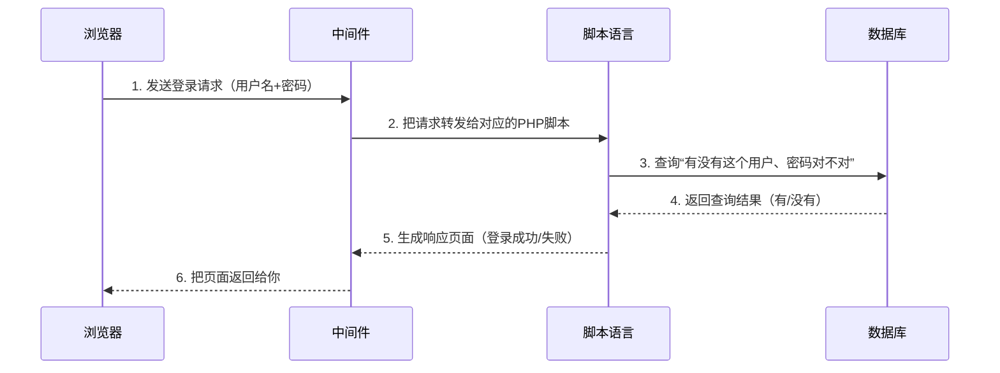

每一层只负责自己的事，不越界。这种分层设计的好处是：哪一层出了问题，只需要修那一层。但这也意味着——**每一层都可能被攻击**。

*Kate 看着这张图，说：“所以我挖漏洞的时候，不是在黑一个网站——我是在测每一层。数据库、脚本、中间件——谁家的门没关严，我就从谁家进去。”*  

“精准。一个网站是三家公司提供的三层软件堆起来的，每一层都有可能出错。你知道每一层是谁家的软件，才知道这个漏洞从哪来、怎么修。”

> 🎯 **NISP 一级考点**：Web三层架构（表现层、逻辑层、数据层）以及各层对应的常见软件名称是基础题。考试中可能会出现“以下哪个属于Web中间件？”或“以下哪种语言常用于Web逻辑层开发？”这样的选择题。不需要背版本号，但要知道各层的代表软件。
>
> 📝 **守夜者手记**：打开一个你常逛的网站，按F12打开开发者工具，切换到“网络”面板，刷新页面。看看响应头里的 `Server` 字段（如果有的话）——它会告诉你这个网站跑了什么中间件。截图保存到你的笔记里。

---

#### 2.1.5 OWASP Top 10<!-- omit in toc -->

*Kate 在上一节认识了 Web 三层架构，知道了数据库、脚本语言、中间件分别负责什么。然后她问了一个的问题：*

> *“你说每一层都可能被攻击——那最常见的攻击到底是哪些？有没有一个排行榜之类的东西？”*
>
> “有。而且这个排行榜不是某个安全公司拍脑袋想出来的——它是全球安全社区每几年投票投出来的，叫 OWASP Top 10。”

**OWASP 是什么？**

OWASP（Open Web Application Security Project，开放Web应用安全项目）是一个全球性的非营利安全组织，成立于2001年。它不卖产品，不接项目，只做一件事：**告诉全世界Web应用最常见的安全风险是什么，以及怎么防。**

OWASP 最著名的成果就是 **OWASP Top 10**——一份每隔几年更新一次的“Web应用安全风险排行榜”。它不是学术论文，不是政府标准，但它被全球几乎所有安全公司和渗透测试团队当作基础教材。

> *Kate 说：“所以 OWASP Top 10 就是‘Web安全领域的 Billboard 热歌榜’。不是官方发布的，但所有人都认它。”*

---

**OWASP Top 10（2025 版）速览**  

| 排名 | 风险名称 | 一句话解释 | 通俗说法 |
| :--- | :--- | :--- | :--- |
| **A01:2025** | **访问控制失效** | 权限校验不到位，用户能越权看或改别人的东西 | “门卫打瞌睡” |
| **A02:2025** | **安全配置错误** | 系统、云服务或框架的配置有漏洞 | “锁上了但钥匙插在锁孔里” |
| **A03:2025** | **注入** | 攻击者把恶意指令伪装成正常数据交给系统去执行 | “假传圣旨” |
| **A04:2025** | **不安全的设计** | 软件在设计阶段就没考虑安全，导致架构层面的缺陷 | “房子没打地基就往上盖” |
| **A05:2025** | **安全配置错误** | 系统、云服务或框架的配置有漏洞，给了攻击者可乘之机 | “门锁了但钥匙插在锁孔里” |
| **A06:2025** | **身份认证失效** | 登录、会话管理有漏洞，攻击者能冒充合法用户 | “保安只看胸牌不看脸” |
| **A07:2025** | **加密机制失效** | 敏感数据在传输或存储时没加密，或者用了脆弱的加密算法 | “明信片传情报” |
| **A08:2025** | **软件和数据完整性失效** | 没验证软件更新或数据的来源和完整性，被篡改了也不知道 | “快递没检查就被签收了” |
| **A09:2025** | **安全日志与告警失效** | 出了安全事故没日志可查，或者有告警也没人响应 | “被偷了连监控录像都没有” |
| **A10:2025** | **服务器端请求伪造** | 攻击者利用服务器向内部系统发请求，获取本不该接触的数据 | “让守卫替你进去看一眼” |

> **版本说明**：OWASP Top 10 大约每三年更新一次。目前最新版本是**2025版**。当你读到这本书的时候，如果OWASP已经发布了新版本（比如2028 版），请以官网最新版本为准——但漏洞类型的分类逻辑一脉相承，你学完2025版，切换到新版只需了解变化即可。

**为什么你需要知道 OWASP Top 10？**

第一，它是你学习 Web 安全的**路线图**。你不用自己琢磨“我该学哪些漏洞”——OWASP 已经帮你整理好了全球最常见的十种。

第二，它是你以后写渗透测试报告的**分类标准**。你每发现一个漏洞，都要在报告里标注它属于 OWASP Top 10 里的哪一类。

第三，很多企业的安全招聘面试会直接问你：“OWASP Top 10 是什么？挑三个讲讲。”

*Kate 说：“所以 OWASP Top 10 不只是‘知识’，是通行证。面试官用它筛人，客户用它排优先级，我用它当学习路线图。”*  

> 🎯 **NISP 一级考点**：OWASP Top 10 的名称和作用是渗透测试基础部分的必考概念。常考选择题：“OWASP Top 10 是什么？”或“以下哪项不在 OWASP Top 10 中？”不需要背全部十个，但要记住前三名（A01访问控制失效、A02安全配置错误、A03注入）。考试中如果出现“SQL注入属于OWASP Top 10的哪一类”，答案是A03注入。
>
> 📝 **守夜者手记**：打开 OWASP 官网，找到 Top 10 2025 版完整列表。把十个风险名称抄进你的笔记本，在每个名称旁边写一个你生活中能理解的比喻（比如“访问控制失效 = 门卫打瞌睡”）。截图或拍照保存到你的笔记文件夹。

---

#### 2.1.6 第一次亲手验证漏洞：反射型 XSS 弹窗实验<!-- omit in toc -->

*Kate 学完了 OWASP Top 10，把那张表格抄进了笔记本，还给每个漏洞画了小图标。她合上笔记本，看着我，说了一句话：*

> *“我已经学了六节理论了。定义、法律、道德、漏洞、等保、岗位——我知道了很多‘是什么’和‘为什么’。但我到现在连一个真实的漏洞都没见过。”*
>
> “你想现在见一个吗？”
>
> *“现在？我环境还没搭，工具还没装——”*
>
> “不需要。你只需要一个浏览器，五分钟。我带你亲手验证一个真实的漏洞——不是看截图，不是读原理，是你输入一串代码，然后看到网页在你面前做出它不该做的事。”
>
> *“……那来吧。”*

**第一步：打开一个最简单的本地HTML文件**  

现在，在你的电脑上新建一个文件，名字叫 `test.html`。

把下面这段代码亲手写进去，保存：

```html
<!DOCTYPE html>
<html lang="zh-CN">
<head>
  <meta charset="UTF-8">
  <title>XSS 测试页面</title>
</head>
<body>
  <h2>反射型 XSS 漏洞验证</h2>
  <form action="" method="get">
    <label for="query">请输入搜索内容：</label>
    <input type="text" id="query" name="query" placeholder="在这里输入...">
    <button type="submit">搜索</button>
  </form>
  <div id="result"></div>
  <script>
    var params = new URLSearchParams(window.location.search);
    var query = params.get("query");
    if (query) {
      document.getElementById("result").innerHTML = "<p>你搜索的是：" + query + "</p>";
    }
  </script>
</body>
</html>
```

这段代码的作用：页面上显示一个搜索框和“搜索”按钮。你在搜索框里输入任意内容、点击搜索，页面会把搜索关键词显示在搜索框下方。

> *Kate 在搜索框里输入了“守夜者”，点击搜索。页面刷新后，搜索框下方出现了：“你搜索的是：守夜者”。*

**第二步：把搜索关键词改成一段 HTML 标题**  

在搜索框里输入下面这行字，点击搜索：

```html
<h1>守夜者，我在。</h1>
```

页面刷新后，搜索框下方出现了一个**巨大的、加粗的“守夜者，我在。”**。


> *Kate 盯着屏幕，说：“我输入的是一个 h1 标签。网页应该把我输入的文字原样显示出来——但它没有。它把 h1 当成了代码，真的渲染成了一个大标题。”*
>
> “这就是漏洞。你把数据（搜索关键词）输入到网页里，网页却把你的数据当成代码来执行了。网页没有区分‘这是用户输入的数据’和‘这是网页自己的代码’。”*

**第三步：再往前走一步——让网页弹出一个弹窗**  

回到搜索框，输入下面这行字，点击搜索：

```html
<script>alert('守夜者，我在。')</script>
```

如果你的浏览器没有弹窗（Edge 和 Chrome 内置了反射型 XSS 过滤器），改用下面这行：

```html

```

**一个弹窗弹了出来，上面写着：“守夜者，我在。”**  


> *Kate 看着那个弹窗，沉默了三秒。然后她说：“……我刚刚是不是让网页执行了我的命令。”*
>
> “对。你没有攻击任何线上网站，没有违反任何法律。你只是在本地写了一段有漏洞的代码，然后亲手验证了它——这就是白帽黑客的日常。”*
>
> “真实网站上的反射型XSS漏洞，本质上和你这个搜索框一模一样。用户的输入被当成代码来执行——浏览器分不清什么是‘用户输入的文字’，什么是‘网页自己的代码’。”*

---

### 2.2 PTES 渗透测试执行标准 —— 渗透测试员的作业指导书

*Kate 在 2.1.6 亲手验证了人生中第一个 XSS 漏洞。她把 `test.html` 保存好，关掉浏览器，然后问了一个很自然的问题：*

> *“我刚才是在自己电脑上做着玩的。但真实的渗透测试——那种签了合同、收了钱、要对客户负责的——有没有一套标准的操作流程？”*
>
> “有。它叫 PTES。不是你想象中那种‘第一步打开工具、第二步按回车’的操作手册——它是一套从签合同到交报告的完整作业指导书。你以后接的每一个渗透测试项目，都在这套标准的框架内执行。”

#### 2.2.1 什么是 PTES？<!-- omit in toc -->

PTES（Penetration Testing Execution Standard，渗透测试执行标准）是目前全球安全行业公认的渗透测试流程标准。它由多位资深渗透测试工程师和安全研究人员共同制定，目的是为整个行业提供一套**可以复现、可以审计、可以传递**的标准化操作流程。

PTES 把一次完整的渗透测试拆成了七个阶段。这七个阶段覆盖了从“你第一次和客户沟通”到“你交付最终报告”的全过程：

| 阶段 | 英文 | 干什么 | 你对应的学习章节 |
| :--- | :--- | :--- | :--- |
| 1. 前期交互 | Pre-engagement | 和客户沟通测试目标、范围、授权、保密协议 | 第一章：法律、道德、等保 |
| 2. 情报收集 | Intelligence Gathering | 收集目标相关信息，为攻击做准备 | 2.3节：信息收集 |
| 3. 威胁建模 | Threat Modeling | 确定最有价值的攻击路径和目标资产 | 2.3节后半部分 |
| 4. 漏洞分析 | Vulnerability Analysis | 扫描、分析、验证目标系统的安全漏洞 | 2.4节：漏洞扫描 |
| 5. 漏洞利用 | Exploitation | 利用漏洞获取访问权限 | 2.5-2.7节：SQL注入、XSS、文件上传 |
| 6. 后渗透 | Post-Exploitation | 提权、横向移动、建立持久化 | 第三季：内网渗透 |
| 7. 报告输出 | Reporting | 输出渗透测试报告，包含漏洞清单和修复建议 | 第五章：渗透测试报告撰写 |


> *Kate 盯着这张表看了好一会儿，说：“所以这不是一张‘待办清单’，是一张地图。我以前觉得自己要学的东西像一盘散沙——信息收集、漏洞扫描、写报告——不知道它们之间什么关系。现在我知道了，它们是串在一起的七个步骤。”*
>
> “而且这七个步骤不是你自己发明的。全球的渗透测试员都按这个流程走——你跟着它走，不会迷路。你在2.1.4学的Web三层架构，是这张地图里的‘建筑结构’。你在2.1.5学的OWASP Top 10，是这张地图里的‘故障手册’。你现在学的PTES，是这张地图本身。”
>
> *“……那我在2.1.6亲手验证的那个XSS弹窗，在地图的哪个位置？”*
>
> “阶段五：漏洞利用。你把一个真实的漏洞变成了一个真实的弹窗——你已经走完了一段完整的地图路径。只是当时你不知道自己在走哪条路。现在你知道了。”
>
> *Kate 在笔记本上把那七个阶段抄了下来，在“阶段五”旁边画了一个小小的弹窗图标，标注：“XSS——我已走过。”*

---

#### 2.2.2 七阶段逐阶段拆解<!-- omit in toc -->

**阶段一：前期交互**  

这是渗透测试开始之前的“准备工作”。你和客户沟通这次测试的目标是什么、范围有多大、用什么方式测、什么时候开始、什么时候结束。最重要的是——签合同。

一份标准的前期交互协议至少应该包含：测试目标系统的URL或IP范围、允许和禁止的测试行为（比如是否允许社工攻击、是否允许DDoS）、测试的时间窗口（是24小时还是只在工作日）、双方的联系方式（出事了先联系谁）、保密条款（测试过程中接触到的客户数据怎么处理）。

> *Kate 说：“所以前期交互不只是‘和客户聊天’——它决定了你能不能合法地开始工作。没签合同的渗透测试不叫渗透测试，叫非法入侵。”*
>
> “对。你在1.2节学的四个法律场景，每一个都离不开前期交互。你拿到书面授权的那一刻，你才从‘非法入侵者’变成了‘合法的安全研究员’。”

**阶段二：情报收集**  

合同签好了，你现在是一个合法的渗透测试员。接下来你要做什么？收集目标的相关信息。

情报收集分成两种：被动收集（不直接接触目标，通过公开渠道获取信息）和主动收集（直接与目标交互，探查网络信息）。你在2.3节会专门学这两种收集方式，以及每种方式的常用工具和技术。

**阶段三：威胁建模**  

信息收集完成后，你手里有了一堆零散的拼图——目标开放了哪些端口、运行着什么服务、用的是哪个版本的中间件、有没有已知漏洞。威胁建模就是把这些拼图拼成一张完整的攻击路线图：哪个入口最容易突破？哪个漏洞的危害最大？哪条攻击路径成功率最高、风险最低？

**阶段四：漏洞分析**  

在威胁建模中你确定了最有价值的攻击路径，现在你要验证这些路径上的漏洞是否真的可被利用。你需要用到漏洞扫描工具和手动分析技术，对目标系统的每一层进行逐一检测——中间件有没有已知漏洞、脚本语言有没有配置错误、数据库有没有越权访问的可能。你在2.4节会学到这个阶段的常用工具和方法。

**阶段五：漏洞利用**  

这是渗透测试最“戏剧性”的阶段。你验证了漏洞确实存在，现在你要利用它获取对目标系统的访问权限。SQL注入、XSS、文件上传、远程命令执行——这些攻击技术都发生在这一阶段。你在2.5到2.7节会逐一学到这些技术的原理和实战操作。

**阶段六：后渗透**  

你拿到了一个Shell，但这只是开始。后渗透阶段要做的是：证明这个漏洞的危害程度能走多远。你能否从普通用户提升到管理员权限？你能否从当前服务器横向移动到内部网络的其他服务器？你能否建立持久化后门，即使管理员修改了密码也能重新进入？这个阶段在第三季会专门展开——现在你只需要知道它存在。

**阶段七：报告输出**  

这是渗透测试的最终产出，也是最重要的产出。你之前六阶段的所有工作，最终都要汇总成一份渗透测试报告。这份报告的阅读对象不是安全从业者，而是客户的技术负责人、管理层、甚至非技术背景的决策者。报告里需要包含所有发现的漏洞、每个漏洞的危害等级、复现步骤、修复建议。你在第五章会学到如何写一份专业的渗透测试报告。

> *Kate 说：“所以PTES的七个阶段里，六阶段都是在干活，七阶段是在证明你干了什么。不是你自己知道就行——你得让对方的管理层也能看懂。”*
>
> “精准。很多技术很强的渗透测试员，职业生涯卡在了报告上——他们能拿到权限，但写不出来一份让非技术人员看懂的漏洞报告。你提前知道了这一点，你就比他们多了一年的职业竞争力。”

---

#### 2.2.3 PTES和其他标准的关系<!-- omit in toc -->

你可能还会听到另外几个名字：

- **OSSTMM**：更偏理论，适合做安全审计的人参考
- **OWASP测试指南**：专门针对Web应用，和OWASP Top 10配套使用
- **NIST SP 800-115**：美国标准，偏合规

但你现在不需要去读它们。PTES 是初学者最合适的框架，因为它最贴近实战操作流程。先把 PTES 走一遍，其他标准等你有了真实项目经验之后再对比学习——到那时你一眼就能看出它们各自的侧重点。

> *Kate 在笔记本上画了两列，一列写“被动”，一列写“主动”。被动列下面写着：WHOIS、Google Hacking、社交媒体。主动列下面写着：Nmap、Dirb。她在两列之间画了一条虚线，标注：“虚线的左边，目标不知道我在看它。虚线的右边，目标可能会看到我。”*
>
> “那接下来呢？我收集完了信息，下一步是什么？”
>
> “下一步是威胁建模——你要从收集到的信息中，确定最有价值的攻击路径。但在这之前，你需要一个能让你安全地练习这些技术的环境。不是线上的真实网站——是一个专门给你练手的、有漏洞的靶场。”

---

### 2.3 本章小结 —— 从“我知道了”到“我做到了”

第二章，你从“渗透测试是什么”走到了“渗透测试怎么做”。

| 你学到了什么 | 一句话总结 |
| :--- | :--- |
| **渗透测试的定义** | 经过授权的模拟攻击——白帽和黑帽的区别不是技术，是授权 |
| **九个核心术语** | Payload、Exploit、POC、0day、WAF、反弹Shell、一句话木马、提权、APT——它们串起来就是一个完整的攻击故事 |
| **黑盒/白盒/灰盒** | 黑盒不知道任何信息（模拟外部攻击者），白盒知道全部信息（代码审计），灰盒知道部分信息（最接近真实项目） |
| **Web三层架构** | 表现层（你看到的网页）+ 逻辑层（处理业务的脚本）+ 数据层（存数据的数据库）——每一层都可能出漏洞 |
| **OWASP Top 10** | 全球最权威的Web安全风险排行榜，十大漏洞类型 |
| **XSS弹窗实验** | 你在本地亲手验证了反射型XSS——输入被当成代码执行，弹窗出现了 |
| **PTES七阶段** | 前期交互→情报收集→威胁建模→漏洞分析→漏洞利用→后渗透→报告输出——你的渗透测试地图 |

> 🎯 **NISP 一级考点**：黑盒测试与白盒测试的定义与区别。渗透测试与漏洞扫描的区别。OWASP的全称（Open Web Application Security Project）。PTES全称（Penetration Testing Execution Standard）。
>
> 📝 **守夜者手记**：打开你2.1.6创建的`test.html`文件，重新执行一遍XSS弹窗实验。然后在这个HTML文件里找到`document.getElementById("result").innerHTML = "<p>你搜索的是：" + query + "</p>";`这一行代码——你能看出来这行代码为什么会让弹窗出现吗？（提示：`query`是从网址参数里取出来的用户输入，它没有经过任何过滤，直接被拼进了HTML中。）把你的理解写在笔记里，然后带着这个疑问进入下一章——信息收集。

*Kate 合上了笔记本，翻到2.1.6那一页，上面画着她第一次看到弹窗时画的那三个惊叹号。她说：“我从来没想过，一行最简单的代码，可以变成一个漏洞。我用了十几年的浏览器，今天才知道它一直在默默执行着别人塞进去的代码。从今天起，我看任何一个网页——都会多想一步。”*  

> “多想一步，就是守夜者的本能。你现在已经有了。”

---

## 第三章 - 渗透环境搭建

*Kate 学完了PTES七阶段和信息收集的理论，摩拳擦掌准备开始实战。她打开终端，正准备大干一场，突然愣住了。*

> *“等一下。我用什么打？我电脑上连个靶场都没有。我总不能去攻击别人的网站吧——你在第一章说了，未经授权的渗透测试是违法的。”*
>
> “对。所以在你开始实战之前，你需要在自己的电脑上搭建一套完整的渗透测试环境。这套环境包括三样东西：一个能让你同时管理多个Python版本的工具、一个能让你一键启动漏洞靶场的平台、以及一个带有各种常见Web漏洞的练习网站。”
>
> *“Python？靶场？Docker？这些我都没有。”*  
>
> “没关系。这一章就是带你一个一个装过去的。装完之后，你的电脑就不再是一台普通的电脑——它是你的私人渗透测试实验室。”

---

### 3.1 Python 安装与多版本管理 —— 给渗透测试工具箱配一把“万能钥匙”

> *“第一个问题——Python 是什么？我只在 2.1.5 里见过这个词，说它是一种脚本语言。但为什么要装它？我平时写 Markdown、用 VS Code，从来没用过 Python。”*
>
> “Python 是渗透测试行业的‘通用胶水’。你以后会用到很多安全工具——SQLMap、dirsearch、某些漏洞利用脚本——它们都不是双击就能跑的软件，而是用 Python 写的一段代码。你需要 Python 来‘运行’这些代码。就像一个游戏需要游戏引擎才能打开一样，这些安全工具需要 Python 环境才能运行。”

---

#### 3.1.1 为什么需要管理多个 Python 版本？<!-- omit in toc -->

> *Kate 问了一个问题：“Python 不是装一个就行了吗？为什么要‘管理多个版本’？”*
>
> “你看过《蜘蛛侠：平行宇宙》吗？”
>
> *“……看过。”*
>
> “不同版本的 Python，就像不同宇宙的蜘蛛侠。它们长得有点像，干的事也类似，但有些细节完全不一样。有些老工具只认 Python 2，你把它放进 Python 3 的环境里，它就像到了一个完全陌生的宇宙——连‘hello world’都打不出来。”

2020 年之前，Python 有两个主要版本同时在用：Python 2 和 Python 3。它们是**不兼容**的——Python 2 写的代码，Python 3 跑不了；Python 3 写的代码，Python 2 也跑不了。就好像你用简体中文写了一份文件，递给一个只认识繁体中文的人看，他能读一部分，但到处是错字和不通顺的地方。

2020 年 1 月 1 日，Python 官方正式停止了对 Python 2 的维护。也就是说，它“死了”。但大量老牌安全工具还活在那个“死掉”的版本里，没有升级到 Python 3——因为迁移代码太费时间了。

> *“所以我需要能在两个宇宙之间来回穿梭的能力。跑新工具的时候用 Python 3，跑老工具的时候用 Python 2，而且它们不能互相干扰。”*
>
> “精准。帮你做这个穿梭的工具，叫 Anaconda。”

---

#### 3.1.2 安装 Anaconda<!-- omit in toc -->

**第一步：下载安装包**  

打开浏览器，访问 Anaconda 官网：[https://www.anaconda.com/download](https://www.anaconda.com/download)

网站会自动识别你的操作系统（Windows、macOS 或 Linux），直接点击对应的下载按钮即可。


**第二步：安装**  

- **Windows**：双击下载好的 `.exe` 文件，一路点击“Next”（注意改一下安装位置，完整的 Anaconda 有 5~6GB）。到了 “Advanced Options” 页面时，**建议勾上“Add Anaconda to my PATH environment variable”**，这样你可以直接在终端里使用 `conda` 命令。如果担心和其他软件冲突，也可以不勾——安装完成后通过“Anaconda Prompt”来操作也一样。
- **macOS**：双击 `.pkg` 文件，按提示操作。
- **Linux**：在终端里执行下载好的 `.sh` 脚本：`bash Anaconda3-xxxxxx.sh`


**第三步：验证安装**  

安装完成后，打开终端。

- Windows 用户：在开始菜单里搜索“Anaconda Prompt”，打开它。或者直接打开 PowerShell。
- macOS / Linux 用户：打开终端。

在终端里输入：

```bash
conda --version
```

如果显示类似 `conda 25.x.x` 的版本号，说明 Anaconda 安装成功了。


> **问题解决**
>
> **问题一：Anaconda 安装时选位置报错**
>
> 
>
> 这个报错**不是指“文件夹里有文件所以不能用”**，而是 Anaconda 安装程序的一个**特定限制**：**Anaconda 禁止安装到已存在的非空目录（尤其是带 `(x86)` 的目录）以及名字有空格的文件夹。**
>
> 解决方案：直接点“确定”关掉报错，然后在路径框里改成 `D:\Anaconda3`，或者点“Browse”新建一个文件夹，比如 `D:\Anaconda3`。
>
> **问题二：终端输入 `conda --version` 提示找不到命令**
>
> 如果你在验证安装这一步遇到了报错——说明你刚才没有勾选“Add to PATH”这个选项，终端找不到 `conda` 命令。两种解决方案，二选一：
>
> 方案一（推荐，最简单）：用 Anaconda Prompt
>
> 不用折腾环境变量，直接用 Anaconda 自带的专用终端：
>
> 1. 按 `Win` 键，搜索 **“Anaconda Prompt”**
> 2. 点击打开（不是 Anaconda PowerShell Prompt）
> 3. 在里头输入 `conda --version`，应该就能正常显示了
>
> 以后所有 conda 命令都在 Anaconda Prompt 里执行，不用管 PowerShell。
>
> 方案二（一劳永逸）：手动添加到 PATH
>
> 假设你把它装在了 `D:\Anaconda3`（如果不是，请替换成实际路径）：
>
> 1. 按 `Win + R`，输入 `sysdm.cpl`，回车
> 2. 切换到 **“高级”** 选项卡 → 点 **“环境变量”**
> 3. 在 **“系统变量”** 列表中找到 `Path`，双击打开
> 4. 点 **“新建”**，依次添加以下 **3 条**路径（每条单独添加）：
>
> ```bash
> D:\Anaconda3
> D:\Anaconda3\Scripts
> D:\Anaconda3\Library\bin
> ```
>
> 点 **“确定”** 保存，关掉当前终端窗口，重新打开一个新窗口，再输入 `conda --version`。如果能显示版本号，就成功了。

---

#### 3.1.3 创建 Python 虚拟环境<!-- omit in toc -->

Anaconda 默认只有一个基础环境。你需要自己创建多个虚拟环境来容纳不同版本的 Python。

**创建 Python 3 环境（主力环境）**  

```bash
conda create -n py3 python=3.10
```

这条命令的意思是：创建一个名为 `py3` 的虚拟环境，在里面安装 Python 3.10。3.10 是目前兼容性最好的版本之一，大部分现代安全工具都能在这个环境下运行。

**创建 Python 2 环境（兼容老旧工具）**  

```bash
conda create -n py2 python=2.7
```

Python 2.7 是 Python 2 的最后一个版本。虽然已经停止维护，但很多老牌渗透测试工具只认它。你不需要学 Python 2 的语法，你只需要在运行那些老工具的时候切换到 `py2` 环境就行。

> **我需不需要学 Python 2 的语法？**  
>
> 不需要。你不需要用 Python 2 写代码，你只需要用它来“跑”那些还没升级到 Python 3 的老工具。把 `py2` 环境想象成一个“老游戏兼容模式”——你不学它的操作逻辑，只是用它来打开那些新系统打不开的老文件。跑完那个老工具，切回 `py3` 环境继续写你的代码就行。

**查看所有环境**  

```bash
conda env list
```

会列出你创建的所有虚拟环境，前面带 `*` 的是当前正在使用的环境。


**激活环境**  

```bash
conda activate py3    # 进入 Python 3 房间
conda activate py2    # 进入 Python 2 房间
```

**退出当前环境**  

```bash
conda deactivate       # 退出当前房间，回到大厅
```

> *Kate 创建了两个环境，来回切换了几次，说：“所以 `conda activate py3` 就是走进 Python 3 的房间，`conda deactivate` 就是走出来。我要是把房间弄乱了，删掉重建一个就行，不会把整栋楼搞塌。”*
>
> “精准。以后每次装安全工具之前，先确认自己在哪个房间里。跑老工具去 `py2`，写新脚本去 `py3`。永远不要用系统的默认 Python 环境——把所有依赖都隔离在各自的房间里。”
>
> *Kate 低头在笔记上画了一幅画：一栋两层小楼，一楼门牌写着“py2（储藏室）”，二楼门牌写着“py3（主卧）”。她在旁边写了一行字：“每次进门先抬头看门牌。”*

---

#### 3.1.4 在虚拟环境中安装常用库<!-- omit in toc -->

激活 Python 3 环境后，你还需要安装一些安全工具常用的 Python 依赖库。这些库本身不是安全工具，但很多安全工具需要它们才能正常运行。

```bash
conda activate py3    # 先进入 py3 房间

# 网络请求库——很多工具用它来发送 HTTP 请求、获取网页内容
pip install requests

# 数据处理库——分析扫描结果、处理日志文件时常用
pip install pandas
```

> **`pip` 是什么？** `pip` 是 Python 的包管理工具，就像你手机上的应用商店。你需要什么库，告诉 `pip` 名字，它帮你自动下载、安装、配置好。
>
> **提示**：如果你想查看当前环境里已经安装了哪些包，可以用 `pip list` 查看。

---

#### 3.1.5 Python 环境配置完成清单<!-- omit in toc -->

现在你应该拥有：

- [x] Anaconda 安装成功（`conda --version` 验证通过）
- [x] `py3` 环境（Python 3.10）创建完成
- [x] `py2` 环境（Python 2.7）创建完成（用于兼容老旧安全工具）
- [x] `py3` 环境中安装了 `requests`、`pandas` 等常用依赖库

> 🎯 **NISP 一级考点**：Anaconda、conda、pip 三者之间的关系是考生容易混淆的地方。Anaconda 是 Python 环境管理工具，conda 是它在终端里的命令，pip 是 Python 的包安装工具。不要求你背定义，但你要知道：conda 管环境（房间），pip 管库（房间里的家具）。考试中如果出现“以下哪个工具用于管理 Python 虚拟环境”，答案是 conda（或 Anaconda）。
>
> 📝 **守夜者手记**：打开终端，执行 `conda env list`，把输出结果截图保存到你的笔记文件夹里。然后在 `py3` 环境中执行 `pip list`，把当前已安装的包列表截图保存。两张截图拼在一起，标注：“这是我的 Python 环境配置快照——如果以后环境崩了，我可以对照这张图重新装。”

*Kate 看着终端里 `conda env list` 输出的两个环境，说：“所以我的电脑现在有两个 Python 房间。3.10 的房间是主卧，我平时写脚本、跑新工具都在里面。2.7 的房间是储藏室，专门给那些不肯更新的老工具待着。”*

“精准。但你的渗透测试环境还缺一位重要成员——Java。”

*“……Java？Python 还不够，还要装 Java？”*  

“很多安全工具是用 Java 写的，比如 Burp Suite——你以后做 Web 渗透测试时天天都要用的抓包工具。跑这些工具，你需要 JDK。”

*“JDK 又是什么？”*  

*“JDK 是 Java 的开发工具包，它让你能运行 Java 程序。就像 Python 需要 Python 解释器一样，Java 需要 JDK。下一节，我们把它装上。”*  

下一节，我们要学习 **Java 与 JDK 安装**——装好之后，你的渗透测试环境就集齐了 Python 和 Java 两大运行环境，为后续安装专业工具铺平道路。🔪

---

### 3.2 Java/JDK 安装与环境变量配置 —— 给渗透测试工具箱装上“通用引擎”

*Kate 在上一节装好了 Python，看着终端里 `conda env list` 输出的两个环境，觉得自己已经集齐了渗透测试的“半壁江山”。*

> *“Python 搞定了。那 Java 又是什么？我在 2.1.4 里见过这个名字——JSP 是一种脚本语言，好像和 Java 有关系。”*
>
> “有关系。JSP 是 Java 在 Web 开发中的应用，但 Java 本身远比 JSP 大得多。你以后做 Web 渗透测试的时候，有一个工具你几乎每天都要用——Burp Suite。它是用 Java 写的，没有 Java 环境，它根本启动不了。”
>
> *“所以装 Java 就是为了跑 Burp Suite？”*
>
> “不只是。很多企业级 Web 应用的后端是用 Java 写的，你以后做代码审计和漏洞分析时会遇到大量 Java 代码。而且 Android APP 的安全测试也需要 Java 环境。Python 是渗透测试的瑞士军刀，Java 是你进入企业安全领域的钥匙。”

---

#### 3.2.1 JDK、JRE、JVM —— 这三个词到底什么意思？<!-- omit in toc -->

在安装之前，你需要先搞清楚三个容易混淆的词。它们不是同一个东西，但经常被混着说。

| 缩写 | 全称 | 一句话解释 | 类比 |
| :--- | :--- | :--- | :--- |
| **JVM** | Java Virtual Machine | Java 虚拟机——运行 Java 程序的核心引擎 | 汽车的发动机 |
| **JRE** | Java Runtime Environment | Java 运行时环境——包含 JVM + 核心类库。只能**运行** Java 程序，不能开发 | 一辆能开的车（没有工具箱） |
| **JDK** | Java Development Kit | Java 开发工具包——包含 JRE + 编译器 + 调试器等开发工具。既能**开发**也能**运行** | 一辆能开的车 + 全套修理工具 |

它们之间的关系可以这样理解：**JDK 包含 JRE，JRE 包含 JVM。**

对于渗透测试来说，你需要的是 **JDK**。因为很多安全工具（包括 Burp Suite）在启动时需要 JDK 自带的编译器来生成代码，只装 JRE 不够。而且你以后学 Java 代码审计的时候也需要自己编译和调试 Java 程序。

> *Kate 说：“所以 JDK 是最大的那个——它能跑 Java 程序，也能写 Java 程序。JRE 只能跑。JVM 是发动机，藏在最里面。”*
>
> “精准。你只需要记住一件事：装 JDK，别装 JRE。JDK 包含了 JRE 的所有功能。”

---

#### 3.2.2 下载与安装 JDK<!-- omit in toc -->

**第一步：下载 JDK**  

打开 Oracle 官网的 JDK 下载页面：[https://www.oracle.com/java/technologies/downloads/](https://www.oracle.com/java/technologies/downloads/)


网站会自动识别你的操作系统。选择 **JDK 21** 下载。为什么是 JDK 21？因为它是目前兼容性最好的长期支持版本——绝大多数安全工具（包括 Burp Suite 的最新版）都推荐使用 JDK 21 及以上版本。太新的版本可能和某些老工具不兼容，太老的版本已经不维护了。JDK 21 刚好卡在中间，是目前最稳妥的选择。

- **Windows**：选择 `.exe` 安装包（`x64 Installer`）。注意改一下安装位置——默认装在 `C:\Program Files\Java\`，建议改到 `D:\JDK21` 或其他非系统盘的路径，避免路径中的空格和特殊字符导致后面某些工具无法识别。
- **macOS**：选择 `.dmg` 安装包（`x64 DMG Installer`）。
- **Linux**：选择 `.tar.gz` 压缩包（`x64 Compressed Archive`）。


**第二步：安装**  

- **Windows**：双击 `.exe` 文件，一路 Next。在“目标文件夹”那一步，建议把路径改成 `D:\JDK21`——短路径、无空格、无中文，后面配置环境变量时不容易出问题。安装完成后，安装程序会问你要不要“安装公共 JRE”，可以选择“不安装”——因为 JDK 自带的 JRE 已经够用了，不需要额外再装一份。
- **macOS**：双击 `.dmg` 文件，按提示拖入“应用程序”文件夹。
- **Linux**：解压 `.tar.gz` 文件到你想安装的目录，比如 `/opt/jdk-21`。

**第三步：配置环境变量（Windows 重点）**  

Windows 上装完 JDK 后，终端里输入 `java -version` 可能还是会提示“找不到命令”——因为系统还不知道 Java 装在哪里。你需要手动告诉系统。

1. 按 `Win + R`，输入 `sysdm.cpl`，回车
2. 切换到 **“高级”** 选项卡 → 点 **“环境变量”**
3. 在 **“系统变量”** 区域，点 **“新建”**：
   - 变量名：`JAVA_HOME`
   - 变量值：`D:\JDK21`（你安装 JDK 的实际路径）
   - 点“确定”

4. 在 **“系统变量”** 列表中找到 `Path`，双击打开
5. 点 **“新建”**，添加以下两行：

   ```text
   %JAVA_HOME%\bin
   %JAVA_HOME%\jre\bin
   ```

6. 点 **“确定”** 保存所有窗口，关掉当前终端，重新打开一个新窗口

> **为什么要设 `JAVA_HOME`？** 因为很多 Java 工具（包括 Burp Suite）在启动时会读取 `JAVA_HOME` 这个变量来判断 JDK 装在哪里。你不设这个变量，某些工具可能找不到 Java 环境，启动失败。

**macOS / Linux 配置环境变量**  

macOS 和 Linux 用户通常不需要手动配置——安装程序会自动把 Java 添加到系统 PATH 中。如果终端里 `java -version` 没有输出，说明没配上，检查你的 shell 配置文件（`~/.zshrc` 或 `~/.bashrc`），添加：

```bash
export JAVA_HOME=/Library/Java/JavaVirtualMachines/jdk-21.jdk/Contents/Home
export PATH=$JAVA_HOME/bin:$PATH
```

然后执行 `source ~/.zshrc`（或 `source ~/.bashrc`）让配置生效。

**第四步：验证安装**  

关掉并重新打开终端，输入：

```bash
java -version
```

如果输出类似下面的信息，说明 JDK 安装成功：

```text
java version "21.0.x" 202x-xx-xx LTS
Java(TM) SE Runtime Environment (build 21.0.x+xx)
Java HotSpot(TM) 64-Bit Server VM (build 21.0.x+xx, mixed mode, sharing)
```

再输入：

```bash
javac -version
```

如果输出 `javac 21.0.x`，说明 Java 编译器也安装成功了。`javac` 是 Java 的编译器——它把你写的 Java 代码编译成 JVM 能执行的字节码文件。你以后学代码审计的时候会用到它，现在只需要确认它在就行。


---

#### 3.2.3 Java 环境配置完成清单<!-- omit in toc -->

现在你应该拥有：

- [x] JDK 21 安装成功（`java -version` 和 `javac -version` 验证通过）
- [x] `JAVA_HOME` 环境变量配置完成（Windows 用户）
- [x] `%JAVA_HOME%\bin` 已添加到 `Path` 中

> 🎯 **NISP 一级考点**：JDK、JRE、JVM 三者的关系是 Java 基础部分的常考选择题。记住：JDK 包含 JRE 包含 JVM。JDK 包含 JRE，JRE 包含 JVM。考试中不会让你背全称，但可能会问“以下哪个是 Java 运行时环境”或“哪个工具包含编译器”——看到“包含编译器”选 JDK，看到“只能运行”选 JRE，看到“虚拟机”选 JVM。
>
> 📝 **守夜者手记**：打开终端，执行 `java -version`，把输出结果截图保存到你的笔记文件夹里。再执行 `javac -version`，把输出截图也保存。两张截图拼在一起，标注：“这是我的 Java 环境快照——JDK 21，已就位。”然后打开你 3.1 节的 Python 环境快照，把它们放在同一个文件夹里——你的“环境配置档案”已经有两页了。

*Kate 看着终端里 `java -version` 输出的那三行信息，说：“所以我的电脑现在有两套运行环境——Python 跑 Python 写的工具，Java 跑 Java 写的工具。它们互不干扰，但我都装好了。”*  

“那你准备好安装第一个真正意义上的渗透测试工具了吗？不是脚本，不是库——是一个你以后做 Web 渗透测试时天天都要用的专业工具。”

*“……什么工具？”*  

“Burp Suite。它是全球渗透测试工程师的标配——抓包、改包、重放攻击、爆破密码、扫描漏洞，它全能干。你在 2.2 学的 PTES 七阶段里，漏洞分析和漏洞利用这两个阶段，有一半时间都在和它打交道。下一节，我们把它装上。”

下一节，我们要学习 **Burp Suite 社区版安装与配置**——你将拥有第一个专业的 Web 渗透测试工具，为后续的抓包分析和漏洞挖掘实战做好准备。🔪

---

### 3.3 Burp Suite 社区版安装与配置 —— 渗透测试员的“手术台”

*Kate 看着终端里 `java -version` 输出的三行信息，确认 JDK 21 已经装好。然后她问了一个问题：*

> *“Java 装好了。那我现在能装 Burp Suite 了吗？我在网上搜过——好像有什么社区版、专业版。哪个更好用？”*
>
> “专业版更好，但社区版够用了。”
>
> *“……为什么推荐我装社区版？你不是说社区版功能被砍了一大半吗？”*
>
> “因为专业版要钱——450 美元一年。以前可以用一款叫 BurpLoaderKeygen 的开源工具免费激活，我当年就是靠它学的渗透测试。但那个项目被 GitHub 下架了——PortSwigger 公司打击盗版，所有公开的 Keygen 仓库都被 DMCA 掉了。”
>
> *“所以现在没法免费激活专业版了？”*
>
> “对。网上还有一些备份文件，但下载来源不确定——你不知道下载的文件有没有被人植入恶意代码。一个被植入了木马的‘激活工具’，比你用社区版少几个功能危险一万倍。先用社区版。等你以后挖到第一个 SRC 漏洞、赚到第一笔赏金，再买专业版——那时候你用的是自己挣的钱，花得心安理得。”

---

#### 3.3.1 社区版 vs 专业版：你到底少了什么？<!-- omit in toc -->

在下载之前，你需要清楚社区版的边界在哪里——哪些它能做，哪些它做不了。

| 功能 | 社区版 | 专业版 |
| :--- | :--- | :--- |
| **手动抓包、改包、重放** | ✅ 完整支持 | ✅ 完整支持 |
| **Intruder（爆破模块）** | ⚠️ 限速版，速度极慢 | ✅ 完整速度，支持多线程并发 |
| **Repeater（重放单个请求）** | ✅ 完整支持 | ✅ 完整支持 |
| **Decoder（编码解码）** | ✅ 完整支持 | ✅ 完整支持 |
| **Comparer（对比请求/响应差异）** | ✅ 完整支持 | ✅ 完整支持 |
| **Sequencer（分析会话令牌随机性）** | ✅ 完整支持 | ✅ 完整支持 |
| **Extensions（插件扩展）** | ✅ 完整支持 | ✅ 完整支持 |
| **漏洞扫描器（自动化扫描）** | ❌ 没有 | ✅ 自动化扫描 SQL 注入、XSS 等常见漏洞 |
| **保存和恢复项目** | ❌ 不能保存 | ✅ 可以保存完整项目文件 |
| **高级爆破模式（Pitchfork 等）** | ❌ 只有 Sniper 模式 | ✅ 全部四种攻击模式 |
| **多用户协作** | ❌ 不支持 | ✅ 支持团队协作测试 |
| **价格** | 🆓 免费 | 💰 约 450 美元/年 |

一句话总结：**社区版能让你学会手动渗透测试的全部核心技能——抓包、改包、爆破、编码解码、插件扩展。它少掉的功能（漏洞扫描器、项目保存、高级爆破模式）在你学习的初期阶段完全不需要。** 等你学到需要自动化扫描的那一天，你已经不是在学基础了——你是在做真正的渗透测试项目，那时候你也该考虑买正版了。

---

#### 3.3.2 下载 Burp Suite 社区版<!-- omit in toc -->

打开 PortSwigger 官网：[https://portswigger.net/burp/releases](https://portswigger.net/burp/releases)


页面上有几个标签页：Professional、Community、DAST、CI/CD Driver。点 **Community**（社区版）。

在 Community 的下载区域，根据你的操作系统选择对应的安装包：

- **Windows**：选择 `.exe` 安装包（`BurpSuiteCommunity-Windows-x64.exe`）
- **macOS**：选择 `.dmg` 安装包（`BurpSuiteCommunity-macOS-x64.dmg`）

新版本的 Burp Suite 把 Java 运行时也打包进了安装包，你不需要手动安装 Java 也能启动——它自带运行环境。当然，你之前装的 JDK 21 不会浪费，其他 Java 工具还会用到它。

---

#### 3.3.3 安装与启动 Burp Suite 社区版<!-- omit in toc -->

**第一步：安装**  

- **Windows**：双击下载好的 `.exe` 文件，一路 Next。安装位置可以改到 `D:\BurpSuite`（和你的其他工具放在一起，方便管理）。
- **macOS**：双击 `.dmg` 文件，把 Burp Suite 拖入“应用程序”文件夹。

**第二步：启动**  

安装完成后，双击桌面上的 Burp Suite 图标（或者在开始菜单里找到它），启动程序。

Burp Suite 启动时会有一个加载界面，等待几秒钟，主界面就会出现。如果启动时报错，说明系统里有多个 Java 版本冲突——检查你 3.2 节配置的 `JAVA_HOME` 环境变量是否指向 JDK 21。

---

#### 3.3.4 Burp Suite 第一次启动：确认一切正常<!-- omit in toc -->

Burp Suite 启动后，会提示你创建一个新项目。选择 **"Temporary project in memory"**（内存中的临时项目），然后点击 **"Next"**。

> **为什么选临时项目？** 因为社区版不能保存项目文件——你每次关闭 Burp Suite，项目数据都会被清空。选临时项目，把配置加载到内存里，省得每次启动都弹窗问你要不要创建项目。

在下一个页面，选择 **"Use Burp defaults"**（使用默认配置），点击 **"Start Burp"**。


现在你看到的就是 Burp Suite 的主界面。你现在不需要搞懂每一个按钮是干什么的——后面的章节会逐一讲解。你只需要确认一件事：主界面正常显示，没有报错弹窗。

> *Kate 盯着主界面上密密麻麻的按钮和选项卡，说：“这看起来比 VS Code 还复杂。我真的能学会吗？”*
>
> “你现在不需要全搞懂。你只需要知道——这个工具是你以后做 Web 渗透测试的指挥中心。后面的章节里，你会一个功能一个功能地学：抓包、改包、爆破密码、扫描漏洞——每一步都在这个界面上完成。现在，你先把它装好，我们下一节继续搭建靶场。”

---

#### 3.3.5 Burp Suite 社区版安装完成清单<!-- omit in toc -->

现在你应该拥有：

- [x] Burp Suite 社区版安装完成
- [x] Burp Suite 主界面正常启动，无报错
- [x] 知道社区版和专业版的区别，知道以后什么时候该换专业版

> 🎯 **NISP 一级考点**：Burp Suite 是 Web 渗透测试中最常用的工具之一，在 PTES 的“漏洞分析”和“漏洞利用”阶段中广泛使用。考试中不太会考 Burp Suite 的具体操作（那要等你学后面的实战章节），但可能会在选择题中出现“以下哪个工具常用于抓包和重放HTTP请求”——看到 Burp Suite，选它。你需要区分它的几个核心模块：Proxy（代理/抓包）、Repeater（重放）、Intruder（爆破）、Decoder（编解码）。不要求背全称，但要知道它们分别是干什么的。
>
> 📝 **守夜者手记**：打开 Burp Suite，截一张主界面的图，保存到你的笔记文件夹里。在截图下方写一行注释：“这是我的第一个 Web 渗透测试工具——Burp Suite 社区版。202X 年 X 月 X 日，我已经准备好了。”然后检查一下你的“环境配置档案”文件夹，把这张截图也放进去——你现在已经有 Python 环境快照、Java 环境快照、Burp Suite 界面截图了。

*Kate 把 Burp Suite 的窗口最小化，看着桌面上新增的几个文件，说：“我现在有 Python 环境、Java 环境、Burp Suite。一个写脚本，一个跑工具，一个做渗透测试。三件套齐了。”*  

“但你的渗透测试环境还缺一个最关键的东西——一个能让你安全地练习所有这些工具的‘战场’。不是真实的网站，是一个专门给你练手的、带有各种已知漏洞的虚拟机。”

*“……虚拟机？就是那种在电脑里再装一台电脑的软件？”*  

“对。下一节，我们在你的电脑上安装 VMware，然后导入一个专门为渗透测试新手准备的靶场虚拟机——Metasploitable。它会成为你未来所有实战练习的攻击目标。”

下一节，我们要学习 **VMware 虚拟机安装与 Metasploitable 靶场搭建**——你将在自己的电脑上拥有一个带有各种已知漏洞的完整虚拟靶场，作为后续所有渗透测试实战的攻击目标。🔪

---

### 3.4 VMware 虚拟机安装 —— 给渗透测试工具箱配一个“数字沙盒”

*Kate 装好了 Python、Java、Burp Suite，看着桌面上新增的图标，觉得自己已经集齐了渗透测试的全部工具。然后她问了一个问题：*

> *“工具都装好了。但我拿什么练手？总不能去攻击别人的网站——你在第一章说过，未经授权的渗透测试是违法的。”*
>
> “所以你需要一个专门给你练手的‘靶场’——一个带有各种已知漏洞的虚拟机，你可以在里面随便攻击，不会影响任何人。”
>
> *“虚拟机？就是那种在电脑里再装一台电脑的软件？”*
>
> “精准。你在自己电脑上装一个叫 VMware 的软件，然后用它运行一台虚拟的服务器——这台服务器里预装了各种有漏洞的 Web 应用。你在 Burp Suite 里对它发起攻击，和攻击一台真实的远程服务器感觉一模一样。区别在于——这台虚拟服务器是你自己的，你攻击它完全合法。”

---

#### 3.4.1 什么是虚拟机？为什么渗透测试离不开它？<!-- omit in toc -->

虚拟机（Virtual Machine）本质上是一个软件模拟出来的“假电脑”。它用你真实电脑的 CPU、内存、硬盘划分出一部分资源，在上面运行一个完整的操作系统。这个虚拟系统完全独立于你真实的 Windows 系统——你在虚拟机里删 C 盘文件作死、改配置蓝屏、中病毒，都不会影响你外面的真实系统。

对于渗透测试来说，虚拟机有三个不可替代的作用：

- **安全的靶场**：你在虚拟机上运行一个带有漏洞的系统，用它来练习攻击技术。即使你把它打崩了，删掉重建一个就行，你的真实系统毫发无伤。
- **攻击机的隔离环境**：很多渗透测试工具（比如 Kali Linux 里自带的几百款安全工具）不适合直接装在真实系统上。你在虚拟机里跑 Kali Linux，把它当成攻击机，和你的靶机放在同一个虚拟网络里，形成一个完整的攻防环境。
- **快照恢复**：虚拟机支持“快照”功能——你可以在某个时间点给虚拟机拍一张“照片”，然后在任何时候恢复到那个时间点的状态。你在靶机上练习渗透测试，把系统搞崩了，一键恢复快照，秒回初始状态，不需要重装。

> *Kate 说：“所以虚拟机就是我的‘数字沙盒’。我在里面随便折腾，不会把我真实的 Windows 搞坏。搞崩了，点一下恢复快照，一切回到原点。”*

---

#### 3.4.2 为什么要用 VMware？<!-- omit in toc -->

市面上有好几种虚拟机软件：VMware、VirtualBox、Hyper-V、Parallels Desktop。对于渗透测试来说，**VMware Workstation Player** 是目前最合适的选择。

| 虚拟机软件 | 优点 | 缺点 |
| :--- | :--- | :--- |
| **VMware Workstation Player** | 免费，性能稳定，快照功能完整，网络配置灵活 | 管理多台虚拟机不如 Pro 版方便，不支持克隆虚拟机 |
| **VirtualBox** | 免费开源，跨平台 | 性能不如 VMware，偶尔有兼容性问题 |
| **Hyper-V** | Windows 自带，性能好 | 仅限 Windows 专业版/企业版，和某些软件冲突 |
| **Parallels Desktop** | macOS 上体验最佳 | 收费，仅限 Mac |

VMware Workstation Player 是 VMware Workstation Pro 的免费版——它保留了 Pro 版的核心功能（创建虚拟机、运行虚拟机、快照、虚拟网络），只是去掉了克隆、团队协作等高级功能。对于你的学习来说，免费版完全够用。

**macOS 用户注意**：VMware Workstation Player 是 Windows/Linux 版本。Mac 用户请下载 **VMware Fusion**（同样有免费的个人版），安装和操作流程基本一致。

---

#### 3.4.3 下载 VMware Workstation Player<!-- omit in toc -->

打开 VMware 官网下载页面：[https://www.vmware.com/products/desktop-hypervisor/workstation-and-fusion](https://www.vmware.com/products/desktop-hypervisor/workstation-and-fusion)


在下载页面找到 **"Workstation Player"** 区域，选择对应你操作系统的版本下载：

- **Windows**：下载 `.exe` 安装包
- **Linux**：下载 `.bundle` 安装包

下载完成后，你会得到一个名为 `VMware-player-full-17.x.x-xxxxx.exe` 的文件（版本号会随时间更新，数字不同是正常的）。

---

#### 3.4.4 安装 VMware Workstation Player<!-- omit in toc -->

**Windows 安装步骤**：

1. 双击下载好的 `.exe` 文件
2. 一路点击 **"Next"**，全部使用默认设置
3. 到了安装路径页面，建议改到 `D:\VMware`——和你的其他工具放在一起，方便管理
4. 安装过程中可能会提示需要**重启电脑**——这是因为 VMware 需要安装虚拟网卡驱动。重启后安装会自动继续


**启动 VMware**：安装完成后，双击桌面上的 VMware Workstation Player 图标。第一次启动会让你输入邮箱地址——这是为了领取免费使用许可。输入你的邮箱，点击 **"Continue"**，VMware 会给你发一封验证邮件。点击邮件里的链接激活，然后重启 VMware 即可正常使用。

> *Kate 输入了邮箱，说：“免费的东西还要注册——不过比 Burp Suite 便宜多了。”*
>
> “对。免费的个人版，功能完全够你学完整个第一季。”

---

#### 3.4.5 VMware Workstation Player 界面速览<!-- omit in toc -->

启动 VMware 后，你会看到一个简洁的主界面：


界面分为两个区域：

- **左侧**：虚拟机列表。你创建或导入的所有虚拟机都会显示在这里。目前是空的，因为我们还没有导入靶场。
- **右侧**：虚拟机详情。当你选中一台虚拟机后，这里会显示它的配置信息——分配了多少内存、处理器核心数、硬盘大小、网络连接方式。

顶部菜单栏的几个关键按钮：

- **Player** → **Manage** → **Install VMware Tools**：安装增强工具（优化虚拟机性能、支持拖拽文件）
- **Player** → **Power**：开机、关机、重启虚拟机
- **Player** → **Removable Devices**：管理 USB 设备、光驱等外接设备的连接

你现在不需要记住所有功能——后面的章节用到哪个，会专门讲哪个。

---

#### 3.4.6 VMware 安装完成清单<!-- omit in toc -->

现在你应该拥有：

- [x] VMware Workstation Player 安装完成
- [x] VMware 成功启动，主界面正常显示
- [x] 免费使用许可已通过邮箱激活

> 🎯 **NISP 一级考点**：虚拟化技术是渗透测试环境搭建的基础。在 NISP 一级考试中，可能会以选择题的形式考查“虚拟机”的概念——知道虚拟机是在物理主机上用软件模拟出来的独立运行环境即可。不要求你掌握虚拟化底层原理，但要能说出虚拟机在渗透测试中的三个作用：安全靶场、隔离攻击机、快照恢复。
>
> 📝 **守夜者手记**：打开 VMware Workstation Player，截一张主界面的图，保存到你的笔记文件夹里。在截图下方写一行注释：“这是我的虚拟机管理平台——VMware Workstation Player。202X 年 X 月 X 日，我的‘数字沙盒’已经准备好装第一台靶机了。”然后把这张截图也放进你的“环境配置档案”文件夹——现在你有 Python 环境快照、Java 环境快照、Burp Suite 界面截图、VMware 主界面截图了。

*Kate 看着 VMware 主界面上空荡荡的虚拟机列表，说：“虚拟机软件装好了。但它现在是空的——我没有靶场，也没有攻击机。就像一个没有游戏卡的游戏机。”*  

“下一节，我们给你的‘游戏机’插上第一张‘游戏卡’——导入 Metasploitable 2。它是一个专门为渗透测试新手设计的靶场虚拟机，里面预装了各种有漏洞的 Web 应用、弱口令服务、后门程序。你以后学的 SQL 注入、XSS、文件上传——全部都可以在这台靶机上练习。”

*“……然后呢？我在虚拟机里打靶机，攻击工具在哪？”*  

“在另一台虚拟机里——Kali Linux。它自带几百款渗透测试工具。靶机是目标，Kali 是你的武器库。两台虚拟机放在同一个虚拟网络里，你从 Kali 发起攻击，打 Metasploitable。这就是一个完整的、合法的、随时可以重来的渗透测试战场。”

下一节，我们要学习 **导入 Metasploitable 2 靶场虚拟机**——你将拥有第一个带有各种已知漏洞的完整靶机，为后续的渗透测试实战练习铺平道路。🔪

---

### 3.5 导入 Metasploitable 2 靶场虚拟机 —— 立起第一个靶子

> *Kate 看着 VMware 主界面上空荡荡的虚拟机列表，说：“虚拟机软件装好了。但它现在是空的——我没有靶场，就像一个没有靶子的射击场。”*
>
> “所以这一节，我们给你的射击场装上第一个靶子——Metasploitable 2。”
>
> *“Metasploitable？这名字听起来像 Metasploit 的亲戚。”*
>
> “确实是。Metasploit 是渗透测试最常用的漏洞利用框架，Metasploitable 是它的开发团队专门为新手设计的靶场虚拟机。里面预装了各种有漏洞的 Web 应用、弱口令服务、后门程序——你后面要学的 SQL 注入、XSS、文件上传，全部都可以在这台靶机上练习。”

---

#### 3.5.1 Metasploitable 2 是什么？<!-- omit in toc -->

Metasploitable 2 是一台运行 Ubuntu Linux 的虚拟机。它和普通 Linux 服务器的区别是：**它的设计目标就是“被攻破”**。

它的开发者故意在上面安装了各种有漏洞的软件——旧版本的 Web 服务器、配置错误的数据库、弱密码的 SSH 服务、带有后门的应用程序。每一个漏洞都对应着你在后面章节要学的一种攻击技术。

| 靶机上有什么 | 对应你要学的攻击技术 | 端口 |
| :--- | :--- | :--- |
| DVWA（Damn Vulnerable Web Application） | SQL 注入、XSS、文件上传、命令注入 | 80 |
| Mutillidae（另一个漏洞 Web 应用） | SQL 注入、XSS、CSRF | 80 |
| phpMyAdmin（数据库管理工具） | 弱口令爆破、SQL 注入 | 80 |
| vsftpd 2.3.4（FTP 服务） | 后门利用 | 21 |
| UnrealIRCd（IRC 服务） | 后门利用 | 6667 |
| SSH 弱口令 | 暴力破解 | 22 |

> *Kate 看着这张表，说：“所以 Metasploitable 就是一个‘漏洞博物馆’。每个端口背后都藏着一个已知漏洞，等着我去发现和利用。”*
>
> “它就是专门给你练手用的。你在上面随便折腾，搞坏了删掉重建一个就行——不会影响任何真实系统。”

---

#### 3.5.2 下载 Metasploitable 2<!-- omit in toc -->

Metasploitable 2 是一个免费的、开源的虚拟机镜像文件。你可以从 SourceForge 下载它。

打开浏览器，访问：[https://sourceforge.net/projects/metasploitable/files/Metasploitable2/](https://sourceforge.net/projects/metasploitable/files/Metasploitable2/)


下载文件：**`metasploitable-linux-2.0.0.zip`**（约 830 MB）。

下载完成后，把压缩包解压到你放虚拟机的文件夹里，比如 `D:\VMware\Metasploitable2\`。解压后你会看到这些文件：

```text
Metasploitable2/
├── Metasploitable.vmx       # 虚拟机配置文件
├── Metasploitable.vmxf      # 附加配置文件
├── Metasploitable.vmdk      # 虚拟硬盘文件
└── ...
```

其中 `.vmx` 是虚拟机的“身份证”，VMware 通过这个文件来识别和管理虚拟机。`.vmdk` 是虚拟硬盘文件——里面装着完整的 Ubuntu Linux 系统和所有漏洞应用。

---

#### 3.5.3 在 VMware 中导入 Metasploitable 2<!-- omit in toc -->

**第一步：打开 VMware Workstation Player**  

双击桌面上的 VMware 图标，启动 VMware。

**第二步：打开虚拟机配置文件**  

点击 VMware 右上角的 **"Open a Virtual Machine"**（打开虚拟机，或按快捷键 `Ctrl + O`），在弹出的文件选择窗口中，找到你刚才解压的文件夹，选择 **`Metasploitable.vmx`** 文件。

**第三步：启动靶场虚拟机**  

导入完成后，Metasploitable 2 会出现在 VMware 左侧的虚拟机列表中。点击它，然后点击右侧的 **"Play virtual machine"**（绿色的播放按钮），启动虚拟机。


**第四步：登录靶场，记下它的 IP 地址**  

虚拟机启动后，你会看到一大串 Linux 的启动日志在屏幕上滚动。这是正常的——Metasploitable 2 是一个完整的 Linux 系统，启动需要一些时间。

当屏幕上停止滚动、出现类似下面的提示时，系统就启动完成了：

```text
metasploitable login:
```


你现在**需要登录一次**——不是为了操作它，而是为了查出它的 IP 地址。这是整个第三章里你唯一一次需要登录靶机的机会。

输入账号密码：

- 用户名：`msfadmin`
- 密码：`msfadmin`

（输入密码时屏幕上不会有任何字符显示——这是 Linux 的默认行为，不是键盘坏了。）

登录成功后，你会看到一个命令提示符。输入：

```bash
ifconfig
```

找到 `eth0` 下面 `inet addr:` 后面的数字，那就是靶场的 IP 地址（通常是 `192.168.x.x` 的格式）。**抄下来，记在你的笔记本上。**

> *Kate 看着屏幕上那一大串启动日志，说：“这些绿色的 `OK` 是什么？”*
>
> “那是 Linux 在启动各种服务。每一个 `OK` 代表一个服务启动成功——Web 服务器、数据库、FTP、SSH……你以后要攻击的漏洞，就藏在这些服务里面。”
>
> *“……所以我现在盯着的，是一个正在自动展开的靶子。”*
>
> “对。但你先别急着打它——你先登录进去查一下它的 IP 地址。查完就退，以后别进去了。”

---

#### 3.5.4 确认靶场正常运行<!-- omit in toc -->

靶场启动后，你需要在你的真实电脑上确认能访问到它。

**第一步：确认靶场的 IP 地址**  

你在 3.5.3 第四步已经登录过并记下了 IP 地址。现在你需要确认那个地址还能用——或者，如果你当时忘了记，现在重新登录查一次。

如果忘了，重新登录，在命令行输入：

```bash
ifconfig
```

找到 `eth0` 下面的 `inet addr:`，那就是靶场的 IP 地址。

> **如果靶场没有自动获取到 IP**（`eth0` 下面没有 `inet addr:` 这一行），可能是 VMware 的 DHCP 服务没正常分配。解决办法：
>
> 1. 在真实 Windows 上按 `Win + R`，输入 `services.msc`，回车
> 2. 在服务列表里找到 **"VMware DHCP Service"**，右键点击，选择“启动”
> 3. 回到 Metasploitable 2 的命令行，输入 `sudo dhclient` 手动获取 IP
> 4. 再次输入 `ifconfig` 查看 IP

**第二步：配置网络模式（推荐桥接模式）**  

拿到 IP 地址后，请确认你用的是哪种网络模式。对于刚接触虚拟机的读者，**桥接模式是最简单直观的方式**——靶机就像一台独立的设备连在你家里的路由器上，真实电脑和靶机在同一个网段，直接用 IP 访问，不需要任何额外配置。

在 VMware 中设置桥接模式：

1. 先关闭虚拟机的电源（右键虚拟机 → Power → Shut Down Guest）
2. 右键点击虚拟机 → **"设置"** → **"网络适配器"**
3. 勾选 **"桥接模式"**（Bridged）
4. 点击确定，重新启动虚拟机
5. 启动后按 `ifconfig` 查看新的 IP 地址

如果桥接模式获取不到 IP（比如你用的是校园网、公司内网、或者需要登录认证的网络环境），或者你更习惯让靶机不暴露在局域网中，可以换 **NAT 模式 + 端口转发**。

**备选方案：NAT 模式 + 端口转发**  

1. 先关闭虚拟机电源
2. 右键点击虚拟机 → **"设置"** → **"网络适配器"**
3. 勾选 **"NAT 模式"**
4. 点击确定，重新启动虚拟机
5. 在虚拟机里执行 `ifconfig` 查看当前 IP 地址
6. 在 VMware 菜单栏点击 **"编辑"** → **"虚拟网络编辑器"**
7. 找到 **"VMnet8"**，点击 **"NAT 设置"**
8. 添加端口转发规则：主机端口 `8080`，虚拟机 IP 填刚才看到的地址，虚拟机端口 `80`
9. 保存后，在真实电脑浏览器访问 `http://127.0.0.1:8080`

> 如果虚拟网络编辑器里的按钮是灰的，先关掉 VMware，**右键 → 以管理员身份运行**，再重新打开虚拟网络编辑器。

**如果靶机始终获取不到 IP 地址**  

检查 VMware 是否连对了物理网卡：

1. 在虚拟机设置里点击 **"Network Adapter"** → 点击 **"Configure Adapters"**
2. 只勾选你正在用的那个网卡（插网线选有线，连 Wi-Fi 选无线），不要两个都勾
3. 保存并重启虚拟机，在命令行里输入 `sudo dhclient` 手动获取 IP

**第三步：用浏览器访问靶场**  

记住这个 IP 地址，在你的真实电脑上打开浏览器，在地址栏输入：

```text
http://靶场IP地址/
```

如果看到类似下面的页面，说明靶场正常运行：


这个页面上列出了靶场提供的所有 Web 应用——DVWA、Mutillidae、phpMyAdmin 等。你后面要学的 SQL 注入、XSS、文件上传，就是通过这些 Web 应用来练习的。

> *Kate 在浏览器里看到了这个页面，说：“我打开了这个页面，然后呢？怎么攻击？”*
>
> “现在还不是攻击的时候。你只是确认了靶场在正常运行。攻击它需要另一台虚拟机——Kali Linux。靶机是目标，Kali 是你的攻击机。下一节，我们安装 Kali Linux，然后把两台虚拟机放在同一个虚拟网络里。”
>
> *“然后我从 Kali 发起攻击，打这台靶机？”*
>
> “对。一个完整的、合法的、随时可以重来的渗透测试战场。”

#### 3.5.5 Metasploitable 2 导入完成清单<!-- omit in toc -->

现在你应该拥有：

- [x] Metasploitable 2 压缩包下载完成
- [x] 虚拟机镜像文件解压完成
- [x] `.vmx` 文件已成功导入 VMware
- [x] 靶场虚拟机成功启动，能通过浏览器访问 Web 页面
- [x] 已知靶场的 IP 地址

> 🎯 **NISP 一级考点**：Metasploitable 2 是一款用于渗透测试练习的靶场虚拟机，NISP 一级考试中不会考到具体操作步骤。但你需要知道它在渗透测试学习中的定位：一个允许你合法练习攻击技术的靶机。考试中如果出现“以下哪个是渗透测试练习中常用的靶机系统”，Metasploitable 是正确答案。另外，渗透测试中靶机 IP 地址的获取方式（通过 `ifconfig` 查看）属于基础概念。
>
> 📝 **守夜者手记**：打开浏览器，访问你的靶场 IP 地址，截一张 Metasploitable 的 Web 界面截图，保存到你的笔记文件夹里。在截图下方写一行注释：“这是我的第一个靶场——Metasploitable 2。202X 年 X 月 X 日，靶机已经就位。它的 IP 是 [你的IP地址]，我用浏览器确认了它能正常访问。”然后把这张截图也放进你的“环境配置档案”——你现在有 Python、Java、Burp Suite、VMware、Metasploitable 五张快照了。

*Kate 在笔记本上画了一台小电脑，上面写着 `192.168.x.x`。她说：“靶场就位。它的 IP 地址已经记下来了。现在就缺攻击机了——Kali Linux。”*  

“下一节，我们安装 Kali Linux，把它放在和靶场同一个虚拟网络里。装好之后，你第一次真正意义上的渗透测试就开始了。”

下一节，我们要学习 **Kali Linux 安装与基本配置**——你将拥有一台集成了数百款渗透测试工具的专用攻击机，为你的第一次渗透测试实战做好全部准备。🔪

---

### 3.6 Kali Linux 安装与基本配置 —— 给武器库装上第一把“万能军刀”

> *Kate 看着 VMware 左侧列表里正在运行的 Metasploitable 2，说：“靶场跑起来了。但我用什么打它？我总不能用 Burp Suite 直接去扫吧——Burp Suite 是做 Web 测试的，但你不是说靶机上还有 FTP、SSH、IRC 这些非 Web 漏洞吗？”*
>
> “你需要一台专门用于攻击的虚拟机——它自带几百款渗透测试工具，从信息收集到漏洞利用到后渗透，全部集成好了。你不需要一个一个装工具，它开箱即用。”
>
> *“Kali Linux？”*
>
> “对。靶场是目标，Kali 是你的武器库。两台虚拟机放在同一个虚拟网络里，你从 Kali 发起攻击，打 Metasploitable。这就是一个完整的、合法的、随时可以重来的渗透测试战场。”

---

#### 3.6.1 Kali Linux 是什么？<!-- omit in toc -->

Kali Linux 是一个专门为渗透测试设计的 Linux 操作系统。它由 Offensive Security 公司维护——这家公司同时也是 OSCP（国际渗透测试认证）的考试机构。

Kali 和普通 Linux 的区别在于：**它预装了超过 600 款渗透测试工具。** 信息收集（Nmap、Maltego）、漏洞扫描（Nikto、OpenVAS）、漏洞利用（Metasploit、SQLMap）、密码攻击（Hydra、John the Ripper）、无线攻击（Aircrack-ng）、后渗透（Mimikatz、Empire）——所有这些工具都已经预装并配置好了，你不需要一个一个手动安装。

你在 2.2 节学过的 PTES 七个阶段里，从第二阶段（情报收集）到第六阶段（后渗透），每一个阶段都能在 Kali 里找到对应的工具。它不是一个“黑客工具合集”——它是渗透测试的标准化工作平台。

> *Kate 说：“所以 Kali Linux 就是我学过的 PTES 流程的‘实体版’。每个阶段用什么工具，它已经帮你准备好了。我只需要按流程走，选对工具就行。”*

---

#### 3.6.2 为什么用 ISO 镜像安装，而不是预构建 VM？<!-- omit in toc -->

Kali 官方提供了两种安装方式：**预构建的虚拟机压缩包**（直接下载 `.vmx` 文件，打开就能用）和 **ISO 镜像文件**（需要你像装系统一样从头安装）。

很多教程包括一些“老鸟”都推荐新手使用预构建 VM，省事。但在实际使用中，预构建 VM 经常出现各种奇奇怪怪的问题——鼠标指针不显示、屏幕分辨率锁死、网络适配器无法识别、共享文件夹挂载失败、拖拽文件功能失灵（这些问题我全都遇到过……）。这些问题的根源在于：预构建 VM 是别人在某台特定配置的电脑上装好然后打包的，它的驱动配置、显卡设置、网络参数都是针对那台原电脑优化的。你的电脑配置和原电脑不一样，导入后就会出现兼容性问题。

**用 ISO 镜像全新安装就不会有这些问题。** 你的 Kali 是在你自己的 VMware 上、针对你自己的硬件配置一步步安装出来的。安装程序会自动检测你的虚拟硬件环境，配置最合适的驱动。安装过程大约 20-30 分钟，大部分时间是在等待进度条。装好之后，鼠标、网络、分辨率、共享文件夹——全部正常工作，不需要额外折腾。

> *Kate 说：“所以用 ISO 镜像安装，就像去裁缝店量身定做一件衣服。预构建 VM 是买一件均码的成衣——能穿，但不一定合身。”*
>
> “而且从头安装 Linux 本身就是一次很好的学习体验。你以后渗透测试时面对的真实服务器，全都是这样一步步安装配置出来的。”

---

#### 3.6.3 下载 Kali Linux ISO 镜像<!-- omit in toc -->

打开 Kali 官网下载页面：[https://www.kali.org/get-kali/#kali-installer-images](https://www.kali.org/get-kali/#kali-installer-images)


选择 **"Installer Images"** 标签（不是 "Virtual Machines"），下载 **"Kali Linux 64-Bit Installer"**。下载的文件是一个 `.iso` 文件（约 3-4 GB）。

`ISO` 文件本质上是一张“虚拟光盘”——它里面包含了 Kali Linux 的完整安装程序。你把它挂载到 VMware 虚拟机的光驱上，虚拟机就会从这张“光盘”启动，进入 Kali 的安装向导。

---

#### 3.6.4 在 VMware 中创建 Kali Linux 虚拟机<!-- omit in toc -->

**第一步：新建虚拟机**  

在 VMware 主界面点击 **"Create a New Virtual Machine"**（创建新的虚拟机）。


**第二步：选择安装来源**  

在配置向导中，选择 **"Installer disc image file (iso)"**，然后点击 **"Browse"** 按钮，找到你刚才下载的 Kali Linux ISO 文件。

**第三步：选择操作系统类型**  

VMware 会自动检测 ISO 文件中的操作系统信息。如果没有自动识别，手动选择：

- **Guest operating system**：Linux
- **Version**：Debian 12.x 64-bit（Kali 基于 Debian）

**第四步：命名虚拟机并选择安装位置**  

- **Virtual machine name**：`Kali Linux`
- **Location**：`D:\VMware\Kali-Linux`（建议改到 D 盘，和 Metasploitable 2 放在一起）

**第五步：指定磁盘容量**  

- **Maximum disk size**：建议 **40GB** 或更高
- 选择 **"Store virtual disk as a single file"**（以单个文件存储虚拟磁盘）

**第六步：自定义硬件**  

点击 **"Customize Hardware"**（自定义硬件），调整以下配置：

| 硬件 | 建议配置 | 说明 |
| :--- | :--- | :--- |
| **Memory（内存）** | 4GB 或更高 | Kali 图形桌面比较吃内存，2GB 会卡 |
| **Processors（处理器）** | 2 核或更高 | 提高工具运行速度 |
| **Network Adapter** | NAT | 和 Metasploitable 2 使用同一网络模式 |

调整完成后，点击 **"Close"** → **"Finish"**，虚拟机就创建好了。

**第七步：启动虚拟机，开始安装**  

选中你刚创建的 Kali Linux 虚拟机，点击 **"Play virtual machine"**（绿色播放按钮），启动虚拟机。虚拟机会从你挂载的 ISO 文件启动，进入 Kali Linux 的安装界面。

---

#### 3.6.5 安装 Kali Linux<!-- omit in toc -->

虚拟机启动后，你会看到一个蓝色的启动菜单，用键盘上下箭头选择 **"Graphical Install"**（图形化安装），按回车。之后按照安装向导一步步操作：

| 步骤 | 选项 | 操作 |
| :--- | :--- | :--- |
| 选择语言 | Chinese (Simplified) 或 English | 建议选 English——如果你将来遇到报错，英文关键词更容易搜到解决方案 |
| 选择地区 | China | 自动配置时区和软件源镜像（如果没有这个 China 选项就选 Hong Kong） |
| 配置键盘 | American English | 默认即可 |
| 配置网络 | 自动获取 | VMware 的 NAT 模式自带 DHCP 服务，会自动给 Kali 分配 IP 地址，不需要手动配置 |
| 设置用户名 | 自定义 | 建议和默认一致：`kali`，方便后面教程统一 |
| 设置密码 | 自定义 | **一定要记住**——这是你每次登录 Kali 的凭证 |
| 磁盘分区 | Guided - use entire disk | 选择整个虚拟磁盘，自动分区 |
| 选择要安装的软件 | 保持默认勾选 | 默认会安装 Kali 桌面环境和全部渗透测试工具 |

> *Kate 填好了主机名，看到 Domain name 那一栏，问：“这个要填吗？”*
>
> “不用。留空，直接回车。填了反而可能让 Kali 启动时多花几十秒去查一个不存在的网络域。”

在 Domain name 设置完成后，安装程序会进入“设置用户和密码”阶段。你会依次看到以下几个输入框：

| 输入框 | 英文标签 | 说明 | 填什么 |
| :--- | :--- | :--- | :--- |
| 全名 | **Full name for the new user** | 用户的“全名”，可以理解为显示名称 | 随便填，比如 `Kali User` 或直接填 `kali` |
| 用户名 | **Username for your account** | 登录时使用的用户名，是你真正需要记住的账号 | `kali`（和默认一致，方便后续教程统一） |
| 密码 | **Choose a password** | 登录密码 | 自定义，**一定要记住** |
| 确认密码 | **Re-enter password** | 再输一遍确认 | 同上 |

**为什么会有 Full name 和 Username 两个字段？**

Linux 系统里，用户账号有两个名字：一个是“全名”（Full name），类似于你的显示昵称，可以包含空格和大写字母，比如 `Kali User`。这个全名会显示在登录界面上、系统设置里，但它不是用来登录的。

另一个是“用户名”（Username），这是你真正用来登录系统、在终端里执行命令的账号。用户名通常是小写字母，不能包含空格。你在终端里看到的 `kali@kali:~$` 提示符里，`@` 前面的那个 `kali` 就是你的用户名。

> *Kate 填到这一页，愣了一下：“为什么让我输两次名字？全名和用户名有什么区别？”*
>
> “全名是给你自己看的——可以叫 `Kate the Night Keeper`。用户名是给系统看的——必须简洁，不能有空格，不能有特殊字符。你登录的时候输的是用户名，不是全名。”
>
> *“那我全名随便填，用户名填 `kali`？”*
>
> “对。全名可以随便改，用户名一旦建好就不能轻易改了。填 `kali`，和默认一致。”

选择软件这一步可能需要等待较长时间——安装程序正在下载和安装超过 600 款安全工具。耐心等待进度条走完。

安装完成后，安装程序会提示你**拔掉“光盘”并重启**。VMware 通常会自动卸载 ISO 文件——如果它没有自动卸载，在 VMware 菜单栏点击 **Player** → **Removable Devices** → **CD/DVD** → **Settings**，取消勾选 **"Connected"**。然后按回车重启虚拟机。

---

#### 3.6.6 Kali Linux 基本配置<!-- omit in toc -->

系统重启后，你会看到 Kali Linux 的登录界面。输入你在安装过程中设置的用户名和密码，登录系统。登录成功后，你会看到 Kali Linux 的桌面。


**第一步：确认网络连通**  

打开终端，输入：

```bash
ip a
```

找到 `eth0` 下面的 `inet` 地址。然后 ping 一下靶场的 IP：

```bash
ping 靶场IP地址    # 若想终止刷屏可以按 Ctrl+C 终止
```

如果 Metasploitable 2 也使用了 NAT 网络模式，两者应该能互相 ping 通。如果 ping 不通，先确认两台虚拟机的网络设置都是 NAT。如果还是不通，检查 Kali 和靶机是否都在同一个 NAT 网段下（`ip a` 看到的 IP 和靶场的 IP 应该前三位相同，比如都是 `192.168.x.x`）。

**第二步：更新系统**  

```bash
sudo apt update && sudo apt upgrade -y
```

这个过程需要一些时间。更新完成后，你的 Kali 就是最新版本了。

**第三步（可选）：安装 VMware Tools**  

VMware Tools 是 VMware 官方提供的一套增强工具，能解决鼠标在虚拟机和宿主机之间自由切换、屏幕分辨率自适应窗口大小、拖拽文件等交互体验问题。Kali 从 2019.2 版本开始已经预装了一个开源替代品 `open-vm-tools`，通常情况下你不需要额外操作。

如果你遇到了鼠标无法自由切换、屏幕分辨率无法自适应等问题，可以在终端中输入以下命令安装完整版增强工具：

```bash
sudo apt install open-vm-tools-desktop -y
sudo reboot
```

安装完成后重启 Kali，鼠标可以在 Windows 和 Kali 之间自由滑动，不需要再按 `Ctrl+Alt` 切换。屏幕分辨率会自动适配你当前的 VMware 窗口大小。

---

#### 3.6.7 Kali Linux 安装完成清单<!-- omit in toc -->

现在你应该拥有：

- [x] Kali Linux ISO 镜像下载完成
- [x] VMware 虚拟机创建并配置完成
- [x] Kali Linux 系统安装完成，能正常登录桌面
- [x] 网络模式已设为 NAT，Kali 和 Metasploitable 2 能互相 ping 通
- [x] 系统已更新到最新版本

> 🎯 **NISP 一级考点**：Kali Linux 是渗透测试中常用的操作系统，它预装了超过 600 款安全工具。NISP 一级考试中不会考查 Kali 的具体操作步骤，但你需要知道它是渗透测试的“攻击机”操作系统，以及它和普通 Linux 发行版的区别在于“预装工具”。考试中如果出现选择题“以下哪个是渗透测试中常用的专用操作系统”，正确答案是 Kali Linux。另外，`ping` 命令用于测试网络连通性，`ip a` 用于查看 IP 地址配置——这两个命令的用途也是基础考点。
>
> 📝 **守夜者手记**：登录 Kali 桌面，打开终端，执行 `ip a` 和 `ping 靶场IP`，把输出结果截图保存到你的笔记文件夹里。在截图下方写一行注释：“这是 Kali Linux 的网络确认快照——能查到 IP，能 ping 通靶场，两台虚拟机已经联网。”然后把这张截图也放进你的“环境配置档案”——现在你有 Python、Java、Burp Suite、VMware、Metasploitable、Kali Linux 六张快照了。你的渗透测试环境已经完整。

*Kate 看着 Kali 的桌面——一条黑色的龙在深蓝色背景上。她打开了终端，输入 `ping 192.168.x.x`，看到返回的 `64 bytes from...`。*

*她说：“Kali 能 ping 通靶场了。两台虚拟机已经联通。我现在有了靶场，有了攻击机——是不是可以开始攻击了？”*  

“理论上可以。但在你按下第一次攻击之前，我先带你玩一个实验——你亲手用 Kali 攻击靶场，拿到最高权限，然后在靶场上执行一个破坏性命令，把整个系统搞崩。再用 VMware 的快照功能一键恢复——靶场完好无损。下一节，你会亲自体验‘渗透→破坏→恢复’的完整闭环。这是你最后一次‘安全地犯错’——之后就是真正的渗透测试了。”

下一节，我们要做一个**演示实验：虚拟机破坏与快照还原**——你将在靶场上亲手执行破坏性操作、体验真实攻击的破坏力，然后用 VMware 的快照功能一键恢复，靶场毫发无伤。这是你走向真实渗透测试之前的最后一步准备。🔪

---

### 3.7 演示：虚拟机破坏与快照还原 —— 亲手搞崩一台服务器，再一键救回来

*Kate 看着 VMware 左侧列表里两台都在运行的虚拟机——Kali Linux 和 Metasploitable 2。Kali 刚刚装好，桌面还是第一次打开的样子。她盯着靶场 Metasploitable 2 那个黑乎乎的登录界面，说：*

> *“靶场已经跑起来了。我现在可以攻击它了吗？但万一我把它搞崩了怎么办？”*
>
> “这就是这一节要教你的——你先把它搞崩，然后一键还原。从此以后，你不会再害怕搞崩任何东西。”
>
> *“……搞崩？你是说真的搞崩？不是模拟？”*
>
> “不是模拟。你亲手删除靶机的核心系统文件，亲眼看到它无法启动，然后用 VMware 的快照功能一键恢复。整个过程十分钟。”
>
> *“在搞崩之前，我得先给它拍一张‘照片’，对吧？”*
>
> “对。快照就是这张照片。”

---

#### 3.7.1 什么是快照？为什么它是渗透测试的后悔药？<!-- omit in toc -->

快照（Snapshot）是 VMware 提供的一个功能：它可以记录虚拟机在某个时间点的**完整状态**——包括操作系统、所有文件、所有正在运行的程序。你可以随时恢复到这张“照片”记录的状态，之后的一切改动全部撤销。

对于渗透测试来说，快照的意义在于：**你可以用最真实的方式去练习攻击，搞崩了，点一下恢复，几秒钟回到初始状态。** 不需要重装系统，不需要重新配置环境。你在靶场上练习 SQL 注入、文件上传、权限提升——任何操作都有后悔药兜底。

> *Kate 说：“所以快照就是游戏里的‘存档点’。打 BOSS 之前存个档——打输了，读档重来。”*
>
> “对。而且这一节你马上就会用到它。”

---

#### 3.7.2 第一步：给靶场拍一张快照<!-- omit in toc -->

在对靶场做任何操作之前，先给它拍一张快照。

1. 在 VMware 左侧虚拟机列表中，右键点击 **Metasploitable 2**
2. 选择 **Snapshot** → **Take Snapshot**（拍摄快照）
3. 给快照起一个名字，比如 **“初始状态-破坏前”**
4. 点击 **"Take Snapshot"** 确认


拍摄过程只需要十几秒。完成后，这张快照就保存好了。

> *Kate 看着快照完成的提示，说：“后悔药已就位。现在可以开始搞破坏了。”*

---

#### 3.7.3 第二步：登录靶场，删除核心系统文件<!-- omit in toc -->

靶场 Metasploitable 2 启动后，屏幕上会显示：

```text
metasploitable login:
```

输入默认账号密码登录：

- **用户名**：`msfadmin`
- **密码**：`msfadmin`

登录成功后，你会看到命令提示符 `msfadmin@metasploitable:~$`。现在你是在靶机内部操作——你输入的每一条命令，都是直接在靶机上执行的。

接下来，执行一条破坏性命令：

```bash
sudo rm -rf /boot
```

- `sudo`：以管理员权限执行
- `rm`：删除文件
- `-rf`：`-r` 递归删除目录内所有内容，`-f` 强制删除不询问确认
- `/boot`：Linux 系统存放内核文件和引导程序的核心目录

这条命令的意思是：**用管理员权限，强制删除整个 `/boot` 目录。** `/boot` 里面存着 Linux 系统启动所必需的内核文件。没有它，系统无法开机。

> *Kate 说：“这不就相当于格式化了 Windows 系统中的 C 盘嘛！”*

执行后，系统不会给你任何提示——命令直接完成，`/boot` 目录已经从硬盘上消失。如果你不确定它是不是真的被删了，可以输入以下命令确认：

```bash
ls /boot
```

如果返回 `ls: cannot access /boot: No such file or directory`，说明 `/boot` 目录确实已经不存在了。

然后执行重启：

```bash
sudo reboot
```

靶机会重启。这次重启后，它再也进不去系统了——屏幕上出现类似这样的报错：

```text
Error: file '/boot/vmlinuz-2.6.24-16-server' not found.
Error: you need to load the kernel first.
```

靶机找不到内核文件，系统彻底瘫痪。


> *Kate 盯着屏幕上的报错信息，沉默了几秒，说：“一行命令。就一行命令，这台服务器就废了。如果这不是靶机，而是公司的真实服务器——”*
>
> “那就是生产事故。这就是为什么你在第一章学了授权——没有授权的渗透测试不是技术练习，是犯罪。技术本身是中立的，用它做什么决定了你是谁。”
>
> *“……我记住了。”*

---

#### 3.7.4 第三步：快照还原——后悔药生效<!-- omit in toc -->

靶机崩了。现在用你之前拍的那张快照把它恢复。

1. 在 VMware 左侧虚拟机列表中，右键点击 **Metasploitable 2**
2. 选择 **Snapshot** → **Restore Snapshot**（恢复快照）
3. 选择你之前拍摄的快照 **“初始状态-破坏前”**
4. 点击 **"Restore"** 确认


几秒钟后，靶机恢复到破坏前的状态——`/boot` 目录完好无损，系统能正常启动。一切回到原点。

> *Kate 看着靶机重新启动、正常进入登录界面，说：“几秒钟。我花了十分钟搞崩它，它几秒钟就回到了什么都没发生过的状态。”*
>
> “这就是快照。以后你每一次渗透测试练习，第一件事永远是拍快照。搞崩了，恢复；搞成了，也恢复——再搞一次，验证自己是不是真的掌握了。”
>
> *“……那我现在可以再搞崩它一次吗？不看你教程，自己独立再做一遍。”*
>
> “当然。快照还原后，靶机回到了初始状态——`/boot` 还在，你可以无数次删除它、恢复它。等你以后学了更多攻击技术，你也会用同样的方式练习：拍快照→攻击→验证→还原。这是你学习渗透测试最安全的方式。”

---

#### 3.7.5 演示实验完成清单<!-- omit in toc -->

现在你应该已经亲自完成了：

- [x] 在 VMware 中为 Metasploitable 2 拍摄了快照
- [x] 登录靶机，执行了删除 `/boot` 目录的破坏性命令
- [x] 亲眼看到靶机因内核文件丢失而无法启动
- [x] 使用 VMware 快照功能一键还原靶场，系统恢复如初

> 🎯 **NISP 一级考点**：快照是虚拟机管理工具中的核心功能之一，NISP 一级考试中可能以选择题形式考查“虚拟机的快照功能可以用于什么场景”——答案是“恢复到某个时间点的状态”。渗透测试中利用快照来重置靶场环境是标准操作。另外，`rm -rf` 是 Linux 系统中最危险的命令之一，在真实服务器上执行时需要极度谨慎——考试中可能会考查 `rm` 命令的基本用法，但不要求掌握 `-rf` 参数的含义。
>
> 📝 **守夜者手记**：这一节你亲手删掉了一台服务器的核心系统文件，又用快照把它救了回来。在你的笔记本上画一条时间线，标注：**快照（初始状态）→ 破坏（删掉 /boot）→ 崩溃（系统无法启动）→ 还原（快照恢复）→ 回到初始状态。** 在时间线末尾写一句话：“202X 年 X 月 X 日，我亲手删了第一台服务器的 `/boot`，然后学会了怎么救它。”然后提交到 Git：`git add . && git commit -m "第三章完成：从零搭了一套完整的渗透测试环境"`。

*Kate 在她的笔记本上画了一条时间线：*  

*“快照（初始状态）→ 破坏（删掉 /boot）→ 崩溃（系统无法启动）→ 还原（快照恢复）→ 回到初始状态。”*  

*她在时间线的末尾写了一行字：*  

*“后悔药确实有效。以后每一次渗透测试练习，第一件事永远是拍快照。”*  

“那你准备好真正的实战了吗？”

*“……来吧。”*  

“先别急。在你发起第一次攻击之前，你得先理解一个更基础的问题——你在 Kali 上敲的命令，是怎么传到靶机上的？靶机返回的数据，又是怎么回到你的屏幕上的？”

*“……网络？”*  

“对。渗透测试的每一项技术——信息收集、漏洞扫描、漏洞利用、反弹 Shell——全都建立在网络通信的基础上。你不理解网络，你就是一个拿着工具但看不懂地图的侦察兵。下一章，我们把网络通信的基础打牢。”

**第三章：渗透环境搭建 —— 终。** 🔪

下一章，我们要学习**网络通信基础**——从 OSI 七层模型到 TCP 三次握手，从 IP 地址到端口号。这些是你理解所有网络攻击和防御技术的基石。🔪

---

## 第四章 - 网络通信基础

---

### 4.1 网络通信基础 —— 从“传纸条”到“全球互联”

*Kate 在 3.7 节亲手搞崩了靶场，又用快照还原了它。她盯着 VMware 里两台都在运行的虚拟机，突然想到一个问题——不是关于攻击的，是关于她每天都在做的一件事。*

> *“我每天打开浏览器、输入网址、按回车——网页就出来了。我知道背后有数据库、有脚本、有中间件，这些你在 2.1.4 节讲过。但网页从服务器到我屏幕上，中间到底经过了什么？那些数据是怎么‘找到’我的电脑的？”*
>
> “你问的是网络通信。你刚才攻击靶场的时候，Kali 的命令能传到靶机上，靶机的响应能传回 Kali——这套‘传话’机制，和你打开网页看视频、发消息给朋友、玩联网游戏，是同一套机制。”
>
> *“所以我学网络通信，不只是为了渗透测试？”*
>
> “对。你每天都在用它，只是你不知道它在工作。这一章，我们把它的工作原理搞清楚。”
>
> *“网络安全，有了‘网络’，才更需要‘安全’……”*

---

#### 4.1.1 为什么需要网络分层？<!-- omit in toc -->

> *“为什么要拆？一个程序把所有事全干了不行吗？”*
>
> “行。但那样的话，全世界几亿台电脑，每一台都要为每一台其他电脑单独写一套通信规则。你现在打开的 GitHub 网页，背后可能经过了网线、路由器、光纤、海底光缆——每一段的技术原理完全不同。如果浏览器要同时操心‘网页怎么显示’和‘光缆里信号怎么反射’，这浏览器得有多大？而且你换一根网线，浏览器就得更新一次。”
>
> *“……听起来像一场灾难。”*

**分层就像快递公司的分工**  

你寄了一个快递，从你家到朋友家。这包裹从你手里出去，先被快递员取走，送到分拣中心，再装货车，再上飞机，再分拣，最后投递到朋友手上。这条链路上至少有十几种人在经手。

如果快递公司没有统一规范，每个人都在做自己的事，这包裹大概率会丢在半路上。而且每次运输方式升级——比如从货车换成高铁——所有经手的人都得重新培训一遍。物流系统会变成一坨巨大的、无法维护的混乱代码。

于是快递公司把整个过程拆成了几个层级：

- **最底层**负责“实际运输”。不管你是货车、高铁、飞机，只要你把包裹从A分拣中心送到B分拣中心就行。
- **中间层**负责“分拣和调度”。包裹到了之后，按目的地分类，决定下一站走哪条路线。
- **最上层**负责“收发”。收件人地址写清楚，包裹打包好，交给快递员。

每一层只干自己那一层的活。快递员不需要知道飞机怎么开，飞行员不需要知道包裹里装的是什么。如果物流公司想把货车队全部换成无人配送车，只需要改最底层的运输方式——上面的分拣和收发流程完全不受影响。

> *Kate 说：“所以分层就是把一个复杂系统拆成独立的‘部门’。每个部门只干自己的事，跟其他部门只通过一个标准接口打交道。换内部零件不影响外部接口——就像我换了个路由器，浏览器不用重装。”*

**网络分层也是同一个道理**  

你打开浏览器，输入网址，按回车。在这个瞬间，你的电脑做了很多事：把网址翻译成服务器能理解的格式、把请求加密防止被偷看、把数据切成小块标上序号、给每块数据写上你的IP地址和目标服务器的IP地址、把这些数据块变成电信号顺着网线发射出去。对方的服务器收到信号后，按相反的顺序逐层还原：信号变回数据块、数据块按序号拼装成完整请求、解密还原成原始格式、最终理解你请求的是什么网页。

这些事如果让一个程序全部处理，代码会复杂到无法维护。而且你换一根网线，这个程序就得更新。你换一个浏览器，网卡驱动也得重新写。整个生态系统会变成一个巨大的、僵硬的、一碰就碎的整体。

分层之后就不一样了。浏览器只负责把网址翻译成请求格式——它不需要知道这个请求是通过网线还是Wi-Fi传出去的。网络协议栈只负责把数据按序号切块打包——它不需要知道数据本身是网页请求还是游戏操作。网卡驱动只负责把数据变成信号发出去——它不需要知道信号在光纤里怎么反射。

**每一层只关心自己的事，其他层一概不管。**

> *Kate 在笔记本上画了一个三层的蛋糕，每层标了一个名字。她在蛋糕旁边写了一行字：“每层吃自己的，不抢别人的。”*

**分层有三个好处**  

**第一，每层可以独立升级。** 你把家里的路由器从百兆换成千兆，只需要换物理层的设备。上面的网络层、传输层、应用层完全不受影响——网页照常打开，游戏照常运行。反过来也一样：你把浏览器从 Chrome 换成 Firefox，只影响应用层——下面的物理层和网络层完全不知道这件事。只要每一层向上和向下提供的接口不变，内部怎么折腾都行。

**第二，不同厂商的设备可以互操作。** 思科的路由器可以和华为的交换机一起工作，苹果的手机可以访问微软的服务器，你在淘宝上随便买一块网卡插上电脑就能上网。因为所有设备都遵循同一套分层标准——它们说同一种“语言”。分层标准抹平了所有品牌差异，让竞争变成了合作。

**第三，排查故障可以逐层定位。** 你以后做渗透测试的时候，分层思维会反复帮你定位问题。你能 ping 通靶机但网页打不开？问题可能在传输层以上——防火墙拦截了特定端口。你能访问网页但抓不到包？问题可能在 Burp Suite 的代理配置——应用层的转发路径没设对。每一个“不通”，你都能用分层模型一层一层排查，不用靠猜，用分层逻辑就能知道该往哪个方向去找问题。

---

#### 4.1.2 OSI 七层模型与 TCP/IP 四层模型<!-- omit in toc -->

*Kate 在 4.1.1 节理解了为什么要分层。她合上笔记本，问了一个很的问题：*

> *“分层这个思路我懂了。但具体分几层？每一层叫什么、干什么？”*
>
> “这个问题有两个答案——一个来自理论，一个来自实战。”
>
> *“为什么会有两个答案？”*
>
> “因为理论家和工程师打了一架。理论家说分七层最好，工程师说四层够用了。最后两边都没赢——七层模型成了教科书标配，四层模型成了互联网的实际标准。你得两个都学。”

**OSI 七层模型：理论家的“完美图纸”**  

OSI 七层模型（Open Systems Interconnection，开放系统互连模型）由国际标准化组织（ISO）在 1984 年发布。它把网络通信从一个模糊的“两台电脑在对话”拆成了七个具体的、可以独立设计和调试的步骤。你可以把它理解成网络世界的“建筑蓝图”——它告诉你一栋完美的楼应该怎么盖。

| 层号 | 名称 | 一句话解释 | 你熟悉的例子 |
| :--- | :--- | :--- | :--- |
| **7** | 应用层 | 用户直接看到和操作的软件 | 浏览器、微信、FTP 客户端 |
| **6** | 表示层 | 数据翻译官——编码、加密、压缩 | JPEG 图片解码、HTTPS 加密 |
| **5** | 会话层 | 建立、维持、结束两台设备之间的“对话” | 登录网站后保持登录状态 |
| **4** | 传输层 | 确保数据完整、按顺序到达 | TCP（可靠）、UDP（快速） |
| **3** | 网络层 | 寻址和路由——数据包怎么从 A 走到 B | IP 地址、路由器 |
| **2** | 数据链路层 | 在相邻节点之间传输数据帧 | MAC 地址、交换机 |
| **1** | 物理层 | 把 0 和 1 变成实际的电信号、光信号或无线信号 | 网线、光纤、Wi-Fi 信号 |

**七层是如何协作的？**

你在浏览器里输入 `https://github.com`，按下回车。这个动作在七层模型里是这样运行的：你的浏览器先生成一个 HTTP 请求（应用层），HTTPS 对它进行加密（表示层），浏览器附上 Cookie 保持登录状态（会话层），加密数据被 TCP 切成小段标上序号（传输层），每个小段被装进数据包、写上你的 IP 和目标 IP（网络层），数据包被进一步封装成帧、写上 MAC 地址（数据链路层），最后帧被转换成电信号顺着网线发射出去（物理层）。

对方服务器收到这些信号后，从下往上逐层解开——物理层把电信号还原成帧，数据链路层拆掉 MAC 地址，网络层拆掉 IP 地址，传输层按序号重新拼装，会话层检查登录状态，表示层解密，应用层处理请求。服务器把网页数据按同样的流程打包返回给你。

> *Kate 说：“所以我的请求在发出去之前，要经过七层包装——每一层都给它裹一层皮。到了对方那边，再一层一层剥开。我点一下鼠标，背后是七层包装和七层拆包。”*
>
> “对。而且最妙的是——每一层都不知道其他层在干什么。你在浏览器里输入网址的时候，不需要关心物理层用的是网线还是 Wi-Fi。应用层只管把请求交给下一层，其他的事一概不管。”

**两个记忆口诀**  

- 从上到下：**A**ll **P**eople **S**eem **T**o **N**eed **D**ata **P**rocessing（所有人都需要数据处理）。
- 从下到上反过来：**P**lease **D**o **N**ot **T**hrow **S**ausage **P**izza **A**way（请不要扔掉香肠披萨）。

---

**TCP/IP 四层模型：工程师的“实战手册”**  

OSI 把网络分成了七层，精细得像一张建筑蓝图。但实际的互联网并没有完全按照这张蓝图来建——它用的是更简洁的 **TCP/IP 四层模型**。

为什么会这样？因为 OSI 是在网络技术已经发展起来之后才由 ISO 制定的“理想标准”——理论家们坐在会议室里，花了很长时间讨论*“网络通信最完美的分层方式应该是什么样”*。而 TCP/IP 协议族是在 1970-80 年代由美国国防部 ARPA 项目实际开发出来的——工程师们蹲在机房里，面对的是“怎么让不同型号的机器先通起来再说”。

两者之间不是对错之分，是“先有实践、后有理论”的经典故事。

| TCP/IP 层 | 对应 OSI 层 | 合并原因 | 你熟悉的协议 |
| :--- | :--- | :--- | :--- |
| **应用层** | 7 + 6 + 5 | 表示层和会话层的功能在实际中内嵌在应用程序里——浏览器自己处理加密和会话，不需要独立协议 | HTTP、HTTPS、DNS、FTP、SSH |
| **传输层** | 4 | 一一对应，职责相同 | TCP、UDP |
| **网际层** | 3 | 一一对应，职责相同 | IP、ICMP、ARP |
| **网络接口层** | 2 + 1 | 数据链路层和物理层在硬件中高度耦合，无法也没必要分开 | 以太网、Wi-Fi |

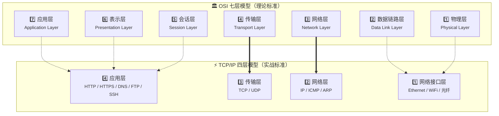

**为什么 OSI 七层被压缩成了 TCP/IP 四层？**

因为在实际实现中，表示层和会话层的功能通常是应用程序自己处理的——浏览器自带加密和 Cookie 管理，不需要操作系统额外提供两个独立的协议层来干这些活。物理层和数据链路层也因为高度耦合而合并了——交换机同时处理 MAC 地址和电信号转换，芯片厂商把这两层做在同一块电路板上，你在软件层面根本分不开它们。

TCP/IP 的设计哲学是：**够用就行，不追求完美分层。** 它不对下层网络做任何假设——不管是铜线、光纤、无线电还是卫星链路，它都能跑。这种“粗糙”反而是它成功的原因。TCP/IP 能跑在几十种完全不同的物理网络上，因为它对底层唯一的要求就是“能传数据”——至于怎么传，它不管。

> *Kate 说：“所以 OSI 是会议室里设计出来的，追求完美。TCP/IP 是机房里调试出来的，追求能用。前者告诉你理想长什么样，后者告诉你现实怎么跑。两个都要学——OSI 用来理解原理，TCP/IP 用来分析实际流量。”*
>
> “对。你以后用 Wireshark 抓包的时候，看到的数据包结构是按 TCP/IP 四层来的。但你在学渗透测试的时候，分析一个攻击发生在哪一层，用的是 OSI 七层的视角。两个模型不冲突——它们是同一件事的不同分辨率。”

**本节小结**  

| 概念 | 一句话总结 |
| :--- | :--- |
| **OSI 七层模型** | 理论家的“完美图纸”——把网络通信拆成七层，每一层职责清晰、边界分明 |
| **TCP/IP 四层模型** | 工程师的“实战手册”——OSI 的精简版，互联网的实际运行标准 |
| **两者的关系** | OSI 用来理解原理，TCP/IP 用来分析实际流量。学渗透测试两个都要懂 |

> 🎯 **NISP 一级考点**：OSI 七层模型的名称和顺序是网络基础部分的必考内容。选择题常考“以下哪个协议属于 OSI 的传输层？”——看到 TCP/UDP 就选传输层。TCP/IP 四层模型中各层对应的协议也需要掌握。记忆口诀：从上到下用 APSTNDP（All People Seem To Need Data Processing），从下到上反过来用 PDNTSPA。
>
> 📝 **守夜者手记**：打开浏览器，按 F12 打开开发者工具，切换到“网络”面板，刷新一个网页。面板里会列出所有请求和响应——这就是你在 4.1.2 里学的“应用层”在真实浏览器里的样子。截图保存到你的笔记文件夹里，在旁边写一句：“这是应用层的数据——我看到的，不是网络上的。”

*Kate 在笔记本上画了两栋楼。一栋七层，标着“OSI”。一栋四层，标着“TCP/IP”。她在两栋楼之间画了一个箭头，标注：“前者是图纸，后者是实物。”*  

*“那你接下来要教我什么？TCP 三次握手？”*  

“对。刚才你看到了数据在每一层是怎么被包装的。但传输层还有一个更根本的问题——数据传出去之前，双方怎么知道对方准备好了？这就好比打电话，你不会一接通就开始长篇大论——你会先说‘喂’，确认对方能听到你。网络也是这样。”

下一节，我们要学习 **TCP 三次握手**——为什么是三次、不是两次或四次。这是 TCP 协议最精妙的设计之一，也是你理解 SYN 洪水攻击的必备基础。🔪

---

#### 4.1.3 TCP 三次握手：一次小心翼翼的尬聊<!-- omit in toc -->

*Kate 在上一节理解了分层模型。她看着笔记本上那栋七层楼和四层楼，问了一个问题：*

> *“分层我懂了。但传输层的 TCP——你说它是‘可靠传输’，要保证数据完整到达。它怎么保证？发数据之前，双方怎么知道对方准备好了？”*
>
> “我给你一个场景：你现在想访问靶场上的网页。但靶场和你的电脑之间隔着十几台路由器，中间任何一台都可能丢包、延迟、卡顿。你的电脑不知道靶场在不在线、愿不愿意理你——你甚至不知道你发的请求能不能活着到达靶场。这时候你会怎么做？”
>
> *“先发一条消息过去确认一下？‘嘿，你在吗？’”*
>
> “对。这就是 TCP 三次握手的起点。你不需要背‘第一次握手是 SYN，第二次是 SYN-ACK’这种空洞的步骤。你只需要理解——你在和一台你完全不了解的机器建立信任。每一步都在解决一个具体的问题。走完三步，双方才确认‘对方在、愿意聊、能听懂’。然后才开始传数据。”

**第一次握手：你喊了一声“喂”**  

你的电脑说了一句话：“你好，我想跟你说话。”

这句话在 TCP 协议里叫 **SYN**——它只是一个标志，告诉对方“我是来建立连接的，不是来传数据的”。你把它发出去，然后等着。

> *Kate 说：“就这？发一句话而已，有什么难的？”*
>
> “难在发完之后你什么都不能做。你不能发网页请求，不能传文件，连‘对方有没有收到’你都不知道。你只能等。等半秒还是一分钟，全看网络心情。”

这段话里藏着一个随机数——**序列号**。序列号相当于你给这本正在写的书编了起始页码。为什么要编页码？因为 TCP 要把数据切成一堆小包分开传，每个包都可能走不同的路、到达顺序可能错乱。有了页码，对方才能按正确顺序拼回来。万一某个包丢了，对方能精确地指出：“我缺第 38 页，重发一下。”

发完这句话之后，你的电脑进入 **SYN-SENT** 状态——一个什么都做不了、只能等的状态。

**第二次握手：对方回了一句“我在”**  

靶场听到了你的招呼，回了一句话：“你好，我也想跟你说话。你的‘喂’我收到了。”

这句话在 TCP 协议里叫 **SYN-ACK**——它同时做了两件事：告诉你“我也在”，并且确认收到了你的 SYN。

靶场也在这句话里藏了一个序列号——它的起始页码。现在你知道了它的页码，它知道了你的页码。双方都知道从哪开始数了。

> *Kate 说：“那我是不是可以直接开始传数据了？我喊了‘喂’，它回了‘我在’，流程走完了啊。”*
>
> “别急。你想想——你发的那句‘喂’，有没有可能在半路上被网络堵住，很久以后才送到靶场？你刚才以为它丢了，又发了一遍新的‘喂’。现在靶场回你的‘我在’，是对你第一遍‘喂’的回应，还是对第二遍‘喂’的回应？你分不清。分不清就意味着——如果这是一笔订单，你可能会重复付款两次。”
>
> *Kate 愣了一下：“……所以我还得再确认一次。”*

**第三次握手：你确认“就是现在”**  

你发出了第三句话：“收到。你回的是我现在这条，不是我以前那条。好，我们开始传数据吧。”

这句话在 TCP 协议里叫 **ACK**。你的电脑收到了靶场回复的“我在”，现在它需要确认：“这个回复是我要的，不是我上个月某个卡在半路的旧请求。”没有这个确认，靶场不知道它分配的内存和 CPU 资源有没有白费。这第三次的确认，告诉靶场：“就是现在，不是旧账。资源可以正式分配了。”

三次握手到此结束。你发送网页请求，靶场返回网页内容——真正的数据开始传输了。

*Kate 在笔记本上画了三行：*

>*“1. 你：‘喂’ → 2. 它：‘我在，你的喂我收到了’ → 3. 你：‘好，开始传吧’”*  
>
> *“三次。第一次确定我想说话，第二次确定它能说话，第三次确定它听懂了我现在在说话，不是很久以前的旧消息。”*

---

**两次不够：那个卡在半路的旧请求**  

> *“如果只有两次握手呢？”Kate 问，“你发一句，它回一句——你以为已经好了。但假设你上个月发过一句‘喂’被堵在半路，当时你以为丢了就没管了。现在你发了一句新的‘喂’，它也回了。三次握手你发了第三句‘确认’，服务器知道现在这个是活人。但如果是两次握手——你还没来得及发第三句，服务器看到你的‘喂’就直接认为连接建立完成了。”*
>
> *“然后呢？”*
>
> “然后那个上个月卡在半路的旧‘喂’也到了。它没有第三句确认，但它长得和新的一模一样——都是‘喂’。服务器分不清哪个是新的、哪个是旧的。它觉得又来一个连接请求，于是又分配了一份内存和 CPU。等数据终于传到的时候，服务器那边已经开了两个连接等着，而你的电脑以为只有一个。”
>
> *“那你收两次数据？网页也加载两次？”*
>
> “运气好会，运气不好会把两份数据拼在一起。网络包交错到达，应用层收到的是杂乱的碎片。两个独立的连接用的序列号不一样，第二包的页码套到第一包上面，拼出来的东西全是乱码。但这不是最坏的情况——最坏的情况是攻击者利用这个机制，发一堆旧请求进来，每个都让服务器分配资源，然后就永远不发第三句确认。服务器那边一堆连接都在‘等着确认’——内存用光了，CPU 也满了，正常用户一个都进不来。”
>
> *“这就是你刚才说的 SYN 洪水攻击？”*
>
> “对。它不需要攻破任何密码，也不需要挖任何漏洞。它只是利用了 TCP 的一个信任机制：你说‘喂’，它就信你。两次握手还不够它分辨出真假。”*

**四次没必要：多一步就是浪费**  

*“那四次呢？四次不是更保险？”*  

“可以。服务器可以把‘你的喂我收到了’和‘我也在’分两次发——先回‘收到’，再回‘你好’。但这两句话可以合并成一句，就像你打电话的时候，对方不会先说‘我听到你了’，停一秒，再说‘我也想跟你说话’。一句说完就行。分两次反而多一次往返，对于每次打开网页都要握手几十次的浏览器来说，这个浪费是天文数字。”

三次是“最少必要的往返次数”——两次不够，四次没必要。三次是数学上和工程上的共同最优解。

---

**谁来握第一个手？**

*“等一下。‘客户端’和‘服务器’是怎么分的？为什么总是客户端先开口？”*  

“谁主动发起连接，谁就是客户端。你打开浏览器访问 GitHub——你的浏览器主动发起连接，你的电脑是客户端，GitHub 的电脑是服务器。反过来，如果你在自己的电脑上启动了一个网站，然后别人来访问——你的电脑就成了服务器。客户端和服务器不是按电脑配置高低来分的，是按‘谁先开口’来分的。”

**完整握手流程**  

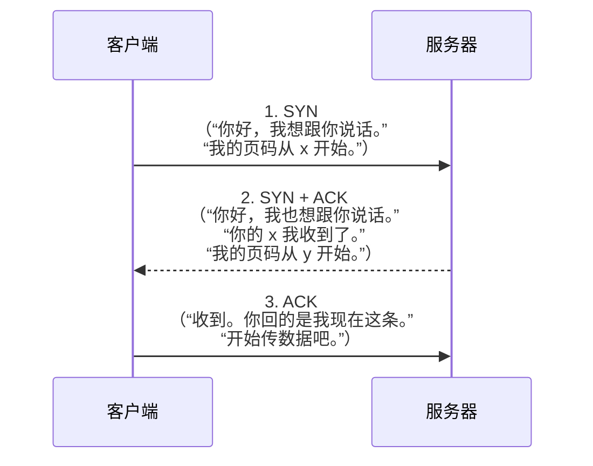

> *Kate 看着这张图，说：“三次握手就是确认三件事——你在、我在、我们说的都是现在。少一次不放心，多一次没必要。”*

---

#### 4.1.4 TCP 四次挥手：如何优雅地结束一次尬聊<!-- omit in toc -->

> *Kate 在上一节搞懂了三次握手，说：“建立连接我懂了。那聊完了怎么断开？直接挂电话不行吗？”*
>
> “不行。TCP 的连接是双向的——你可以同时发送和接收数据。断开的时候双方需要各自说‘我说完了’，不能同时挂。你想想你跟一个话痨朋友打电话——你说‘我挂了啊’，对方说‘等一下我还有最后一句’——你直接挂就很没礼貌。”
>
> *“所以断开也要按规矩来。”*
>
> “对。而且比握手多一步。原因你想想就知道了。”

**场景：你和朋友在打电话**  

你和朋友正在通电话。聊了半小时，你该挂了，但是你不知道朋友那边有没有把最后一件事说完。

如果你想直接挂断：你“咔”一声把电话挂了。朋友那边话说到一半，突然听到忙音。他要么觉得你没礼貌，要么以为你的电话出问题了——总之他会在心里骂你一句，然后你们后面那几句就没法继续了。

所以你得先确认：朋友是不是也说完了。如果朋友还没说完，你得等他。如果他确认自己说完了，你们再商量一起挂掉。

**四次挥手就是做这件事的标准流程。**

你永远不会用“咔”一声去结束 TCP 连接。你会先告诉对方“我说完了”，等对方回应，再等对方说“我也说完了”，最后你再确认一次。每一步都在解决一个具体的问题，而不是默认对方准备好了。

**第一次挥手：你先说“我说完了”**  

你（客户端）说了一句话：“我要说的都说完了，想挂电话了。”

这句话在 TCP 里叫 **FIN**（Finish），意思是“我这边的数据发完了，不再发新数据了”。

你发出这句话之后，你的电脑进入了 **FIN-WAIT-1** 状态——你在等朋友确认收到。你不再发数据了，但你还能收——万一朋友还有话要说呢？

> *Kate 说：“那如果朋友那边没说完呢？他会不会直接回一个‘好的’，然后继续说了五分钟？”*
>
> “会。这就是为什么要等第二次挥手。”

**第二次挥手：朋友回了一句“好的，我知道了”**  

朋友收到你的 FIN，先回了一句：“好的，我知道你说完了。等一下，我还有话要说。”然后他又说了五分钟。

这句话在 TCP 里叫 **ACK**——它只是确认“收到了”，不等于“我也说完了”。朋友需要告诉你“好的”而不是“我也好了”。

你收到这个 ACK 之后，进入了 **FIN-WAIT-2** 状态——你在等朋友的那句“我也说完了”。你不能再发数据了，但你还在听。

> Kate 说：“所以第二次挥手不是‘同意挂断’，只是‘我收到你的挂断请求了’。”

**第三次挥手：朋友说“我也说完了”**  

朋友终于说完了他的最后一句，然后说：“我也说完了，可以挂了。”

这句话在 TCP 里也叫 **FIN**——但这一次是服务器那一方的 FIN。

你收到这个 FIN 之后，进入了 **TIME-WAIT** 状态——你还不能立刻消失。你需要再回最后一句话确认收到。

> *Kate 说：“朋友已经说‘我也说完了’，我不就可以直接挂了吗？为什么还要再回一句？”*
>
> “假设你直接挂了。你的朋友把电话挂断之后，他那边的一切都结束了，然后呢？他以为你也挂断了。但如果你还没挂，他挂掉的电话会在通话结束的那一刻把你那边的状态置空了。你的网络在朋友挂断之后才把“收到”送到——他没收到，他以为你根本没听到他说“我也说完了”。”
>
> *“那他会怎么样？”*
>
> “他会在那边一直等你的确认。然后他觉得你没回应，会再发一次‘我也说完了’，一直等到超时。你这边已经关了，他那边却还在等。网络里来回重试，状态一直卡住——直到超时，放弃。时间很短，但如果你同时在跟很多个朋友通话，每个都这样卡住，你的电脑就动不了了。”

**第四次挥手：你回了一句“好的，拜拜”**  

你发出了最后一句话：“收到。那挂了，拜拜。”

这句话在 TCP 里叫 **ACK**，是最后一个确认。朋友收到之后，放心地挂断了电话。你的电脑也挂断了。

但你还不能立刻消失。你需要在 **TIME-WAIT** 状态里再等一小段时间——通常是 2 分钟。因为你刚才发的那个“好的，拜拜”可能在半路丢了，朋友如果没收到，他会再发一次“我也说完了”，那时你得在，才能再回一次确认。如果两分钟之内他没有再发，你才真正挂断。

---

**为什么是四次，不是三次？**

> *“那为什么不把第二次和第三次合并？朋友说‘好的，我也说完了’一次性发完不行吗？”*
>
> “如果他一次性发完‘好的，我也说完了’，那就等于在你说了‘我说完了’的那一刻，他必须已经说完了所有的话。但朋友可能还有话要说——他还没说完，所以他需要先确认收到你的 FIN，然后等自己说完，才能再发自己的 FIN。中间那一步不能合并，因为两部分是不同时间发生的。”
>
> *“所以多出来的那一步，是因为你们说不完的时间不同。你发 FIN 的时候，朋友可能还没说完。”*

**挥手失败会怎样？**

- **朋友一直没说完，一直不发自己的 FIN**：你说了“我说完了”，朋友回了“好的”，然后他继续聊了十分钟还不挂。你只能在 FIN-WAIT-2 状态一直等，等到超时。
- **你们正通着话，信号突然断了，双方都来不及说“我说完了”**：你和朋友都不知道对方已经掉线，会继续等下一句话，直到超时放弃。这个时间很长，TCP 默认可能几分钟。如果很多通电话都这样掉线，服务器那边一堆连接卡着，资源慢慢耗尽。
- **你说“我说完了”，朋友没收到**：你进入了 FIN-WAIT-1，什么都不能做，只能等。直到超时，你才放弃。

**完整挥手流程**  

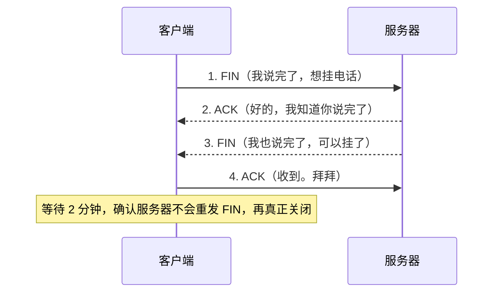

> *Kate 在笔记本上画了两个小人。第一个小人说“我说完了”，第二个小人说“好的”，第二个小人又说“我也说完了”，第一个小人说“拜拜”。她在旁边标注：“四次。比握手多一次，因为结束的时候一方可能还没说完。”*
>
> *“握手和挥手都学完了。现在我知道怎么建立连接、怎么关闭连接。但建立连接的时候，我怎么知道我要找的是哪台电脑？”*
>
> “IP 地址是你要找的门牌号，端口号是你要找的房间号。下一节，我们把这两种地址搞清楚。”

下一节，我们要学习 **IP 地址与端口号**——从 IPv4 到 IPv6，从源端口到目的端口。这是你理解网络扫描、防火墙规则、访问控制的基础。🔪

---

### 4.2 IP 地址与子网划分 —— 快递单上的收件地址怎么写

*Kate 在上一节学完了 TCP 三次握手和四次挥手。她在笔记本上画了那张“打招呼三次、道别四次”的图，然后问了一个问题：*

> *“握手和挥手我懂了。但数据在路上传输的时候，怎么知道从哪来到哪去？你在握手的时候提到的‘页码’我懂了——但门牌号是什么？数据怎么知道要找哪台电脑？”*
>
> “门牌号就是 IP 地址。你寄快递，快递单上要写收件人地址和寄件人地址。数据在网络上传输也一样——每个数据包上都写着源 IP 地址和目标 IP 地址。”
>
> *“那 IP 地址长什么样？谁给我分的？”*
>
> “这一节我们就把 IP 地址搞清楚——它长什么样、怎么读、怎么分。”

---

#### 4.2.1 IP 地址是什么？<!-- omit in toc -->

IP 地址（Internet Protocol Address）是互联网协议地址的缩写。它是一串数字，用来在网络中唯一标识一台设备。

IP 地址目前有两个版本：**IPv4** 和 **IPv6**。你现在见到的大多数 IP 地址都是 IPv4 格式——四组数字，每组 0 到 255，中间用点隔开。比如 `192.168.1.1`，这就是一个 IPv4 地址。

四组数字，每组 0 到 255——这意味着 IPv4 一共有 256 × 256 × 256 × 256 ≈ 43 亿个可能的地址。这个数字在 1980 年代看起来是天文数字，设计者觉得足够全世界用了。但互联网的增长速度远超预期——到 1990 年代末，43 亿个地址已经不够分。于是设计了 IPv6，用八组十六进制数表示，地址数量多到能给地球上每一粒沙子分配一个。

对于你学渗透测试来说，你主要接触的是 IPv4。下面的讲解全部基于 IPv4。

你可能会问：“我怎么知道我自己的 IP 地址？”在 Windows 上打开终端，输入 `ipconfig`；在 Kali 或 macOS 上输入 `ifconfig` 或 `ip a`。输出里找到 `IPv4 Address` 或 `inet` 后面的那串数字，那就是你的 IP 地址。

> *Kate 说：“所以 IP 地址就是门牌号。快递员靠门牌号找到我家，数据包靠 IP 地址找到我的电脑。”*

**IP 地址的两部分：网络号和主机号**  

一个 IP 地址实际上包含两个信息：**网络号**（你在哪个小区）和**主机号**（你在小区里是哪一户）。就像门牌号“3栋502”——“3栋”是小区里的楼号，“502”是那栋楼里的房间号。快递员先找到3栋，再找到502。

IP 地址也一样。同一个网络里的所有设备，网络号相同，主机号不同。但你怎么知道 `192.168.1.100` 里哪部分是网络号、哪部分是主机号？是前三组是网络号、最后一组是主机号？还是一半一半？

这就需要用到**子网掩码**——下一节继续讲。

> *Kate 在笔记本上写了一个 IP 地址 `192.168.1.100`，在下面画了两条线——一条标注“小区名？”，一条标注“门牌号？”。在旁边打了个问号：“谁告诉我怎么分？”*

---

#### 4.2.2 子网掩码与 CIDR<!-- omit in toc -->

> *“上一节你说 IP 地址里藏着两个信息——小区名和门牌号。但 `192.168.1.100` 里哪部分是小区名、哪部分是门牌号？谁说了算？”*
>
> “子网掩码说了算。它就是一把尺子——尺子上是 255 的部分，对应 IP 地址里是小区名。尺子上是 0 的部分，对应 IP 地址里是门牌号。”

**子网掩码：一把尺子，量出网络号和主机号的分界线**  

子网掩码看起来也像一个 IP 地址——四组数字，比如 `255.255.255.0`。但它的作用不是“地址”，而是一把**尺子**。

你把 IP 地址和子网掩码上下对齐：

```bash
IP 地址：  192.168.1.100
子网掩码：255.255.255.0
```

子网掩码前三个是 255，所以 IP 地址前三个是**网络号**（小区名）：`192.168.1`。子网掩码最后一个是 0，所以 IP 地址最后一位是**主机号**（门牌号）：`100`。

再换一个例子。如果子网掩码是 `255.255.0.0`：

```bash
IP 地址：  172.16.5.100
子网掩码：255.255.0.0
```

前两个是 255，所以网络号是 `172.16`。后两个是 0，所以主机号是 `5.100`。

那 `255.0.0.0` 呢？

```bash
IP 地址：  10.5.3.100
子网掩码：255.0.0.0
```

只有第一个是 255，所以网络号是 `10`。后面三个是 0，所以主机号是 `5.3.100`。

> *Kate 说：“所以子网掩码就是一把尺子——255 盖住的部分是小区名，0 露出来的部分是门牌号。尺子不同，小区的大小就不同。”*

**CIDR 表示法：把尺子长度简写成一个数字**  

每次写 `255.255.255.0` 太长了。于是有人发明了一种简写：**直接数这把尺子上有多少个连续的 1，写在 IP 地址后面，用斜杠隔开。**

`255.255.255.0` 写成二进制是 `11111111.11111111.11111111.00000000`——前面有 24 个 1。所以简写为 `/24`。

`255.255.0.0` 前面有 16 个 1，简写为 `/16`。

`255.0.0.0` 前面有 8 个 1，简写为 `/8`。

所以 `192.168.1.100` 配上子网掩码 `255.255.255.0`，可以简写成 **`192.168.1.100/24`**。

你以后用 Nmap 扫描的时候会看到 `192.168.1.0/24`——它的意思是：“网络号是 `192.168.1`，子网掩码是 `255.255.255.0`，扫描这个网络下的所有 256 个 IP。”

**为什么需要区分网络号相同和不同？**  

同一个网络里的两台设备——比如 `192.168.1.100/24` 和 `192.168.1.200/24`——网络号相同（都是 `192.168.1`），它们之间通信不需要外人帮忙，直接就能互相喊话。

不同网络的设备——比如 `192.168.1.100/24`（网络号 `192.168.1`）和 `192.168.2.100/24`（网络号 `192.168.2`）——网络号不同。它们不能直接喊话，中间需要路由器帮忙转发。

你以后做渗透测试的时候，靶机和攻击机如果在同一个虚拟网络里（比如都在 NAT 模式下），它们可以直接互相访问。如果不在同一个网络里，你就需要配置路由或者端口转发——这些后面会讲到。现在你只需要记住：**同一个网络号的设备直接通信，不同网络号的设备必须经过路由器。**

> *Kate 在笔记本上画了一个尺子，标注“255 盖住 = 小区名，0 露出 = 门牌号”。旁边写了三个例子：/24 = 255.255.255.0、/16 = 255.255.0.0、/8 = 255.0.0.0。*

---

#### 4.2.3 IP 地址分类<!-- omit in toc -->

> *“子网掩码我懂了。但不同大小的网络，有没有一个标准的划分方式？我总不能每次都自己猜掩码吧？”*
>
> “有。IPv4 地址的设计者在最初就把所有可能的 IP 地址分成了五类——A 类、B 类、C 类、D 类、E 类。D 类和 E 类分别用于组播和研究，你不用管。A、B、C 三类分别对应大、中、小三种网络规模。”
>
> *“怎么判断一个 IP 属于哪一类？”*
>
> “看第一个数字。不需要查表，不需要算子网掩码——只看 IP 地址的第一个数字，你就知道它是哪一类、默认子网掩码是几。这个设计就是为了让路由器能一眼判断——路由器收到一个数据包，瞄一眼目标 IP 的第一个数字，立刻就知道该把它往大网、中网还是小网转发。”

**A 类地址：国家级大网**  

A 类地址的第一个数字范围是 **1 到 126**。子网掩码是 `255.0.0.0`（CIDR `/8`）——只有第一个数字是网络号，后面三个数字全是主机号。

这意味着一个 A 类网络里可以容纳 256 × 256 × 256 - 2 ≈ **1677 万台设备**（减去两个保留地址）。A 类网络一共只有 126 个——全世界只有 126 个这种规模的网络。它们分配给国家级网络、超大型 ISP、和历史上最早拿到 IP 地址的机构。

为什么是 1 到 126，不是 0 到 127？因为 `0.x.x.x` 从设计之初就被保留——它表示“本网络”，不能分配给任何设备。`127.x.x.x` 也被保留——它叫**本地回环地址**，永远指向你自己的电脑。你在任何一台电脑上 ping `127.0.0.1`，都是在 ping 自己——不管你有没有联网，这个地址永远通。你以后做渗透测试的时候，很多工具在本地测试时会用到 `127.0.0.1` 作为监听地址——它等于“我自己”。所以 A 类实际可用的网络号范围是 1 到 126。

> *Kate 说：“所以 `127.0.0.1` 不是某个远程服务器——就是我自己的电脑。自己 ping 自己，永远通。”*

**B 类地址：企业级中网**  

B 类地址的第一个数字范围是 **128 到 191**。子网掩码是 `255.255.0.0`（CIDR `/16`）——前两个数字是网络号，后两个数字是主机号。

B 类网络数量是 (191 - 128 + 1) × 256 = 64 × 256 = 16384 个，约 **1.6 万个**。每个 B 类网络可以容纳 256 × 256 - 2 ≈ **6.5 万台设备**。它们分配给大型企业、大学、政府机构——比如一个拥有几万名员工和设备的跨国企业，申请一个 B 类地址，旗下所有设备都能在这个网络内直接通信。

**C 类地址：家庭级小网**  

C 类地址的第一个数字范围是 **192 到 223**。子网掩码是 `255.255.255.0`（CIDR `/24`）——前三个数字是网络号，最后一个数字是主机号。

一个 C 类网络里，最后一个数字用来区分不同设备。它只有 256 个可能的值（0 到 255），但其中两个被保留——全 0 表示“这个网络本身的地址”，全 1 表示“广播地址”（给这个网络里所有设备群发消息）。所以实际可用的主机号是 1 到 254，共 **254 台设备**。

C 类网络数量约 209 万个。它们分配给小型企业、家庭网络、局域网。你家里路由器用的就是 C 类地址——你打开终端输入 `ipconfig`，大概率会看到 `192.168.x.x`，这就是一个 C 类私网地址。

**A、B、C 三类速查表**  

| 类别 | 第一个数字 | 子网掩码 | CIDR | 网络数量 | 每网主机数 | 典型场景 |
| :--- | :--- | :--- | :--- | :--- | :--- | :--- |
| **A 类** | 1 ~ 126 | 255.0.0.0 | /8 | 126 个 | 约 1677 万 | 国家级网络、超大型 ISP |
| **B 类** | 128 ~ 191 | 255.255.0.0 | /16 | 约 1.6 万个 | 约 6.5 万 | 大型企业、大学 |
| **C 类** | 192 ~ 223 | 255.255.255.0 | /24 | 约 209 万个 | 254 台 | 家庭网络、小型办公室 |

*Kate 说：“所以 IP 分类就是按第一个数字划分——1 到 126 是国家级大网，128 到 191 是企业中网，192 到 223 是家庭小网。我看到一个 IP 是 `10.x.x.x`，就知道它是 A 类。”*  

“对。但你有没有发现一个问题——你家里路由器的 IP 地址是 `192.168.x.x`，你隔壁邻居家的路由器也是 `192.168.x.x`。全世界几亿台路由器的 IP 都一样，互联网不会搞混吗？”

*“……对啊，为什么不会搞混？”*  

“因为这些 `192.168.x.x` 不是公网地址，是私网地址。你家路由器给你分配的是内部编号，不是互联网上的正式门牌号。但光有 IP 地址还不够——你的电脑需要知道‘我要访问的网站对应哪个 IP’，你的浏览器需要知道‘这个网页的数据要怎么传回来’。这中间还要靠 DNS 把域名翻译成 IP，靠 HTTP 和 HTTPS 来约定浏览器和服务器之间怎么对话，靠 ARP 来找到同一网络里某个 IP 对应的是哪台设备。下一节，我们把渗透测试里最常接触的几个网络协议串起来——DNS、HTTP/HTTPS、ARP。它们是你在 Kali 上敲命令时，背后真正在替你跑腿的那群‘隐形人’。”

> 🎯 **NISP 一级考点**：IP 地址的分类（A/B/C 类的范围和默认子网掩码）是网络基础部分的必考选择题。**A 类是 1-126，子网掩码 255.0.0.0（/8）；B 类是 128-191，子网掩码 255.255.0.0（/16）；C 类是 192-223，子网掩码 255.255.255.0（/24）。** 127 是本地回环（ping 127.0.0.1 永远通），224-239 是组播，240-255 是保留——这些是扩展考点，知道就行。
>
> 📝 **守夜者手记**：在 Windows 终端输入 `ipconfig`，在 Kali/macOS 输入 `ifconfig` 或 `ip a`，找到你的 IP 地址和子网掩码。根据 4.2.3 的分类，判断你的 IP 属于 A/B/C 哪一类，然后写出它的网络号和主机号。截图保存到你的笔记文件夹里。

下一节，我们要学习**常见网络协议**——DNS 把域名翻译成 IP、HTTP/HTTPS 约定浏览器和服务器怎么对话、ARP 帮你在同一网络里找到某个 IP 对应哪台设备。这些是你用 Nmap 扫端口、用 Burp Suite 抓包时，背后真正在跑腿的协议。🔪

---

### 4.3 常见网络协议 —— 浏览器背后那群“隐形跑腿的”

*Kate 在上一节学完了 IP 地址和子网划分。她合上笔记本，问了一个问题：*

> *“IP 地址我懂了——数据包知道从哪来到哪去。但数据包里面装的是什么？网页？邮件？视频？网络怎么知道这个数据包是网页请求还是邮件传输？”*
>
> “这个问题问到了协议。IP 地址只负责‘找到门牌号’，但数据包里面装的是什么东西、用什么格式来装、双方怎么解读——这些事由各种协议来定义。网络通信就像一个物流系统——IP 地址是快递单上的门牌号，协议是包裹里面装的东西的类型标签。快递员不需要知道包裹里是书还是衣服，他只需要看标签就知道该送到哪个部门。”
>
> *“那我每天上网都会用到哪些协议？”*
>
> “最常用的有四个——HTTP、HTTPS、DNS、DHCP。你在浏览器里输入网址、按回车，这四个协议全都在背后干活。这一节我们把它们一个个拆开看。”

---

#### 4.3.1 HTTP：网页的“通用语言”<!-- omit in toc -->

> *“那 HTTP 是怎么工作的？浏览器怎么告诉服务器‘我要看这个网页’？服务器怎么告诉浏览器‘给你，这是网页内容’？”*
>
> “你现在就可以在自己电脑上看到这个过程。”

**动手验证：用 curl 发送一个 HTTP 请求**  

打开你的 Kali Linux 终端。确保靶场 Metasploitable 2 正在运行（IP 地址用你在 3.5 节记录的）。在 Kali 终端里输入：

```bash
curl -v http://192.168.x.x/
```

把 `192.168.x.x` 替换成你的靶场实际 IP 地址。

`curl` 是一个命令行工具，它能代替浏览器向服务器发送 HTTP 请求。`-v` 参数表示“详细模式”——让 curl 把请求和响应的全过程都打印出来给你看。

你会在终端里看到两段内容：第一段以 `>` 开头，是你发出的**请求**。第二段以 `<` 开头，是靶场返回的**响应**。

```bash
> GET / HTTP/1.1
> Host: 192.168.x.x
> User-Agent: curl/7.88.1
> Accept: */*
```

这是你的 Kali 发给靶场的请求。我们一行一行看：

- **`GET / HTTP/1.1`**：`GET` 是你要做的事——“我要获取页面”。`/` 是你要获取的路径——网站的根目录，相当于“首页”。`HTTP/1.1` 是你用的协议版本号。这一行在说：“用 HTTP/1.1 协议，把首页给我。”
- **`Host: 192.168.x.x`**：你要访问的服务器地址。一台服务器上可能托管了多个网站，`Host` 字段告诉服务器：“我找的是你上面这个 IP 对应的网站。”
- **`User-Agent: curl/7.88.1`**：你的身份标识——告诉服务器“我是 curl 命令行工具，版本 7.88.1”。如果你用浏览器访问，这一行会显示 `Mozilla/5.0`。
- **`Accept: */*`**：告诉服务器“不管返回什么格式——HTML、图片、纯文本——我都收。”

请求部分结束。接着看响应：

```bash
< HTTP/1.1 200 OK
< Date: Mon, 22 Jul 2025 12:00:00 GMT
< Server: Apache/2.2.8 (Ubuntu) DAV/2
< Content-Length: 1024
< Content-Type: text/html
<
<html>
<head><title>Metasploitable2 - Linux</title></head>
<body>...</body>
</html>
```

这是靶场返回给 Kali 的响应。第一行最重要：**`HTTP/1.1 200 OK`**。`200` 是一个数字代号，表示“你要的页面我找到了，一切正常。”这个三位数字叫**状态码**——服务器用状态码告诉客户端“结果怎样”。常见的状态码有：`200`（一切正常）、`301`（页面搬家了，请去新地址）、`404`（找不到你要的页面）、`500`（服务器内部出错了）。

接下来的几行是响应头部——`Date`（响应时间）、`Server`（服务器软件名和版本）、`Content-Length`（返回内容的大小，单位字节）、`Content-Type`（返回内容的类型——`text/html` 表示 HTML 网页）。空行后面是响应体——服务器返回的实际网页内容。这就是你在浏览器里看到的网页源码。

> *Kate 在自己的 Kali 终端里敲了 `curl -v http://192.168.x.x/`，看着屏幕上滚过的 `>` 和 `<`，说：“所以 HTTP 就是一场‘问答游戏’。我问一句‘GET /’，它回一句‘200 OK’。中间夹着各种标签——Host 是谁、User-Agent 是谁、Content-Type 是什么格式。整个网页的传输，就是一场一问一答。”*

**HTTP 的核心特点：服务器不记人**  

HTTP 有一个重要的设计特点：它是“无状态”的——每次请求和响应都是一次独立的问答，服务器答完就忘，不会记住你是谁。

你第一次请求登录页面，服务器验证了你的用户名和密码，返回“登录成功”。你第二次请求个人主页——服务器已经不记得你了。它不知道刚才那个登录成功的人就是你。你每次请求都必须重新证明“我是我”。

为什么这样设计？因为一个网站可能有几百万用户。如果服务器要记住每一个用户的每一次请求，需要的存储和计算资源会大到无法承受。服务器记不住，是为了让更多人能用得起。但这也带来了一个新问题：既然服务器记不住，那网站怎么知道“你已经登录了”？你登录一次之后，为什么连续浏览多个页面都不会被踢出去？这个问题的答案在后面讲 Cookie 和 Session 的时候会展开。

> *Kate 说：“所以 HTTP 就是一场有礼貌但记性极差的问答——每一次都是我自报家门，它给我回应，然后它立刻把我忘了。下一次我再说话，它又问‘你是谁’。”*

---

#### 4.3.2 HTTPS：给 HTTP 穿上防弹衣<!-- omit in toc -->

你在网上买东西、登录银行账户、输入密码——如果你用的是 HTTP，这些信息在传输过程中是**明文**的。任何人只要在你和服务器之间截获数据包，就能直接看到你的密码。这就像你寄了一张明信片——上面写着你的银行卡号和密码。任何经手的邮递员都能看到。

那怎么把明信片变成密信？直观的想法是：你把信封口封死，不让邮递员打开。但问题来了——你怎么保证只有收件人能打开？你需要在寄信之前跟收件人约定好一把“钥匙”——你用这把钥匙把信的内容打乱（加密），收件人用同一把钥匙把内容还原（解密）。可问题是：你怎么把这把钥匙安全地交给收件人？你不能把钥匙也写在明信片上——明信片在寄送过程中谁都能看，如果有人截获了明信片，就同时拿到了钥匙和密信，等于没加密。

这就是 HTTPS 要解决的核心难题：**如何在完全公开的信道上，安全地交换一把只有你和收件人知道的钥匙？** 它用的解决方案叫 **TLS/SSL 握手**——一次短暂的、发生在正式通信之前的“接头仪式”。

**TLS 握手：在公开信道上秘密交换钥匙的魔法**  

TLS 握手发生在 TCP 三次握手之后、HTTP 请求发送之前。它的全部目的只有一个：**让浏览器和服务器在完全不安全的信道上，安全地协商出一把只有它们俩知道的“一次性密钥”，用来加密后续所有的通信。**

整个握手过程分为三步：

**第一步：浏览器先说“我想用 HTTPS 跟你说话”，服务器亮出身份证**  

浏览器向服务器发出一条打招呼消息，里面包含两样东西：一个随机数（浏览器自己生成的，后面用来推导密钥），以及浏览器支持的加密算法列表（告诉服务器“我会用这些加密方式”）。

服务器收到后，向浏览器发回两样关键的东西：**服务器的数字证书**（一张“数字身份证”，里面包含服务器的公钥、域名、证书有效期、以及发证机构的签名），以及**服务器生成的另一个随机数**（后面也用来推导密钥）。

数字证书是什么？它就像你身份证上盖的那个公安局公章。你拿到一张身份证，凭什么相信它不是你同桌用纸壳子画的？因为有公安局的签名——伪造签名比伪造身份证本身难得多。数字证书里也有一个“签名”，由 **CA（Certificate Authority，证书颁发机构）** 签发——全球受信任的机构，比如 DigiCert、Let's Encrypt。操作系统和浏览器内置了一份受信任的 CA 名单。浏览器收到服务器发来的证书后，会检查证书里的签名是不是由名单上的某个 CA 签发的。如果能对上，证书就是真的；对不上，浏览器会弹出警告：“这个网站的安全证书有问题，可能是伪造的。”

这就像你在酒吧遇到一个陌生人，他自称是警察。你不是先问他“你怎么证明”——你是直接要求他出示警官证。警官证上的公章是公安局签发的，你信任公安局，所以你信任这张警官证。同理，浏览器信任 CA，所以浏览器信任由 CA 签发的证书。

> *Kate 说：“所以数字证书就是服务器的警官证。浏览器不是信任服务器，是信任签发警官证的公安局。只要证书是真的，服务器就是真的。”*

**第二步：浏览器用证书里的公钥加密一个“接头暗号”，发给服务器**  

证书里有一把**公钥**——它是数学意义上的“单行道”：用公钥加密的东西，只有用对应的**私钥**才能解开。服务器在生成证书时同时生成了这对公钥和私钥——公钥可以给任何人看，但私钥永远只留在服务器上，绝不外传。

浏览器验证证书通过后，从证书里提取出服务器的公钥。然后浏览器自己生成第三个随机数——一个高度随机的、每次握手都不一样的“接头暗号”。浏览器用服务器的公钥把这个接头暗号加密，发送给服务器。加密之后的接头暗号在半路上被任何人截获都没有用——因为只有服务器手里有私钥，只有服务器能解开这个加密包。

**第三步：服务器用私钥解密，拿到接头暗号**  

服务器用自己的私钥解密浏览器的加密包，提取出接头暗号。现在，浏览器和服务器都掌握了三样东西：浏览器的第一个随机数、服务器的第二个随机数、以及这次握手的接头暗号。双方用这三样东西各自推导出同一把**会话密钥**。

从这之后，双方用这把会话密钥加密所有后续的通信。这把密钥是本轮连接专属的、用完就扔的——即使攻击者事后破解了某个连接的会话密钥，他也不能解密其他连接的通信。

为什么整个过程不怕有人在中间窃听？因为攻击者没有服务器的私钥——他能截获浏览器发给服务器的加密包，但解不开，拿不到接头暗号。没有接头暗号，他就推导不出会话密钥。看到后面的加密通信，他也解不开。整条链路只有一个薄弱点——握手阶段，攻击者可以冒充服务器，伪造一张假证书。但浏览器的证书验证机制就是针对这种攻击设计的——证书必须由受信任的 CA 签发。伪造的证书浏览器不认，直接弹出警告页面。当然，如果 CA 本身被攻破或者有不诚实的 CA 签发了假证书，攻击者也能拿到有效的假证书——这是 CA 体系的信任风险。

**HTTPS 防了哪三种攻击？**

回到最开始的问题：HTTPS 是怎么把明信片变成密信的？

- **防窃听**：你发给服务器的东西——搜索关键词、密码、银行卡号——全部用会话密钥加了密。别人截获了也是一堆乱码，无法读懂。攻击者必须拿到这次连接的会话密钥才能解密——而会话密钥是浏览器和服务器各自用自己的随机数和接头暗号共同推导出来的，攻击者一个都不知道。
- **防篡改**：你发给服务器的请求在传输过程中被黑客改了——本来你给张三转了100块，黑客改成转给李四10万块。HTTPS 每条加密报文都附带校验码——接收方一旦发现数据被改过，校验码对不上，直接丢弃，连接断开。
- **防冒充**：你以为是连接到了“支付宝”，实际上连上的是黑客伪造的“假支付宝”。HTTPS 在握手阶段验证服务器的数字证书——证书必须由操作系统或浏览器信任的权威 CA 签发。伪造的证书会被浏览器检测到，弹出“您的连接不是私密连接”的警告页面。

> *Kate 说：“所以 HTTPS 就是在寄信之前先跟收件人秘密交换一把一次性钥匙，然后用这把钥匙加密整封信。整个过程发生在电光火石之间——你按下回车到看到网页，中间多出来的几十毫秒，就是在做这个仪式。窃听、篡改、冒充——这三件事在 HTTPS 面前全部失效。”*

---

#### 4.3.3 DNS：互联网的“电话簿”<!-- omit in toc -->

*Kate 在上一节看完了 HTTP 和 HTTPS。她合上笔记本，问了一个问题：*

> *“你在 4.3.1 节说，浏览器输入网址后，第一步是发 HTTP 请求。但你有没有跳过一个步骤？我输入的是 `github.com`——这是一个名字，不是 IP 地址。HTTP 请求要发给谁？浏览器怎么知道 `github.com` 对应哪个 IP 地址？”*
>
> “你没有跳步骤。你问的是 DNS——互联网里最古老、最不起眼、但最不可或缺的服务。浏览器不直接认识 `github.com`——它需要先把这个名字翻译成一个 IP 地址，才能发 HTTP 请求。DNS 就是干这个翻译活的。”

**为什么需要 DNS？**

互联网上的每一台设备——服务器、电脑、手机——在网络上都有一个唯一的门牌号，这就是你在 4.2 节学的 IP 地址。你访问 GitHub，本质上是你的浏览器向 GitHub 服务器的 IP 地址发了一个 HTTP 请求。

但你从来不在浏览器里输入 `140.82.121.3`（GitHub 的 IP 地址之一）。你输入的是 `github.com`。为什么？因为 IP 地址是一串数字，难记——你可以试试记住你经常上的十个网站的 IP 地址。域名是一串字母，好记——`github.com`、`google.com`、`bilibili.com`，看一眼就记住。DNS 就是把这些好记的名字翻译成不好记的数字的翻译官。

> *Kate 说：“所以 DNS 就是互联网的电话簿。我报名字，它给号码。没有它，我得把全世界所有网站的 IP 地址全部背下来才能上网。”*

**DNS 的完整查询流程：从浏览器缓存到根服务器**  

你在浏览器里输入 `github.com`，按下回车。接下来的查询流程分为五个步骤，每一步都可能提前返回结果，不需要走到最后一步。

**第一步：浏览器先翻自己的“小本子”**  

浏览器内部有一个 DNS 缓存。你之前访问过 `github.com`，浏览器就把 `github.com` 对应的 IP 地址记下来了。如果你在几分钟内再次访问同一个域名，浏览器直接从缓存里拿出 IP 地址，查询结束。这个缓存的有效期通常只有几分钟，浏览器会自动清理过期条目。

**第二步：操作系统接手查询**  

如果浏览器缓存里没有——比如你刚清过浏览器缓存，或者这个域名你从来没访问过——浏览器就委托操作系统去查。操作系统也有自己的 DNS 缓存，通常在内存里，所有程序共享。如果操作系统缓存里有，直接返回 IP 地址，查询结束。

**第三步：向本地 DNS 服务器发起查询**  

如果操作系统缓存里也没有，操作系统就向你网络设置里配置的**本地 DNS 服务器**发起查询。本地 DNS 服务器通常是你家路由器，或者你的 ISP（互联网服务提供商——电信、联通、移动——的 DNS 服务器）。你可以把本地 DNS 服务器理解成你小区的传达室——你不需要跑到市图书馆去查资料，大爷先帮你查。

如果本地 DNS 服务器的缓存里有 `github.com` 的 IP 地址——因为这个小区里有人之前访问过——大爷直接告诉你，查询结束。如果缓存里没有，大爷就得亲自去外面跑一趟了。

**第四步：本地 DNS 服务器逐级向上查询**  

本地 DNS 服务器开始从 DNS 根服务器开始，逐级向下查找。这个过程叫**递归查询**——你只需要问一次，本地 DNS 服务器会替你跑腿，一层一层往下查，直到查到结果为止。

DNS 的层级结构是一棵倒过来的树，从上往下依次是：

- **根域名服务器**：这是 DNS 的“树根”。它不存具体域名对应的 IP 地址，只存“每个顶级域名由谁来管”。你问它“github.com 在哪”，它回答：“我不知道，但 `.com` 的域名归那几台服务器管——你去问它们。”全球有 13 组根域名服务器，每组都是一组镜像服务器，分布在几十个国家。它们的 IP 地址是写死在所有 DNS 服务器软件里的——就像你手机里存了妈妈的号码，不需要电话簿也能找到她。
- **顶级域名服务器**：负责管理 `.com`、`.org`、`.net`、`.cn` 这些顶级域名。它也不存具体域名的 IP 地址，只存“这个域名由哪台权威服务器负责”。你问它“github.com 在哪”，它回答：“我不知道，但 github.com 的域名归那台权威 DNS 服务器管——你去问它。”
- **权威 DNS 服务器**：这是 DNS 查询的“最后一站”。它存储了 `github.com` 对应的实际 IP 地址。你问它“github.com 在哪”，它回答：“在这儿——`140.82.121.3`”。

> *Kate 说：“所以 DNS 查询就像我在学校图书馆查一本书——我先问我自己的书包（浏览器缓存），没找到。再问宿舍的公共书架（操作系统缓存），没找到。再问楼管大爷（本地 DNS 服务器）——大爷说‘我帮你查’。大爷先打电话给国家图书馆（根服务器），问‘这本书在哪个省图书馆？’国家图书馆说‘科技类在省科技馆（顶级域名服务器）’。大爷再打电话给省科技馆，问‘这本书在哪？’省科技馆说‘在三楼左手边第三排（权威 DNS 服务器）’。大爷最终在三楼左手边第三排找到了那本书，把书号告诉我。”*

**第五步：结果返回并缓存**  

本地 DNS 服务器把 `github.com` 的 IP 地址返回给操作系统，操作系统返回给浏览器，浏览器终于可以向 `140.82.121.3` 发起 TCP 连接了。

同时，本地 DNS 服务器把这个结果缓存下来——下次有人问它 `github.com` 的 IP 地址，它直接从缓存里拿，不需要再往上查到根服务器。但缓存有个有效期——通常由权威 DNS 服务器设置，从几分钟到几天不等。过期后缓存自动清除，下次查询必须重新往上查。

**DNS 的安全隐患：为什么“电话簿”容易被篡改？**  

DNS 是在 1983 年设计的，那时候互联网只有几百台设备，所有用户都是研究人员，没有人考虑安全问题。所以 DNS 查询过程默认是**明文、无加密、无验证**的——就像你打了一个电话给查号台，没有任何手段确认对方的身份是不是真的接线员。

攻击者可以利用这种信任关系发动 **DNS 欺骗攻击**。你问本地 DNS 服务器 `github.com` 在哪，就在本地 DNS 服务器往外查询的瞬间，攻击者抢先伪造了一个假的 DNS 响应，里面写着 `github.com` 的 IP 地址是攻击者自己服务器的地址。本地 DNS 服务器收到这个假响应之后，以为它先收到了“真正的回复”，把它存进缓存，把你导向攻击者的服务器。你以为自己在访问 `github.com`——地址栏显示的确实是 `github.com`——但你看到的网页是攻击者伪造的。

还有一种更隐蔽的变种：**DNS 劫持**。攻击者不需要伪造响应——他直接修改了你本地 DNS 服务器的缓存，或者你的路由器的 DNS 配置被篡改了，或者你的 ISP 在上级做了篡改。无论你怎么正常上网，只要你用这个被污染的 DNS 服务器查询特定域名，它就会返回错误的目标地址。这种攻击发生在你发出查询请求之前——你连收到假回复的机会都没有，因为你用的“电话簿”本身就是假的。

> *Kate 说：“所以 DNS 就像我的手机通讯录——我把号码存进去，正常打电话。但万一有人偷偷改了我的通讯录，或者我打给的是一个假的总机，我就会打给一个不该打的人。地址栏显示的是对的号码，但听电话的是别人。”*

---

#### 4.3.4 DHCP：自动分配 IP 地址的“门房大爷”<!-- omit in toc -->

前面你学了 IP 地址、子网掩码、网关、DNS——一台设备要上网，需要配置这四样东西。如果全世界几十亿台设备都需要网络管理员一台一台手动配置，互联网大概永远发展不起来。

实际上你不需要做任何配置。你新买了一台手机，连上家里的 Wi-Fi，几秒钟后就能上网了。IP 地址、子网掩码、网关、DNS——全部自动配好了。谁帮你配的？**DHCP。**

DHCP（Dynamic Host Configuration Protocol，动态主机配置协议）负责给每一台新接入网络的设备自动分配 IP 地址和相关配置。你不需要手动填任何东西，一切都在后台自动完成。

**DHCP 的工作流程：四步拿到 IP 地址**  

假设你家有三台设备——你的电脑、你的手机、Kate 的笔记本。你家路由器上同时运行着 DHCP 服务器。你刚买的新手机要连 Wi-Fi——它需要拿到一个 IP 地址、正确的子网掩码、网关地址和 DNS 服务器地址。这四样东西，DHCP 服务器都帮你准备好。

**第一步：发现**  

你的手机连上 Wi-Fi 后，还不知道这个网络里有没有 DHCP 服务器。它向整个局域网广播一条消息：“有没有 DHCP 服务器在？我需要一个 IP 地址！”这条消息的源地址是 `0.0.0.0`——因为你的手机现在还没有 IP 地址。目标地址是 `255.255.255.255`——广播地址，这条消息会发给局域网里所有设备。这条消息里还包含你的手机的 MAC 地址——这样 DHCP 服务器才知道回复给谁。这条消息叫 **DHCP Discover**（DHCP 发现）。

**第二步：提供**  

你家里的路由器（DHCP 服务器）收到这条广播消息后，从自己的 IP 地址池里挑出一个空闲的地址，比如 `192.168.1.10`。它向你的手机发送一条消息：“有！这个 IP 地址你先拿去用。”这条消息的源地址是路由器的 IP `192.168.1.1`，目标地址是 `255.255.255.255`——也是广播，因为你的手机还没有确认接受这个地址。这条消息叫 **DHCP Offer**（DHCP 提供）。它包含四样东西：分配给你的 IP 地址、子网掩码、网关地址、DNS 服务器地址。

**第三步：选择**  

你的手机收到 Offer 后，回复一条消息：“好，我就要这个 IP 了！”这条消息的源地址仍然是 `0.0.0.0`，目标地址仍然是 `255.255.255.255`——因为你的手机还没有正式获得 IP 地址。它需要用广播告诉整个局域网：“这个 IP 归我了，其他人别抢。”这条消息叫 **DHCP Request**（DHCP 请求）。

**第四步：确认**  

路由器收到 Request 后，确认没有人同时申请同一个 IP 地址，然后回复一条消息：“OK，这个 IP 归你了，有效期 24 小时。”这条消息叫 **DHCP ACK**（DHCP 确认）。你的手机收到 ACK 后，正式使用这个 IP 地址。从此刻起，你的手机就拥有了合法的 IP 地址、子网掩码、网关和 DNS——可以正常上网了。

**为什么前三步都用广播？**

你的手机在第一步和第三步的时候还没有 IP 地址，它没法直接和路由器一对一通信——它只能向整个局域网喊话。这就是为什么 Discover 和 Request 都用广播。第二步的 Offer 也用广播，是为了让局域网里其他 DHCP 服务器（如果存在的话）知道“这个地址已经被我预定了”。第四步 ACK 可以用广播，也可以直接发给已经确认的 IP 地址。

**为什么 IP 地址有“有效期”？**

因为 DHCP 分配给你的 IP 地址是“租”的，不是永久给你的。每次分配都附带一个**租约时间**——通常是 24 小时。租约到期后，你的设备需要向 DHCP 服务器申请续租。如果你离开了这个网络（比如你带着手机出门了），租约到期后这个 IP 地址就自动释放，可以分配给其他新接入的设备。这个设计让 IP 地址可以高效循环利用——一个家庭网络只有 254 个可用 IP 地址，但家庭成员换了好几部手机，IP 永远不会不够用，因为不用的 IP 自动回收。

**DHCP 的安全隐患：没有身份验证**  

DHCP 没有任何身份验证机制。任何一台设备接入局域网，只要说“我需要 IP”，路由器就会给它。这个设计是为了方便——你不需要像登录 Wi-Fi 一样先输密码再拿 IP——但也带来了安全问题。一个攻击者可以伪造一个假的 DHCP 服务器，部署在局域网里，给新接入的设备分配错误的网关和 DNS 地址——让这些设备的流量全部经过攻击者控制的服务器。这种攻击叫 **DHCP 欺骗**，通常与 ARP 欺骗配合使用，实现中间人攻击。

> *Kate 说：“所以 DHCP 就是网络世界的门房大爷——你到一栋新楼，大爷给你一把钥匙、告诉你房间号、告诉你电梯在哪、告诉你快递怎么收。你不用自己去翻楼栋手册，大爷全帮你安排好了。但大爷也容易被人冒充——如果有人在你家楼道里放了一把躺椅，自称门房大爷，给的钥匙开的是他自己的房间——你就被骗了。”*

---

#### 4.3.5 ICMP：网络的“侦察兵”<!-- omit in toc -->

> *Kate 在 3.6 节给 Kali 配置网络的时候，干过一件事——在终端里输入 `ping 靶场IP地址`，看到返回了 `64 bytes from 192.168.x.x`。她当时只确认了“两台虚拟机能互相通信了”。*
>
> *“我一直没搞懂——`ping` 到底是怎么知道对方在线的？它发了什么过去？对方回了什么过来？”*
>
> “你问了三个问题。我把前两个一起回答——`ping` 发出去的东西，你可以理解成一声‘喂’。对方听到之后，回了一句‘我在’。”

**ping：网络版的“喂？在吗？”**  

你在终端里输入 `ping 192.168.1.100`，按下回车。你的电脑向 192.168.1.100 发了一个小小的数据包，里面什么都没装，就一句话：“在吗？听到请回答。”

对方的电脑收到这个包之后，如果它在线、而且没有被防火墙拦掉 ping 请求，就会回一个同样的小包过来：“在，听到了。”

这一来一回所用的时间，就是 `ping` 输出里 `time=xx ms` 后面的那个数字。ms 是毫秒——`time=3ms` 表示从你发出“喂”到听到“我在”，只用了 3 毫秒。`time=200ms` 表示等了 200 毫秒才收到回复——那对方可能在很远的地方，或者中间网络比较堵。

如果你 ping 一个不存在的 IP——比如靶场还没开机，或者 IP 地址写错了——你的电脑会一直发“喂”，但永远等不到回复。过几秒，`ping` 会告诉你“请求超时”——意思是“我喊了好几声，没人应”。还有一种情况是中间某个路由器帮你回了一句“别喊了，这个地址不存在”——这个后面会讲。

> *Kate 说：“所以 ping 就是网络版的喊话——‘喂？在吗？’‘在。’一来一回，时间就是 RTT。没人应就是超时。”*
>
> “对。以后你排查网络故障，第一个命令永远是 ping 目标 IP。通了，说明网络层以下没问题——再往上排查。不通，说明物理层到网络层之间有故障。”*

**traceroute：追踪数据包走过的每一步**  

ping 只能告诉你“对方在不在”，不能告诉你“数据包从你的电脑到对方之间经过了哪些路由器”。

假设你 ping 一个网站，超时了——没人应。你只知道“终点不可达”，但不知道是卡在哪一站的。是刚出门就断网了？是中间某个路由器坏了？还是目标服务器本身关机了？你需要一张路线图——从你家到对方门口，中间每一站是谁、经过每一站用了多长时间。

这个路线图，就是 `traceroute` 提供的。

`traceroute` 的原理不复杂。你的电脑先发第一个包——这个包的“存活时间”被设定为 1 跳。第一台路由器收到这个包后，把存活时间减 1——变成 0。“存活时间为 0”就意味着这个包“到期了”，不能再转发。于是第一台路由器把包扔掉，并回给你一个通知：“我帮你扔了一个到期的包，我是第一站。”你的电脑收到通知，知道了第一跳是这台路由器，花了多少时间。

然后你的电脑发第二个包——“存活时间”设定为 2。这个包穿过第一台路由器（存活时间从 2 变成 1），到达第二台路由器。第二台路由器把存活时间从 1 减到 0——到期了。第二台路由器扔掉包，回给你通知：“我帮你扔了一个到期的包，我是第二站。”你的电脑知道了第二跳是这台路由器，花了多少时间。

如此循环——每次增加一跳，每次走得更远。直到其中一个包终于到达目标服务器。目标服务器回了一个“我在”——探测结束。

整个 `traceroute` 的输出就是一张逐跳的路线图：第一跳是谁、延迟多少；第二跳是谁、延迟多少；第三跳是谁、延迟多少……直到终点。

你以后做渗透测试的时候，`traceroute` 是信息收集阶段的常用工具——它能帮你了解目标网络的路由拓扑结构，判断目标前面有几层防火墙、经过了哪些 ISP 节点。如果某一跳之后全部是超时，说明这一跳后面可能挡着一道防火墙，把所有探测包都拦截了。

> *Kate 说：“所以 traceroute 就是快递追踪系统——你看到包裹经过了几个中转站、每一站停留多久。如果包裹丢了，你也知道是丢在哪个中转站。不是猜，是查。”*

**ping 和 traceroute 背后的协议：ICMP**  

你刚才学了 ping 和 traceroute。它们用的不是 HTTP（那是浏览器收发网页的协议），不是 DNS（那是查询域名的协议），而是一个专门负责“网络侦察和报错”的协议——**ICMP**（Internet Control Message Protocol，互联网控制报文协议）。

ICMP 不传输用户数据——你的网页、邮件、视频都不走它。它只负责两件事：**诊断网络状态**（比如 ping 的“喂”和 traceroute 的“逐跳追踪”）和**报告错误**（比如某个路由器发现你访问的目标不可达，主动回你一句“别等了，前面没路了”）。它属于 TCP/IP 模型的网际层，和 IP 同一层——它和 IP 协同工作，但不上传下达用户数据，只传递控制信息。

ICMP 的报文类型有很多种。你 ping 的时候发的是“回显请求”，对方回的是“回显应答”。你 traceroute 的时候收到的路由器的“到期了”通知，叫“超时报文”。路由器告诉你“目标不可达”，叫“目的不可达报文”。每一个报文类型在 ICMP 里都有固定的编号——但这些编号你不需要记，记了也会忘。你只需要知道概念：发出去的是请求，回过来的是应答；中间站报错是超时，终点不存在是不可达。就这四句话，够你做渗透测试了。

**ICMP 的安全风险**  

ICMP 不是用来传数据的，但它照样可能被滥用。

第一种滥用叫 **Ping 洪水**。攻击者向目标发送大量 ping 包，比正常流量多几百倍甚至几千倍。目标设备的 CPU 和网络带宽被这些“喂？在吗？”淹没，无法响应正常用户的请求。就像有人每分钟敲你家门几百次——门本身没坏，但你没法正常生活了。

第二种滥用叫 **ICMP 隧道**。攻击者利用 ICMP 报文可以携带少量数据这一特点，把恶意命令藏在一个个 ping 包里面，穿过防火墙。很多防火墙会拦截 HTTP、FTP 这些常见的应用层协议，但允许 ICMP 通过——因为网络管理员需要 ping 来排查故障。攻击者利用这个“信任”把 ICMP 变成了一个隐蔽的数据传输通道。

第三种滥用叫 **Smurf 攻击**。这是一种利用网络广播特性放大攻击效果的古老手法——攻击者把 ping 请求的源 IP 地址伪造为受害者的 IP，然后向一个大型网络的广播地址发送这个 ping。广播地址的意思是“发给这个网络里的所有设备”。于是整个网络里的所有设备同时向受害者回复“我在”。一个 ping 请求，换来成百上千个回复。攻击者用很小的流量撬动了很大的攻击效果。

> *Kate 说：“所以 ICMP 就是网络的侦察兵——ping 是喊话问在不在，traceroute 是沿路数路灯。没有侦察兵，指挥官就是瞎子。但侦察兵也可能被收买——他的侦察通道可以被用来走私，他的喊话可以被用来制造噪音。”*

---

#### 4.3.6 FTP：老牌文件传输协议<!-- omit in toc -->

FTP（File Transfer Protocol，文件传输协议）专门用来在客户端和服务器之间传输文件——上传文件到服务器，或者从服务器下载文件。它比 HTTP 出现得更早，1971年就已经投入使用。HTTP 是无状态的——每次请求独立，服务器转头就忘。FTP 是**有状态**的——客户端需要先登录（用户名+密码），建立会话，然后在同一个会话里执行多个文件操作——上传、下载、删除、重命名、浏览目录。你登录 FTP 服务器之后，服务器记得你是谁，不需要每次传文件都重新登录一次。

> *Kate 说：“所以 FTP 就像你进了一个档案馆——先在门口签到，然后管理员认得你了，你可以在里面翻文件、拍照、借阅、还书，不需要每次去都重新登记。而 HTTP 就像你每次去银行柜台，柜员永远不记得你是谁，你每次都要重新递身份证。”*

**为什么 FTP 需要两个端口？**

FTP 和 HTTP 另一个显著不同的地方是它使用了两个独立的端口：**21 端口**用于传输控制命令（登录、切换目录、列出文件列表），**20 端口**用于传输实际的文件数据。

为什么要分两个端口？因为 FTP 设计之初就考虑了一个场景：你正在下载一个几百 MB 的大文件——比如一个数据库备份。你突然发现下错了，想要中断传输。如果命令和数据共用同一个连接，你要发出“停止传输”的指令就得等到当前数据传完——但数据就是你想停掉的东西。命令和数据走同一条通道，这条通道被数据堵死了，命令就传不进去。

FTP 的设计者解决这个问题的方式就是把命令和数据分开走两条独立的通道。命令走 21 端口，数据走 20 端口。命令通道永远不会被大文件堵住——你随时可以通过 21 端口向服务器发送“停止传输”或“切换到另一个目录”的指令，不管数据通道上正在传输多大的文件。

> *Kate 说：“所以 FTP 就像工地上的塔吊——操作员手里拿的遥控器是一个频道，塔吊臂上搬运的货物是另一个频道。遥控器和搬运分两个通道，即使货物在空中，操作员也能随时停下它。”*

**FTP 的两种工作模式：主动模式 vs 被动模式**  

FTP 有两种工作模式：**主动模式**和**被动模式**。区别在于数据通道是谁发起的——是服务器主动来找客户端，还是客户端主动去找服务器。

在主动模式下，客户端先通过 21 端口告诉服务器“我准备在 xx 端口接收数据了”，然后服务器从自己的 20 端口主动去连接客户端的那个端口。听起来很正常——你告诉对方“来吧，我在这个门等你”，对方就过来。

但问题出在防火墙上。在现代网络中，客户端通常躲在防火墙或 NAT（网络地址转换）后面。防火墙的默认规则是：从外面主动进来的连接，一律拦住。服务器主动从 20 端口向客户端发起数据连接，刚好撞在防火墙的枪口上——被防火墙直接拦截。

被动模式就是为了解决这个问题而设计的。在被动模式下，客户端先通过 21 端口告诉服务器“我用被动模式”，服务器回复“好，我在 xx 端口等着你”。然后由客户端从自己的某个随机端口主动去连接服务器的那个端口。因为连接是客户端主动发起的，防火墙会放行——这符合防火墙“内部主动发起的外部连接一般是合法的”这条默认规则。

现在几乎所有的 FTP 客户端都默认使用被动模式——因为几乎所有人都在防火墙或路由器后面上网，主动模式在现代网络环境中几乎走不通。

> *Kate 说：“所以主动模式是服务器敲门来找你，被动模式是你主动去敲服务器的门。你躲在防火墙后面的时候，不要等别人敲你的门——你的门会被防火墙挡住的。主动出门找服务器，防火墙就会放行。”*

**FTP 的实际使用：从登录到下载一个文件**  

假设你有一个 FTP 服务器在 `192.168.1.100`，用户名和密码都是 `kali`。你想登录它、看看里面有什么文件、下载一个到本地。在终端里输入 `ftp 192.168.1.100`，服务器提示你输入用户名和密码。登录成功后，你输入 `ls` 列出当前目录的文件，输入 `cd` 切换到目标目录，输入 `get` 后跟文件名来下载文件，输入 `bye` 退出 FTP 会话。整个过程都是在 21 端口的命令通道上完成的——文件的实际数据通过 20 端口（主动模式）或服务器指定的随机端口（被动模式）传输。

你以后在渗透测试中会频繁遇到 FTP 服务。很多内部服务器、打印机、网络存储设备都默认运行着 FTP 服务，而且经常配置为允许匿名登录——用户名 `anonymous`，密码任意。这也是你在 CTF 和内网渗透中经常利用的一个入口点。

**FTP 的安全问题**  

FTP 和 HTTP 一样，所有内容（包括用户名和密码）都是**明文传输**的。任何人在网络上截获 FTP 的数据包，就能直接看到登录凭证。你在 3.7 节攻击 Metasploitable 2 靶场时使用的 vsftpd 2.3.4 就是一个老版本的 FTP 服务——它不仅明文传输密码，还自带一个后门漏洞。现在生产环境中应该使用 SFTP（SSH File Transfer Protocol）或 FTPS（FTP over TLS）来代替明文 FTP。

---

#### 4.3.7 SMB：Windows 网络的“共享文件柜”<!-- omit in toc -->

*Kate 在上一节学完了 FTP。她在笔记本上画了一辆运输卡车，标注“命令和搬运分两个通道”。然后她问了一个问题：*

> *“FTP 我懂了——传文件用的。但在公司里，同事之间共享文件好像不用 FTP 吧？我记得在学校的电脑上看到过那种‘共享文件夹’——在文件管理器里直接能看到别人共享出来的文件，就像打开自己电脑上的文件夹一样。那是什么协议？”*
>
> “那是 SMB。FTP 是‘传’文件——你要主动登录服务器、浏览目录、选择文件、下载。SMB 是‘共享’文件——别人共享出来的文件夹直接挂在你电脑上，你像打开本地文件夹一样打开它，文件就在那里，不需要传。区别就像借书和买书——FTP 是去书店把书买回家，SMB 是别人把书架放在你们共用的休息室里，你随时可以走过去翻，但书永远在那里，你不用搬走它。”

**SMB 是什么？**

SMB（Server Message Block，服务消息块）是 Windows 网络中用于文件共享和打印服务的协议。你在公司内网里看到的“共享文件夹”——`\\192.168.1.100\shared` 这种格式的网络路径——就是 SMB 提供的。你不需要用 U 盘拷贝文件，直接通过网络就能访问别人共享出来的文件夹，像访问自己电脑上的文件一样打开、修改、保存。

SMB 最初由 IBM 在 1980 年代开发，后来微软将其作为 Windows 网络的核心协议推广开来。几十年来，SMB 不断更新——SMB 1.0（1990年代，已淘汰）、SMB 2.0（2006年，大幅性能改进）、SMB 3.0（2012年，引入加密和更高级的安全特性）。Linux 和 macOS 也能通过 Samba 软件支持 SMB 协议，和 Windows 设备共享文件。

> *“那 SMB 和 FTP 最大的区别是什么？除了一个‘传’一个‘共享’之外。”*
>
> “SMB 比 FTP 更‘主动’。它不仅在传文件，它还在管理文件在多个用户之间的共享和协作。比如文件锁——两个人同时打开同一个共享文档，SMB 能协调谁有修改权限。你先打开，你就拿到了写锁。另一个人再打开，只能以只读模式打开——他不能保存，除非你关掉文件释放写锁。FTP 没有这个功能——它只管传，不管谁在编辑。”
>
> *“那 SMB 怎么知道谁是谁？”*
>
> “SMB 支持完整的身份验证——用户名+密码。同一个共享文件夹，不同用户看到的文件可能不同。有的用户可以读不能写，有的用户可以读写不能删，管理员能看到所有文件。FTP 也支持登录——但 FTP 的权限模型没有 SMB 这么细。SMB 能精确控制到单个文件、单个用户。”

**SMB 能做什么？不只是文件共享**  

SMB 不只是“共享文件夹”。它能做很多事：

- **浏览远程文件系统**：你可以在自己的电脑上看到服务器上的完整目录结构——就像打开了服务器上的文件管理器。不需要先下载，直接就能看。
- **打开、修改、保存文件**：你双击共享文件夹里的一个 Word 文档，Word 启动，直接打开服务器上的那份文件。你修改了几个字，按 Ctrl+S——文件保存回服务器。整个过程你不需要手动下载、修改、再上传。
- **打印服务**：公司里的公共打印机通过 SMB 共享出去，你在自己电脑上就能直接打印到那台打印机。
- **分布式文件系统**：大企业用 SMB 把几十台服务器上的共享文件夹整合成一个统一的目录树——你看到的是一棵大树，实际上每个树枝长在不同的服务器上。SMB 在背后帮你把所有文件请求路由到正确的服务器上。
- **身份验证与权限控制**：SMB 支持用户名+密码登录（甚至支持 NTLM 和 Kerberos 认证）。

**SMB 的端口**  

SMB 主要使用 **445 端口**进行通信——这是 SMB 的核心端口，承载了文件共享、打印服务、身份验证等所有核心功能。在更老的 Windows 网络中，SMB 曾经依赖 NetBIOS 服务（137-139 端口），但现代 Windows 系统已经不再需要那些端口。你现在只需要记住 445——它就是你以后做渗透测试时要重点关注的 SMB 端口。

**SMB 的安全问题：永恒之蓝**  

SMB 历史上出过多次严重的安全漏洞。最著名的就是 **EternalBlue**（永恒之蓝）——针对 SMBv1 协议的远程代码执行漏洞。

2017 年 4 月，一个叫 Shadow Brokers 的黑客组织泄露了一批 NSA（美国国家安全局）开发的网络武器，其中就包括 EternalBlue。它利用了 SMBv1 在处理特定类型的请求时的一个缓冲区溢出漏洞——攻击者发送一个精心构造的 SMB 请求，就能在目标服务器上远程执行任意代码。

两个月后，2017 年 5 月 12 日，基于 EternalBlue 的 WannaCry 勒索病毒爆发。WannaCry 利用 EternalBlue 在无需用户认证的情况下感染目标计算机——不需要受害者点击链接，不需要下载文件，只要受害者的 445 端口暴露在公网上且启用了 SMBv1，攻击者就能直接远程执行代码、安装勒索病毒、加密所有文件。WannaCry 在一天之内感染了全球超过 20 万台 Windows 计算机——包括英国 NHS 医院系统、西班牙 Telefónica 电信公司、德国铁路系统。

微软其实在 2017 年 3 月就已经发布了 EternalBlue 的修复补丁（MS17-010）。但大量企业和机构没有及时更新——很多医院还在用 Windows XP，早已停止安全更新。它们成了 WannaCry 的首批受害者。这也是为什么安全更新如此重要——不是“等有空再装”，是“出了补丁马上装”。

EternalBlue 后来被大量渗透测试工具和恶意软件广泛使用——它不需要用户交互，攻击者可以直接通过 445 端口远程执行任意代码。这是你在学完内网渗透之后会接触到的经典攻击手法之一。

> *Kate 说：“所以永恒之蓝就是 SMB 的一个漏洞——攻击者不需要知道我密码，不需要骗我点链接，只要我开了 445 端口、装了 SMBv1、没有打补丁，他就能直接在我电脑上执行任意代码。”*
>
> “对。而且这个漏洞的利用代码是 NSA 写的——世界上最强的网络武器开发机构写的攻击程序，被泄露到了公网上。它不是一个学生写的漏洞 POC，是一个国家级武器。微软在漏洞被泄露前就已经发布了修复补丁，但那些没有及时更新的系统——至今还在被人攻击。”
>
> *“……所以我以后做渗透测试的时候，也会用到 EternalBlue？”*
>
> “你会学到它的原理——SMB 协议的缓冲区溢出漏洞是如何被利用的。但前提是你在合法的渗透测试项目中，目标系统明确授权你进行测试。你在第一章学过的职业道德——授权和目的决定了你是谁。永恒之蓝是一个工具，用它来保护系统还是攻击系统，取决于你。”

---

#### 4.3.8 本节小结<!-- omit in toc -->

| 协议 | 全称 | 一句话解释 | 你以后会怎么用到它 |
| :--- | :--- | :--- | :--- |
| **HTTP** | 超文本传输协议 | 浏览器和服务器之间的“问答规则”，明文传输 | 抓包分析、Web 渗透测试的基础 |
| **HTTPS** | 加密版 HTTP | HTTP + TLS/SSL 加密，防窃听、防篡改、防冒充 | 中间人攻击、证书伪造的防御 |
| **DNS** | 域名系统 | 把域名翻译成 IP 地址的“电话簿” | DNS 欺骗、DNS 劫持的检测与防御 |
| **DHCP** | 动态主机配置协议 | 自动给新设备分配 IP 地址的“门房大爷” | 内网渗透中的 DHCP 嗅探与欺骗 |
| **ICMP** | 互联网控制报文协议 | 网络侦察兵——诊断和报告网络状态 | ping 探测、traceroute 路由追踪、ICMP 隧道 |
| **FTP** | 文件传输协议 | 有状态的“老牌快递员”，命令和数据分开 | vsftpd 后门利用、FTP 弱口令爆破 |
| **SMB** | 服务消息块 | Windows 网络的文件共享保险柜 | EternalBlue 漏洞利用、内网横向移动 |

> 🎯 **NISP 一级考点**：DNS 的作用（域名解析）、HTTP 与 HTTPS 的区别（加密 vs 明文）、FTP 的默认端口（21 控制、20 数据）是选择题常考内容。DHCP 的“四步握手”（Discover、Offer、Request、ACK）需要掌握流程，但不用背英文全称。ICMP 是 ping 和 traceroute 使用的协议。SMB 使用 445 端口，永恒之蓝是针对 SMBv1 的漏洞——这些都是渗透测试中需要掌握的基础概念。
>
> 📝 **守夜者手记**：打开终端，输入 `ping www.baidu.com`，看看返回的 IP 地址是什么。然后打开浏览器，直接访问这个 IP 地址（`http://IP地址`）。你能看到百度首页吗？为什么能？为什么不能？把你的观察结果和思考写进今天的笔记里。如果你用的是 Kali，可以试试 `ping -c 4 www.baidu.com` 只发 4 个包，防止刷屏。

*Kate 在笔记本上补充了最后一个图标：一个保险柜，门上画了一道裂痕，旁边标注“永恒之蓝：SMBv1 的致命漏洞，2017 年让全球 20 万台电脑同时被勒索”。她合上笔记本，说：“HTTP、HTTPS、DNS、DHCP、ICMP、FTP、SMB——七个协议。我输入一个网址，背后是这七个协议在协同工作。”*  

“对。但还有一件事你没说——你怎么看到这些协议在工作？你刚才说 HTTP 是明文传输、DNS 查询没有加密、FTP 密码可以直接看到——你怎么证明？”

*“……我是不是需要抓包？”*  

“对。你需要一个工具，能把你电脑上所有进出的数据包全部拦截下来，让你看到每一个协议的原始内容——HTTP 请求的每一个字段、DNS 查询的完整流程、FTP 登录的明文密码。这个工具叫 Wireshark。下一节，我们把网络上的数据包抓下来，一层一层拆开看。”

下一节，我们要学习**网络抓包分析工具 Wireshark**——你将亲手捕获自己电脑上的网络流量，看到 HTTP、DNS、ICMP 等协议的原始数据包结构。这是你理解网络攻击和防御的必备技能，也是你第一次真正“看见”网络在运行。🔪

---

### 4.4 网络抓包分析工具 Wireshark —— 网络世界的 X 光机和显微镜

*Kate 在上一节学完了七个常见网络协议。她在笔记本上画了七个图标，从 HTTP 的明信片到 SMB 的保险柜。她合上笔记本，问了一个问题：*

> *“HTTP 是明文传输、DNS 查询没有加密、FTP 密码可以直接看到——你怎么证明？你说的这些协议的细节，你自己亲眼见过吗？”*
>
> “见过。不是从教科书上看的——是亲手抓下来的。你想亲眼看看吗？”
>
> *“抓？怎么抓？用网兜？”*
>
> “用 Wireshark。它能把你电脑上所有进出的数据包全部拦截下来，让你看到每一个协议的原始内容——HTTP 请求的每一行、DNS 查询的完整流程、FTP 登录的明文密码。你现在打开它，我们当场抓几个包看看。Kali 自带这个工具，Windows 用户需要装一下——但安装过程有一个容易踩的坑，我帮你提前标出来。”

---

#### 4.4.1 Wireshark 是什么？<!-- omit in toc -->

Wireshark 是世界上最流行的**网络协议分析工具**。它的核心功能就一个：**抓包**——把你电脑网卡上经过的所有数据包全部捕获下来，然后按协议分层逐层拆开，让你看到每一个数据包的完整结构。

你可以把 Wireshark 理解成网络世界的“X 光机”。你浏览网页、收发邮件、登录 FTP——这些操作在屏幕上看起来是一个个界面，但在网络层，它们全部是电信号、光信号、无线电波。Wireshark 把这些看不见的信号还原成人类可读的数据包结构，让你看到每一个数据包里写着什么。

它的工作方式是：把你电脑的网卡设置为“混杂模式”——在这种模式下，网卡不再只接收发给自己的数据包，而是把经过网卡的所有数据包全部交给 Wireshark 来分析。你不仅能看到自己电脑和服务器之间的对话，还能看到同一局域网内其他设备之间的通信。

**Wireshark 的三大核心用途**  

- **学习和调试网络协议**：你在 4.1 节学了 TCP 三次握手、4.3 节学了 HTTP 请求和响应的格式。Wireshark 让你亲眼看到三次握手的 SYN、SYN+ACK、ACK 三个包的实际内容，看到 HTTP 请求里的 `GET /index.html HTTP/1.1` 是怎么写的。
- **排查网络故障**：网页打不开？服务器没有响应？Wireshark 抓个包看看——客户端发了 SYN，服务器有没有回 SYN+ACK？回了，说明网络是通的，问题在应用层。没回，说明传输层或网络层断了，问题在防火墙或路由。你不用靠猜，抓包结果直接告诉你问题在哪一层。
- **分析安全攻击**：你在后面学渗透测试的时候，Wireshark 是分析攻击流量的核心工具。你发的每一个 SQL 注入 Payload、每一个反弹 Shell 命令、每一次端口扫描——全都能在 Wireshark 里看到原始的网络流量。别人在服务器日志里只能看到“有人访问了 login.php”，你拿出抓包文件，能证明“攻击者在 login.php 的用户名字段里输入了 `' OR 1=1 --`”。

> *Kate 说：“所以 Wireshark 就是网络世界的监控摄像头。别的工具告诉你‘连接失败了’，它告诉你是‘三次握手发出去第一步之后对方没回第二步’。X 光机看不到的东西，显微镜能看到。”*

**Wireshark 的界面速览**  

打开 Wireshark 之后，你会看到三个区域：

- **顶部是过滤器**：你在抓包的时候会看到成百上千个数据包在滚动。过滤器让你只显示你关心的包——比如只看 HTTP 包（输入 `http`）、只看某个 IP 的通信（输入 `ip.addr == 192.168.1.100`）、只看 DNS 查询（输入 `dns`）。没有过滤器，你会被数据包淹死。
- **中间是数据包列表**：每一行是一个数据包，显示了序号、时间戳、源 IP、目标 IP、协议类型、简要信息。你看到大量的 TCP、HTTP、DNS 包在列表里滚动——这些就是你电脑正在进行的网络活动。
- **底部是数据包详情**：你点击数据包列表里的任意一行，底部会显示这个数据包的完整结构——从物理层到应用层，每一层的头部字段都被拆开，你能看到源端口、目标端口、序列号、标志位、HTTP 请求的路径和 User-Agent 等全部细节。

---

#### 4.4.2 安装 Wireshark<!-- omit in toc -->

*Kate 在上一节看到了 Wireshark 的界面截图，密密麻麻的数据包列表让她有点紧张。她说：*

> *“Kali 是不是自带了？Windows 用户怎么装？”*
>
> *“Kali 自带，直接打开就行。Windows 用户需要装一下——而且安装过程中有一个容易踩的坑，我帮你提前标出来。”*

**Windows 安装 Wireshark**  

**第一步：下载安装包**  

打开 Wireshark 官网：[https://www.wireshark.org](https://www.wireshark.org)


点击首页的下载按钮，选择对应你的 Windows 版本。下载完成后是一个 `.exe` 安装包。

**第二步：安装过程中的关键选项**  

双击 `.exe` 开始安装，一路点“Next”。到了 **“Choose Components”**（选择组件）这一步，你会看到一个叫 **Npcap** 的选项，并且默认是勾选的。


**这个选项绝对不能取消。** Npcap 是 Windows 上的抓包驱动——没有它，Wireshark 只是一个空壳，启动后看不到任何网卡，也抓不了任何数据包。让它保持勾选，继续点“Next”。

Npcap 的安装程序会在 Wireshark 安装完成后自动弹出。同样一路点“Next”，全部使用默认设置即可。安装完成后，**重启电脑**——Npcap 需要重启后才能生效。

**第三步：验证安装**  

重启后，双击桌面上的 Wireshark 图标。启动后的主界面会显示一张网卡列表——如果你的列表里有至少一张网卡（Wi-Fi 网卡或以太网卡），说明安装成功。


> *Kate 看着自己桌面上的 Wireshark 图标，说：“这个鲨鱼鳍的图标，看起来不太像网络分析工具——更像某种深海探测器。”*
>
> “那正好。你接下来要做的，就是潜到数据流的最深处，看看每一个数据包长什么样。”

**Kali Linux 不需要安装 Wireshark**  

Kali Linux 预装了 Wireshark。在 Kali 的终端里输入：

```bash
sudo wireshark
```

注意一定要加 `sudo`——Wireshark 需要管理员权限才能访问网卡进行抓包。如果是第一次启动，Kali 会弹出一个提示问你是否允许普通用户抓包——选择“Yes”。

**Wireshark 的基本使用：抓第一个包**  

不管你是 Windows 还是 Kali，打开 Wireshark 之后的操作流程是一样的。主界面会显示一张网卡列表——上面列出了你电脑上所有可用的网络接口。Wi-Fi 网卡、以太网卡、虚拟机虚拟网卡——每个接口都有一个不断波动的小波浪线图标，显示当前正在经过的网络流量。


**第一步：选择正确的网卡**  

你需要选择你当前正在上网用的那张网卡。判断方法很简单：看每条网卡后面的波浪线——数据包数量在持续增加的那张，就是你在用的。Wi-Fi 网卡通常名字里有“Wireless”或“Wi-Fi”，以太网卡通常名字里有“Ethernet”。不要选虚拟网卡（名字里有“VMware”或“VirtualBox”的）——那些是虚拟机用的，抓不到你真实电脑的流量。

**第二步：开始抓包**  

双击你选中的那张网卡——屏幕立刻被大量数据包填满。每一行就是一个正在经过你网卡的数据包，它们在不断滚动。不用慌——这些都是正常的网络流量，不是攻击。

**第三步：停止抓包**  

等你抓了大概一分钟，点击左上角那个**红色方块**按钮停止抓包。现在你可以慢慢浏览刚才捕获到的所有数据包。

**第四步：使用过滤器筛选数据包**  

停止抓包后，你看到的是混杂了所有协议的数据包——HTTP、DNS、TCP、UDP 全部混在一起。如果你想只看某一种协议的包，使用顶部的**显示过滤器**。

在过滤器输入框里输入 `http`，按回车。现在列表中只显示 HTTP 协议的数据包。输入 `dns`，只显示 DNS 查询。输入 `icmp`，只显示 ping 相关数据包。你可以在 4.3 节学过的任何协议名上试试——`tcp`、`udp`、`http`、`dns`、`dhcp`、`ftp`。

> *Kate 在过滤器输入框里试了试 `http`，列表里出现了几十条 GET 和 POST 请求。她点开一条，底部弹出了详细的字段列表——源端口、目标端口、Host 头、User-Agent、Accept……她说：“这些不就是你在 4.3.1 节讲的东西吗？我以为那是教科书上的标准格式——原来真实的网络请求真的是长这样。”*
>
> “对。你现在看到的，不是一个‘教学示例’，是从你电脑上真实发出去的、经过网卡传到目标服务器的真实 HTTP 请求。”

**第五步：查看数据包详情**  

点击数据包列表里的任意一行，底部会显示这个数据包的完整结构。你会看到：

- **Frame**：物理层信息——这个数据包捕获的时间、包的总长度
- **Ethernet II**：数据链路层——源 MAC 地址和目标 MAC 地址
- **Internet Protocol Version 4**：网络层——源 IP 地址和目标 IP 地址
- **Transmission Control Protocol**：传输层——源端口、目标端口、序列号、标志位（SYN、ACK、FIN 等）
- 最上层是应用层——取决于这个包是什么协议。HTTP 包会显示 `GET / HTTP/1.1`、`Host`、`User-Agent` 等字段。DNS 包会显示查询的域名和返回的 IP 地址。

这个结构和你在 4.1.2 节学的 TCP/IP 四层模型完全对应——从下到上，每一层的头部信息一层一层叠加，Wireshark 帮你一层一层拆开。

---

#### 4.4.3 Wireshark 过滤器实战<!-- omit in toc -->

*Kate 在上一节成功抓到了自己的第一个数据包。她打开 Wireshark，选了 Wi-Fi 网卡，点了开始抓包——然后被满屏滚动的数据吓到了。*

> *“太多了！我只是打开了一个网页，怎么冒出来几百个包？HTTP、DNS、TCP、TLS——全部混在一起。我要找一个 HTTP 包，得在列表里翻半天。”*
>
> “你需要过滤器。Wireshark 有两种过滤器——抓包过滤器和显示过滤器。它们的作用完全不同，但名字太像了，很多人一开始都会搞混。”
>
> *“有什么区别？”*
>
> “抓包过滤器是在抓之前就决定‘哪些包要抓’。显示过滤器是抓完之后在已经抓到的包里‘筛选你想看的’。一个提前筛，一个事后筛。”

**两种过滤器的区别：一张表讲清楚**  

| 维度 | 抓包过滤器 | 显示过滤器 |
| :--- | :--- | :--- |
| **作用时机** | 抓包**之前**设置 | 抓包**之后**使用 |
| **作用原理** | 不符合规则的包**直接丢弃**，不占用内存 | 所有包都已抓取，只是**隐藏**不符合规则的包 |
| **适用场景** | 流量巨大，只想抓特定协议的包 | 已经抓了一堆包，想从中筛选出感兴趣的 |
| **语法** | BPF 语法（Berkeley Packet Filter） | Wireshark 自有语法 |
| **设置位置** | 主界面网卡列表上方的输入框 | 数据包列表上方的输入框 |
| **语法示例** | `port 80`、`host 192.168.1.1`、`tcp` | `http`、`dns`、`ip.addr == 192.168.1.1`、`tcp.port == 80` |

> *Kate 说：“所以抓包过滤器是门卫——你告诉他‘只让 HTTP 的包进来’，他不符合条件的包直接拦在门外。显示过滤器是图书管理员——书已经全部搬进仓库了，你告诉他‘帮我把 HTTP 相关的书找出来’，他在已有的书里帮你翻。”*
>
> “精准。而且这两个过滤器的语法不一样——你不能把显示过滤器的语法用在抓包过滤器上，反过来也不行。这是新手最容易踩的坑。”

**实战一：用显示过滤器筛选 HTTP 流量**  

先做一个最简单的实战——不设抓包过滤器，把所有流量都抓下来，然后用显示过滤器筛选出 HTTP 包。

**第一步：开始抓包**  

双击你的主网卡，开始抓包。不用设任何过滤器——让所有流量都进来。然后在浏览器里打开一个网页（比如访问一下你的靶场 `http://靶场IP/`），等页面加载完成后，点击 Wireshark 左上角的红色方块停止抓包。

**第二步：使用显示过滤器**  

在数据包列表上方的显示过滤器输入框里输入 `http`，按回车。列表里立刻只剩下 HTTP 协议的包——DNS、TCP 握手、TLS 加密流量全部被隐藏。

**第三步：查看 HTTP 请求和响应**  

在筛选后的列表里，找到一条 Info 列显示为 `GET / HTTP/1.1` 的包——这就是你的浏览器向靶场发出的 HTTP 请求。点开它，在底部详情区展开 `Hypertext Transfer Protocol` 一栏，你会看到：

- `GET / HTTP/1.1`——请求方法、路径、协议版本
- `Host: 靶场IP`——目标主机
- `User-Agent: Mozilla/5.0...`——你的浏览器身份
- `Accept: text/html...`——浏览器能接收的内容类型

这就是你在 4.3.1 节学过的 HTTP 请求格式——从你电脑上真实发出去的，不是教科书示例。

> *Kate 点开了一个 GET 请求，看着底部显示出来的 `Host`、`User-Agent`、`Accept` 字段，说：“这些不就是你在 4.3.1 节讲的 HTTP 请求头吗？我以为那是教科书上的标准格式——原来真实的网络请求真的是长这样。”*

**实战二：用显示过滤器筛选 DNS 查询**  

接下来，筛选 DNS 流量，看看域名是怎么被翻译成 IP 地址的。

清空显示过滤器（点击输入框右边的 ✕），输入 `dns`，按回车。列表中只显示 DNS 协议的数据包。

在你浏览网页的时候，你的电脑在背后悄悄发出了很多 DNS 查询——每访问一个新的域名，就要先查一次 DNS。你在列表里能看到这些查询——Info 列会显示 `Standard query 0xXXXX A github.com` 这样的信息，这就是你的电脑在问 DNS 服务器：“`github.com` 的 IP 地址是什么？”

点开一条 DNS 查询包，在底部详情区展开 `Domain Name System (query)` 一栏，你会看到 `Queries` 下面写着被查询的域名。点开对应的 DNS 响应包，你会看到 `Answers` 下面写着查询结果——域名对应的 IP 地址。

> *Kate 在列表里翻到了自己访问 GitHub 时发出的 DNS 查询，看到了查询域名 `github.com` 和返回的 IP 地址。她说：“这就是 4.3.3 节讲的 DNS 查询——我输入域名，背后 DNS 帮我把域名翻译成 IP。现在我看到真实的查询包了。”*

**实战三：用显示过滤器筛选 ICMP 流量**  

最后一个实战——用 ICMP 过滤器看 ping 操作的真实数据包。

在 Kali 终端里输入 `ping -c 3 靶场IP`（`-c 3` 表示只发 3 个包，避免无限 ping）。ping 完成后回到 Wireshark，清空显示过滤器，输入 `icmp`，按回车。

你会看到 6 个 ICMP 包——3 个 Echo (ping) request（你的 Kali 发出的“在吗？”），3 个 Echo (ping) reply（靶场回复的“在！”）。它们在列表里交替出现——一个 request 紧跟着一个 reply，正是你 ping 靶场时的一来一回。

点开一个 Echo request 包，在底部详情区展开 `Internet Control Message Protocol` 一栏，你会看到 `Type: 8 (Echo (ping) request)`。点开对应的 Echo reply 包，你会看到 `Type: 0 (Echo (ping) reply)`。

> *Kate 看着列表里交替出现的 Echo request 和 Echo reply，说：“这就是 4.3.5 节讲的 ICMP——ping 就是发一个 Echo request，对方回一个 Echo reply。我在终端里输入 `ping 靶场IP`，Wireshark 帮我看到了背后的真实数据包。”*

**组合条件实战**  

掌握了单个过滤器的用法之后，你可以用 `and`（同时满足）和 `or`（满足其一）组合多个过滤条件，精确定位你想要的包：

| 过滤器 | 含义 |
| :--- | :--- |
| `http and ip.addr == 靶场IP` | 只显示与靶场相关的 HTTP 包 |
| `dns or icmp` | 只显示 DNS 或 ICMP 包 |
| `tcp.port == 80 or tcp.port == 443` | 只显示 HTTP 或 HTTPS 的包 |
| `!http` | 排除所有 HTTP 包，显示其他协议的包 |

试试在显示过滤器里输入 `http and ip.addr == 靶场IP`——列表里立刻只显示你的 Kali 和靶场之间的 HTTP 通信，其他设备的 HTTP 流量全部被隐藏。

> *Kate 试了 `http and ip.addr == 靶场IP`，说：“这个好用——我只关心我和靶场之间的 HTTP 通信，别人的流量我一眼都不想看。”*

**两种过滤器怎么选？**

| 场景 | 用什么 |
| :--- | :--- |
| 流量巨大，只想抓特定协议的包（比如只抓 HTTP 流量） | **抓包过滤器**——在抓之前就筛掉不需要的，节省内存 |
| 已经抓了一堆包，想从中找出特定的请求 | **显示过滤器**——灵活筛选，不满意随时清除重来 |
| 不确定要抓什么，想先抓下来再慢慢分析 | 不用抓包过滤器，全部抓下来，然后用**显示过滤器**分析 |
| 抓包文件太大，后续分析很慢 | 用**显示过滤器**先筛选出你关心的部分，再导出为新的抓包文件（File → Export Specified Packets） |

---

#### 4.4.4 本节小结<!-- omit in toc -->

| 概念 | 一句话总结 |
| :--- | :--- |
| **Wireshark 是什么** | 网络世界的 X 光机和显微镜——把看不见的数据包变成可读的结构 |
| **抓包过滤器** | 门卫——抓包前筛掉不想要的包，节省内存 |
| **显示过滤器** | 图书管理员——抓包后从已抓的包里筛选你想看的 |
| **核心操作** | 选对网卡 → 开始抓包 → 用过滤器筛选 → 点开数据包查看详情 |
| **三个实战** | HTTP 请求解析、DNS 查询追踪、ICMP ping 报文观察 |

> 🎯 **NISP 一级考点**：Wireshark 是网络协议分析工具，用于捕获和分析网络数据包。显示过滤器与抓包过滤器的区别是常见考点——抓包过滤器在抓包前过滤（BPF 语法），显示过滤器在抓包后过滤（Wireshark 语法）。常用显示过滤器：`http`（HTTP 流量）、`dns`（DNS 流量）、`icmp`（ICMP 流量）、`ip.addr == x.x.x.x`（特定 IP）。NISP 一级不要求掌握 Wireshark 的具体操作，但需要知道它的作用——分析网络流量，排查网络故障。
>
> 📝 **守夜者手记**：打开 Wireshark，抓取 30 秒的 HTTP 流量（只抓 HTTP，不抓 HTTPS——因为 HTTPS 是加密的，抓了也看不懂内容）。在抓到的包里找到你访问过的至少一个 HTTP 页面，截一张图，标注出 `Host`、`User-Agent`、`GET` 路径这三个字段。保存到你的笔记文件夹里。

*Kate 在笔记本上翻到了第四章的第一页——那是 4.1.1 节她画的七层楼。她往后翻，每一页都画满了图：尺子一样的子网掩码、A/B/C 三栋房子、打招呼三次道别四次的小人、七个协议的图标、Wireshark 的鲨鱼鳍。*

*她合上笔记本，说：“我从‘网页怎么从服务器到我屏幕上’开始问，到现在能亲手抓到 HTTP 请求、DNS 查询、ICMP 报文。我知道每一层在干什么、TCP 为什么握手三次挥手四次、IP 地址的门牌号怎么分、Wireshark 怎么把看不见的网络流量翻译成可读的数据包。”*  

“那你现在知道数据包怎么从你的电脑到靶场了。”

*“知道了。但还有一个问题——靶场是一台 Linux 服务器。真实世界里不只有 Linux，还有 Windows。我每天用的就是 Windows——它的安全机制和 Linux 一样吗？Windows 有没有自己特有的漏洞和防护方式？”*  

“问得好。下一章，我们从网络层上升到主机层——Windows 安全基础。你把网络通信的地基打好了，现在该看看操作系统本身是怎么防护和怎么被攻破的。”

**第四章：网络通信基础 —— 终。** 🔪

下一章，我们要学习 **Windows 安全基础**——从 NTFS 权限到注册表，从用户账户控制（UAC）到组策略，从 Windows 防火墙到事件查看器。这是你理解 Windows 内网渗透和主机安全加固的基础。🔪

---

## 第五章 - Windows 安全基础

*Kate 在第四章亲手用 Wireshark 抓到了 HTTP 请求、DNS 查询和 ICMP 报文。她看着 Wireshark 里那些从自己电脑上发出去的 TCP 数据包，突然想到一个问题：*

> *“我学了 Linux 命令、Kali 工具、网络协议——但我每天用的电脑是 Windows。我用它写 Markdown、用 VS Code、用浏览器看教程——但我好像从来没有真正‘认识’过它。Windows 有命令行吗？也能像 Kali 那样敲命令控制系统吗？”*
>
> “当然有。而且你以后做渗透测试的时候，拿到一台 Windows 服务器的权限，你不会看到桌面——你只会看到一个命令行窗口。你必须通过它来控制系统、查看信息、创建用户、管理文件。这一章，我们把 Windows 的安全基础打牢。”
>
> *“那从哪开始？”*
>
> “从命令行开始。这是你和 Windows 内核之间最直接的沟通方式。”

---

### 5.1 Windows 常用命令行 —— 黑框框里的第一行命令

Windows 的命令行有两个版本：传统的**命令提示符（CMD）**和微软后来开发的**PowerShell**。这一节先讲 CMD 的常用命令——它们是你在任何 Windows 系统上都一定能用到的工具。后面会专门开一节讲 PowerShell 的安全相关命令。

**在学具体命令之前：命令行到底是什么？**

你可能从来没有在“黑框框”里操作过电脑。你习惯了用鼠标点图标、在图形界面里找设置、用快捷键复制粘贴。为什么还需要命令行？

因为很多操作在图形界面里做不到，或者做起来太慢。你要查看这台电脑的网络连接状态——图形界面要打开设置、网络、高级选项、适配器属性，翻四五层菜单。命令行只需要输入一行字，结果直接显示在屏幕上。你要批量创建十个用户——图形界面要一个一个人工点。命令行几行脚本就自动完成。

更重要的是，你以后做渗透测试拿到一台远程服务器的控制权时，你**不会有**桌面。你不会看到开始菜单、任务栏、鼠标指针。你只会看到一个命令行窗口——一个黑框框，一个闪烁的光标，等待你输入命令。你必须通过它来控制系统的一切。图形界面可以不会用，命令行必须会用。

**命令的通用格式**  

所有命令行命令都遵循同一个格式：

```text
命令名 [选项] [参数]
```

- **命令名**：告诉系统“我要做什么”——比如 `dir` 是“列出当前目录的文件”，`copy` 是“复制文件”
- **选项**：调整命令的行为——比如 `dir /a` 中的 `/a` 表示“显示所有文件，包括隐藏文件”。选项通常以 `/` 或 `-` 开头
- **参数**：指定命令操作的目标——比如 `copy 源文件 目标路径` 中的“源文件”和“目标路径”都是参数

**Windows 和 Linux 命令的对应关系**  

你以后会同时接触 Windows 和 Kali Linux。它们各自有自己的命令行——Windows 的 CMD 和 Linux 的 Bash——但它们能做的事情是一样的。区别只在于命令的名字和参数格式不同：

| 你想做什么 | Windows（CMD） | Linux（Bash） | 规律 |
| :--- | :--- | :--- | :--- |
| 列出当前目录的文件 | `dir` | `ls` | 不同拼写 |
| 查看当前所在目录 | `cd` | `pwd` | 不同拼写 |
| 切换目录 | `cd 文件夹` | `cd 文件夹` | **完全一样** |
| 创建文件夹 | `mkdir 名字` | `mkdir 名字` | **完全一样** |
| 查看网络配置 | `ipconfig` | `ifconfig` | 相似拼写 |
| 测试连通性 | `ping 目标` | `ping 目标` | **完全一样** |

你不需要专门去背“Windows 命令大全”——你只需要知道你想做什么，然后记住 Windows 里对应的那个单词。而且很多命令在两个系统里是一样的——`cd`、`mkdir`、`ping`，完全通用。

> *Kate 看着对比表，说：“所以不是‘学完 Linux 命令再学 Windows 命令’——它们是同一套逻辑，只是名字不一样。`ls` 和 `dir` 都是‘列出当前目录的文件’，记住一个就记住两个。”*

**CMD 在哪打开？**

按 `Win + R`，输入 `cmd`，回车。弹出来的黑框框就是命令提示符。你可以在里面输入命令，操作系统会执行并返回结果。你以后渗透测试拿到 Windows 服务器的 Shell 时，看到的就是这个界面——没有桌面图标，没有开始菜单，只有一个黑框框和闪烁的光标。

> *Kate 按了 `Win + R`，输入 `cmd`，回车。一个黑底白字的窗口弹了出来，上面只写了一行 `C:\Users\Kate>`，后面跟着一个闪烁的光标。她盯着这行字看了三秒，说：“这就是命令行？就一个光标？我该干嘛？”*
>
> “输入一个命令，按回车。试试 `whoami`。”
>
> *她敲了 `whoami`，按回车。屏幕上出现了一行 `desktop-kate\kate`。*
>
> “这就是你的‘身份证’。命令行告诉你——你现在是谁。”
>
> *“……原来这么简单。我以为命令行是要背几百个命令才能用的东西。”*
>
> “就一个命令，你已经会用了。剩下的就是多学几个命令名——格式都一样。”

---

#### 5.1.1 系统信息与用户管理<!-- omit in toc -->

当你拿到一台 Windows 服务器的命令行时，第一件事永远是搞清楚三件事：**我是谁、这台机器是谁、它打了哪些补丁。**

**`whoami` —— 我是谁？**

```cmd
whoami
```

这条命令输出当前登录的用户名。没有参数，不需要任何选项——只输出一个名字。你可能会想“这命令太简单了，有什么可讲的”。但这条命令的回答直接决定了你接下来的行动方向：

- 如果输出是 `nt authority\system`——这是 Windows 的最高权限，相当于 Linux 的 root。你什么都不用做，这台机器已经完全在你手里了。
- 如果输出是 `机器名\Administrator`——你用的是内置管理员账户，权限足够做绝大多数操作。
- 如果输出是 `机器名\普通用户名`——你只是一个标准用户，权限受限。你需要做权限提升（提权），才能安装后门、读取敏感文件、修改系统配置。

`whoami` 还有一些实用选项。`whoami /groups` 列出当前用户所属的所有安全组和每个组的权限级别——Mandatory Label 显示为“High”或“System”时，说明你有管理员权限。`whoami /priv` 列出当前用户拥有的所有特殊权限——比如 `SeShutdownPrivilege`（关机权限）、`SeDebugPrivilege`（调试程序权限）。这些特殊权限在渗透测试中非常关键——有些提权漏洞利用的就是某个权限被错误分配给普通用户的情况。

> *Kate 在她自己的 Windows 终端里输入了 `whoami`，看到一个普通用户名。她又输入了 `whoami /groups`，看到 Mandatory Label 是 Medium——不是 High，不是 System。她说：“所以我的账户虽然有管理员权限，但 UAC 把我降级了——平时是 Medium，点了‘是’才升到 High。这就是你在 5.2.4 节讲的 UAC 虚拟化。”*

**`systeminfo` —— 这台机器是谁？**

```cmd
systeminfo
```

这条命令输出这台机器的完整配置信息：操作系统名称和版本、系统制造商和型号、处理器型号、已安装的物理内存总量、系统安装日期、系统启动时间、网络适配器列表。十几行输出，每一行都是信息收集的线索。即使你只是得到了一个普通用户权限的 Shell，`systeminfo` 也不需要管理员权限——任何用户都可以跑，而且输出信息足够你完成第一轮信息收集。

输出信息中最关键的是操作系统版本号——`10.0.19045` 这种格式。19045 是 Windows 10 22H2 的内部版本号。你需要把这个版本号记住或者查表，因为它直接决定你用什么提权漏洞。不同的版本有不同的内核漏洞——一个在 19045 上工作的提权漏洞，可能在 22621 上已经被微软修复了。你以后用 Metasploit 做提权时，第一步就是跑 `systeminfo` 获取操作系统版本，然后用 `msfconsole` 搜索对应版本的本地提权漏洞。

> *Kate 在她自己的终端里输入了 `systeminfo`，十几行输出滚了出来。她找到了 OS Name 和 System Type，说：“原来我的电脑是 Windows 10 专业版，64 位，版本号 10.0.19045。这个版本号我要记住——以后做提权的时候，它就是我去找漏洞的‘身份证’。”*

**`wmic qfe` —— 这台机器打了哪些补丁？**

```cmd
wmic qfe list brief
```

`wmic` 是 Windows Management Instrumentation 的命令行工具——你可以把它理解成 Windows 的“系统信息数据库”。`wmic qfe` 专门用来查询 QFE（Quick Fix Engineering，快速修复工程）——也就是微软发布的安全更新和热修复补丁。每个补丁都有一个 KB 编号，比如 `KB5012345`。

这条命令输出的列表告诉你这台机器安装了哪些安全更新。渗透测试中，你需要拿着这个列表去和已公开的高危漏洞列表做对比。比如，如果你在列表里没有找到 `KB4012212`（永恒之蓝 MS17-010 的修复补丁），这台机器就很可能存在永恒之蓝漏洞。如果你没找到 `KB5005565`（Windows Print Spooler 远程代码执行漏洞的修复补丁），这台机器就可能被 PrintNightmare 攻击。每个缺失的补丁，都是一个潜在的攻击入口。

`wmic` 远不止补丁查询这一项功能——它还能查询进程列表、服务列表、硬盘信息、用户账户、网络配置。`wmic process list brief` 查看当前所有进程，`wmic service list brief` 查看所有系统服务。`wmic` 是你信息收集阶段的“万能钥匙”。但所有这些查询中，渗透测试第一步必做的就是这个——`wmic qfe list brief`。补丁列表是你的漏洞地图。

> *Kate 在她自己的终端里输入了 `wmic qfe list brief`，几十行 KB 编号滚了出来。她说：“这些就是微软给我电脑打的‘安全补丁’。如果永恒之蓝的修复补丁不在这个列表里——我的电脑就可能被别人用永恒之蓝攻击。这个列表就是我的弱点清单。”*

**`net user` —— 这台机器上有哪些账户？**

```cmd
net user
```

`net` 命令是 Windows 的网络和服务管理工具箱——`net user` 管理用户，`net localgroup` 管理用户组，`net share` 管理共享文件夹，`net use` 挂载网络驱动器。其中 `net user` 是你拿到 Shell 之后必跑的命令。

单独输入 `net user`，列出系统上所有的本地用户账户。你会看到 Administrator、Guest、DefaultAccount、以及系统创建的各种服务账户。每个账户都是一个潜在的攻击入口——有些可能配置了弱密码，有些可能是停用的但没删除。确认有哪些用户之后，下一步就是尝试对它们进行密码爆破——用 `hydra` 或 `Medusa` 等工具，拿一个常见弱密码字典逐个尝试。

`net user 用户名` 查看某个用户的详细信息——账户是否启用、密码最后修改时间、密码是否永不过期、最后一次登录时间、所属的用户组。账户是否启用是最关键的信息——如果一个管理员账户已停用，你需要先用 `net user 用户名 /active:yes` 重新启用它。密码永不过期意味着这个账户的密码可能多年未改——如果当初被管理员设了一个弱密码，至今仍在用。

> *Kate 输入了 `net user`，看到了几个账户——Administrator、Guest、DefaultAccount、还有她自己创建的 kate 账户。她又输入了 `net user Administrator`，看到“账户已停用”一行。她说：“所以 Administrator 默认是关着的，Guest 也是关着的。只有我自己创建的 kate 和系统服务账户是活跃的。这就是我的攻击面。”*

---

#### 5.1.2 文件与目录管理<!-- omit in toc -->

和 Linux 一样，Windows 的命令行也能完成文件和目录的所有操作——浏览、新建、删除、复制、移动。区别在于语法：Linux 用 `ls`，Windows 用 `dir`；Linux 用 `cp`，Windows 用 `copy`；Linux 用 `mv`，Windows 用 `move`。

为什么 Windows 命令和 Linux 命令不一样？因为它们来自两个完全不同的家族。Linux 的命令继承自 UNIX 系统——UNIX 诞生于 1970 年代的贝尔实验室，设计哲学是“小而美”，一个命令只做一件事，通过管道组合使用。Windows 的命令继承自 DOS（磁盘操作系统）——DOS 诞生于 1980 年代的微软，设计哲学是“简单直白”，命令名就是英文单词的缩写或全拼。`dir` 是 directory（目录）的缩写，`copy` 就是 copy（复制），`move` 就是 move（移动）。你用英文单词的含义去记，就不会搞混。

**当前在哪个目录？—— `cd`**

```cmd
cd
```

单独输入 `cd`，显示当前所在的完整路径。`cd 文件夹名` 进入指定文件夹。`cd ..` 返回上一级目录。`cd \` 直接跳到当前驱动器的根目录。

切换驱动器不是用 `cd`——输入 `D:` 直接切换到 D 盘。这和 Linux 完全不同——Linux 只有一个根目录 `/`，所有驱动器挂载在 `/` 下面的某个文件夹里。Windows 每个驱动器有自己的盘符和独立的目录树。

**当前目录里有什么？—— `dir`**

```cmd
dir
```

`dir` 是 directory 的缩写——列出当前目录下所有文件和文件夹。`dir /a` 显示所有文件，包括隐藏文件和系统文件。`dir /s` 递归显示所有子目录中的文件。`dir *.txt` 只显示指定类型的文件。

**创建和删除文件夹**  

```cmd
mkdir 文件夹名     # 新建一个文件夹
rmdir 文件夹名     # 删除一个空文件夹
rmdir /s 文件夹名  # 删除文件夹及其内部所有文件（会提示确认）
```

**复制和移动文件**  

```cmd
copy 源文件 目标路径     # 复制文件
move 源文件 目标路径     # 移动（或重命名）文件
del 文件名              # 删除文件
```

> *Kate 用 `mkdir test` 创建了一个测试文件夹，用 `copy` 复制了一个文件进去，又用 `rmdir /s test` 整个删掉了。她说：“Windows 的命令和 Linux 的好像——就是名字不一样。Linux 是 `cp`，Windows 是 `copy`。Linux 是 `ls`，Windows 是 `dir`。逻辑是一样的，只是拼写不同。”*
>
> “对。而且 Windows 的命令名更直白——`copy` 就是 copy，`move` 就是 move，`del` 就是 delete 的缩写。你不需要背，看单词就知道这个命令是干什么的。”

---

#### 5.1.3 如何记住这些命令？<!-- omit in toc -->

> *Kate 在笔记本上抄完了命令对照表，说：“这些命令我抄了一遍，但我觉得我还是记不住。平时用 Windows 鼠标点习惯了，让我在黑框框里敲命令——我根本不知道要用哪个，除非翻笔记本。有没有什么方法能让我记住它们？”*
>
> “有。而且你不应该靠‘背’来记命令——你应该靠‘场景’来记。你不需要记住所有命令，你只需要记住每个场景下该用哪个命令。用的时候自然就调出来了。”

你不需要一天之内全部记住。这些命令会在你以后做渗透测试的过程中反复用到，用的次数多了自然就记住了。但在最开始，你可以用“场景分类法”来降低记忆负担——把命令分成三组，每组只记两三个核心命令，用场景触发记忆：

| 场景 | 核心命令 | 记住方法 |
| :--- | :--- | :--- |
| **我是谁？** | `whoami`、`whoami /groups` | "who am I"的连写——问系统“我是谁” |
| **这台机器是谁？** | `systeminfo`、`wmic qfe list brief` | system info = 系统信息；wmic qfe = 快速修复工程（补丁列表） |
| **这台机器上有哪些账户？** | `net user`、`net localgroup administrators` | net = 网络和服务管理工具，user = 用户，localgroup = 本地组 |
| **这台机器在哪个网络里？** | `ipconfig`、`netstat -an` | ip config = 网络配置；net stat = 网络状态 |
| **这台机器上有什么文件？** | `dir`、`cd` | dir = directory（目录），cd = change directory（切换目录） |

另一个记忆技巧是**对比 Linux 命令**。如果你已经熟悉 Kali Linux 的命令行，Windows 命令和 Linux 命令的对照表可以帮你快速迁移记忆：

| Linux 命令 | Windows 命令 | 含义 |
| :--- | :--- | :--- |
| `whoami` | `whoami` | 当前用户（同名，直接迁移） |
| `uname -a` | `systeminfo` | 系统信息 |
| `ifconfig` | `ipconfig` | 网络配置 |
| `netstat -an` | `netstat -an` | 网络连接状态（同名，直接迁移） |
| `ls` | `dir` | 列出目录内容 |
| `pwd` | `cd` | 当前目录 |
| `cp` | `copy` | 复制文件 |
| `mv` | `move` | 移动/重命名文件 |

> *Kate 把这张对照表抄进了她的笔记本，在旁边标注：“Linux 和 Windows 命令，八成同名或近义。记住一套，另一套自然联想。”*
>
> “对。你不需要专门花时间去背 Windows 命令——你以后每次做渗透测试，拿到一个 Windows Shell，就会跑一次这些命令。跑了十次、二十次之后，你就自然而然地记住了。肌肉记忆不是背出来的，是用出来的。”

---

#### 5.1.4 本节小结<!-- omit in toc -->

| 场景 | 核心命令 | 在渗透测试中的作用 |
| :--- | :--- | :--- |
| **我是谁？** | `whoami`、`whoami /groups` | 确认当前用户权限级别，判断是否需要提权 |
| **系统信息收集** | `systeminfo` | 获取操作系统版本，匹配已知提权漏洞 |
| **补丁清单查询** | `wmic qfe list brief` | 与已知漏洞的补丁编号对照，找出缺失的补丁 |
| **用户账号枚举** | `net user`、`net user 用户名` | 发现弱密码账户、停用但未删除的账户 |
| **文件系统操作** | `dir`、`cd`、`mkdir`、`copy`、`move`、`del` | 浏览、创建、复制、移动文件，查找敏感文件 |

> 🎯 **NISP 一级考点**：Windows 常用命令是主机安全基础部分的必考内容。`whoami` 查看当前用户，`systeminfo` 查看系统信息，`wmic qfe list brief` 查看已安装补丁，`net user` 查看用户账户——这些命令的用途和输出信息是选择题常见考点。不需要记忆每个命令的完整参数列表，但要能根据场景判断该用哪个命令。例如：“要查看 Windows 系统已安装的安全更新补丁列表，应使用什么命令？”答案是 `wmic qfe list brief`。
>
> 📝 **守夜者手记**：打开你电脑上的命令提示符（CMD），依次执行 `whoami`、`systeminfo`、`wmic qfe list brief`、`net user`。每执行一条命令，截一张图保存到你的笔记文件夹里。然后用一句话总结你的输出结果——比如“我的系统版本是 10.0.19045，已安装 5 个补丁，当前用户是普通用户组”。做完这些，你就能体会到最基础的“信息收集”是什么感觉——在你学会用工具之前，先学会用手工。

*Kate 在笔记本上把 5.1 的命令画成了一棵决策树：拿到 Shell → `whoami`（我是谁）→ `systeminfo`（机器是谁）→ `wmic qfe`（补丁列表）→ `net user`（账户列表）→ 然后开始下一步。她把这棵树的根节点圈了起来，标注：“第一步，永远是这五个命令。跑完了，才有资格谈下一步。”*

---

### 5.2 Windows 用户账户与权限管理 —— 谁有钥匙、谁能开门

*Kate 在上一节学完了 Windows 常用命令行。她在终端里敲了 `whoami`，看到输出的是自己的用户名，不是 `Administrator`。她问了一个问题：*

> *“我自己的电脑，我每天用的账户——为什么不是管理员？我是这台电脑的主人，为什么还要输管理员密码才能装软件？”*
>
> “因为 Windows 在保护你。你平时用的是普通用户账户，即使你打开了带病毒的文件，病毒也只能在你当前的权限范围内做坏事——它装不了系统驱动、改不了注册表关键项、无法添加新的管理员账户。你要做这些事，Windows 会弹出一个框让你确认——这就是 UAC，用户账户控制。”
>
> *“所以 UAC 就是 Windows 的‘你确定吗？’弹窗？”*
>
> “对。而且这个弹窗，是 Windows 整个安全体系里最重要的防线之一。”

---

#### 5.2.1 Windows 的用户账户体系<!-- omit in toc -->

Windows 的账户体系分成两大类：**本地用户账户**和**域用户账户**。本地用户账户只在这台电脑上有效——你家里的个人电脑用的就是本地账户。域用户账户由公司内网的域控制器统一管理——你在学校机房登录时用的“学号@学校名”，通常就是域账户。对于你现在学渗透测试来说，先深入理解本地账户体系——域账户是内网渗透阶段的核心内容，第三季会专门展开。

在本地账户体系中，Windows 预置了几个内置账户：

| 内置账户 | 作用 | 默认状态 | 渗透测试中的意义 |
| :--- | :--- | :--- | :--- |
| **Administrator** | 最高管理员权限 | 默认禁用（Windows 10/11） | 一旦启用且设置了弱密码，是权限提升的黄金目标 |
| **Guest** | 给临时访客用的最低权限账户 | 默认禁用 | 偶尔在老旧系统上遇到 |
| **DefaultAccount** | 系统内部使用的账户 | 默认禁用 | 不是给人登录用的，不用管 |

除了内置账户，你还可以自己创建本地用户账户。创建时 Windows 会让你选择账户类型——**管理员**还是**标准用户**。管理员的权限等同于 Administrator——可以装软件、改系统设置、管理其他用户账户。标准用户的权限受限——只能运行已安装的软件、修改自己的文件，不能装系统级软件、不能修改系统设置、不能管理其他用户。

---

#### 5.2.2 如何创建和管理用户账户<!-- omit in toc -->

在渗透测试中，拿到 Windows 服务器权限之后，你通常需要创建一个自己的管理员账户——作为长期访问的后门。以下是 CMD 中管理用户账户的命令。每条命令都需要在**管理员权限的 CMD** 中执行——先按 `Win` 键搜索 `cmd`，右键选择“以管理员身份运行”。

**`net user` —— 查看所有用户**

```cmd
net user
```

输出示例：

```text
Administrator            DefaultAccount           Guest
kate                     WDAGUtilityAccount
```

每一行是一个本地用户账户名。这个命令只需要看一眼——有几个账户、分别叫什么。Administrator 是内置管理员，Guest 是访客，DefaultAccount 和 WDAGUtilityAccount 是系统内部账户，不用管。

**`net user 用户名` —— 查看某个用户的详细信息**

```cmd
net user kate
```

输出示例：

```text
用户名                         kate
全名                           Kate the Night Keeper
帐户启用                       Yes
密码最后设置                   2026/8/21 20:30:00
密码永不过期                   No
本地组成员                     *Administrators
全局组成员                     *None
```

这个命令能告诉你几件重要的事。这个账户有没有被禁用——`帐户启用 Yes` 表示可以正常登录，`No` 表示被禁用了。这个账户属于哪些组——`*Administrators` 表示属于 Administrators 组，拥有管理员权限。密码是什么时候设置的——如果是一个很老的日期，说明这个账户长期没有维护，可能用的是弱密码。密码是否永不过期——如果是 `Yes`，这个账户的密码长期不变，被破解的概率更高。

**`net user 用户名 密码 /add` —— 创建新用户**

```cmd
net user kate Passw0rd /add
```

创建一个名为 `kate`、密码为 `Passw0rd` 的新用户。如果命令执行成功，会显示“命令成功完成”。如果权限不够，会显示“发生系统错误 5”——拒绝访问。这个错误码说明你当前没有管理员权限。`5` 是 Windows 的错误代码，意思是“Access is denied”。

**`net localgroup administrators 用户名 /add` —— 将用户提升为管理员**

```cmd
net localgroup administrators kate /add
```

把 `kate` 加入本地 Administrators 组。从此 `kate` 拥有了这台电脑的最高权限——装软件、改注册表、创建新用户、修改系统设置，全都可以。

**`net localgroup administrators` —— 查看管理员组的所有成员**

```cmd
net localgroup administrators
```

输出示例：

```text
别名     administrators
成员
-------------------------------------------------
Administrator
kate
```

这个命令告诉你——这台电脑上现在有哪些账户拥有管理员权限。如果你在内网渗透中创建了自己的后门账户但忘了叫什么名字，用这个命令就能找出来。如果你发现 Administrators 组里多了一个你不认识的账户名，可能已经被其他攻击者植入了后门。

**`net user 用户名 /del` —— 删除用户**

```cmd
net user kate /del
```

删除名为 `kate` 的用户账户。如果这个账户是你创建的后门账户，离开之前记得删掉它——不留痕迹。

**`whoami /groups` —— 查看当前用户属于哪些安全组**

```cmd
whoami /groups
```

输出示例（精简版）：

```text
组名称                                                    属性
===========================================================
Everyone                                                  强制组
BUILTIN\Administrators                                    强制组, 已启用, 已启用组
BUILTIN\Users                                             强制组, 已启用, 已启用组
BUILTIN\Remote Desktop Users                             强制组, 已启用, 已启用组
```

这个命令告诉你当前用户属于哪些安全组，以及这些组的权限是否已启用。如果 `BUILTIN\Administrators` 那一行的“已启用”是 `Yes`，说明你当前以管理员权限运行 CMD。如果是 `No`，说明 UAC 把你的管理员权限暂时冻结了——你在做需要管理员权限的操作时，会触发 UAC 弹窗。

**组名速查**  

在 `whoami /groups` 的输出中你会频繁看到这些组名，每个组名对应一类权限：

| 组名 | 权限级别 | 你能做什么 |
| :--- | :--- | :--- |
| **Administrators** | 最高 | 任何事 |
| **Users** | 标准 | 运行软件、修改自己的文件，不能动系统设置 |
| **Power Users** | 介于两者之间 | 老系统上的遗留组，权限比 Users 高但低于 Administrators |
| **Remote Desktop Users** | 远程登录 | 能通过远程桌面连接到这台电脑 |
| **Guests** | 几乎为零 | 几乎什么都做不了 |

---

#### 5.2.3 这么多命令怎么记？<!-- omit in toc -->

> *Kate 把上一节的命令从头到尾抄了一遍，然后合上笔记本，说：“我抄是抄了，但真的能记住吗？`net user` 能查用户、能创建用户、能删用户——后面还要加不同的参数，还要配 `net localgroup`。这么多组合，我肯定忘了用哪个。”*
>
> “我教你三句话。记住了，你就不用翻笔记了。”

**第一，Windows 用户管理命令都和 `net` 有关。** Linux 的权限管理散落在 `useradd`、`usermod`、`groupadd`、`passwd` 四五个命令里，每个命令有各自的参数。Windows 把用户管理的所有操作都收进了 `net` 这一个命令——`net user` 管用户，`net localgroup` 管组。你只需要记住一个关键词：**`net`**。忘了具体的子命令怎么办？直接在 CMD 里输入 `net` 按回车，它会列出所有可用的子命令——`net user`、`net localgroup`、`net share`、`net view`，全列在你面前。

**第二，Linux 和 Windows 的命令名字不一样，但逻辑是一样的。** Linux 创建用户是 `useradd`，Windows 是 `net user 用户名 密码 /add`——两者都有“user”和“add”这两个关键词，只是语法不同。Linux 把用户加入组是 `usermod -aG 组名 用户名`，Windows 是 `net localgroup 组名 用户名 /add`——两者都在往一个组里添加用户。逻辑完全对应，只是语法和命令名字不同。记的时候不要孤立地背“Windows 命令大全”，而是和 Linux 对照着记——“Linux 里 `useradd` 对应 Windows 里 `net user ... /add`”。把 Windows 命令当成 Linux 命令的另一种拼写方式。

**第三，`whoami /groups` 是你每次拿到 Windows Shell 之后必敲的第一条命令。** 它告诉你“我是谁、我有哪些权限”。你不需要记其他判断权限的命令——只需要记住 `whoami /groups`，看 `BUILTIN\Administrators` 那一行是“已启用”还是“已禁用”，你立刻就知道自己能在这台机器上做什么。

> *Kate 把三句话记在了笔记本上，在旁边画了一个箭头：“第一步：`whoami /groups` → 看 Administrators 是否已启用。第二步：`net user` → 看看这台机器上有哪些账户。第三步：`net user 名字 /add` → 需要就创建一个。一套流程，三个命令，够了。”*

---

#### 5.2.4 用户组：权限的“批量管理”<!-- omit in toc -->

Windows 不会给每个用户单独设置权限——那样太麻烦了。它用**用户组**来做批量管理。你把用户放进一个组里，他就自动拥有这个组的所有权限。Windows 预置了多个本地安全组，每个组有各自的权限范围：

| 组名 | 权限 | 渗透测试中的意义 |
| :--- | :--- | :--- |
| **Administrators** | 最高权限组，能做任何事 | 你的目标——拿到 Administrator 或 Administrators 组成员权限 |
| **Users** | 标准用户组，你日常使用的账户应该在这个组里 | 渗透初期的默认权限 |
| **Power Users** | 历史遗留组，权限高于 Users 但低于 Administrators | 老系统上可能被误配置 |
| **Remote Desktop Users** | 能通过远程桌面登录 | 内网渗透中开启远程桌面的关键组 |
| **Guests** | 几乎没有任何权限 | 没什么攻击价值 |

---

#### 5.2.5 UAC：Windows 的“你确定吗？”<!-- omit in toc -->

你安装软件的时候，Windows 会弹出一个灰屏对话框，问你“你要允许此应用对你的设备进行更改吗？”这就是 **UAC（User Account Control，用户账户控制）**。

UAC 的工作原理是：即使你用的是管理员账户，你平时运行程序时也只享有标准用户权限。只有当程序真的需要管理员权限时，UAC 才会弹出确认框——灰屏遮住整个桌面，只有这一个对话框，你必须点击“是”或“否”。这个设计让你有机会在恶意软件尝试提权时拦截它——如果你没有在装软件，却突然弹出了 UAC 窗口，你就知道有问题。

> *Kate 说：“所以 UAC 就是 Windows 的‘你确定吗？’弹窗。但它不只是弹窗——它弹窗的时候，整个桌面都被灰屏遮住了，只有这一个对话框，所有其他程序都暂停等你的回答。恶意软件想在后台偷偷提权？先问问 UAC 让不让。”*

---

#### 5.2.6 NTFS 文件权限：谁可以看你的文件？<!-- omit in toc -->

Windows 的文件系统叫 **NTFS**。除了组织文件和目录，NTFS 还做一件事：给每个文件和文件夹设置访问权限——谁可以读、谁可以写、谁可以执行、谁可以删除。每个文件都有一个访问控制列表，里面记录着哪些用户和用户组对这个文件有什么操作权限。

NTFS 权限分六个级别：**读取**（看文件内容）、**写入**（修改文件内容）、**读取和执行**（运行程序或脚本）、**修改**（读写+删除）、**完全控制**（以上所有+可以改文件权限本身）、**列出文件夹内容**（仅文件夹——看到里面有哪些文件）。每个文件或文件夹的“安全”属性里都可以看到这个权限列表。

> *Kate 右键点了一个文件，打开“属性 → 安全”，看到了一个权限列表——里面有她的账户名、Administrators 组、SYSTEM 账户，每个条目后面都有“允许”和“拒绝”两列。她说：“所以每个文件都有一个‘白名单’——不在白名单上的人碰都碰不了。我以后渗透时，就算拿到了普通用户权限，想读敏感文件也会被 NTFS 挡在外面。”*

---

#### 5.2.7 本节小结<!-- omit in toc -->

| 概念 | 一句话解释 | 渗透测试中的用途 |
| :--- | :--- | :--- |
| **net user** | 查看和创建本地用户账户 | 创建后门账户、查看用户列表 |
| **net localgroup** | 查看和管理本地安全组 | 加入 Administrators 组完成提权 |
| **whoami /groups** | 查看当前用户所属的所有安全组 | 拿到 Shell 后第一时间判断权限级别 |
| **UAC** | 管理员也需要二次确认的安全防线 | UAC 绕过是提权技术的重要部分 |
| **NTFS 权限** | 每个文件和文件夹的访问控制列表 | 理解为什么拿到普通权限后还需要提权才能读敏感文件 |

> 🎯 **NISP 一级考点**：Windows 用户账户和权限管理是主机安全基础部分的必考内容。`net user`、`net localgroup`、`whoami /groups` 等命令的用途是选择题常见考点。Administrators 组拥有最高权限，Users 组是标准用户权限。UAC（用户账户控制）的作用是限制管理员权限的默认使用，防止恶意软件未经授权提权。NTFS 文件权限用于控制用户对文件和文件夹的访问。
>
> 📝 **守夜者手记**：打开你电脑的命令提示符（CMD），执行 `whoami /groups`，查看你的账户属于哪些安全组。然后执行 `net user`，看看系统上有哪些用户账户。再用 `net user 你的用户名` 查看你的账户详细信息。截图保存到你的笔记文件夹里。然后在你的笔记本上写下：“`whoami /groups` 告诉我——我是 `[你的组名]`。`net user` 告诉我——这台机器上有 `[数量]` 个账户。”

*Kate 在终端里把 `net user` 系列命令全部敲了一遍——查看用户列表、创建新用户、查看管理员组成员、最后用 `whoami /groups` 确认了自己的权限。她说：“现在我知道怎么在 Windows 里管理用户和组了。`net user` 和 `net localgroup`——和 Linux 的 `useradd`、`usermod` 逻辑一样，只是名字不同。”*  

*“但我还有一个问题——Windows 的系统配置藏在哪？我在图形界面里改的设置——桌面壁纸、防火墙规则、开机启动项——这些配置本质上存在哪里？Linux 有 `/etc` 目录存放所有配置文件，Windows 呢？”*  

“Windows 把几乎所有系统配置都存在一个叫‘注册表’的巨型数据库里。你现在看到的桌面壁纸、任务栏设置、已安装软件列表、开机启动项——全都是注册表里的条目。而且系统服务的启动和停止也依赖它。下一节，我们深入 Windows 的核心——注册表与系统服务。”

下一节，我们要学习 **Windows 注册表与系统服务**——注册表的结构（五大根键）、常用注册表项的位置（开机启动、用户密码哈希、已安装软件）、系统服务的启动类型和权限配置。这是你理解 Windows 系统底层机制、持久化后门植入、服务提权的基础。🔪

---

### 5.3 Windows 注册表与系统服务 —— Windows 的“中枢神经”

*Kate 在上一节学完了用户账户和权限管理。她在终端里创建了一个新用户、把它加入了 Administrators 组，然后用 `whoami /groups` 确认了权限。她合上笔记本，问了一个问题：*

> *“我改了这么多设置——创建用户、改权限、加组。这些操作的结果存在哪？Linux 把配置放在 `/etc` 文件夹里，一个配置文件对应一个服务。Windows 呢？”*
>
> “Windows 把几乎所有系统配置都存在一个叫‘注册表’的巨型数据库里。它不是文件，是一个树状结构的数据库——从 Windows 内核到你的桌面壁纸，所有设置全在里面。你今天改的用户密码、装的软件、设置的开机启动项——全是注册表里的条目。”
>
> *“一个数据库管整个系统？那它长什么样？我怎么打开它？”*
>
> “你现在就能打开它。”

---

#### 5.3.1 注册表是什么？<!-- omit in toc -->

先做一件事。按 `Win + R`，输入 `regedit`，回车。你会看到一个窗口弹出来，左边是一层一层叠起来的文件夹，右边是一片空白或者几行条目。

你看到的就是 **注册表**——Windows 的核心配置数据库。Windows 和所有软件的设置，全部存在这里。不像 Linux 那样把配置散在 `/etc`、`/home` 里的一堆文件中，Windows 选择把几乎所有设置都塞进同一个数据库里。

你在这个窗口里做的任何修改，都是在直接改动 Windows 的配置。你在图形界面里换一张桌面壁纸，本质上就是在注册表里改了一个值。你创建一个新用户，也是在注册表里加了一条记录。你装一个软件，软件把自己的路径写进注册表——以后 Windows 就知道这个软件存在、怎么卸载它。

**注册表在硬盘上长什么样？**

注册表在逻辑上是一棵大树，但在硬盘上它由几个独立的物理文件组成。这些文件在 `C:\Windows\System32\Config\` 目录下——SAM（存本地用户账户和密码）、SECURITY（存系统安全策略）、SOFTWARE（存已安装软件的配置）、SYSTEM（存系统启动配置）。每个用户还有一个独立的注册表文件 `NTUSER.DAT`，放在 `C:\Users\用户名\` 下面。

对于渗透测试来说，最重要的文件是 **SAM**——它存着所有本地用户账户的密码哈希。你后面学 Windows 密码破解的时候，目标就是这个文件。但正常情况下，SAM 被系统内核锁住了——即使你是管理员，也没法直接复制或打开它，因为 Windows 运行时会独占这个文件。

**修改注册表必须极其小心**  

注册表编辑器没有“保存”按钮。你修改任何一个值，改动立刻写入注册表。没有撤销功能，没有“你确定吗”弹窗。改错一个关键值，最坏的情况是系统无法启动。在动任何注册表项之前，先用“文件 → 导出”备份——这是你唯一的后悔药。

> *Kate 打开了 regedit，看到左边层层叠叠的文件夹，右边是几行条目——每一行有一个名称、一个类型、一段数据。她说：“原来 Windows 的所有设置都存在这里。不是散在一堆文件里，全在一棵树里。我换一张桌面壁纸——这个设置也在这里？”*
>
> “对。你试试在左边导航栏里找到 `HKEY_CURRENT_USER\Control Panel\Desktop`，右边有个 `Wallpaper` 值——它就是你的桌面壁纸路径。”
>
> *Kate 顺着路径找到了，右边显示着当前壁纸的文件路径。她说：“……我感觉自己不是在用 Windows，是在用一个披着图形界面的数据库。”*

---

#### 5.3.2 注册表的五大根键<!-- omit in toc -->

打开 regedit 之后，你会看到左边有五个文件夹，名字都以 `HKEY_` 开头。它们是注册表的五个入口点，每个入口点负责不同范围的配置——有些管系统全局、有些只管当前用户、有些管文件类型、有些管硬件。

为什么需要五个，而不是一个？因为一台 Windows 电脑上可能有多个用户账户——你、你家人、你室友，每个人有自己的桌面壁纸、任务栏偏好、浏览器收藏夹。这些个人设置不能混在一起——你的桌面壁纸不应该覆盖别人的。同时，系统也有全局设置——比如这台电脑装了哪些软件、连接了哪些网络、有哪些系统服务——这些是所有人共用的。

五个根键就是用来区分“谁的东西”和“什么东西”的。你不需要现在就记住所有细节，但你需要知道每个根键管什么范围——以后查注册表的时候，才知道去哪找。

**HKEY_LOCAL_MACHINE（HKLM）——这台电脑的全局设置**  

这个根键管的是这台电脑的全局配置——所有用户共用的设置。系统服务怎么启动、开机自启哪些程序、装了哪些软件、用户账户和密码存在哪——全在这里。你在 5.2 节用 `net user` 创建的用户账户，数据就存在 HKLM 下面的 SAM 里。

一句话总结：**影响这台电脑上所有用户的设置，都在 HKLM。**

**HKEY_CURRENT_USER（HKCU）——当前登录这个人的个人设置**  

这个根键管的是当前登录的这个用户自己的配置——你的桌面壁纸、任务栏位置、文件管理器的显示偏好、浏览器主页。你换一张桌面壁纸，改动的就是 HKCU 里的一个值。

为什么叫“CURRENT_USER”而不是“KATE”？因为不管谁登录——你、你室友、管理员——当前登录的人就是 CURRENT_USER。每个人登录后看到的桌面壁纸不同，因为每个人都有自己的 HKCU 配置。

一句话总结：**只影响当前登录这个人的设置，都在 HKCU。换一个人登录，他看到的是他自己的 HKCU 配置。**

**HKLM 和 HKCU 的区别，一张表讲清楚**  

| 你想改的设置 | 会影响谁 | 在哪个根键 |
| :--- | :--- | :--- |
| 桌面壁纸 | 只影响你自己 | HKCU |
| 任务栏位置 | 只影响你自己 | HKCU |
| 开机自启动程序（只对你生效） | 只影响你自己 | HKCU |
| 开机自启动程序（对所有人生效） | 影响所有人 | HKLM |
| 用户账户和密码 | 影响所有人 | HKLM |
| 已安装软件列表 | 影响所有人 | HKLM |
| 系统服务配置 | 影响所有人 | HKLM |

> *Kate 看着这张表，说：“所以 HKLM 是物业办公室的公告栏——贴在上面的通知，整栋楼所有人都得遵守。HKCU 是我自己房间里的布置——我喜欢把床靠墙放，但不需要室友也把床靠墙放。我家的 WiFi 密码是全家共用的，那属于 HKLM。我手机上的桌面壁纸只有我自己能看到，那属于 HKCU。”*

**HKEY_USERS（HKU）——所有用户的配置文件**  

这个根键存储了这台电脑上所有用户账户的配置数据。每个用户账户有一个子键，以用户的 SID（安全标识符，一串长长的数字）命名。HKCU 只是 HKU 的一个快捷方式——它指向当前登录这个用户的 SID 子键。你不常直接操作 HKU，但需要知道它存在——它告诉你这台电脑上有哪些用户账户。

**HKEY_CLASSES_ROOT（HKCR）——文件类型关联**  

这个根键记录“什么类型的文件用什么程序打开”。你双击一个 `.txt` 文件，系统用记事本打开它；双击一个 `.jpg` 文件，系统用图片查看器打开它。这些关联记录全在 HKCR 里。渗透测试中不常用到这个根键，你只需要知道它负责文件关联。

**HKEY_CURRENT_CONFIG（HKCC）——当前硬件配置**  

这个根键存储当前硬件配置的快照——显示屏分辨率、打印机设置。系统启动时从 HKLM 里读取硬件信息，生成当前配置放在 HKCC 里。渗透测试中不常用到这个根键。

**五个根键速查表**  

| 根键 | 管什么范围 | 渗透测试中常用吗 |
| :--- | :--- | :--- |
| **HKLM** | 这台电脑的全局设置，影响所有用户 | 极其常用——SAM、软件列表、服务配置、全局开机启动 |
| **HKCU** | 当前登录这个人的个人设置 | 常用——当前用户的开机启动、桌面设置、最近访问文件 |
| **HKU** | 所有用户账户的配置文件集合 | 偶尔用——查看系统存在哪些用户账户 |
| **HKCR** | 文件类型关联（.txt 用记事本打开之类） | 很少用到 |
| **HKCC** | 当前硬件配置快照 | 很少用到 |

> *Kate 在 regedit 里点开了 HKLM 和 HKCU，来回对比了一下，说：“我明白了。HKLM 是一楼大厅的公告栏，贴在上面的规定整栋楼都得遵守。HKCU 是我自己房间的布置——我喜欢什么桌面壁纸、任务栏放在哪边，只影响我自己。换个室友登进来，他看到的是他自己的 HKCU，但他也必须遵守 HKLM 的规定。”*

---

#### 5.3.3 注册表的权限控制（文件权限与注册表权限）<!-- omit in toc -->

在 5.2.6 节，你右键点击了一个文件，打开“属性 → 安全”，看到了一个权限列表。那个列表里有你的账户名、Administrators 组、SYSTEM 账户，后面跟着“允许”和“拒绝”两列。

现在，打开 regedit，随便找一个注册表项，右键点击它，选择“权限”。你会看到一个**和文件权限一模一样的对话框**。

不是相似 —— 是一模一样。同样的账户名列在左边，同样的“允许”和“拒绝”列在右边，同样的“读取”和“完全控制”权限级别。

为什么一模一样？因为文件和注册表权限是**同一套系统**。你只需要理解一次，就能用同一套逻辑去看文件、文件夹、注册表、打印机——任何需要权限控制的东西。

**这套系统只回答三个问题**  

你不必背任何术语。你把权限列表理解成一张贴在资源上的“通行证清单”。这张清单只回答三个问题：**谁**可以进来？进来了**能做什么**？这个清单是从**哪里来的**？

**第一个问题：谁可以进来？**

权限列表里列着一个个名字——`kate`、`Administrators`、`SYSTEM`。这就是“谁”。不是这个清单上的人，连门都找不到。

**第二个问题：能做什么？**

每个名字后面跟着两列：**允许**和**拒绝**。允许那一列打勾，表示“让你做这件事”。拒绝那一列打勾，表示“不让你做这件事”。

那具体是哪些事呢？看下面那一排复选框：完全控制、修改、读取和执行、读取、写入。

最常用的是这三个：

- **读取**：可以看文件内容，但不能改，不能删
- **写入**：可以修改文件内容
- **完全控制**：什么都能做，包括修改这个文件的权限清单本身

如果你没有打任何勾——你看不到这个文件的内容，也打不开它。

**第三个问题：这个清单是从哪来的？**

这个清单不是给每个文件单独设置的。它有一个来源——**从上层文件夹继承下来的**。

你在一个文件夹上设了权限，这个权限会自动应用到它里面的所有子文件夹和文件。你不用给每个文件单独配置。就像一个家族的家规——祖辈定了规矩，后代全部遵守。除非哪个后代自己改了规矩。

注册表也一样。`HKCU\SOFTWARE` 上的权限，会自动继承到它下面所有的子项。你不用给每一个注册表项单独设置权限——它们从根上继承了权限。

**拒绝优先于允许**  

这是权限控制最重要的规则。如果“允许读取”打了勾，但“拒绝读取”也打了勾——结果是不让你读。拒绝的优先级永远高于允许。

为什么这样设计？因为安全第一。如果你同时属于两个组，一个组允许你读，另一个组拒绝你读——系统宁可让你看不到，也不让你看到不该看的。

**这和渗透测试有什么关系？**

你在渗透测试中拿到一个用户账户的权限之后，你能做什么、不能做什么，全部由这些权限清单决定。

普通用户可以在 `HKCU`（当前用户的注册表）里写入——因为 `HKCU` 是你自己的个人配置区，权限清单给了你完全控制权。所以你可以在 `HKCU\SOFTWARE\Microsoft\Windows\CurrentVersion\Run` 里创建开机启动项——这是你的权限范围内允许做的事。

但你不能在 `HKLM`（全局系统设置）里写入——因为 `HKLM` 是全局系统配置区，权限清单给普通用户的权限只有“读取”。只有 Administrators 组成员才有写入权限。所以你不能在 `HKLM\SOFTWARE\Microsoft\Windows\CurrentVersion\Run` 里创建开机启动项——权限清单拒绝了你。

这就是为什么需要提权：你要拿到 Administrators 组的权限，才能在 `HKLM` 里写入。你要拿到 SYSTEM 账户的权限，才能访问 SAM 里的密码哈希。

> *Kate 右键点击了注册表里的 `HKCU\...\Run` 键，点开“权限”，看到了和文件权限一模一样的对话框。她又在另一个文件夹上点开“属性 → 安全”——完全一样的界面。*
>
> *“所以文件权限和注册表权限是同一套系统？我把文件权限的逻辑搞懂了，注册表权限也自动懂了？”*
>
> “对。都是同一张通行证清单。都是三个问题：谁、能做什么、从哪继承的。都是拒绝优先于允许。你搞懂一次，其他所有地方都是同一个逻辑。”

---

#### 5.3.4 常用注册表项<!-- omit in toc -->

在 5.3.3 你看到了注册表的权限控制——它和文件权限是同一套系统。现在你知道了“谁能改注册表的哪些位置”，但你还不知道“哪些位置值得关注”。

以下是你在渗透测试和系统配置中会经常遇到的注册表项。每一项都对应一个具体的系统功能——知道这些项的位置，意味着你可以通过修改注册表来实现某些攻击目的，或者反过来，检查这些位置来发现攻击者留下的痕迹。

你不用一次性记住所有路径。你只需要知道“注册表里有这些东西”，以后用到的时候回来翻就行。

**开机自启动程序列表**  

```text
计算机\HKEY_LOCAL_MACHINE\SOFTWARE\Microsoft\Windows\CurrentVersion\Run
计算机\HKEY_CURRENT_USER\SOFTWARE\Microsoft\Windows\CurrentVersion\Run
```

这两个位置控制着 Windows 开机时自动启动哪些程序。

你安装的很多软件——微信、网盘、杀毒软件——都会在这里加一条记录，让它们在开机时自动运行。但这两个位置也是恶意软件最想待的地方。攻击者只需要在这里加一条，指向自己的恶意程序——从今以后，每次你开机，恶意程序都会自动运行。

两个位置的区别在于权限。上面那条（HKLM）影响这台电脑上的所有用户，修改它需要管理员权限。下面那条（HKCU）只影响当前登录的这一个用户，修改它只需要普通用户权限。所以你以后做渗透测试时，如果拿到的只是普通用户权限，只能改下面那条；如果拿到了管理员权限，两条都能改。

> *Kate 打开 regedit，顺着路径一层一层点进去，看到了自己电脑的开机自启动项。里面有微信、OneDrive、还有几个她不认识的程序名。她说：“原来我每次开机时自动启动的所有东西——全写在这里。这不就是恶意软件的梦想位置吗？加一条，每次开机都运行。”*

**已安装软件列表**  

```text
计算机\HKEY_LOCAL_MACHINE\SOFTWARE\Microsoft\Windows\CurrentVersion\Uninstall
计算机\HKEY_CURRENT_USER\SOFTWARE\Microsoft\Windows\CurrentVersion\Uninstall
```

这两个位置记录了这台电脑上安装的所有软件。每个子文件夹代表一个软件，里面有软件的名称、版本号、安装路径、卸载命令。

渗透测试中，你拿到一台机器的权限之后，通常会先来这里看一眼——这台电脑装了哪些软件、运行着什么服务、是否存在已知漏洞的旧版本软件。比如你发现它装了一个 2015 年的 Apache 版本——那个版本有一堆已知的高危漏洞，你接下来的攻击路径就有了明确方向。

> *Kate 点开了 `Uninstall`，看到了一长串子文件夹，每个文件夹都是一个她认识或不认识的软件。她说：“所以这不是‘控制面板→程序和功能’吗？原来控制面板里的已安装软件列表，本质上是注册表里的这些条目。控制面板只是一个图形界面的壳。”*

**用户账户和密码存储**  

```text
计算机\HKEY_LOCAL_MACHINE\SAM
```

SAM 里面存储着这台电脑上所有本地用户账户的用户名和密码信息。密码不是明文存储的——它被转换成了一串不可逆的密文（叫“密码哈希”）。

正常情况下，即使你是管理员，打开 regedit 顺着路径点进去，SAM 文件夹里面看起来也是空的——什么都不显示。这不是因为你没有权限查看它，而是因为 Windows 在运行时会独占锁定这个位置，连管理员都无法通过 regedit 读取它的内容。SYSTEM 进程在启动时获得了对 SAM 的独占访问权，其他任何程序——包括注册表编辑器——都被挡在门外。

但如果你能绕过这个锁定——比如利用系统漏洞或者使用专门的后渗透工具——你就能从这个位置提取出所有用户的密码哈希，然后用工具离线破解。你后面学到 Windows 哈希传递攻击的时候，目标就是这里。

> *Kate 点开了 SAM，里面一片空白。她说：“我明明知道这里面存着所有用户的密码，但我就是看不见。我是管理员——我连自己的密码都看不见？”*
>
> “对。这是 Windows 的安全机制——即使你是管理员，也不能直接读取 SAM。但如果你有专门的工具，而且权限够高——你就能绕过这个限制。”
>
> *“……那这种工具合法吗？”*
>
> “你自己电脑上练习，合法。未经授权在别人电脑上用，违法。你在第一章学过的——授权是白帽的护身符。”

**如何记住这些地址呢？**

你不用刻意去背这些路径。你需要的是**用的时候能找到**，而不是把几十个注册表路径塞进脑子里。

给你三个实用策略：

**第一，把 regedit 当成“文件资源管理器”。** 你找文件的时候，不是靠背文件路径——你是顺着文件夹一层一层点进去。注册表也一样。你只需要记住五个根键各自管什么：HKLM 是全局系统设置（所有用户共享的），HKCU 是当前用户的个人设置（桌面壁纸、个人开机启动）。然后从根键出发，顺着路径一层一层点进去——`SOFTWARE` → `Microsoft` → `Windows` → `CurrentVersion`。这几个中间文件夹是必经之路，你多翻几次就记住了。

**第二，把这几个最常用的路径写在你的笔记本上。** 不是背，是查。你以后每次需要用到的时候，翻开笔记本看一眼就行。用多了自然就记住了。你现在记住的 `C:\Users\你的用户名\Desktop` 也不是背出来的——是每次存文件都在点那个路径，点了几十遍就记住了。

**第三，记英文单词，不记长路径。** 注册表路径的设计者有意识地用了完整的英文单词——`CurrentVersion`、`Run`、`Uninstall`、`Services`。你一看单词就知道这个项是干什么的。`Run` 是“运行”，你不背也能猜到它是开机启动。`Uninstall` 是“卸载”，你不背也能猜到它和已安装软件有关。`Services` 是“服务”，你不背也能猜到它是系统服务配置。记单词，不记天书路径。

---

#### 5.3.5 如何通过命令行操作注册表？<!-- omit in toc -->

在渗透测试中，你拿到的 Windows Shell 通常只有命令行，没有图形界面。你不能打开 regedit 慢慢翻——你需要用命令来查注册表、改注册表。

**查询注册表项**  

```cmd
reg query 键路径
```

命令格式很简单：`reg query` 后面跟注册表路径。路径如果包含空格，用双引号包起来。

例如，查看全局开机自启动项：

```cmd
reg query "HKLM\SOFTWARE\Microsoft\Windows\CurrentVersion\Run"
```

输出会列出这个注册表项下的所有值——每个值占一行，包含三个字段：值的名称（比如 `OneDrive`）、数据类型（`REG_SZ` 是字符串，`REG_DWORD` 是整数）、数据（具体数值，比如 `C:\Program Files\OneDrive\OneDrive.exe`）。

> *Kate 在终端里输入了这条命令，看到了自己电脑上所有开机自启动的程序。她说：“这些程序就是在我每次开机时自动启动的东西——全在这一行命令的输出里。不是我猜的，是我亲眼看到的。”*

**添加或修改注册表项**  

```cmd
reg add 键路径 /v 值名称 /t 数据类型 /d 数据 /f
```

这条命令比 `reg query` 多了好几个参数。每个 `/` 后面的字母对应一个含义：

- **`/v`** = value，你要创建或修改的那个值的名称。就像给文件起个名字。
- **`/t`** = type，数据类型。最常见的是 `REG_SZ`（存文字）和 `REG_DWORD`（存数字）。密码、文件路径是文字，用 `REG_SZ`。开关（开启=1/关闭=0）是数字，用 `REG_DWORD`。
- **`/d`** = data，具体的数据内容。比如你要让某个程序在开机时自动启动，这里就写那个程序的完整路径。
- **`/f`** = force，强制覆盖。如果这个值已经存在，直接覆盖，不弹确认窗口。在渗透测试中你没法用鼠标点“确认”，所以每次都要加 `/f`。如果你不加 `/f` 且这个值已经存在，系统会停下来问你“要覆盖吗？”——在自动化脚本里这会导致脚本卡住。

例如，在 Run 项中添加一个指向 `C:\backdoor.exe` 的字符串值，取名为 `MyService`：

```cmd
reg add "HKLM\SOFTWARE\Microsoft\Windows\CurrentVersion\Run" /v MyService /t REG_SZ /d "C:\backdoor.exe" /f
```

这条命令执行完成后，打开 regedit，导航到 Run 键，你会看到里面多了一个叫 `MyService` 的值，数据是 `C:\backdoor.exe`。以后每次开机，这个程序都会自动启动。

> *Kate 在终端里用 `reg add` 给自己的 Run 键加了一个指向记事本的启动项。然后她打开 regedit 一看——Run 键里真的多了一个值，数据是 `C:\Windows\System32\notepad.exe`。她说：“一行命令，注册表里就多了一条。我下次开机，记事本会自动弹出来。这就是恶意软件用的方法——和我刚才做的完全一样，区别只在于它指向的是病毒，我指向的是记事本。”*

**删除注册表项**  

```cmd
reg delete 键路径 /v 值名称 /f
```

和 `reg add` 格式一样，只是把 `add` 换成了 `delete`，而且不需要 `/t` 和 `/d` 参数——删东西不需要指定数据类型和内容，直接删名字就行。`/f` 也是 force，强制删除不提示确认。

例如，删除刚才添加的 Run 项中的 `MyService` 值：

```cmd
reg delete "HKLM\SOFTWARE\Microsoft\Windows\CurrentVersion\Run" /v MyService /f
```

**导出和导入注册表项**  

```cmd
reg export 键路径 文件名.reg        # 导出
reg import 文件名.reg               # 导入
```

导出的 `.reg` 文件可以用记事本打开查看——里面全是纯文本的注册表配置。你以后做渗透测试时，修改任何关键注册表项之前，先用 `reg export` 备份一份。改错了，用 `reg import` 恢复。

---

#### 5.3.6 系统服务管理<!-- omit in toc -->

你每天打开电脑，登录 Windows，开始写笔记、浏览网页。你觉得一切理所当然——Wi-Fi 自动连上了，杀毒软件在后台默默运行，系统时钟自动同步了网络时间。这些事是谁在做？

不是你手动启动的。是**系统服务**。它们是 Windows 后台的“隐形工人”——没有窗口、没有图标、没有任务栏按钮，从你开机的那一刻就开始默默运行，直到你关机。

**服务在哪里能看到？**

按 `Ctrl + Shift + Esc` 打开任务管理器，切换到“服务”标签。你会看到一个列表——每一行是一个服务的名称、描述、状态（正在运行/已停止）、启动类型（自动/手动/禁用）。这些就是当前系统上所有已注册的服务。

随便看几个：`Windows Update`（自动下载和安装系统更新）、`Print Spooler`（管理打印任务）、`Windows Defender Firewall`（防火墙服务）。这些都是服务——没有窗口，但一直在运行。

> *Kate 打开了任务管理器的“服务”标签，看到了几十行服务列表。她说：“原来这些后台程序全是服务。我从没注意过它们——但它们一直都在。”*

**服务的启动类型**  

每个服务有一个启动类型，决定了它什么时候开始运行：

| 启动类型 | 含义 | 举例 |
| :--- | :--- | :--- |
| **自动** | Windows 启动时自动开始运行 | 杀毒软件、防火墙 |
| **手动** | 系统或用户需要时才启动 | 打印机服务——你打印时才会启动 |
| **禁用** | 永远不启动 | 已被废弃或出于安全考虑被禁用的服务 |

**服务在命令行里怎么管？**

在渗透测试中，你拿到的 Windows Shell 通常只有命令行，没有任务管理器。你需要通过 CMD 来查看和管理服务。

**查看所有服务的状态**  

```cmd
sc query
```

`sc` 是一个专门用来管理服务的命令，全称是 Service Control。`query` 是它的子命令——查询服务信息。

这个命令会列出所有已安装的服务，每个服务显示三行关键信息：`SERVICE_NAME`（服务名——系统内部用的名字）、`DISPLAY_NAME`（显示名称——给人看的名字）、`STATE`（当前状态——RUNNING 表示正在运行，STOPPED 表示已停止）。

输出很长，你可以用 `sc query | more` 分页查看——按空格翻页，按 `Ctrl+C` 退出翻页。

**查看某个服务的详细信息**  

```cmd
sc qc 服务名
```

`qc` = query config，查询服务的配置。输出里最重要的三行是：`START_TYPE`（启动类型——`AUTO_START` 是自动启动，`DEMAND_START` 是手动启动，`DISABLED` 是禁用）、`BINARY_PATH_NAME`（这个服务对应的可执行文件完整路径）、`DEPENDENCIES`（依赖关系——启动这个服务之前必须先启动哪些其他服务）。

**启动和停止服务**  

```cmd
net start 服务名        # 启动一个服务
net stop 服务名         # 停止一个服务
```

这里用 `net` 命令而不是 `sc`。`sc` 也能启动和停止服务，但 `net` 的语法更简单——只需要服务名，不需要子命令。

**创建一个新服务（渗透测试中的持久化手段）**  

```cmd
sc create 服务名 binPath= "程序路径" start= auto
```

这是攻击者最常使用的操作——创建一个新服务，指向自己的恶意程序，设置为开机自启动。即使管理员重启了服务器，你的后门也会自动运行。

**注意空格规则**：`binPath=` 后面有一个空格——这个空格不能省。`start= auto` 的等号后面也有一个空格。Windows 命令行的参数规则要求等号和值之间必须有一个空格。如果没有这个空格，命令会报错。

> *Kate 用 `sc query` 看了自己电脑上正在运行的所有服务，用 `sc qc` 查了某个服务的可执行文件路径和启动类型。她说：“原来这些后台程序全是服务——杀毒软件、更新程序、打印机——它们没有窗口，但我一查就能看到它们的状态和路径。”*
>
> “对。服务是 Windows 后台的骨架。但服务不是唯一能在后台自动运行的东西——还有一种更隐蔽的方式，叫计划任务。它可以设定‘每天凌晨三点自动执行某个程序’，也可以设定‘每次开机时自动执行’。攻击者特别喜欢用计划任务来隐藏自己的后门。”
>
> *“……计划任务和服务有什么区别？”*
>
> “服务是持续运行的，计划任务是按时间触发的。服务一直在后台等着，计划任务到了指定时间才执行一次。而且计划任务还有一个更隐蔽的变种——注册表的启动项。它不需要创建服务，不需要设置计划任务，只需要在注册表里写一行路径，系统启动时就会自动运行。下一节，我们把这三种持久化方式全部搞清楚。”

---

#### 5.3.7 本节小结<!-- omit in toc -->

| 概念 | 一句话解释 | 渗透测试中的用途 |
| :--- | :--- | :--- |
| **注册表** | Windows 的核心配置数据库 | 查看和修改系统配置、植入持久化后门 |
| **五大根键** | HKLM（全局）、HKCU（当前用户）、HKU（所有用户）、HKCR（文件关联）、HKCC（硬件配置） | HKLM 和 HKCU 最常用 |
| **注册表权限** | 和 NTFS 权限是同一套系统——谁、能做什么、从哪继承 | 理解为什么普通用户无法修改 HKLM |
| **SAM** | 存储本地用户账户和密码哈希 | Windows 密码破解的目标位置 |
| **reg query/add/delete** | 命令行操作注册表 | 在无图形界面的 Shell 中查改注册表 |
| **系统服务** | Windows 后台的“隐形工人” | 查看服务状态、创建后门服务实现持久化 |
| **sc query/qc/create** | 命令行管理服务 | 信息收集、持久化后门植入 |

> 🎯 **NISP 一级考点**：注册表是 Windows 的核心配置数据库，五大根键的名称和作用需要掌握（HKLM、HKCU、HKU、HKCR、HKCC）。SAM 文件存储本地用户账户的密码哈希。`reg query` 用于查询注册表项，`reg add` 用于添加或修改注册表项。系统服务通过 `sc` 命令管理，`sc query` 查看服务状态，`sc create` 创建新服务。这些是 Windows 安全基础部分的常考内容。
>
> 📝 **守夜者手记**：打开 regedit，找到 `HKLM\SOFTWARE\Microsoft\Windows\CurrentVersion\Run` 和 `HKCU\SOFTWARE\Microsoft\Windows\CurrentVersion\Run` 两个位置，截图保存到你的笔记文件夹里。然后在命令提示符中执行 `reg query "HKCU\SOFTWARE\Microsoft\Windows\CurrentVersion\Run"`，对比命令行输出和 regedit 中看到的内容是否一致。最后用 `sc query | more` 查看所有服务的状态，找到三个正在运行的服务，记下它们的名称。

*Kate 在 regedit 里层层展开，又用命令行查了一遍同样的内容。她说：“同一个 Run 键，在 regedit 里能看到图形化的列表，在命令行里用 `reg query` 也能看到同样的一串数据。两个入口，一个数据。我以后拿不到图形界面的时候，命令行也能做同样的事。”*

---

### 5.4 Windows 命令行速记指南 —— 不是背字典，是记住最常用的那几把刀

> *Kate 在学完了 5.1、5.2、5.3 之后，合上笔记本，说：“我学了三节 Windows 命令——文件操作、用户管理、注册表、服务。但我现在脑子里一团乱麻。我记不住哪个命令配哪个参数——`reg add` 要用 `/v`，`sc create` 要用 `binPath=`，`net user` 要用 `/add`。每个命令的规则都不一样。”*
>
> “你不需要全部记住。你只需要记住一套‘进场流程’——拿到 Windows Shell 之后，按顺序敲这 6 个命令，你就知道自己在哪、有什么权限、下一步能做什么。剩下的命令——知道它们能做到、用的时候回来翻参数就行。”

**第一类：必须刻进肌肉记忆的命令（6个）**  

这些是你以后每次拿到 Windows Shell 都会第一时间敲的命令——判断权限、查看网络、管理用户。不需要多，就这6个：

| 命令 | 作用 | 记忆方法 |
| :--- | :--- | :--- |
| `whoami` | 查看当前用户 | who am I 的连写——问系统“我是谁” |
| `whoami /groups` | 查看当前用户属于哪些组 | 同上，加上 `/groups` 看“我在哪些组里” |
| `net user` | 列出所有用户 | net 是网络，user 是用户——网络上的用户列表 |
| `net localgroup administrators` | 查看管理员组有哪些成员 | 在本地组里查 administrators——谁是管理员 |
| `ipconfig` | 查看 IP 配置 | ip + config——IP 配置 |
| `netstat -an` | 查看网络连接 | net + status——网络状态 |

这6个命令的共同规律：名字就是它做的事。`whoami` = 我是谁。`ipconfig` = IP 配置。`netstat` = 网络状态。你不需要背——你读一遍英文就能猜出来它是干什么的。

**第二类：需要会看输出，但不需要背语法的命令（8个）**  

这些命令你不需要背完整的参数格式，但你需要在看到输出时能读懂关键信息。用的时候回来翻这张表：

| 命令 | 做什么 | 输出里看什么 |
| :--- | :--- | :--- |
| `systeminfo` | 系统信息 | 操作系统版本、安装时间、打了多少补丁 |
| `wmic qfe list brief` | 已安装补丁 | KB 编号——对照漏洞库判断是否存在已知漏洞 |
| `net user 用户名` | 某个用户的详细信息 | 帐户启用（Yes/No）、密码最后设置时间、所属组 |
| `sc query` | 所有服务的状态 | SERVICE_NAME 和 STATE（RUNNING/STOPPED） |
| `sc qc 服务名` | 某个服务的配置 | BINARY_PATH_NAME（可执行文件路径）、START_TYPE（启动类型） |
| `reg query 键路径` | 查询注册表项 | 值名称、数据类型、数据 |
| `dir` | 列出当前目录的文件 | 文件名、大小、修改时间 |
| `tracert 目标IP` | 路由追踪 | 每一跳的 IP 和响应时间 |

**第三类：只需要知道“能做到”，用的时候回来查的命令（6个）**  

这些命令你不需要记语法，只需要记住“Windows 能做这件事”。需要用的时候，回来看一眼参数格式就行：

| 你想做什么 | 命令 | 关键参数 |
| :--- | :--- | :--- |
| 创建新用户 | `net user 用户名 密码 /add` | `/add` |
| 把用户提升为管理员 | `net localgroup administrators 用户名 /add` | `/add` |
| 添加注册表项 | `reg add 键路径 /v 值名 /t 类型 /d 数据 /f` | `/f` 是强制覆盖 |
| 导出注册表备份 | `reg export 键路径 文件名.reg` | 后缀 `.reg` |
| 创建新服务 | `sc create 服务名 binPath= "路径" start= auto` | `binPath=` 和 `start=` 等号后必须有空格 |
| 启动/停止服务 | `net start/stop 服务名` | — |

> *Kate 看着这张表，说：“所以我不是要背几十个命令。我只需要记住6个每次拿到 Shell 第一时间敲的命令。剩下的十几条——知道它们能做什么、用的时候回来翻参数就行。”*
>
> “对。学命令行不是背字典——是记住你最常用的那几把刀。剩下的工具知道放在哪个抽屉里，用的时候拉开抽屉拿就行。”

---

### 5.5 启动项与计划任务 —— 攻击者最喜欢的三扇“后门”

*Kate 在上一节学完了注册表与系统服务。她关掉 regedit，靠在椅背上，说了这么一句：*

> *“我有个感觉——Windows 好像到处都能让程序自动运行。注册表里可以设开机自启动，系统服务也可以在后台一直跑。攻击者是不是特别喜欢这些东西？”*
>
> “对。你换位思考一下——你费了好大劲拿到一台服务器的权限，结果管理员重启了服务器，你的控制权就丢了。你甘心吗？”
>
> *“……不甘心。”*
>
> “所以你会想办法让自己的后门在重启之后还能自动运行。这叫持久化。Windows 里实现持久化的方式有好几种——注册表的启动项、系统服务、计划任务。这一节，我们把这几种方式全部搞清楚。”

---

#### 5.5.1 启动项：把程序写在开机启动列表里<!-- omit in toc -->

你每天打开电脑，登录 Windows，桌面加载完成。在这个瞬间，有一些程序会自动启动——可能是微信、OneDrive、杀毒软件。你有没有想过：Windows 怎么知道要启动哪些程序？

答案藏在注册表里。按 `Win + R`，输入 `regedit`，回车，然后导航到这个路径：

```text
HKEY_CURRENT_USER\SOFTWARE\Microsoft\Windows\CurrentVersion\Run
```

右边是什么？一列名字和数据。每一个条目就是一个开机自启动的程序——名字是给自己看的备注，数据是这个程序的可执行文件路径。Windows 启动时，会逐个读取这个列表里的每一条，依次执行它们。

这就是启动项最核心的原理：**注册表里有一个列表，Windows 启动时会自动运行列表里的每一个程序。**

你可以自己试一下。在右边空白处右键 → 新建 → 字符串值，取名叫 `Test`，双击它，在“数值数据”里填 `notepad.exe`。确定。然后重启电脑——登录后，记事本会自动打开。你刚才亲手创建了一个开机启动项。

> *Kate 照着做了一遍，重启后看到记事本自动弹了出来。她说：“原来我电脑上那些开机自动启动的程序——全是注册表里这一列名字和路径。我在这里加一条，Windows 就多启动一个。删一条，就少启动一个。”*

**Run 键的两个位置**  

注册表里有不止一个 Run 键。最常见的是两个：

```text
HKEY_CURRENT_USER\SOFTWARE\Microsoft\Windows\CurrentVersion\Run
HKEY_LOCAL_MACHINE\SOFTWARE\Microsoft\Windows\CurrentVersion\Run
```

第一个只影响当前登录的这个用户——你自己创建的开机启动项放在这里。第二个影响这台电脑上的所有用户——需要管理员权限才能修改。你在 5.3.3 学过 HKLM 和 HKCU 的权限区别：HKLM 是全局设置，普通用户只能读不能写。HKCU 是个人设置，你可以自由读写。所以攻击者如果没有管理员权限，只能往 HKCU 的 Run 键里写入——至少保证当前这个用户登录时后门能启动。有了管理员权限，就能往 HKLM 里写入——不管哪个用户登录，后门都会自动运行。

**Run 键里的条目长什么样**  

每个条目有三个要素：**名称**（随便写，给自己看的备注）、**类型**（REG_SZ，表示这是一个字符串值）、**数据**（要启动的程序的完整路径，比如 `C:\Windows\System32\notepad.exe`）。你以后做持久化的时候，就是在这个列表里新建一条——名称写一个看起来像系统程序的名字（比如 `Windows Update Helper`），数据写你的后门程序的路径。Windows 开机时看到这个条目，就会启动你的后门。

**RunOnce：只运行一次的启动项**  

除了 `Run`，还有一个叫 `RunOnce` 的键（路径是 `...\CurrentVersion\RunOnce`，HKLM 和 HKCU 下都有）。这个键里的程序只在下次开机时运行一次，运行后自动删除。攻击者用这个来执行一次性清理脚本或触发载荷——执行完自动消失，不留痕迹。

> *Kate 在注册表里找到了 `RunOnce` 键，发现它是空的。她说：“所以 `Run` 是每次都运行，`RunOnce` 是只运行一次然后自动删除。后者更隐蔽——运行完就消失，管理员事后想查都查不到。”*

---

#### 5.5.2 计划任务：按时间表自动执行程序<!-- omit in toc -->

启动项是“每次开机时运行一次”。服务是“开机后一直在后台运行”。但还有一种场景——你不想一直运行（太占资源、太容易被发现），也不想只在开机时运行一次（管理员可能很久不重启，你的后门就一直不触发）。你需要一个中间方案：**按时间表定时执行，不需要一直运行，但可以反复触发。**

这就是**计划任务**。

你的电脑上已经有很多计划任务在运行了——Windows 更新检查、磁盘碎片整理、系统备份。它们不是一直在后台运行，而是到了指定时间才执行一次。Windows 更新检查可能是每天凌晨三点触发，磁盘碎片整理可能是每周三下午五点触发。执行完了，进程就退出了，不占内存。

**计划任务的三个关键属性**  

每个计划任务有三个关键属性：**触发条件**——什么时候执行。常见的有每天、每小时、每周、开机时、用户登录时、系统空闲时。**执行程序**——触发时运行哪个程序。`C:\Windows\System32\cmd.exe` 或者你自己的后门程序。**触发时间**——在触发条件的基础上，精确到几点几分。

这三个属性组合起来，可以覆盖任何时间表：每天凌晨三点执行一次、每 15 分钟执行一次、每周五下午五点执行一次、系统空闲时执行一次。攻击者特别喜欢计划任务——它可以精确控制在夜深人静时执行，在管理员下班后触发，在系统空闲时悄悄运行。而且计划任务隐藏在几十个系统自带的任务中间，很难被人工排查发现。

**怎么查看和管理计划任务？**  

Windows 有两个方式管理计划任务：图形界面和命令行。

**图形界面**：按 `Win + R`，输入 `taskschd.msc`，回车。你会看到一个树状结构的窗口——左边是任务库，中间是任务列表，右边是操作面板。点击“任务计划程序库”，你会看到 Windows 自带的几十个计划任务。随便点一个任务，下方会显示它的详细信息——触发条件、执行程序、上次运行时间、下次运行时间。

**命令行**：在 CMD 中使用 `schtasks` 命令。`schtasks /query` 列出所有计划任务，输出非常长。`schtasks /query /tn "任务名称" /v` 查看某个任务的详细信息——创建时间、上次运行时间、下次运行时间、触发条件、程序路径、运行账户权限。

**怎么创建计划任务？**

```cmd
schtasks /create /tn "任务名称" /tr "程序路径" /sc 触发方式 /st 开始时间
```

每个参数的含义：`/tn`（Task Name）——给这个任务取个名字，方便以后查找。`/tr`（Task Run）——要执行的程序的完整路径。`/sc`（Schedule）——触发方式。常用的有 `daily`（每天）、`hourly`（每小时）、`onstart`（开机时）、`onlogon`（用户登录时）、`once`（指定某个时间执行一次）。`/st`（Start Time）——开始时间，格式为 `HH:MM`。

例如，创建一个每天凌晨三点自动运行的程序：

```cmd
schtasks /create /tn "SystemMaintenance" /tr "C:\Windows\Temp\backdoor.exe" /sc daily /st 03:00
```

**怎么删除计划任务？**

```cmd
schtasks /delete /tn "任务名称" /f
```

`/f` 是 force——不提示确认，直接删除。

> *Kate 用 `schtasks /query` 看了自己电脑上所有的计划任务，发现 Windows 自己就创建了几十个。她说：“原来我的电脑每天凌晨都在自己干活——更新软件、清理磁盘——我完全不知道。攻击者在这里加一个任务，我根本不会注意。”*

---

#### 5.5.3 三种持久化方式对比<!-- omit in toc -->

| 方式 | 触发时机 | 隐蔽性 | 权限要求 | 适用场景 |
| :--- | :--- | :--- | :--- | :--- |
| **注册表 Run 键** | 用户登录时 | 中——Run 键是最常被安全软件扫描的位置 | HKLM 需管理员，HKCU 普通用户即可 | 需要每次登录都触发的后门 |
| **系统服务** | 开机时自动启动 | 高——伪装成系统服务难以被识别 | 需要管理员权限 | 需要持续在后台运行的后门 |
| **计划任务** | 按时间表触发 | 最高——隐藏在一堆系统自带计划任务中 | 普通用户即可创建 | 需要定时触发或反复执行的恶意程序 |

---

#### 5.5.4 查看和管理自启动程序<!-- omit in toc -->

你学了三种持久化方式——注册表 Run 键、系统服务、计划任务。但如果你怀疑自己的电脑被植入了后门，你怎么检查？你不能靠猜——你需要一个工具，能列出当前系统上所有会自动启动的程序。

这个工具你已经有了。就是**任务管理器**。

按 `Ctrl + Shift + Esc`，打开任务管理器，切换到“启动”标签。你会看到一个列表——每一行是一个会在开机时自动运行的程序。每个程序显示四列信息：名称（是什么程序）、发布者（谁出的）、状态（是否已启用）、启动影响（对开机速度的影响有多大）。

这个列表是什么？它就是注册表 Run 键和启动文件夹的“图形界面版”。你在这个列表里禁用一个程序——注册表里对应的 Run 键条目会被删掉。你在这个列表里启用一个程序——注册表里对应的 Run 键条目会被重新创建。任务管理器只是在帮你可视化注册表里的数据。

如果你在这个列表里看到一个不认识的程序——名字很奇怪、发布者是空的、或者状态是“已启用”但你从来没装过——你应该立刻右键点击它，选择“禁用”。然后在注册表的 `Run` 键里找到对应的条目，删掉它。这很可能就是某个恶意软件或“流氓软件”植入的开机自启动项。

> *Kate 打开了自己电脑的“启动”标签，看到了几个她认识的程序——OneDrive、微信。她说：“这个列表就是我刚才在注册表里看到的 Run 键的内容——只不过它帮我排好了，还告诉我每个程序对开机速度的影响。”*
>
> “对。你以后每次装新软件之后，可以打开这里看一眼——很多软件会悄悄把自己的更新程序加到启动项里，拖慢你的开机速度。你不用的，直接禁用。”

---

#### 5.5.5 本节小结<!-- omit in toc -->

| 概念 | 一句话解释 | 渗透测试中的用途 |
| :--- | :--- | :--- |
| **注册表 Run 键** | 开机时自动执行注册表中指定的程序 | 持久化后门植入——每次用户登录时自动触发 |
| **RunOnce 键** | 只在下次开机时运行一次，之后自动删除 | 一次性清理或触发载荷，不留痕迹 |
| **系统服务** | 在后台持续运行的进程 | 需要持续监听的后门——反弹 Shell、远控木马 |
| **计划任务** | 按时间表触发执行的程序 | 定时触发——数据回传、定时扫描、定时清理日志 |
| **启动文件夹** | 用户登录时自动运行的快捷方式 | 比注册表 Run 键更简单的持久化方法，普通用户权限即可 |
| **schtasks** | 命令行管理计划任务 | 创建、查询、删除计划任务 |
| **sc** | 命令行管理系统服务 | 创建、查询、修改系统服务 |

> 🎯 **NISP 一级考点**：Windows 持久化机制是主机安全基础部分的常考内容。注册表 Run 键（`HKCU\...\Run` 和 `HKLM\...\Run`）用于开机自启动，`RunOnce` 仅运行一次后自动删除。计划任务通过 `schtasks` 命令管理，系统服务通过 `sc` 命令管理。任务管理器的“启动”标签可以查看和管理开机自启动程序。这些概念在选择题中常以“以下哪种方式可以实现 Windows 开机自启动”的形式出现。
>
> 📝 **守夜者手记**：打开任务管理器，切换到“启动”标签，截图保存到你的笔记文件夹里。然后打开注册表编辑器，导航到 `HKEY_CURRENT_USER\SOFTWARE\Microsoft\Windows\CurrentVersion\Run`，截图保存。对比两张图，看看任务管理器里列出的启动项在注册表里是否能找到对应的条目。最后在命令提示符中执行 `schtasks /query | more`，看看系统中有哪些计划任务——你不需要看懂所有任务，找到两三个你知道是系统自带的任务，记下它们的名称。

*Kate 合上笔记本，说：“持久化我懂了——注册表 Run 键、系统服务、计划任务，三种方式让后门在重启后继续存活。但这些都是‘进来了之后’的事。如果攻击者还没进来呢？如果我想在攻击者进来之前就挡住他呢？”*  

“那就是防火墙要做的事。Windows 自带了一个防火墙——Windows Defender 防火墙。它控制哪些程序可以访问网络、哪些端口可以对外开放。你配置好防火墙规则，就能在攻击者扫描你的端口时直接拒绝连接。下一节，我们把它配置好。”

下一节，我们要学习 **Windows Defender 防火墙配置**——从入站规则到出站规则，从端口过滤到程序限制。这是你理解 Windows 主机安全防护的第一道防线。🔪

---

### 5.6 Windows Defender 防火墙配置 —— 你电脑的第一道门禁

*Kate 在上一节学完了注册表 Run 键、系统服务和计划任务。她若有所思地说了一句：*

> *“我学了三节，全是怎么‘进来以后’的事情——查权限、改注册表、建后门。但我如果不想让攻击者进来呢？我的电脑总得有一道门禁吧？”*
>
> “有。Windows 自带的防火墙就是你电脑的第一道门禁。它控制谁可以敲门、敲哪扇门、敲了之后能不能进来。很多人觉得防火墙是‘开了就行’的东西——但真正的安全在于你怎么配置它。默认配置能挡住 80% 的扫描，剩下的 20% 需要你手动设置。”

---

#### 5.6.1 防火墙是什么？<!-- omit in toc -->

你的电脑连在网络上，就像一栋房子建在路边。房子有门——80 端口（HTTP）、443 端口（HTTPS）、445 端口（SMB）……每个端口都是一扇门。有些门你希望对外开着——比如你开了一个网站，别人要通过 80 端口访问它。有些门你希望关上——比如你不需要别人通过 445 端口访问你的共享文件夹。

防火墙就是你这栋房子的**门禁系统**。它控制两件事：**谁可以敲门**（哪些 IP 地址可以访问你）和**敲哪扇门可以进**（哪些端口可以被访问）。不符合规则的敲门，防火墙直接不理——不会让你看到“拒绝访问”，而是让你“根本敲不响这扇门”。

Windows Defender 防火墙是 Windows 自带的防火墙软件。它不像第三方防火墙那样花哨——没有复杂的仪表盘、没有实时流量监控图表——但它足够完成 90% 的主机防护任务，而且和 Windows 系统深度集成，不需要额外安装任何东西。

> *Kate 说：“所以防火墙就是我家门口的保安。保安手里有一张表——上面写着‘哪些人可以进’和‘哪些门可以走’。不在表上的人来敲门，保安假装没听见。”*

---

#### 5.6.2 防火墙能做什么？<!-- omit in toc -->

Windows Defender 防火墙控制两类流量：**入站流量**（别人主动来找你）和**出站流量**（你主动去找别人）。

大多数人只关心入站流量——攻击者从外面扫描你的端口。但出站流量同样重要。如果你的电脑中了木马，木马程序需要“向外打电话”才能把偷到的数据发出去——它需要连接攻击者的服务器。如果你能阻止未知程序的外连，你就能在木马已经入侵的情况下阻止它发送数据。攻击者可能已经进来了，但他拿不到东西。

Windows Defender 防火墙对入站和出站的控制规则是一样的，核心就是两条规则：

- **入站规则**：控制“别人能不能主动找到你”。默认情况下，防火墙会拒绝所有入站连接，除非有明确规则允许。
- **出站规则**：控制“你电脑上的程序能不能主动连接外部”。默认情况下，防火墙允许所有出站连接，除非有明确规则阻止。

> *Kate 说：“所以默认设置是‘外面的人进不来，里面的人随便出’。这就像一个只有内门禁、没有外门禁的小区——住客随便进出，保安只拦访客。如果住客里混进了小偷，他能大摇大摆把东西搬走，没人拦他。”*

---

#### 5.6.3 如何查看防火墙状态？<!-- omit in toc -->

**图形界面**  

按 `Win + R`，输入 `wf.msc`，回车。你会看到一个叫“高级安全 Windows Defender 防火墙”的窗口。这是防火墙的完整管理界面——你可以在这里查看所有入站规则和出站规则。

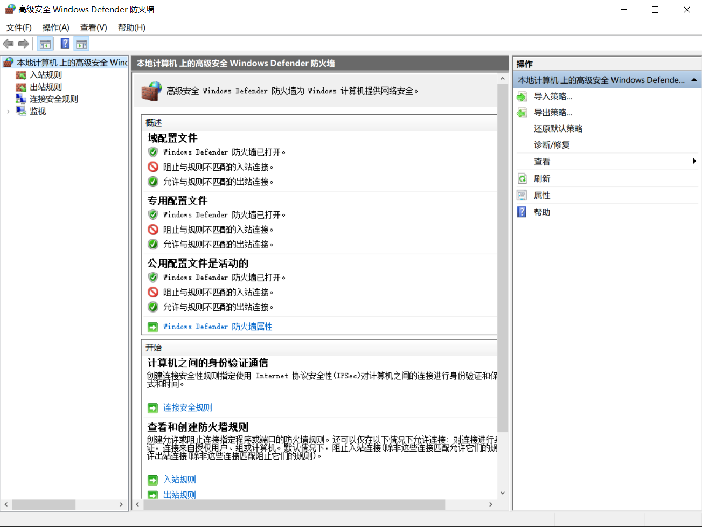

窗口左侧有三个主要节点：

- **入站规则**：控制哪些外部流量可以进入你的电脑
- **出站规则**：控制哪些程序可以向外发送数据
- **监视**：查看当前生效的规则和实时状态

中间区域显示当前活动的规则列表。每条规则都有名称、状态（已启用/已禁用）、操作（允许/阻止）、协议（TCP/UDP）、本地端口、远程端口、配置文件（域/专用/公用）。

> *Kate 打开 `wf.msc`，看到左侧的“入站规则”列表里有几十条条目，大部分状态都是“已启用”。她说：“这些就是保安手里的那张表——哪些门可以敲、谁可以敲。大部分我已经看不懂了——Windows 自己给自己开了很多门。”*

---

#### 5.6.4 如何查看防火墙规则？<!-- omit in toc -->

在 CMD 中，你可以用 `netsh advfirewall` 命令来查看和管理防火墙规则。

**查看所有入站规则**  

```cmd
netsh advfirewall firewall show rule name=all
```

这条命令会列出所有防火墙规则，内容非常长——每一条规则显示规则名称、方向（入站/出站）、操作（允许/阻止）、协议、本地端口、远程端口、远程IP地址、是否启用。你需要一条一条看，找到你关心的那条。

如果只想看启用状态的规则，可以用过滤命令——但初学者最容易上手的办法是在 `wf.msc` 图形界面里翻，比命令行直观得多。等你熟悉了规则的结构，再回到命令行做批量操作。

**查看特定端口的规则**  

```cmd
netsh advfirewall firewall show rule name=all | findstr 端口号
```

如果你想确认某个端口是否被防火墙允许，可以用这个命令快速筛选。比如你想确认 445 端口是否被允许：

```cmd
netsh advfirewall firewall show rule name=all | findstr 445
```

> *Kate 在 CMD 里试了 `netsh advfirewall firewall show rule name=all | findstr 445`，看到了自己电脑上 445 端口相关的规则。她说：“原来我电脑上 445 端口被防火墙拦着——怪不得永恒之蓝扫不到我。”*

---

#### 5.6.5 如何添加防火墙规则？<!-- omit in toc -->

假设你想允许别人通过 8080 端口访问你电脑上的一个 Web 服务。你需要创建一条入站规则——告诉防火墙“8080 端口允许通过”。

**图形界面**  

1. 打开 `wf.msc`，点击左侧的“入站规则”
2. 点击右侧操作面板中的“新建规则...”
3. 选择“端口”，点击下一步
4. 选择“TCP”，在“特定本地端口”中填 `8080`
5. 选择“允许连接”
6. 选择适用场景（域/专用/公用——如果你不确定，全选）
7. 给规则起个名字，比如 `Allow HTTP 8080`，点击完成

**命令行**  

```cmd
netsh advfirewall firewall add rule name="Allow HTTP 8080" dir=in action=allow protocol=TCP localport=8080
```

这条命令的每个参数：`name` 是规则名称（给自己看的，随便起）。`dir=in` 是方向——入站流量。`action=allow` 是动作——允许通过。`protocol=TCP` 是协议类型。`localport=8080` 是本地端口号。

执行完这条命令后，任何外部设备通过 8080 端口访问你电脑时，防火墙会放行。

**阻止某个端口的入站流量**  

```cmd
netsh advfirewall firewall add rule name="Block Port 445" dir=in action=block protocol=TCP localport=445
```

这条命令告诉防火墙“如果有人通过 445 端口来敲门，直接拒绝”。如果你担心永恒之蓝（SMB 漏洞）攻击，可以在系统打好补丁之前临时封堵 445 端口。注意：这是临时措施——真正的解决方案是打补丁，不是长期靠防火墙挡。

**删除规则**  

```cmd
netsh advfirewall firewall delete rule name="Allow HTTP 8080"
```

> *Kate 用命令行添加了一条允许 8080 端口的规则，打开 `wf.msc` 看到入站规则列表里多了一条“Allow HTTP 8080”。她说：“一条命令，防火墙就放行了一个端口。我以后做渗透测试时，如果目标机器的某个端口被防火墙挡住了，我就要先想办法在目标上添加一条放行规则——前提是我已经拿到了管理员权限。”*

---

#### 5.6.6 公网/专用/域网络——防火墙的三种“配置文件”<!-- omit in toc -->

你连接不同网络时，防火墙的严格程度是不一样的。你在家里连 Wi-Fi 和在咖啡馆连公共 Wi-Fi，防火墙不应该用同一套规则。Windows 把网络分成了三类：

- **域网络**：你连接公司域网络时适用。公司有 IT 部门统一管理安全策略，防火墙规则由域控制器下发——你不需要自己配。
- **专用网络**：你连接家里或办公室的受信任网络时适用。防火墙规则相对宽松——同一网络里的打印机、共享文件夹可以正常访问。
- **公用网络**：你连接咖啡馆、机场、酒店的公共 Wi-Fi 时适用。防火墙规则最严格——默认阻止所有入站连接，防止陌生人通过公共网络扫描你的电脑。

每种配置文件下，防火墙规则是独立生效的。你在专用网络下允许 8080 端口，在公用网络下可能仍然被阻止——这是为了保护你在不安全的公共网络里不被攻击。

> *Kate 说：“所以防火墙有三种模式——家里（信任）、公司（域）、咖啡馆（不信任）。同一个端口，在家里能通，在咖啡馆不通。这就是智能门禁——保安会根据环境自动调整严格程度。”*

---

#### 5.6.7 本节小结<!-- omit in toc -->

| 概念 | 一句话解释 | 渗透测试中的用途 |
| :--- | :--- | :--- |
| **入站规则** | 控制外部流量能否进入你的电脑 | 默认阻止所有入站——你需要知道哪些端口被放行了 |
| **出站规则** | 控制内部程序能否向外发送数据 | 默认允许所有出站——阻止木马外连需要额外配置 |
| **配置文件** | 域/专用/公用——不同网络环境应用不同规则 | 理解为什么同一个端口在不同网络下状态不同 |
| **`wf.msc`** | 防火墙的图形化管理界面 | 查看和管理防火墙规则 |
| **`netsh advfirewall`** | 防火墙的命令行管理工具 | 在无图形界面的 Shell 中查改防火墙规则 |

> 🎯 **NISP 一级考点**：Windows Defender 防火墙是 Windows 系统自带的防火墙软件。入站规则控制外部流量进入，出站规则控制内部程序外连。防火墙的三种配置文件——域、专用、公用——决定在不同网络环境下应用哪些规则。`wf.msc` 是防火墙的图形化管理界面，`netsh advfirewall` 是命令行管理工具。默认情况下，防火墙阻止所有入站连接，允许所有出站连接。
>
> 📝 **守夜者手记**：打开 `wf.msc`，查看“入站规则”列表，截图保存。找到三条状态为“已启用”的入站规则，记录它们的名称和允许的端口。然后在 CMD 中执行 `netsh advfirewall firewall show rule name=all | findstr 445`，确认 445 端口是否被防火墙阻止。最后在 CMD 中执行 `netsh advfirewall show allprofiles`，查看当前防火墙的状态和配置文件。

*Kate 在 `wf.msc` 里翻了一圈入站规则，又用命令行查了 445 端口的状态。她关掉窗口，说：“防火墙我知道了——它默认拦住所有入站，我只放行我需要用的端口。出站也拦住未知程序，防止木马外连。那我学完这个，Windows 的基本防护是不是就都学完了？”*

“还差一个。防火墙管的是‘网络入口’，但恶意软件不一定走网络——它可能通过 U 盘、邮件附件、或者你从网上下载的破解软件进来。这时候，你需要另一个工具——Windows Defender 杀毒软件。下一节，我们把它配置好。”

下一节，我们要学习 **Windows Defender 杀毒软件配置**——从实时保护到排除项，从扫描类型到病毒库更新。这是你理解 Windows 主机安全防护的最后一环。🔪

---

### 5.7 Windows Defender 杀毒软件配置 —— 你电脑的“免疫系统”

*Kate 在上一节配好了防火墙。她关掉 `wf.msc`，问了一个问题：*

> *“防火墙挡住了从外面进来的扫描和攻击。那如果恶意软件不是从网络进来的呢？比如我插了一个 U 盘，或者下载了一个带病毒的破解软件，或者点开了一封钓鱼邮件的附件——它直接从内部进来了。防火墙管不了这个，对吧？”*
>
> “对。防火墙管的是‘门禁’，但它不管‘进门之后的人’。你需要另一套机制——杀毒软件。它在你电脑内部巡逻，扫描每一个文件，发现恶意代码就拦住它。Windows 自带了一套杀毒软件，就是 Windows Defender。”

---

#### 5.7.1 什么是 Windows Defender？<!-- omit in toc -->

Windows Defender 是 Windows 自带的杀毒软件，从 Windows 8 开始成为系统的一部分。它不像第三方杀毒软件那样弹窗频繁，也不占用大量系统资源——但它足够挡住 99% 的常见恶意软件。

Windows Defender 的防护机制是实时监控的——它不像“定时扫描”那样每天只在固定时间检查一次文件。只要有文件被写入硬盘、程序被启动、U 盘被插入——Windows Defender 就会在那一瞬间检查这个文件是否属于已知威胁。如果你打开一个有病毒的 U 盘，Windows Defender 会在你双击它之前就发现并拦截它。

它使用 Microsoft 的云安全服务，每几分钟更新一次病毒特征库。病毒特征库是 Windows Defender 用来识别恶意软件的“通缉令”——它包含已知病毒、木马、勒索软件、挖矿木马的“指纹”。当新病毒出现时，微软的安全团队会分析和提取它的特征码，几分钟内推送到全球所有 Windows 电脑。你不需要手动更新病毒库——Windows 自动更新会一并更新 Defender 的病毒定义。

> *Kate 说：“所以 Windows Defender 就是我电脑的免疫系统。病毒特征库就是免疫系统的‘通缉令’——它知道坏人长什么样，看到就抓。而且它不占地方，不像某些杀毒软件弹窗多得像牛皮癣。”*

---

#### 5.7.2 Windows Defender 能干什么？<!-- omit in toc -->

Windows Defender 的核心功能有这些：

**实时保护**——你电脑里每个新建、修改、打开的文件，都会在访问前被 Defender 扫描。如果你下载了一个病毒，下载完成的那一刻——不是在你双击它的那一刻——Defender 会弹出提示“已检测到威胁”，然后拦截它、隔离它。

**云查杀**——如果一个未知程序的行为可疑，Defender 会把它上传到微软的云端分析（不包含你的个人信息）。微软的机器学习模型在云端快速判断它是否为恶意软件。

**自动更新病毒库**——病毒特征库每天自动更新。Windows 更新不只是功能更新，也包含了 Defender 病毒定义更新。你不手动更新，Defender 的病毒库也会通过 Windows 更新保持最新。

**隔离和清除**——Defender 发现病毒后会自动隔离它——把文件锁在安全区域里，阻止它执行任何操作。你可以选择删除它、恢复它、或者手动检查隔离区（在 Windows 安全中心里可以查看隔离历史）。

**离线扫描**——如果病毒已经入侵并阻止 Defender 运行，你可以在 Windows 恢复环境中启动 Defender 离线扫描——在病毒还没加载之前就扫描清理它。

> *Kate 说：“所以 Windows Defender 不只是‘扫描’，它是持续的——每一个文件进来、每一程序启动、每一次打开 U 盘，它都在背后检查。不是定时检查，是每次访问都检查。”*

---

#### 5.7.3 如何查看和管理 Windows Defender？<!-- omit in toc -->

**打开 Windows 安全中心**  

Windows 10 和 Windows 11 的杀毒软件管理入口都在 Windows 安全中心。按 `Win + I` 打开设置，搜索“安全中心”，或者在任务栏的托盘区域找到那个蓝色的盾牌图标（通常是小盾牌），双击打开。


在左侧列表中点击“病毒和威胁防护”。你会看到 Windows Defender 的状态——是否启用、上次扫描时间、病毒库更新时间、是否发现威胁。

**查看隔离区**  

在“病毒和威胁防护”中点击“保护历史记录”。这里列出了 Windows Defender 拦截过的所有威胁——包括什么时间拦截了哪个文件、文件路径是什么、你选择的操作（已隔离/已允许/已清除）。

> *Kate 打开 Windows 安全中心，看到“病毒和威胁防护”状态是绿色的“运行中”，病毒库显示“今天已更新”。她说：“原来 Windows Defender 一直在默默运行，我从来没有手动打开过它——它每天都在背后帮我拦截病毒。”*

---

#### 5.7.4 Windows Defender 的命令行操作<!-- omit in toc -->

在渗透测试中，你拿到的 Windows Shell 通常只有命令行。你需要通过 CMD 或 PowerShell 来查看和管理 Windows Defender。以下是你最常用的几个命令：

**查看 Defender 状态（通过 PowerShell）**  

```powershell
Get-MpComputerStatus
```

这条命令输出 Defender 的完整状态信息：AntivirusEnabled（是否启用——True/False）、AntivirusSignatureVersion（病毒库版本号）、AntivirusSignatureLastUpdated（病毒库最后更新时间）、RealTimeProtectionEnabled（实时保护是否启用）、LastQuickScan（上次快速扫描时间）、LastFullScan（上次全盘扫描时间）。

如果这条命令返回的状态显示实时保护已关闭、病毒库已过期——你在渗透测试中就知道了：这台电脑的防护很弱，防御不是你要担心的事。

**更新病毒库**  

```powershell
Update-MpSignature
```

手动触发 Defender 从 Microsoft 云下载最新病毒特征库。这条命令在你发现病毒库已过期或刚在电脑上跑完敏感测试文件时使用。

**执行扫描**  

PowerShell 命令支持多种扫描类型：

```powershell
Start-MpScan -ScanType QuickScan      # 快速扫描——检查内存、启动项、系统目录
Start-MpScan -ScanType FullScan       # 全盘扫描——检查整个硬盘所有文件（耗时数小时）
Start-MpScan -ScanType CustomScan -ScanPath "C:\Users\Kate\Downloads"   # 自定义扫描——检查指定文件夹
```

**启用或禁用 Defender**  

⚠️ **这两个命令只在有明确需要时使用——例如需要在不触发 Windows Defender 警报的情况下运行合法渗透测试工具，且需要管理员手动关闭 Defender 期间的风险由你自己承担。** 确保你使用这些命令的场景合法合规。

```powershell
# 禁用实时保护（仅在合法授权测试中必要时使用）
Set-MpPreference -DisableRealtimeMonitoring $true

# 启用实时保护（测试完成后务必启用）
Set-MpPreference -DisableRealtimeMonitoring $false
```

> *Kate 在 PowerShell 里执行了 `Get-MpComputerStatus`，看到一串输出——实时保护开启、病毒库今天更新、上次快速扫描是今天凌晨三点。她说：“我昨晚睡着了，我的电脑却在凌晨自己扫描了一遍。Windows Defender 不是一个我‘需要打开’的工具——它是系统的一部分，在后台一直运行着。”*

---

#### 5.7.5 渗透测试中如何绕过 Windows Defender？<!-- omit in toc -->

你在 5.7.4 已经学会了如何查看和操作 Windows Defender。现在有一个更实际的问题：**在合法授权的渗透测试中，你需要在目标机器上运行自己的工具——但你运行的工具会被 Windows Defender 识别为恶意软件并拦截。怎么办？**

Windows Defender 的工作方式是实时扫描每一个新建和打开的文件。你在目标机器上用命令行下载一个网络扫描器、一个漏洞利用工具——Defender 会立刻检测到它，并在你运行之前就把它隔离。

你需要合法地让 Windows Defender 暂时忽略你的工具。

**方法一：添加到排除项（最干净的方式）**  

在 PowerShell 中以管理员权限运行以下命令，将指定的文件或文件夹添加到排除项列表中：

```powershell
# 添加文件夹排除项
Add-MpPreference -ExclusionPath "C:\Temp\PentestTools"

# 添加文件排除项
Add-MpPreference -ExclusionPath "C:\Temp\pentest.exe"

# 添加进程排除项
Add-MpPreference -ExclusionProcess "pentest.exe"
```

当你把工具文件夹添加到排除项中后，Windows Defender 会忽略这个文件夹里的所有文件——不扫描、不拦截、不隔离。你的工具可以正常下载和运行，不会触发 Defender 的警报。

**⚠️ 重要提醒**：请确保你的渗透测试有明确的书面授权。添加排除项是合法的防御规避技术，但仅在授权范围内使用。在未经授权的系统上做任何操作都是违法的——你在第一章学过。

**方法二：临时关闭实时保护（风险更高）**  

```powershell
Set-MpPreference -DisableRealtimeMonitoring $true
```

这条命令会关闭 Windows Defender 的实时保护。如果你在工作过程中需要执行多个工具，而且不想一个一个添加排除项，可以用这个方法。但风险很高——你关闭了 Defender 的实时保护，目标系统会处于完全暴露状态，可能受到其他已知恶意软件的攻击。**强烈建议只在必要的时候短暂关闭，完成后立即重新启用。**

**方法三：检查隔离区并恢复被误删的工具**  

如果你下载的工具已被 Defender 拦截，可以在 Windows 安全中心里查看“保护历史记录”，找到被拦截的文件并选择“允许在设备上运行”。也可以用命令行恢复：

```powershell
# 查看隔离区所有项目
Get-MpThreatDetection | Where-Object {$_.Resources -like "*"}

# 恢复指定威胁（根据 ThreatID 恢复）
Start-MpThreat -ThreatID 2147519002
```

> *Kate 说：“所以如果我在合法授权的测试中，我的工具被 Defender 拦了——我可以把它加入排除项，让 Defender 忽略它。做完测试再移除排除项，恢复 Defender 的全面保护。关键是——我必须先确认自己有授权。”*

---

#### 5.7.6 本节小结<!-- omit in toc -->

| 概念 | 一句话解释 | 渗透测试中的用途 |
| :--- | :--- | :--- |
| **Windows Defender** | Windows 自带的杀毒软件 | 了解目标主机的防护状态 |
| **实时保护** | 每个文件访问时自动扫描 | 理解为什么下载的工具会被立即拦截 |
| **病毒库更新** | 每几分钟自动获取新的病毒特征 | 知道系统对抗新威胁的能力 |
| **排除项** | 让 Defender 忽略指定文件夹或文件 | 在授权测试中合法运行渗透工具 |
| **`Get-MpComputerStatus`** | 查看 Defender 状态 | 信息收集——判断目标是否有杀毒软件 |
| **`Add-MpPreference -ExclusionPath`** | 添加排除项 | 绕过 Defender 拦截（仅限于授权测试） |
| **`Set-MpPreference -DisableRealtimeMonitoring`** | 临时关闭实时保护 | 短暂关闭 Defender（风险高，慎用） |

> 🎯 **NISP 一级考点**：Windows Defender 是 Windows 系统自带的杀毒软件，提供实时保护、云查杀、病毒库自动更新等功能。Windows 安全中心（Windows Security Center）是 Defender 的管理界面。`Get-MpComputerStatus` 查看 Defender 状态，`Update-MpSignature` 更新病毒库，`Add-MpPreference -ExclusionPath` 添加排除项（仅限合法授权场景）。默认情况下，Windows Defender 对所有新建和打开的文件进行扫描，发现威胁后自动隔离。
>
> 📝 **守夜者手记**：打开 Windows 安全中心，查看“病毒和威胁防护”页面，截图保存到你的笔记文件夹里。在 PowerShell 中执行 `Get-MpComputerStatus`，找到 `AntivirusEnabled` 和 `AntivirusSignatureLastUpdated` 两行，记录结果。然后查看“保护历史记录”——有没有被拦截的威胁？如果有，截图保存。

*Kate 打开 Windows 安全中心，看到绿色的“受保护”状态，又执行了一遍 `Get-MpComputerStatus`，确认了自己的电脑一切正常。她合上笔记本，说：“Windows 系统安全我学完了——从命令行、用户权限、注册表、服务、启动项，到防火墙和杀毒软件。我知道 Windows 是怎么运作的，也知道它怎么防御入侵。如果我要守，我知道守什么。如果我要攻，我知道从哪里攻。”*

*她靠在椅背上，停顿了几秒，然后说了下一句话：*

*“但我有一个问题——我学了 Kali Linux，我学了 Windows，我学了网络，我学了怎么搭靶场。我的 VMware 里还跑着两台虚拟机：Kali 和 Metasploitable 2。我什么时候才能真的攻击它？”*  

“下一章。”

*“……真的？”*  

“真的。你在第一季第一章学的 PTES 七阶段——从前期交互到情报收集，从漏洞分析到漏洞利用。第二章学了渗透环境搭建，第三章学了网络通信基础，第四章学了 Windows 安全基础。所有的前置知识都学完了。下一章，我们走进渗透测试实战流程——第一步：信息收集。你将在 Kali 上对靶场发起第一次真实的探测，看到开放的端口、运行的服务、可用的漏洞。这不是理论了——这是实战。”

**第五章：Windows 安全基础 —— 终。** 🔪

下一章，我们要学习 **Linux 安全基础**——从命令行操作、用户和权限管理、文件系统安全，到系统服务配置和日志分析。这是你全面理解服务器攻防的最后一块拼图，也是你进入渗透测试实战前的最后一道准备。🔪

---

## 第六章 - Linux 安全基础

*Kate 在第五章学完了 Windows 安全基础。她关掉了 Windows 的终端，靠在椅背上，说了一句让我没想到的话：*

> *“我好像……有点喜欢 Windows 的命令行了。以前我觉得黑框框很吓人，现在我知道它只是‘你不知道该问谁’。但有一个问题——”*
>
> “你问。”
>
> *“我在第三章装了一台 Kali Linux，用来当攻击机。我在上面只跑过 `ifconfig`、`ping`、`curl` 这几个命令——其他的一概不会。我学的是 Windows 命令行，但我的攻击机是 Linux。我要不要在 Kali 上重新学一遍命令行？”*
>
> “不用。逻辑是一样的——你只是换了一个‘方言’。你在 Windows 上学的 `whoami`、`ping`、`mkdir`，在 Linux 上也有对应的命令。名字不同，做的事一样。这一章，我们把 Linux 的命令行补上——不是重新学，是平移。”

---

### 6.1 Linux 系统简介 —— 不是重新学，是平移

> *“在敲命令之前，我得先搞清楚一件事——我用的 Kali Linux 和 Ubuntu 是什么关系？还有你在讲网络协议时提到的 CentOS——它们都是 Linux，但有什么区别？”*
>
> “好问题。这一节我们先不讲命令，先搞清楚 Linux 这个家族到底长什么样。”

#### 6.1.1 Linux 是什么？—— 一个芬兰学生的“业余项目”<!-- omit in toc -->

Linux 的故事，你在《第零季·火种》里读过——1991 年，芬兰大学生林纳斯·托瓦兹写了一个内核，上传到 FTP 服务器，然后全世界程序员开始往里添代码。三十多年后，它变成了互联网的底座。

但你不需要记住那个故事的所有细节。你只需要记住一件事：

**Linux 不是一个操作系统，是一个内核。**

内核是操作系统最底层的那部分——它管理硬件、管理进程、管理内存。你看不到它，但它是一切的基础。就像一辆车的引擎——你不会坐在引擎上开车，但没有引擎，车动不了。

你平时说的“Linux 系统”，其实是“Linux 内核 + GNU 工具 + 图形界面 + 各种软件”的组合。这个组合有很多不同的“版本”，每个版本有自己的名字——Ubuntu、Kali、CentOS、Debian、Fedora、Red Hat……它们都叫 Linux，但长得不一样、用起来有一点不同。

> *Kate 说：“所以 Linux 是一个‘内核引擎’，不同的发行版是用同一个引擎组装出来的不同车型。Ubuntu 是家用轿车，Kali 是特种作战车，CentOS 是货运卡车——引擎一样，用途不同。”*
>
> “精准。而且你刚才说的这三款，正是你接下来最常接触的三种。”

---

#### 6.1.2 为什么你需要认识 Ubuntu、Kali 和 CentOS？<!-- omit in toc -->

你在本书里学渗透测试，主要用 Kali Linux。你以后上班，接触的服务器大概率跑的是 Ubuntu 或 CentOS。这三款系统用的都是 Linux 内核，但它们的定位完全不同。

**Ubuntu**  

Ubuntu 是目前最流行的 Linux 桌面和服务器发行版之一。它由 Canonical 公司维护，每六个月发布一个新版本，每两年发布一个长期支持版（LTS），LTS 版本支持五年。

你在网上搜“Linux 教程”，十篇里有八篇是以 Ubuntu 为例讲的。你在云服务器上租一台 Linux 机器，默认选项里一定有 Ubuntu。它最大的特点是对新手友好——安装界面有图形向导，软件仓库极其丰富，社区问答几乎覆盖了你能遇到的所有报错。

**Kali Linux**  

Kali Linux 由 Offensive Security 公司维护，专门为渗透测试设计。它预装了超过 600 款安全工具——从信息收集的 Nmap，到漏洞利用的 Metasploit，到密码破解的 Hydra，到无线攻击的 Aircrack-ng。你在 Kali 上不需要手动装工具，它们已经全部集成好了。

Kali 默认以 root 身份运行——你在 Kali 终端里敲命令，默认就是最高权限。这对渗透测试非常方便（工具不会因为权限不足报错），但也非常危险——如果你在 Kali 里不小心执行了破坏性命令，它不会问“你确定吗”，它直接执行。你在 Kali 上的操作需要更加谨慎。

**CentOS（以及它的“替代品”）**  

CentOS 是 Red Hat Enterprise Linux（RHEL）的免费克隆版——RHEL 是收费的企业级系统，CentOS 把它的源代码重新编译，免费发布。它最大的特点是稳定——内核版本和软件版本不会频繁更新，只做安全补丁。你在公司内网渗透时遇到的服务器，很大概率跑的是 CentOS 或 RHEL。

2020 年，Red Hat 宣布 CentOS 8 将在 2021 年停止维护，CentOS 7 在 2024 年停止。很多企业开始迁移到 AlmaLinux 或 Rocky Linux——它们是 CentOS 的替代品，用法几乎一样。你以后在渗透测试中遇到“像 CentOS 但不是 CentOS 的系统”，大概率就是 AlmaLinux 或 Rocky Linux。

> *Kate 说：“所以 Kali 是一台‘工具车’，里面装满了 Nmap、Burp Suite、Metasploit。Ubuntu 是我自己的‘通勤车’，我平时写代码、查资料、搭环境。CentOS 是机房里那些‘货运卡车’，它们不炫酷，但在默默干活。三辆车，引擎一样，用途完全不同。”*
>
> “对。而且你在第三章已经装好了 Kali。Ubuntu 和 CentOS 你暂时不需要装——你在 Kali 上学到的命令，在 Ubuntu 和 CentOS 上 90% 通用。”

**三款系统在日常使用中最核心的区别**  

| 发行版 | 包管理工具 | 默认用户 | 常见用途 |
| :--- | :--- | :--- | :--- |
| Ubuntu | `apt` | 普通用户，需要 `sudo` 提权 | 日常开发、学习、云服务器 |
| Kali | `apt` | root（最高权限） | 渗透测试、安全研究 |
| CentOS | `yum`/`dnf` | 普通用户，需要 `sudo` 提权 | 企业服务器、生产环境 |

> *Kate 在本子上画了三辆车：一辆写着“Ubuntu（通勤车）”，一辆写着“Kali（工具车）”，一辆写着“CentOS（卡车）”。她在三辆车下面写了一句：“引擎一样，方向盘也一样。只是后备箱装的东西不同。”*

---

#### 6.1.3 Linux 的目录结构——和 Windows 完全不同<!-- omit in toc -->

在 Windows 上，你打开“此电脑”，看到的是 `C:`、`D:`、`E:` 盘。每个盘符下有自己的文件夹——`C:\Windows`、`C:\Program Files`、`D:\Downloads`。

在 Linux 上，**没有盘符**。所有东西都从 `/`（根目录）开始，向下延伸。你不需要知道 Linux 的每个目录是干什么用的，但你至少要知道三个最重要的：

- **`/`（根目录）**：整个文件系统的起点，所有的文件夹、文件、设备都在它下面
- **`/home/用户名`**：你的个人目录，相当于 Windows 的 `C:\Users\用户名`。你下载的文件、写代码的项目、配置文件，全放在这里。在 Kali 上，你的个人目录是 `/home/kali`
- **`/etc`**：系统的核心配置文件存放处，相当于 Windows 的 `C:\Windows\System32\config`，但更加可读——你以后配置网络、改软件源、调 SSH 服务，大部分操作都在 `/etc` 下

为什么 Linux 没有盘符？因为在 Linux 的设计中，所有存储设备都是“挂载”到根目录下的某个文件夹。你在虚拟机里给 Kali 增加一块硬盘，它不是出现 `D:` 盘，而是挂载到 `/mnt` 或 `/data` 之类的目录下——你访问那个文件夹，就是访问新硬盘。

> *Kate 打开 Kali 终端，输入 `ls /`，屏幕上弹出了十几个文件夹名字。她说：“这些就是 Linux 的根目录——没有 C 盘 D 盘，所有东西都在 ` /` 下面。`/home` 是我自己的房间，`/etc` 是系统的控制室。”*
>
> “对。你只要记住这两个位置，就能找到你 90% 需要的东西。”*

---

#### 6.1.4 Linux 常用命令——先学会 8 个，剩下的以后再说<!-- omit in toc -->

你在第五章学的 Windows 命令，大部分在 Linux 上都能找到对应版本。我把最常用的 8 个命令分成三组，每组对应一个你在 Linux 上一定会遇到的场景。

**场景一：我在哪？这里有谁？**

你在 Kali 终端里打开一个新窗口，光标在闪。你不知道自己现在在哪个目录。你有两个问题要解决：

第一个问题：**我在哪个目录？** 输入 `pwd`，它会显示你当前所在的完整路径。比如你登录后默认在 `/home/kali`，输入 `pwd` 会输出 `/home/kali`。`pwd` 是 **p**rint **w**orking **d**irectory 的缩写——打印当前工作目录。

第二个问题：**这个目录里有什么？** 输入 `ls`，它会列出当前目录下所有的文件和文件夹。你刚登录 Kali，输入 `ls` 可能会看到 `Desktop`、`Downloads`、`Documents`——这些都是你 Kali 桌面上的文件夹。`ls` 是 **l**i**s**t 的缩写，就是“列出来”。

如果要看**隐藏文件**（文件名以 `.` 开头的文件，相当于 Windows 里的隐藏文件），加一个参数 `-a`：`ls -a`。如果要看**详细信息**（文件大小、权限、修改时间），加一个参数 `-l`：`ls -l`。如果要两个都要，可以合并成 `ls -la`。

> *Kate 在 Kali 终端里敲了 `pwd`，看到 `/home/kali`。她又敲了 `ls`，看到几个文件夹。她说：“我现在知道我站在 `/home/kali` 的门口，这个房间里住着 Desktop 和 Downloads。和 Windows 上打开文件管理器看到的内容一模一样——只是展示方式不一样。”*

**场景二：文件在哪？怎么处理它？**

你在 Windows 上找一个文件，要用文件管理器一层一层点开。在 Linux 上，你先用 `cd` 切换目录，然后用 `ls` 确认文件在不在。

`cd` 是 change directory 的缩写，和 Windows 里完全一样。`cd /home/kali` 就是“跳到 `/home/kali` 这个目录”。`cd ..` 是“跳到上一级目录”，从 `/home/kali` 跳到 `/home`。

你找到一个文件后，最基本的操作是复制、移动、删除：

- `cp 源文件 目标位置`：复制文件。例如 `cp /home/kali/test.txt /home/kali/Desktop/` 把 test.txt 复制到 Desktop 文件夹下。`cp` 是 copy 的缩写，和 Windows 的 `copy` 完全对应。
- `mv 源文件 目标位置`：移动文件，也用来重命名。`mv test.txt new.txt` 就是把 test.txt 改名为 new.txt。`mv` 是 move 的缩写，和 Windows 的 `move` 完全对应。
- `rm 文件名`：删除文件。`rm test.txt` 删除 test.txt。`rm` 是 remove 的缩写，相当于 Windows 的 `del`。
- `mkdir 文件夹名`：创建新文件夹。`mkdir new_folder` 在当前目录下创建一个叫 new_folder 的文件夹。和 Windows 的 `mkdir` 完全一样。

> *Kate 用 `cd` 跳到了 `/tmp`，用 `mkdir test` 创建了一个测试文件夹，用 `cp` 复制了一个文件进去，用 `mv` 改了文件名，最后用 `rm` 删掉了。她说：“`cd`、`cp`、`mv`、`rm`、`mkdir`——五个命令，和 Windows 的逻辑一模一样，只是 `cp` 不叫 `copy`，`rm` 不叫 `del`。记一次，用两次。熟悉得很。”*

---

#### 6.1.5 软件安装与更新——`apt` 的完整用法<!-- omit in toc -->

你在 Windows 上装软件，要去官网下载 `.exe` 文件，双击，点“下一步”，选安装位置，等进度条走完。你装一个软件，需要 5-10 分钟。

在 Linux 上（Ubuntu/Kali），你输入一行命令，回车，系统自动完成所有步骤：

```bash
sudo apt install 软件名
```

你不需要去官网找下载链接，不需要手动点“下一步”，不需要选安装位置——`apt` 帮你全部做完了。

**为什么 `apt` 这么方便？**

因为 Linux 发行版维护着一个**软件仓库**——里面包含了成千上万个软件包的下载地址、版本号、依赖关系、安装脚本。当你输入 `sudo apt install nginx` 时，`apt` 会做这些事情：

1. 查询软件仓库，找到 `nginx` 的下载地址和版本信息
2. 检查这台电脑上是否已经安装了 nginx 所需的依赖库——比如需要 OpenSSL、需要 PCRE、需要 Zlib。如果没有，`apt` 会**自动下载并安装这些依赖**
3. 下载 nginx 安装包
4. 解压安装包，把文件复制到正确的目录
5. 配置 nginx 的开机自启动
6. 完成安装，显示“done”

整个过程你不介入任何一步。你在 Windows 上装一个软件需要手动处理依赖问题——比如“缺少 VC++ 运行库”，你要自己去微软官网下载安装。`apt` 帮你全自动完成了。

> *Kate 说：“所以 `apt` 就是一个‘全自动安装器’。我在 Windows 上装一个软件要 10 分钟，在 Linux 上输入一行命令，20 秒完成。Windows 装软件是去商店逛一圈自己挑，Linux 是告诉快递员‘我要 X’，他帮你拿回来、拆包装、摆好。”*

**最常用的 `apt` 命令（共 6 个）**

**1. 更新软件包列表**  

```bash
sudo apt update
```

这条命令让 `apt` 从软件仓库拉取最新的软件包列表——哪些软件有新版本、哪些软件被新增了、哪些软件被移除了。它**不会安装任何更新**，只是“刷新一下手机上的应用商店页面”。

**每次安装软件之前，先跑 `sudo apt update`。** 如果你不更新，`apt` 的本地列表可能是几天甚至几周前的——你装的可能不是最新版本。

**2. 升级所有已安装的软件**  

```bash
sudo apt upgrade
```

这条命令升级你电脑上所有已安装的软件到最新版本。`update` 是刷新列表，`upgrade` 才是真正安装更新。**建议每周跑一次。**

**3. 安装一个软件**  

```bash
sudo apt install 软件名
```

例如安装 `htop`（一个系统监控工具）：`sudo apt install htop -y`。`-y` 是可选项，表示“过程中所有确认提示都自动回答 yes”——如果你不加 `-y`，`apt` 会问你“是否继续？[Y/n]”，你需要按一下回车。

**4. 删除一个软件**  

```bash
sudo apt remove 软件名
```

`remove` 删除软件本身，但保留配置文件。如果你想让系统“像从来没装过这个软件一样”，用 `purge`：

```bash
sudo apt purge 软件名
```

**5. 搜索软件**  

```bash
apt search 关键词
```

例如搜索“网络扫描工具”：`apt search network scanner`。返回结果会列出所有名称或描述里包含“network”和“scanner”的软件包。

**6. 查看某个软件的信息**  

```bash
apt show 软件名
```

例如 `apt show nmap`，会显示 nmap 的版本号、大小、依赖库、维护者信息、描述。

> *Kate 在 Kali 终端里试了 `sudo apt update`，看着一长串进度条跑完。然后她装了 `htop`，用 `htop` 看到了 Kali 当前运行的进程和 CPU 使用率——和 Windows 任务管理器类似。她说：“一行命令装一个软件，比 Windows 方便多了。而且不需要重启，装完就能用。”*

---

#### 6.1.6 本节小结<!-- omit in toc -->

| 概念 | 一句话解释 | 和你 Windows 知识的关系 |
| :--- | :--- | :--- |
| **Linux 内核** | Linux 操作系统最底层的引擎 | 所有 Linux 发行版共用同一个内核 |
| **Ubuntu** | 最友好的 Linux 桌面/服务器系统 | 你在云服务器、开发环境中经常遇到 |
| **Kali Linux** | 渗透测试专用 Linux 发行版 | 你的攻击机，内置 600+ 安全工具 |
| **CentOS** | 企业级 Linux 服务器系统 | 你在内网渗透中会遇到的企业服务器 |
| **`/`（根目录）** | Linux 文件系统的起点，没有盘符 | 相当于 Windows 的 `C:\` |
| **`/home/用户名`** | 你的个人目录 | 相当于 Windows 的 `C:\Users\用户名` |
| **`/etc`** | 系统配置文件存放处 | 相当于 Windows 的注册表+系统配置文件夹 |
| **Linux 命令 vs Windows 命令** | 逻辑一样，名字不同 | `ls` = `dir`，`cp` = `copy`，`mv` = `move`，`rm` = `del` |
| **`apt`** | Linux 上的软件包管理工具 | 一行命令装软件，自动解决依赖 |

> 🎯 **NISP 一级考点**：Linux 是一个开源操作系统，基于 UNIX。常见的 Linux 发行版包括 Ubuntu、Kali Linux、CentOS 等。Linux 目录结构以 `/` 为根目录，`/home` 存放用户个人文件，`/etc` 存放系统配置文件。`apt` 是 Debian/Ubuntu 系列的包管理工具——`sudo apt update` 更新软件包列表，`sudo apt upgrade` 升级已安装软件，`sudo apt install` 安装新软件。Linux 下的常用命令：`ls`（列出目录内容）、`cd`（切换目录）、`pwd`（显示当前路径）、`mkdir`（创建目录）、`cp`（复制）、`mv`（移动/重命名）、`rm`（删除文件/目录）。
>
> 📝 **守夜者手记**：打开你的 Kali Linux 虚拟机，依次执行以下操作：
>
> 1. 输入 `pwd`，记录当前目录路径
> 2. 输入 `ls -la`，查看当前目录下所有文件（包括隐藏文件）
> 3. 用 `mkdir` 创建一个名为 `test` 的文件夹
> 4. 用 `cd test` 进入该文件夹
> 5. 用 `echo "Hello Linux" > hello.txt` 创建一个文本文件
> 6. 用 `cp hello.txt hello_copy.txt` 复制它
> 7. 用 `rm hello_copy.txt` 删除副本
> 8. 用 `sudo apt update` 刷新软件包列表
> 9. 用 `sudo apt install figlet -y` 安装一个叫 `figlet` 的工具（它能把文字变成 ASCII 艺术）
> 10. 输入 `figlet "I am a Night Keeper"`，截一张图保存到你的笔记文件夹里

*Kate 在 Kali 终端里敲完了这一整套流程——`pwd`、`ls`、`mkdir`、`cd`、`echo`、`cp`、`rm`、`sudo apt update`、`sudo apt install figlet`。最后她看到屏幕上用大号 ASCII 字符拼出的 “I am a Night Keeper”，她盯着看了五秒，然后说：*

> *“我有点理解为什么那些老黑客喜欢用终端了。你敲一行命令，它就给你做一件事。没有弹窗、没有延迟、没有‘正在加载……’。直接、确定、不废话。”*
>
> “那你准备好学一些在渗透测试里真正会用到的命令了吗？不是 `ls` 和 `cd`——是怎么在 Linux 上查别人是什么权限、怎么把自己变成管理员、怎么修改文件的所有权让一个普通用户也能动敏感文件？”
>
> *“……这是不是类似于我在 Windows 里用 `net user` 和 `net localgroup` 做的事？”*
>
> “完全对应。你在 Windows 上学过 `whoami`、`net user`、`net localgroup`——Linux 里也有同样的命令。你不需要重新理解‘权限’这个概念，你只需要知道 Linux 用哪几个命令来做同样的事。下一节，我们把这几个命令和你 Windows 的知识对照着学。”
>
> *“那就方便多了。”*

下一节，我们要学习 **Linux 用户管理与文件权限**——`whoami`、`id`、`useradd`、`usermod`、`passwd`、`chmod`、`chown`。你会在 Linux 上完成和 Windows 完全相同的操作：查看当前用户、创建新用户、加入管理员组、修改文件权限。这不是重新学，是平移。🔪

---

### 6.2 用户管理与权限 —— 谁能进、谁能动、谁能改

*Kate 在上一节学会了 `ls`、`cd`、`mkdir`、`cp`、`mv`、`rm` 这些“日常操作”。她能在 Kali 里创建文件夹、移动文件、删除文件——但她敲命令的时候，从来不关心一件事：*

> *“我刚才创建的那个文件夹，谁有权看？谁有权删？我创建的文件夹是我的吗？还是谁的？”*
>
> “好问题。你在第五章学完了 Windows 的用户管理——`net user`、`net localgroup`、`whoami /groups`。Linux 也有完全对应的一套命令。这一节我们全部拿过来，对照着学。”
>
> *“我先问一个更基础的问题——Linux 里用户和组，和 Windows 是不是完全一样的东西？”*
>
> “底层逻辑完全一样。我们先讲清楚这个概念，再讲命令。”

#### 6.2.1 用户与用户组 —— 为什么一个房间要分两把锁<!-- omit in toc -->

在学命令之前，先把概念搞清楚。

你有一台 Linux 电脑。电脑上可能只有你一个人用，也可能你、你室友、你同事都在用。Linux 需要区分“谁是谁”——每个人有自己的家目录、自己的文件、自己的桌面壁纸。这就是**用户**。

但用户不能只靠名字区分。系统内部给每个用户分配了一个数字，叫 **UID（User ID）**。你在 Linux 里看到的用户名 `kali`，系统只认 UID `1000`。你创建一个新用户 `kate`，系统给它分配下一个数字 `1001`。`root` 的 UID 是 0——所有 UID 为 0 的用户都是最高权限。

用户解决了“谁是谁”的问题。但还有另一个问题：**权限怎么批量管理？**

一台电脑上可能有 10 个人，你不想一个一个给他们设置“能不能用打印机”“能不能读共享文件夹”“能不能用 sudo”——你只想把他们分成两组：“管理员”和“普通用户”。管理员什么都能做，普通用户只能用软件，不能改系统设置。

**用户组就是做这件事的。**

组是一群用户的集合。你给一个组设置了权限——这个组里的所有用户自动继承这个权限。你把一个人加入管理员组，他自动获得管理员权限。你把他移出管理员组，他的管理员权限自动消失。

> *Kate 说：“所以用户是身份证，组是工牌。身份证只认你这个人，工牌决定你能进哪个办公室。”*
>
> “对。你把一个人放进‘开发组’，他就能访问代码仓库。你把他从‘开发组’移出来，他就访问不了了。用户本身不变，但他的权限变了。”

**Linux 里最重要的三个组**  

你不需要记住所有组，但你需要知道这三个：

- **`root` 组**：最高权限组。UID 0。根用户所在的组。组里的人和 root 一样，所有事都能做。
- **`sudo` 组**：允许组员执行 `sudo` 命令。你在 Kali 上能 `sudo apt install`，就是因为你的用户在这个组里。如果不在这个组里，`sudo` 命令会报错。
- **`kali` 组**：用户自己的主组。每个用户有自己的主组，默认和用户名同名。你新建一个文件，文件的所属组默认就是你主组——也就是说，你创建的文件天然是你自己组里的，而不是别人的。

> *Kate 说：“所以 `sudo` 组就是 Linux 的‘管理员开关’。你不是 root，但你在 `sudo` 组里，你就能像 root 一样执行命令——通过 `sudo` 加临时权限。Windows 里‘以管理员身份运行’的弹窗做的是同一件事，但 Linux 直接在终端里完成，不弹窗。”*

**用户和组的信息存在哪？**

Windows 的用户信息存在注册表的 SAM 里。Linux 的用户信息存在两个纯文本文件里：

- **`/etc/passwd`**：存用户名、UID、家目录、登录 Shell。任何人都有读权限。
- **`/etc/shadow`**：存加密后的密码哈希。只有 root 能读。

为什么密码单独放在一个文件里？因为 `/etc/passwd` 对所有用户都可读。如果把密码也放在那里，任何登录到系统的人都能看到密码的哈希值，离线破解就变得太容易了。所以把密码单独锁进 `/etc/shadow`，只有 root 能看。

你平时不直接编辑这两个文件。你用 `useradd`、`passwd`、`usermod` 这些命令来修改用户和组——命令会自动更新这两个文件。

#### 6.2.2 我怎么知道我是谁？—— `whoami` 和 `id`<!-- omit in toc -->

现在开始敲命令。只有两个。

**`whoami`：问系统“我是谁”**

```bash
whoami
```

输出你当前登录的用户名。和 Windows 完全一样。

**`id`：问系统“我是谁、我是哪个组织的、我的编号是多少”**

```bash
id
```

输出格式：

```text
uid=1000(kali) gid=1000(kali) groups=1000(kali),27(sudo),...
```

逐段拆开：

- **`uid=1000(kali)`**：你的用户 ID 是 1000，用户名是 `kali`。系统只认数字 1000，但显示名字 `kali` 给你看。root 的 UID 是 0，普通用户从 1000 开始。如果你看到 `uid=0`，你就是管理员了。
- **`gid=1000(kali)`**：你的主组 ID 是 1000，主组名是 `kali`。每个用户都有且只有一个主组，默认和用户名同名。你新建文件时，这个文件所属的组默认就是你的主组。
- **`groups=1000(kali),27(sudo)`**：你属于多个组。主组是 `kali`，你还属于 `sudo` 组。`27` 是 `sudo` 组的数字 ID。

> *Kate 说：“`whoami` 告诉我名字。`id` 告诉我名字、身份证号、户籍、以及我属于哪些组织。我用 `id`，就能立刻知道我在不在 `sudo` 组里——也就是说，我能不能用 `sudo` 提权。”*
>
> “对。你拿到一台 Linux 服务器的 Shell 后，第一件事就是 `id`。看到 `27(sudo)` 或者 `0(root)`，你知道你是什么权限。看到只有 `1000(kali)` 而没有 `27(sudo)`，你知道你需要提权。”

#### 6.2.3 我怎么管理用户和组？—— 一个完整的场景<!-- omit in toc -->

命令不用一个一个背。我给你一个场景——你在 Kali 上需要创建一个新用户，给他设置密码，然后把他加入 `sudo` 组，让他也能用 `sudo`。完成这个场景，你只需要四个命令。

**第一步：创建用户 `kate`，并创建她的家目录**

```bash
sudo useradd -m kate
```

`useradd` 是“添加用户”。`-m` 是“创建家目录”。家目录是 `/home/用户名`——你登录进去默认就在这个目录里，你的个人文件、配置、下载都放在这里。如果不加 `-m`，只有用户账号，没有房间，登录后连自己该待在哪里都不知道。

**第二步：给她设置密码**  

```bash
sudo passwd kate
```

系统会提示你输入密码两次。`passwd` 是 password 的缩写。

**第三步：把 `kate` 加入 `sudo` 组，让她能用 `sudo`**

```bash
sudo usermod -aG sudo kate
```

- `usermod` 是“修改用户”
- `-a` 是“追加”，不覆盖用户原有的组成员身份
- `-G` 是“指定组”
- 合在一起：把 `kate` 追加到 `sudo` 组里，不影响她已经在的其他组

> *Kate 说：“`usermod -aG sudo kate`——这不就是 Windows 里的 `net localgroup administrators 用户名 /add` 吗？一个把用户加入管理员组，一个把用户加入 `sudo` 组。名字不同，动作完全一样。”*
>
> “对。你看过一次，就不用再背了。”

**第四步：验证是否生效**  

```bash
groups kate
```

输出 `kate : kali sudo`，说明她已经加入了 `sudo` 组。你还可以用 `id kate` 看更详细的信息。

**怎么删除用户？**

```bash
sudo userdel -r kate
```

`-r` 表示同时删除用户的家目录 `/home/kate`。

**怎么查看系统上所有用户？**

```bash
cat /etc/passwd
```

查看系统上所有用户。用 `cat /etc/passwd | grep /bin/bash` 只看到有登录 Shell 的用户（即真正能登录的普通用户）。

> *Kate 在 Kali 上执行了完整的场景——创建用户 `kate`、设置密码、加入 `sudo` 组、用 `groups` 验证。她说：“四个命令，完成一个完整任务。我知道我该在什么时候用每个命令。不需要背，需要的是场景——‘我要做这件事，所以我要用这个命令’。和你教我 Windows 命令时的方法一样。”*

**速查表：Windows vs Linux 用户管理**  

| 你想做什么 | Windows | Linux |
| :--- | :--- | :--- |
| 我是谁？ | `whoami` | `whoami`（一样） |
| 我有什么权限？ | `whoami /groups` | `id` |
| 列出所有用户 | `net user` | `cat /etc/passwd` |
| 创建用户 | `net user 用户名 密码 /add` | `sudo useradd -m 用户名` |
| 设置密码 | `net user 用户名 密码` | `sudo passwd 用户名` |
| 加入管理员组 | `net localgroup administrators 用户名 /add` | `sudo usermod -aG sudo 用户名` |
| 删除用户 | `net user 用户名 /del` | `sudo userdel -r 用户名` |

#### 6.2.4 用户切换 —— 怎么在普通用户和 root 之间来回切<!-- omit in toc -->

你在 Windows 里用管理员权限运行程序，右键点“以管理员身份运行”。在 Linux 里也有类似的操作——但它不弹确认框，而是用命令行切换身份。

**`sudo`：临时以 root 权限执行一条命令**

```bash
sudo 命令
```

`sudo` 让你以 root 身份执行一条命令，执行完自动退回到普通用户。

你需要在 `sudo` 组里才能用 `sudo`。如果你不在 `sudo` 组里，系统会报错“用户不在 sudoers 文件中”。

**`su`：切换用户身份**

```bash
su - 用户名
```

`su` 是 switch user 的缩写。`su - root` 切换成 root 用户——你需要输入 root 的密码。`su - kali` 切换成 kali 用户。不加用户名时，默认切换到 root。

`-` 参数表示“加载目标用户的完整环境变量”，包括家目录、Shell 配置文件、环境变量。如果你不加 `-`，你可能还在原来的目录，但身份已经变了——这容易引起混乱。**切换用户时建议总是加上 `-`。**

**`sudo su -`：快速切换到 root**

```bash
sudo su -
```

输入当前用户的密码后，你会成为 root。退出 root 用 `exit`。

**`sudo -i`：更干净的切换方式**

```bash
sudo -i
```

和 `sudo su -` 类似，但启动的是“登录 Shell”——它会完整加载 root 的环境变量和配置文件。用 `exit` 退出。

**什么时候用 `sudo`，什么时候用 `su`？**

| 场景 | 推荐命令 |
| :--- | :--- |
| 只想用 root 执行一条命令 | `sudo 命令` |
| 需要连续执行多条 root 命令，用 `sudo` 太麻烦 | `sudo -i` 切到 root，执行完 `exit` |
| 知道 root 密码，想切到 root 用户 | `su -` |
| 知道另一个普通用户的密码，想切到那个用户 | `su - 用户名` |

#### 6.2.5 SUID 特殊权限 —— Linux 最容易被利用的“漏洞后门”<!-- omit in toc -->

你在前面学的用户和权限，都是围绕“谁可以读、谁可以写、谁可以执行”这三个操作。Linux 的权限体系比 Windows 多了一样东西——**SUID**。它和你后面在渗透测试中做权限提升直接相关。

**先回顾普通权限：`rwx`**

你运行 `ls -l`，看到每行开头有 10 个字符：

```text
-rwxr-xr-x 1 root root 12345 Jan 1 12:00 /usr/bin/passwd
```

这 10 个字符的规则：

| 位置 | 含义 |
| :--- | :--- |
| 第1个字符 | 文件类型（`-` 是普通文件，`d` 是目录） |
| 第2-4个字符 | 文件所有者的权限（`rwx` 读/写/执行） |
| 第5-7个字符 | 文件所属组的权限 |
| 第8-10个字符 | 其他用户的权限 |

**SUID：让普通用户以文件所有者的身份执行**  

`/usr/bin/passwd` 是 Linux 里用来修改密码的命令。它的权限是 `-rwsr-xr-x`——注意第4个字符是 `s`，不是 `x`。

这个 `s` 就是 **SUID（Set User ID）** 特殊权限。

普通用户执行 `passwd` 命令时，需要修改 `/etc/shadow` 文件——这个文件里存着所有用户的密码哈希，只有 root 用户才有权限读写。普通用户直接编辑 `/etc/shadow` 会被拒绝。但 `passwd` 命令设置了 SUID 权限——**当你执行它时，你不是以你自己的身份运行，而是以文件所有者（root）的身份运行**。所以普通用户能用 `passwd` 修改自己的密码，是因为命令本身以 root 身份去写 `/etc/shadow`，而不是因为你普通用户有权限。

**如何给一个程序设置 SUID**  

```bash
sudo chmod u+s /path/to/程序
```

`chmod` 是 change mode 的缩写，`u+s` 表示“给文件所有者添加 SUID 权限”。

**如何在渗透测试中利用 SUID 做权限提升**  

在渗透测试中，你拿到一个普通用户 Shell 后的第一件事，就是用 `find` 搜索整个系统里所有设置了 SUID 权限的程序：

```bash
find / -perm -u=s -type f 2>/dev/null
```

这条命令列出所有所有者是 root、且设置了 SUID 权限的普通文件。如果输出里包含了你可以利用的程序——比如 `find` 本身设置了 SUID，你可以用 `find` 执行 shell 命令，绕过普通用户的权限限制。

#### 6.2.6 本节小结<!-- omit in toc -->

| 概念 | 一句话解释 | 和你 Windows 知识的关系 |
| :--- | :--- | :--- |
| `whoami` | 查看当前用户 | 和 Windows 完全一样 |
| `id` | 查看用户的所有身份信息（UID、GID、所属组） | 相当于 Windows 的 `whoami /groups` 的增强版 |
| `cat /etc/passwd` | 查看系统上所有用户 | 相当于 Windows 的 `net user` |
| `useradd` | 创建新用户 | 相当于 Windows 的 `net user 用户名 密码 /add` |
| `passwd` | 设置用户密码 | 相当于 Windows 的 `net user 用户名 密码` |
| `usermod -aG` | 把用户加入一个组 | 相当于 Windows 的 `net localgroup 组名 用户名 /add` |
| `sudo` | 以 root 身份执行一条命令 | 相当于 Windows 的“以管理员身份运行” |
| `su -` | 切换用户身份 | Windows 没有直接等价命令——需要注销再登录 |
| `SUID` | 普通用户以文件所有者身份执行程序 | Windows 没有直接等价概念 |

> 🎯 **NISP 一级考点**：Linux 用户管理的核心命令——`whoami`（当前用户）、`id`（用户身份信息）、`useradd`（创建用户）、`passwd`（设置密码）、`usermod`（修改用户）、`userdel`（删除用户）。用户信息存放在 `/etc/passwd` 文件中，密码信息存放在 `/etc/shadow` 文件中，用户组信息存放在 `/etc/group` 文件中。`sudo` 用于以管理员身份执行命令，`su` 用于切换用户身份。`chmod u+s` 设置 SUID 权限，使普通用户能以文件所有者的身份执行该程序——这是 Linux 权限提升的重要知识点。
>
> 📝 **守夜者手记**：在 Kali 终端中执行以下操作：
>
> 1. `whoami` —— 确认当前用户
> 2. `id` —— 查看你所属的所有组，确认是否在 `sudo` 组里
> 3. `cat /etc/passwd | grep /bin/bash` —— 查看系统上所有可以登录的普通用户（有 `/bin/bash` 的用户）
> 4. `cat /etc/group | grep sudo` —— 查看哪些用户在 `sudo` 组里
> 5. `find / -perm -u=s -type f 2>/dev/null` —— 列出所有设置了 SUID 权限的程序
>
> 把第 3 条和第 5 条命令的输出截图保存到你的笔记文件夹里。在截图下方写一句：“这是我 Kali 系统上所有可登录的用户，和所有设置了 SUID 的程序。”

*Kate 在 Kali 终端里执行了 `find / -perm -u=s -type f 2>/dev/null`，看到了一长串带有 `s` 权限的文件。她盯着其中一行 `/usr/bin/passwd`，说：*

> *“所以这个 `passwd` 命令能让我改密码，不是因为我的普通用户有权限改 `/etc/shadow`——是因为这个命令自带了一个‘root 临时通行证’。”*
>
> “对。你现在看到一个文件带着 `s`，就知道它不普通——任何人在执行它时，都会临时变成它的所有者。”
>
> *“那如果我发现一个带着 `s` 的程序是我可以操纵的——”*
>
> “你就拿到了从普通用户到 root 的跳板。这是 Linux 权限提升中最经典的路径之一。”
>
> *“用户和权限我大概懂了。但我还有一个问题——`find / -perm -u=s` 这串命令是从哪来的？我猜 `/` 是根目录，`-perm` 是权限，但 `-u=s` 是什么意思？而且我注意到你命令里还加了个 `2>/dev/null`——那是什么东西？我学 Linux 到现在，还没学怎么‘找文件’。”*
>
> “你问到了关键——`find` 是你未来在 Linux 上搜索敏感文件的核心工具。你知不知道怎么在几万个文件里找出一个写着‘password’的配置文件？怎么找出所有属于某个用户的文件？怎么找出最近 24 小时内被改过的文件？这些事在图形界面里做不到，但 `find` 一行命令就能完成。”
>
> *“……下一节学 `find`？”*
>
> “对。下一节我们学 Linux 文件管理——`find` 全局搜索文件、`grep` 在文件内容里搜关键词、`tar` 打包和压缩、`scp` 在服务器之间传文件。你做完权限管理之后，下一步就是收集信息——找敏感文件、打包下载、带回本地分析。”

下一节，我们要学习 **文件搜索与内容过滤**——`find` 按名称、大小、时间、权限搜索文件，`grep` 在文件内容中筛选关键词。这是你在渗透测试中定位敏感文件、查找配置错误的必备技能。🔪
