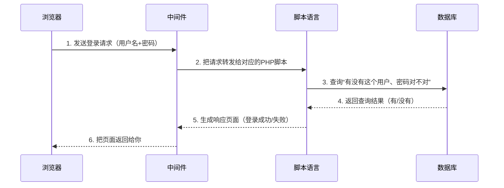

# 1. 这才是网络安全·第一季：筑基

---

## 目录

- [1. 这才是网络安全·第一季：筑基](#1-这才是网络安全第一季筑基)
  - [目录](#目录)
  - [前言](#前言)
  - [第一章 - 网络安全导论](#第一章---网络安全导论)
    - [1.1 网络安全的定义与价值](#11-网络安全的定义与价值)
    - [1.2 安全四大法律法规 —— 不是背条文，是知道红线在哪](#12-安全四大法律法规--不是背条文是知道红线在哪)
    - [1.3 安全职业道德 —— 技术是剑，道德是剑鞘](#13-安全职业道德--技术是剑道德是剑鞘)
    - [1.4 漏洞相关概念 —— 一个漏洞从出生到被载入史册的一生](#14-漏洞相关概念--一个漏洞从出生到被载入史册的一生)
    - [1.5 网络安全等级保护制度2.0 —— 守夜者的城墙设计规范](#15-网络安全等级保护制度20--守夜者的城墙设计规范)
    - [1.6 行业岗位与认证 —— 你想成为哪一种守夜者？](#16-行业岗位与认证--你想成为哪一种守夜者)
  - [第二章 - 渗透测试基础](#第二章---渗透测试基础)
    - [2.1 渗透测试概念](#21-渗透测试概念)
    - [2.2 PTES 渗透测试执行标准 —— 渗透测试员的作业指导书](#22-ptes-渗透测试执行标准--渗透测试员的作业指导书)
    - [2.3 本章小结](#23-本章小结)
  - [第三章 - 渗透环境搭建](#第三章---渗透环境搭建)
    - [3.1 Python 安装与多版本管理](#31-python-安装与多版本管理)
    - [3.2 Java/JDK 安装与环境变量配置](#32-javajdk-安装与环境变量配置)
    - [3.3 Burp Suite 社区版安装与配置](#33-burp-suite-社区版安装与配置)
    - [3.4 VMware 虚拟机安装](#34-vmware-虚拟机安装)
    - [3.5 导入 Metasploitable 2 靶场虚拟机](#35-导入-metasploitable-2-靶场虚拟机)
    - [3.6 Kali Linux 安装与基本配置](#36-kali-linux-安装与基本配置)
    - [3.7 演示：虚拟机破坏与快照还原](#37-演示虚拟机破坏与快照还原)

---

## 前言

Hello World!

如果你是从《第零季·火种》一路读过来的——欢迎回来。你已经认识了那些在黑暗中点亮火种的人，也读完了守夜者的宣誓词。你已经有了一颗“守夜者的心”。

如果你直接翻开了这一季——没关系。你只需要知道一件事：**网络安全不是一堆冷冰冰的命令和协议。它是一群人在漫漫长夜里，用自己的技术和信念，守护着你看不到的疆域。** 而你，即将成为他们中的一员。

---

《第一季：筑基》要做什么？

筑基，就是打地基。这一季的目标非常明确：**让你拿到 NISP 一级证书所需的所有基础知识，并建立起网络安全的完整骨架。**

NISP（国家信息安全水平考试）是中国信息安全测评中心颁发的入门级安全认证。很多高校已经把它作为信息安全专业的毕业要求了——学完这一季，你不仅能去考证，更重要的是，你会知道这个行业有多大、有多深、有哪些门你可以推开。

**每一节末尾都有 NISP 考点提示。每一章都是你考证路上的一块垫脚石。**

但你不会只是在“备考”。

---

Kate 会和你一起学。

她会在每一节提问、踩坑、画图、做笔记。她会替你说出那些“我不敢问”的问题。

她不是完美的学霸。她是另一个从零开始的守夜者。

她的笔记本上画满了图表和总结——如果你不知道这一节在讲什么，翻到小节结尾，看看 Kate 画了什么。

---

**本教程的规矩：**

只有一条：**打开你的环境，跟着敲。**

每一章都有动手环节。你可以用自己搭建的虚拟机、用在线靶场、甚至用你正在看教程的这台电脑——前提是你知道自己在做什么，并且不会触犯 1.2 节讲的那四条法律底线。

Kate 会在每一节等你。

她会敲错，然后改回来。她会提问，然后找到答案。她会画图，然后恍然大悟。

你不需要比她更聪明——你只需要和她一样不放弃。

准备好了吗？

第一章，我们从“网络安全的定义”开始——也就是你每天都在做、但从没意识到自己在做的那些事。

---

*Kate 新建了一个 Markdown 文档。她在页面最上方敲了三个字：“第一季。”然后她画了一条横线。横线下方写了一行小字：*

*“目标：拿到 NISP 一级。每天 2 小时，雷打不动。”*  

*她把笔放下来，活动了一下手指。她的键盘已经摆正了。*

---

## 第一章 - 网络安全导论

---

### 1.1 网络安全的定义与价值

Kate 今天出门的时候，站在门口发了三十秒呆。

她在检查自己有没有锁门。她先推了一下门把手——锁了。又走到窗边检查了窗锁——也锁了。最后她拉开抽屉看了一眼自己的日记本还在不在——还在。

然后她发了一条消息给我：“我刚发现，我每天出门前都在做‘安全检查’。门锁是机密性，窗锁是完整性，日记本藏好也是机密性。”

我说：“你已经理解网络安全的本质了。”

---

#### 1.1.1 你每天都在做安全，只是你不知道<!-- omit in toc -->

教科书上对网络安全的定义是：“保护网络系统中的硬件、软件和数据，不因偶然或恶意的原因遭到破坏、更改或泄露，保证系统连续、可靠、正常地运行。”

读起来是不是有点绕？

翻译成人话就是：**让你的东西不被偷、不被改、在你要用的时候能用。**

这和你在物理世界里做的事一模一样。你锁门，是不想让陌生人进来。你给手机设密码，是不想让别人翻你的相册。你把重要文件备份到云盘，是怕电脑坏了找不回来。

网络安全就是把这些“物理世界里的安全意识”搬到数字世界——只不过，工具不一样了：

- 物理世界的锁是金属做的。
- 数字世界的锁是密码、加密算法、访问控制、防火墙规则、入侵检测系统。

工具变了，逻辑没有变。

安全界把这三种保护总结成三个词，叫 **CIA三元组**。

别被这个名字唬住。它跟美国中央情报局（CIA）没有任何关系。这三个字母是三个英文单词的首字母，代表了网络安全的三个核心目标：

- **机密性（Confidentiality）**——只有你，或者你授权的人，才能看你的东西。  
  你的日记本、银行卡余额、聊天记录——未经你允许，谁都不能看。

- **完整性（Integrity）**——你存的东西，没有被别人偷偷改过。  
  你的成绩单、银行转账记录、你写的代码——如果有人在你不知情的时候改了一笔，你可能毕业不了、钱没了、项目崩了。

- **可用性（Availability）**——你想用的时候，它就能用。  
  期末考试前一晚，你想打开笔记复习，结果服务器崩了——这叫可用性被破坏。笔记还在，但你看不到。

*Kate插了一句：“所以安全不是越严越好，是‘刚刚好’。门锁太复杂，你自己都进不去——那不是安全，是自残。”*  

“精准。安全是平衡的艺术，不是追求极致。”

你加一把锁，能挡住攻击者，但也可能挡住了你自己。安全工程师的日常，就是在三者之间找到一个“刚刚好”的位置。

---

#### 1.1.2 网络安全到底保护什么？<!-- omit in toc -->

既然目标是保护，那保护的到底是“什么”？

说“保护电脑”是准确的，但不完整。网络安全要保护的，是四个层次的东西——每一层都可能被攻击者盯上。

**第一层：硬件**  
你的电脑、手机、路由器、服务器——这些是物理设备。如果有人直接把你笔记本电脑偷走了，里面装的防火墙、杀毒软件全都没有用。物理安全是整个安全体系的地基。门禁、监控、硬盘加密——这些都是在保护这一层。

**第二层：软件**  
操作系统、浏览器、APP、数据库——这些是每天都在用的软件。软件是人写的，人必然会犯错。每一个错误都可能变成一个安全漏洞。你手机上的APP为什么老是提示更新？很多时候不是加新功能，是发现了漏洞，紧急补上。

**第三层：数据**  
照片、文档、聊天记录、代码仓库——这些才是你在数字世界里真正有价值的东西。硬件可以再买，软件可以重装，但数据丢了就是丢了。你的学习笔记、GitHub仓库里的代码——这些价值远超硬件本身。

**第四层：人**  
这是整个安全体系里最薄弱的一环。再强的加密算法、再复杂的防火墙，都架不住有人在电话里把密码告诉了“技术支持人员”。很多攻击者根本不碰技术——他们直接打电话给目标公司的员工，假装成IT部门，说“我需要你的密码帮你重置邮箱”。这种攻击叫**社会工程学**，成功率远超你的想象。（《第零季·火种》里讲过，凯文·米特尼克就是社会工程学的大师。）

*Kate说：“所以最安全的电脑，是从来不联网、不插U盘、不给任何人用的那一台。”*  

“对。但那样的电脑除了当镇纸，什么用也没有。”

安全不是让电脑“绝对安全”。安全是让电脑既“有用”又“安全”——找到那个平衡点。

---

#### 1.1.3 网络安全从哪些方向入手？<!-- omit in toc -->

网络安全这个领域太庞大了。一个人不可能什么都会。

所以这个行业分成了几个主要方向——你不需要全精通，但你应该知道，自己未来可能站在哪个位置。

| 方向 | 干什么的 | 你在本系列会学到 |
| :--- | :--- | :--- |
| **网络安全** | 守城门的。管防火墙、管VPN、管DDoS防御。核心问题是“谁能进来、谁不能进来” | Wireshark抓包、iptables配置、IDS/IPS部署 |
| **系统安全** | 守城墙的。管服务器加固、补丁管理、漏洞利用与权限提升。核心问题是“如果有人进来了，他能走多远” | Linux权限配置、Windows域渗透、提权技巧 |
| **应用安全** | 守城堡内部的。管Web漏洞、代码审计、API安全。这是目前漏洞最密集的战场 | SQL注入、XSS、CSRF、文件上传漏洞 |
| **密码学** | 造锁的。研究加密算法、数字签名、哈希函数。这是所有安全机制的数学地基 | AES、RSA、SHA-256、TLS握手协议 |

你在后面几季会陆续接触这些方向。现在不用急着选方向——先把基础打好，走着走着，你的偏向自然会浮现。

---

#### 1.1.4 白帽、黑帽、灰帽——你在哪个阵营？<!-- omit in toc -->

你在《第零季·火种》里已经读过黑客的历史。现在你需要知道：在今天的网络世界里，黑客分三个阵营。

**白帽：合法守护者**  

经过授权才测试系统，发现漏洞后负责任地报告给厂商，等厂商修复后才公开细节。渗透测试工程师、漏洞赏金猎人、安全研究员——这些都是白帽的日常角色。凯文·米特尼克出狱后就是白帽——他用同样的技术，合法地保护那些他曾经入侵过的系统。

**黑帽：违法入侵者**  

未经授权入侵系统，窃取数据、加密文件勒索赎金、把漏洞卖给地下市场。新闻里“某某公司遭黑客攻击，数千万用户数据泄露”——背后是黑帽。

**灰帽：未经授权但无恶意**  

可能发现了漏洞，忍不住验证了一下，没有造成破坏，也没有经过授权。灰帽的行为在法律上仍然是违规的。“我只是进去看看，什么都没动”——在法庭上不能作为免责理由。

*Kate说：“所以白帽和黑帽的区别，不是技术水平，是有没有授权？”*  

“对。同一个漏洞利用技术，白帽用它来证明漏洞存在、帮厂商修好；黑帽用它来偷数据、搞破坏。技术一样，目的不同，结果不同。”

*Kate低头在笔记上画了一条线：*

- `白帽 = 有授权 + 做好事`
- `黑帽 = 无授权 + 做坏事`
- `灰帽 = 无授权 + 没做坏事（但随时可能被当成黑帽）`

“我今天下午要给自己多画一行注释。”Kate说，“**决定你是白是黑的，不是你会什么，是你用这些技能做什么。** ”

---

#### 1.1.5 网络安全值多少钱？<!-- omit in toc -->

你可能觉得“学安全是为了防止被黑”。

这是一部分原因。但不是全部。

网络安全本身就是一个巨大的产业，价值体现在三个层面：

**个人层面**：保护你的隐私、财产、名誉。你爸妈的手机为什么经常收到诈骗短信？因为他们的个人信息在某个数据泄露事件中被卖掉了。你学了网络安全，就能教会他们识别钓鱼短信、设置强密码、开启双重认证。

**企业层面**：保护商业机密、业务连续、用户信任。2017年，美国信用机构Equifax因为一个没修补的漏洞，泄露了1.47亿美国人的社保号、驾照号、信用卡号。CEO引咎辞职，公司市值蒸发数十亿美元。一个漏洞，毁掉一个帝国。

**国家层面**：保护关键基础设施——电网、水坝、核电站、军事指挥系统。2010年的震网病毒（Stuxnet），通过感染伊朗核设施的PLC控制器，悄然改变了离心机的转速，导致大量离心机在运转中损毁。这是人类历史上第一个造成物理破坏的数字武器——它证明了“网络攻击可以杀人”不再只是科幻情节。

*Kate沉默了几秒，说：“所以我们现在学的东西……以后可能真的会影响几百万人的安全？”*  

“对。这就是守夜者的职责。你守护的不是代码，是代码背后的人。”

---

#### 1.1.6 本节小结<!-- omit in toc -->

这一节讲了五件事：

1. **网络安全的本质**：保护机密性（不泄露）、完整性（不被改）、可用性（用得了）——和你出门锁门窗的逻辑一模一样。
2. **保护对象分四层**：硬件、软件、数据、人。最薄弱的一环永远是“人”。
3. **行业四大方向**：网络安全（守城门）、系统安全（守城墙）、应用安全（守城堡内部）、密码学（造锁）。你不需要全精通，但要知道各自在干什么。
4. **白帽/黑帽/灰帽**：区别不是技术，是授权和目的。
5. **安全的价值**：从个人隐私到国家安全，这不是技术问题，是关乎每个人生存的底线。

> 🎯 **NISP 一级考点**：CIA三元组的定义与三个性质的区别，是选择题高频考点。机密性、完整性、可用性各自对应什么攻击场景？关上书本，试着用你自己的话说一遍——如果三个场景中有一个你会卡住，那这个地方就是你复习的重点。
>
> 📝 **守夜者手记**：检查你手机的锁屏方式。是密码？指纹？面部识别？还是没有锁屏？如果现在有人拿起你的手机，能不能直接看到你相册里的照片？如果答案是“能”——现在就去设置一个锁屏。截一张设置成功的图，放进今天的笔记里。

---

### 1.2 安全四大法律法规 —— 不是背条文，是知道红线在哪

*Kate 正在刷一个安全论坛。她看到一篇帖子，标题是“16岁高中生挖到某平台漏洞，被厂商报警”。她截图发给我，问了一句：*

> *“挖漏洞犯法吗？我未成年会不会被抓？”*

*“好问题。这节就是给你准备的——不讲法条，讲场景。你看看你能不能在这些场景里活下来。”*  

---

#### 1.2.1 场景一：你发现了一个漏洞，然后呢？<!-- omit in toc -->

你正在学安全，兴致勃勃地拿学到的扫描器去扫了一个网站。你发现它的登录框有SQL注入漏洞，于是你试了一下——输入 `' OR 1=1 --`，回车。啪，你绕过登录界面，进入了后台。

你很兴奋：“我挖到洞了！”你截图发了朋友圈：“拿下某电商网站后台，安全做得太烂了。”

**十五分钟后，派出所民警敲了你家的门。**

你触犯了《中华人民共和国网络安全法》第二十七条：任何个人和组织不得非法侵入他人网络、干扰他人网络正常功能、窃取网络数据。你只是“试了一下”，什么都没偷没删，但法律上——你“侵入”了。未经授权的侵入本身就是违法的，不管你有没有造成实际损害。

想合法地做这件事，你应该怎么做？

1. 去漏洞赏金平台（比如补天、漏洞盒子、HackerOne）注册成为白帽，在平台授权的范围内测试目标
2. 在你自己的虚拟机里搭建靶场（比如DVWA、sqli-labs），拿自己搭的系统练手
3. 如果你确定想在某个真实网站上测试，先联系对方安全团队，拿到**书面授权**（邮件也算），然后在授权范围内测试

> *Kate 说：“所以我不能看到哪个网站有漏洞就去捅一下，我得先拿到‘许可证’。”*
>
> “对。就像你不能因为看到邻居家的门锁质量差，就开门进去转一圈。哪怕你什么都没偷，你也是‘非法侵入’。”

---

#### 1.2.2 场景二：你拿到了一份“数据”<!-- omit in toc -->

你加入了一家公司的安全团队，负责渗透测试。同事发给你一份测试用的客户数据库，里面有几十万条用户信息。你顺利地完成了测试，然后把这份数据存进了自己的移动硬盘里，想着“回家还可以再分析分析”。

**一周后，公司发现数据泄露，追查到了你。**

你触犯了《中华人民共和国数据安全法》第三十二条：任何组织和个人不得窃取或以其他非法方式获取数据。哪怕你是公司内部人员，哪怕你的初衷是“为了方便工作”，只要你在未经授权的情况下将客户数据带离公司环境，你就违法了。数据有主人——你只是在工作中暂时接触它，不代表你拥有它。

怎么做才合法？

- 敏感数据只在公司授权的工作环境中处理，不下载到个人设备上
- 测试完成后，按照公司规定清理所有测试过程中产生的临时数据
- 如果发现数据安全漏洞（比如权限配置错误导致数据可被越权访问），立即报告给安全负责人，而不是自己先去验证那个漏洞有多大

> *Kate 说：“所以数据就像实验室的危险化学品——你可以按规定使用它做实验，但不能把它装包里带回家。”*

---

#### 1.2.3 场景三：你写了一款“安全工具”<!-- omit in toc -->

你学Python的时候写了一个端口扫描器，能自动探测目标服务器开放了哪些端口、运行着什么服务、有没有已知漏洞。你特别满意，把代码开源到GitHub上，还写了一篇博客教程，教别人“如何用这个工具扫描任意网站”。

**三个月后，派出所民警又敲了你家的门。** 这次是因为有人用你的工具扫描了政府网站，被网警追查，查到了你的GitHub仓库和那篇教程。

你可能构成《中华人民共和国刑法》第二百八十七条之二——“帮助信息网络犯罪活动罪”：明知他人利用信息网络实施犯罪，为其提供技术支持，情节严重的，处三年以下有期徒刑或者拘役，并处或者单处罚金。

“我不知道他会拿去攻击政府网站啊！”——这在法律上叫“不明知”，可以作为辩护理由。但如果你在教程里写的是“用这个工具去扫你想攻击的目标”，而不是“请仅在授权环境中使用”，那“不明知”的辩护就很难成立。

怎么做才安全？

- 在工具的开源代码里加上明确的授权声明：**“本工具仅供合法授权测试使用，请勿用于非法目的”**
- 在教程里反复强调测试范围必须经过目标系统所有人明确授权
- 如果你发现有人用你的工具做违法的事，及时删除相关教程并配合调查

> *Kate 说：“所以发布安全工具就像卖菜刀——菜刀本身不犯法，但如果你教人拿菜刀去砍人，你就有麻烦了。”*

---

#### 1.2.4 场景四：你负责的系统被黑了<!-- omit in toc -->

你在一家公司做安全运维。某天上班，你发现公司官网被篡改了——首页被换成了“Hacked by xxx”，后台数据被加密，对方留了一封勒索信：“支付5个比特币，否则数据永远恢复不了。”

你慌了，第一反应是：“先把网站恢复上线，别让老板看见。”

**你手动恢复了首页，覆盖了现场日志，当作什么都没发生过。**

这时候你触犯的就不是《网络安全法》了——《中华人民共和国网络安全法》第二十五条规定：网络运营者应当制定网络安全事件应急预案，及时处置系统漏洞、计算机病毒、网络攻击、网络侵入等安全风险；在发生危害网络安全的事件时，立即启动应急预案，采取相应的补救措施，并**按照规定向有关主管部门报告**。

你是被攻击的受害者，但你没有按规定报告，反而掩盖了攻击事实。被网信部门查实后，公司被罚款几十万，你被公司开除，安全资质被吊销。

> *Kate 说：“所以被黑了之后，不是‘赶紧修好装没事’，是‘赶紧保留证据然后上报’？”*
>
> “对。被黑不是你的错——但掩盖被黑的事实，就是你的错了。”
>
> *“……但如果公司老板不让我上报呢？他说‘我们自己修好就行了，报上去反而惹麻烦’。”*
>
> “那你要做的事情是：保留一份书面的记录——邮件、聊天记录、或者至少一份你的工作日志——写明你发现了攻击，并建议按规定上报。老板的决定是老板的事，但你没有配合掩盖的证据，是你自己的保护。你不需要去举报老板，你只需要证明你已经履行了你作为安全负责人的职责。”
>
> *“……所以我不仅要保护系统，还要保护我自己。”*
>
> “对。守夜者不止守护城堡，也要守护自己的剑。”

**正确的做法是什么？**

1. **第一时间断网**，防止攻击者继续扩大破坏
2. **保留现场**——日志、内存镜像、硬盘镜像，全部保留，不要动
3. **启动应急预案**，通知应急响应团队介入
4. **按规定向主管部门报告**，配合调查
5. **恢复业务**，在确保安全的前提下逐步恢复
6. **事后复盘**：攻击是怎么进来的？哪个环节出了问题？怎么防止下次再发生？

---

#### 1.2.5 四部法律的底线总结<!-- omit in toc -->

以上四个场景，分别对应了四部法律中的核心红线：

| 法律名称 | 核心红线 | 你踩线的行为 |
| :--- | :--- | :--- |
| **《网络安全法》** | 未经授权不得侵入他人网络 | 没拿到授权就去测真实网站 |
| **《数据安全法》** | 数据不属于你，不能私自带走 | 把客户数据拷回家 |
| **《个人信息保护法》** | 处理个人信息必须取得同意或合法依据 | 非法获取/滥用他人个人信息 |
| **《刑法》相关条款** | 明知他人在犯罪，还提供技术支持 = 共犯 | 写“教人攻击”的教程并公开传播 |

> 🎯 **NISP 一级考点**：四部法律的名称及核心监管对象是选择题高频考点：
>
> - 《网络安全法》管的是“网络运行安全”
> - 《数据安全法》管的是“数据处理活动”
> - 《个人信息保护法》管的是“个人信息权益”
> - 《刑法》管的是“构成犯罪的行为”
>
> 📝 **守夜者手记**：今天检查你电脑上存了哪些“来源不明”的数据文件。比如从网上下载的“密码字典”、从别人那里拷来的“用户名单”、或者你自己测试时保存的日志文件。
> 如果这些数据不属于你，或者你没有保存它的合法理由——删掉它。用 `shred` 或 `srm` 安全删除（Linux/macOS用户），而不是直接拖进回收站。如果你用的是 Windows，可以用 `cipher /w:C:\` 来安全擦除C盘剩余空间（把 `C:` 换成你想要清理的盘符）。

---

> *Kate看完这四条底线，沉默了几秒，说：“所以法律不是来吓我的。法律是来保护我的——前提是我别自己先越线。”*
>
> “对。法律画了一个圈，圈里是合法，圈外是违法。但有些事，法律没说清楚——因为它还没追上新技术的脚步。”
>
> *“……那这个时候我靠什么判断？”*
>
> “靠道德。下一节——安全职业道德。我带你看看在法律管不到的地方，怎么做一个别人信得过的人。”

下一节，我们要深入探讨**安全职业道德**——白帽与黑帽的真正分界线、三个真实违法案例的教训，以及守夜者的六条职业道德守则。🔪

---

### 1.3 安全职业道德 —— 技术是剑，道德是剑鞘

*Kate 在学完法律之后，问了我一个问题：“法律规定了‘不能做什么’。但如果某件事法律没说清楚，或者法律管不到——我怎么知道该不该做？”*  

*“那就不是法律问题了。是道德问题。”*  

---

#### 1.3.1 法律是底线，道德是高线<!-- omit in toc -->

想象一条河。河边立着一块牌子：“禁止游泳”。这是法律——你游了就罚款，淹死你自己负责。

但河边没有牌子说“禁止往河里扔垃圾”。法律没规定，你可以扔。但你不会扔——因为你知道这条河是下游村子喝的水。这不是法律约束你，是你的道德约束你。

网络安全这个行业，充斥着类似的灰色地带。法律不可能追得上技术的迭代速度——新的攻击手法、新的漏洞利用方式、新的数据收集方式每天都在出现。等法律跟上，可能已经过去了很多年。在这段“法律空白期”里，你靠什么做决策？

**靠职业道德。**

| 约束类型 | 来源 | 惩罚方式 | 举例 |
| :--- | :--- | :--- | :--- |
| **法律** | 国家立法 | 罚款、有期徒刑、吊销执照 | 未经授权入侵系统 → 触犯《网络安全法》 |
| **道德** | 行业共识与个人良知 | 名誉损失、社区驱逐、良心谴责 | 挖到漏洞后偷偷卖给黑产 → 不犯法（在某些灰色地带），但你会被安全社区公开唾弃 |

法律告诉你“不能做什么”。道德告诉你“该不该做”。法律是最低的栏杆，道德是你自己设的护栏。跨过法律的栏杆，你进监狱。跨过道德的护栏，你未必进监狱，但你失去了同行对你的尊重——在这个行业里，失去尊重等于失去一切。

> *Kate 说：“所以道德不是约束，是保护。保护我不变成一个‘有技术没人品的人’。”*

---

#### 1.3.2 白帽与黑帽的真正分界线<!-- omit in toc -->

你在第零季和1.1节已经了解过白帽、黑帽、灰帽的定义。现在我们需要把这件事讲得更具体——因为真实世界不是“好人vs坏人”这么简单。

**白帽**：获得授权 → 测试系统 → 发现漏洞 → 报告给厂商 → 等厂商修复后再公开细节。全程在合同范围内行动，每一个步骤都有据可查。白帽的职业道德核心是：**透明、负责、不越界。**

**黑帽**：未经授权 → 侵入系统 → 窃取数据/造成破坏 → 可能出售漏洞或利用漏洞获利。行为本身就是违法的。

**灰帽**：未经授权但无恶意。可能是发现了漏洞忍不住验证了一下，没有造成破坏，也没有经过授权。灰帽的困境在于：动机可能是好的，但行为在技术上是违规的——因为你没有敲门就进去了。

> *Kate 说：“那如果我发现了一个漏洞，什么都没动，只是发了一封匿名邮件给管理员，告诉他有漏洞——这算白帽还是灰帽？”*
>
> “算灰帽。因为你没有获得授权就测试了对方的系统。你的动机是好的，但你的行为本身是未经授权的访问。这就是为什么正规的渗透测试必须签合同——合同保护的不是客户，是你。合同证明你是被邀请进去的。”
>
> *“……所以做好事也要先敲门。”*

---

#### 1.3.3 真实违法案例<!-- omit in toc -->

下面这些案例不是“杜撰的教学素材”。它们每一个都真实发生过。

**案例一：白帽的越界**  

2021年，某安全公司的渗透测试工程师，在对客户系统进行授权测试时，发现了一台不属于授权范围但和客户系统处于同一内网的服务器。他出于“好奇”，对那台服务器也进行了漏洞探测。

客户发现了这次“越界测试”，直接报警。这名工程师因超出授权范围触犯了《网络安全法》第二十七条，被行政拘留十五日。

这个案例的教训：授权合同上写的范围，一个字都不能超。**在合同范围内，你是合法的安全研究员。跨出合同范围一步，你是非法入侵者。**

**案例二：灰帽的困境**  

2019年，一名年轻的安全研究员发现了一个可能影响数百万智能家居设备的漏洞。他尝试联系厂商的安全部门，但连续几周没有收到任何回复。于是他做了一个决定：在社交媒体上公开发布了漏洞的完整技术细节和利用代码，想以此“施压”厂商尽快修复。

结果是：漏洞确实很快被修复了，但在他公开到修复之间的72小时里，有攻击者利用他公开的利用代码，成功入侵了大量未打补丁的设备。厂商后来在公开声明中表示将追究他的法律责任。

这个案例的教训：**你公布的不是一段技术细节，你公布的是一个可以被任何人利用的攻击武器。** 负责任披露的流程——先私下报告、给厂商合理的修复时间、修复后再公开——不是为了保护厂商，是为了保护那些使用了厂商产品的无辜用户。

> *Kate 说：“所以‘我在做好事’不能当护身符用。”*
>
> “对。‘做好事’可以成为你被起诉时的辩护词，但不能阻止你被起诉。”

**案例三：一念之差**  

2022年，一名大学网络安全专业的学生，在打CTF比赛时接触到了某真实网站的漏洞。比赛结束后，出于“想验证一下自己学到的技术”的冲动，他用比赛中学到的方法对该网站进行了一次未授权的渗透测试。他成功进入了后台，没有删除任何数据，没有篡改任何信息，只是截了一张后台管理界面的截图。

网站的安全系统检测到了异常登录，追查到了他的IP地址。他被学校通报批评，被取消学位证书资格，在档案中留下了永久的不良记录。他失去了多家安全公司的校招面试机会。

这个案例离你最近：你不是“坏人”，你没有“恶意”，你只是“想试一下”。但法律不关心你的动机——法律只关心你的行为。**在未经授权的系统上“试一下”，是你整个职业生涯里最不能做的一件事。**

> *Kate 看完这三个案例，沉默了很久。然后她说：“这三个人的共同点是——他们都觉得自己‘不会出事’。第一个觉得自己是白帽，有合同保护，结果出了合同范围。第二个觉得自己在做好事，结果好事变成了坏事。第三个就是‘想试一下’，结果一试就没了。”*
>
> “对。所有越界的开始，都是‘我觉得应该没事’。职业道德就是告诉你——别觉得。”

---

#### 1.3.4 守夜者的职业道德守则<!-- omit in toc -->

这一节是你在《第一季》里读到的最重要的一页。它不教你任何技术命令，但它会决定你的技术生涯能走多远。

以下是守夜者社区的职业道德守则——你可以不念出来，但请你读完它，然后决定你是否认同：

1. **授权先行**：每一次安全测试必须在获得明确书面授权之后才能开始。合同是你唯一的护身符。
2. **不造成实际损害**：测试过程中不删除、不修改、不泄露目标系统的任何数据。发现漏洞后，验证存在即可，不要深入利用。
3. **负责任披露**：发现漏洞后，首先私下报告给厂商，并给予合理的修复时间。在厂商发布修复方案之前，不公开漏洞的任何技术细节。
4. **数据保护**：测试过程中接触到的任何数据，都是属于客户的，不属于你。测试完成后，必须彻底清除所有临时数据。
5. **不炫耀**：挖到漏洞不截图发朋友圈。安全论坛上不公开讨论未修复漏洞的细节。
6. **持续学习，保持谦逊**：安全技术更新极快，你永远不可能“什么都会”。遇到不确定的问题，诚实地告诉对方“我不知道，但我可以帮你查”。

> *Kate 把这六条抄进了她的笔记本。在第一条旁边画了一个巨大的盾牌，写道：“护身符，不带不出门。”在第五条旁边画了一个闭着的嘴巴，写道：“少说话，多做事。”*

---

#### 1.3.5 本节小结<!-- omit in toc -->

| 维度 | 核心内容 |
| :--- | :--- |
| **法律与道德的区别** | 法律是底线（不能做什么），道德是高线（该不该做） |
| **白帽与黑帽的分界** | 区分标准不是技术水平，是授权、动机、后果 |
| **三个真实案例的教训** | 白帽越界、灰帽的好意变坏事、学生的“试一下”——共同教训是“别觉得没事” |
| **守夜者六条守则** | 授权先行、不造成损害、负责任披露、数据保护、不炫耀、持续学习 |

> 🎯 **NISP 一级考点**：白帽、黑帽、灰帽的定义与区别是基础题。授权是区分白帽与黑帽的唯一标准——技术水平再高，没有授权就是黑帽。考试时看到“未经授权的入侵行为”，不管动机多好，都是违法。
>
> 📝 **守夜者手记**：假设你发现了一个漏洞——不是靶场里的，是真的。你朋友跟你说：“截图发朋友圈，肯定爆火。”你实验室的师兄跟你说：“先别公开，告诉我，我帮你去报告。”你的导师跟你说：“写进论文里，我来处理。”你会怎么做？写一句话到今天的笔记里，然后对比一下守夜者六条守则——你的选择符合哪几条？

---

> *Kate 合上笔记本，说：“我准备好了。准备好当一个守规矩的白帽。”*
>
> *“那你准备好面对真实的漏洞了吗？不是靶场里那种——是真实世界里正在被攻击的漏洞，此时此刻。”*
>
> *“……什么意思？”*
>
> *“下一节，我带你看看一个漏洞从被人发现到被公之于众要走过的完整旅程。以及——现在，此刻，全球正在发生多少次网络攻击。”*

---

### 1.4 漏洞相关概念 —— 一个漏洞从出生到被载入史册的一生

*Kate 在前三节学了法律和道德，觉得自己已经知道了“什么不能做”和“怎么做才是对的”。但她还有一个根本的问题没问。*

> *“漏洞到底是什么？我发现了它，接下来会发生什么？”*

*“好问题。一个漏洞从程序员打错一个字开始，到最后被写进全球安全数据库成为教科书——中间要经过很多人、很多流程。这一节，你跟着一个漏洞走完它的一生。”*  

---

#### 1.4.1 漏洞到底是什么？<!-- omit in toc -->

2021年12月，一个叫Chen Zhaojun的阿里云安全研究员在测试时发现了一个奇怪的现象。他在一个广泛使用的Java日志组件Log4j中输入了一串特殊构造的字符串，结果Log4j不仅把他输入的字符串打印了出来，还**主动连接了他指定的外部服务器**。

他立刻意识到这意味着什么：如果一个攻击者在聊天框、用户名输入框、邮件标题——任何会被Log4j记录的地方——输入这串特殊字符串，Log4j就会去连接攻击者控制的服务器，然后下载并执行攻击者放在服务器上的恶意代码。

这就是**Log4Shell漏洞**，CVE编号CVE-2021-44228，CVSS评分10.0（满分，史上最高级别）。

安全界对它的评价是：“过去十年最严重的漏洞。”几乎所有使用Java的大公司、政府机构、云服务——从苹果到微软到腾讯——全部受影响。

而这一切的起点是什么？是一个程序员在写Log4j的时候，为了方便用户自定义日志格式，加了一个“如果日志中包含特定格式的字符串，就去查找对应的资源”的功能。他本意是好的——让你可以在日志里引用远程配置。但他没有对这个“查找”行为做足够的安全限制。**一个善意的功能，一个疏忽的限制，等于一个满分的漏洞。**

> **漏洞的定义，教科书版**：计算机信息系统在硬件、软件、协议的具体实现或系统安全策略上存在的缺陷，可以使攻击者在未授权的情况下访问或破坏系统。
>
> **漏洞的定义，Kate版**：程序员不小心留下的一道门缝。不是黑客撬开的，是本来就没关严。

*Kate说：“所以Log4Shell不是某个天才黑客发明的攻击手法——是一个程序员为了方便别人写日志，不小心留下了一个能被人利用的功能。”*  

“对。漏洞不是恶意代码——漏洞是‘预期行为’和‘实际行为’之间的差距。预期：用户只能输入普通文字。实际：用户输入特殊构造的字符串后，Log4j会去执行远程命令。这中间的差距，就是漏洞本身。”

---

#### 1.4.2 谁在挖漏洞？——五种“猎人”<!-- omit in toc -->

漏洞不会自动跳出来说“我在这里”。需要有人去发现它们。

| 猎人类型 | 他们在干什么 | 动机 |
| :--- | :--- | :--- |
| **安全研究员** | 以挖漏洞为职业。可能是安全公司的员工，也可能是独立的漏洞赏金猎人 | 职业、成就感、赏金 |
| **恶意攻击者** | 黑帽黑客、网络犯罪团伙、国家级APT组织。他们也在找漏洞，但不是为了修复，是为了利用 | 金钱、政治目的、破坏欲 |
| **开发者自己** | 程序员在写代码或做代码审查时，偶然发现自己或同事留下的逻辑缺陷 | 职业责任 |
| **普通用户** | 在使用软件时意外触发了一个bug，恰好懂一点技术，意识到这个bug可能不只是让软件崩溃 | 好奇心 |
| **AI与自动化工具** | 模糊测试引擎向程序输入海量随机数据，观察程序会不会崩溃；AI代码审计工具扫描源代码 | 程序指令 |

> *Kate说：“所以发现漏洞的人，有的想修好它，有的想利用它。同一个漏洞，落在不同的人手里，命运完全不同。”*
>
> “对。这就是为什么你要先学法律和道德——你发现漏洞之后怎么做，决定了你是安全研究员，还是攻击者。”

---

#### 1.4.3 发现漏洞之后怎么办？——漏洞披露流程<!-- omit in toc -->

假设你发现了Log4Shell。你验证了它确实存在——不是误报，不是偶然。现在，你怎么办？

漏洞的发现时刻，安全界管它叫 **“Day 0”** 或者 **0 Day**。在这之前，这个漏洞已经存在了很多年，但没有人知道它。从这一刻开始，它进入了生命的倒计时。

**第一步：向厂商报告**  

你把漏洞详情写成一份报告，通过厂商的漏洞接收渠道提交。你不会马上公开——你给厂商留出修复时间。

**第二步：厂商验证与修复**  

厂商的安全团队收到报告后，会验证漏洞是否真实存在。如果确认存在，厂商开始开发修复方案。这个阶段，你对漏洞的保密就是对全世界用户的保护——一旦提前泄露，攻击者会比你更快行动。

**第三步：获取CVE编号**  

CVE编号可以在漏洞修复之前就申请。MITRE会给这个漏洞分配一个CVE编号，在修复完成之前，漏洞详情可以保持保密状态。厂商发布修复方案时，会同步公开这个编号。

CVE（Common Vulnerabilities and Exposures）是全球最通用的漏洞标识体系——你可以把它理解成“漏洞的身份证号码”。每个公开漏洞都有自己的CVE编号，格式是 `CVE-年份-数字`。Log4Shell的编号是 `CVE-2021-44228`——2021年发现的第44228个公开漏洞。

有了这个编号，全世界的安全从业者都可以用同一个名字来称呼这个漏洞。

**第四步：公开发布与存档**  

厂商发布修复方案后，全球各大漏洞数据库会收录这个漏洞——NVD（美国国家漏洞数据库）、CNNVD（中国国家信息安全漏洞库）、CNVD（中国国家信息安全漏洞共享平台）。安全从业者可以在这些数据库中查询漏洞的详细信息。

每一个被公开的漏洞，都是一份教材。你从中学到的，不只是“这个漏洞怎么修”，还有“这个漏洞是怎么产生的”“如何在我的代码中避免类似的问题”。

> *Kate在笔记本上画了一条时间线：“发现 → 报告 → 修复 → 编号 → 存档。”她在这条线的起点写了一个数字：“0”。*
>
> “Day 0？”
>
> “对。漏洞被发现的那一天，就是Day 0。它从这一刻开始被计时。计时到厂商发布补丁的那一天，叫Day N。N越小，影响越小。从Day 0到Day N之间，是防守方和攻击方的赛跑——防守方在加急测试补丁，攻击方在加急写利用代码。谁先完成，谁赢。”

---

#### 1.4.4 在国内挖到漏洞怎么报告<!-- omit in toc -->

**第一件事：SRC**  

无论你在哪个SRC平台提交，第一步都是先确认这个目标在不在SRC的授权范围内。不在授权范围内就开始测试，你就是非法入侵。

确认授权之后，接下来你需要知道：国内主流的漏洞接收渠道叫SRC。

SRC是Security Response Center（安全应急响应中心）的缩写。国内几乎所有主流互联网公司都建有自己的SRC——阿里安全响应中心、腾讯安全应急响应中心、字节跳动SRC、百度SRC、美团SRC……它们有专门的团队负责接收、验证和奖励白帽提交的漏洞报告。

SRC的流程比你直接发邮件给厂商更规范：提交→验证→定级与奖励→修复与关闭。

SRC不只是赚钱的地方。它是你踏入安全行业的第一份“成绩单”。你通过SRC提交了多少个有效漏洞、漏洞的质量如何——这些数据可以直接写进你的简历里。

> **关于《网络产品安全漏洞管理规定》的2日报告义务**：你在国内合法SRC平台提交漏洞的，平台会代为向工信部履行报告义务。你不需要自己额外单独上报，但需要确保你提交的平台是国家认可的、正规的SRC平台。
>
> *Kate说：“所以我现在就可以注册一个SRC账号，在授权范围内测试，提交我的第一个漏洞？”*
>
> “对。但注意——你测试的目标必须在SRC的授权范围内。超出授权范围，你就触犯了《网络安全法》第二十七条。”

**第二件事：《网络产品安全漏洞管理规定》**  

2021年9月1日，工信部、网信办和公安部联合发布了《网络产品安全漏洞管理规定》。这部规定对整个漏洞生命周期作了明确的合规要求。对你来说，有三条最核心：

1. **发现漏洞后，2日内向工信部报告**。你在国内合法地挖漏洞，你有义务在发现后48小时内向国家主管部门报告。
2. **禁止将漏洞出售或提供给境外组织或个人**。一个未被修复的漏洞如果落入境外APT组织手中，可能被武器化。
3. **禁止将漏洞出售或提供给境外组织或个人**（依据《网络产品安全漏洞管理规定》第十条）。一个未被修复的漏洞如果落入境外APT组织手中，可能被武器化。

---

#### 1.4.5 此时此刻，全世界正在发生什么？<!-- omit in toc -->

现在，打开这个链接：[https://threatmap.checkpoint.com](https://threatmap.checkpoint.com)


你看到的是一张世界地图。地图上不断有彩色弧线在飞跃，不断有攻击点在闪烁。这张地图是Check Point公司提供的**网络威胁实时地图**，它展示的是此时此刻正在全球发生的网络攻击——每一条彩色弧线代表一次攻击从源IP到目标IP的跃迁。

*Kate打开了这个链接，盯着屏幕看了整整三十秒。屏幕上的弧线像暴雨一样在各大洲之间穿梭，右下角的攻击数字在疯狂跳动。*

*然后她说：“我以前觉得‘黑客攻击’是电影里那种——一个人坐在黑屋子里，手指飞快地敲键盘。原来不是。原来攻击是自动化、规模化、24小时不停的。我睡觉的时候，攻击还在继续。”*  

这张地图让你看到三件事：

1. **网络攻击是持续的、自动化的**。它不是某个黑客躲在阴暗房间里手动操作，而是由僵尸网络、扫描器、蠕虫病毒自动完成的——它们7×24小时不间断地扫描整个互联网
2. **攻击来源和目标是全球分布的**。地图上每一条弧线都是真实的。那些闪烁的攻击点，每一个都可能是一台被攻陷的服务器
3. **没有哪个国家是孤岛**。网络空间没有物理边界。你保护的不是一间上锁的房间，而是一条永远在流动的河

> **注意**：如果你的网络无法访问 [https://threatmap.checkpoint.com](https://threatmap.checkpoint.com)，可以搜索以下国内可访问的替代方案：
>
> - **微步在线威胁情报**（[https://x.threatbook.com](https://x.threatbook.com)）——搜索“全球攻击实时地图”或直接访问其威胁可视化页面
> - **360网络安全态势感知**——访问360官网搜索“安全态势感知”查看公开数据
> - **绿盟科技威胁情报中心**——搜索“绿盟威胁情报”查看相关可视化展示
>
> 不同平台的地图可能稍有差异，但你会看到同样的事实：此时此刻，攻击从未停止。
> *Kate关掉了威胁地图，沉默了几秒。然后她说：“我以后看任何一个漏洞，都会想到这张地图。漏洞不是教科书上的一个案例——是地图上的一条弧线。”*

---

#### 1.4.6 本节小结<!-- omit in toc -->

| 概念 | 一句话总结 |
| :--- | :--- |
| **漏洞的定义** | 程序员留下的门缝。不是恶意代码，是预期行为和实际行为之间的差距 |
| **五种猎人** | 安全研究员修漏洞，攻击者用漏洞。同一道门缝，不同的目的 |
| **披露流程** | 发现 → 报告 → 修复 → 编号 → 存档。Day 0到Day N，是防守方和攻击方的赛跑 |
| **SRC** | 国内互联网公司的漏洞接收平台，新手练手、攒经验、攒积分的最佳入口 |
| **CVE** | 漏洞的“身份证号码”，全球通用 |
| **《网络产品安全漏洞管理规定》** | 发现漏洞2日内报告工信部，禁止将漏洞出售给境外 |
| **威胁实时地图** | 此时此刻，你正在被攻击。安全不是静态的，是动态的 |

> 🎯 **NISP 一级考点**：漏洞的定义、CVE的全称与作用（Common Vulnerabilities and Exposures，漏洞的“身份证号码”）。SRC的全称是Security Response Center（安全应急响应中心），国内主流SRC平台的名字至少要能说出一两个。
>
> 📝 **守夜者手记**：现在打开这个链接：[https://threatmap.checkpoint.com](https://threatmap.checkpoint.com)。你会看到一张世界地图，上面不断有彩色弧线在飞跃——每一条弧线代表一次真实的网络攻击。截图保存到你的Markdown笔记里，在截图下面写一句话：“20XX年X月X日，我第一次看到全球网络攻击实时地图。这一天，我决定成为守夜者。”

---

> *Kate关掉了威胁地图，说：“我以后看任何一个漏洞，都会想到这张地图。漏洞不是教科书上的一个案例——是地图上的一条弧线。”*
>
> *“对。那你知道这些弧线打到的目标，是怎么防护的吗？不是靠某个天才黑客在最后关头拦截攻击——是靠一套运行了二十多年的制度，要求所有重要的网络系统在攻击发生之前，就已经把门锁好了。”*
>
> *“什么制度？”*
>
> *“等保。网络安全等级保护制度。下一节，我带你看看守夜者的城墙是怎么设计的。”*

---

### 1.5 网络安全等级保护制度2.0 —— 守夜者的城墙设计规范

*Kate 在1.4节看到了全球网络威胁实时地图，知道了“战争从未停止”。然后她问了一个很自然的问题：*

> *“那我们这边有什么防护？总不能让每家公司自己随便搭个防火墙就完了吧？”*

*“当然不是。中国有一套强制性的网络安全保护制度，要求所有重要的网络系统必须按照国家标准进行防护。这套制度叫——等保。”*  

---

#### 1.5.1 等保是什么？为什么你需要知道它？<!-- omit in toc -->

**等保**，全称是**网络安全等级保护制度**。它的核心逻辑只有一句话：**你的网络系统有多重要，你就必须通过多高级别的安全检查。**

这个逻辑和你日常生活中很多场景一模一样。医院做手术要无菌环境，银行金库要防爆门，核电站要抗震设计——不同的设施有不同的安全标准。等保就是把同样的“分级保护”逻辑应用到了网络系统上。

等保不是新东西。它的前身可以追溯到1994年国务院发布的《计算机信息系统安全保护条例》，那是中国第一次在法律层面提出“计算机信息系统实行安全等级保护”的概念。2008年发布的等保1.0主要针对传统IT系统，2019年发布的等保2.0将保护范围扩展到了云计算、物联网、移动互联网、工业控制系统等所有新技术领域。

**为什么你需要知道等保？**

因为等你学完这套教程、进入安全行业之后，你会有很大概率直接参与客户系统的等保测评和整改工作。这是国内安全服务行业最重要的业务之一。你不需要现在就记住等保的全部技术细节，但你需要理解等保的核心逻辑——因为未来你写的每一份渗透测试报告、每一次漏洞修复建议、每一次安全加固方案，都绕不开“这个系统是等保几级”这个前提。

> *Kate说：“所以等保不是技术，是规矩。技术是‘怎么防’，规矩是‘防到什么程度算合格’。”*
>
> “精准。技术决定你能防什么，规矩决定你必须防到什么程度。”

---

#### 1.5.2 等保的五个级别：你的系统有多重要？<!-- omit in toc -->

等保根据系统被破坏后可能造成的危害程度，将网络系统划分为五个安全保护等级。级别越高，要求越严。

| 级别 | 适用对象 | 被破坏后的后果 | 测评频率 |
| :--- | :--- | :--- | :--- |
| **一级** | 个人网站、博客 | 对个人合法权益造成轻微损害 | 不需要强制测评 |
| **二级** | 企业官网、内部OA系统 | 对个人合法权益造成严重损害，或对社会秩序造成轻微危害 | 每两年至少一次 |
| **三级** | 电商平台、政务系统、金融机构 | 对社会秩序和公共利益造成严重危害，或对国家安全造成轻微危害 | 每年至少一次 |
| **四级** | 国家关键基础设施（电网、水利） | 对社会秩序和公共利益造成特别严重危害，或对国家安全造成严重危害 | 每半年至少一次 |
| **五级** | 国防、核设施等最高安全系统 | 对国家安全造成特别严重危害 | 特殊频率 |

对于绝大多数安全从业者来说，工作中接触最多的是**二级和三级**。二级是一般企业系统的标配，三级是涉及大量用户数据和金融交易的系统必须达到的标准。

> *Kate说：“所以一个电商平台，至少等保三级。一个学校的学生管理系统，大概等保二级。一个核电站的控制系统，等保四级起步。”*
>
> “对。你以后接客户项目的时候，第一件事就是确认客户系统的等保级别。因为这直接决定了你的渗透测试能做什么、不能做什么、交付的报告长什么样。”

---

#### 1.5.3 等保的五个环节：不是考一次试就结束了<!-- omit in toc -->

很多人以为等保就是“测一次，拿个证”。不是。等保是一个持续循环的过程，包含五个标准环节：

**环节一：定级**  

你的系统属于哪个级别？不是你自己说了算，是根据系统被破坏后可能造成的危害程度来客观评估的。定级需要组织专家评审，并报主管部门备案。

**环节二：备案**  

定级完成后，需要向**所在地市级以上公安机关的网络安全保卫部门（网安部门）**提交备案材料。二级及以上系统必须在公安机关备案。备案材料包括：定级报告、系统拓扑图、安全建设方案、安全测评报告（如已有）等。具体流程和所需材料清单可以在当地公安机关官网的“政务服务”栏目中查询。

**环节三：建设整改**  

根据你的定级结果，按照对应的国家标准进行安全建设或整改。三级系统必须满足300多项安全要求，涵盖物理安全、网络安全、主机安全、应用安全、数据安全、安全管理等十大维度。

**环节四：等级测评**  

建设整改完成后，由具有资质的测评机构对你的系统进行安全测评。测评通过后，出具测评报告。注意：测评机构必须是国家认可的、具有等保测评资质的机构。

**环节五：定期监督检查**  

测评通过之后不是“永久有效”。公安机关会定期对备案系统进行监督检查。三级系统每年至少测评一次，四级系统每半年至少测评一次。如果系统发生重大变更（比如架构调整、核心业务更换），需要重新定级和测评。

> *Kate说：“所以等保不是‘考完拿证就完了’，是‘每年都要考一次’。这比期末考试还严格。”*
>
> “对。期末考试你可以临时抱佛脚，等保测评你抱不了。因为你每天产生的数据、每天运行的业务、每天面对的攻击——这些都会影响你下一次测评的结果。等保不是让你‘通过一次考试’，是让你‘持续保持安全状态’。”

---

#### 1.5.4 等保2.0的新变化<!-- omit in toc -->

等保2.0相比1.0，有几个关键变化。

**变化一：保护范围扩大**  

1.0主要管传统IT系统——机房里的服务器、交换机、防火墙。2.0将保护范围扩展到了云计算平台、移动互联网应用、物联网设备、工业控制系统。这意味着你未来可能不仅要给客户的服务器做等保测评，还要给他们的云上业务系统、手机APP、智能设备做等保。

**变化二：安全要求重构为“一个中心、三重防护”**  

2.0将原来的十大安全要求重构为“一个中心、三重防护”：

- **一个中心**：安全管理中心。对所有安全设备和安全策略进行集中管理和监控，实现“一处发现、全局响应”。
- **三重防护**：安全计算环境（保护运行在服务器上的操作系统和应用软件）、安全区域边界（在内外网之间、不同安全等级的区域之间建立防护和监控）、安全通信网络（保护数据在网络中传输时的机密性和完整性）。

**变化三：增加了对新型攻击的防护要求**  

2.0新增了对APT（高级持续性威胁）攻击、供应链攻击、社会工程学攻击的防护要求。这些在1.0时代没有明确要求。

> *Kate说：“所以等保2.0不只是‘把门锁好’，是‘有人在门口转悠你也要能发现、有人在窗户外往里看你也要知道、你家水管被人动了手脚你也能查出来’。”*

---

#### 1.5.5 等保和你的关系<!-- omit in toc -->

你可能觉得：“等保是企业的事，跟还在学技术的我有什么关系？”

**关系一：等保是你的职业护城河。**

等保测评和整改是安全服务行业最大的稳定业务来源。几乎所有和政府、国企、金融机构打交道的IT项目，都必须通过等保测评。这意味着未来你的客户中，有一大批人是冲着“帮我通过等保”来的，而不是“帮我找漏洞”。找漏洞是锦上添花，通过等保是刚需。

**关系二：等保是你的工作边界。**

你将来为客户做渗透测试的时候，等保级别直接决定了你工作时的合规边界。三级的系统，你必须严格按照三级的测评标准来检查，发现的问题必须按三级的整改要求来写建议。你的测试报告需要满足等保测评的规范——渗透测试报告可以直接作为等保测评的一部分支撑材料。

**关系三：等保是你的护身符。**

你在1.2节学过法律——未经授权，不能碰别人的系统。而等保测评是一种法定授权：你作为测评机构的工程师，在法律授权范围内对客户系统进行安全测试。这意味着你不需要自己去跟客户谈“能不能测”，法律已经规定了客户必须接受定期测评。

> *Kate说：“所以等保不只是‘规矩’，是我的饭碗、我的工作范围、我的护身符——三位一体。”*
>
> “精准。你现在不需要精通等保的全部技术细节，但你需要在脑子里留一个位置给它。等你以后写渗透测试报告的时候，你会感谢今天这一节——因为你知道报告的格式和内容要求是从哪来的。”

---

#### 1.5.6 本节小结<!-- omit in toc -->

| 概念 | 一句话总结 |
| :--- | :--- |
| **等保是什么** | 网络安全的建筑规范——系统有多重要，就得多安全 |
| **五个级别** | 一级个人博客，五级国防系统。你工作里最常见的是二级和三级 |
| **五个环节** | 定级→备案→整改→测评→检查，不是考一次就完了，是年年考 |
| **2.0变化** | 范围扩大到云、物联网、工控；结构变成“一个中心、三重防护” |
| **和你的关系** | 是你的饭碗（刚需业务）、你的边界（合规要求）、你的护身符（法定授权） |

> 🎯 **NISP 一级考点**：等保全称是“网络安全等级保护制度”，五个级别中二级和三级最常见。定级→备案→整改→测评→监督检查，五个环节的名称和作用要能说出来。等保2.0的“一个中心、三重防护”是简答题高频考点——一个中心是安全管理中心，三重防护是安全计算环境、安全区域边界、安全通信网络。
>
> 📝 **守夜者手记**：想想你学校的教务系统。它存着几万学生的个人信息——姓名、身份证号、成绩、家庭住址。如果这个系统被黑了，这些数据全泄露了——你觉得它应该定几级？为什么？写一句话到今天的笔记里。

---

> *Kate在笔记本上画了一座五层塔。每层标了一个级别：一至五。塔旁边画了一个循环箭头，标着：定级→备案→整改→测评→检查。箭头下面写：“每年都要跑一圈。”*
>
> *她合上笔记本，说：“等保我知道了。但有一个问题我从第一节就想问——这个行业里到底有哪些工作岗位？我学完之后，能做什么？”*
>
> *“好问题。第一章最后一节，就是回答这个问题的。”*

下一节，我们要看看网络安全行业的**岗位全景图与职业认证**——渗透测试工程师、安全运维、安全架构师、漏洞研究员……每一种岗位在做什么、需要什么技能、可以考什么证书来证明你的能力。🔪

---

### 1.6 行业岗位与认证 —— 你想成为哪一种守夜者？

*Kate 学完了法律、道德、漏洞、等保，终于问出了那个她从第一节就想问的问题：*

> *“这个行业里到底有哪些工作岗位？我学完之后，能做什么？”*

*“好问题。这节就是为你准备的——先看岗位，再看证书。岗位是你要站的位置，证书是你能站上去的证明。”*  

---

#### 1.6.1 网络安全行业的三种角色<!-- omit in toc -->

如果把网络安全行业比作一座城，城里有三种人：**攻城的、守城的、造武器的**。

| 角色类型 | 干什么的 | 代表岗位 |
| :--- | :--- | :--- |
| **攻（红军）** | 模拟攻击，找漏洞，证明系统能被攻破 | 渗透测试工程师、漏洞研究员、红队成员 |
| **守（蓝军）** | 防御、监控、应急响应，保证系统不被攻破 | 安全运维工程师、安全分析师、应急响应工程师 |
| **建（紫队）** | 设计安全架构、制定安全策略、把安全从“补丁”变成“地基” | 安全架构师、安全顾问、安全合规工程师 |

> **紫队不是“红蓝混合”，是“安全建设者”。** 红军证明“你的城墙有裂缝”，蓝军保证“裂缝被堵上了”，紫队设计“城墙怎么建才能没有裂缝”。

*Kate说：“所以红军是找茬的，蓝军是补漏的，紫队是画图纸的。”*  

“精准。而且这三个角色的收入和发展路径完全不同。你选哪一个，决定了你未来每天的工作内容。”

---

#### 1.6.2 常见岗位画像<!-- omit in toc -->

**渗透测试工程师（红军核心）**  

你受客户委托，在合同授权范围内对他们的系统进行模拟攻击。你的工作成果是一份渗透测试报告——里面记录了你发现了哪些漏洞、怎么发现的、漏洞有多严重、应该怎么修。你的日常是：用扫描器扫端口、用Burp Suite抓包、手工测试SQL注入和XSS、写漏洞利用脚本、绕过WAF、尝试提权。你的面试官会问你：“你挖过多少漏洞？有CVE编号吗？SRC排名多少？”

**安全运维工程师（蓝军核心）**  

你负责维护公司的防火墙、IDS/IPS、WAF、SIEM，监控安全告警，处置安全事件。你的日常是：看日志、配规则、打补丁、做加固、写应急预案。凌晨三点服务器告警响了，你要爬起来看是不是真的攻击还是误报。你的面试官会问你：“你管过多少台服务器？遇到过来自哪个国家的攻击？怎么溯源的？”

**安全分析师**  

你在安全运营中心（SOC）工作，面前有好多块屏幕，上面滚动着实时安全告警。你的工作是：从海量告警中识别出真正的攻击（而不是误报），分析攻击手法，溯源攻击来源，输出威胁情报。

**漏洞研究员**  

你的工作是找漏洞——在操作系统、浏览器、数据库、IoT设备、工控系统中找那些没人发现过的漏洞。你可能花几个月的时间逆向工程一个软件，研究它的内部逻辑，最终发现一个高危漏洞。这个漏洞如果被分配了CVE编号，全世界都会记住你的名字。

**安全架构师（紫队核心）**  

你不是在第一线攻防，你是在设计整个系统的安全架构。你决定网络怎么分区、身份认证怎么做、加密策略怎么定、安全监控怎么布。你通常需要十年以上的安全从业经验，因为你的每一个设计决策都会影响整个公司的安全水位。

安全架构师不是“跳过去”的岗位，是“走过去”的。它通常需要十年以上的安全从业经验——因为你的每一个设计决策都会影响整个公司的安全水位。你现在不需要去想十年后的事，只需要知道：所有红军和蓝军的经验，最终都会汇聚到这里。渗透测试做得多了，你会自然开始思考“如果我在设计阶段就避免这个漏洞”；安全运维做得久了，你会自然开始思考“如果网络分区换一种方式，攻击者就没法横向移动了”。那一步，是走出来的，不是跳过去的。

> *Kate说：“渗透测试听起来最酷——每天都在攻击。但安全运维也很重要——没人守城，城墙早晚被攻破。安全架构师太远了，那是十几年的目标。”*
>
> “你不需要现在就选。第一章让你看到全景——后面每一季都会对应这些岗位的具体技能。等你把基础学完，你自然知道自己更擅长攻、守、还是建。”

---

#### 1.6.3 网络安全认证体系<!-- omit in toc -->

你说你技术好，怎么证明？你说你挖过漏洞，面试官凭什么信你？网络安全行业有自己的一套认证体系。证书不是万能的，但没有证书，你在求职时会比有证书的人多费很多口舌来证明自己。

**国内准入型**  

| 证书 | 全称 | 适合谁 | 为什么重要 |
| :--- | :--- | :--- | :--- |
| **NISP** | 国家信息安全水平考试 | 在校学生，入门级 | 中国信息安全测评中心颁发，很多高校信息安全专业的毕业要求之一。分一级和二级，二级相当于CISP的“学生版”，持证者在满足工作经验要求后可免试换CISP证书 |
| **NISP** | 国家信息安全水平考试 | 在校学生，入门级 | 中国信息安全测评中心颁发，很多高校信息安全专业的毕业要求之一。分一级和二级，**NISP二级持证者在满足CISP报考所需的工作经验要求后，可免试换CISP证书** |
| **CISP** | 注册信息安全专业人员 | 从业2年以上的安全从业者 | 国内政企单位安全岗位的准入门槛。分为CISE（安全工程师方向）和CISO（安全管理方向）两个子方向 |

**国际管理型**  

| 证书 | 全称 | 适合谁 | 为什么重要 |
| :--- | :--- | :--- | :--- |
| **CISSP** | 国际注册信息系统安全专家 | 5年以上安全从业经验的管理者 | 全球最权威的安全管理类认证。持证者在全球薪资水平普遍高于非持证者 |
| **CISA** | 国际注册信息系统审计师 | 安全审计、合规方向 | 侧重信息系统审计、安全控制评估 |

**国际技术型**  

| 证书 | 全称 | 适合谁 | 为什么重要 |
| :--- | :--- | :--- | :--- |
| **OSCP** | 国际渗透测试认证 | 渗透测试方向，技术硬核 | 全球含金量最高的渗透测试认证之一。考试是24小时实战——给你几台靶机，你必须攻破它们并写出完整的渗透测试报告。不能靠背书通过 |
| **CEH** | 国际注册道德黑客 | 安全入门 | 理论为主，覆盖面广，适合作为第一张国际安全证书 |

> *Kate说：“所以NISP是学生的第一张证，CISP是国内政企的敲门砖，CISSP是安全总监的标配，OSCP是渗透测试的硬通货。”*
>
> “精准。你现在是学生，如果将来想在国内政企单位做安全，NISP是你最该先拿的证。如果你将来想去互联网公司做渗透测试，OSCP是你简历上最亮眼的证明。”

**你应该怎么规划考证？**

| 阶段 | 建议证书 | 说明 |
| :--- | :--- | :--- |
| **在校期间** | NISP一级或二级 | 学生专属，门槛低，和学历教育挂钩 |
| **从业0-2年** | CEH或OSCP | 想走技术路线就冲OSCP，想先了解全貌就考CEH过渡 |
| **从业2-5年** | CISP | 国内政企岗位的硬性要求 |
| **从业5年以上** | CISSP | 安全管理方向的巅峰认证，持证者普遍走向管理层 |

---

#### 1.6.4 没有证书怎么办？<!-- omit in toc -->

证书需要钱、需要时间、需要工作经验。你现在一个都没有，正常。

没有证书的时候，用什么证明你的能力？

**第一，挖漏洞，攒SRC排名。** 你在1.4节已经知道SRC是什么。注册几个主流SRC平台，在授权范围内挖漏洞、交报告。你提交的每一个有效漏洞，都是一份比证书更有说服力的证据。

**第二，写笔记，积累GitHub仓库。** 你正在读的《守夜者之书》，写的笔记，本身就是你最好的简历。你可以学习之后写笔记开源在GitHub上，甚至是写出另一份《守夜者之书》。一个长期维护、结构清晰、内容专业的GitHub仓库，比十张证书更能证明你的学习能力和技术深度。

**第三，打CTF，积累比赛成绩。** CTF（Capture The Flag）是网络安全竞赛。你在比赛中破解的每一道题，都是对你技术水平的实战检验。即使没有拿到名次，你赛后写的Writeup（解题思路复现）也是一份高质量的学习笔记。

**第四，搭建个人博客，持续输出技术文章。** 你把学到的每一个知识点写成文章，公开发布。一年之后，你会有几十篇技术文章挂在自己的博客上。面试官Google你的名字，会看到你写的漏洞复现、你写的安全工具、你写的学习笔记。

**证书证明你通过了考试。SRC排名、GitHub仓库、CTF成绩、技术博客——证明你真的会。**

> *Kate说：“所以没有证书不可怕，可怕的是你什么产出都没有。没有证书的面试者需要额外证明自己，而有持续产出的面试者，本身就是一个行走的简历。”*

---

#### 1.6.5 本节小结<!-- omit in toc -->

| 岗位方向 | 推荐证书 | 没有证书时用什么证明 |
| :--- | :--- | :--- |
| 渗透测试（红军） | OSCP、CISP | SRC漏洞排名、CTF成绩 |
| 安全运维（蓝军） | CISP、CISSP | 运维经验、日志分析案例、应急响应记录 |
| 安全架构（紫队） | CISSP、CISP | 架构设计文档、安全方案、咨询项目经验 |
| 入门通用 | NISP、CEH | GitHub仓库、技术博客、SRC/CTF成绩 |

> *Kate在表格下面加了一行字：“证书是别人发的，能力是自己攒的。”*

| 概念 | 一句话总结 |
| :--- | :--- |
| **三种角色** | 红军攻城、蓝军守城、紫队画图纸——你选哪一个？ |
| **常见岗位** | 渗透测试、安全运维、安全分析师、漏洞研究员、安全架构师 |
| **国内认证** | NISP（学生证）、CISP（政企敲门砖） |
| **国际认证** | CISSP（管理巅峰）、OSCP（渗透硬通货）、CEH（入门） |
| **没有证书怎么办** | SRC排名、GitHub仓库、CTF成绩、技术博客——持续产出比证书更值钱 |

> 🎯 **NISP 一级考点**：NISP 的全称是“国家信息安全水平考试”，由中国信息安全测评中心颁发。NISP 一级是你学完本章之后可以去考的第一张安全证书。CISP 的全称是“注册信息安全专业人员”，是国内政企单位安全岗位的准入门槛。两者之间的关系：NISP 二级持证者在满足工作经验要求后，可以免试换 CISP 证书。
>
> 📝 **守夜者手记**：翻开你的笔记本，翻到第一章第一页。上面有你从1.1到1.6画的所有图和写下的所有想法。现在写一句话在第一章最后一页：“我是哪种守夜者？我选____（攻/守/建）。”不用现在就确定，但你要开始想了。

---

**🎉 第一章，全部通关！**

*Kate合上了她的笔记本。封面上写着《这才是网络安全》第一季第一章。她翻开第一页，上面有她从1.1到1.6画的所有图：三把锁、四条法律底线、六条职业道德守则、漏洞生命线、五层塔、三列表格。*

*她说：“我从‘什么是网络安全’学到了‘我想成为什么岗位的守夜者’。一章，六节。”*  

*“感觉怎么样？”*  

*“感觉我知道自己不知道什么了。我知道这个行业有多大、有多深、有哪些门我可以推开。下一章，我要推开第一扇门。”*  

**第一章：网络安全导论 —— 终。** 🔪

---

## 第二章 - 渗透测试基础

*Kate 学完第一章，感觉自己像是在军事学院里上了整整一学期的理论课。她知道了攻守的规矩、战场的法则、各种兵种的名称。但她心里一直痒痒的，有一个问题终于憋不住了：*

> *“那个……我们什么时候才去‘攻城’？”*
>
> *“现在。”*  

---

### 2.1 渗透测试概念

你已经在书里看过无数次“渗透测试”这个词了。但在真正动手之前，你必须在脑子里先建立起一个清晰的职业画像。因为“测试”这两个字，决定了它不是一场随心所欲的破坏，而是一次在规矩里打仗的技术侦察。

---

#### 2.1.1 渗透测试的定义<!-- omit in toc -->

渗透测试，通俗的、正确的称呼是**渗透测试**，而不是“入侵测试”或“黑客测试”。

> *Kate 听了后表示：“你这不是废话吗？”*

呃……其实我想说的是，它不是“找一个漏洞就钻进去”。它是一种**经过授权的、以发现和验证系统安全弱点为目的的、系统化的模拟攻击**。

我们把这句话拆开，里面有四个关键词：

1. **经过授权**：这是白帽与黑帽的本质区别。未经授权的渗透测试，无论动机好坏，在法律上都构成非法入侵。授权是白帽的护身符，是所有渗透测试行为合法性的唯一来源。
2. **以发现和验证弱点为目的**：渗透测试的目的不是“攻破”，而是“证明”。证明系统存在可以被利用的缺陷，而不是窃取数据或造成破坏。
3. **系统化**：渗透测试不是凭灵感乱扫一气。它有一套国际通用的标准流程——从信息收集到漏洞利用，从权限提升到后渗透阶段，每一步都有明确的目标和方法论。
4. **模拟攻击**：渗透测试的本质是“模拟”——模拟一个真实的、恶意的攻击者可能采取的行为。这意味着你必须站在攻击者的角度思考，但行为必须在授权范围内。

> *Kate说：“所以渗透测试就是‘在合同范围内，假装自己是坏人，帮好人找到他们系统里哪里容易被坏人进去’。”*
>
> “精准。你不是坏人。你是一个被允许做坏事的守法好人。这是整个安全行业最酷的工作之一，但也是最需要自律的工作。”

---

**渗透测试 vs 漏洞扫描：不是一回事**  

~~菜鸟们~~小小鸟们听好了，很多新手会把渗透测试和漏洞扫描混为一谈。但实际上它们的关系就像“体检”和“模拟手术”。

> (以后再有脚本小子这么说，你就可以把下面这段话扔给他)

- **漏洞扫描**：用自动化工具（比如 Nessus、AWVS）对目标系统进行大规模快速扫描，找出所有**已知的、可能存在**的安全漏洞。它像一份体检报告——告诉你可能有哪些问题，但不会深入验证。
- **渗透测试**：在漏洞扫描的基础上，由人（渗透测试工程师）对发现的疑似漏洞进行**手工验证和利用**，确认漏洞是否真的可被利用、能造成多大危害、攻击者能走到哪一步。它像一次模拟手术——在你身上切开一个小口子，看看病毒有没有真的进入血液。

两者是**互补**的，不是替代关系。真正的渗透测试项目，往往先用扫描器获取全貌，再人工深入验证关键漏洞。体检报告是你自己看的，模拟手术的结果是要写进病历交给上级的。

---

#### 2.1.2 渗透测试专用术语<!-- omit in toc -->

*Kate 翻到下一页，看到标题是“专用术语”。她叹了口气：“又要背单词？”*  

*“不是背。是让你以后听别人说话不会一脸懵。这些词你在接下来的每一章都会遇到，先混个脸熟。”*  

---

渗透测试这个圈子，有一套自己的“黑话”。你以后看漏洞报告、逛安全论坛、和同行交流，这些词会反复出现。不需要一次全记住，但你需要知道它们各自指什么，以及——它们之间是什么关系。

---

**Payload（攻击载荷）**  

Payload 是攻击者真正想“投递”到目标系统中的恶意代码或指令。

这个英文词的字面意思是“有效载荷”——把它想象成一枚导弹弹头里真正有杀伤力的那一部分。导弹本身不是杀伤工具，弹头里的炸药才是。同样，Payload 不是攻击工具本身，而是你利用漏洞时发送的具体攻击指令。

你在后面学 SQL 注入的时候会看到这样一段 Payload：`' OR 1=1 --`。这串字符本身看起来像乱码，但当你把它塞进一个登录框的用户名栏里，它就能绕过后台的身份验证逻辑，让你以管理员身份登录。同一个漏洞可以用不同的 Payload 来实现不同的效果——有的 Payload 只是绕过登录，有的能直接提取整个数据库的内容。

> *Kate 说：“所以 Payload 就是‘我到底想让它干啥’。漏洞是门，Payload 是钥匙。不同的钥匙能打开不同的锁，但前提是你得先找到那道门。”*

---

**Exploit（利用代码）**  

Exploit 是利用某个具体漏洞的完整攻击程序或脚本。它通常不是一锤子买卖，而是一个分步骤的自动化流程。

Payload 只是“我到底想让它干啥”——一段攻击指令。但光有指令不够，你还需要一个“怎么把这串指令精准地塞进漏洞里”的方案。这个方案就是 Exploit。它包括：如何触发漏洞、如何绕过 WAF、如何把 Payload 编码成目标系统能接受的格式、如何在执行后清理痕迹。

你在后几季学 Metasploit 的时候会大量接触 Exploit——它们被写成标准化的模块，输入目标 IP 和参数，一键执行。很多 CVE 编号背后都有对应的公开 Exploit，安全研究员的日常工作之一就是编写和测试 Exploit。

> *Kate 说：“所以 Payload 是子弹，Exploit 是整把枪——包括枪管、瞄准镜、扳机。子弹决定打出去的是什么，枪决定能不能打中。”*

---

**POC（概念验证）**  

POC 是 Proof of Concept 的缩写，中文叫“概念验证”。它是用来证明“这个漏洞确实存在”的代码或操作步骤。

在漏洞披露流程中，POC 是你最有力的武器。你发邮件给厂商说“你们的系统有一个漏洞”，厂商通常会回复：“请提供更多细节。”如果你没有 POC，这句“更多细节”就能把你的报告打入冷宫——安全团队每天收到几十份漏洞报告，他们优先处理的是那些“有确凿证据证明可被利用”的报告。

但 POC 有个铁律：**只能证明，不能破坏。** 一个合格的 POC 通常只做最轻度的验证——弹一个计算器、打印一行“pwned”、或者建立一个简单的网络连接，以此证明攻击者确实能控制目标系统。你不会用 POC 去删除数据、篡改信息、或者把权限提升到管理员——那些是 Exploit 干的活。

> *Kate 说：“所以 POC 就是‘你看，我没骗你，它真的能弹出一个计算器’。它不是武器，是证据。”*

---

**0day 漏洞**  

0day 漏洞是指还没有被厂商或公众知道的漏洞，厂商没有补丁，用户无法防御。你在第零季和第一章见过这个词——它被称为“漏洞世界里的核武器”。

“0day”这个名字的来源是：“从漏洞被发现到厂商发布补丁的天数为零”——因为厂商还不知道，所以倒计时还没开始。换句话说，从漏洞存在的那一天起，到漏洞被厂商知道的那一天止，中间的所有日子都是“0”。一旦厂商发布了补丁，这个漏洞就不再是 0day，而是一个“有补丁可修的 Nday 漏洞”。

0day 有很高的金钱价值。在黑市上，一个普通软件的 0day 可以卖到几万到几十万美元，一个针对主流操作系统或浏览器的 0day 可以卖到数百万美元。也正因如此，它是对安全研究员职业道德的最大考验——你发现的 0day 是报告给厂商，还是卖给出价最高的人？

> *Kate 说：“所以 0day 是‘别人都不知道的核弹’。你拿着它，可以选择交给政府、交给厂商、或者卖给任何人。你的选择，决定了你是白帽还是黑帽。”*

---

**WAF（Web应用防火墙）**  

WAF 是 Web Application Firewall 的缩写。它是部署在 Web 服务器前面的一道防护系统，用来检测和拦截常见的 Web 攻击——SQL 注入、XSS、文件包含、命令注入等。

WAF 的工作原理是在 HTTP 请求到达服务器之前，先检查请求内容里有没有可疑的攻击特征。如果有，WAF 会直接拒绝这个请求，并可能记录告警日志或封禁攻击来源 IP。

你在后面做渗透测试时会反复遇到 WAF。你的 Payload 被拦截了，不是漏洞不存在——是 WAF 认出并挡住了你的攻击流量。渗透测试工程师的日常工作之一就是“绕过 WAF”——把 Payload 变形、编码、拆分，让它逃过 WAF 的检测规则。你在后面学 WAF 绕过的时候，会有专门的章节教你怎么和它斗智斗勇。

> *Kate 说：“所以 WAF 就是守城门的。你从外面递进来的每一张纸条，它都要打开看一眼——如果有可疑的字眼，直接撕了，不让你递进去。”*

---

**反弹 Shell**  

反弹 Shell 是渗透测试中最常用的技术之一。简单说，就是让受害服务器主动连接攻击者的电脑，并把服务器的命令行控制权交给攻击者。

为什么叫“反弹”？因为正常情况下，是攻击者去连服务器。但服务器前面往往有防火墙，入站流量被严格限制——攻击者直接连不上。于是攻击者想了一个反向操作：让服务器**主动**连出来。自己的电脑开一个监听端口，等着服务器送上门来。这种反向连接，就是“反弹”。

你在后几季学 Metasploit 的时候，反弹 Shell 是你获取目标控制权的主要手段之一。攻击者先通过漏洞往服务器上植入一段代码，这段代码会让服务器“回拨”给攻击者的电脑，建立一个从内向外的命令行连接。因为防火墙通常会放行出站流量（不然员工怎么上网），所以反弹 Shell 利用了这一点，从内部绕过了防火墙。

> *Kate 说：“所以反弹 Shell 就是‘我不去敲你的门，我让你来敲我的门’。因为你的门有人守着，我的门没人管。”*

---

**一句话木马**  

一句话木马是一种极其精简的恶意代码，通常只有一行，用于配合远程管理工具对目标服务器进行长期控制。

“一句话”不是夸张——它真的只有一句话。通常是一行简单的服务端脚本，接受远程客户端发来的指令并在服务器上执行。因为体积极小，它可以被嵌入到正常的网页文件中，隐藏在几千行代码中间，极难被日志审计发现。

一句话木马是后渗透阶段“权限维持”的常用手段。你通过文件上传漏洞把它植入到目标服务器的网站目录下，然后通过客户端工具远程连接它。连接成功后，你在客户端里输入的命令都会被转发到服务器上执行——查看文件、修改配置、下载数据库，甚至把整个服务器的文件打包拖走。

常见的一句话木马客户端包括“中国菜刀”、“蚁剑”、“冰蝎”——这些工具的界面长得像文件管理器，但背后连接的是一个被植入木马的受害服务器。

> *Kate 说：“所以一句话木马就是‘藏在门缝里的万能钥匙’。你只放了一句话，但谁拿到这把钥匙，谁就能随时开门进来。”*

---

**提权**  

提权是“权限提升”的简称。你通过漏洞拿到了一个普通用户权限的 Shell，但普通用户能做的事有限——你无法安装程序、无法修改系统配置、无法访问其他用户的文件。你需要从普通用户提升到管理员或 root 权限，这个过程就叫提权。

提权的方式有很多种。利用操作系统本身的内核漏洞（内核提权）、利用配置不当的服务权限（服务提权）、利用计划任务或启动脚本（计划任务提权）、利用第三方软件的漏洞（第三方软件提权）。提权不是一步登天——你可能需要多次提权，从普通用户到服务账号，从服务账号到管理员，每一步都在寻找下一个更高级别的权限入口。

提权是渗透测试中承上启下的关键环节。你拿到了一个 Web 应用的 Shell 但只有低权限，想证明这个漏洞的真实危害——你需要提权到管理员。你想在当前服务器上横向移动到内部网络的其他服务器——你需要提权到能执行网络扫描的权限。你拿不到高权限，你的渗透测试报告就只能停留在“可能存在高危漏洞”的阶段，无法给出确定的风险评级。

> *Kate 说：“所以提权就是‘我混进来了，但我是平民。我要当国王’。不是一个漏洞就能让你当国王——你可能要走三四个步骤，每个步骤都在往上爬。”*

---

**APT（高级持续性威胁）**  

APT 是 Advanced Persistent Threat 的缩写。它不是某种攻击技术，而是一种**攻击形态**——由一个组织严密、资源充足的黑客团队（通常是国家级支持）对高价值目标发起的长期、持续的渗透和窃密活动。

APT 攻击的特点是不求快，求稳。普通黑客可能扫到一个漏洞就进去偷东西，偷完就跑。APT 攻击者会在目标系统中潜伏数月至数年，悄无声息地窃取情报、收集数据、横向移动到其他核心服务器，直到被安全团队发现或主动撤离。APT 的目标通常是政府机构、军工企业、关键基础设施和大型跨国公司的研发部门。

APT 和普通黑客攻击最大的区别是：普通黑客是“撬锁贼”，APT 是“间谍”。撬锁贼怕被发现，拿完东西就跑；间谍不怕时间——他们可以在你家里住三年，你都不知道家里有别人。

> *Kate 说：“所以普通黑客是撬锁的，APT 是间谍。一个拿完东西就跑，一个在你家住了三年你都不知道。撬锁贼会留下撬痕，间谍会在你每天的早餐里加一点安眠药——你根本不知道他在哪，也不知道他什么时候来的。”*

---

**九个术语之间的关系**  

把这九个词串起来，你就能看到一个完整的渗透测试故事：

> 一个安全研究员发现了一个**0day**漏洞，他迅速为这个漏洞写了一个**POC**，证明漏洞确实存在且可被利用。他把 POC 和漏洞详情报告给了厂商，厂商在修复期间为这个漏洞申请了一个 CVE 编号。
>
> 与此同时，一个攻击者也发现了同一个漏洞。他写了一个**Exploit**，并在 Exploit 里嵌入了一段**Payload**——这串 Payload 会在目标服务器上建立一个**反弹 Shell**，让服务器主动连接攻击者的电脑。攻击者拿到 Shell 后，为了确保自己以后还能回来，在网站目录下植入了一个**一句话木马**。然后他开始**提权**——从普通用户提升到管理员，这样他就能访问整台服务器上的所有数据。
>
> 整个过程中，目标服务器前面一直部署着**WAF**，但攻击者的 Payload 经过变形和编码，成功绕过了 WAF 的检测规则。
>
> 如果这个攻击者不是普通的黑帽，而是一个**APT**组织——他们不会满足于控制一台服务器。他们会以这台服务器为跳板，横向移动到内部网络的其他核心服务器，潜伏数年，窃取所有能接触到的高价值情报。

---

> *Kate 读完了那个九个术语串起来的故事，说：“我当初觉得这些词像天书。现在它们组成了一个完整的攻击链条——每一个词都在链条上有自己的位置。”*
>
> “你以后看任何一篇漏洞分析文章，都可以用这九个词去拆解它：攻击者用了什么漏洞？怎么证明的？投递了什么Payload？有没有反弹Shell？有没有提权？有没有留后门？拆完一遍，那篇文章你就读透了。”

---

**常用术语速查表**  

| 术语 | 一句话解释 | 你在什么时候会用到 |
| :--- | :--- | :--- |
| **0day** | 厂商还不知道的漏洞，无法防御 | 挖到高危漏洞时，你怎么处理它决定了你是白是黑 |
| **POC** | 证明“这个漏洞真的存在”的代码，只证明不破坏 | 向厂商报告漏洞时，POC 是你最有力的证据 |
| **Exploit** | 利用漏洞的完整攻击脚本 | 学 Metasploit 时你会看到成百上千个 Exploit |
| **Payload** | 攻击指令本身，是你塞进漏洞里的“炸药” | 学 SQL 注入、XSS 时你会写出第一个 Payload |
| **反弹 Shell** | 让受害服务器主动连接攻击者 | 学 Metasploit 时，这是你拿到目标控制权的主要方式 |
| **一句话木马** | 一行代码的远程控制后门 | 学文件上传漏洞时你会学会如何植入和使用它 |
| **提权** | 从普通用户提升到管理员权限 | 在你拿到第一个 Shell 后，提权是你必走的路 |
| **WAF** | Web 应用防火墙，你攻击路上的第一道关卡 | 学 SQL 注入和 XSS 时你会和 WAF 反复交手 |
| **APT** | 国家级的高端持续性攻击 | 在威胁情报和高级攻防课程中会深入讨论 |

> *Kate 把这一页翻完，看着那张速查表，又看了看那个串联九个术语的故事段落。她说：“我以前看安全论坛，觉得这些词像天书。现在每个词在我脑子里都有一个画面。”*
>
> “比如？”
>
> “反弹 Shell——‘你给我开门’。WAF——‘守门的撕你纸条’。提权——‘混进来但想当国王’。”
>
> “你准备好真的动手了吗？不是背术语——是真的在靶场里敲下第一个 Payload。”
>
> *“……下一节是什么？”*

下一节，我们要学习**黑盒、白盒与灰盒测试**——你在这个项目里知道多少信息？你是对目标一无所知，还是拿着它的设计图纸？这决定了你接下来所有操作的方式。🔪

---

#### 2.1.3 学习黑/白盒测试<!-- omit in toc -->

*Kate 在上一节背完了九个术语，觉得自己已经掌握了渗透测试的“黑话”。她合上笔记本，信心满满地说：“Payload是炸药，Exploit是枪，POC是证据，反弹Shell是让对方给我开门——我全记住了。”*  

*“很好。那我考你一个实际问题。”*  

*“来。”*  

*“你接到一个渗透测试项目。客户给你发了一封邮件，邮件正文只有一行字：‘我们的系统在 [www.example.com](https://www.example.com)，请测试。’除此之外什么都没有。没有账号，没有文档，没有架构图。你现在要做什么？”*  

*Kate 愣了一下。“……我是不是应该先回邮件问他们要账号？”*  

*“他们不回。他们就想看看一个什么都不知道的外部攻击者，能不能打进他们的系统。”*  

*“……那我只能从零开始摸索了。先查这个域名背后有哪些IP、开放了哪些端口、运行着什么服务——然后看看这些服务有没有已知漏洞。”*  

*“这就是黑盒测试。”*  

---

渗透测试不是一种单一的“攻击方式”。你每次接项目时，对目标系统的了解程度决定了你接下来所有操作的方式。你是对目标一无所知，还是拿着它的设计图纸？这两种身份的攻击路径完全不同。

| 类型 | 你知道什么 | 你要做什么 | 难在哪 |
| :--- | :--- | :--- | :--- |
| **黑盒** | 只有一个URL或IP | 从零开始摸索，模拟真实外部攻击者 | 信息太少，可能漏掉隐藏漏洞 |
| **白盒** | 全部信息（代码、架构、配置） | 深入审查，找隐藏最深的逻辑漏洞 | 信息太多，容易被自己的假设框住 |
| **灰盒** | 部分信息（普通账号、基础文档） | 以有限身份测试越权 | 在两者之间找平衡 |

---

**黑盒测试：你就是那个外部攻击者**  

你收到的任务简报上只有一个URL。没有账号，没有文档，没有架构图。客户想看看一个真实的外部攻击者能不能打穿他们的防线。

你现在就是这个攻击者。你不知道目标系统用了什么框架、不知道后台数据库是MySQL还是Oracle、不知道防火墙后面藏着几台服务器。你只能从零开始——先查这个域名的WHOIS信息，再用Nmap扫描它开放了哪些端口，从端口推测它运行着什么服务，从服务的版本号查找已知漏洞。每一步都可能踩空——你花了一整天扫端口，发现只开了80和443，剩下的路全靠手动测试。

这就是黑盒测试。它最接近真实的攻击场景——攻击者不会收到客户的“欢迎邮件”，他们只会看到一个URL，然后决定要不要搞你。但黑盒测试也最耗时，而且你永远不知道自己是不是漏掉了什么。可能系统深处藏着一个越权漏洞，但因为你看不到源代码，你完全不知道它的存在。

> *Kate说：“所以黑盒就是‘盲人摸象’。你只能摸到大象的一部分——可能是腿、可能是鼻子、可能是尾巴。你可能花了一整天在摸一条腿，却不知道旁边就是象鼻子。”*

---

**白盒测试：你手里有设计图纸**  

你收到的不是邮件，而是一个压缩包。里面有一份系统架构图、一份API文档、一份数据库结构说明，还有一个测试用的管理员账号。

你不是外部攻击者了。你是被请来审计系统的内部安全专家。你不用花时间在信息收集上——你可以直接登录后台，打开源代码仓库，一行一行地审查代码逻辑。你能看到那些从外部永远发现不了的深层漏洞——比如一段复杂的业务逻辑里藏着一个整数溢出，只有在特定条件下才会触发，从外部看完全是个正常功能。

但白盒测试也有一个致命弱点：**信息太多，你会被自己的假设框住。** 你拿到了所有文档，就会不自觉地按照开发者的设计思路去思考。但攻击者不会按你预设的路径走——他们会走你根本没想到的路。拿着图纸的人，有时反而会忽略那些“图纸上没画但现实中存在”的裂缝。

> *Kate说：“所以白盒就是‘开卷考试’。书都翻开了，答案就在里面——但开卷考试比闭卷难。闭卷你只需要记住几个公式，开卷你需要在几千页书里找到那一行关键信息。”*

---

**灰盒测试：最接近真实渗透项目的日常**  

你收到的邮件里写着：“这是测试账号：user001，密码：test123。请以这个普通用户的身份测试系统有没有越权漏洞。”

你知道一部分信息——你有普通用户的权限，知道系统的基本功能。但你看不到管理员的后台，不知道数据库结构，也没有源代码。你需要以这个有限的身份去测试：能不能看到其他用户的个人信息？能不能通过修改URL里的ID参数访问别人的订单？能不能把普通用户权限提升到管理员？

这就是灰盒测试。它是目前最主流的渗透测试方式——因为客户需要在真实性和效率之间找到平衡。完全的黑盒太慢，完全的白盒太脱离真实攻击场景。灰盒刚好卡在中间：你有一个真实攻击者可能获取到的初始权限（比如通过社会工程学搞到的员工账号），然后从这个起点出发，看看能走到哪一步。

> *Kate说：“所以灰盒就是‘半开卷’。你有小抄，但小抄上只写了一半。另一半你得自己找。”*

---

**三种类型的实战定位**  

你现在是初学者，接下来的学习路径会从**白盒**开始，逐步过渡到**黑盒**和**灰盒**：

- **白盒练习**：你搭建自己的靶场，当然知道系统有什么漏洞——但你要学会“假装不知道”，按照标准的渗透测试流程一步一步来，而不是直接跳到你知道的那个漏洞前面。白盒是练功房，你在里面练招式。
- **灰盒练习**：你在SRC平台注册一个普通用户账号，以这个身份去测试系统有没有越权漏洞。你知道一部分（普通用户的权限范围），不知道另一部分（管理员能做什么）。灰盒是实战演练场。
- **黑盒练习**：你去打CTF、去SRC平台挖漏洞、去渗透一个你完全不熟悉的靶机。你不知道系统里有什么漏洞，你得从信息收集开始。黑盒是真正的战场。

> *Kate 把三种类型画成了一个三角形，从下到上写着：白盒→灰盒→黑盒。她在三角形旁边标注：“练功房→演练场→战场。先学会怎么找漏洞，再学着假装不知道漏洞在哪。最后，面对一个完全陌生的系统，从零开始。”*
>
> *“……所以我现在在练功房。”*
>
> *“对。白盒是你的起点。你在自己搭的靶场上练熟了最基本的招式——信息收集、漏洞扫描、漏洞利用、写报告——然后才能去灰盒和黑盒里实战。”*
>
> *“那在我开始练之前，我得先搞清楚一件事。”*
>
> *“什么事？”*
>
> *“那些网站到底是怎么跑起来的？我知道我以后要攻击的是‘网站’，但一个网站背后有多少东西在运行？谁在存数据？谁在处理登录请求？谁在把我填的表单传给后台？”*
>
> *“好问题。你看到的是一个网页，但背后是一整支团队在协同工作。就像你去餐厅点了一道菜——你只看到服务员端上来的盘子，但后厨里有洗菜的、切菜的、炒菜的、摆盘的，每个人都在做自己的事。如果你不知道后厨有哪些人、每个人负责什么，你就不知道菜里的头发是谁掉的。”*
>
> *“……所以我要先去后厨看看？”*
>
> *“对。下一节，我带你去认识网页背后的三个核心角色——数据库、脚本语言、中间件。你以后挖的每一个漏洞，都是这三个角色里某个人的失误。”*

下一节，我们要学习**Web常用组件**——数据库、脚本语言、中间件。它们是构成一个网页的“后厨团队”，也是你未来挖漏洞时最常打交道的基础组件。🔪

---

#### 2.1.4 Web 常用组件 —— 一个网页背后有多少人在干活？<!-- omit in toc -->

*Kate 在浏览器里打开了一个网页，盯着看了几秒，然后问了一个问题：*

> *“我输入网址、按回车、页面出来了。这中间到底发生了什么？谁在帮我显示这个页面？”*

*“好问题。你看到的只是一个网页，但背后是一整支团队在协同工作。就像你去餐厅点了一道菜——你只看到服务员端上来的盘子，但后厨里有洗菜的、切菜的、炒菜的、摆盘的，每个人都在做自己的事。”*  

*“所以网页背后也有‘后厨’？”*  

*“有。而且每个角色都有自己的名字。你现在就要认识它们——因为你以后挖的每一个漏洞，都是这些角色里某个人的失误。”*  

一个网页从服务器到你的浏览器，中间要经过好几层“搬运工”。每一层都有自己的专业名称，但你现在不需要背定义，你只需要理解它们各自负责什么。这些层加在一起，就是所谓的**Web三层架构**——表现层（你看到的网页）、逻辑层（处理业务的脚本）、数据层（存数据的数据库）。而中间件，就是连接这三层的“高速公路”。

---

**数据库：存数据的地方**  

你在一个购物网站上注册账号、填写用户名和密码、点击“注册”。这些信息去哪了？它们被存进了一个叫**数据库**的地方。

这一层叫**数据层**——它是整个Web三层架构的最底层。

数据库就像一个巨大的电子表格——每一行是一条记录（比如你的注册信息），每一列是一种数据类型（比如“用户名”、“密码”、“注册时间”）。当你登录的时候，网站后台会去数据库里查：“有没有一个用户名叫Kate、密码匹配的记录？”如果有，你就登录成功。如果没有，它会告诉你“用户名或密码错误”。

**常见数据库：**

| 名称 | 一句话介绍 | 你会在哪遇到 |
| :--- | :--- | :--- |
| **MySQL** | 开源数据库，互联网公司最常用的之一 | 中小型网站、WordPress博客、个人项目 |
| **Oracle** | 商业数据库，银行和大型企业在用 | 金融机构、电信系统、政府项目 |
| **SQL Server** | 微软家的数据库，和Windows生态深度绑定 | 企业内部管理系统、.NET架构的网站 |
| **Access** | 微软家的轻量级数据库，常被用于小型网站 | 老旧的学校教务系统、小型企业网站 |

> **为什么你需要知道数据库？** 因为SQL注入——你在后面几章会学到的漏洞——就是攻击者通过输入框向数据库发送恶意指令。如果你不知道数据库是什么，你就理解不了SQL注入的原理。数据库是存数据的地方，SQL注入就是攻击者骗数据库把不该交出来的数据交出来。

---

**脚本语言：写网页逻辑的东西**  

数据库存了数据，但谁来处理这些数据？谁来接收你填的注册信息、把它们存进数据库、再返回一个“注册成功”的页面给你？

这就是**脚本语言**干的活。脚本语言是运行在服务器端的程序，负责处理网站的核心业务逻辑——用户登录、注册、下单、支付、搜索——所有这些功能的背后都有一段脚本代码在执行。

这一层叫**逻辑层**——它是整个Web三层架构的中间层，也是最容易出安全漏洞的地方。

**常见脚本语言：**

| 名称 | 一句话介绍 | 文件后缀 | 你会在哪遇到 |
| :--- | :--- | :--- | :--- |
| **PHP** | 世界上使用最广泛的Web脚本语言 | `.php` | WordPress、Discuz论坛、大量中小型网站 |
| **ASP/ASP.NET** | 微软家的Web开发框架 | `.asp` / `.aspx` | 企业内部管理系统、政府网站 |
| **JSP** | Java语言的Web版本 | `.jsp` | 大型企业应用、银行系统 |
| **Python** | 近几年在Web开发中增长迅速 | `.py` | 新兴互联网公司、数据驱动的网站 |

> **为什么你需要知道脚本语言？** 因为很多漏洞是程序员写脚本时留下的逻辑缺陷。你以后看到网址里出现 `.php`，就知道这个网站大概率是用PHP写的，后台代码在服务器上跑着PHP脚本。你看到 `.asp` 或 `.aspx`，就知道这个网站用的是微软的技术栈。文件后缀是服务器告诉你“我是谁”的最直接线索。

---

**中间件：连接前端和后端的“桥梁”**  

你打开了浏览器，输入了网址，按了回车。浏览器发出去的是一个HTTP请求——本质上就是一段格式化的文字，告诉服务器“我要看这个页面”。谁负责接收这个请求、把它翻译成服务器能理解的语言、再调用对应的脚本去处理业务逻辑、最后把处理结果打包成HTTP响应发送回浏览器？

这个“中间翻译官”就是**中间件**。它不存数据（那是数据库的活），不写业务逻辑（那是脚本语言的活），但它负责把所有组件串起来，让它们能协同工作。

严格来说，中间件属于**表现层**的一部分——它是用户请求到达服务器后接触到的第一个软件。

**常见中间件：**

| 名称 | 一句话介绍 | 你会在哪遇到 |
| :--- | :--- | :--- |
| **Apache** | 老牌Web服务器，稳定可靠 | 大量PHP网站的默认搭配 |
| **Nginx** | 轻量高性能，近几年使用率超越Apache | 新兴网站、反向代理、负载均衡 |
| **Tomcat** | 专门跑Java Web应用的容器 | 银行、大型企业的JSP项目 |
| **IIS** | 微软家的Web服务器 | 企业内部管理系统、.NET网站 |

> **为什么你需要知道中间件？** 中间件本身也可能有漏洞。Apache、Nginx、Tomcat、IIS都曾被曝出过严重的安全漏洞，攻击者可以利用这些漏洞直接绕过应用层的防护，拿到服务器的控制权。你在渗透测试的第一步——信息收集阶段——就要搞清楚目标系统前面跑的是哪种中间件，因为不同的中间件有不同的漏洞利用方式。

---

**三层架构：把它们串起来**  

这三个组件不是各干各的。它们之间的协作关系，可以用一次“用户登录”来展示：



每一层只负责自己的事，不越界。这种分层设计的好处是：哪一层出了问题，只需要修那一层。但这也意味着——**每一层都可能被攻击**。数据库层有SQL注入，脚本语言层有文件上传漏洞，中间件层有配置错误导致的目录遍历。

> *Kate 看着这张图，说：“所以我挖漏洞的时候，不是在黑一个网站——我是在测每一层。数据库、脚本、中间件——谁家的门没关严，我就从谁家进去。”*
>
> “精准。那些自称‘会黑客技术’的人，很多只是用别人的工具对着网站扫一遍，扫到漏洞就觉得自己很牛。真正的白帽知道——一个网站是三家公司提供的三层软件堆起来的，每一层都有可能出错。你知道每一层是谁家的软件，才知道这个漏洞从哪来、怎么修。”
>
> “对。而且因为三层是高度分工的——数据层不知道逻辑层是谁写的，逻辑层不知道表现层跑着什么中间件。这种‘各管各的’设计让网站开发效率很高，但也意味着：一个层出了安全问题，其他层完全感知不到。数据库被拖走了，中间件可能还在正常记录访问日志——什么都没发现。”

---

> *“这些软件怎么三天两头爆漏洞？写这些软件的人不是很厉害吗？”*
>
> “厉害和犯错不矛盾。再厉害的程序员，凌晨三点改bug的时候也可能少写了一行过滤代码。而且这些软件被全世界几百万个网站用——攻击者只需要找到一个漏洞，防守方需要堵住所有可能的漏洞。这本身就是一场不对称的战争。”
>
> *“……所以我学安全，就是要成为堵漏洞的那个人？”*
>
> “对。但堵之前，你得先知道这些漏洞长什么样。下一节，我带你看看全球最权威的十大Web安全风险排行榜——它是每一个渗透测试工程师的必修课。”

下一节，我们要学习**OWASP Top 10**——全球最权威的Web应用安全风险排行榜，也是你未来做渗透测试时必须熟练掌握的十大漏洞类型。🔪

---

#### 2.1.5 OWASP Top 10 —— 全球最权威的十大Web安全风险<!-- omit in toc -->

*Kate 在上一节认识了 Web 三层架构，知道了数据库、脚本语言、中间件分别负责什么。然后她问了一个的问题：*

> *“你说每一层都可能被攻击——那最常见的攻击到底是哪些？有没有一个排行榜之类的东西？”*

*“有。而且这个排行榜不是某个安全公司拍脑袋想出来的——它是全球安全社区每几年投票投出来的，叫 OWASP Top 10。”*  

---

**OWASP 是什么？**

OWASP（Open Web Application Security Project，开放Web应用安全项目）是一个全球性的非营利安全组织，成立于2001年。它不卖产品，不接项目，只做一件事：**告诉全世界Web应用最常见的安全风险是什么，以及怎么防。**

OWASP 最著名的成果就是 **OWASP Top 10**——一份每隔几年更新一次的“Web应用安全风险排行榜”。它不是学术论文，不是政府标准，但它被全球几乎所有安全公司和渗透测试团队当作基础教材。你以后写渗透测试报告的时候，每个漏洞旁边都要标注它对应OWASP Top 10里的哪个类别。

> *Kate 说：“所以 OWASP Top 10 就是‘Web安全领域的 Billboard 热歌榜’。不是官方发布的，但所有人都认它。”*
>
> “精准。而且这个榜单每几年更新一次——旧的风险被修复了，新的风险上榜了。你现在学的是2025年版，是目前最新的。”

---

**OWASP Top 10（2025版）速览**  

| 排名 | 风险名称 | 一句话解释 | 通俗说法 | 与2021版变化 |
| :--- | :--- | :--- | :--- | :--- |
| **A01:2025** | **访问控制失效** | 权限校验不到位，用户能越权看或改别人的东西 | “门卫打瞌睡” | 保持第1，现明确涵盖BOLA和BFLA |
| **A02:2025** | **安全配置错误** | 系统、云服务或框架的配置有漏洞，给了攻击者可乘之机 | “买了个高级锁，结果钥匙插在锁孔里” | **从第5升至第2** |
| **A03:2025** | **软件供应链失效** | 依赖的第三方库、构建系统或更新机制被攻破 | “用了被投毒的过期食材做菜” | **新类别**，整合了“高危组件” |
| **A04:2025** | **加密机制失效** | 敏感数据在传输或存储时没加密，或者用了脆弱的加密算法 | “明信片传情报” | 从第2降至第4 |
| **A05:2025** | **注入** | 攻击者把恶意指令伪装成正常数据交给系统去执行 | “假传圣旨” | 从第3降至第5 |
| **A06:2025** | **不安全的设计** | 软件在设计阶段就没考虑安全，导致架构层面的缺陷 | “房子没打地基就往上盖” | 从第4降至第6 |
| **A07:2025** | **身份认证失效** | 登录、会话管理有漏洞，攻击者能冒充合法用户 | “保安只看胸牌不看脸” | 名称微调，位置不变 |
| **A08:2025** | **软件和数据完整性失效** | 没验证软件更新或数据的来源和完整性，被篡改了也不知道 | “快递没检查就被签收了” | 名称微调，位置不变 |
| **A09:2025** | **安全日志与告警失效** | 出了安全事故没日志可查，或者有告警也没人响应 | “被偷了连监控录像都没有” | 强调“告警”而非“监控” |
| **A10:2025** | **异常条件处理不当** | 程序出错时暴露敏感信息，或在异常状态下做出错误的安全决策 | “摔倒了还把钱包掉出来让人看” | **新类别**，SSRF被并入A01 |

> *Kate 对着这张表看了半天，说：“这十个词我现在一个都不懂。但‘通俗说法’那一列我看懂了——门卫、明信片、假传圣旨、过期食材。我大概知道每种漏洞是什么意思了。”*
>
> “够用了。现在你只需要知道‘有这十种常见风险’，后面的章节会一种一种拆开讲。每一种漏洞你都会亲手在靶场里复现——不是看书，是敲进去一个真的 Payload，然后看着它把后台数据拖出来。”

**版本说明**：OWASP Top 10 大约每三年更新一次。目前最新版本是**2025版**，也是当前渗透测试行业广泛引用的版本。当你读到这本书的时候，如果OWASP已经发布了新版本（比如2028版），请以[官网](https://owasp.org/Top10/2025/)最新版本为准——但漏洞类型的分类逻辑一脉相承，你学完2025版，切换到新版只需了解变化即可，不需要重新学一遍。

---

**为什么你需要知道 OWASP Top 10？**

第一，它是你学习 Web 安全的**路线图**。你不用自己琢磨“我该学哪些漏洞”——OWASP 已经帮你整理好了全球最常见的十种。你在后面几章学的 SQL 注入、XSS、文件上传、CSRF——全都在这个榜单上。

第二，它是你以后写渗透测试报告的**分类标准**。你每发现一个漏洞，都要在报告里标注它属于 OWASP Top 10 里的哪一类。客户可能不懂技术，但他们知道“A03 注入”意味着“严重，优先修复”。

第三，很多企业的安全招聘面试会直接问你：“OWASP Top 10 是什么？挑三个讲讲。”如果你说不出来，面试官会觉得你连最基础的安全风险分类都不知道——不管你挖过多少漏洞。

> *Kate 说：“所以 OWASP Top 10 不只是‘知识’，是通行证。面试官用它筛人，客户用它排优先级，我用它当学习路线图。”*
>
> “精准。你现在不需要把十个全背下来——后面每一章都会对应其中一个。你学到SQL注入的时候，自然会记住它是A03。你学到XSS的时候，自然会记住它也在A03里。学到文件上传的时候——”
>
> *“……也是A03？”*
>
> “不是。文件上传是另一类。你学到的时候自然就知道了。”

---

**OWASP Top 10 和其他漏洞分类的关系**  

你可能会问：“世界上只有这十种漏洞吗？”当然不是。OWASP Top 10 只是一个“最常见风险排行榜”——它告诉你哪些漏洞出现频率最高、危害最大。但渗透测试中你还会遇到很多不在这个榜单上的漏洞——比如逻辑漏洞（一个电商网站允许你用负数的优惠券）、Race Condition（两个请求同时到达导致的竞态条件）。

OWASP Top 10 是基础，不是全部。你先把这十个学透，再去探索那些更高级、更隐蔽的漏洞。

> *Kate 把这张表抄进了她的笔记本，在每个“通俗说法”旁边画了一个小图标：门卫（一个打瞌睡的小人）、明信片（一张邮票）、假传圣旨（一卷假诏书）、过期食材（一个发霉的罐头）……*
>
> *她画完之后说：“十个漏洞，十个画面。以后我每学一个，就翻回这一页打个勾。”*
>
> “那你第一个要打的勾是什么？”
>
> *“……A03。注入。”*
>
> “为什么？”
>
> *“因为你说过，SQL注入是最经典的Web漏洞，也是新手挖到的第一个洞。我先把假传圣旨搞懂。”*

下一节，我们要学习**信息收集**——在你发动任何攻击之前，你必须先知道目标系统是什么、跑了哪些服务、用的是哪个版本的中间件。这是渗透测试五阶段里的第一阶段，也是最关键的一步。🔪

---

#### 2.1.6 第一次亲手验证漏洞：反射型 XSS 弹窗实验<!-- omit in toc -->

*Kate 学完了 OWASP Top 10，把那张表格抄进了笔记本，还给每个漏洞画了小图标。她合上笔记本，看着我，说了一句话：*

> *“我已经学了六节理论了。定义、法律、道德、漏洞、等保、岗位——我知道了很多‘是什么’和‘为什么’。但我到现在连一个真实的漏洞都没见过。”*

*“你想现在见一个吗？”*  

*“现在？我环境还没搭，工具还没装——”*  

*“不需要。你只需要一个浏览器，五分钟。我带你亲手验证一个真实的漏洞——不是看截图，不是读原理，是你输入一串代码，然后看到网页在你面前做出它不该做的事。”*  

*“……那来吧。”*  

---

**第一步：打开一个最简单的本地HTML文件**  

现在，在你的电脑上新建一个文件，名字叫 `test.html`。

把下面这段代码复制进去，保存：

```html
<!DOCTYPE html>
<html lang="zh-CN">
<head>
  <meta charset="UTF-8">
  <title>XSS 测试页面</title>
</head>
<body>
  <h2>反射型 XSS 漏洞验证</h2>
  <form action="" method="get">
    <label for="query">请输入搜索内容：</label>
    <input type="text" id="query" name="query" placeholder="在这里输入...">
    <button type="submit">搜索</button>
  </form>
  <div id="result"></div>
  <script>
    var params = new URLSearchParams(window.location.search);
    var query = params.get("query");
    if (query) {
      document.getElementById("result").innerHTML = "<p>你搜索的是：" + query + "</p>";
    }
  </script>
</body>
</html>
```

这段代码的作用：页面上显示一个搜索框和“搜索”按钮。你在搜索框里输入任意内容、点击搜索，页面会用一段脚本获取网址中 `?query=` 后面的搜索关键词，把它显示在搜索框下方。

刷新浏览器，页面顶部会显示一个搜索框。这就是你的第一个“靶场”——一个完全运行在你自己电脑上的、没有任何防护的Web页面。

> *Kate 在搜索框里输入了“守夜者”，点击搜索。页面刷新后，搜索框下方出现了：“你搜索的是：守夜者”。*
>
> “这是正常的行为。你输入的是普通文字，网页把它当普通文字显示。接下来，你输入的不是普通文字——是一段代码。”


---

**第二步：把搜索关键词改成一段HTML标题**  

在搜索框里输入下面这行字，点击搜索：

```html
<h1>守夜者，我在。</h1>
```

页面刷新后，搜索框下方**没有**显示“你搜索的是：`<h1>守夜者，我在。</h1>`”。而是在原来的位置出现了一个**巨大的、加粗的“守夜者，我在。”**。


> *Kate 盯着屏幕，说：“我输入的是一个 h1 标签。网页应该把我输入的文字原样显示出来——但它没有。它把 h1 当成了代码，真的渲染成了一个大标题。”*
>
> “这就是漏洞。你把数据（搜索关键词）输入到网页里，网页却把你的数据当成代码来执行了。你输入的 `<h1>` 不是普通的文字——它是 HTML 标签，告诉浏览器‘把后面的文字渲染成大标题’。网页没有区分‘这是用户输入的数据’和‘这是网页自己的代码’，于是把你的数据当成代码执行了。”

---

**第三步：再往前走一步——让网页弹出一个弹窗**  

回到搜索框，输入下面这行字，点击搜索：

```html
<script>alert('守夜者，我在。')</script>
```

**一个弹窗弹了出来，上面写着：“守夜者，我在。”**  

这就是你人生中第一个亲手验证的XSS漏洞。你没有攻击任何线上网站，没有使用任何专业工具，没有绕过任何防火墙。你只是在本地写了一个带有搜索框的HTML文件，然后在搜索框里输入了一串代码。代码被网页当成自己的代码执行了，弹出了一个弹窗。

> 如果你的浏览器没有弹窗（Edge 和 Chrome 内置了反射型 XSS 过滤器，会拦截 `<script>` 标签），改用下面这行来绕过浏览器保护：
>
> ``


---

> *Kate 看着那个弹窗，沉默了三秒。然后她说：“……我刚刚是不是让网页执行了我的命令。”*
>
> “对。你没有攻击任何线上网站，没有违反任何法律。你只是在本地写了一段有漏洞的代码，然后亲手验证了它——这就是白帽黑客的日常。”
>
> “原理是一样的吗？”
>
> “完全一样。真实网站上的反射型XSS漏洞，本质上和你这个搜索框一模一样。用户的输入被当成HTML代码来执行——浏览器分不清什么是‘用户输入的文字’，什么是‘网页自己的代码’。你学会了这一点，就理解了所有XSS漏洞的根源。”

---

**为什么这个漏洞叫“反射型”XSS？**

因为你的输入被“反射”回了页面上。你输入的内容（`<script>alert('守夜者，我在。')</script>`）通过网址参数 `?query=` 传到了页面里，然后被原样返回到页面上，浏览器把这段代码执行了。这就是“反射”——输入被原样返回，在返回的过程中被浏览器当成了代码来执行。

你在后面的2.5节会详细学习XSS的三种类型（反射型、存储型、DOM型），以及如何在靶场环境中完整复现一个真实的反射型XSS攻击。现在你不需要记住所有细节——你只需要记住今天这个弹窗。它是在告诉你：**你刚刚跨过了从“理论”到“实践”的那条线。**

---

**本节小结**  

| 你做了什么 | 你学到了什么 |
| :--- | :--- |
| 在搜索框里输入了普通文字 | 正常的网页会把用户输入当普通文字显示 |
| 在搜索框里输入了 `<h1>守夜者，我在。</h1>` | 网页把HTML标签当成了代码来渲染——这就是反射型XSS的基本原理 |
| 在搜索框里输入了 `<script>alert('守夜者，我在。')</script>` | 你可以让网页执行任意JavaScript代码——弹窗是最简单的证明 |
| 整个过程只用了浏览器和文本编辑器 | 渗透测试的本质是理解漏洞原理，而不是依赖工具 |

> *Kate 关掉了浏览器页面，重新打开，又输入了一遍 `<script>alert('守夜者，我在。')</script>`。弹窗又弹出来了。*
>
> “我本来以为漏洞是‘别人代码里的错误’。现在我知道了——漏洞有时候就是一行本该被过滤、但没被过滤的字符串。它不是什么高科技，它就是程序员少写了一个过滤函数。”
>
> “你已经开始用‘漏洞’这个词了。不是‘bug’，不是‘错误’，是‘漏洞’。你知道它是什么了。”
>
> *然后她把 `test.html` 保存到了她的“守夜者笔记”文件夹里。她说：“这是我第一个亲手验证的漏洞。靶场是本地，代码是手敲的，弹窗是我亲眼看到的。以后我学XSS的时候，会回来翻这个文件。”*
>
> “那你准备好搭一个真正的靶场了吗？不是本地的单个HTML文件——是一个完整的、有漏洞的Web应用，专门给渗透测试新手练习用。下一节，我们把靶场搭起来。”
>
> *“……真正的靶场？”*
>
> “对。你在2.1.4学了Web三层架构，在2.1.5学了OWASP Top 10，刚才又亲手验证了一个XSS漏洞。这些都是在为实战做准备。但靶场不能凭空出现——在动手搭建之前，你得先知道搭建的标准流程。就像做化学实验之前要知道实验步骤一样，渗透测试也有自己的一套国际标准。”
>
> *“什么标准？”*
>
> “PTES——渗透测试执行标准。它把每一次渗透测试拆成了七个阶段，从你和客户签合同的那一刻，到你交付报告的那一刻，每一步都有明确的目标和方法。下一节，我带你走进这个标准——它就是你未来每一次渗透测试的作业指导书。”

下一节，我们要学习**PTES渗透测试执行标准**——它是全球渗透测试行业共同遵守的标准化流程，也是你未来每一次渗透测试的作业指导书。🔪

---

### 2.2 PTES 渗透测试执行标准 —— 渗透测试员的作业指导书

*Kate 在 2.1.7 亲手验证了人生中第一个 XSS 漏洞。她把 `test.html` 保存好，然后问了一个很自然的问题：*

> *“我刚才是在自己电脑上做着玩的。但真实的渗透测试——那种签了合同、收了钱、要对客户负责的——有没有一套标准的操作流程？”*

*“有。它叫 PTES。不是你想象中那种‘第一步打开工具、第二步按回车’的操作手册——它是一套从签合同到交报告的完整作业指导书。你以后接的每一个渗透测试项目，都在这套标准的框架内执行。”*  

---

#### 2.2.1 什么是 PTES？<!-- omit in toc -->

PTES（Penetration Testing Execution Standard，渗透测试执行标准）是目前全球安全行业公认的渗透测试流程标准。它由多位资深渗透测试工程师和安全研究人员共同制定，目的是为整个行业提供一套**可以复现、可以审计、可以传递**的标准化操作流程。

PTES 把一次完整的渗透测试拆成了七个阶段。这七个阶段覆盖了从“你第一次和客户沟通”到“你交付最终报告”的全过程：

| 阶段 | 英文 | 干什么 | 你对应的学习章节 |
| :--- | :--- | :--- | :--- |
| 1. 前期交互 | Pre-engagement | 和客户沟通测试目标、范围、授权、保密协议 | 第一章：法律、道德、等保 |
| 2. 情报收集 | Intelligence Gathering | 收集目标相关信息，为攻击做准备 | 2.3节：信息收集 |
| 3. 威胁建模 | Threat Modeling | 确定最有价值的攻击路径和目标资产 | 2.3节后半部分 |
| 4. 漏洞分析 | Vulnerability Analysis | 扫描、分析、验证目标系统的安全漏洞 | 2.4节：漏洞扫描 |
| 5. 漏洞利用 | Exploitation | 利用漏洞获取访问权限 | 2.5-2.6节：SQL注入、XSS、文件上传 |
| 6. 后渗透 | Post-Exploitation | 提权、横向移动、建立持久化 | 第三季：内网渗透 |
| 7. 报告输出 | Reporting | 输出渗透测试报告，包含漏洞清单和修复建议 | 第五章：渗透测试报告撰写 |

> *Kate 盯着这张表看了好一会儿，说：“所以这不是一张‘待办清单’，是一张地图。我以前觉得自己要学的东西像一盘散沙——信息收集、漏洞扫描、写报告——不知道它们之间什么关系。现在我知道了，它们是串在一起的七个步骤。”*
>
> “而且这七个步骤不是你自己发明的。全球的渗透测试员都按这个流程走——你跟着它走，不会迷路。你在2.1.4学的Web三层架构，是这张地图里的‘建筑结构’。你在2.1.5学的OWASP Top 10，是这张地图里的‘故障手册’。你现在学的PTES，是这张地图本身。”
>
> *“……那我在2.1.6亲手验证的那个XSS弹窗，在地图的哪个位置？”*
>
> “阶段五：漏洞利用。你把一个真实的漏洞变成了一个真实的弹窗——你已经走完了一段完整的地图路径。只是当时你不知道自己在走哪条路。现在你知道了。”
>
> *Kate 在笔记本上把那七个阶段抄了下来，在“阶段五”旁边画了一个小小的弹窗图标，标注：“XSS——我已走过。”*

---

#### 2.2.2 七阶段逐阶段拆解<!-- omit in toc -->

**阶段一：前期交互**  

这是渗透测试开始之前的“准备工作”。你和客户沟通这次测试的目标是什么、范围有多大、用什么方式测、什么时候开始、什么时候结束。最重要的是——签合同。

一份标准的前期交互协议至少应该包含：测试目标系统的URL或IP范围、允许和禁止的测试行为（比如是否允许社工攻击、是否允许DDoS）、测试的时间窗口（是24小时还是只在工作日）、双方的联系方式（出事了先联系谁）、保密条款（测试过程中接触到的客户数据怎么处理）。

> *Kate 说：“所以前期交互不只是‘和客户聊天’——它决定了你能不能合法地开始工作。没签合同的渗透测试不叫渗透测试，叫非法入侵。”*
>
> “对。你在1.2节学的四个法律场景，每一个都离不开前期交互。你拿到书面授权的那一刻，你才从‘非法入侵者’变成了‘合法的安全研究员’。”

**阶段二：情报收集**  

合同签好了，你现在是一个合法的渗透测试员。接下来你要做什么？收集目标的相关信息。

情报收集分成两种：被动收集（不直接接触目标，通过公开渠道获取信息）和主动收集（直接与目标交互，探查网络信息）。你在2.3节会专门学这两种收集方式，以及每种方式的常用工具和技术。

**阶段三：威胁建模**  

信息收集完成后，你手里有了一堆零散的拼图——目标开放了哪些端口、运行着什么服务、用的是哪个版本的中间件、有没有已知漏洞。威胁建模就是把这些拼图拼成一张完整的攻击路线图：哪个入口最容易突破？哪个漏洞的危害最大？哪条攻击路径成功率最高、风险最低？

**阶段四：漏洞分析**  

在威胁建模中你确定了最有价值的攻击路径，现在你要验证这些路径上的漏洞是否真的可被利用。你需要用到漏洞扫描工具和手动分析技术，对目标系统的每一层进行逐一检测——中间件有没有已知漏洞、脚本语言有没有配置错误、数据库有没有越权访问的可能。你在2.4节会学到这个阶段的常用工具和方法。

**阶段五：漏洞利用**  

这是渗透测试最“戏剧性”的阶段。你验证了漏洞确实存在，现在你要利用它获取对目标系统的访问权限。SQL注入、XSS、文件上传、远程命令执行——这些攻击技术都发生在这一阶段。你在2.5到2.7节会逐一学到这些技术的原理和实战操作。

**阶段六：后渗透**  

你拿到了一个Shell，但这只是开始。后渗透阶段要做的是：证明这个漏洞的危害程度能走多远。你能否从普通用户提升到管理员权限？你能否从当前服务器横向移动到内部网络的其他服务器？你能否建立持久化后门，即使管理员修改了密码也能重新进入？这个阶段在第三季会专门展开——现在你只需要知道它存在。

**阶段七：报告输出**  

这是渗透测试的最终产出，也是最重要的产出。你之前六阶段的所有工作，最终都要汇总成一份渗透测试报告。这份报告的阅读对象不是安全从业者，而是客户的技术负责人、管理层、甚至非技术背景的决策者。报告里需要包含所有发现的漏洞、每个漏洞的危害等级、复现步骤、修复建议。你在第五章会学到如何写一份专业的渗透测试报告。

> *Kate 说：“所以PTES的七个阶段里，六阶段都是在干活，七阶段是在证明你干了什么。不是你自己知道就行——你得让对方的管理层也能看懂。”*
>
> “精准。很多技术很强的渗透测试员，职业生涯卡在了报告上——他们能拿到权限，但写不出来一份让非技术人员看懂的漏洞报告。你提前知道了这一点，你就比他们多了一年的职业竞争力。”

---

#### 2.2.3 PTES和其他标准的关系<!-- omit in toc -->

你可能还会听到另外几个名字：

- **OSSTMM**：更偏理论，适合做安全审计的人参考
- **OWASP测试指南**：专门针对Web应用，和OWASP Top 10配套使用
- **NIST SP 800-115**：美国标准，偏合规

但你现在不需要去读它们。PTES是初学者最合适的框架，因为它最贴近实战操作流程。先把PTES走一遍，其他标准等你有了真实项目经验之后再对比学习——到那时你一眼就能看出它们各自的侧重点。

> *Kate 在笔记本上画了两列，一列写“被动”，一列写“主动”。被动列下面写着：WHOIS、Google Hacking、社交媒体。主动列下面写着：Nmap、Dirb。她在两列之间画了一条虚线，标注：“虚线的左边，目标不知道我在看它。虚线的右边，目标可能会看到我。”*
>
> “那接下来呢？我收集完了信息，下一步是什么？”
>
> “下一步是威胁建模——你要从收集到的信息中，确定最有价值的攻击路径。但在这之前，你需要一个能让你安全地练习这些技术的环境。不是线上的真实网站——是一个专门给你练手的、有漏洞的靶场。”

---

### 2.3 本章小结

第二章，你从“渗透测试是什么”走到了“渗透测试怎么做”。

| 你学到了什么 | 一句话总结 |
| :--- | :--- |
| **渗透测试的定义** | 经过授权的模拟攻击——白帽和黑帽的区别不是技术，是授权 |
| **九个核心术语** | Payload、Exploit、POC、0day、WAF、反弹Shell、一句话木马、提权、APT——它们串起来就是一个完整的攻击故事 |
| **黑盒/白盒/灰盒** | 黑盒不知道任何信息（模拟外部攻击者），白盒知道全部信息（代码审计），灰盒知道部分信息（最接近真实项目） |
| **Web三层架构** | 表现层（你看到的网页）+ 逻辑层（处理业务的脚本）+ 数据层（存数据的数据库）——每一层都可能出漏洞 |
| **OWASP Top 10** | 全球最权威的Web安全风险排行榜，十大漏洞类型 |
| **XSS弹窗实验** | 你在本地亲手验证了反射型XSS——输入被当成代码执行，弹窗出现了 |
| **PTES七阶段** | 前期交互→情报收集→威胁建模→漏洞分析→漏洞利用→后渗透→报告输出——你的渗透测试地图 |

> 🎯 **NISP 一级考点**：黑盒测试与白盒测试的定义与区别。渗透测试与漏洞扫描的区别。OWASP的全称（Open Web Application Security Project）。PTES全称（Penetration Testing Execution Standard）。
>
> 📝 **守夜者手记**：打开你2.1.6创建的`test.html`文件，重新执行一遍XSS弹窗实验。然后在这个HTML文件里找到`document.getElementById("result").innerHTML = "<p>你搜索的是：" + query + "</p>";`这一行代码——你能看出来这行代码为什么会让弹窗出现吗？（提示：`query`是从网址参数里取出来的用户输入，它没有经过任何过滤，直接被拼进了HTML中。）把你的理解写在笔记里，然后带着这个疑问进入下一章——信息收集。

---

*Kate 合上了笔记本，翻到2.1.6那一页，上面画着她第一次看到弹窗时画的那三个惊叹号。她说：“我从来没想过，一行最简单的代码，可以变成一个漏洞。我用了十几年的浏览器，今天才知道它一直在默默执行着别人塞进去的代码。从今天起，我看任何一个网页——都会多想一步。”*  

> “多想一步，就是守夜者的本能。你现在已经有了。”

---

## 第三章 - 渗透环境搭建

*Kate 学完了PTES七阶段和信息收集的理论，摩拳擦掌准备开始实战。她打开终端，正准备大干一场，突然愣住了。*

> *“等一下。我用什么打？我电脑上连个靶场都没有。我总不能去攻击别人的网站吧——你在第一章说了，未经授权的渗透测试是违法的。”*

*“对。所以在你开始实战之前，你需要在自己的电脑上搭建一套完整的渗透测试环境。这套环境包括三样东西：一个能让你同时管理多个Python版本的工具、一个能让你一键启动漏洞靶场的平台、以及一个带有各种常见Web漏洞的练习网站。”*  

*“Python？靶场？Docker？这些我都没有。”*  

*“没关系。这一章就是带你一个一个装过去的。装完之后，你的电脑就不再是一台普通的电脑——它是你的私人渗透测试实验室。”*  

---

### 3.1 Python 安装与多版本管理

*“第一个问题——Python 是什么？我只在 2.1.5 里见过这个词，说它是一种脚本语言。但为什么要装它？我平时写 Markdown、用 VS Code，从来没用过 Python。”*  

*“Python 是渗透测试行业的‘通用胶水’。你以后会用到很多安全工具——SQLMap、dirsearch、某些漏洞利用脚本——它们都不是双击就能跑的软件，而是用 Python 写的一段代码。你需要 Python 来‘运行’这些代码。就像一个游戏需要游戏引擎才能打开一样，这些安全工具需要 Python 环境才能运行。”*  

---

#### 3.1.1 为什么需要管理多个Python版本？<!-- omit in toc -->

*Kate 问了一个问题：“Python不是装一个就行了吗？为什么要‘管理多个版本’？”*  

*“你看过《蜘蛛侠：平行宇宙》吗？”*  

*“……看过。”*  

*“不同版本的Python，就像不同宇宙的蜘蛛侠。它们长得有点像，干的事也类似，但有些细节完全不一样。有些老工具只认Python 2，你把它放进Python 3的环境里，它就像到了一个完全陌生的宇宙——连‘hello world’都打不出来。”*  

> 2020年之前，Python有两个主要版本同时在用：Python 2和Python 3。它们是**不兼容**的——Python 2写的代码，Python 3跑不了；Python 3写的代码，Python 2也跑不了。就好像你用简体中文写了一份文件，递给一个只认识繁体中文的人看，他能读一部分，但到处是错字和不通顺的地方。
>
> 2020年1月1日，Python官方正式停止了对Python 2的维护。也就是说，它“死了”。但大量老牌安全工具还活在那个“死掉”的版本里，没有升级到Python 3——因为迁移代码太费时间了。

*“所以我需要能在两个宇宙之间来回穿梭的能力。跑新工具的时候用Python 3，跑老工具的时候用Python 2，而且它们不能互相干扰。”*  

*“精准。帮你做这个穿梭的工具，叫 Anaconda。”*  

---

#### 3.1.2 安装 Anaconda<!-- omit in toc -->

**第一步：下载安装包**  

打开浏览器，访问 Anaconda 官网：[https://www.anaconda.com/download](https://www.anaconda.com/download)

网站会自动识别你的操作系统（Windows、macOS 或 Linux），直接点击对应的下载按钮即可。


**第二步：安装**  

- **Windows**：双击下载好的 `.exe` 文件，一路点击“Next”(注意改一下安装位置，完整的Anaconda有5~6GB)。到了 “Advanced Options” 页面时，**建议勾上“Add Anaconda to my PATH environment variable”**，这样你可以直接在终端里使用 `conda` 命令。如果担心和其他软件冲突，也可以不勾——安装完成后通过“Anaconda Prompt”来操作也一样。
- **macOS**：双击 `.pkg` 文件，按提示操作。
- **Linux**：在终端里执行下载好的 `.sh` 脚本：`bash Anaconda3-xxxxxx.sh`


**第三步：验证安装**  

安装完成后，打开终端。

- Windows 用户：在开始菜单里搜索“Anaconda Prompt”，打开它。或者直接打开 PowerShell。
- macOS / Linux 用户：打开终端。

在终端里输入：

```bash
conda --version
```

如果显示类似 `conda 25.x.x` 的版本号，说明 Anaconda 安装成功了。


---

> 问题解决
>
> 在第一步，Kate 遇到了一点问题：“咦？为啥我在给Anaconda选位置时总是报错呢？”
>
> 
>
> 这个报错**不是指“文件夹里有文件所以不能用”**，而是Anaconda安装程序的一个**特定限制**：  
> **Anaconda禁止安装到已存在的非空目录（尤其是带 `(x86)` 的目录）以及名字有空格的文件夹**
>
> 直接建议你点“确定”关掉报错，然后：
>
> 1. 在路径框里改成 **`D:\Anaconda3`**
> 2. 或者点“Browse”新建一个文件夹，比如 `D:\Anaconda3`
>
> ---
> 在验证安装这一步，Kate 又遇到了些问题：  
> *“为啥我这里报了错呢？”*  
> 如果你刚才没有勾选 **"Add to PATH"** 这个选项，终端会找不到 `conda` 命令。解决方案2选1：
>
> 1. 用 Anaconda Prompt（最简单，推荐）
>     不用折腾环境变量，直接用 Anaconda 自带的专用终端：
>
>     1. 按 `Win` 键，搜索 **"Anaconda Prompt"**
>     2. 点击打开（不是 Anaconda PowerShell Prompt）
>     3. 在里头输入 `conda --version`，应该就能正常显示了
>
>     以后所有 conda 命令都在 Anaconda Prompt 里执行，不用管 PowerShell。
> 2. 手动添加到 PATH（一劳永逸）
>     如果你坚持想在普通 PowerShell 或 CMD 里用 `conda`，按以下步骤操作：  
>     假设你把它装在了 `D:\Anaconda3`（如果不是，请替换成实际路径）。  
>
>     1. 按 `Win + R`，输入 `sysdm.cpl`，回车
>     2. 切换到 **"高级"** 选项卡 → 点 **"环境变量"**
>     3. 在 **"系统变量"** 列表中找到 `Path`，双击打开
>     4. 点 **"新建"**，依次添加以下 **3 条**路径（每条单独添加）：
>
>     ```bash
>     D:\Anaconda3
>     D:\Anaconda3\Scripts
>     D:\Anaconda3\Library\bin
>     ```
>
>     点 **"确定"** 保存
>     关掉当前 PowerShell 窗口，重新打开一个新窗口，再输入：
>
>     ```powershell
>     conda --version
>     ```
>
>     如果能显示版本号（比如 `conda 25.x.x`），就成功了。

---

#### 3.1.3 创建 Python 虚拟环境<!-- omit in toc -->

Anaconda 默认只有一个基础环境。你需要自己创建多个虚拟环境来容纳不同版本的 Python。

**创建 Python 3 环境（主力环境）**  

```bash
conda create -n py3 python=3.10
```

这条命令的意思是：创建一个名为 `py3` 的虚拟环境，在里面安装 Python 3.10。3.10 是目前兼容性最好的版本之一，大部分现代安全工具都能在这个环境下运行。

**创建 Python 2 环境（兼容老旧工具）**  

```bash
conda create -n py2 python=2.7
```

Python 2.7 是 Python 2 的最后一个版本。虽然已经停止维护，但很多老牌渗透测试工具只认它。你不需要学 Python 2 的语法，你只需要在运行那些老工具的时候切换到 `py2` 环境就行。

> **我需不需要学Python 2的语法？**
>
> 不需要。你不需要用Python 2写代码，你只需要用它来“跑”那些还没升级到Python 3的老工具。把`py2`环境想象成一个“老游戏兼容模式”——你不学它的操作逻辑，只是用它来打开那些新系统打不开的老文件。等你跑完那个老工具，切回`py3`环境继续写你的代码就行。

**查看所有环境**  

```bash
conda env list
```

会列出你创建的所有虚拟环境，前面带 `*` 的是当前正在使用的环境。


**激活环境**  

```bash
conda activate py3    # 进入 Python 3 房间
conda activate py2    # 进入 Python 2 房间
```

**退出当前环境**  

```bash
conda deactivate       # 退出当前房间，回到大厅
```

> *Kate 创建了两个环境，来回切换了几次，说：“所以 `conda activate py3` 就是走进 Python 3 的房间，`conda deactivate` 就是走出来。我要是把房间弄乱了，删掉重建一个就行，不会把整栋楼搞塌。”*
>
> “精准。以后每次装安全工具之前，先确认自己在哪个房间里。跑老工具去 `py2`，写新脚本去 `py3`。永远不要用系统的默认 Python 环境——把所有依赖都隔离在各自的房间里。”

---

#### 3.1.4 在虚拟环境中安装常用库<!-- omit in toc -->

激活 Python 3 环境后，你还需要安装一些安全工具常用的 Python 依赖库。这些库本身不是安全工具，但很多安全工具需要它们才能正常运行。

```bash
conda activate py3    # 先进入 py3 房间

# 网络请求库——很多工具用它来发送HTTP请求、获取网页内容
pip install requests

# 数据处理库——分析扫描结果、处理日志文件时常用
pip install pandas
```

> **`pip` 是什么？** `pip` 是 Python 的包管理工具，就像你手机上的应用商店。你需要什么库，告诉 `pip` 名字，它帮你自动下载、安装、配置好。
>
> 如果你想查看 pip 都安装了哪些“包”，可以使用命令 `pip list` 查看

---

#### 3.1.5 Python 环境配置完成清单<!-- omit in toc -->

现在你应该拥有：

- [x] Anaconda 安装成功（`conda --version` 验证通过）
- [x] `py3` 环境（Python 3.10）创建完成
- [x] `py2` 环境（Python 2.7）创建完成（用于兼容老旧安全工具）
- [x] `py3` 环境中安装了 `requests`、`pandas` 等常用依赖库

> *Kate 看着终端里 `conda env list` 输出的两个环境，说：“所以我的电脑现在有两个 Python 房间。3.10 的房间是主卧，我平时写脚本、跑新工具都在里面。2.7 的房间是储藏室，专门给那些不肯更新的老工具待着。”*
>
> “精准。但你的渗透测试环境还缺一位重要成员——Java。”
>
> *“……Java？Python 还不够，还要装 Java？”*
>
> “很多安全工具是用 Java 写的，比如 Burp Suite——你以后做Web渗透测试时天天都要用的抓包工具。跑这些工具，你需要 JDK。”
>
> *“JDK 又是什么？”*
>
> “JDK 是 Java 的开发工具包，它让你能运行 Java 程序。就像 Python 需要 Python 解释器一样，Java 需要 JDK。下一节，我们把它装上。”

下一节，我们要学习**Java 与 JDK 安装**——装好之后，你的渗透测试环境就集齐了 Python 和 Java 两大运行环境，为后续安装 Burp Suite 等专业工具铺平道路。🔪

---

### 3.2 Java/JDK 安装与环境变量配置

*Kate 在上一节装好了 Python，看着终端里 `conda env list` 输出的两个环境，觉得自己已经集齐了渗透测试的“半壁江山”。*

> *“Python 搞定了。那 Java 又是什么？我在 2.1.5 里见过这个名字——JSP 是一种脚本语言，好像和 Java 有关系。”*

*“有关系。JSP 是 Java 在 Web 开发中的应用，但 Java 本身远比 JSP 大得多。你以后做 Web 渗透测试的时候，有一个工具你几乎每天都要用——Burp Suite。它是用 Java 写的，没有 Java 环境，它根本启动不了。”*  

*“所以装 Java 就是为了跑 Burp Suite？”*  

*“不只是。很多企业级 Web 应用的后端是用 Java 写的，你以后做代码审计和漏洞分析时会遇到大量 Java 代码。而且 Android APP 的安全测试也需要 Java 环境。Python 是渗透测试的瑞士军刀，Java 是你进入企业安全领域的钥匙。”*  

---

#### 3.2.1 JDK、JRE、JVM —— 这三个词到底什么意思？<!-- omit in toc -->

在安装之前，你需要先搞清楚三个容易混淆的词。它们不是同一个东西，但经常被混着说。

| 缩写 | 全称 | 一句话解释 | 类比 |
| :--- | :--- | :--- | :--- |
| **JVM** | Java Virtual Machine | Java 虚拟机——运行 Java 程序的核心引擎 | 汽车的发动机 |
| **JRE** | Java Runtime Environment | Java 运行时环境——包含 JVM + 核心类库。只能**运行** Java 程序，不能开发 | 一辆能开的车（没有工具箱） |
| **JDK** | Java Development Kit | Java 开发工具包——包含 JRE + 编译器 + 调试器等开发工具。既能**开发**也能**运行** | 一辆能开的车 + 全套修理工具 |

它们之间的关系可以这样理解：**JDK 包含 JRE，JRE 包含 JVM。**

对于渗透测试来说，你需要的是 **JDK**。因为很多安全工具（包括 Burp Suite）在启动时需要 JDK 自带的编译器来生成代码，只装 JRE 不够。而且你以后学 Java 代码审计的时候也需要自己编译和调试 Java 程序。

> *Kate 说：“所以 JDK 是最大的那个——它能跑 Java 程序，也能写 Java 程序。JRE 只能跑。JVM 是发动机，藏在最里面。”*
>
> “精准。你只需要记住一件事：装 JDK，别装 JRE。JDK 包含了 JRE 的所有功能。”

---

#### 3.2.2 下载与安装 JDK<!-- omit in toc -->

**第一步：下载 JDK**  

打开 Oracle 官网的 JDK 下载页面：[https://www.oracle.com/java/technologies/downloads/](https://www.oracle.com/java/technologies/downloads/)


网站会自动识别你的操作系统。选择 **JDK 21** 下载。为什么是 JDK 21？因为它是目前兼容性最好的长期支持版本——绝大多数安全工具（包括 Burp Suite 的最新版）都推荐使用 JDK 21 及以上版本。太新的版本可能和某些老工具不兼容，太老的版本已经不维护了。JDK 21 刚好卡在中间，是目前最稳妥的选择。

- **Windows**：选择 `.exe` 安装包（`x64 Installer`）。注意改一下安装位置——默认装在 `C:\Program Files\Java\`，建议改到 `D:\JDK21` 或其他非系统盘的路径，避免路径中的空格和特殊字符导致后面某些工具无法识别。
- **macOS**：选择 `.dmg` 安装包（`x64 DMG Installer`）。
- **Linux**：选择 `.tar.gz` 压缩包（`x64 Compressed Archive`）。


**第二步：安装**  

- **Windows**：双击 `.exe` 文件，一路 Next。在“目标文件夹”那一步，建议把路径改成 `D:\JDK21`——短路径、无空格、无中文，后面配置环境变量时不容易出问题。安装完成后，安装程序会问你要不要“安装公共 JRE”，可以选择“不安装”——因为 JDK 自带的 JRE 已经够用了，不需要额外再装一份。
- **macOS**：双击 `.dmg` 文件，按提示拖入“应用程序”文件夹。
- **Linux**：解压 `.tar.gz` 文件到你想安装的目录，比如 `/opt/JDK21`。

**第三步：配置环境变量（Windows 重点）**  

Windows 上装完 JDK 后，终端里输入 `java -version` 可能还是会提示“找不到命令”——因为系统还不知道 Java 装在哪里。你需要手动告诉系统。

1. 按 `Win + R`，输入 `sysdm.cpl`，回车
2. 切换到 **“高级”** 选项卡 → 点 **“环境变量”**
3. 在 **“系统变量”** 区域，点 **“新建”**：
   - 变量名：`JAVA_HOME`
   - 变量值：`D:\JDK21`（你安装 JDK 的实际路径）
   - 点“确定”

4. 在 **“系统变量”** 列表中找到 `Path`，双击打开
5. 点 **“新建”**，添加以下两行：

   ```json
   %JAVA_HOME%\bin
   %JAVA_HOME%\jre\bin
   ```

6. 点 **“确定”** 保存所有窗口，关掉当前终端，重新打开一个新窗口

> **为什么要设 `JAVA_HOME`？** 因为很多 Java 工具（包括 Burp Suite）在启动时会读取 `JAVA_HOME` 这个变量来判断 JDK 装在哪里。你不设这个变量，某些工具可能找不到 Java 环境，启动失败。

**macOS / Linux 配置环境变量**  

macOS 和 Linux 用户通常不需要手动配置——安装程序会自动把 Java 添加到系统 PATH 中。如果终端里 `java -version` 没有输出，说明没配上，检查你的 shell 配置文件（`~/.zshrc` 或 `~/.bashrc`），添加：

```bash
export JAVA_HOME=/Library/Java/JavaVirtualMachines/jdk-17.jdk/Contents/Home
export PATH=$JAVA_HOME/bin:$PATH
```

然后执行 `source ~/.zshrc`（或 `source ~/.bashrc`）让配置生效。

**第四步：验证安装**  

关掉并重新打开终端，输入：

```bash
java -version
```

如果输出类似下面的信息，说明 JDK 安装成功：

```text
java version "17.0.x" 202x-xx-xx LTS
Java(TM) SE Runtime Environment (build 17.0.x+xx)
Java HotSpot(TM) 64-Bit Server VM (build 17.0.x+xx, mixed mode, sharing)
```

再输入：

```bash
javac -version
```

如果输出 `javac 17.0.x`，说明 Java 编译器也安装成功了。`javac` 是 Java 的编译器——它把你写的 Java 代码编译成 JVM 能执行的字节码文件。你以后学代码审计的时候会用到它，现在只需要确认它在就行。


---

#### 3.2.3 Java 环境配置完成清单<!-- omit in toc -->

现在你应该拥有：

- [x] JDK 21 安装成功（`java -version` 和 `javac -version` 验证通过）
- [x] `JAVA_HOME` 环境变量配置完成（Windows 用户）
- [x] `%JAVA_HOME%\bin` 已添加到 `Path` 中

> *Kate 看着终端里 `java -version` 输出的那三行信息，说：“所以我的电脑现在有两套运行环境——Python 跑 Python 写的工具，Java 跑 Java 写的工具。它们互不干扰，但我都装好了。”*
>
> “精准。那你准备好安装第一个真正意义上的渗透测试工具了吗？不是脚本，不是库——是一个你以后做 Web 渗透测试时天天都要用的专业工具。”
>
> *“……什么工具？”*
>
> “Burp Suite。它是全球渗透测试工程师的标配——抓包、改包、重放攻击、爆破密码、扫描漏洞，它全能干。你在 2.1.2 学的 PTES 五阶段里，漏洞扫描和漏洞利用这两个阶段，有一半时间都在和它打交道。下一节，我们把它装上。”

下一节，我们要学习**Burp Suite 社区版安装与配置**——你将拥有第一个专业的 Web 渗透测试工具，为后续的抓包分析和漏洞挖掘实战做好准备。🔪

---

### 3.3 Burp Suite 社区版安装与配置

*Kate 看着终端里 `java -version` 输出的三行信息，确认 JDK 21 已经装好。然后她问了一个问题：*

> *“Java 装好了。那我现在能装 Burp Suite 了吗？我在网上搜过——好像有什么社区版、专业版。哪个更好用？”*

*“专业版更好，但社区版够用了。”*  

*“……为什么推荐我装社区版？你不是说社区版功能被砍了一大半吗？”*  

*“因为专业版要钱——450 美元一年。以前可以用一款叫 BurpLoaderKeygen 的开源工具免费激活，我当年就是靠它学的渗透测试。但那个项目被 GitHub 下架了——PortSwigger 公司打击盗版，所有公开的 Keygen 仓库都被 DMCA 掉了。”*  

*“所以现在没法免费激活专业版了？”*  

*“对。网上还有一些备份文件，但下载来源不确定——你不知道下载的文件有没有被人植入恶意代码。一个被植入了木马的‘激活工具’，比你用社区版少几个功能危险一万倍。先用社区版。等你以后挖到第一个 SRC 漏洞、赚到第一笔赏金，再买专业版——那时候你用的是自己挣的钱，花得心安理得。”*  

---

#### 3.3.1 社区版 vs 专业版：你到底少了什么？<!-- omit in toc -->

在下载之前，你需要清楚社区版的边界在哪里——哪些它能做，哪些它做不了。

| 功能 | 社区版 | 专业版 |
| :--- | :--- | :--- |
| **手动抓包、改包、重放** | ✅ 完整支持 | ✅ 完整支持 |
| **Intruder（爆破模块）** | ⚠️ 限速版，速度极慢 | ✅ 完整速度，支持多线程并发 |
| **Repeater（重放单个请求）** | ✅ 完整支持 | ✅ 完整支持 |
| **Decoder（编码解码）** | ✅ 完整支持 | ✅ 完整支持 |
| **Comparer（对比请求/响应差异）** | ✅ 完整支持 | ✅ 完整支持 |
| **Sequencer（分析会话令牌随机性）** | ✅ 完整支持 | ✅ 完整支持 |
| **Extensions（插件扩展）** | ✅ 完整支持 | ✅ 完整支持 |
| **漏洞扫描器（自动化扫描）** | ❌ 没有 | ✅ 自动化扫描SQL注入、XSS等常见漏洞 |
| **保存和恢复项目** | ❌ 不能保存 | ✅ 可以保存完整项目文件 |
| **高级爆破模式（Pitchfork等）** | ❌ 只有Sniper模式 | ✅ 全部四种攻击模式 |
| **多用户协作** | ❌ 不支持 | ✅ 支持团队协作测试 |
| **价格** | 🆓 免费 | 💰 约450美元/年 |

一句话总结：**社区版能让你学会手动渗透测试的全部核心技能——抓包、改包、爆破、编码解码、插件扩展。它少掉的功能（漏洞扫描器、项目保存、高级爆破模式）在你学习的初期阶段完全不需要。** 等你学到需要自动化扫描的那一天，你已经不是在学基础了——你是在做真正的渗透测试项目，那时候你也该考虑买正版了。

---

#### 3.3.2 下载 Burp Suite 社区版<!-- omit in toc -->

打开 PortSwigger 官网：[https://portswigger.net/burp/releases](https://portswigger.net/burp/releases)


页面上有几个标签页：Professional、**Community**、DAST、CI/CD Driver。点 **Community**（社区版）。

在 Community 的下载区域，根据你的操作系统选择对应的安装包：

- **Windows**：选择 `.exe` 安装包（`BurpSuiteCommunity-Windows-x64.exe`）
- **macOS**：选择 `.dmg` 安装包（`BurpSuiteCommunity-macOS-x64.dmg`）

新版本的 Burp Suite 把 Java 运行时也打包进了安装包，你不需要手动安装 Java 也能启动——它自带运行环境。当然，你之前装的 JDK 21 不会浪费，其他 Java 工具还会用到它。

---

#### 3.3.3 安装与启动 Burp Suite 社区版<!-- omit in toc -->

**第一步：安装**  

- **Windows**：双击下载好的 `.exe` 文件，一路 Next。安装位置可以改到 `D:\BurpSuite`（和你的其他工具放在一起，方便管理）。
- **macOS**：双击 `.dmg` 文件，把 Burp Suite 拖入“应用程序”文件夹。

**第二步：启动**  

安装完成后，双击桌面上的 Burp Suite 图标（或者在开始菜单里找到它），启动程序。

Burp Suite 启动时会有一个加载界面，等待几秒钟，主界面就会出现。如果启动时报错，说明系统里有多个 Java 版本冲突——检查你 3.2 节配置的 `JAVA_HOME` 环境变量是否指向 JDK 21。

---

#### 3.3.4 Burp Suite 第一次启动：确认一切正常<!-- omit in toc -->

Burp Suite 启动后，会提示你创建一个新项目。选择 **"Temporary project in memory"**（内存中的临时项目），然后点击 **"Next"**。

> **为什么选临时项目？** 因为社区版不能保存项目文件——你每次关闭 Burp Suite，项目数据都会被清空。选临时项目，把配置加载到内存里，省得每次启动都弹窗问你要不要创建项目。

在下一个页面，选择 **"Use Burp defaults"**（使用默认配置），点击 **"Start Burp"**。


现在你看到的就是 Burp Suite 的主界面。你现在不需要搞懂每一个按钮是干什么的——后面的章节会逐一讲解。你只需要确认一件事：主界面正常显示，没有报错弹窗。

> *Kate 盯着主界面上密密麻麻的按钮和选项卡，说：“这看起来比 VS Code 还复杂。我真的能学会吗？”*
>
> “你现在不需要全搞懂。你只需要知道——这个工具是你以后做 Web 渗透测试的指挥中心。后面的章节里，你会一个功能一个功能地学：抓包、改包、爆破密码、扫描漏洞——每一步都在这个界面上完成。现在，你先把它装好，我们下一节继续搭建靶场。”

---

#### 3.3.5 Burp Suite 社区版安装完成清单<!-- omit in toc -->

现在你应该拥有：

- [x] Burp Suite 社区版安装完成
- [x] Burp Suite 主界面正常启动，无报错
- [x] 知道社区版和专业版的区别，知道以后什么时候该换专业版

> *Kate 把 Burp Suite 的窗口最小化，看着桌面上新增的几个文件，说：“我现在有 Python 环境、Java 环境、Burp Suite。一个写脚本，一个跑工具，一个做渗透测试。三件套齐了。”*
>
> “精准。但你的渗透测试环境还缺一个最关键的东西——一个能让你安全地练习所有这些工具的‘战场’。不是真实的网站，是一个专门给你练手的、带有各种已知漏洞的虚拟机。”
>
> *“……虚拟机？就是那种在电脑里再装一台电脑的软件？”*
>
> “对。下一节，我们在你的电脑上安装 VMware，然后导入一个专门为渗透测试新手准备的靶场虚拟机——Metasploitable。它会成为你未来所有实战练习的攻击目标。”

下一节，我们要学习**VMware 虚拟机安装与 Metasploitable 靶场搭建**——你将在自己的电脑上拥有一个带有各种已知漏洞的完整虚拟靶场，作为后续所有渗透测试实战的攻击目标。🔪

---

### 3.4 VMware 虚拟机安装

*Kate 装好了 Python、Java、Burp Suite，看着桌面上新增的图标，觉得自己已经集齐了渗透测试的全部工具。然后她问了一个问题：*

> *“工具都装好了。但我拿什么练手？总不能去攻击别人的网站——你在第一章说过，未经授权的渗透测试是违法的。”*

*“对。所以你需要一个专门给你练手的‘靶场’——一个带有各种已知漏洞的虚拟机，你可以在里面随便攻击，不会影响任何人。”*  

*“虚拟机？就是那种在电脑里再装一台电脑的软件？”*  

*“精准。你在自己电脑上装一个叫 VMware 的软件，然后用它运行一台虚拟的服务器——这台服务器里预装了各种有漏洞的 Web 应用。你在 Burp Suite 里对它发起攻击，和攻击一台真实的远程服务器感觉一模一样。区别在于——这台虚拟服务器是你自己的，你攻击它完全合法。”*  

---

#### 3.4.1 什么是虚拟机？为什么渗透测试离不开它？<!-- omit in toc -->

虚拟机（Virtual Machine）本质上是一个软件模拟出来的“假电脑”。它用你真实电脑的 CPU、内存、硬盘划分出一部分资源，在上面运行一个完整的操作系统。这个虚拟系统完全独立于你真实的 Windows 系统——你在虚拟机里删 C 盘文件作死、改配置蓝屏、中病毒，都不会影响你外面的真实系统。

对于渗透测试来说，虚拟机有三个不可替代的作用：

- **安全的靶场**：你在虚拟机上运行一个带有漏洞的系统，用它来练习攻击技术。即使你把它打崩了，删掉重建一个就行，你的真实系统毫发无伤。
- **攻击机的隔离环境**：很多渗透测试工具（比如 Kali Linux 里自带的几百款安全工具）不适合直接装在真实系统上。你在虚拟机里跑 Kali Linux，把它当成攻击机，和你的靶机放在同一个虚拟网络里，形成一个完整的攻防环境。
- **快照恢复**：虚拟机支持“快照”功能——你可以在某个时间点给虚拟机拍一张“照片”，然后在任何时候恢复到那个时间点的状态。你在靶机上练习渗透测试，把系统搞崩了，一键恢复快照，秒回初始状态，不需要重装。

> *Kate 说：“所以虚拟机就是我的‘数字沙盒’。我在里面随便折腾，不会把我真实的 Windows 搞坏。搞崩了，点一下恢复快照，一切回到原点。”*

---

#### 3.4.2 为什么要用 VMware？<!-- omit in toc -->

市面上有好几种虚拟机软件：VMware、VirtualBox、Hyper-V、Parallels Desktop。对于渗透测试来说，**VMware Workstation Player** 是目前最合适的选择。

| 虚拟机软件 | 优点 | 缺点 |
| :--- | :--- | :--- |
| **VMware Workstation Player** | 免费，性能稳定，快照功能完整，网络配置灵活 | 不支持同时运行多个虚拟机 |
| VirtualBox | 免费开源，跨平台 | 性能不如 VMware，偶尔有兼容性问题 |
| Hyper-V | Windows 自带，性能好 | 仅限 Windows 专业版/企业版，和某些软件冲突 |
| Parallels Desktop | macOS 上体验最佳 | 收费，仅限 Mac |

VMware Workstation Player 是 VMware Workstation Pro 的免费版——它保留了 Pro 版的核心功能（创建虚拟机、运行虚拟机、快照、虚拟网络），只是去掉了多虚拟机同时运行、高级网络配置、克隆虚拟机等专业功能。对于你的学习来说，免费版完全够用。

**macOS 用户注意**：VMware Workstation Player 是 Windows/Linux 版本。Mac 用户请下载 **VMware Fusion**（同样有免费的个人版），安装和操作流程基本一致。

---

#### 3.4.3 下载 VMware Workstation Player<!-- omit in toc -->

打开 VMware 官网下载页面：[https://www.vmware.com/products/desktop-hypervisor/workstation-and-fusion](https://www.vmware.com/products/desktop-hypervisor/workstation-and-fusion)


在下载页面找到 **"Workstation Player"** 区域，选择对应你操作系统的版本下载：

- **Windows**：下载 `.exe` 安装包
- **Linux**：下载 `.bundle` 安装包

下载完成后，你会得到一个名为 `VMware-player-full-17.x.x-xxxxx.exe` 的文件（版本号会随时间更新，数字不同是正常的）。

---

#### 3.4.4 安装 VMware Workstation Player<!-- omit in toc -->

**Windows 安装步骤**：

1. 双击下载好的 `.exe` 文件
2. 一路点击 **"Next"**，全部使用默认设置
3. 到了安装路径页面，建议改到 `D:\VMware`——和你的其他工具放在一起，方便管理
4. 安装过程中可能会提示需要**重启电脑**——这是因为 VMware 需要安装虚拟网卡驱动。重启后安装会自动继续


**启动 VMware**：安装完成后，双击桌面上的 VMware Workstation Player 图标。第一次启动会让你输入邮箱地址——这是为了领取免费使用许可。输入你的邮箱，点击 **"Continue"**，VMware 会给你发一封验证邮件。点击邮件里的链接激活，然后重启 VMware 即可正常使用。

> *Kate 输入了邮箱，说：“免费的东西还要注册——不过比 Burp Suite 便宜多了。”*
>
> “对。免费的个人版，功能完全够你学完整个第一季。”

---

#### 3.4.5 VMware Workstation Player 界面速览<!-- omit in toc -->

启动 VMware 后，你会看到一个简洁的主界面：


界面分为两个区域：

- **左侧**：虚拟机列表。你创建或导入的所有虚拟机都会显示在这里。目前是空的，因为我们还没有导入靶场。
- **右侧**：虚拟机详情。当你选中一台虚拟机后，这里会显示它的配置信息——分配了多少内存、处理器核心数、硬盘大小、网络连接方式。

顶部菜单栏的几个关键按钮：

- **Player** → **Manage** → **Install VMware Tools**：安装增强工具（优化虚拟机性能、支持拖拽文件）
- **Player** → **Power**：开机、关机、重启虚拟机
- **Player** → **Removable Devices**：管理 USB 设备、光驱等外接设备的连接

你现在不需要记住所有功能——后面的章节用到哪个，会专门讲哪个。

---

#### 3.4.6 VMware 安装完成清单<!-- omit in toc -->

现在你应该拥有：

- [x] VMware Workstation Player 安装完成
- [x] VMware 成功启动，主界面正常显示
- [x] 免费使用许可已通过邮箱激活

> *Kate 看着 VMware 主界面上空荡荡的虚拟机列表，说：“虚拟机软件装好了。但它现在是空的——我没有靶场，也没有攻击机。就像一个没有游戏卡的游戏机。”*
>
> “精准。下一节，我们给你的‘游戏机’插上第一张‘游戏卡’——导入 Metasploitable 2。它是一个专门为渗透测试新手设计的靶场虚拟机，里面预装了各种有漏洞的 Web 应用、弱口令服务、后门程序。你以后学的 SQL 注入、XSS、文件上传——全部都可以在这台靶机上练习。”
>
> *“……然后呢？我在虚拟机里打靶机，攻击工具在哪？”*
>
> “在另一台虚拟机里——Kali Linux。它自带几百款渗透测试工具。靶机是目标，Kali 是你的武器库。两台虚拟机放在同一个虚拟网络里，你从 Kali 发起攻击，打 Metasploitable。这就是一个完整的、合法的、随时可以重来的渗透测试战场。”

下一节，我们要学习**导入 Metasploitable 2 靶场虚拟机**——你将拥有第一个带有各种已知漏洞的完整靶机，为后续的渗透测试实战练习铺平道路。🔪

---

### 3.5 导入 Metasploitable 2 靶场虚拟机

*Kate 看着 VMware 主界面上空荡荡的虚拟机列表，说：“虚拟机软件装好了。但它现在是空的——我没有靶场，就像一个没有靶子的射击场。”*  

*“所以这一节，我们给你的射击场装上第一个靶子——Metasploitable 2。”*  

*“Metasploitable？这名字听起来像 Metasploit 的亲戚。”*  

*“确实是。Metasploit 是渗透测试最常用的漏洞利用框架，Metasploitable 是它的开发团队专门为新手设计的靶场虚拟机。里面预装了各种有漏洞的 Web 应用、弱口令服务、后门程序——你后面要学的 SQL 注入、XSS、文件上传，全部都可以在这台靶机上练习。”*  

---

#### 3.5.1 Metasploitable 2 是什么？<!-- omit in toc -->

Metasploitable 2 是一台运行 Ubuntu Linux 的虚拟机。它和普通 Linux 服务器的区别是：**它的设计目标就是“被攻破”**。

它的开发者故意在上面安装了各种有漏洞的软件——旧版本的 Web 服务器、配置错误的数据库、弱密码的 SSH 服务、带有后门的应用程序。每一个漏洞都对应着你在后面章节要学的一种攻击技术。

| 靶机上有什么 | 对应你要学的攻击技术 | 端口 |
| :--- | :--- | :--- |
| DVWA（Damn Vulnerable Web Application） | SQL 注入、XSS、文件上传、命令注入 | 80 |
| Mutillidae（另一个漏洞 Web 应用） | SQL 注入、XSS、CSRF | 80 |
| phpMyAdmin（数据库管理工具） | 弱口令爆破、SQL 注入 | 80 |
| vsftpd 2.3.4（FTP 服务） | 后门利用 | 21 |
| UnrealIRCd（IRC 服务） | 后门利用 | 6667 |
| SSH 弱口令 | 暴力破解 | 22 |

> *Kate 看着这张表，说：“所以 Metasploitable 就是一个‘漏洞博物馆’。每个端口背后都藏着一个已知漏洞，等着我去发现和利用。”*
>
> “精准。它就是专门给你练手用的。你在上面随便折腾，搞坏了删掉重建一个就行——不会影响任何真实系统。”

---

#### 3.5.2 下载 Metasploitable 2<!-- omit in toc -->

Metasploitable 2 是一个免费的、开源的虚拟机镜像文件。你可以从 SourceForge 下载它。

打开浏览器，访问：[https://sourceforge.net/projects/metasploitable/files/Metasploitable2/](https://sourceforge.net/projects/metasploitable/files/Metasploitable2/)


下载文件：**`metasploitable-linux-2.0.0.zip`**（约 830MB）。

下载完成后，把压缩包解压到你放虚拟机的文件夹里，比如 `D:\VMware\Metasploitable2\`。解压后你会看到这些文件：

```text
Metasploitable2/
├── Metasploitable.vmx       # 虚拟机配置文件
├── Metasploitable.vmxf      # 附加配置文件
├── Metasploitable.vmdk      # 虚拟硬盘文件
└── ...
```

其中 `.vmx` 是虚拟机的“身份证”，VMware 通过这个文件来识别和管理虚拟机。`.vmdk` 是虚拟硬盘文件——里面装着完整的 Ubuntu Linux 系统和所有漏洞应用。

---

#### 3.5.3 在 VMware 中导入 Metasploitable 2<!-- omit in toc -->

**第一步：打开 VMware Workstation Player**  

双击桌面上的 VMware 图标，启动 VMware。

**第二步：打开虚拟机配置文件**  

点击 VMware 右上角的 **"Open a Virtual Machine"**（打开虚拟机，或按快捷键 `Ctrl + O`），在弹出的文件选择窗口中，找到你刚才解压的文件夹，选择 **`Metasploitable.vmx`** 文件。

**第三步：启动靶场虚拟机**  

导入完成后，Metasploitable 2 会出现在 VMware 左侧的虚拟机列表中。点击它，然后点击右侧的 **"Play virtual machine"**（绿色的播放按钮），启动虚拟机。


**第四步：等待系统启动完成**  

虚拟机启动后，你会看到一大串 Linux 的启动日志在屏幕上滚动。这是正常的——Metasploitable 2 是一个完整的 Linux 系统，启动需要一些时间。

当屏幕上停止滚动、出现类似下面的提示时，系统就启动完成了：

```text
metasploitable login:
```


**你现在不需要登录它。** Metasploitable 2 的所有漏洞服务（Web 应用、FTP、SSH、数据库）在系统启动后会自动运行在后台。你以后攻击它，是通过网络从另一台虚拟机（Kali Linux）发起的，不需要在靶机的命令行里操作。

> *Kate 看着屏幕上那一大串启动日志，说：“这些绿色的 `OK` 是什么？”*
>
> “那是 Linux 在启动各种服务。每一个 `OK` 代表一个服务启动成功——Web 服务器、数据库、FTP、SSH……你以后要攻击的漏洞，就藏在这些服务里面。”
>
> *“……所以我现在盯着的，是一个正在自动展开的靶子。”*

---

#### 3.5.4 确认靶场正常运行<!-- omit in toc -->

靶场启动后，你需要在你的真实电脑上确认能访问到它。

**第一步：查看靶场的 IP 地址**  

Metasploitable 2 默认使用 NAT 网络模式——VMware 会自动给它分配一个 IP 地址。

当虚拟机屏幕上出现 `metasploitable login:` 后，用默认账号密码登录进去（用户名 `msfadmin`，密码 `msfadmin`），然后在命令行里输入：

```bash
ifconfig
```

屏幕上会显示网络信息。找到 `eth0` 下面的 `inet addr:`，后面的数字就是靶场的 IP 地址（通常是 `192.168.x.x` 的格式）。

> **注意**：如果你的 Metasploitable 2 启动后没有自动获取到 IP 地址（`eth0` 下面没有 `inet addr:` 这一行），可能是 VMware 的 DHCP 服务没有正常运行。在真实 Windows 上按 `Win + R`，输入 `services.msc`，回车。在服务列表里找到 **"VMware DHCP Service"**，右键点击，选择“启动”。然后回到 Metasploitable 2 的命令行，输入 `sudo dhclient` 手动获取 IP 地址。

**配置网络模式**  

Metasploitable 2 推荐使用 NAT 模式 + 端口转发，这种方式不依赖你的物理网络环境，最稳定。

1. 右键点击虚拟机 → **"设置"** → **"网络适配器"**
2. 勾选 **"NAT 模式"**
3. 在 VMware 菜单栏点击 **"编辑"** → **"虚拟网络编辑器"**
4. 找到 **"VMnet8"**，点击 **"NAT 设置"**
5. 添加端口转发规则：主机端口 `8080`，虚拟机 IP 填 `192.168.xxx.xxx`（启动虚拟机后用 `ifconfig` 查看），虚拟机端口 `80`
6. 保存后，在真实电脑浏览器访问 `http://127.0.0.1:8080`

> 如果虚拟网络编辑器里的按钮是灰的，先关掉 VMware，**右键 → 以管理员身份运行**，再重新打开虚拟网络编辑器。

**如果还是获取不到 IP 地址**  

检查 VMware 是否连对了物理网卡：

1. 按 `Ctrl + D` 打开虚拟机设置 → Network Adapter
2. 点击 **"Configure Adapters"**
3. 只勾选你正在用的那个网卡（插网线选有线，连 Wi-Fi 选无线），不要两个都勾
4. 保存并重启虚拟机，在命令行里输入 `sudo dhclient` 手动获取 IP

**第二步：用浏览器访问靶场**  

记住这个 IP 地址，在你的真实电脑上打开浏览器，在地址栏输入：

```text
http://靶场IP地址/
```

如果看到类似下面的页面，说明靶场正常运行：


这个页面上列出了靶场提供的所有 Web 应用——DVWA、Mutillidae、phpMyAdmin 等。你后面要学的 SQL 注入、XSS、文件上传，就是通过这些 Web 应用来练习的。

> *Kate 在浏览器里看到了这个页面，说：“我打开了这个页面，然后呢？怎么攻击？”*
>
> “现在还不是攻击的时候。你只是确认了靶场在正常运行。攻击它需要另一台虚拟机——Kali Linux。靶机是目标，Kali 是你的攻击机。下一节，我们安装 Kali Linux，然后把两台虚拟机放在同一个虚拟网络里。”
>
> *“然后我从 Kali 发起攻击，打这台靶机？”*
>
> “对。一个完整的、合法的、随时可以重来的渗透测试战场。”

---

#### 3.5.5 Metasploitable 2 导入完成清单<!-- omit in toc -->

现在你应该拥有：

- [x] Metasploitable 2 压缩包下载完成
- [x] 虚拟机镜像文件解压完成
- [x] `.vmx` 文件已成功导入 VMware
- [x] 靶场虚拟机成功启动，能通过浏览器访问 Web 页面
- [x] 已知靶场的 IP 地址

> *Kate 在笔记本上画了一台小电脑，上面写着 `192.168.x.x`。她说：“靶场就位。它的 IP 地址已经记下来了。现在就缺攻击机了——Kali Linux。”*
>
> “下一节，我们安装 Kali Linux，把它放在和靶场同一个虚拟网络里。装好之后，你第一次真正意义上的渗透测试就开始了。”

下一节，我们要学习**Kali Linux 安装与基本配置**——你将拥有一台集成了数百款渗透测试工具的专用攻击机，为你的第一次渗透测试实战做好全部准备。🔪

---

### 3.6 Kali Linux 安装与基本配置

*Kate 看着 VMware 左侧列表里正在运行的 Metasploitable 2，说：“靶场跑起来了。但我用什么打它？我总不能用 Burp Suite 直接去扫吧——Burp Suite 是做 Web 测试的，但你不是说靶机上还有 FTP、SSH、IRC 这些非 Web 漏洞吗？”*  

*“你需要一台专门用于攻击的虚拟机——它自带几百款渗透测试工具，从信息收集到漏洞利用到后渗透，全部集成好了。你不需要一个一个装工具，它开箱即用。”*  

*“Kali Linux？”*  

*“对。靶场是目标，Kali 是你的武器库。两台虚拟机放在同一个虚拟网络里，你从 Kali 发起攻击，打 Metasploitable。这就是一个完整的、合法的、随时可以重来的渗透测试战场。”*  

---

#### 3.6.1 Kali Linux 是什么？<!-- omit in toc -->

Kali Linux 是一个专门为渗透测试设计的 Linux 操作系统。它由 Offensive Security 公司维护 —— 这家公司同时也是 OSCP（国际渗透测试认证）的考试机构。

Kali 和普通 Linux 的区别在于：**它预装了超过 600 款渗透测试工具。** 信息收集（Nmap、Maltego）、漏洞扫描（Nikto、OpenVAS）、漏洞利用（Metasploit、SQLMap）、密码攻击（Hydra、John the Ripper）、无线攻击（Aircrack-ng）、后渗透（Mimikatz、Empire）——所有这些工具都已经预装并配置好了，你不需要一个一个手动安装。

你在 2.2 节学过的 PTES 七个阶段里，从第二阶段（情报收集）到第六阶段（后渗透），每一个阶段都能在 Kali 里找到对应的工具。它不是一个“黑客工具合集”——它是渗透测试的标准化工作平台。

> *Kate 说：“所以 Kali Linux 就是我学过的 PTES 流程的‘实体版’。每个阶段用什么工具，它已经帮你准备好了。我只需要按流程走，选对工具就行。”*

--=-

#### 3.6.2 为什么用 ISO 镜像安装，而不是预构建 VM？<!-- omit in toc -->

Kali 官方提供了两种安装方式：**预构建的虚拟机压缩包**（直接下载 `.vmx` 文件，打开就能用）和 **ISO 镜像文件**（需要你像装系统一样从头安装）。

很多教程包括一些“老鸟”都推荐新手使用预构建 VM，省事。但在实际使用中，预构建 VM 经常出现各种奇奇怪怪的问题——鼠标指针不显示、屏幕分辨率锁死、网络适配器无法识别、共享文件夹挂载失败、拖拽文件功能失灵（这些问题我全都遇到过……）。这些问题的根源在于：预构建 VM 是别人在某台特定配置的电脑上装好然后打包的，它的驱动配置、显卡设置、网络参数都是针对那台原电脑优化的。你的电脑配置和原电脑不一样，导入后就会出现兼容性问题。

**用 ISO 镜像全新安装就不会有这些问题。** 你的 Kali 是在你自己的 VMware 上、针对你自己的硬件配置一步步安装出来的。安装程序会自动检测你的虚拟硬件环境，配置最合适的驱动。安装过程大约 20-30 分钟，大部分时间是在等待进度条。装好之后，鼠标、网络、分辨率、共享文件夹——全部正常工作，不需要额外折腾。

> *Kate 说：“所以用 ISO 镜像安装，就像去裁缝店量身定做一件衣服。预构建 VM 是买一件均码的成衣——能穿，但不一定合身。”*
>
> “而且从头安装 Linux 本身就是一次很好的学习体验。你以后渗透测试时面对的真实服务器，全都是这样一步步安装配置出来的。”

---

#### 3.6.3 下载 Kali Linux ISO 镜像<!-- omit in toc -->

打开 Kali 官网下载页面：[https://www.kali.org/get-kali/#kali-installer-images](https://www.kali.org/get-kali/#kali-installer-images)


选择 **"Installer Images"** 标签（不是 "Virtual Machines"），下载 **"Kali Linux 64-Bit Installer"**。下载的文件是一个 `.iso` 文件（约 3-4GB）。

`ISO` 文件本质上是一张“虚拟光盘”——它里面包含了 Kali Linux 的完整安装程序。你把它挂载到 VMware 虚拟机的光驱上，虚拟机就会从这张“光盘”启动，进入 Kali 的安装向导。

---

#### 3.6.4 在 VMware 中创建 Kali Linux 虚拟机<!-- omit in toc -->

**第一步：新建虚拟机**  

在 VMware 主界面点击 **"Create a New Virtual Machine"**（创建新的虚拟机）。


**第二步：选择安装来源**  

在配置向导中，选择 **"Installer disc image file (iso)"**，然后点击 **"Browse"** 按钮，找到你刚才下载的 Kali Linux ISO 文件。

**第三步：选择操作系统类型**  

VMware 会自动检测 ISO 文件中的操作系统信息。如果没有自动识别，手动选择：

- **Guest operating system**：Linux
- **Version**：Debian 12.x 64-bit（Kali 基于 Debian）

**第四步：命名虚拟机并选择安装位置**  

- **Virtual machine name**：`Kali Linux`
- **Location**：`D:\VMware\Kali-Linux`（建议改到 D 盘，和 Metasploitable 2 放在一起）

**第五步：指定磁盘容量**  

- **Maximum disk size**：建议 **40GB** 或更高
- 选择 **"Store virtual disk as a single file"**（以单个文件存储虚拟磁盘）

**第六步：自定义硬件**  

点击 **"Customize Hardware"**（自定义硬件），调整以下配置：

| 硬件 | 建议配置 | 说明 |
| :--- | :--- | :--- |
| **Memory（内存）** | 4GB 或更高 | Kali 图形桌面比较吃内存，2GB 会卡 |
| **Processors（处理器）** | 2 核或更高 | 提高工具运行速度 |
| **Network Adapter** | NAT | 和 Metasploitable 2 使用同一网络模式 |

调整完成后，点击 **"Close"** → **"Finish"**，虚拟机就创建好了。

**第七步：启动虚拟机，开始安装**  

选中你刚创建的 Kali Linux 虚拟机，点击 **"Play virtual machine"**（绿色播放按钮），启动虚拟机。虚拟机会从你挂载的 ISO 文件启动，进入 Kali Linux 的安装界面。

---

#### 3.6.5 安装 Kali Linux<!-- omit in toc -->

虚拟机启动后，你会看到一个蓝色的启动菜单，用键盘上下箭头选择 **"Graphical Install"**（图形化安装），按回车。之后按照安装向导一步步操作：

| 步骤 | 选项 | 操作 |
| :--- | :--- | :--- |
| 选择语言 | Chinese (Simplified) 或 English | 建议选 English，方便查看错误信息、搜英文解决方案 |
| 选择地区 | China | 自动配置时区和软件源镜像（如果没有这个 China 选项就选 Hong Kong） |
| 配置键盘 | American English | 默认即可 |
| 配置网络 | 自动获取 | VMware 的 NAT 会自动分配 IP |
| 设置用户名 | 自定义 | 建议和默认一致：`kali`，方便后面教程统一 |
| 设置密码 | 自定义 | **一定要记住**——这是你每次登录 Kali 的凭证 |
| 磁盘分区 | Guided - use entire disk | 选择整个虚拟磁盘，自动分区 |
| 选择要安装的软件 | 保持默认勾选 | 默认会安装 Kali 桌面环境和全部渗透测试工具 |

> *Kate 填好了主机名，看到 Domain name 那一栏，问：“这个要填吗？”*
>
> “不用。留空，直接回车。填了反而可能让 Kali 启动时多花几十秒去查一个不存在的网络域。”

在 Domain name 设置完成后，安装程序会进入“设置用户和密码”阶段。你会依次看到以下几个输入框：

| 输入框 | 英文标签 | 说明 | 填什么 |
| :--- | :--- | :--- | :--- |
| 全名 | **Full name for the new user** | 用户的“全名”，可以理解为显示名称 | 随便填，比如 `Kali User` 或直接填 `kali` |
| 用户名 | **Username for your account** | 登录时使用的用户名，是你真正需要记住的账号 | `kali`（和默认一致，方便后续教程统一） |
| 密码 | **Choose a password** | 登录密码 | 自定义，**一定要记住** |
| 确认密码 | **Re-enter password** | 再输一遍确认 | 同上 |

**为什么会有 Full name 和 Username 两个字段？**

Linux 系统里，用户账号有两个名字：一个是“全名”（Full name），类似于你的显示昵称，可以包含空格和大写字母，比如 `Kali User`。这个全名会显示在登录界面上、系统设置里，但它不是用来登录的。

另一个是“用户名”（Username），这是你真正用来登录系统、在终端里执行命令的账号。用户名通常是小写字母，不能包含空格。你在终端里看到的 `kali@kali:~$` 提示符里，`@` 前面的那个 `kali` 就是你的用户名。

> *Kate 填到这一页，愣了一下：“为什么让我输两次名字？全名和用户名有什么区别？”*
>
> *“全名是给你自己看的——可以叫 `Kate the Night Keeper`。用户名是给系统看的——必须简洁，不能有空格，不能有特殊字符。你登录的时候输的是用户名，不是全名。”*
>
> *“那我全名随便填，用户名填 `kali`？”*
>
> *“对。全名可以随便改，用户名一旦建好就不能轻易改了。填 `kali`，和默认一致。”*

选择软件这一步可能需要等待较长时间——安装程序正在下载和安装超过 600 款安全工具。耐心等待进度条走完。

安装完成后，安装程序会提示你**拔掉“光盘”并重启**。VMware 通常会自动卸载 ISO 文件——如果它没有自动卸载，在 VMware 菜单栏点击 **Player** → **Removable Devices** → **CD/DVD** → **Settings**，取消勾选 **"Connected"**。然后按回车重启虚拟机。

---

#### 3.6.6 Kali Linux 基本配置<!-- omit in toc -->

系统重启后，你会看到 Kali Linux 的登录界面。输入你在安装过程中设置的用户名和密码，登录系统。登录成功后，你会看到 Kali Linux 的桌面。


**第一步：确认网络连通**  

打开终端，输入：

```bash
ip a
```

找到 `eth0` 下面的 `inet` 地址。然后 ping 一下靶场的 IP：

```bash
ping 靶场IP地址    # 若想终止刷屏可以按 Ctrl+C 终止
```

如果 Metasploitable 2 也使用了 NAT 网络模式，两者应该能互相 ping 通。如果 ping 不通，确认两台虚拟机的网络设置都是 NAT。

**第二步：更新系统**  

```bash
sudo apt update && sudo apt upgrade -y
```

这个过程需要一些时间。更新完成后，你的 Kali 就是最新版本了。

**第三步（可选）：安装 VMware Tools**  

VMware Tools 是 VMware 官方提供的一套增强工具，能解决鼠标在虚拟机和宿主机之间自由切换、屏幕分辨率自适应窗口大小、拖拽文件等交互体验问题。Kali 从 2019.2 版本开始已经预装了一个开源替代品 `open-vm-tools`，通常情况下你不需要额外操作。

如果你遇到了鼠标无法自由切换、屏幕分辨率无法自适应等问题，可以在终端中输入以下命令安装完整版增强工具：

```bash
sudo apt install open-vm-tools-desktop -y
sudo reboot
```

安装完成后重启 Kali，鼠标可以在 Windows 和 Kali 之间自由滑动，不需要再按 `Ctrl+Alt` 切换。屏幕分辨率会自动适配你当前的 VMware 窗口大小。

---

#### 3.6.7 Kali Linux 安装完成清单<!-- omit in toc -->

现在你应该拥有：

- [x] Kali Linux ISO 镜像下载完成
- [x] VMware 虚拟机创建并配置完成
- [x] Kali Linux 系统安装完成，能正常登录桌面
- [x] 网络模式已设为 NAT，Kali 和 Metasploitable 2 能互相 ping 通
- [x] 系统已更新到最新版本

> *Kate 看着 Kali 的桌面——一条黑色的龙在深蓝色背景上。她打开了终端，输入 `ping 192.168.x.x`，看到返回的 `64 bytes from...`。*
>
> *她说：“Kali 能 ping 通靶场了。两台虚拟机已经联通。我现在有了靶场，有了攻击机——是不是可以开始攻击了？”*
>
> “理论上可以。但在你按下第一次攻击之前，我先带你玩一个‘破坏性实验’——你亲手用 Kali 攻击靶场，拿到最高权限，然后在靶场上执行破坏性命令，把整个系统搞崩。再用 VMware 的快照功能一键恢复——靶场完好无损。下一节，你会在十分钟内经历‘渗透→破坏→恢复’的完整闭环。这是你最后一次‘安全地犯错’——之后就是真正的渗透测试了。”

下一节，我们要做一个**演示实验：虚拟机病毒破坏与快照还原**——你将在靶场上亲手执行破坏性操作、体验真实攻击的破坏力，然后用 VMware 的快照功能一键恢复，靶场毫发无伤。这是你走向真实渗透测试之前的最后一步准备。🔪

---

### 3.7 演示：虚拟机破坏与快照还原

*Kate 看着 VMware 左侧列表里两台都在运行的虚拟机——Kali Linux 和 Metasploitable 2。Kali 刚刚装好，桌面还是第一次打开的样子。她盯着靶场 Metasploitable 2 那个黑乎乎的登录界面，说：*

> *“靶场已经跑起来了。我现在可以攻击它了吗？但万一我把它搞崩了怎么办？”*  

*“这就是这一节要教你的——你先把它搞崩，然后一键还原。从此以后，你不会再害怕搞崩任何东西。”*  

*“……搞崩？你是说真的搞崩？不是模拟？”*  

*“不是模拟。你亲手删除靶机的核心系统文件，亲眼看到它无法启动，然后用 VMware 的快照功能一键恢复。整个过程十分钟。”*  

*“在搞崩之前，我得先给它拍一张‘照片’，对吧？”*  

*“对。快照就是这张照片。”*  

---

#### 3.7.1 什么是快照？为什么它是渗透测试的后悔药？<!-- omit in toc -->

快照（Snapshot）是 VMware 提供的一个功能：它可以记录虚拟机在某个时间点的**完整状态**——包括操作系统、所有文件、所有正在运行的程序。你可以随时恢复到这张“照片”记录的状态，之后的一切改动全部撤销。

对于渗透测试来说，快照的意义在于：**你可以用最真实的方式去练习攻击，搞崩了，点一下恢复，几秒钟回到初始状态。** 不需要重装系统，不需要重新配置环境。你在靶场上练习 SQL 注入、文件上传、权限提升——任何操作都有后悔药兜底。

> *Kate 说：“所以快照就是游戏里的‘存档点’。打 BOSS 之前存个档——打输了，读档重来。”*
>
> “对。而且这一节你马上就会用到它。”

---

#### 3.7.2 第一步：给靶场拍一张快照<!-- omit in toc -->

在对靶场做任何操作之前，先给它拍一张快照。

1. 在 VMware 左侧虚拟机列表中，右键点击 **Metasploitable 2**
2. 选择 **Snapshot** → **Take Snapshot**（拍摄快照）
3. 给快照起一个名字，比如 **“初始状态-破坏前”**
4. 点击 **"Take Snapshot"** 确认


拍摄过程只需要十几秒。完成后，这张快照就保存好了。

> *Kate 看着快照完成的提示，说：“后悔药已就位。现在可以开始搞破坏了。”*

---

#### 3.7.3 第二步：登录靶场，删除核心系统文件<!-- omit in toc -->

靶场 Metasploitable 2 启动后，屏幕上会显示：

```text
metasploitable login:
```

输入默认账号密码登录：

- **用户名**：`msfadmin`
- **密码**：`msfadmin`

登录成功后，你会看到命令提示符 `msfadmin@metasploitable:~$`。现在你是在靶机内部操作——你输入的每一条命令，都是直接在靶机上执行的。

接下来，执行一条破坏性命令：

```bash
sudo rm -rf /boot
```

- `sudo`：以管理员权限执行
- `rm`：删除文件
- `-rf`：`-r` 递归删除目录内所有内容，`-f` 强制删除不询问确认
- `/boot`：Linux 系统存放内核文件和引导程序的核心目录

这条命令的意思是：**用管理员权限，强制删除整个 `/boot` 目录。** `/boot` 里面存着 Linux 系统启动所必需的内核文件。没有它，系统无法开机。

执行后，系统不会给你任何提示——命令直接完成，`/boot` 目录已经从硬盘上消失。在靶机命令行里输入：

```bash
sudo reboot
```

靶机会重启。这次重启后，它再也进不去系统了——屏幕上出现类似这样的报错：

```text
Error: file '/boot/vmlinuz-2.6.24-16-server' not found.
Error: you need to load the kernel first.
```

靶机找不到内核文件，系统彻底瘫痪。


> *Kate 盯着屏幕上的报错信息，沉默了几秒，说：“一行命令。就一行命令，这台服务器就废了。如果这不是靶机，而是公司的真实服务器——”*
>
> “那就是生产事故。这就是为什么你在第一章学了授权——没有授权的渗透测试不是技术练习，是犯罪。技术本身是中立的，用它做什么决定了你是谁。”
>
> *“……我记住了。”*

---

#### 3.7.4 第三步：快照还原——后悔药生效<!-- omit in toc -->

靶机崩了。现在用你之前拍的那张快照把它恢复。

1. 在 VMware 左侧虚拟机列表中，右键点击 **Metasploitable 2**
2. 选择 **Snapshot** → **Restore Snapshot**（恢复快照）
3. 选择你之前拍摄的快照 **“初始状态-破坏前”**
4. 点击 **"Restore"** 确认


几秒钟后，靶机恢复到破坏前的状态——`/boot` 目录完好无损，系统能正常启动。一切回到原点。

> *Kate 看着靶机重新启动、正常进入登录界面，说：“几秒钟。我花了十分钟搞崩它，它几秒钟就回到了什么都没发生过的状态。”*
>
> “这就是快照。以后你每一次渗透测试练习，第一件事永远是拍快照。搞崩了，恢复；搞成了，也恢复——再搞一次，验证自己是不是真的掌握了。”
>
> *“……那我现在可以再搞崩它一次吗？不看你教程，自己独立再做一遍。”*
>
> “当然。快照还原后，靶机回到了初始状态——`/boot` 还在，你可以无数次删除它、恢复它。等你以后学了更多攻击技术，你也会用同样的方式练习：拍快照→攻击→验证→还原。这是你学习渗透测试最安全的方式。”

---

#### 3.7.5 演示实验完成清单<!-- omit in toc -->

现在你应该已经亲自完成了：

- [x] 在 VMware 中为 Metasploitable 2 拍摄了快照
- [x] 登录靶机，执行了删除 `/boot` 目录的破坏性命令
- [x] 亲眼看到靶机因内核文件丢失而无法启动
- [x] 使用 VMware 快照功能一键还原靶场，系统恢复如初

> *Kate 在她的笔记本上画了一条时间线：*
>
> *“快照（初始状态）→ 破坏（删掉 /boot）→ 崩溃（系统无法启动）→ 还原（快照恢复）→ 回到初始状态。”*
>
> *她在时间线的末尾写了一行字：*
>
> *“后悔药确实有效。以后每一次渗透测试练习，第一件事永远是拍快照。”*
>
> “那你准备好真正的实战了吗？”
>
> *“……来吧。”*
>
> “先别急。在你发起第一次攻击之前，你得先理解一个更基础的问题——你在 Kali 上敲的命令，是怎么传到靶机上的？靶机返回的数据，又是怎么回到你的屏幕上的？”
>
> *“……网络？”*
>
> “对。渗透测试的每一项技术——信息收集、漏洞扫描、漏洞利用、反弹 Shell——全都建立在网络通信的基础上。你不理解网络，你就是一个拿着工具但看不懂地图的侦察兵。下一章，我们把网络通信的基础打牢。”

**第三章：渗透环境搭建 —— 终。** 🔪

下一章，我们要学习**网络通信基础**——从 OSI 七层模型到 TCP 三次握手，从 IP 地址到端口号。这些是你理解所有网络攻击和防御技术的基石。🔪

---
