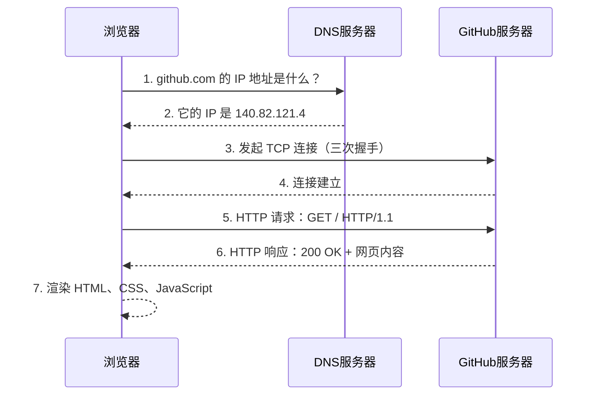
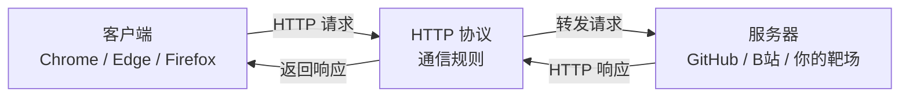

# 06-1. Web 通识扫盲课

**定位**：零基础入门，为 Flask Web 开发和安全工具铺垫

**核心目标**：读者学完后能理解“输入网址按下回车后发生了什么”，能看懂网页源码，知道前端和后端的区别。

---

## 目录

- [06-1. Web 通识扫盲课](#06-1-web-通识扫盲课)
  - [目录](#目录)
  - [第一章：Web 是什么？](#第一章web-是什么)
    - [1.1 Web 的诞生：从一份论文到改变世界](#11-web-的诞生从一份论文到改变世界)
    - [1.2 Web 的“三国时代”：浏览器大战](#12-web-的三国时代浏览器大战)
    - [1.3 你每天都在用 Web，但你知道它是什么吗？](#13-你每天都在用-web但你知道它是什么吗)
    - [1.4 前端和后端有什么区别？](#14-前端和后端有什么区别)
  - [第二章：HTML——网页的骨架](#第二章html网页的骨架)
    - [2.1 HTML 是什么？](#21-html-是什么)
    - [2.2 HTML 的基本结构](#22-html-的基本结构)
    - [2.3 HTML 表单——用户输入的第一道门](#23-html-表单用户输入的第一道门)
  - [第三章：CSS——网页的皮肤](#第三章css网页的皮肤)
    - [3.1 CSS 是什么？](#31-css-是什么)
    - [3.2 CSS 的基本语法](#32-css-的基本语法)
    - [3.3 CSS 和 HTML 的关系](#33-css-和-html-的关系)
  - [第四章：JavaScript——网页的大脑](#第四章javascript网页的大脑)
    - [4.1 JavaScript 是什么？](#41-javascript-是什么)
    - [4.2 JavaScript 的基本语法](#42-javascript-的基本语法)
    - [4.3 JavaScript 被恶意利用：XSS 的原理](#43-javascript-被恶意利用xss-的原理)
  - [第五章：HTTP 协议——Web 的语言](#第五章http-协议web-的语言)
    - [5.1 HTTP 是什么？](#51-http-是什么)
    - [5.2 常见的 HTTP 方法](#52-常见的-http-方法)
    - [5.3 常见的 HTTP 状态码](#53-常见的-http-状态码)
    - [5.4 Cookie 和 Session](#54-cookie-和-session)
  - [第六章：用开发者工具透视网页——你的第一把“透视眼”](#第六章用开发者工具透视网页你的第一把透视眼)
    - [6.1 从 HTML 到像素——浏览器做了什么？](#61-从-html-到像素浏览器做了什么)
    - [6.2 浏览器的开发者工具——你的第一把“透视眼”](#62-浏览器的开发者工具你的第一把透视眼)
  - [第七章：总结与展望](#第七章总结与展望)
    - [7.1 你学会了什么？](#71-你学会了什么)
    - [7.2 这些知识在渗透测试中怎么用？](#72-这些知识在渗透测试中怎么用)
    - [7.3 下一步学什么？](#73-下一步学什么)

---

## 第一章：Web 是什么？

*Kate 在 05 的第四章用 Wireshark 亲手抓过 HTTP 请求和响应，在 05 的第二章用 Burp Suite 改过包、重放过请求。但她今天问了一个很根本的问题：*

> *“我每天都在用浏览器看网页——输入网址、按回车、页面出来了。我知道背后有 HTTP、有 HTML、有服务器。但 Web 这个东西到底是怎么来的？谁发明的？为什么叫‘Web’？”*

*“这个问题问到了 Web 的老祖宗。故事要从 1989 年的一份论文提案讲起。”*  

---

### 1.1 Web 的诞生：从一份论文到改变世界

1989 年，一个叫 **Tim Berners-Lee** 的英国软件工程师在欧洲核子研究中心（CERN）工作。CERN 是世界上最大的粒子物理实验室——来自几十个国家的上万名科学家在这里合作研究。但 Berners-Lee 发现了一个极其恼人的问题：**每个人的文档都在自己的电脑上，不同电脑上的文档互相看不到。**

你想看同事的研究报告，得先知道他的电脑名、登录他的系统、找到文件路径、用对应的软件打开。每换一台电脑、每换一种文件格式，这套流程就要重新来一遍。科学家把大量时间浪费在了“找文件”上，而不是“做研究”。

Berners-Lee 想了一个方案：**能不能让所有文档互相链接？** 就像学术论文里的脚注——你读到一段引文，脚注告诉你出处，你翻到那一页就能看到原文。如果把这种“脚注”搬到电脑上——你点击文档里的一个链接，它直接跳转到另一个文档，不需要知道那个文档在哪台电脑上——信息就真正连成了一张网。

1989 年 3 月，Berners-Lee 写了一份提案，标题很朴素：《信息管理：一个提案》（*Information Management: A Proposal*）。他的老板在提案封面写了一句话作为批复：“模糊但令人兴奋。”（*Vague but exciting.*）就这一句话，他拿到了继续开发的许可。

1990 年，Berners-Lee 发明了三样东西，定义了 Web 的基石：

- **HTML**（HyperText Markup Language）：用来写网页的标记语言。它让你在文档里嵌入链接——点击一段文字，跳转到另一个文档。你在 01 学的 Markdown，本质上就是 HTML 的简化版——Markdown 用 `#` 表示标题，HTML 用 `<h1>` 表示标题。
- **URI**（Uniform Resource Identifier，后来叫 URL）：给每个网页一个唯一地址。就像每家每户都有一个门牌号，每个网页也有一个独一无二的地址——`http://info.cern.ch`。你在 05-01 第四章学的 IP 地址和 DNS，就是用来解析这些 URL 的。
- **HTTP**（HyperText Transfer Protocol）：浏览器和服务器之间传输网页的协议。你在 05-01 第四章学的 HTTP 请求和响应、GET 和 POST、200 OK 和 404 Not Found——全都是 Berners-Lee 在 1990 年定义的这套规则。

1991 年，世界上第一个网站上线：[http://info.cern.ch](http://info.cern.ch)。这个网站现在还活着，你可以在浏览器里打开它——它只包含文字和链接，没有图片、没有动画、没有交互。但它实现了一件以前从未有过的事：**你在一台电脑上点击一个链接，看到了另一台电脑上的文档。**

Web 这个名字是怎么来的？Berners-Lee 的原意是：**World Wide Web——一张覆盖全球的蜘蛛网。** 每个网页是一个节点，链接是连接节点的丝线。你点击链接，就像蜘蛛在网上爬行——从一个节点跳到另一个节点，从一台电脑跳到另一台电脑。整个互联网就是一张巨大的、由链接编织而成的网。

> *Kate 在浏览器里打开了 [http://info.cern.ch](http://info.cern.ch)，看到了那个只有文字和链接的黑白页面。她说：“这就是世界上第一个网站？它连一张图片都没有——但它是所有网页的祖宗。我今天打开的 GitHub、知乎、B 站，底层都是这三样东西。”*
>
> “对。而且你以后学的所有 Web 渗透测试技术——SQL 注入、XSS、CSRF、文件上传——全都是利用了这三样东西的某些特性。你不理解 HTML、URL、HTTP，你就理解不了为什么一段 `<script>` 标签能让浏览器弹窗，为什么在 URL 后面加一个单引号能让数据库报错。”

---

### 1.2 Web 的“三国时代”：浏览器大战

Berners-Lee 发明了 Web，但 Web 要走进千家万户，需要一件东西——**浏览器**。没有浏览器，你看到的就是一堆 HTML 源码，而不是一个渲染好的网页。

世界上第一个浏览器是 Berners-Lee 自己写的，叫 **WorldWideWeb**（后来改名叫 Nexus）。它既能浏览网页，也能编辑网页——Berners-Lee 的本意是“Web 是双向的，每个人既是读者也是作者”。但这个想法太超前了，后来的浏览器几乎全部砍掉了编辑功能，只保留了浏览。

真正让 Web 火起来的，是 1993 年发布的 **Mosaic** 浏览器。Mosaic 由美国伊利诺伊大学的国家超级计算应用中心（NCSA）开发。它做了三件革命性的事：首次支持在文字中**内嵌显示图片**（在此之前，图片必须在新窗口打开），首次引入了**图形化用户界面**——书签、后退按钮、地址栏，普通人不需要学命令行就能用。而且它是**免费的**，任何人都可以下载使用。

Mosaic 一发布就炸了。1993 年初，全球只有不到 100 个网站。1993 年底 Mosaic 发布后，网站数量开始指数级增长。**普通人才知道——原来互联网可以看图片，可以点链接跳来跳去，而且不用学任何技术。** Mosaic 把 Web 从“科学家和极客的玩具”变成了“所有人都能用的工具”。

Mosaic 的核心开发者 **Marc Andreessen** 后来离开 NCSA，创办了 **Netscape** 公司，发布了 **Netscape Navigator** 浏览器。Netscape 继承了 Mosaic 的所有优点，加了更多功能——JavaScript（让网页能动起来）、Cookie（让网站记住你是谁）、SSL 加密（让网上购物成为可能）。到 1995 年，Netscape 占据了超过 80% 的浏览器市场份额。

这时候，微软坐不住了。比尔·盖茨在 1995 年发了一份内部备忘录，标题叫《互联网浪潮》（*The Internet Tidal Wave*）。他在备忘录里写道：“互联网是自 IBM PC 以来最重要的技术变革。”然后微软做了三件事：从 Spyglass 公司购买了 Mosaic 的源代码（是的，Mosaic 的代码被卖给了微软），开发了自己的浏览器 **Internet Explorer（IE）**，把 IE 捆绑在 Windows 操作系统中**免费赠送**。

这就是著名的**第一次浏览器大战**（Browser Wars I）。Netscape 收费（个人用户免费，企业收费），微软全免费。Netscape 要自己开发所有功能，微软可以直接利用 Windows 的底层接口。Netscape 是一个独立的浏览器，IE 是 Windows 的一部分——你买一台 Windows 电脑，IE 已经在桌面上了。Netscape 没有任何优势。

到 1998 年，IE 的市场份额超过 90%。Netscape 被打败了，1999 年被 AOL 收购。但 Netscape 在倒下之前做了一件事：**把浏览器内核的源代码全部公开。** 这个开源项目叫 **Mozilla**——它后来演变成了 **Firefox** 浏览器。Netscape 虽然死了，但它的代码活了下来。

微软在打败 Netscape 之后，把 IE 团队裁撤到只剩几个人，浏览器功能几乎停止更新。IE 6 在 2001 年发布后，整整五年没有大版本更新。而 Web 技术在飞速发展——新的 HTML 标签、新的 CSS 属性、新的 JavaScript API。IE 6 对这些新特性的支持极其糟糕，全球的 Web 开发者每天都在咒骂微软。这段时期被开发者称为“IE 6 的黑暗时代”。

2004 年，Mozilla 发布了 **Firefox**——它是 Netscape 开源代码的后代，但完全重写了渲染引擎。Firefox 快速、安全、支持最新的 Web 标准，一夜之间席卷全球。2008 年，Google 发布了 **Chrome**——它更简洁、更快，每个标签页独立运行，一个标签页崩溃不会影响其他标签页。Chrome 还首次引入了 **V8 JavaScript 引擎**，让 JavaScript 的执行速度比以前快了好几倍。Web 从“展示文档的工具”变成了“运行应用的平台”——你在线编辑的 Google 文档、你玩的网页游戏、你用的 Figma 设计工具，全是 Chrome 强大的 JavaScript 引擎撑起来的。

到 2012 年，Chrome 的市场份额超过 IE。微软宣布 IE 退役，换成全新的 **Edge** 浏览器。2020 年，微软干脆放弃了自己的浏览器内核，Edge 改用 Chrome 的内核。**当年的浏览器大战，赢家不是微软，也不是 Netscape——是 Chrome。**

> *Kate 说：“所以 Netscape 打输了，但它开源了代码，后来变成了 Firefox。微软的 IE 打赢了，但后来又被 Chrome 打输，连自己的内核都放弃了。Chrome 赢了，靠的是更快、更安全、更支持 Web 标准。”*
>
> “对。浏览器大战不是一场‘谁更狠’的战争，是‘谁更开放、谁更符合标准’的战争。Netscape 失败了，但它的开源精神活了下来。IE 打赢了战争，但它在技术上的落后让它最终死掉了。Chrome 赢在它一直在追赶 Web 标准的脚步——你以后写 HTML、CSS、JavaScript 的时候，Chrome 能按照标准把你的代码渲染出来。”

**为什么学安全要了解浏览器大战？**

你在 05 学过的很多攻击技术，都和浏览器的发展历史直接相关。XSS 攻击能在 JavaScript 出现之后才成为一种普遍的威胁——没有 JavaScript，就没有人能劫持网页逻辑。Cookie 被 Netscape 发明用来维持登录状态，它后来成为所有 Web 应用认证的基础，也成为 XSS 攻击最想窃取的目标。SSL/TLS 加密最早是为了保护电子商务交易，它后来发展成了 HTTPS——你在 05 第四章学的 HTTP 明文传输的弱点，就是 HTTPS 试图解决的问题。IE 6 的兼容性问题导致很多遗留漏洞——你以后在内网渗透中还会遇到还在运行 IE 6 的老旧系统，它们无法修复现代安全补丁。

**你不需要记住这场战争的全部细节。你只需要知道一件事：你今天用的 Chrome、Firefox、Edge，以及你在 05 学过的 XSS、Cookie、HTTPS——所有这些，全都是这三十年浏览器战争的直接遗产。**

> *Kate 说：“所以 Netscape 虽然死了，但它留下的 JavaScript、Cookie、SSL——这些东西我今天还在用。我在 05 第二章弹的那个 XSS 弹窗，用的是 JavaScript。我在 05 第四章抓的 HTTP 请求，底层用的是 HTTP 和 SSL。我以为我在学安全——原来我在学三十年战争留下来的遗产。”*

---

### 1.3 你每天都在用 Web，但你知道它是什么吗？

*Kate 在上一节听完了浏览器大战的历史，靠在椅背上想了一会儿，然后说：*

> *“我每天打开浏览器、输入网址、按回车——网页就出来了。但仔细一想，我好像根本不知道这个过程中发生了什么。‘浏览器’是什么？‘服务器’在哪？我输入的‘网址’到底是什么东西？”*  

*“这个问题就是这一节要回答的。你每天用的 Web，其实只有三个角色在互相配合。你把这三个角色搞清楚，Web 的基本原理你就全懂了。”*  

---

**Web 的三大角色**  

你在浏览器里看到一个网页，背后其实是三个“角色”在协同工作：

| 角色 | 是什么 | 你每天在用的例子 | 它在 Web 中的职责 |
| :--- | :--- | :--- | :--- |
| **客户端** | 你用来上网的软件 | Chrome、Edge、Firefox、Safari | 发起请求，渲染网页给你看 |
| **服务器** | 存放网页的远程电脑 | GitHub 的服务器、B 站的服务器 | 接收请求，返回网页数据 |
| **HTTP 协议** | 客户端和服务器之间的“通信语言” | 你在 05 第四章学过的 HTTP | 规定请求和响应的格式 |

这三个角色的关系可以用一句话总结：**客户端通过 HTTP 协议向服务器发起请求，服务器通过 HTTP 协议返回响应。**

*“客户端”* 这个名字听起来很高端，但它的意思很简单：**你是客户，浏览器替你跑腿。** 你想看 GitHub 上的某个仓库，你不需要自己跑到 GitHub 的服务器机房去敲门——你只需要在浏览器的地址栏里输入网址，浏览器会替你发请求、收响应、把网页渲染在屏幕上。浏览器是你的“代理人”。

*“服务器”* 是一台远在千里之外的电脑。它和你的个人电脑没有本质区别——也有 CPU、内存、硬盘、操作系统。区别在于它安装的是服务器软件（而不是你用的 Windows 桌面），而且它永远不关机。你凌晨三点想访问 GitHub，GitHub 的服务器必须还在运行——它不能和你一样到点睡觉。

*“HTTP 协议”* 是客户端和服务器之间的通信语言。你在 05 第四章已经学过 HTTP 的请求和响应格式——请求行、请求头、请求体、状态码。客户端和服务器必须说同一种语言，否则它们无法理解对方在说什么。

> *Kate 说：“所以 Web 就是一个‘传话游戏’。我是客户，浏览器替我传话。服务器在另一头听着，收到我的请求之后，把网页数据传回来。HTTP 就是我们之间的传话规则——每一句话的格式都是规定好的。”*

---

**一个完整的网页请求流程**  

你输入 `https://github.com`，按下回车。在这个瞬间，你的浏览器做了以下五件事：

**第一步：DNS 解析——把名字翻译成门牌号**  

你输入的是 `github.com`，但服务器只认识 IP 地址。浏览器做的第一件事，就是把域名翻译成 IP 地址。这一步叫 DNS 解析，你在 05 第四章已经详细学过 DNS 的查询流程——浏览器先查自己的缓存，再查操作系统缓存，再问 DNS 服务器，最终拿到 `140.82.121.4` 这个 IP 地址。

**第二步：TCP 连接——双方确认可以通话**  

浏览器拿到 IP 地址后，向 GitHub 服务器发起 TCP 连接。这一步就是你在 05 第四章学过的 TCP 三次握手——客户端发 SYN，服务器回 SYN+ACK，客户端再回 ACK。三次握手完成后，双方确认可以开始传输数据。

**第三步：HTTP 请求——浏览器说“我要这个页面”**  

TCP 连接建立后，浏览器发出 HTTP 请求。这个请求是明文的（如果用的是 HTTP）或者加密的（如果用的是 HTTPS）。它的大致内容是：`GET / HTTP/1.1`，表示“我要获取这个网站的首页”。请求里还附带了一些额外的信息——你用的浏览器类型、你能接收的文件格式、你之前是否登录过（Cookie）。

**第四步：HTTP 响应——服务器返回网页内容**  

GitHub 服务器收到请求后，找到首页对应的文件，把它打包进 HTTP 响应里返回给浏览器。响应的第一行是状态码——`HTTP/1.1 200 OK`，表示“请求成功”。响应头里包含了网页内容类型（`text/html`）和长度。响应体里就是你要看的网页内容——HTML 代码。

**第五步：浏览器渲染——把代码变成你看到的网页**  

浏览器收到 HTML 代码后，开始解析它——构建 DOM 树、加载 CSS、执行 JavaScript。最终，一堆 `
`、`
`、`<a>` 标签被渲染成了你看到的那个漂亮的 GitHub 首页。这个过程你在 6.1 节会深入理解。

> *Kate 说：“所以我在地址栏输入 `github.com`，按下回车——这背后是 DNS 查 IP、TCP 三次握手、HTTP 请求和响应、浏览器渲染。我以为是一瞬间的事，其实是有五个步骤在排队执行。”*
>
> “对。而且你在 05 已经亲手验证过其中的好几个步骤——用 Wireshark 抓过 DNS 查询、看过 TCP 三次握手的 SYN 和 ACK 包、分析过 HTTP 请求的 GET 和 200 OK。现在你把它们串起来了。”

---

**浏览器、服务器、HTTP 的关系：一张图总结**  

> *Kate 看着这张图，说：“所以我就是客户端，浏览器是我的代理。HTTP 是传话规则，服务器是传话对象。三样东西，组成了整个 Web 世界。”*

---

### 1.4 前端和后端有什么区别？

- 前端：你在浏览器里看到的一切——按钮、输入框、动画、颜色
- 后端：在服务器上运行的程序——处理登录、存取数据库、返回数据
- 前后端如何通过 HTTP 通信：请求和响应
- 为什么学安全要理解前后端？因为前端有 XSS 和 CSRF，后端有 SQL 注入和文件上传——漏洞藏在每一层里

---

## 第二章：HTML——网页的骨架

### 2.1 HTML 是什么？

- HTML 不是编程语言——它是标记语言，用来描述网页的结构
- 你在 01 学的 Markdown 本质上也是标记语言——Markdown 用 `#` 表示标题，HTML 用 `<h1>` 表示标题
- Markdown 和 HTML 的关系：Markdown 的底层就是 HTML

### 2.2 HTML 的基本结构

- `<!DOCTYPE html>`、`<html>`、`<head>`、`<body>`——每个网页都从这些标签开始
- 常用标签：标题（`<h1>`~`<h6>`）、段落（`
`）、链接（`<a>`）、图片（``）、列表（`<ul>`、`<ol>`、`<li>`）
- 亲手写一个最简单的网页，在浏览器里打开

### 2.3 HTML 表单——用户输入的第一道门

- `<form>`、`<input>`、`<button>`——用户输入数据的方式
- GET 请求和 POST 请求的区别：数据放在 URL 里 vs 放在请求体里
- 你在 05 第一章学的 SQL 注入、XSS，全都是通过表单输入攻击的——表单就是你以后挖漏洞的入口

---

## 第三章：CSS——网页的皮肤

### 3.1 CSS 是什么？

- CSS 让网页从“白纸黑字”变成“有颜色、有布局、有动画”
- CSS 写在 HTML 的什么位置？内联、内部、外部——三种方式

### 3.2 CSS 的基本语法

- 选择器、属性、值——CSS 的核心三要素
- 常用属性：颜色（`color`）、背景（`background`）、字体大小（`font-size`）、间距（`margin`、`padding`）
- 亲手写一段 CSS，让刚才的网页变好看

### 3.3 CSS 和 HTML 的关系

- HTML 定义“有什么”（骨架），CSS 定义“长什么样”（皮肤）
- 为什么要分开？因为你可以给同一个 HTML 换不同的 CSS，网页就完全换了一张脸

---

## 第四章：JavaScript——网页的大脑

### 4.1 JavaScript 是什么？

- JavaScript 让网页“动起来”——点击按钮弹出提示、输入框实时验证、页面不刷新就能加载新内容
- JavaScript 运行在浏览器里，不是服务器上

### 4.2 JavaScript 的基本语法

- 变量、函数、事件——三个概念就能写出能用的代码
- 亲手写一段 JS：点击按钮，弹出一个“守夜者，我在。”的弹窗
- 这个弹窗你在 05 第二章亲手验证 XSS 时弹过——现在你知道它是怎么弹出来的了

### 4.3 JavaScript 被恶意利用：XSS 的原理

- 你在 05 学的 XSS，本质上就是“让别人的浏览器执行我写的 JavaScript”
- 理解了 JS，你就理解了 XSS 为什么能偷 Cookie、劫持会话、重定向页面

---

## 第五章：HTTP 协议——Web 的语言

### 5.1 HTTP 是什么？

- 你在 05 第四章学过 HTTP——这里用更直观的方式重温
- HTTP 请求的三个部分：请求行、请求头、请求体
- HTTP 响应的三个部分：状态行、响应头、响应体

### 5.2 常见的 HTTP 方法

- GET——请求数据，参数拼在 URL 后面
- POST——提交数据，参数放在请求体里
- 为什么渗透测试中要看请求方法？因为 GET 参数暴露在 URL 里，更容易被篡改

### 5.3 常见的 HTTP 状态码

- 200 OK——正常
- 301/302——重定向
- 403——禁止访问
- 404——找不到
- 500——服务器内部错误
- 你以后扫描目录、爆破接口的时候，就是根据这些状态码判断有没有找到隐藏的入口

### 5.4 Cookie 和 Session

- HTTP 是无状态的——每次请求都是独立的，服务器不知道你是谁
- Cookie 和 Session 让服务器“记住”你——登录一次，下次不用重新输密码
- XSS 攻击最想偷的是什么？你的 Cookie

---

## 第六章：用开发者工具透视网页——你的第一把“透视眼”

### 6.1 从 HTML 到像素——浏览器做了什么？

- 浏览器收到 HTML → 解析标签 → 构建 DOM 树 → 加载 CSS → 构建渲染树 → 绘制到屏幕
- 为什么要知道这个过程？因为 XSS 攻击本质上是篡改了 DOM 树——你在网页里插入了一段不该存在的 HTML

### 6.2 浏览器的开发者工具——你的第一把“透视眼”

- 按 F12 打开开发者工具
- Elements 标签——查看和修改网页的 HTML 和 CSS
- Console 标签——执行 JavaScript 代码，查看报错信息
- Network 标签——监控所有网络请求，看到每个请求的 URL、方法、状态码、响应时间
- 你在 05 第四章用 Wireshark 抓包，现在你用 Network 标签抓包——同一个原理，不同的工具

---

## 第七章：总结与展望

### 7.1 你学会了什么？

- 一个网页由 HTML（骨架）、CSS（皮肤）、JavaScript（大脑）三层组成
- 浏览器和服务器通过 HTTP 协议通信——每次请求独立，Cookie 和 Session 维持状态
- 你能用 F12 透视网页的内部结构

### 7.2 这些知识在渗透测试中怎么用？

- HTML 表单 → SQL 注入入口
- JavaScript → XSS 攻击的武器
- Cookie → XSS 攻击的目标
- HTTP 请求 → 抓包分析、Burp Suite 改包重放
- 状态码 → 敏感目录扫描

### 7.3 下一步学什么？

- 06-2《Flask Web 开发》——用 Python 搭建你自己的 Web 应用，你的“自家靶场”
- 06-3《用 Python 写安全工具（基础）》——从爬虫到 GUI，把你的脚本变成工具
- 06-4《用 Python 写安全工具（进阶）》——端口扫描器、弱口令爆破、日志分析脚本
