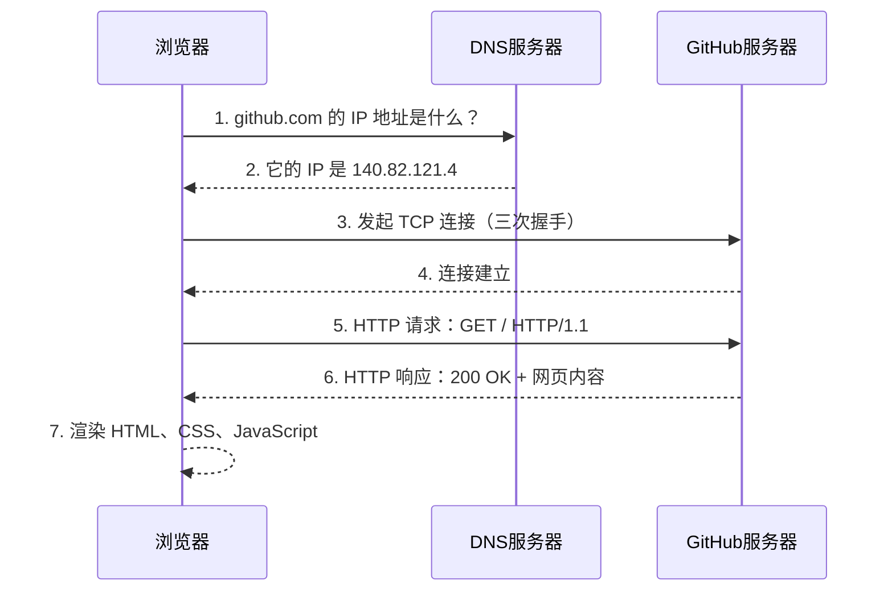
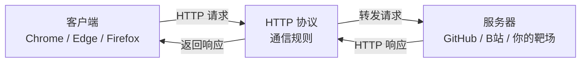

# 06-1. Web 通识扫盲课

**定位**：零基础入门，为 Flask Web 开发和安全工具铺垫

**核心目标**：读者学完后能理解“输入网址按下回车后发生了什么”，能看懂网页源码，知道前端和后端的区别。

---

## 目录

- [06-1. Web 通识扫盲课](#06-1-web-通识扫盲课)
  - [目录](#目录)
  - [第一章：Web 是什么？](#第一章web-是什么)
    - [1.1 Web 的诞生：从一份论文到改变世界](#11-web-的诞生从一份论文到改变世界)
    - [1.2 Web 的“三国时代”：浏览器大战](#12-web-的三国时代浏览器大战)
    - [1.3 你每天都在用 Web，但你知道它是什么吗？](#13-你每天都在用-web但你知道它是什么吗)
    - [1.4 前端和后端有什么区别？](#14-前端和后端有什么区别)
  - [第二章：HTML——网页的骨架](#第二章html网页的骨架)
    - [2.1 HTML 是什么？](#21-html-是什么)
    - [2.2 HTML 的基本结构](#22-html-的基本结构)
    - [2.3 HTML 表单——用户输入的第一道门](#23-html-表单用户输入的第一道门)
  - [第三章：CSS——网页的皮肤](#第三章css网页的皮肤)
    - [3.1 CSS 是什么？](#31-css-是什么)
    - [3.2 CSS 的基本语法](#32-css-的基本语法)
    - [3.3 CSS 和 HTML 的关系](#33-css-和-html-的关系)
  - [第四章：JavaScript——网页的大脑](#第四章javascript网页的大脑)
    - [4.1 JavaScript 是什么？](#41-javascript-是什么)
    - [4.2 JavaScript 的基本语法](#42-javascript-的基本语法)
      - [4.2.2 JavaScript 的三种核心概念：变量、函数、事件](#422-javascript-的三种核心概念变量函数事件)
    - [4.3 JavaScript 被恶意利用：XSS 的原理](#43-javascript-被恶意利用xss-的原理)
  - [第五章：HTTP 协议——Web 的语言](#第五章http-协议web-的语言)
    - [5.1 HTTP 是什么？](#51-http-是什么)
    - [5.2 常见的 HTTP 方法](#52-常见的-http-方法)
    - [5.3 常见的 HTTP 状态码](#53-常见的-http-状态码)
    - [5.4 Cookie 和 Session](#54-cookie-和-session)
  - [第六章：用开发者工具透视网页——你的第一把“透视眼”](#第六章用开发者工具透视网页你的第一把透视眼)
    - [6.1 从 HTML 到像素——浏览器做了什么？](#61-从-html-到像素浏览器做了什么)
    - [6.2 浏览器的开发者工具——你的第一把“透视眼”](#62-浏览器的开发者工具你的第一把透视眼)
  - [第七章：总结与展望](#第七章总结与展望)
    - [7.1 你学会了什么？](#71-你学会了什么)
    - [7.2 这些知识在渗透测试中怎么用？](#72-这些知识在渗透测试中怎么用)
    - [7.3 下一步学什么？](#73-下一步学什么)

---

## 第一章：Web 是什么？

*Kate 在 05 的第四章用 Wireshark 亲手抓过 HTTP 请求和响应，在 05 的第二章用 Burp Suite 改过包、重放过请求。但她今天问了一个很根本的问题：*

> *“我每天都在用浏览器看网页——输入网址、按回车、页面出来了。我知道背后有 HTTP、有 HTML、有服务器。但 Web 这个东西到底是怎么来的？谁发明的？为什么叫‘Web’？”*

*“这个问题问到了 Web 的老祖宗。故事要从 1989 年的一份论文提案讲起。”*  

---

### 1.1 Web 的诞生：从一份论文到改变世界

1989 年，一个叫 **Tim Berners-Lee** 的英国软件工程师在欧洲核子研究中心（*CERN*）工作。CERN 是世界上最大的粒子物理实验室——来自几十个国家的上万名科学家在这里合作研究。但 Berners-Lee 发现了一个极其恼人的问题：**每个人的文档都在自己的电脑上，不同电脑上的文档互相看不到。**

你想看同事的研究报告，得先知道他的电脑名、登录他的系统、找到文件路径、用对应的软件打开。每换一台电脑、每换一种文件格式，这套流程就要重新来一遍。科学家把大量时间浪费在了“找文件”上，而不是“做研究”。

Berners-Lee 想了一个方案：**能不能让所有文档互相链接？** 就像学术论文里的脚注——你读到一段引文，脚注告诉你出处，你翻到那一页就能看到原文。如果把这种“脚注”搬到电脑上——你点击文档里的一个链接，它直接跳转到另一个文档，不需要知道那个文档在哪台电脑上——信息就真正连成了一张网。

1989 年 3 月，Berners-Lee 写了一份提案，标题很朴素：《信息管理：一个提案》（*Information Management: A Proposal*）。他的老板在提案封面写了一句话作为批复：“模糊但令人兴奋。”（*Vague but exciting.*）就这一句话，他拿到了继续开发的许可。


1990 年，Berners-Lee 发明了三样东西，定义了 Web 的基石：

- **HTML**（HyperText Markup Language）：用来写网页的标记语言。它让你在文档里嵌入链接——点击一段文字，跳转到另一个文档。你在 01 学的 Markdown，本质上就是 HTML 的简化版——Markdown 用 `#` 表示标题，HTML 用 `<h1>` 表示标题。
- **URI**（Uniform Resource Identifier，后来叫 URL）：给每个网页一个唯一地址。就像每家每户都有一个门牌号，每个网页也有一个独一无二的地址——`http://info.cern.ch`。你在 05-01 第四章学的 IP 地址和 DNS，就是用来解析这些 URL 的。
- **HTTP**（HyperText Transfer Protocol）：浏览器和服务器之间传输网页的协议。你在 05-01 第四章学的 HTTP 请求和响应、GET 和 POST、200 OK 和 404 Not Found——全都是 Berners-Lee 在 1990 年定义的这套规则。

1991 年，世界上第一个网站上线：[http://info.cern.ch](http://info.cern.ch)。这个网站现在还活着，你可以在浏览器里打开它——它只包含文字和链接，没有图片、没有动画、没有交互。但它实现了一件以前从未有过的事：**你在一台电脑上点击一个链接，看到了另一台电脑上的文档。**


Web 这个名字是怎么来的？Berners-Lee 的原意是：**World Wide Web——一张覆盖全球的蜘蛛网。** 每个网页是一个节点，链接是连接节点的丝线。你点击链接，就像蜘蛛在网上爬行——从一个节点跳到另一个节点，从一台电脑跳到另一台电脑。整个互联网就是一张巨大的、由链接编织而成的网。

> *Kate 在浏览器里打开了 [http://info.cern.ch](http://info.cern.ch)，看到了那个只有文字和链接的黑白页面。她说：“这就是世界上第一个网站？它连一张图片都没有——但它是所有网页的祖宗。我今天打开的 GitHub、知乎、B 站，底层都是这三样东西。”*
>
> “对。而且你以后学的所有 Web 渗透测试技术——SQL 注入、XSS、CSRF、文件上传——全都是利用了这三样东西的某些特性。你不理解 HTML、URL、HTTP，你就理解不了为什么一段 `<script>` 标签能让浏览器弹窗，为什么在 URL 后面加一个单引号能让数据库报错。”

---

### 1.2 Web 的“三国时代”：浏览器大战

Berners-Lee 发明了 Web，但 Web 要走进千家万户，需要一件东西——**浏览器**。没有浏览器，你看到的就是一堆 HTML 源码，而不是一个渲染好的网页。

世界上第一个浏览器是 Berners-Lee 自己写的，叫 **WorldWideWeb**（后来改名叫 Nexus）。它既能浏览网页，也能编辑网页——Berners-Lee 的本意是“Web 是双向的，每个人既是读者也是作者”。但这个想法太超前了，后来的浏览器几乎全部砍掉了编辑功能，只保留了浏览。

真正让 Web 火起来的，是 1993 年发布的 **Mosaic** 浏览器。Mosaic 由美国伊利诺伊大学的国家超级计算应用中心（NCSA）开发。它做了三件革命性的事：首次支持在文字中**内嵌显示图片**（在此之前，图片必须在新窗口打开），首次引入了**图形化用户界面**——书签、后退按钮、地址栏，普通人不需要学命令行就能用。而且它是**免费的**，任何人都可以下载使用。


Mosaic 一发布就炸了。1993 年初，全球只有不到 100 个网站。1993 年底 Mosaic 发布后，网站数量开始指数级增长。**普通人才知道——原来互联网可以看图片，可以点链接跳来跳去，而且不用学任何技术。** Mosaic 把 Web 从“科学家和极客的玩具”变成了“所有人都能用的工具”。

Mosaic 的核心开发者 **Marc Andreessen** 后来离开 NCSA，创办了 **Netscape** 公司，发布了 **Netscape Navigator** 浏览器。Netscape 继承了 Mosaic 的所有优点，加了更多功能——JavaScript（让网页能动起来）、Cookie（让网站记住你是谁）、SSL 加密（让网上购物成为可能）。到 1995 年，Netscape 占据了超过 80% 的浏览器市场份额。


这时候，微软坐不住了。比尔·盖茨在 1995 年发了一份内部备忘录，标题叫《互联网浪潮》（*The Internet Tidal Wave*）。他在备忘录里写道：“互联网是自 IBM PC 以来最重要的技术变革。”然后微软做了三件事：从 Spyglass 公司购买了 Mosaic 的源代码（是的，Mosaic 的代码被卖给了微软），开发了自己的浏览器 **Internet Explorer（IE）**，把 IE 捆绑在 Windows 操作系统中**免费赠送**。

这就是著名的**第一次浏览器大战**（Browser Wars I）。Netscape 收费（个人用户免费，企业收费），微软全免费。Netscape 要自己开发所有功能，微软可以直接利用 Windows 的底层接口。Netscape 是一个独立的浏览器，IE 是 Windows 的一部分——你买一台 Windows 电脑，IE 已经在桌面上了。Netscape 没有任何优势。

到 1998 年，IE 的市场份额超过 90%。Netscape 被打败了，1999 年被 AOL 收购。但 Netscape 在倒下之前做了一件事：**把浏览器内核的源代码全部公开。** 这个开源项目叫 **Mozilla**——它后来演变成了 **Firefox** 浏览器。Netscape 虽然死了，但它的代码活了下来。

微软在打败 Netscape 之后，把 IE 团队裁撤到只剩几个人，浏览器功能几乎停止更新。IE 6 在 2001 年发布后，整整五年没有大版本更新。而 Web 技术在飞速发展——新的 HTML 标签、新的 CSS 属性、新的 JavaScript API。IE 6 对这些新特性的支持极其糟糕，全球的 Web 开发者每天都在咒骂微软。这段时期被开发者称为“IE 6 的黑暗时代”。


2004 年，Mozilla 发布了 **Firefox**——它是 Netscape 开源代码的后代，但完全重写了渲染引擎。Firefox 快速、安全、支持最新的 Web 标准，一夜之间席卷全球。2008 年，Google 发布了 **Chrome**——它更简洁、更快，每个标签页独立运行，一个标签页崩溃不会影响其他标签页。Chrome 还首次引入了 **V8 JavaScript 引擎**，让 JavaScript 的执行速度比以前快了好几倍。Web 从“展示文档的工具”变成了“运行应用的平台”——你在线编辑的 Google 文档、你玩的网页游戏、你用的 Figma 设计工具，全是 Chrome 强大的 JavaScript 引擎撑起来的。

到 2012 年，Chrome 的市场份额超过 IE。微软宣布 IE 退役，换成全新的 **Edge** 浏览器。2020 年，微软干脆放弃了自己的浏览器内核，Edge 改用 Chrome 的内核。**当年的浏览器大战，赢家不是微软，也不是 Netscape——是 Chrome。**

> *Kate 说：“所以 Netscape 打输了，但它开源了代码，后来变成了 Firefox。微软的 IE 打赢了，但后来又被 Chrome 打输，连自己的内核都放弃了。Chrome 赢了，靠的是更快、更安全、更支持 Web 标准。”*
>
> “对。浏览器大战不是一场‘谁更狠’的战争，是‘谁更开放、谁更符合标准’的战争。Netscape 失败了，但它的开源精神活了下来。IE 打赢了战争，但它在技术上的落后让它最终死掉了。Chrome 赢在它一直在追赶 Web 标准的脚步——你以后写 HTML、CSS、JavaScript 的时候，Chrome 能按照标准把你的代码渲染出来。”

**为什么学安全要了解浏览器大战？**

你在 05 学过的很多攻击技术，都和浏览器的发展历史直接相关。XSS 攻击能在 JavaScript 出现之后才成为一种普遍的威胁——没有 JavaScript，就没有人能劫持网页逻辑。Cookie 被 Netscape 发明用来维持登录状态，它后来成为所有 Web 应用认证的基础，也成为 XSS 攻击最想窃取的目标。SSL/TLS 加密最早是为了保护电子商务交易，它后来发展成了 HTTPS——你在 05 第四章学的 HTTP 明文传输的弱点，就是 HTTPS 试图解决的问题。IE 6 的兼容性问题导致很多遗留漏洞——你以后在内网渗透中还会遇到还在运行 IE 6 的老旧系统，它们无法修复现代安全补丁。

**你不需要记住这场战争的全部细节。你只需要知道一件事：你今天用的 Chrome、Firefox、Edge，以及你在 05 学过的 XSS、Cookie、HTTPS——所有这些，全都是这三十年浏览器战争的直接遗产。**

> *Kate 说：“所以 Netscape 虽然死了，但它留下的 JavaScript、Cookie、SSL——这些东西我今天还在用。我在 05 第二章弹的那个 XSS 弹窗，用的是 JavaScript。我在 05 第四章抓的 HTTP 请求，底层用的是 HTTP 和 SSL。我以为我在学安全——原来我在学三十年战争留下来的遗产。”*

---

### 1.3 你每天都在用 Web，但你知道它是什么吗？

*Kate 在上一节听完了浏览器大战的历史，靠在椅背上想了一会儿，然后说：*

> *“我每天打开浏览器、输入网址、按回车——网页就出来了。但仔细一想，我好像根本不知道这个过程中发生了什么。‘浏览器’是什么？‘服务器’在哪？我输入的‘网址’到底是什么东西？”*  

*“这个问题就是这一节要回答的。你每天用的 Web，其实只有三个角色在互相配合。你把这三个角色搞清楚，Web 的基本原理你就全懂了。”*  

---

**Web 的三大角色**  

你在浏览器里看到一个网页，背后其实是三个“角色”在协同工作：

| 角色 | 是什么 | 你每天在用的例子 | 它在 Web 中的职责 |
| :--- | :--- | :--- | :--- |
| **客户端** | 你用来上网的软件 | Chrome、Edge、Firefox、Safari | 发起请求，渲染网页给你看 |
| **服务器** | 存放网页的远程电脑 | GitHub 的服务器、B 站的服务器 | 接收请求，返回网页数据 |
| **HTTP 协议** | 客户端和服务器之间的“通信语言” | 你在 05 第四章学过的 HTTP | 规定请求和响应的格式 |

这三个角色的关系可以用一句话总结：**客户端通过 HTTP 协议向服务器发起请求，服务器通过 HTTP 协议返回响应。**

*“客户端”* 这个名字听起来很高端，但它的意思很简单：**你是客户，浏览器替你跑腿。** 你想看 GitHub 上的某个仓库，你不需要自己跑到 GitHub 的服务器机房去敲门——你只需要在浏览器的地址栏里输入网址，浏览器会替你发请求、收响应、把网页渲染在屏幕上。浏览器是你的“代理人”。

*“服务器”* 是一台远在千里之外的电脑。它和你的个人电脑没有本质区别——也有 CPU、内存、硬盘、操作系统。区别在于它安装的是服务器软件（而不是你用的 Windows 桌面），而且它永远不关机。你凌晨三点想访问 GitHub，GitHub 的服务器必须还在运行——它不能和你一样到点睡觉。

*“HTTP 协议”* 是客户端和服务器之间的通信语言。你在 05 第四章已经学过 HTTP 的请求和响应格式——请求行、请求头、请求体、状态码。客户端和服务器必须说同一种语言，否则它们无法理解对方在说什么。

> *Kate 说：“所以 Web 就是一个‘传话游戏’。我是客户，浏览器替我传话。服务器在另一头听着，收到我的请求之后，把网页数据传回来。HTTP 就是我们之间的传话规则——每一句话的格式都是规定好的。”*

---

**一个完整的网页请求流程**  

你输入 `https://github.com`，按下回车。在这个瞬间，你的浏览器做了以下五件事：



**第一步：DNS 解析——把名字翻译成门牌号**  

你输入的是 `github.com`，但服务器只认识 IP 地址。浏览器做的第一件事，就是把域名翻译成 IP 地址。这一步叫 DNS 解析，你在 05 第四章已经详细学过 DNS 的查询流程——浏览器先查自己的缓存，再查操作系统缓存，再问 DNS 服务器，最终拿到 `140.82.121.4` 这个 IP 地址。

**第二步：TCP 连接——双方确认可以通话**  

浏览器拿到 IP 地址后，向 GitHub 服务器发起 TCP 连接。这一步就是你在 05 学过的 TCP 三次握手——客户端发 SYN，服务器回 SYN+ACK，客户端再回 ACK。三次握手完成后，双方确认可以开始传输数据。

**第三步：HTTP 请求——浏览器说“我要这个页面”**  

TCP 连接建立后，浏览器发出 HTTP 请求。这个请求是明文的（如果用的是 HTTP）或者加密的（如果用的是 HTTPS）。它的大致内容是：`GET / HTTP/1.1`，表示“我要获取这个网站的首页”。请求里还附带了一些额外的信息——你用的浏览器类型、你能接收的文件格式、你之前是否登录过（Cookie）。

**第四步：HTTP 响应——服务器返回网页内容**  

GitHub 服务器收到请求后，找到首页对应的文件，把它打包进 HTTP 响应里返回给浏览器。响应的第一行是状态码——`HTTP/1.1 200 OK`，表示“请求成功”。响应头里包含了网页内容类型（`text/html`）和长度。响应体里就是你要看的网页内容——HTML 代码。

**第五步：浏览器渲染——把代码变成你看到的网页**  

浏览器收到 HTML 代码后，开始解析它——构建 DOM 树、加载 CSS、执行 JavaScript。最终，一堆 `<div>`、`<p>`、`<a>` 标签被渲染成了你看到的那个漂亮的 GitHub 首页。这个过程你在 6.1 节会深入理解。

> *Kate 说：“所以我在地址栏输入 `github.com`，按下回车——这背后是 DNS 查 IP、TCP 三次握手、HTTP 请求和响应、浏览器渲染。我以为是一瞬间的事，其实是有五个步骤在排队执行。”*
>
> “对。而且你在 05 已经亲手验证过其中的好几个步骤——用 Wireshark 抓过 DNS 查询、看过 TCP 三次握手的 SYN 和 ACK 包、分析过 HTTP 请求的 GET 和 200 OK。现在你把它们串起来了。”

---

**浏览器、服务器、HTTP 的关系：一张图总结**  



> *Kate 看着这张图，说：“所以我就是客户端，浏览器是我的代理。HTTP 是传话规则，服务器是传话对象。三样东西，组成了整个 Web 世界。”*

---

### 1.4 前端和后端有什么区别？

- **前端：** 你在浏览器里看到的一切——按钮、输入框、动画、颜色
- **后端：** 在服务器上运行的程序——处理登录、存取数据库、返回数据
- 前后端如何通过 HTTP 通信：请求和响应
- 为什么学安全要理解前后端？因为前端有 XSS 和 CSRF，后端有 SQL 注入和文件上传——漏洞藏在每一层里

---

## 第二章：HTML——网页的骨架

*Kate 在第一章看完了 Web 的诞生和浏览器大战。她靠在椅背上，说了一句：*

> *“Web 的历史我懂了。但我还有一个问题——网页本身是用什么写的？我右键点开一个网页，选‘查看源代码’，跳出来一堆尖括号和英文单词——那是什么？”*
>
> *“那就是 HTML。你今天看到的所有网页——GitHub、B 站、知乎——全都是用它写的。它不是编程语言，但它是整个 Web 的骨架。”*  

---

### 2.1 HTML 是什么？

HTML 的全称是 **HyperText Markup Language**——超文本标记语言。这个名字拆开来看，每个词都有含义：

- **HyperText**（超文本）：不只是普通文字——文字里可以嵌入链接，点击链接就能跳到另一个页面。你在 1.1 节学过，这是 Tim Berners-Lee 发明 Web 时最核心的想法。没有超文本，Web 就不叫 Web——它只是一堆孤立的文档，彼此没有联系
- **Markup**（标记）：你在文字外面套一层“标签”，告诉浏览器这段文字应该怎么显示。`<h1>` 是“这是一级标题”，`<p>` 是“这是一个段落”，`<a>` 是“这是一个链接”
- **Language**（语言）：HTML 是一套语法规则——哪些标签是合法的、标签之间怎么嵌套、属性怎么写。浏览器按照这套规则解析 HTML，把它渲染成你看到的网页

**HTML 不是编程语言。**

编程语言（比如你以后要学的 Python）有变量、有循环、有逻辑判断——它们能“计算”。标记语言只有标签——它们只能“描述”。HTML 不能算 1+1，不能判断“如果用户没登录就跳转到登录页”，不能从数据库里读取数据。它只做一件事：**描述网页的结构**。这一段是标题，那一段是段落，这个字要加粗，那个字是链接。

> *Kate 说：“所以 HTML 就像建筑工地的脚手架——它决定了网页的结构，哪里是标题、哪里是段落、哪里是图片。它不负责好看（那是 CSS 的事），也不负责交互（那是 JavaScript 的事）。它只管结构。”*
>
> “精准。而且这个脚手架，你在学 Markdown 的时候已经见过一个简化版了。”

**HTML 和 Markdown 的关系**  

你在 01 学的 Markdown，本质上就是 HTML 的简化版。Markdown 用 `#` 表示标题，HTML 用 `<h1>` 表示标题。Markdown 用 `**文字**` 表示加粗，HTML 用 `<strong>文字</strong>` 表示加粗。Markdown 用 `-` 表示列表，HTML 用 `<ul><li>` 表示列表。

这不是巧合——Markdown 的设计目标就是“用最简洁的语法写 HTML”。你在 01 用 Markdown 写的每一篇笔记、每一章教程，渲染引擎在背后都把它们翻译成了 HTML，然后浏览器才能显示。你写 `# 标题`，渲染引擎把它翻译成 `<h1>标题</h1>`。你写 `**加粗**`，渲染引擎把它翻译成 `<strong>加粗</strong>`。

那为什么不直接用 Markdown 写网页？因为 Markdown 的功能太少了。它只有标题、段落、列表、链接、图片、代码块——你没法用它画一个登录表单，没法用它做一个导航栏，没法用它嵌入视频和交互式图表。Markdown 适合写文档——你正在读的这套教程就是用它写的。HTML 适合写网页——你用浏览器打开的每一个网站都是用它写的。

> *Kate 说：“所以 Markdown 是 HTML 的‘省事版’——写文档的时候用 Markdown，因为只需要标题、段落、列表。写网页的时候用 HTML，因为需要表单、导航栏、视频播放器。底层是同一套东西，只是语法不同。”*

---

**亲手写你的第一个 HTML 页面**  

打开 VS Code（或者 Vim），新建一个文件，命名为 `my-first-page.html`。把下面这段代码敲进去（不要复制粘贴，亲手敲）：

```html
<!DOCTYPE html>
<html lang="zh-CN">
<head>
    <meta charset="UTF-8">
    <title>守夜者的第一个网页</title>
</head>
<body>
    <h1>欢迎来到守夜者的网站</h1>
    <p>这是我的第一个 HTML 页面。</p>
    <p>HTML 不是编程语言——它是<strong>标记语言</strong>。</p>
</body>
</html>
```

保存后，双击这个文件，它会在你的浏览器里打开。你会看到一个网页——标题是“守夜者的第一个网页”，正文有两段文字，其中“标记语言”四个字是加粗的。

你现在看到的这个网页，就是 HTML 最基础的样子。它不漂亮——白底黑字，没有任何颜色和布局。但它是一个结构完整的网页：有大标题（`<h1>`），有段落（`<p>`），有加粗（`<strong>`）。后面的第三章会教你怎么用 CSS 让它变漂亮，第四章会教你怎么用 JavaScript 让它变聪明。但现在，你只需要理解骨架。


> *Kate 敲完这段代码，双击打开，看到了自己人生中写的第一个网页。她说：“这就是一个网页？就这么几行？我以为网页是那种——几千行代码、很复杂的东西。”*
>
> “几千行的网页也只是这几行代码的扩展。你看到的那个漂亮的 GitHub 首页，底层也是 `<h1>`、`<p>`、`<a>` 这些标签——只是数量更多、嵌套更复杂。所有网页的骨骼，都是你现在看到的这六样标签搭起来的。”

---

### 2.2 HTML 的基本结构

*Kate 在上一节亲手写了人生中第一个 HTML 页面。她盯着自己写的几行代码，问了一个问题：*

> *“`<!DOCTYPE html>`、`<html>`、`<head>`、`<body>`——这些标签是干什么的？每个网页都必须有它们吗？为什么我写的文字要放在 `<body>` 里面？”*
>
> *“这些就是 HTML 的‘骨架标签’——每个网页都从它们开始。你不需要背，但你需要知道它们各自负责什么。”*  

---

**每个网页都有的四个骨架标签**  

你在上一节写的那个页面，去掉文字内容之后，核心结构是这样的：

```html
<!DOCTYPE html>
<html lang="zh-CN">
<head>
    <meta charset="UTF-8">
    <title>守夜者的第一个网页</title>
</head>
<body>
    <!-- 这里放网页的实际内容 -->
</body>
</html>
```

这五个标签（`<!DOCTYPE>`、`<html>`、`<head>`、`<meta>`、`<body>`）是每个网页都必须有的骨架。它们不负责显示内容——它们负责告诉浏览器“这是什么类型的文档、用什么语言、用什么编码、实际内容从哪开始”。

| 标签 | 作用 | 比喻 |
| :--- | :--- | :--- |
| `<!DOCTYPE html>` | 告诉浏览器“这是一份 HTML5 文档” | 快递单上印的“文件类型：文档” |
| `<html>` | 整个网页的根标签，所有内容都在它里面 | 整个快递包裹的外包装 |
| `<head>` | 网页的“元信息”——标题、编码、关键词。**不在页面上显示** | 快递单上贴的标签 |
| `<meta charset="UTF-8">` | 告诉浏览器“用 UTF-8 编码解析这份文档” | 告诉快递员“这个包裹上的字是用中文写的，别拿英文的读法去读” |
| `<body>` | 网页的实际内容——你看到的所有文字、图片、按钮都在这里面 | 包裹里面实际装的东西 |

> *Kate 说：“所以 `<head>` 是给浏览器看的——标题、编码——但用户看不到。`<body>` 是给用户看的——文字、图片、按钮——我在页面上看到的一切都在 `<body>` 里。”*

---

**`<meta charset="UTF-8">` 是干什么的？**  

`<meta charset="UTF-8">` 这行代码放在 `<head>` 标签内部，用来告诉浏览器“请用 UTF-8 编码来解析这个网页”。

如果缺少这行代码，浏览器可能使用错误的编码来解析你的网页——当你用中文字符时，页面可能会变成一团乱码。这就像你给一个不懂中文的人发了一段中文消息，但没有告诉他这是中文——他可能会尝试用英文、法文、俄文的读法去理解，结果什么都读不出来。

UTF-8 是目前互联网上使用最广泛的编码方式，它覆盖了所有国家的文字——英文、中文、日文、阿拉伯文、甚至你以后可能会用到的表情符号。你不需要深入理解编码的原理，但你写的每一个 HTML 文件都应该在 `<head>` 标签内部加上这一行代码。养成习惯，不要省略。

---

**常用标签：搭建网页的基本积木**  

HTML 提供了几十种标签，但你只需要记住几个最常用的。它们就像乐高积木的基础块——你不需要拥有所有形状，只要有这几块，就能搭出完整的结构。

**标题：`<h1>` 到 `<h6>`**

```html
<h1>一级标题</h1>
<h2>二级标题</h2>
<h3>三级标题</h3>
<h4>四级标题</h4>
<h5>五级标题</h5>
<h6>六级标题</h6>
```

标题标签从 `<h1>`（最大）到 `<h6>`（最小）。你在 01 学的 Markdown 标题——`#` 到 `######`——对应的就是这六个标签。你写 `# 一级标题`，Markdown 渲染引擎在背后把它翻译成了 `<h1>一级标题</h1>`。现在你直接写 HTML，不需要渲染引擎翻译了——浏览器直接认识 `<h1>`。


**段落：`<p>`**

```html
<p>这是一段文字。</p>
<p>这是另一段文字。</p>
```

`<p>` 是 *paragraph* 的缩写。每个 `<p>` 标签之间会自动换行并留出间距。你在 Markdown 里写的每一段文字——两个回车之间的内容——都会被翻译成 `<p>` 标签。

**链接：`<a>`**

```html
<a href="https://github.com">访问 GitHub</a>
```

`<a>` 是 anchor（锚点）的缩写。`href` 属性指定点击后跳转的地址。你在 Markdown 里写的 `[GitHub](https://github.com)` 就会被翻译成 `<a href="https://github.com">GitHub</a>`。

`<a>` 标签不止可以跳转到其他网站——它还可以跳转到同一个页面内的另一个位置。你以后在做渗透测试的时候，经常会在 HTML 源码里看到大量的 `<a>` 标签——每一个链接都是一个可能的攻击入口。

**图片：``**

```html

```

`` 是 image 的缩写。`src` 属性指定图片的路径，`alt` 属性指定图片加载失败时显示的替代文字。你在 Markdown 里写的 `` 就会被翻译成 ``。

**无序列表：`<ul>` + `<li>`**

```html
<ul>
    <li>苹果</li>
    <li>香蕉</li>
    <li>橘子</li>
</ul>
```

`<ul>` 是 *unordered list*（无序列表）的缩写，`<li>` 是 list item（列表项）的缩写。你在 Markdown 里写的 `- 苹果`、`- 香蕉`、`- 橘子` 就会被翻译成上面的 HTML 结构。


**有序列表：`<ol>` + `<li>`**

```html
<ol>
    <li>第一步</li>
    <li>第二步</li>
    <li>第三步</li>
</ol>
```

`<ol>` 是 ordered list（有序列表）的缩写。你在 Markdown 里写的 `1. 第一步`、`2. 第二步`、`3. 第三步` 就会被翻译成上面的 HTML 结构。

> *Kate 敲完了所有的示例标签，在浏览器里看到了标题、段落、链接、图片、列表。她说：“所以 Markdown 的每一个语法，背后都对应一个 HTML 标签。`#` 是 `<h1>`，`**` 是 `<strong>`，`-` 是 `<ul><li>`。我以前写 Markdown 的时候，以为自己是直接在写排版——其实我是在写 HTML，只是用了更简单的语法。”*
>
> “对。Markdown 是披着简单外衣的 HTML。你现在直接写 HTML，就等于把 Markdown 的外衣脱掉了——你看到的是 HTML 的原貌。”

---

### 2.3 HTML 表单——用户输入的第一道门

*Kate 在上一节学会了 HTML 的基本标签——标题、段落、链接、图片、列表。她看着自己写的那个简单网页，提了一个问题：*

> *“这些标签都是用来展示内容的。但如果我想让用户输入东西呢？比如登录框、搜索框、评论区——这些是怎么写的？”*
>
> *“那就需要 HTML 表单。你在 05 学的 SQL 注入，攻击的就是表单。你在 05 学的 XSS，攻击的也是表单。表单是用户和服务器之间的第一道门——也是你以后挖漏洞的入口。”*  

---

**表单是什么？**  

表单（Form）是 HTML 里用来收集用户输入的一组标签。你在网上见到的所有输入框、密码框、搜索框、下拉菜单、复选框、提交按钮——全都是表单的一部分。

表单的工作流程只有三步：用户在浏览器里填写表单、点击提交按钮、浏览器把用户填写的数据发送给服务器。服务器收到数据后，处理它——比如验证用户名和密码、把搜索关键词发给搜索引擎、把评论存入数据库。

一个最简单的表单长这样：

```html
<form action="/login" method="POST">
    <label for="username">用户名：</label>
    <input type="text" id="username" name="username">
    
    <label for="password">密码：</label>
    <input type="password" id="password" name="password">
    
    <button type="submit">登录</button>
</form>
```

这段代码在浏览器里会渲染成两个输入框（一个文本框，一个密码框）和一个登录按钮。


**表单的核心标签**  

| 标签 | 作用 | 常用属性 |
| :--- | :--- | :--- |
| `<form>` | 表单的容器，定义数据提交到哪里、用什么方式提交 | `action`（提交地址）、`method`（GET 或 POST） |
| `<input>` | 输入控件——文本框、密码框、单选按钮、复选框 | `type`（控件类型）、`name`（数据名称）、`placeholder`（提示文字） |
| `<label>` | 输入框的标签，点击标签会自动聚焦到对应输入框 | `for`（关联的输入框 id） |
| `<button>` | 提交按钮 | `type="submit"` 表示点击后提交表单 |

**`<input>` 的常见类型**

`<input>` 是表单里最灵活的标签——通过 `type` 属性，它能变成完全不同的控件：

| `type` 值 | 外观 | 用途 | 用户输入的内容 |
| :--- | :--- | :--- | :--- |
| `text` | 单行文本框 | 用户名、搜索关键词 | 明文可见 |
| `password` | 密码框（输入字符显示为圆点） | 密码输入 | 明文可见（输入时）、圆点显示 |
| `email` | 文本框（带邮箱格式验证） | 电子邮箱地址 | 明文可见 |
| `number` | 数字选择器 | 年龄、数量 | 数字 |
| `checkbox` | 复选框 | 多选选项 | 勾选/未勾选 |
| `radio` | 单选按钮 | 单选选项 | 选中/未选中 |
| `hidden` | 不可见 | 传递不需要用户看到的额外数据 | 隐藏文本 |

> *Kate 看着 `type` 列表，说：“所以 `<input>` 就像一个百变怪——改一下 `type` 属性，它就变成完全不同的输入方式。文本框、密码框、复选框、单选按钮——全是一个标签的变种。”*

---

**GET 和 POST：表单提交的两种方式**  

`<form>` 标签有一个 `method` 属性，它决定表单数据以什么方式发送给服务器。只有两种选择：**GET** 和 **POST**。

**GET——数据拼在 URL 后面**  

当 `method="GET"` 时，浏览器把表单数据拼接在 URL 的末尾，用 `?` 分隔。你在搜索引擎里输入“守夜者之书”，点击搜索——浏览器跳转到的 URL 可能是：

```text
https://www.google.com/search?q=守夜者之书
```

`?` 后面的 `q=守夜者之书` 就是你输入的表单数据。GET 请求的优点是可以被收藏、分享、在浏览器历史里找到。缺点是数据暴露在 URL 里——不适合传输密码、身份证号等敏感信息。而且 URL 有长度限制，不适合传输大量数据。

**POST——数据放在请求体里**  

当 `method="POST"` 时，浏览器把表单数据放在 HTTP 请求体里发送给服务器。用户在登录框里输入用户名和密码，点击登录——浏览器发出去的请求：

```text
POST /login HTTP/1.1
Host: example.com
Content-Type: application/x-www-form-urlencoded

username=kate&password=123456
```

用户输入的密码不在 URL 里，在请求体里。POST 请求不会被浏览器自动缓存、不会显示在地址栏、不会出现在浏览历史里。适合传输敏感信息、大量数据、文件上传。但 POST 不意味着安全——数据在网络上仍然是明文传输的（除非使用 HTTPS），只是不暴露在 URL 里而已。

| 对比维度 | GET | POST |
| :--- | :--- | :--- |
| 数据位置 | URL 后面的 `?` 参数中 | HTTP 请求体内 |
| 可见性 | 地址栏可见 | 地址栏不可见 |
| 数据量限制 | URL 长度限制（约 2048 字符） | 理论上无限制 |
| 可否收藏/分享 | ✅ 可以 | ❌ 不可以 |
| 浏览器后退 | 无害——重新请求同一个 URL | 浏览器会提示“是否重新提交表单” |
| 适用场景 | 搜索、筛选、翻页 | 登录、注册、修改密码、上传文件 |

> *Kate 说：“所以 GET 就像明信片——内容写在地址栏下面，谁都能看到。POST 就像密封的信封——内容藏在信封里，路过的人看不到，但路上还是可能被拆开（除非加了 HTTPS 加密）。”*

---

**表单和安全：你以后挖漏洞的入口**  

你在 05 学的 SQL 注入，攻击的就是表单。一个登录框，用户名输入 `' OR 1=1 --`，密码随便填——如果后端代码没有过滤用户输入，SQL 语句就会变成：

```sql
SELECT * FROM users WHERE username='' OR 1=1 --' AND password='xxx'
```

`OR 1=1` 永远为真，`--` 注释掉了后面的密码验证——你不需要密码就能登录任何账户。

你在 05 学的 XSS，攻击的也是表单。一个搜索框，用户输入的不是搜索关键词，而是一段 JavaScript 代码：

```html
<script>alert('守夜者，我在。')</script>
```

如果后端没有过滤用户输入，这段代码会在搜索结果页面上被执行——每个打开这个页面的人都会弹出一个写着“守夜者，我在。”的弹窗。

**你以后挖漏洞的时候，第一件事就是找表单。** 登录框、搜索框、评论区、留言板、文件上传入口——每一个 `<form>` 标签、每一个 `<input>` 标签都是一个潜在的漏洞入口。你在 HTML 源码里看到一个 `<input type="text" name="username">`，你就知道：“这里可以输入数据。如果后端没有过滤这段数据——我就进来了。”

> *Kate 在 VS Code 里写了一个简单的登录表单，然后盯着 `<input type="text" name="username">` 那一行看了很久。她说：“所以这行代码——看起来只是让用户输入用户名的——如果后端没有做好过滤，这行代码就是攻击者的入口。SQL 注入从这里进去，XSS 也从这里进去。”*
>
> “对。HTML 是网页的骨架，表单是骨架上的关节。关节越灵活，你越容易掰开它。但关节越脆弱，攻击者越容易打断它。你以后学后端开发（06-2）的时候，会学到怎么加固这些关节——怎么过滤用户输入、怎么转义特殊字符、怎么验证数据类型。但你要先知道关节长什么样，才知道怎么掰开它，也才知道怎么保护它。”

---

## 第三章：CSS——网页的皮肤

*Kate 在第二章亲手写了人生中第一个 HTML 页面。她盯着浏览器里那个白底黑字、没有任何装饰的网页，说了一句：*

> *“我的网页能显示内容了——标题、段落、链接、表单，全都有了。但它看起来像一份 1995 年的学术论文。白底黑字，没有任何颜色，所有东西都挤在左边。GitHub 的网页为什么那么好看？我的为什么这么丑？”*
>
> *“因为 GitHub 用了 CSS。HTML 负责网页的结构——哪里是标题、哪里是段落。CSS 负责网页的外观——标题是什么颜色、段落用什么字体、按钮放在左边还是右边。你的网页现在只有骨架，没有皮肤。”*

---

### 3.1 CSS 是什么？

CSS 的全称是 **Cascading Style Sheets**——层叠样式表。这个名字拆开来看：

- **Cascading**（层叠）：多个样式规则可以叠加应用到同一个元素上。你给整个网页设了一个默认字体，又给某一段单独设了一个特殊字体——两个规则会“层叠”在一起，最终显示的是叠加后的结果。如果两个规则冲突了，CSS 有一套优先级规则来决定谁生效——这就是“层叠”的含义。
- **Style**（样式）：CSS 只做一件事——定义网页的外观。颜色、字体、大小、间距、背景、边框、位置、动画——全是样式。
- **Sheets**（表）：样式写在一个独立的文件里（或者写在 HTML 的 `<style>` 标签里），就像一个“样式清单”，浏览器一条一条读取，应用到网页上。

**CSS 不是编程语言。** 它没有变量（CSS 变量是后来加的）、没有循环、没有逻辑判断。它只能描述——描述某个元素应该长什么样。你告诉浏览器“所有的 `<h1>` 标题用 24px 的字体、深蓝色、居中显示”，浏览器就照做。

> *Kate 说：“所以 CSS 就是给 HTML 穿衣服。HTML 说‘这是一个标题’，CSS 说‘这个标题是蓝色的、24px 大、居中对齐’。穿什么衣服 CSS 决定，但骨架永远是 HTML。”*

---

**CSS 写在 HTML 的什么位置？——三种方式**  

你有三种方式给 HTML 添加 CSS 样式。从最直接到最推荐，依次是：

| 方式 | 写在哪 | 优点 | 缺点 | 什么时候用 |
| :--- | :--- | :--- | :--- | :--- |
| **内联样式** | 写在 HTML 标签的 `style` 属性里，比如 `<h1 style="color: blue;">` | 直接，不需要额外文件 | 样式和内容混在一起，改一个标题的颜色要翻遍整个 HTML | 几乎不用——除非临时测试一个样式 |
| **内部样式表** | 写在 HTML 的 `<head>` 区域里，用 `<style>` 标签包裹 | 样式集中在一个地方，比内联好维护 | 只能作用于当前这一个 HTML 文件，多个页面无法共享 | 写单个演示页面时用 |
| **外部样式表** | 写在一个独立的 `.css` 文件里，HTML 通过 `<link>` 标签引用 | 多个 HTML 文件共享同一个样式表，修改一处全局生效 | 需要额外创建一个文件 | **推荐。** 任何正式项目都用这种方式 |

**内联样式：**

```html
<h1 style="color: blue; font-size: 24px;">这是一个蓝色标题</h1>
```

样式直接写在标签里，`style` 属性后面跟一串 CSS 规则。改起来最麻烦——如果一个页面有 50 个 `<h1>`，你要一个一个改。

**内部样式表：**

```html
<head>
    <style>
        h1 {
            color: blue;
            font-size: 24px;
        }
    </style>
</head>
```

样式集中放在 `<head>` 里的 `<style>` 标签中。比内联好——改一个规则，整个页面的所有 `<h1>` 都生效。但只作用于当前这一个 HTML 文件。

**外部样式表（推荐）：**

创建一个独立的 `style.css` 文件，在 HTML 的 `<head>` 里用 `<link>` 标签引入：

```html
<head>
    <link rel="stylesheet" href="style.css">
</head>
```

`style.css` 文件里写：

```css
h1 {
    color: blue;
    font-size: 24px;
}
```

这是最推荐的方式。你的 HTML 文件保持干净（只有结构，没有样式），你的 CSS 文件专注于样式。以后你写 Flask Web 应用的时候，所有的 CSS 都会放在外部样式表里——HTML 模板引用同一个 CSS 文件，修改一处，全站生效。

> *Kate 创建了一个 `style.css` 文件，把刚才写在 `<style>` 标签里的规则搬了过去，然后在 HTML 的 `<head>` 里加了一行 `<link rel="stylesheet" href="style.css">`。她刷新浏览器——网页的样子没变，但 HTML 文件干净了。她说：“所以外部样式表就是把所有衣服放进一个衣柜里。HTML 只负责骨架，穿什么衣服去衣柜里找。”*
>
> “对。而且同一个衣柜可以给多个 HTML 文件用。你以后做了十个网页，它们可以共享同一个 CSS 文件——改衣柜里的一件衣服，十个网页的外观全部更新。”

---

### 3.2 CSS 的基本语法

*Kate 在上一节学会了三种添加 CSS 的方式。她创建了一个 `style.css` 文件，用 `<link>` 标签把它和 HTML 关联起来。然后她盯着空白的 CSS 文件，问了一个问题：*

> *“我知道 CSS 是给 HTML 穿衣服的。但衣服怎么穿？我写什么，浏览器才能听懂？”*
>
> *“CSS 只有一种语法格式——选择器、属性、值。你学会这三个词，就能写任何 CSS 规则。”*

---

#### 3.2.1 CSS 的核心三要素：选择器、属性、值<!-- omit in toc -->

每一条 CSS 规则都由三个部分组成：

```css
选择器 {
    属性: 值;
}
```

- **选择器**：你给“谁”穿衣服？`h1` 表示“所有的一级标题”，`p` 表示“所有的段落”，`.class名` 表示“所有带这个 class 的元素”。选择器就是你的“瞄准镜”——你选中谁，样式就应用给谁。
- **属性**：你要改变什么？`color` 是文字颜色，`font-size` 是字体大小，`background-color` 是背景颜色。属性是你要修改的“特征”。
- **值**：你要改成什么样？`blue` 是蓝色，`24px` 是 24 像素大小，`#333333` 是深灰色。值是属性的“目标值”。

一条规则可以包含多个属性和值，用分号隔开：

```css
h1 {
    color: blue;
    font-size: 24px;
    text-align: center;
}
```

这条规则的意思是：把所有 `<h1>` 标题的文字颜色变成蓝色、字体大小设为 24 像素、居中对齐。

> *Kate 说：“所以 CSS 语法就是‘找到谁 → 改什么 → 改成啥’。选择器找到目标，属性决定改什么，值决定改成什么样。一句话就能说清楚——不需要记几十种语法规则。”*

---

#### 3.2.2 常用 CSS 属性<!-- omit in toc -->

CSS 有几百个属性，但你只需要记住几个最常用的。它们就像衣柜里的基础款——你不需要拥有所有衣服，只要有这几件，就能搭出得体的搭配。

**文字颜色：`color`**

```css
h1 {
    color: #2c3e50;  /* 深蓝灰色 */
}
```

`color` 控制文字的颜色。颜色值可以用好几种方式表示：**颜色名称**（`red`、`blue`、`green`）最直观，但只有有限的颜色可用；**十六进制**（`#2c3e50`）最常用，`#` 后面跟六位数字和字母，前两位代表红色、中间两位代表绿色、最后两位代表蓝色；**RGB**（`rgb(44, 62, 80)`）和十六进制是同一套颜色空间，只是写法不同。

**背景颜色：`background-color`**

```css
body {
    background-color: #f5f5f5;  /* 浅灰色背景 */
}
```

`background-color` 控制元素的背景颜色。`body` 是整个网页的容器——给 `body` 设置背景颜色，整个网页的背景都会变。你以后学到 Flask 模板的时候，会经常用这个属性来区分不同的页面区域。

**字体大小：`font-size`**

```css
p {
    font-size: 16px;
}
```

`font-size` 控制文字的大小。`px` 是像素单位——16px 是浏览器默认的段落文字大小。标题通常比正文大：`h1` 常用 28-36px，`h2` 常用 22-28px，`h3` 常用 18-22px。

**字体：`font-family`**

```css
body {
    font-family: -apple-system, BlinkMacSystemFont, "Segoe UI", Roboto, sans-serif;
}
```

`font-family` 控制文字使用哪种字体。为什么写了一串字体名？因为不同操作系统自带的字体不一样——macOS 有 `-apple-system`，Windows 有 `Segoe UI`，Android 有 `Roboto`。你写一串字体名，浏览器从左到右依次查找：如果系统有这个字体就用它，没有就找下一个。最后的 `sans-serif` 是兜底的——如果前面所有字体都没有，至少用系统的默认无衬线字体。

**间距：`margin` 和 `padding`**

```css
p {
    margin: 10px 0;
    padding: 15px;
}
```

`margin` 是元素**外面**的间距——你和邻居之间的空地。`padding` 是元素**里面**的间距——你家墙壁和你家家具之间的空地。`margin: 10px 0` 表示上下各 10px 间距，左右没有间距。`padding: 15px` 表示内边距四边都是 15px。

**宽度和高度：`width` 和 `height`**

```css
div {
    width: 800px;
    margin: 0 auto;  /* 上下 0，左右自动 = 居中 */
}
```

`width` 控制元素的宽度。`margin: 0 auto` 是一个经典组合——上下间距为 0，左右间距自动分配（两边相等 = 居中）。你把一个 `div` 的宽度设为 800px，再用 `margin: 0 auto`，这个 `div` 就会在页面上居中显示。你以后写 Flask 模板的时候，会反复用到这个组合来居中页面内容。

> *Kate 在自己的 `style.css` 里写了几行：`body` 设了浅灰背景和系统字体，`h1` 设了深蓝灰色和居中，`p` 设了 16px 字体和行间距。她保存文件，刷新浏览器——网页从“白底黑字”变成了“浅灰底、深蓝标题、舒适的字间距”。她说：“就这几行代码——我的网页从一个 1995 年的学术论文变成了一个 2024 年的个人博客。CSS 不是用来画画的，是用来让文字呼吸的。”*

---

#### 3.2.3 亲手写一段 CSS，让第二章的网页变好看<!-- omit in toc -->

打开你在 2.2 节创建的 `my-first-page.html`。在 `<head>` 区域里添加一行：

```html
<link rel="stylesheet" href="style.css">
```

然后创建 `style.css` 文件，把下面这段代码敲进去：

```css
/* 整个页面的基础设置 */
body {
    font-family: -apple-system, BlinkMacSystemFont, "Segoe UI", Roboto, sans-serif;
    background-color: #f5f5f5;
    max-width: 700px;
    margin: 0 auto;
    padding: 40px 20px;
    line-height: 1.8;
    color: #333333;
}

/* 标题 */
h1 {
    color: #2c3e50;
    font-size: 28px;
    text-align: center;
    margin-bottom: 30px;
}

/* 段落 */
p {
    font-size: 16px;
    margin: 15px 0;
}

/* 加粗文字 */
strong {
    color: #c0392b;
}
```

保存。刷新浏览器。你的网页从“白底黑字无装饰”变成了“浅灰背景、深蓝标题、舒适的字间距和行间距”。这些 CSS 规则不多——总共不到 30 行——但已经能让你写出一份排版干净的文档了。你以后写 Flask Web 应用的时候，`.css` 文件就是你的“设计师”——它管所有页面的颜色、字体、间距。改一行 CSS，整个网站的外观全部更新。

---

### 3.3 CSS 和 HTML 的关系

*Kate 在上一节亲手给自己的网页写了第一段 CSS。她看着浏览器里那个从“白底黑字”变成“浅灰背景、深蓝标题”的网页，说了一句：*

> *“我改了几行 CSS，整个网页的样子就变了。HTML 完全没动——只是加了一个 `<link>` 标签。那是不是说，我可以给同一个 HTML 换不同的 CSS，网页就完全变成另一个样子？”*
>
> *“对。这就是 HTML 和 CSS 分离的最核心的价值——同一具骨架，换不同的皮肤，就是完全不同的网站。”*

---

#### 3.3.1 HTML 定义“有什么”，CSS 定义“长什么样”<!-- omit in toc -->

HTML 和 CSS 的分工极其明确。HTML 只回答一个问题：**这个页面有什么内容？** 标题、段落、图片、链接、表单——HTML 用标签描述这些内容的类型和层级关系。CSS 只回答另一个问题：**这些内容长什么样？** 标题是蓝色还是黑色、字体多大、段落之间的间距多宽、整个页面的背景是什么颜色。

为什么要把它们分开？三个原因：

**第一，同一具骨架可以换不同的皮肤。** 你写了一份 HTML，里面有你的博客文章。你可以给这份 HTML 配上“浅色主题”的 CSS——白底黑字，清爽简洁。也可以给同一份 HTML 配上“深色主题”的 CSS——黑底白字，适合晚上阅读。还可以给同一份 HTML 配上“打印专用”的 CSS——去掉导航栏和侧边栏，只保留正文，适合打印。HTML 从来没变——你只是换了不同的 CSS 文件，网站就换了三张脸。这就是“皮肤”的力量。

**第二，改一个 CSS 文件，全站生效。** 你的 Flask 应用可能有十个页面——首页、文章列表、文章详情、关于页面、联系页面……它们的 HTML 结构各不相同，但它们可以共享同一个 `style.css` 文件。你在这个 CSS 文件里把标题颜色从蓝色改成绿色——十个页面的标题全部变成绿色。你不需要打开十个 HTML 文件一个一个改。修改一次，全站更新。

**第三，不同的人可以同时工作。** 一个人负责写 HTML——决定页面结构、内容、表单。另一个人负责写 CSS——决定颜色、字体、布局。两个人可以并行工作，不需要互相等待。HTML 改了结构，不影响 CSS。CSS 改了样式，不影响 HTML。只要标签名和 class 名不变，两者独立运行。

> *Kate 把同一份 HTML 分别链接了两个不同的 CSS 文件——一个浅色主题，一个深色主题。她在浏览器里切换两个版本，看着同一个网页在“白底黑字”和“黑底白字”之间来回切换。她说：“HTML 从来没变——只是换了一个 `<link>` 标签，网页就完全变了一张脸。这就是皮肤的力量。”*
>
> “对。你以后在 06-2 学 Flask 开发的时候，你写的每一个 HTML 模板都会引用同一个 CSS 文件。你在 CSS 里改一行颜色，整个 Flask 应用的十个页面全部更新。这就是 HTML 和 CSS 分离的好处——一次修改，全局生效。”*

---

#### 3.3.2 CSS 的“层叠”是如何工作的？<!-- omit in toc -->

你在 3.1 节学过 CSS 的名字里有一个词叫“层叠”。现在你已经知道选择器、属性、值——可以真正理解层叠是如何工作的了。

层叠的核心规则只有三句话：**如果多个选择器都选中了同一个元素，并且设置了同一个属性，那么优先级最高的那条规则生效。** 如果优先级相同，写在后面的覆盖写在前面的。如果没有任何规则选中这个元素，浏览器使用默认样式。

优先级的排序是： **`!important` > 内联样式 > ID 选择器 > 类选择器 > 标签选择器 > 浏览器默认样式** 。`!important` 是一个强制标记——加在属性值后面，表示“这条规则最高优先级，谁都别想覆盖我”。初学者容易滥用 `!important`——因为它太好用了，加一个就生效。但过度使用 `!important` 会让样式表变成一场军备竞赛——你加一个，别人为了覆盖你也加一个，最后整个 CSS 文件里全是 `!important`，排错极其困难。除非万不得已，不要用 `!important`。

> *Kate 试着给同一个 `<h1>` 写了两条冲突的规则：一条是 `h1 { color: blue; }`，另一条是 `.title { color: red; }`。她发现标题最终显示红色——因为类选择器的优先级比标签选择器高。她说：“所以 CSS 不是‘谁写在最后就听谁的’——它有一套自己的优先级算法。”*

---

#### 3.3.3 CSS 和 HTML 的桥梁：`class` 和 `id`<!-- omit in toc -->

你写 CSS 的时候，需要“瞄准”特定的 HTML 元素。标签选择器（`h1`、`p`）可以选中所有同类型元素，但如果你想只选中某一个特定的元素——比如“文章列表里的第一篇文章”——就需要更精确的瞄准镜。HTML 提供了两个属性来帮你：**`class`** 和 **`id`**。

`class` 是一类元素的标签。多个元素可以有相同的 class。`id` 是唯一标识。同一个页面上，一个 id 只能出现一次。在 CSS 里，类选择器用 `.` 开头，id 选择器用 `#` 开头。

```html
<h1 class="title">守夜者之书</h1>
<p id="intro">这是前言段落。</p>
```

```css
.title { color: blue; }    /* 选中所有 class="title" 的元素 */
#intro { font-size: 18px; } /* 选中 id="intro" 的那个元素 */
```

以后你学 JavaScript 的时候，`id` 和 `class` 会再次出现——JavaScript 也是通过它们来定位和操作页面元素的。你在 HTML 里给关键元素设置好 `id` 和 `class`，等于在网页上做了标记——CSS 通过标记找到元素给它穿衣服，JavaScript 通过标记找到元素给它加行为。标记就是 HTML 和后两者之间的桥梁。

> *Kate 在她的 HTML 里给几个关键元素加上了 `class`，然后在 CSS 里用 `.类名` 选择器给它们设置样式。她说：“所以 `class` 就是 HTML 给 CSS 留的‘接头暗号’。HTML 在元素上写 `class="title"`，CSS 用 `.title` 找到它。两边通过 class 对上号——结构层和样式层就衔接上了。”*

---

#### 3.3.4 CSS 和渗透测试的关系<!-- omit in toc -->

你在 05 学过的很多攻击技术，都利用了 CSS 的某些特性或局限。CSS 可以隐藏钓鱼链接的真实目标——攻击者在邮件或网页里嵌入一段 CSS，让链接在显示时看起来像是银行官网，但实际点击后跳转到攻击者的伪造页面。CSS 可以窃取敏感信息——利用属性选择器和背景图片 URL，在用户将鼠标悬停在特定元素上时触发对攻击者服务器的请求，暗中传送用户浏览的内容。CSS 还可以用来做按键记录——通过精心构造的样式规则，攻击者能检测用户在密码输入框中按下了哪些字符。

这些攻击都有一个共同点：**它们不需要注入 JavaScript，只需要注入 CSS。** 很多网站对 JavaScript 有严格的过滤（XSS 防护），但对 CSS 几乎没有防范。攻击者利用这一点，用 CSS 实现了本来需要 JavaScript 才能完成的信息窃取。

> *Kate 说：“所以 CSS 不光是给网页穿衣服——它还能被用来攻击。我以为 CSS 只是‘好看不好看’的问题，原来它还能用来偷数据。”*
>
> “对。任何能控制网页外观的技术，都能被用来攻击。CSS 能决定什么元素显示、什么元素隐藏、鼠标悬停时触发什么行为——这些特性在攻击者手里，都能变成信息窃取的工具。不过现阶段你不需要深入理解 CSS 注入攻击——你只需要记住：HTML、CSS、JavaScript，三层里任何一层出了问题，都可能导致安全漏洞。”*

---

## 第四章：JavaScript——网页的大脑

*Kate 在第三章给她的网页穿上了 CSS 的皮肤——浅灰背景、深蓝标题、舒适的字间距。她看着浏览器里那个终于不再像 1995 年学术论文的网页，说了句：*

> *“我的网页现在好看了。但它是静止的——标题不会动，按钮不能点，我输入东西它也不理我。就像一个穿着西装的模特——好看，但一动不动。”*
>
> *“因为它还没有大脑。HTML 是骨架，CSS 是皮肤，JavaScript 是大脑。骨架支撑结构，皮肤决定外观，大脑让网页做出反应——点击按钮弹出提示、输入框实时验证、页面不刷新就能加载新内容。你之前学过的 XSS 攻击，本质上也是 JavaScript 被恶意利用了。”*

---

### 4.1 JavaScript 是什么？

JavaScript 是一门**运行在浏览器里的编程语言**。它和 HTML、CSS 最大的区别在于：HTML 和 CSS 是“描述性”的——它们告诉浏览器“这个页面有什么内容、这些内容长什么样”。JavaScript 是“指令性”的——它告诉浏览器“当用户点击这个按钮时，弹出一个提示框”、“当用户输入密码时，检查密码长度是否够 8 位”、“当用户滚动到页面底部时，自动加载更多内容”。

你在网上见过的几乎所有动态交互，背后都是 JavaScript：在搜索引擎里输入关键词，搜索框下面自动弹出联想建议——那是 JavaScript 在监听你的输入。在社交媒体上点赞，红心动画弹出来，数字自动加一——那是 JavaScript 在响应用户操作。在地图上拖拽缩放，画面平滑移动——那是 JavaScript 在实时渲染地图瓦片。在线文档里多人同时编辑，别人打的字实时出现在你屏幕上——那是 JavaScript 在通过 WebSocket 同步数据。

> *Kate 说：“所以 HTML 让网页有内容，CSS 让网页好看，JavaScript 让网页能做出反应。骨架、皮肤、大脑——三者合起来，才是一个完整的网页。”*

---

#### 4.1.1 JavaScript 运行在哪里？<!-- omit in toc -->

JavaScript 运行在**浏览器**里，不是运行在服务器上。你在浏览器里打开一个网页，网页里包含的 JavaScript 代码会被下载到你的电脑上，由浏览器内置的 JavaScript 引擎来执行。Google Chrome 的引擎叫 V8，Firefox 的引擎叫 SpiderMonkey，Safari 的引擎叫 JavaScriptCore——它们是浏览器内置的程序，专门用来运行 JavaScript 代码。

这个设计有一个重要的安全含义：**JavaScript 代码在用户的电脑上执行，不在服务器上执行。** 你在 05 第二章学的 XSS 攻击，就是攻击者把恶意的 JavaScript 代码注入到网页里，让这段代码在其他用户的浏览器上执行。攻击者的代码不在服务器上运行——它在每个打开那个网页的用户的浏览器上运行。它偷的不是服务器上的数据，是用户浏览器里的 Cookie、密码框里的输入、页面上显示的敏感信息。

---

#### 4.1.2 JavaScript 和 HTML 的关系<!-- omit in toc -->

JavaScript 通过 `<script>` 标签嵌入到 HTML 中。和 CSS 一样，JavaScript 有两种写在 HTML 里的方式：内部脚本和外部脚本。

**内部脚本**直接写在 HTML 的 `<script>` 标签里：

```html
<script>
    alert('守夜者，我在。');
</script>
```

**外部脚本**写在一个独立的 `.js` 文件里，HTML 通过 `<script>` 标签的 `src` 属性引入：

```html
<script src="script.js"></script>
```

和 CSS 的外部样式表一样，外部脚本是最推荐的方式——HTML 保持干净，JavaScript 代码集中在独立的文件中，多个 HTML 文件可以共享同一个 JavaScript 文件。

> *Kate 在她的 HTML 文件里加了一行 `<script>alert('守夜者，我在。');</script>`，保存后刷新浏览器——页面弹出了一个写着“守夜者，我在。”的弹窗。她盯着这个弹窗看了三秒，说：“这个弹窗——我在 05 第二章弹过一模一样的。当时我输入了一段 `<script>alert('守夜者，我在。')</script>` 到靶场的搜索框里，弹窗弹出来了，那就是 XSS。我当时只知道它弹了，但我不知道它是怎么弹出来的。现在我明白了——那段 `<script>` 标签里包裹的，就是 JavaScript 代码。靶场把那段代码当成网页的一部分执行了——于是弹窗弹出来了。”*
>
> “对。你当时在 05 验证的 XSS 漏洞，本质上就是攻击者把自己的 JavaScript 代码注入到网页里，让其他用户的浏览器执行它。你当时不知道 JavaScript 是什么，但你亲手验证了它的威力。现在你知道了——那段弹窗的代码，就是你刚才写的 `alert('守夜者，我在。')`。你以后写 JavaScript 的时候，要时刻记住：你写的每一行代码，在正常的网页里是功能，在被注入的网页里就是攻击。”*

---

#### 4.1.3 JavaScript 的简史：从“玩具语言”到“全栈之王”<!-- omit in toc -->

JavaScript 诞生于 1995 年，由 Netscape 公司的 **Brendan Eich** 用**十天**时间创造出来。最初的目的很简单：让网页能做一些简单的交互——表单验证、弹窗提示、鼠标悬停效果。那时候没人觉得它能做什么大事。

但 JavaScript 后来的发展远远超出了最初的设计。2005 年，Google 发布 Google Maps——用户在浏览器里拖拽地图，画面平滑移动，没有刷新整个页面。背后的核心技术叫 **AJAX**（Asynchronous JavaScript and XML），它让网页可以不刷新整个页面就能从服务器加载新数据。2006 年，**jQuery** 库发布——它把 JavaScript 的复杂语法简化到了极致，让开发者用几行代码就能做出以前需要几十行的效果。2008 年，Chrome 浏览器发布，内置了 **V8 引擎**——JavaScript 的执行速度比以前快了好几倍，从“慢得只能做简单操作”变成了“快得能跑复杂的游戏引擎”。

2009 年，**Node.js** 发布——这是 JavaScript 历史上最大的一次变革。Node.js 让 JavaScript 脱离了浏览器，可以在服务器端运行。在此之前，JavaScript 只能跑在浏览器里——它只能做网页交互。有了 Node.js，JavaScript 可以操作文件系统、连接数据库、启动 HTTP 服务——后端能干的事，JavaScript 全部能干了。开发者终于可以用同一种语言同时写前端和后端——不必学两套不同的语言。这是 JavaScript 从“网页脚本语言”变成“通用编程语言”的转折点。

2015 年，**ES6**（ECMAScript 2015）发布——这是 JavaScript 语言本身最大的一次升级。箭头函数、模板字符串、类、模块、Promise——这些现代编程语言的标配功能正式进入 JavaScript。2013 年，**React** 发布——Facebook 开源的前端框架。它引入了“组件化”的开发方式——每个按钮、每个输入框、每个卡片都是一个独立的组件，可以复用、可以组合。2014 年，**Vue** 发布——和 React 类似的组件化框架，更轻量、上手更快。2016 年，**Angular 2** 发布——Google 推出的企业级前端框架，适合大型项目。

今天的 JavaScript，已经不是 1995 年那个用十天写出来的“玩具语言”了。它是世界上最流行的编程语言之一。你能在任何地方看到它——网页（React、Vue）、移动端（React Native）、桌面端（Electron）、服务器端（Node.js）、甚至嵌入式设备和物联网。你以后在 06-3 学爬虫的时候，会遇到大量用 JavaScript 动态渲染的网页——你需要理解 JavaScript 是如何操作页面的，才能用爬虫抓取它动态加载的内容。你以后在 06-4 写安全工具的时候，可能会用 Python 的 `requests` 库发送 HTTP 请求，模拟 JavaScript 在后台和 API 交互。你以后在 05 深入学 XSS 的时候，会看到更多利用 JavaScript 窃取 Cookie、劫持会话、重定向页面的攻击实例。

> *Kate 说：“所以 JavaScript 刚出生的时候只是一个十天的婴儿——只能做弹窗和表单验证。后来它学会了 AJAX、Node.js、React——现在它是整个互联网的‘全栈之王’。我以后学爬虫、学安全工具、学 XSS——全都要和它打交道。”*
>
> “对。你在 05 学的 XSS，攻击的就是 JavaScript。你在 06-3 学的爬虫，很多时候在抓取了 JavaScript 动态渲染的内容。你不必成为 JavaScript 专家，但你一定要能看懂基本的 JavaScript 代码——因为它在互联网的每个角落里运行。”*

---

### 4.2 JavaScript 的基本语法

*Kate 在上一节知道了 JavaScript 是什么，也亲手写了一个 `<script>alert('守夜者，我在。');</script>`。但她看着那段代码，问了一个问题：*

> *“`alert` 我懂了——弹窗。但我能不能不弹窗？比如点击一个按钮，页面上出现一段文字？或者输入框里输入什么，页面上就显示什么？”*
>
> *“当然能。但在此之前，先解决一个技术问题。你现在是直接在浏览器里打开 HTML 文件——这种方式叫 `file://` 协议。很多浏览器出于安全考虑，不允许通过 `file://` 协议加载外部 JavaScript 文件。你以后写 Flask 的时候，用 `python app.py` 启动的才是真正的本地服务器。现在你可以用 Python 一行命令，临时启动一个简易的本地服务器。”*

---

#### 4.2.1 用 Python 启动一个简易本地服务器<!-- omit in toc -->

你的电脑上已经装了 Python（你在 05 第三章装过）。打开终端（Windows 上是 PowerShell 或 CMD，macOS/Linux 上是终端），用 `cd` 命令切换到你的 HTML 文件所在的文件夹。比如你的 HTML 文件在桌面的 `my-web` 文件夹里：

```bash
cd Desktop/my-web
```

然后输入下面这行命令：

```bash
python -m http.server 8000
```

这行命令的意思是：用 Python 内置的 HTTP 服务器模块，在你当前的文件夹里启动一个 Web 服务器，监听 8000 端口。终端会显示：

```bash
Serving HTTP on 0.0.0.0 port 8000 (http://localhost:8000/) ...
```

现在打开浏览器，在地址栏输入 `http://localhost:8000`。你会看到你当前文件夹里的文件列表——点击你的 HTML 文件，它就能正常加载外部 CSS 和 JavaScript 了。`localhost` 是“本机”的意思——这个服务器运行在你自己的电脑上，只有你自己能访问。

用完服务器之后，回到终端，按 `Ctrl+C` 停止它。

> *Kate 在终端里输入了 `python -m http.server 8000`，然后在浏览器里打开了 `http://localhost:8000`。她看到了自己的 HTML 文件列表，点进去——网页正常打开了，CSS 和 JavaScript 都能加载。她说：“所以这就是一个本地服务器——我自己电脑上的网站。别人看不到，只有我自己能看到。以后我写 Flask 的时候，用的也是类似的原理——只不过 Flask 更强大。”*

---

#### 4.2.2 JavaScript 的三种核心概念：变量、函数、事件

JavaScript 是一门完整的编程语言，但你在 06-1 只需要掌握三个核心概念——变量、函数、事件。学会了这三个，你就能理解 JavaScript 是怎么操作网页的，也能理解 XSS 攻击的基本原理。

**变量：存储数据的容器**  

变量就像一个贴了标签的盒子——你给盒子起一个名字，然后把数据放进去。以后用到这个名字的时候，就等于用到了盒子里的数据。

```javascript
let message = '守夜者，我在。';
```

- `let`：声明一个变量——相当于说“我要创建一个新盒子”
- `message`：变量的名字——相当于贴在盒子上的标签
- `=`：赋值——相当于“把右边的东西放进左边的盒子里”
- `'守夜者，我在。'`：值——你要放进去的内容。字符串用单引号或双引号包裹

以后你在代码里写 `message`，JavaScript 就知道你指的是 `'守夜者，我在。'` 这个字符串。

**函数：执行特定任务的代码块**  

函数是一段写好了的代码，给它一个名字。你需要它的时候，叫它的名字，它就执行。

```javascript
function sayHello() {
    alert('守夜者，我在。');
}
```

- `function`：声明一个函数——相当于说“我要创建一个新函数”
- `sayHello`：函数的名字——以后叫这个名字，函数就会执行
- `()`：函数的参数列表——目前是空的，表示不需要输入任何参数
- `{}`：函数体——函数被调用时实际执行的代码

定义了函数之后，你可以通过它的名字来“调用”它：`sayHello();`。这行代码的意思是“执行 `sayHello` 函数里的所有代码”——在这里就是弹出一个写着“守夜者，我在。”的弹窗。

**事件：用户做了什么，网页就响应什么**  

事件是用户在网页上的操作——点击按钮、移动鼠标、按下键盘、滚动页面。JavaScript 可以“监听”这些事件——当事件发生时，自动执行你指定的函数。

```javascript
document.getElementById('myButton').addEventListener('click', sayHello);
```

这行代码拆开来理解：

- `document.getElementById('myButton')`：在网页上找到 `id="myButton"` 的那个元素——也就是那个按钮
- `.addEventListener('click', sayHello)`：告诉浏览器“当这个按钮被点击时，执行 `sayHello` 函数”

变量、函数、事件——三个概念连起来，就能实现一个完整的交互流程：点击按钮 → 触发事件 → 执行函数 → 函数里用变量存储数据 → 弹出弹窗显示变量的内容。

---

#### 4.2.3 亲手写一个完整的交互示例<!-- omit in toc -->

打开你的 `my-first-page.html`，在 `<body>` 标签里添加一个按钮：

```html
<button id="myButton">点击我</button>
```

然后在 `<script>` 标签里添加这段 JavaScript 代码：

```html
<script>
    // 定义一个函数：弹出一个弹窗
    function sayHello() {
        let message = '守夜者，我在。';
        alert(message);
    }

    // 找到按钮，绑定点击事件
    document.getElementById('myButton').addEventListener('click', sayHello);
</script>
```

保存。刷新浏览器。点击按钮——弹窗弹出来了，上面写着“守夜者，我在。”

> *Kate 点了一下按钮，弹窗弹出来了。她说：“这个弹窗——我在 05 第二章弹过一模一样的。当时我在靶场的搜索框里输入 `<script>alert('守夜者，我在。')</script>`，弹窗弹出来了，那就是 XSS。现在我明白了——那段 `<script>` 标签里包裹的，就是我刚才写的 `alert('守夜者，我在。')`。靶场把那段代码当成网页的一部分执行了。XSS 的原理就这么简单——攻击者把自己的 JavaScript 注入到网页里，让其他用户的浏览器执行它。”*

---

**修改元素内容：`innerHTML`**

除了弹窗，JavaScript 还可以动态修改网页上的文字。点击按钮，一段文字出现在页面上——不需要刷新页面。

在 HTML 里添加一个空段落，给它一个 `id`：

```html
<p id="output"></p>
```

然后在 JavaScript 里通过 `innerHTML` 修改它的内容：

```javascript
function showMessage() {
    document.getElementById('output').innerHTML = '守夜者，我在。';
}

document.getElementById('myButton').addEventListener('click', showMessage);
```

- `document.getElementById('output')`：找到页面上 `id="output"` 的那个段落元素
- `.innerHTML`：这个元素内部的 HTML 内容
- `= '守夜者，我在。'`：把内容替换成这行字

点击按钮，页面上会出现一行文字。没有弹窗，没有刷新——JavaScript 在幕后修改了网页的内容。

> *Kate 把 `alert` 换成了 `innerHTML`，点击按钮后页面上出现了一行文字。她说：“`innerHTML` 能修改网页内容——这就是 XSS 最常用的手段之一。攻击者注入 `<script>document.getElementById('敏感信息').innerHTML = '被篡改的内容';</script>`——网页上显示的就不是原来的内容了，是攻击者想让你看到的内容。”*

---

### 4.3 JavaScript 被恶意利用：XSS 的原理

*Kate 在上一节亲手写了 JavaScript——变量、函数、事件、`innerHTML`。她点击按钮，页面上出现了一行文字。她靠在椅背上，说了一句：*

> *“我现在知道 JavaScript 是怎么让网页动起来的了。但我在 05 第二章学过一个叫 XSS 的东西——我当时在靶场的搜索框里输入了一串奇怪的代码，靶场弹出来一个写着‘守夜者，我在。’的弹窗。你当时告诉我那是反射型 XSS——攻击者把 JavaScript 注入到网页里，让浏览器执行它。我现在知道了：那串奇怪的代码就是 `<script>alert('守夜者，我在。')</script>`——就是 JavaScript。但我还是有一个问题：攻击者为什么要这么做？弹一个弹窗有什么用？”*
>
> *“弹窗只是证明‘我能在这里执行 JavaScript’。真正危险的，是弹窗之后的事——偷你的 Cookie、劫持你的登录状态、把你重定向到一个假的登录页面。弹窗只是敲门，门开了之后能做的事，远比弹窗可怕得多。”*

---

#### 4.3.1 XSS 的本质：让别人的浏览器执行我写的 JavaScript<!-- omit in toc -->

XSS（Cross-Site Scripting，跨站脚本攻击）的名字起得很差——它和“跨站”没什么关系，也和“脚本”这个词一样模糊。它应该叫“JavaScript 注入攻击”。攻击者找到网站的一个输入点——搜索框、评论区、用户名输入框——然后输入的不是普通文字，而是一段 JavaScript 代码。如果网站没有过滤这段输入，直接把攻击者的输入嵌入到网页里，这段 JavaScript 代码就会在其他用户的浏览器里执行。

你在 05 亲手做过的反射型 XSS 实验——在靶场的搜索框里输入 `<script>alert('守夜者，我在。')</script>`，页面弹出了一个弹窗。这就是 XSS 的最简形式。`alert` 弹窗本身没有危害——它只是证明“我写的 JavaScript 在你的浏览器里执行了”。但在这个弹窗背后，攻击者可以做的事包括：

- **偷你的 Cookie**：把你的登录凭证发送到攻击者的服务器，攻击者用你的 Cookie 冒充你登录
- **劫持你的会话**：以你的身份执行操作——发帖、转账、修改密码——你完全不知情
- **重定向到钓鱼页面**：把当前页面跳转到一个假的登录页，你以为是官网，输入密码就被盗了
- **篡改页面内容**：修改网页上显示的银行账号、收款人姓名、交易金额——你看到的数字不是真实的
- **记录你的按键**：监听你在网页上输入的每一个字符——包括密码、身份证号、银行卡号

这些操作的共同点是：**它们不需要攻击者直接接触你的电脑。** 攻击者只需要在一段 JavaScript 代码里写好攻击逻辑，把这段代码注入到目标网站的某个输入点。当其他用户浏览到这个页面时，注入的代码自动在他们的浏览器里执行——不需要点击链接，不需要下载文件，只需要正常浏览网页。这就是为什么 XSS 被称为“最普遍的 Web 漏洞”——只要有用户输入的地方，就可能存在 XSS。

> *Kate 说：“所以 XSS 的关键不是那个弹窗——弹窗只是我在 05 用来验证漏洞存在的方式。真正的危险在于：弹窗意味着我的 JavaScript 在你的浏览器里跑了——我能做的不只是弹窗，我能用 JavaScript 做任何事。偷你的 Cookie、改你的页面、重定向你到假网站——你根本看不出来。”*

---

**演示：用 `innerHTML` 模拟一次简单的 XSS 攻击**

你现在就可以在自己的 HTML 文件里模拟一次“篡改页面内容”的 XSS 攻击。创建一个新文件 `xss-demo.html`，输入以下内容：

```html
<!DOCTYPE html>
<html lang="zh-CN">
<head>
    <meta charset="UTF-8">
    <title>XSS 演示</title>
</head>
<body>
    <h1>欢迎来到守夜者银行</h1>
    <p>您的账户余额：<span id="balance">10,000.00 元</span></p>
    <hr>
    <h2>留言板</h2>
    <p>用户留言：</p>
    <div id="message"></div>
    
    <script>
        // 模拟：从 URL 参数中获取“用户留言”
        var params = new URLSearchParams(window.location.search);
        var msg = params.get('msg');
        
        // 如果没有过滤，直接把留言嵌入到页面中
        if (msg) {
            document.getElementById('message').innerHTML = msg;
        }
    </script>
</body>
</html>
```

用 `python -m http.server 8000` 启动本地服务器，打开浏览器访问这个文件。页面显示的是“守夜者银行”的余额信息——账户余额 10,000 元。

现在，在 URL 后面加上 `?msg=你好`，按回车。页面上的留言区域出现了“你好”。这是正常的用户行为——用户在留言板里输入“你好”，页面上显示“你好”。

接下来，把 URL 改成：

```text
?msg=
```

按回车。页面上的余额从“10,000.00 元”变成了“0.00 元”。

你刚才做了什么？你在 URL 参数里塞了一段 JavaScript 代码。这段代码的意思是：“找一个不存在的图片（`src=x`），当图片加载失败时（`onerror`），把 id 为 balance 的元素的内容改成 `0.00 元`。”网页没有过滤你的输入，直接把这段代码嵌入了页面——余额被篡改了。你看到的不是真实的银行数据——是攻击者想让你看到的数字。

> *Kate 把 URL 里的 `msg` 参数改成了那串 ``，按下回车。屏幕上“10,000.00 元”瞬间变成了“0.00 元”。她说：“我的账户余额变成了零。这不是真的——只是我注入了一段 JavaScript，改了页面上显示的数字。但如果这是一个真实的银行网站，我看到余额变成了零，我可能真的会以为被盗刷了。”*
>
> “对。这就是 XSS 的威力。攻击者不需要登录你的账户，不需要知道你的密码——他只需要在你的浏览器里执行一段 JavaScript，就能让你看到他想让你看到的东西。弹窗只是敲门——门开了之后，他能做的事情远比弹窗可怕得多。”*

---

#### 4.3.2 XSS 的三种类型<!-- omit in toc -->

你在 05 学过 XSS 的三种类型——反射型、存储型、DOM 型。现在你理解了 JavaScript，可以重新理解这三种类型的本质区别了。

| 类型 | 攻击代码放在哪 | 什么时候触发 | 攻击方式 |
| :--- | :--- | :--- | :--- |
| **反射型 XSS** | 放在 URL 参数里 | 用户点击恶意链接时触发 | 攻击者发送一个包含恶意 JavaScript 的链接，受害者点击后，代码在当前页面执行 |
| **存储型 XSS** | 存储在服务器的数据库中 | 用户访问被注入的页面时自动触发 | 攻击者在留言板、评论区等输入点提交恶意 JavaScript，代码被存入数据库，每个打开这个页面的人都会中招 |
| **DOM 型 XSS** | 放在 URL 或页面输入中 | JavaScript 读取并执行恶意数据时触发 | 网页的 JavaScript 代码从 URL 或页面元素中读取数据，在没有过滤的情况下直接写入 DOM |

你刚才用 `innerHTML` 做的演示，本质上就是一个 DOM 型 XSS——JavaScript 从 URL 参数里读取数据，没有过滤，直接嵌入页面。`innerHTML` 是 XSS 攻击中最常用的武器之一——它让攻击者可以把任意 HTML 和 JavaScript 注入到网页中。

> *Kate 说：“所以我以后写 JavaScript 的时候，不能信任任何来自用户输入的数据。URL 参数、表单输入、Cookie——全都可以被篡改。如果我用 `innerHTML` 直接把这些数据塞进页面，就等于给攻击者留了一扇没锁的门。”*

---

**`innerHTML` 的安全替代：`textContent`**  

如果你只是想在页面上显示一段文字——用户输入什么，就显示什么——应该用 `textContent` 而不是 `innerHTML`。两者的区别在于：`innerHTML` 把内容当成 HTML 来解析——如果内容里包含 `<script>` 标签，浏览器会执行它。`textContent` 把内容当成纯文本——即使内容里包含 `<script>` 标签，浏览器也只会把它显示为文字，不会执行。

```javascript
// 不安全：会把 <script> 当成代码执行
document.getElementById('output').innerHTML = userInput;

// 安全：<script> 会被当成普通文字显示
document.getElementById('output').textContent = userInput;
```

你在 06-2 学 Flask 的时候，Jinja2 模板引擎默认也是用类似 `textContent` 的方式渲染用户输入——它会把 `<` 和 `>` 转义成 `&lt;` 和 `&gt;`，让浏览器显示为文字而非代码。这就是为什么你学 XSS 的时候，靶场的搜索框没有过滤输入，而正常网站的搜索框会自动过滤。

> *Kate 说：“所以 `innerHTML` 和 `textContent` 的区别，就是‘把用户输入当代码’和‘把用户输入当文字’的区别。XSS 能成功，就是因为网站把用户输入当代码了。防护 XSS 的最基本方式，就是把所有用户输入都当文字处理——用 `textContent`，用转义，永远不要直接信任用户的输入。”*
>
> “对。而且这个原则不只适用于 JavaScript——你以后在 06-2 学 Flask 的时候，Jinja2 模板引擎默认也是按这个原则工作的。你在后端接收用户输入之后，在把它发回给浏览器之前，要先清理它——过滤掉 `<script>`、`onerror`、`javascript:` 这些危险的东西。你在 05 第一章学的‘数据与指令分离’，就是这个道理——用户的输入是数据，不是指令，永远不要把数据当成指令来执行。”*

---

## 第五章：HTTP 协议——Web 的语言

*Kate 在前四章学会了 HTML、CSS、JavaScript——网页的骨架、皮肤和大脑。她合上笔记本，说了一句：*

> *“我现在知道网页是怎么写的了——HTML 搭结构，CSS 管外观，JavaScript 做交互。但我还有一个问题：我写的网页，怎么从我的电脑跑到别人的浏览器里的？我输入网址按下回车，浏览器怎么知道要显示什么？”*
>
> *“这个问题，你在 05 第四章学过——HTTP 协议。你在 05 用 Wireshark 亲手抓过 HTTP 请求和响应，用 Burp Suite 改过包、重放过请求。现在你已经理解了 HTML、CSS、JavaScript 分别是什么——你可以用更完整的视角重新理解 HTTP 了。”*

---

### 5.1 HTTP 是什么？

HTTP（HyperText Transfer Protocol，超文本传输协议）是 Web 的通信语言。你在 05 已经学过它的基本概念——客户端和服务器之间通过 HTTP 协议通信，每次通信包含一个请求和一个响应。这里不再重复那些基础内容，而是用更贴近 Web 开发的角度重新审视 HTTP 的三个核心结构。

#### 5.1.1 HTTP 请求的三个部分<!-- omit in toc -->

一个 HTTP 请求由三个部分构成：请求行、请求头、请求体。

- **请求行**是请求的第一行，包含三个信息：请求方法（GET 还是 POST）、请求路径（你要访问哪个页面）、HTTP 版本（`HTTP/1.1`）。它告诉服务器“我要做什么”。
- **请求头**是请求的第二部分，包含多行键值对——`Host` 告诉服务器你要访问哪个网站（一台服务器上可能托管了多个网站），`User-Agent` 告诉服务器你用的是哪种浏览器（服务器可以根据这个返回不同版本的页面），`Content-Type` 告诉服务器你发送的数据是什么格式（提交表单时常用 `application/x-www-form-urlencoded`），`Cookie` 告诉服务器你是谁（你之前登录过，这次不用重新输入密码）。

**请求体**是请求的第三部分，只在某些方法（如 POST）中出现。它包含你实际发送给服务器的数据——你在登录框里输入的用户名和密码、你在搜索框里输入的关键词、你在评论区输入的留言内容。这些数据被放在请求体里传输，不会出现在 URL 中。

**HTTP 响应的三个部分**  

一个 HTTP 响应也由三个部分构成：状态行、响应头、响应体。

**状态行**是响应的第一行，包含三个信息：HTTP 版本、状态码、状态描述。它告诉浏览器“请求的结果怎样”。

**响应头**是响应的第二部分，和请求头一样是键值对——`Content-Type` 告诉浏览器返回的是什么类型的数据（`text/html` 是网页，`image/png` 是图片，`application/json` 是 JSON 数据），`Content-Length` 告诉浏览器返回的数据有多大（用于显示下载进度），`Set-Cookie` 告诉浏览器“把这个 Cookie 存下来，下次请求时带上它”（用于保持登录状态）。

**响应体**是响应的第三部分，包含服务器返回的实际内容——网页的 HTML 代码、图片的二进制数据、JSON 格式的 API 返回结果。你在浏览器里看到的网页，本质上就是响应体里的 HTML 代码被浏览器渲染成了视觉页面。

**一个完整的请求-响应示例**  

你在浏览器的地址栏输入 `http://example.com/login`，按下回车。浏览器发出的 HTTP 请求长这样：

```http
POST /login HTTP/1.1
Host: example.com
Content-Type: application/x-www-form-urlencoded
Content-Length: 27

username=kate&password=123456
```

服务器收到后，检查用户名和密码是否正确，然后返回响应：

```http
HTTP/1.1 200 OK
Content-Type: text/html
Set-Cookie: session_id=abc123; HttpOnly

<!DOCTYPE html>
<html>
<head><title>登录成功</title></head>
<body><h1>欢迎回来，Kate</h1></body>
</html>
```

浏览器收到这个响应后，解析 `Content-Type` 发现是 `text/html`，于是把响应体里的 HTML 代码渲染成网页。同时根据 `Set-Cookie` 的指示，把 `session_id=abc123` 存到 Cookie 里——下次访问这个网站时自动带上，服务器就知道你是谁，不需要重新登录。

> *Kate 说：“所以 HTTP 请求就是浏览器对服务器说的一句话——‘我要这个页面，这是我的身份信息’。HTTP 响应就是服务器回的一句话——‘给你，你的请求成功了，这是你要的页面’。两者格式完全对称——都有三部分结构。”*
>
> “对。你在 05 第四章用 Wireshark 抓包时看到的所有 TCP 数据包，应用层解析出来就是这些 HTTP 请求和响应。你在 05 第二章用 Burp Suite 拦截和修改的，就是这些请求的每一个字段——你可以改请求方法、改请求头、改 Cookie、改请求体里的数据。现在你理解了 HTTP 的结构，你就能理解 Burp Suite 为什么能拦截和修改你的 HTTP 请求——因为它是你的代理，卡在浏览器和服务器之间，每一份 HTTP 数据都要经过它的手。”*

---

### 5.2 常见的 HTTP 方法

*Kate 在上一节看到了 HTTP 请求的结构——请求行、请求头、请求体。她盯着请求行里的第一个词 `POST`，问了一个问题：*

> *“`POST` 是什么？我在网址里见过 `GET`——有些网址后面跟着一堆 `?id=123&page=2` 之类的东西。`GET` 和 `POST` 有什么区别？为什么有时候数据在 URL 里，有时候在请求体里？”*

*“`GET` 和 `POST` 是 HTTP 请求方法。HTTP 协议定义了好几种请求方法，但你每天用的只有两个——`GET` 和 `POST`。它们之间最核心的区别不是功能，而是数据放在哪里。”*

---

#### 5.2.1 GET：数据拼在 URL 后面<!-- omit in toc -->

`GET` 方法用来**请求数据**。你在浏览器地址栏输入网址、点击链接、刷新页面——浏览器发出的都是 GET 请求。GET 请求的特点是把参数拼接在 URL 后面，用 `?` 分隔。你在搜索引擎里搜索“守夜者之书”，浏览器跳转到的 URL 可能是：

```text
https://www.google.com/search?q=守夜者之书&page=1
```

`?` 后面的 `q=守夜者之书&page=1` 就是你发送给服务器的参数。`q` 是搜索关键词，`page` 是页码。每个参数用 `&` 连接。

GET 请求的参数完全暴露在 URL 里。任何人都能看到你搜索了什么——URL 会在浏览器历史里保存，会被代理服务器记录，会在分享链接时一并发送。**绝对不要用 GET 请求传输密码、身份证号、银行卡号等敏感信息。** 即使你用了 HTTPS 加密，URL 本身在传输过程中是加密的，但 URL 仍然会在浏览器的历史记录、服务器日志、代理缓存中被明文记录。这意味着，任何一个能接触到这些日志的人，都能看到你完整的 URL——包括里面所有的参数。

GET 请求还有两个限制：URL 长度有限制（不同浏览器和服务器的限制不同，通常在 2048 字符左右），不适合传输大量数据。GET 请求只能发送文本参数，不能上传文件。

#### 5.2.2 POST：数据放在请求体里<!-- omit in toc -->

`POST` 方法用来**提交数据**。你登录网站、注册账号、填写表单、发表评论——浏览器发出的都是 POST 请求。POST 请求把参数放在**请求体**里，不在 URL 里暴露。你在登录页面输入用户名和密码，点击登录——浏览器发出的 POST 请求长这样：

```http
POST /login HTTP/1.1
Host: example.com
Content-Type: application/x-www-form-urlencoded
Content-Length: 27

username=kate&password=123456
```

用户名和密码不在 URL 里——它们在请求体里，用空行和请求头隔开。任何在中间截获这个请求的人（如果用的是 HTTP 而不是 HTTPS），都能看到请求体里的明文密码——POST 不意味着安全，它只是把数据从“贴在信封外面的明信片”变成了“放在信封里面的信纸”。信封本身不加密——它只是不暴露在外面。要加密，需要 HTTPS。

#### 5.2.3 GET 和 POST 对比<!-- omit in toc -->

| 对比维度 | GET | POST |
| :--- | :--- | :--- |
| 数据位置 | URL 后面的 `?` 参数中 | HTTP 请求体内 |
| 可见性 | 地址栏可见，浏览器历史保存 | 地址栏不可见 |
| 数据量限制 | URL 长度限制（约 2048 字符） | 理论上无限制 |
| 可否收藏/分享 | ✅ 可以——复制 URL 即可 | ❌ 不可以——参数不在 URL 里 |
| 浏览器后退 | 无害——重新请求同一个 URL | 浏览器会提示“是否重新提交表单” |
| 适用场景 | 搜索、筛选、翻页 | 登录、注册、修改密码、上传文件 |

**为什么渗透测试中要看请求方法？**

因为 GET 请求的参数暴露在 URL 里，更容易被篡改。你在 05 学过的很多漏洞，都利用了 GET 请求的这一特性。一个购物网站的订单确认页面，URL 是：

```text
https://shop.example.com/confirm?order_id=12345&price=100
```

如果服务器没有验证用户身份——它信任“URL 里写的是什么，订单就是什么”——攻击者只需要把 URL 改成：

```text
https://shop.example.com/confirm?order_id=12345&price=1
```

然后把这个链接发给受害者。受害者点击后，订单价格从 100 元变成了 1 元——服务器只看到 URL 里 `price=1`，就按 1 元的价格处理了订单。这就是因为 GET 请求的参数暴露在 URL 里，任何人都能修改它。POST 请求的参数藏在请求体里，不能通过修改 URL 来篡改——但可以通过 Burp Suite 拦截请求、修改请求体、重放攻击来实现同样的篡改。

> *Kate 说：“所以 GET 请求就像明信片——内容写在地址栏下面，路过的人都能看到，也都能改。POST 请求就像信封——内容藏在信封里，路过的人看不到，但如果你没有加 HTTPS，信封本身还是能被拆开。两者都不安全——只是 POST 比 GET 多了一层‘信封’。”*
>
> “对。而且不管用哪种方法，你都不该信任用户发送过来的任何数据——无论它在 URL 里还是在请求体里。你以后在 06-2 写 Flask 的时候，所有用户输入都要验证和过滤。这是 Web 安全的第一原则：永远不要信任客户端发来的任何东西。”*

---

### 5.3 常见的 HTTP 状态码

- 200 OK——正常
- 301/302——重定向
- 403——禁止访问
- 404——找不到
- 500——服务器内部错误
- 你以后扫描目录、爆破接口的时候，就是根据这些状态码判断有没有找到隐藏的入口

### 5.4 Cookie 和 Session

- HTTP 是无状态的——每次请求都是独立的，服务器不知道你是谁
- Cookie 和 Session 让服务器“记住”你——登录一次，下次不用重新输密码
- XSS 攻击最想偷的是什么？你的 Cookie

---

## 第六章：用开发者工具透视网页——你的第一把“透视眼”

### 6.1 从 HTML 到像素——浏览器做了什么？

- 浏览器收到 HTML → 解析标签 → 构建 DOM 树 → 加载 CSS → 构建渲染树 → 绘制到屏幕
- 为什么要知道这个过程？因为 XSS 攻击本质上是篡改了 DOM 树——你在网页里插入了一段不该存在的 HTML

### 6.2 浏览器的开发者工具——你的第一把“透视眼”

- 按 F12 打开开发者工具
- Elements 标签——查看和修改网页的 HTML 和 CSS
- Console 标签——执行 JavaScript 代码，查看报错信息
- Network 标签——监控所有网络请求，看到每个请求的 URL、方法、状态码、响应时间
- 你在 05 第四章用 Wireshark 抓包，现在你用 Network 标签抓包——同一个原理，不同的工具

---

## 第七章：总结与展望

### 7.1 你学会了什么？

- 一个网页由 HTML（骨架）、CSS（皮肤）、JavaScript（大脑）三层组成
- 浏览器和服务器通过 HTTP 协议通信——每次请求独立，Cookie 和 Session 维持状态
- 你能用 F12 透视网页的内部结构

### 7.2 这些知识在渗透测试中怎么用？

- HTML 表单 → SQL 注入入口
- JavaScript → XSS 攻击的武器
- Cookie → XSS 攻击的目标
- HTTP 请求 → 抓包分析、Burp Suite 改包重放
- 状态码 → 敏感目录扫描

### 7.3 下一步学什么？

- 06-2《Flask Web 开发》——用 Python 搭建你自己的 Web 应用，你的“自家靶场”
- 06-3《用 Python 写安全工具（基础）》——从爬虫到 GUI，把你的脚本变成工具
- 06-4《用 Python 写安全工具（进阶）》——端口扫描器、弱口令爆破、日志分析脚本
