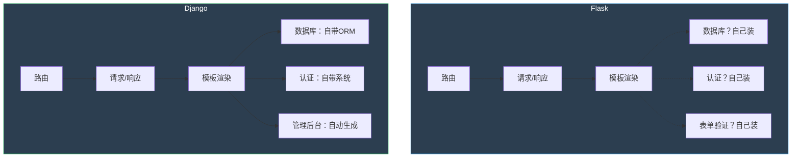

# 06-2. Flask Web 开发<!-- omit in toc -->

- **定位**：用 Flask 连接前端和后端，搭建你的第一个 Web 应用——同时也是你未来的“自家靶场”。
- **核心目标**：学完本课程，你将能独立用 Flask 开发一个带数据库、带用户认证、带 RESTful API 的完整博客系统。
- **教学理念**：先教够用的基础语法，然后带着你从零开始搭建一个博客系统。高级语法不单独成章——在搭建博客的过程中，遇到需要的时候才学。

---

## 目录<!-- omit in toc -->

- [前言](#前言)
- [第一章：Flask 初识——三行代码跑起一个网站](#第一章flask-初识三行代码跑起一个网站)
  - [1.1 为什么是 Flask？](#11-为什么是-flask)
  - [1.2 安装 Flask 并运行你的第一个“Hello, World”](#12-安装-flask-并运行你的第一个hello-world)

<!--
  - [1.3 Flask 的请求-响应循环：你在 06-1 学的 HTTP 现在活起来了](#13-flask-的请求-响应循环你在-06-1-学的-http-现在活起来了)
  - [1.4 开发模式 vs 生产模式：为什么 `flask run` 不能直接上线](#14-开发模式-vs-生产模式为什么-flask-run-不能直接上线)
  - [1.5 动手：创建“守夜者笔记”项目骨架](#15-动手创建守夜者笔记项目骨架)
- [第二章：路由——当 URL 变成函数调用](#第二章路由当-url-变成函数调用)
  - [2.1 `@app.route` 是什么？](#21-approute-是什么)
  - [2.2 路由匹配规则：为什么 `/new` 和 `/<username>` 会打架？](#22-路由匹配规则为什么-new-和-username-会打架)
  - [2.3 动态路由：从 URL 中获取参数](#23-动态路由从-url-中获取参数)
  - [2.4 GET 和 POST 在 Flask 里怎么处理？——`request.args` vs `request.form`](#24-get-和-post-在-flask-里怎么处理)
  - [2.5 URL 重定向和 `url_for`：为什么你不该在代码里硬编码 URL](#25-url-重定向和-url_for为什么你不该在代码里硬编码-url)
  - [2.6 请求上下文：`request` 对象从哪来的？——Flask 在后台帮你做了一件事](#26-请求上下文request-对象从哪来的flask-在后台帮你做了一件事)
  - [2.7 动手：给“守夜者笔记”添加首页和文章详情页的路由](#27-动手给守夜者笔记添加首页和文章详情页的路由)
- [第三章：模板——当 HTML 遇到 Python](#第三章模板当-html-遇到-python)
  - [3.1 Jinja2 是什么？——它和你在 06-1 写的 HTML 有什么不同？](#31-jinja2-是什么它和你在-06-1-写的-html-有什么不同)
  - [3.2 模板继承：为什么你要写一个 `base.html`？](#32-模板继承为什么你要写一个-basehtml)
  - [3.3 在模板里渲染 Python 变量、循环、条件判断](#33-在模板里渲染-python-变量循环条件判断)
  - [3.4 Jinja2 的自动转义：XSS 防御的第一道防线](#34-jinja2-的自动转义xss-防御的第一道防线)
  - [3.5 `render_template_string`：什么时候用它？——渲染存进数据库的用户输入](#35-render_template_string什么时候用它渲染存进数据库的用户输入)
  - [3.6 动手：用模板渲染“守夜者笔记”的文章列表](#36-动手用模板渲染守夜者笔记的文章列表)
- [第四章：表单——当用户输入遇到安全过滤](#第四章表单当用户输入遇到安全过滤)
  - [4.1 Flask-WTF 是什么？——它比你手写表单验证安全在哪？](#41-flask-wtf-是什么它比你手写表单验证安全在哪)
  - [4.2 CSRF 保护：为什么 Flask-WTF 默认给你的表单加了一层防护？](#42-csrf-保护为什么-flask-wtf-默认给你的表单加了一层防护)
  - [4.3 表单验证：客户端验证是摆设，服务端验证才是底线](#43-表单验证客户端验证是摆设服务端验证才是底线)
  - [4.4 文件上传：`request.files` 的正确用法和安全隐患](#44-文件上传的安全隐患)
  - [4.5 动手：给“守夜者笔记”添加“写文章”表单](#45-动手给守夜者笔记添加写文章表单)
- [第五章：数据库——当数据需要“活过”一次请求](#第五章数据库当数据需要活过一次请求)
  - [5.1 为什么需要数据库？——Flask 的 `g` 和 `session` 为什么不够用？](#51-为什么需要数据库flask-的-g-和-session-为什么不够用)
  - [5.2 SQLite 与 Flask-SQLAlchemy：用 Python 类操作数据库，不用写 SQL](#52-sqlite-与-flask-sqlalchemy用-python-类操作数据库不用写-sql)
  - [5.3 增删改查：用 Python 操作数据库的四项基本操作](#53-增删改查用-python-操作数据库的四项基本操作)
  - [5.4 一对多关系：文章和评论怎么关联？](#54-一对多关系文章和评论怎么关联)
  - [5.5 多对多关系：文章和标签怎么关联？](#55-多对多关系文章和标签怎么关联)
  - [5.6 动手：把“守夜者笔记”的文章存入数据库，支持评论和标签功能](#56-动手把守夜者笔记的文章存入数据库支持评论和标签功能)
- [第六章：用户认证——当网站需要“记住你”](#第六章用户认证当网站需要记住你)
  - [6.1 Flask-Login 是什么？——它帮你管理了哪些登录细节？](#61-flask-login-是什么它帮你管理了哪些登录细节)
  - [6.2 密码哈希：为什么明文存储密码是灾难？](#62-密码哈希为什么明文存储密码是灾难)
  - [6.3 访问控制：`@login_required` 是怎么保护路由的？](#63-访问控制login_required-是怎么保护路由的)
  - [6.4 Session 和 Cookie：你在 06-1 学的理论，现在亲手实现](#64-session-和-cookie你在-06-1-学的理论现在亲手实现)
  - [6.5 动手：给“守夜者笔记”添加用户注册和登录，只有登录用户才能发布文章](#65-动手给守夜者笔记添加用户注册和登录只有登录用户才能发布文章)
- [第七章：RESTful API——当网站不只是给人看，还给程序调用](#第七章restful-api当网站不只是给人看还给程序调用)
  - [7.1 什么是 RESTful API？——为什么你要把数据暴露成 JSON 格式？](#71-什么是-restful-api为什么你要把数据暴露成-json-格式)
  - [7.2 用 Flask 返回 JSON：`jsonify` 的正确用法](#72-用-flask-返回-jsonjsonify-的正确用法)
  - [7.3 动手：给“守夜者笔记”添加文章列表 API，返回 JSON 格式数据](#73-动手给守夜者笔记添加文章列表-api返回-json-格式数据)
- [第八章：部署——让你的博客真正上线](#第八章部署让你的博客真正上线)
  - [8.1 开发环境 vs 生产环境：为什么 `flask run` 不能直接上线？](#81-开发环境-vs-生产环境为什么-flask-run-不能直接上线)
  - [8.2 用 Gunicorn + Nginx 部署到 Linux 服务器](#82-用-gunicorn--nginx-部署到-linux-服务器)
  - [8.3 免费部署方案：Render / PythonAnywhere](#83-免费部署方案render--pythonanywhere)
  - [8.4 环境变量与安全：为什么你的 `SECRET_KEY` 不该写在代码里？](#84-环境变量与安全为什么你的-secret_key-不该写在代码里)
  - [8.5 动手：把“守夜者笔记”部署到公网](#85-动手把守夜者笔记部署到公网)
- [第九章：安全基础——你造的是网站，不是漏洞收集器](#第九章安全基础你造的是网站不是漏洞收集器)
  - [9.1 SQL 注入：你的 Flask 应用哪里可能有 SQL 注入？](#91-sql-注入你的-flask-应用哪里可能有-sql-注入)
  - [9.2 XSS：Jinja2 自动转义在什么情况下会失效？](#92-xssjinja2-自动转义在什么情况下会失效)
  - [9.3 CSRF：Flask-WTF 默认保护了，但你的 API 呢？](#93-csrfflask-wtf-默认保护了但你的-api-呢)
  - [9.4 文件上传漏洞：你允许用户上传什么类型的文件？](#94-文件上传漏洞你允许用户上传什么类型的文件)
  - [9.5 会话安全：Cookie 的 `HttpOnly`、`Secure`、`SameSite` 你设了吗？](#95-会话安全cookie-的-httponlysecure-samesite-你设了吗)
  - [9.6 你的 Flask 应用就是靶场——故意留几个漏洞，以后自己打自己](#96-你的-flask-应用就是靶场故意留几个漏洞以后自己打自己)
- [第十章：总结与展望](#第十章总结与展望)
  - [10.1 你学会了什么？](#101-你学会了什么)
  - [10.2 你的“守夜者笔记”现在是一个完整的 Web 应用了](#102-你的守夜者笔记现在是一个完整的-web-应用了)
  - [10.3 下一步：用你学到的 Python 能力，去写安全工具](#103-下一步用你学到的-python-能力去写安全工具)
-->

---

## 前言

*Kate 在 06-1 学完了 Web 通识扫盲课。她合上笔记本，看着桌面上自己写的那些文件——`my-first-page.html`、`style.css`、`xss-demo.html`——说了一句：*

> *“我现在能写 HTML、CSS、JavaScript 了。我能用 F12 透视网页，能理解 HTTP 请求和响应的结构，能用 `innerHTML` 让页面动起来。但有一个问题：我写的网页只能在我自己的电脑上看到——别人看不到。它没有网址，没有服务器，不是一个‘真正的网站’。我怎么把它变成一个真正的网站，让任何人都能通过浏览器访问？”*
>
> *“你需要一个 Web 框架。一个能让你写的 HTML、CSS、JavaScript 真正‘跑’在服务器上的东西。别人输入网址，服务器收到请求，调用你写的 Python 代码，生成网页，返回给浏览器——整个过程只需要几行代码。这个框架叫 Flask。”*

Flask 是 Python 世界里最轻量的 Web 框架。它不像 Django 那样自带一大堆功能——Django 适合大型项目，但对你来说太重了。

你不需要 Django 内置的 ORM、认证系统、管理后台。你需要的是一个能快速搭建、能随时修改、能故意留几个漏洞用来测试安全工具的“自家靶场”。Flask 的轻量刚好满足需求——几行代码就能跑起一个网站，而且每一行代码你都看得懂、改得动。

这套教程不会教你 Flask 的全部功能。它只教你**在搭建博客系统时最常用的那部分 Flask**。你不是来学 Flask 的全部功能的——你是来学怎么用 Flask 搭建一个能跑、能看、能被攻击的 Web 应用的。

每学完一章，你都会在“守夜者笔记”这个博客系统上亲手添加一个新功能。

第一章你创建项目骨架——一个能显示“守夜者笔记”首页的 Flask 应用。第二章你添加路由——首页、文章详情页可以通过 URL 访问。第三章你用模板渲染——文章列表不再是写死的文字，而是从 Python 变量动态生成。第四章你添加表单——用户可以通过网页发布新文章。第五章你接入数据库——文章存入 SQLite 数据库，支持评论和标签功能。第六章你添加用户认证——用户注册和登录，只有登录用户才能发布文章。第七章你为博客系统添加 RESTful API——对外提供 JSON 格式的文章列表接口。第八章你把博客系统部署到公网——任何人都能通过浏览器访问。第九章你检查博客系统的安全漏洞。

你在 05 学过的 SQL 注入、XSS、CSRF，现在全部可以在你自己写的博客系统上重现。你在 06-1 第四章学过的 `innerHTML` vs `textContent` 的区别，在这里会变成你是否被 XSS 攻击的分水岭。你在 05 第二章亲手弹过的 XSS 弹窗、用 `' OR 1=1 --` 绕过的登录框——现在你可以在你自己写的博客系统里重现这些漏洞了。

到第十章结束时，你手里有一个**完整的、部署在公网上的博客系统**。

它不是别人搭好给你练习用的靶场——它是你一行一行代码亲手搭建的。你知道每一行代码的含义，知道每一个漏洞藏在哪里。学完 06-4 之后，你会回来用自己的安全工具攻击自己的博客系统。你知道漏洞在哪里，但你要模拟一个“不知道漏洞在哪里”的攻击者——从信息收集开始，一步步渗透你自己搭建的网站。

**你自己造的靶场，你比任何人都更清楚漏洞藏在哪里——但你要假装不知道，用渗透测试的标准流程去发现它、利用它、然后修复它。**

> *Kate 在笔记本上画了一条线。线的一端写着“06-1 Web 通识扫盲课”，另一端写着“06-4 用 Python 写安全工具”。她在中间画了一个圈，写上“06-2 Flask Web 开发”。*
>
> *她说：“06-1 教我 Web 是什么，06-2 教我怎么自己造一个 Web。等我自己造出来了，06-3 和 06-4 教我怎么攻击它。”*
>
> “精准。你现在在建造自己的靶场。建好之后，你会亲手攻击它。”
>
> *“……听起来像一个建筑师，造完自己的房子之后，在墙上砸洞，看看它够不够结实。”*
>
> “对。而且砸完之后你还会修补它——因为你知道洞在哪，也知道为什么会有这个洞。”
>
> *“……那我们开始造房子吧。”*

---

## 第一章：Flask 初识——三行代码跑起一个网站

*Kate 在 06-1 学完了 Web 通识扫盲课。她能写 HTML、CSS、JavaScript，能用 F12 透视网页，能理解 HTTP 请求和响应的结构。但她写的网页只能在自己电脑上看——别人看不到。她盯着自己写的那些 `.html` 文件，说了一句：*

> *“这些文件在我自己的电脑上能打开。但我怎么让全世界都能看到它？我能不能给它一个网址，让别人在浏览器里输入网址就能看到我的网页？”*
>
> “能。你需要一个 Web 框架——一个能让你写的网页真正‘跑’在服务器上的东西。Flask 是 Python 世界里最轻量的 Web 框架。几行代码就能跑起一个网站。”

---

### 1.1 为什么是 Flask？

Python 世界里有很多 Web 框架，每个都有自己的定位。

**Django** 是最全的——它自带 ORM（数据库操作）、认证系统（登录注册）、管理后台（自动生成的后台管理界面），像一个装备齐全的专业厨房。你要做一顿大餐，所有厨具都帮你准备好了。但代价是：你必须按照它的规则来。Django 的项目结构是固定的——`settings.py`、`urls.py`、`models.py`、`views.py`——每个文件放在哪、叫什么名字、怎么组织，都是 Django 帮你规划好的。你不必从头设计，但你也很难完全理解每一行代码在干什么。对于新手来说，打开一个 Django 项目就像走进一个已经布置好的厨房——所有东西都在，但你不知道哪个抽屉里装的是什么。

**FastAPI** 是最快的——专为构建 API 设计，性能极高，适合需要处理大量请求的生产环境。但它对新手不够友好——你最好已经理解了 HTTP、异步编程、类型注解这些概念，否则它的代码看起来很费解。

**Flask** 是最轻的。它是“微框架”——核心极简，只提供三个基本功能：

- **路由**：把 URL 映射到 Python 函数。你在浏览器里输入 `/`，Flask 调用 `index()` 函数。你输入 `/about`，Flask 调用 `about()` 函数。
- **请求和响应处理**：你在 06-1 第五章学过的 HTTP 请求和响应——Flask 让你在 Python 代码里直接读取请求的参数、头部、Cookie，然后返回你想返回的任何内容。
- **模板渲染**：你在 06-1 第二章写的 HTML 页面——Flask 用 Jinja2 模板引擎把它们变成动态页面，让你可以在 HTML 里嵌入 Python 变量、循环、条件判断。

除了这三个核心功能，Flask 什么都不带。没有数据库？自己选——SQLite、MySQL、PostgreSQL，用 Flask-SQLAlchemy 扩展装上就行。没有表单验证？自己选——用 Flask-WTF 扩展装上就行。没有用户认证？自己选——用 Flask-Login 扩展装上就行。



> *Kate 说：“所以 Flask 就是一个‘空厨房’——我只需要往里加我需要的工具。Django 是一个‘全套厨房’——什么都帮我装好了，但很多我用不上。”*
>
> “Flask 的空厨房让你知道每一件工具是干什么的、放在哪个抽屉里。Django 的全套厨房让你不用自己买工具，但你可能永远不知道某个抽屉里装的是什么——直到它坏了。而且对于你要做的事情来说，Flask 还有一个 Django 永远无法替代的优势。”
>
> *“……什么优势？”*
>
> “你要建的不是一个‘完美的生产级网站’。你要建的是一个‘用来攻击的靶场’。你需要故意留漏洞——SQL 注入、XSS、CSRF、文件上传漏洞。在 Flask 里，你在哪一行代码里关了自动转义、在哪一行代码里拼接了 SQL 字符串、在哪一行代码里允许了无限制的文件上传——你全知道。因为这些功能都是你自己一行一行写的。你知道每一个漏洞藏在哪里，也知道怎么利用它。”
>
> *“但在 Django 里，这些功能是框架自动帮你做的——我可能不知道它在哪里做的，也就不知道漏洞藏在哪里。”*
>
> “Flask 让你成为网站的建筑师。你知道每一堵墙是怎么砌的，所以你清楚地知道——哪一堵墙可以被砸开。”

---

**Flask 在本系列中的位置**  

你在 06-1 学会了 Web 是什么——HTML 是骨架，CSS 是皮肤，JavaScript 是大脑，HTTP 是它们之间的传话规则。现在你要学的是**怎么把这些东西放到服务器上，让别人能访问**。

你在 06-1 第四章用 `python -m http.server 8000` 启动过简易本地服务器——那个服务器只能列出当前文件夹里的文件，像一个只会报菜单的服务员。Flask 是它的“升级版”。Flask 不只是列出文件——它能处理路由（你在 06-1 学过的“不同的 URL 返回不同的内容”）、接收表单（你在 06-1 第二章学过的 `<form>` 标签提交的数据）、连接数据库（你在 05 学过的“数据需要被持久化存储”）、管理用户登录（你在 06-1 第五章学过的 Cookie 和 Session，现在你亲手实现它们）。

等你学完 06-2，你会用 Flask 搭建一个完整的博客系统——“守夜者笔记”。这套博客系统就是你的“自家靶场”。以后你在 06-4 学到的安全工具，全都会用来攻击这套博客系统。你自己造的网站，你自己写的漏洞，你自己攻击它。你知道漏洞在哪里，但你要模拟一个“不知道漏洞在哪里”的攻击者——从信息收集开始，一步步渗透你自己搭建的网站。你知道漏洞藏在哪里，但你要假装不知道，用渗透测试的标准流程去发现它、利用它、然后修复它。

---

### 1.2 安装 Flask 并运行你的第一个“Hello, World”

> *Kate 在上一节理解了 Flask 的定位。她说：“空厨房，自己选厨具——这个概念我懂了。但我怎么把这个空厨房搬到我电脑上？”*
>
> *“第一步，把厨房搬进来。第二步，做你的第一道菜——一个能在浏览器里看到的‘Hello, World’。”*

#### 安装 Flask<!-- omit in toc -->

Flask 是一个 Python 库。如果你已经装好了 Python 和 Anaconda，现在只需要一行命令。

打开终端（Windows 上打开 Anaconda Prompt 或 PowerShell，macOS/Linux 上打开终端）。先确认你在 Python 3 环境里：

```bash
conda activate py3
```

这行命令让你进入 `py3` 虚拟环境。还记得虚拟环境是什么吗？你在 05 第三章学过——`py3` 是你专门为 Python 3 创建的“隔离房间”。所有你用 `pip install` 装的 Python 库，都只影响这个房间，不会影响系统的其他 Python 环境。

然后安装 Flask：

```bash
pip install flask
```

`pip` 是 Python 的包管理工具。`pip install flask` 会从 Python 官方的包仓库 PyPI（Python Package Index，所有公开 Python 库的中央仓库）下载 Flask 及其依赖库，自动安装到你当前激活的 `py3` 环境中。

Flask 本身也依赖其他几个库——`Werkzeug`（处理 HTTP 请求和响应的底层库）、`Jinja2`（模板引擎）、`click`（命令行工具）。`pip` 会自动识别这些依赖，一并安装。你不用手动一个一个装。

验证安装是否成功：

```bash
python -c "import flask; print(flask.__version__)"
```

这行命令拆开来看：`python -c` 告诉 Python 执行后面引号里的代码。`import flask` 尝试导入 flask 模块——如果 Flask 安装成功，导入不会报错。`print(flask.__version__)` 打印 Flask 的版本号。如果输出类似 `3.1.x` 的版本号，Flask 安装成功。


> *Kate 输入了 `pip install flask`，进度条跑了几秒钟。然后她输入了验证命令，终端打印出了 `3.1.x`。她说：“这就装好了？我以为要配置一堆东西——数据库连接、服务器设置、端口号。原来只需要一行 `pip install`。”*
>
> “这就是 Flask 轻量的地方。它核心极简——只带路由、请求响应、模板渲染三个功能。你现在装的 Flask 本身代码量很小。你需要什么，后面再用扩展加。先把核心跑起来。”

---

#### 你的第一个 Flask 应用：三行代码跑起一个网站<!-- omit in toc -->

创建一个新文件夹，叫 `keeper-blog`。这是你的“守夜者笔记”博客系统的项目根目录。以后这个文件夹里会装下你的所有代码、模板、静态文件、数据库——一整个网站，就装在这个文件夹里。

在 `keeper-blog` 文件夹里创建一个文件，叫 `app.py`：

```python
from flask import Flask

app = Flask(__name__)

@app.route('/')
def index():
    return '<h1>守夜者，我在。</h1>'
```

**这三行代码做了什么？**

**第一行：`from flask import Flask`**

从 `flask` 库中导入 `Flask` 类。`Flask` 是一个类——面向对象编程中的“蓝图”或“模板”。类本身不是实际的应用，它是用来创建应用的模具。你可以用一个模具创建多个实例——每个实例都是独立的，有自己的路由和配置。

你现在不需要深入理解“类”是什么——你只需要知道：接下来你创建的 `app` 对象就是 `Flask` 这个模具造出来的一个具体实例，它就是你整个 Web 应用的核心。所有的路由、所有的视图函数、所有的配置，都挂在这个 `app` 对象上。

**第二行：`app = Flask(__name__)`**

创建一个 Flask 应用实例。`app` 是这个实例的名字——你可以叫它任何名字，但 `app` 是约定俗成的名字，大家都用这个。`__name__` 是 Python 的一个内置变量，表示当前模块的名字。

你现在不需要深入理解 `__name__` 的细节——你只需要知道：当这个 `.py` 文件被直接运行时，`__name__` 的值是 `'__main__'`。Flask 用这个变量来定位项目中的资源——比如模板文件夹、静态文件文件夹。默认情况下，Flask 会在与 `app.py` 同级的 `templates` 文件夹里找模板，在 `static` 文件夹里找静态文件。

每个 Flask 应用都从这一行开始。以后你创建更复杂的项目，把代码拆分到多个文件时，`Flask(__name__)` 的 `__name__` 参数会帮助 Flask 正确定位资源。现在你只需要记住：创建 Flask 应用，就是创建 `Flask` 类的一个实例，参数是 `__name__`。

**第三行：`@app.route('/')`**

一个装饰器。装饰器是 Python 的一种语法——它在不修改函数本身的情况下，给函数附加额外的功能。

在 Flask 里，`@app.route('/')` 的作用是：告诉 Flask，“当用户在浏览器里访问网站根目录（`/`）时，调用下面这个函数”。`/` 是根路径——你访问 `http://127.0.0.1:5000/`，浏览器实际访问的就是 `/` 这个路径。如果你写 `@app.route('/about')`，那对应的是 `http://127.0.0.1:5000/about`。

`@app.route()` 把 `index()` 函数注册为“处理根路径请求的函数”。以后每当有人访问根路径，Flask 都会调用 `index()` 函数，把它的返回值作为 HTTP 响应体返回给浏览器。

**第四行：`return '<h1>守夜者，我在。</h1>'`**

返回一个字符串。这个字符串不是普通的 Python 字符串——它是 HTTP 响应体里的内容。

你在 06-1 第五章学过 HTTP 响应的结构——状态行、响应头、响应体。`return '<h1>守夜者，我在。</h1>'` 这行代码做的事情是：把 `<h1>守夜者，我在。</h1>` 这个字符串放入 HTTP 响应体，Flask 自动设置响应头的 `Content-Type: text/html`，自动生成状态行 `200 OK`，打包成一个完整的 HTTP 响应，返回给浏览器。

浏览器收到这个响应后，解析 HTML 标签 `<h1>`，把它渲染成一个一级标题。你看到的就是一个大大的“守夜者，我在。”。

在终端里，进入 `keeper-blog` 文件夹，运行：

```bash
flask run
```

终端会显示：

```text
 * Running on http://127.0.0.1:5000
```


打开浏览器，在地址栏输入 `http://127.0.0.1:5000`，按回车。你会看到一个网页，上面写着大大的“守夜者，我在。”。

`127.0.0.1` 是“本机”的 IP 地址——你访问的不是互联网上的某个远程服务器，而是你自己电脑上运行的 Flask 应用。`5000` 是 Flask 默认的端口号——每个网络服务都需要一个端口号来标识自己。你之前用 `python -m http.server 8000` 启动的简易服务器监听的是 8000 端口，Flask 默认监听 5000 端口。

> *Kate 盯着浏览器里那行字，说：“这就是一个网站？就用几行 Python 代码？我之前在 06-1 写 HTML，是用~~记事本~~ VSCode 写一个 `.html` 文件，然后在浏览器里打开那个文件。现在我不是打开文件——我是访问了一个网址。这个网址对应的网页，是我用 Python 代码返回的一行字符串。”*
>
> “这就是 Flask 的核心。它让你用 Python 代码来决定浏览器里显示什么。你写的不是静态的 HTML 文件——你写的是**生成网页的程序**。每次有人访问这个网址，Flask 都会调用你写的函数，把函数的返回值作为 HTTP 响应体返回给浏览器。”
>
> *“……所以每次有人访问我的网站，我的 Python 代码都会被执行一次？”*
>
> “对。这就是动态网页的本质。你不必为每一篇文章手写一个 HTML 文件——你只需要写一个 Python 函数，让它根据 URL 参数从数据库里取出对应的文章内容，生成一个 HTML 页面返回给浏览器。你在 06-1 写的静态 HTML 文件是‘写死’的——内容不变，谁来看到都一样。Flask 能让你生成‘活的’网页——不同的人、不同的时间、不同的请求，看到的内容可以完全不同。”

---
