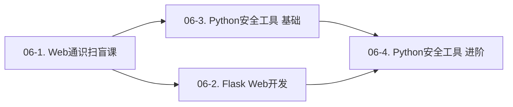

# 06. 这才是 Python<!-- omit in toc -->

- **定位**：从零开始，用 Python 武装你的安全工具链。
- **核心目标**：学完这个系列，你将拥有完整的 Python 实战能力——从 Web 基础到 Flask 开发，从爬虫到 GUI，从基础脚本到进阶安全工具。

---

## 目录<!-- omit in toc -->

- [系列结构](#系列结构)
- [各课程介绍](#各课程介绍)
  - [06-1. Web 通识扫盲课](#06-1-web-通识扫盲课)
  - [06-2. Flask Web 开发](#06-2-flask-web-开发)
  - [06-3. 用 Python 写安全工具（基础）](#06-3-用-python-写安全工具基础)
  - [06-4.  用 Python 写安全工具（进阶）](#06-4--用-python-写安全工具进阶)
- [学习路线](#学习路线)
- [与守夜者之书其他教程的关系](#与守夜者之书其他教程的关系)
- [前置知识](#前置知识)
- [FAQ](#faq)

---

## 前言<!-- omit in toc -->

*Kate 在 05 学完了渗透测试的基础——她用 Kali 攻击过 Metasploitable 靶场，用 Burp Suite 抓过包，用 Wireshark 分析过 HTTP 流量。但她发现自己有一个问题：*

> *“我用了很多别人写的工具——SQLMap、Nmap、dirsearch。我知道它们能干什么，但我不知道怎么写的。万一有一天，我遇到一个这些工具都搞不定的场景——我怎么办？”*

*“你就需要自己写。Python 是渗透测试行业的‘通用胶水’——从信息收集到漏洞利用，从爬虫到图形界面，它无处不在。这个系列从零开始教你 Python，不是为了让你通过考试，是为了让你有能力写出自己的工具。”*  

Python 在安全领域的地位，不是因为它是最快的语言（它不是），也不是因为它是最安全的语言（它也不是）。而是因为它是**开发效率最高的语言**。你有一个想法——写一个脚本自动扫描目标端口、批量验证漏洞、解析日志文件——你用 Python 半小时就能跑起来一个能用的版本。在渗透测试中，速度往往比优雅更重要。你需要的是今天能用的工具，不是三个月后完美的架构。

而且 Python 的第三方库生态是安全从业者的宝藏。`requests` 让你用三行代码发送 HTTP 请求，`paramiko` 让你通过 SSH 远程控制服务器，`scapy` 让你构造和解析网络数据包，`beautifulsoup4` 让你解析 HTML 页面。这些库已经帮你处理了底层细节——你只需要关注你要解决的安全问题本身。

这个系列不会教你 Python 的每一个语法细节。它只教你**在安全场景下最常用的那部分 Python**。你不需要知道 Python 的内存管理机制，但你一定需要知道怎么用 Python 发送 HTTP 请求。你不需要知道 Python 的元类是什么，但你一定需要知道怎么用 Python 解析命令行参数。你不是来学编程语言的——你是来学怎么用编程语言解决安全问题的。

> *Kate 在这个系列里会和你一起从零开始学 Python。她会用 Python 写她的第一个爬虫、第一个 GUI 工具、第一个端口扫描器。她会在 Flask 里搭建自己的靶场，然后用自己的安全工具去攻击它。她会犯错、会踩坑、会在凌晨两点对着一个报错发呆——然后她会和你一起，一个一个地把坑填平。*
>
> **你在 06 系列里看到的所有错误示范，都是 Kate 写的。她负责翻车，你负责学习。**
>
> —— 守夜者

---

## 系列结构

《06. 这才是 Python》是一个系列课程，分为四个子课程：

| # | 教程 | 状态 | 链接 |
| :--- | :--- | :--- | :--- |
| **06-1** | Web 通识扫盲课 | :white_check_mark: 已完成 | [开始阅读](<./06-1. Web 通识扫盲课/06-1. Web 通识扫盲课.md>) |
| **06-2** | Flask Web 开发 | :construction: 编写中 | [开始阅读](<./06-2. Flask Web 开发/06-2. Flask Web 开发.md>) |
| **06-3** | 用 Python 写安全工具（基础） | :pencil: 等待中 | 敬请期待 |
| **06-4** | 用 Python 写安全工具（进阶） | :pencil: 等待中 | 敬请期待 |

---

## 各课程介绍

### 06-1. Web 通识扫盲课

**适合谁**：零基础，从未接触过 Web 开发的读者。如果你不知道 HTML 是什么、不知道前端和后端的区别、不知道浏览器按下回车后发生了什么——这门课就是为你准备的。

**学什么**：

- **Web 的诞生与发展**：从 Tim Berners-Lee 的一份论文提案讲起。他为什么发明 Web？他发明了哪三样东西？世界上第一个网站长什么样？Web 这个名字是怎么来的？
- **浏览器大战**：Mosaic 如何让普通人用上了浏览器？Netscape 如何统治了 90 年代的互联网？微软如何用 IE 打赢了第一次浏览器大战？Firefox 和 Chrome 又是怎么后来居上的？这场战争留下的 JavaScript、Cookie、SSL——今天全都在你学安全的路上等着你
- **前端和后端的区别**：浏览器里显示的是前端，服务器上跑的是后端。它们怎么通过 HTTP 通信？你在 05 第一章学的 Web 三层架构和 Mermaid 序列图，在这里会被重新唤醒
- **HTML 基础**：HTML 不是编程语言——它是标记语言。`<h1>` 是标题，`<p>` 是段落，`<form>` 是表单。你会在这一节亲手写出人生中第一个网页
- **CSS 基础**：CSS 让网页从“白纸黑字”变成“有颜色、有布局”。你会学会选择器、属性、值——三个概念就能写出能看的样式
- **JavaScript 基础**：JavaScript 让网页“动起来”。你会亲手写一段 JS：点击按钮，弹出一个“守夜者，我在。”的弹窗。这个弹窗你在 05 第二章亲手验证 XSS 时弹过——现在你知道它是怎么弹出来的了
- **HTTP 协议**：你在 05 第四章已经学过 HTTP——这里用更直观的方式重温。GET 和 POST 的区别、200 OK 和 404 Not Found 的含义、Cookie 和 Session 为什么能让“无状态”的 HTTP 变得“有状态”
- **开发者工具**：按 F12，你就能透视网页的内部结构。Elements 标签看 HTML 和 CSS，Console 标签执行 JavaScript，Network 标签监控所有网络请求。你在 05 装过的 Burp Suite，本质上就是一个更强大的“Network 标签”

**为什么学**：你要攻击 Web 应用，你首先得理解 Web 是怎么运作的。不懂 HTML，你看到源码就是一堆乱码。不懂 HTTP，你不知道 Burp Suite 抓到的包是什么意思。不懂 JavaScript，你理解不了 XSS 为什么能偷 Cookie。

**学完你能**：理解“输入网址按下回车后发生了什么”，能看懂网页源码，知道前端和后端如何通过 HTTP 通信，能用 F12 透视网页的内部结构。你会知道 Web 不是魔法——它是一套可以被理解和被攻击的规则。

**与后续课程的关系**：06-1 是 06-2 和 06-3 的共同基础。你必须先理解 Web 是怎么运作的，才能写 Web 应用（06-2）和爬虫（06-3）。

---

### 06-2. Flask Web 开发

**适合谁**：已经学完 06-1，或者已经了解 HTML/HTTP 基础的读者。

**学什么**：

- **Flask 框架基础**：Flask 是什么？为什么选它而不是 Django？几行代码就能跑起一个网站——`from flask import Flask`
- **路由和视图函数**：`@app.route('/')` 是什么意思？用户访问不同 URL，Flask 怎么知道该返回什么内容？
- **模板渲染**：怎么把 HTML 模板和 Python 数据结合起来？`render_template` 让你动态生成网页
- **表单处理**：用户填了表单，Flask 怎么接收数据？GET 和 POST 在 Flask 里怎么处理？
- **数据库操作**：Flask 怎么连接数据库？怎么用 SQLAlchemy 操作数据库？你写的数据会被持久化存储
- **部署上线**：你写好的 Flask 应用，怎么让它真正跑在服务器上？Gunicorn + Nginx 的基本配置

**为什么学**：你以后需要一个“自家靶场”来测试安全工具。用 Flask 自己搭建一个 Web 应用——你既学会了后端开发，又有了一台完全合法的测试目标。你的 Flask 应用可以故意留着漏洞（SQL 注入、XSS、文件上传），然后用你自己的安全工具去攻击它。**你自己写的靶场，你比任何人都更清楚漏洞藏在哪里。**

**学完你能**：独立用 Flask 开发简单的 Web 应用，理解后端开发的基本流程。你能自己搭建一个带数据库、带用户登录、带表单提交的完整网站。

**与后续课程的关系**：06-2 是 06-4 的可选前置。你搭建的 Flask 应用就是测试你自己安全工具的“自家靶场”。学完 06-4，你可以回到自己的 Flask 应用，写一个自动化扫描脚本，检查它有没有 SQL 注入漏洞。

---

### 06-3. 用 Python 写安全工具（基础）

**适合谁**：已经掌握 Python 基础语法（变量、函数、循环、`import`），想写实用工具的读者。如果你已经会用 `pip install`，会写简单的 `for` 循环和 `if` 判断，你就可以开始这门课了。

**学什么**：

- **Python 爬虫**：从 `requests` 库发送 HTTP 请求开始，到 `BeautifulSoup` 解析 HTML 页面。从简单的静态页面抓取，到模拟登录、处理 Cookie、绕过反爬策略。爬虫和信息收集本质上是同一件事——自动化地获取信息。你写的爬虫就是你自己用的信息收集工具
- **GUI 开发**：用 Tkinter（Python 自带的标准 GUI 库）把你的脚本包装成图形界面。命令行工具只有你会用，图形界面工具你的队友也能用。窗口、按钮、输入框、文本框——学会这四个控件，你能给任何脚本套上一层 GUI

**为什么学**：你写了一个很厉害的渗透测试脚本，但别人要用还得打开命令行——太劝退了。把你的工具包装成带界面的程序，别人双击就能用。你在渗透测试项目中写的工具，最终都要交给客户或队友使用。他们不懂命令行，他们需要的是一个能点的按钮。

**学完你能**：能把脚本封装成带界面的工具，让别人双击就能用。能写爬虫自动化收集信息。你会有能力把重复性工作自动化——不再手动重复相同操作。

**与后续课程的关系**：06-3 是 06-4 的可选前置。06-3 教你“怎么写工具给别人用”，06-4 教你“怎么写工具给自己用”。两者没有先后依赖——你可以先学 GUI 再学安全脚本，也可以反过来。

---

### 06-4.  用 Python 写安全工具（进阶）

**适合谁**：已经学完 06-3，或者已经有一定 Python 基础，想写专业安全工具的读者。

**学什么**：

- **端口扫描器的原理与编写**：你用过 Nmap，但它本质上是怎么工作的？TCP SYN 扫描、TCP Connect 扫描、UDP 扫描——你会自己实现一个精简版 Nmap
- **弱口令爆破工具**：你用过 Hydra，但它本质上是怎么工作的？你会自己写一个爆破脚本，针对 SSH、FTP、MySQL、HTTP Basic Auth 逐一击破
- **日志分析脚本**：你手上有几十 GB 的访问日志，怎么从中找出攻击者的痕迹？用 Python 解析日志文件、提取可疑 IP、统计攻击来源
- **SQL 注入自动化检测脚本**：你手动测过 SQL 注入——但如果有几百个 URL 要测呢？你会写一个脚本，批量检测 SQL 注入漏洞

**为什么学**：当 SQLMap 跑不出注入时，当 Nmap 扫得不够精细时，你需要自己写一个脚本。你不需要造轮子——但你需要会改装轮子。别人的工具是通用型的，你的脚本是针对性的——针对你正在渗透的这个特定系统、特定漏洞、特定场景。这才是渗透测试工程师的核心竞争力。

**学完你能**：把枯燥的渗透工作自动化——点一下鼠标，让电脑帮你干活，然后你去喝杯咖啡。

**与后续课程的关系**：06-4 是这个系列的终点，也是通往 07《Rust：灰烬之战》的桥梁。当你发现 Python 的性能不够——端口扫描太慢、爆破字典太大、日志分析太卡——那就是你需要 Rust 的时候了。

---

## 学习路线

这个系列的设计遵循**循序渐进、前后衔接**的原则：



**推荐路径**：

1. **先学 06-1**：不管你之前有没有编程基础，先理解 Web 的基本运作方式——HTML、CSS、JavaScript、HTTP。这些是你后面写 Web 应用和安全工具的基础。这门课不教 Python——它只教 Web。你需要先知道 Web 是什么，才能用 Python 去操作 Web
2. **两条分支可以任选其一**：
   - **Flask 方向**（06-2）：你想搭建自己的 Web 靶场，深入学习后端开发。这条路径适合想理解“网站是怎么建起来的”的读者
   - **爬虫+GUI 方向**（06-3）：你想马上写出能用的工具，给别人用。这条路径适合想快速看到成果的读者
3. **汇合到 06-4**：无论你选了哪条分支，最后都会回到安全工具开发——端口扫描器、弱口令爆破、日志分析脚本。06-4 是整个系列的终点，也是你从“会用工具的人”变成“会造工具的人”的分水岭

**如果你已经有 Python 基础**，可以跳过 06-1 和 06-2 的基础部分，直接从 06-3 开始。但建议至少通读 06-1——很多 Python 开发者对 HTTP 协议和浏览器工作原理只有模糊的理解，这会在你写 Web 渗透工具时拖慢你。

**如果你已经有 Web 开发经验**（会用 Flask 或 Django），可以直接跳到 06-4。但建议至少通读 06-3——爬虫和信息收集是你以后做渗透测试时最实用的技能之一。

---

## 与守夜者之书其他教程的关系

| 教程 | 和《这才是 Python》的关系 |
| :--- | :--- |
| **01. 玩转 Markdown** | 你写的所有 Python 代码、笔记、文档，全用 Markdown 编写。你在 01 学的代码块语法高亮——` ```python `——会在每一课用到 |
| **02. 玩转 VS Code** | VS Code 是写 Python 最舒服的编辑器——智能补全、调试断点、集成终端。你在 02 学的 `Ctrl+Shift+P` 命令面板，会在装 Python 插件时用到 |
| **03. VIM 从入门到得体** | 当你需要远程登录服务器改 Python 脚本时，VIM 是你的唯一选择。你在 03 学的 `:wq` 会在那个时刻救你一命 |
| **04. 拿捏 Git 与 GitHub** | 你写的每一个 Python 工具，都应该用 Git 管理版本，用 GitHub 开源发布。你在 04 学的 `git push origin main` 会在每次写完一个新功能时用到 |
| **05. 这才是网络安全** | Python 系列是 05 的“武器工厂”——05 教你攻击理论（SQL 注入原理、XSS 原理、文件上传原理），06 教你造攻击工具（SQL 注入检测脚本、XSS Payload 生成器、文件上传漏洞扫描器）。学完 05 你知道“为什么要攻击”，学完 06 你知道“怎么攻击” |
| **07. Rust：灰烬之战** | Python 是快速开发的利器，Rust 是高性能的终极武器。当你的 Python 端口扫描器太慢、你的 Python 爆破脚本跑不动大字典——那就是你需要 Rust 的时候了 |

---

## 前置知识

这个系列的 **06-1** 是真正的零基础——你不需要任何编程经验。你只需要会打开浏览器、会用 VS Code 写 Markdown（你在 01 已经学会了）。

从 **06-2** 开始，你需要有一些 Python 基础。如果你完全没有写过 Python，建议先找一本 Python 入门书（比如《Python 编程：从入门到实践》的前 11 章）过一遍——变量、列表、字典、`if`/`for`/`while`、函数、类、文件读写。这些基础语法不需要全部背下来，但你需要能看懂 `def xxx():` 是在定义一个函数，能看懂 `import requests` 是在引入一个库。

如果你不想额外买书，也可以直接跟着 06-2 边学边查——教程里会解释每一行代码的含义，但不会花大量篇幅解释 Python 的基础语法。遇到不理解的语法，用搜索引擎搜“Python 列表 怎么用”或者“Python 函数 定义”，你会在实践中学会 Python。

---

## FAQ

**Q：我真的能从零开始学会 Python 吗？**

A：06-1 是零基础入门——你不需要任何编程经验。06-2 开始需要一些 Python 基础，但不需要你成为专家。你只需要能看懂基本语法，剩下的在实战中边学边练。你不必先花三个月系统学 Python 再回来——直接动手，遇到不懂的语法当场查，效率更高。你学 Markdown 的时候也是直接敲 `# 标题` 开始的，不是先背完语法再写的。

**Q：为什么是 Flask 不是 Django？**

A：Flask 更轻量。几行代码就能跑起一个网站，对新手更友好。Django 功能更全，但也更重——它自带了 ORM、认证系统、管理后台，新手一上来就面对一大堆概念，容易劝退。而且你的目标是“搭建一个用来测试安全工具的靶场”，Flask 的轻量刚好满足需求——你不需要 Django 的企业级特性。

**Q：为什么是 Tkinter 不是 PyQt 或 Electron？**

A：Tkinter 是 Python 自带的标准 GUI 库。你不需要额外安装任何东西——装好 Python 就能用。PyQt 功能更强但体积更大、需要额外安装、商用许可复杂。Electron 是前端框架，需要 HTML/CSS/JS，不是 Python 原生方案。对于“把脚本包装成带界面的工具”这个目标，Tkinter 完全够用——窗口、按钮、输入框、文本框，四个控件就能满足 90% 的需求。

**Q：我能跳过 06-1 直接学 06-2 吗？**

A：如果你已经理解以下问题，可以跳过 06-1：输入网址按下回车后，浏览器做了什么？HTML、CSS、JavaScript 各自负责什么？GET 和 POST 的区别是什么？200 OK 和 404 Not Found 是什么意思？Cookie 和 Session 是什么关系？如果你对这些问题只有模糊的感觉，建议至少通读 06-1——它只需要一两个小时，但能帮你把 Web 的基础概念全部理清。你以后写爬虫、写渗透工具、分析 Web 漏洞的时候，这些基础会一直在你脑子里工作。

**Q：学完这个系列能干什么？**

A：学完 06-1，你能理解 Web 的基本运作方式。学完 06-2，你能用 Flask 搭建自己的 Web 应用。学完 06-3，你能写带界面的 Python 工具给别人用。学完 06-4，你能写自己的端口扫描器、爆破脚本、日志分析工具。你可以把它们开源到 GitHub 上，放进你的简历里。你去面试渗透测试工程师的时候，面试官问你“你会 Python 吗”，你打开 GitHub 给他看——这是你写的端口扫描器，这是你写的弱口令爆破脚本，这是你写的日志分析工具。比任何证书都有说服力。

---

**开始阅读：[06-1. Web 通识扫盲课](<./06-1. Web 通识扫盲课/06-1. Web 通识扫盲课.md>)** 🔪
