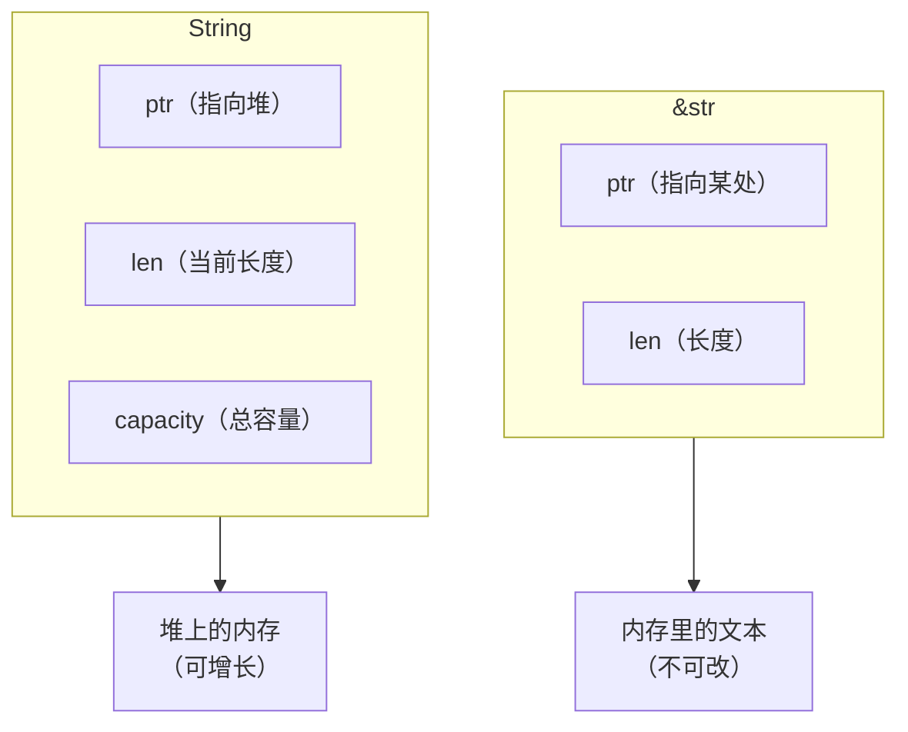

# 07. 最终章 - Rust：灰烬之战<!-- omit in toc -->

**最终目标**：学完本系列，你将掌握 Rust 的核心语法和实战能力，独立完成 12 个真实世界的命令行工具，并亲身"经历"一场从"观察者"到"火卫一"最后时刻的完整战役。

> *（剧情纯属虚构，非必要情况下请勿模仿）*

---

## 目录<!-- omit in toc -->

- [第零阶段：入队仪式（碎镜爆发后第 0 天）](#第零阶段入队仪式碎镜爆发后第-0-天)
  - [第 0 章：烟囱的召唤](#第-0-章烟囱的召唤)
- [第一阶段：基础工具链（碎镜爆发后第 1-30 天）](#第一阶段基础工具链碎镜爆发后第-1-30-天)
  - [第 1 章：沉默者的第一课 · 装备检查](#第-1-章沉默者的第一课--装备检查)
  - [第 2 章：第一次实战 · 爆破"碎镜"的弱口令](#第-2-章第一次实战--爆破碎镜的弱口令)
  - [第 3 章：命令行参数 · 烽火台的旗语](#第-3-章命令行参数--烽火台的旗语)
  - [第 4 章：所有权 · 沉默者的法则](#第-4-章所有权--沉默者的法则)
  - [第 5 章：结构体与枚举 · 烽火台的数据结构](#第-5-章结构体与枚举--烽火台的数据结构)
  - [第 6 章：模块与包 · 烟囱的武器分级](#第-6-章模块与包--烟囱的武器分级)
- [第二阶段：深入敌后（碎镜爆发后第 31-90 天）](#第二阶段深入敌后碎镜爆发后第-31-90-天)
  - [第 7 章：错误处理 · 燃烧者的应急预案](#第-7-章错误处理--燃烧者的应急预案)
  - [第 8 章：泛型与 Trait · 通用武器接口](#第-8-章泛型与-trait--通用武器接口)
  - [第 9 章：Trait 对象与生命周期 · 武器的使用寿命](#第-9-章trait-对象与生命周期--武器的使用寿命)
  - [第 10 章：文件的批量操作 · 废墟里的日志](#第-10-章文件的批量操作--废墟里的日志)
- [第三阶段：锻造神兵（碎镜爆发后第 91-180 天）](#第三阶段锻造神兵碎镜爆发后第-91-180-天)
  - [第 11 章：信号塔 · 互联网重启的第一声问候](#第-11-章信号塔--互联网重启的第一声问候)
  - [第 12 章：多线程 · 并发反击](#第-12-章多线程--并发反击)
  - [第 13 章：闭包与迭代器 · 燃烧者的过滤器](#第-13-章闭包与迭代器--燃烧者的过滤器)
  - [第 14 章：智能指针 · 烈士的遗产](#第-14-章智能指针--烈士的遗产)
- [第四阶段：火卫一的最后时刻（碎镜爆发后第 181-247 天）](#第四阶段火卫一的最后时刻碎镜爆发后第-181-247-天)
  - [第 15 章：出征前的演习](#第-15-章出征前的演习)
  - [第 16 章：沉默者的工具箱](#第-16-章沉默者的工具箱)
  - [第 17 章：火卫一的最后时刻](#第-17-章火卫一的最后时刻)
- [后记](#后记)
- [附录](#附录)
  - [附录 A：燃烧者笔记索引](#附录-a燃烧者笔记索引)
  - [附录 B：守夜者术语表](#附录-b守夜者术语表)
  - [附录 C：前情提要（写给第一次接触这个世界的读者）](#附录-c前情提要写给第一次接触这个世界的读者)
  - [附录 D："灰烬之战" 完整时间线](#附录-d灰烬之战-完整时间线)

<!--

- [x] 第零阶段：入队仪式（碎镜爆发后第 0 天）
  - [x] 第 0 章：烟囱的召唤
- [x] 第一阶段：基础工具链（碎镜爆发后第 1-30 天）
  - [x] 第 1 章：沉默者的第一课 · 装备检查
  - [x] 第 2 章：第一次实战 · 爆破"碎镜"的弱口令
  - [x] 第 3 章：烽火台的旗语
  - [x] 第 4 章：所有权 · 沉默者的法则
  - [x] 第 5 章：结构体与枚举 · 烽火台的数据结构
  - [x] 第 6 章：模块与包 · 烟囱的武器分级
- [x] 第二阶段：深入敌后（碎镜爆发后第 31-90 天）
  - [x] 第 7 章：错误处理 · 燃烧者的应急预案
  - [x] 第 8 章：泛型与 Trait · 通用武器接口
  - [x] 第 9 章：Trait 对象与生命周期 · 武器的保质期
  - [x] 第 10 章：文件的批量操作 · 废墟里的日志
- [ ] 第三阶段：锻造神兵（碎镜爆发后第 91-180 天）
  - [x] 第 11 章：互联网重启的第一声问候
  - [x] 第 12 章：并发反击
  - [x] 第 13 章：闭包与迭代器 · 燃烧者的过滤器
  - [ ] 第 14 章：智能指针 · 烈士的遗产
- [ ] 第四阶段：火卫一的最后时刻（碎镜爆发后第 181-247 天）
  - [ ] 第 15 章：出征前的演习
  - [ ] 第 16 章：沉默者的工具箱
  - [ ] 第 17 章：火卫一的最后时刻
- [x] 后记
- [x] 附录
  - [x] 附录 A：燃烧者笔记索引
  - [x] 附录 B：守夜者术语表
  - [x] 附录 C：前情提要（写给第一次接触这个世界的读者）
  - [x] 附录 D："灰烬之战" 完整时间线
-->

---

## 第零阶段：入队仪式（碎镜爆发后第 0 天）

### 第 0 章：烟囱的召唤

*——碎镜爆发后第 0 天*  

新闻里说服务器大面积宕机，专家说是"前所未有的网络故障"。社交平台上有人在传"你的数据被复制了"，但很快就被删帖。你爸妈在客厅里讨论要不要把银行卡里的钱取出来。

你还不知道发生了什么。

你只是坐在屏幕前，按照一份不知道从哪来的教程，敲下了一行命令：

```bash
cargo new hello_world
```

终端没有报错。它安静地创建了一个新目录，里面有一个 `src` 文件夹，一个 `Cargo.toml` 文件，和一个名为 `main.rs` 的入口文件。

你不知道 `cargo` 是什么。你不知道这份教程是谁写的——它的署名栏里只有一个名字：**沉默者**。

你只是继续往下敲。

`main.rs` 里只有几行代码：

```rust
fn main() {
    println!("守夜者，我在。");
}
```

你按了 `cargo run`。终端闪烁了一下，吐出一行字：

```bash
守夜者，我在。
```

你盯着这行字看了几秒。它不像一个程序在跟你说话。它像一个人。

你不知道这句话后来会成为守夜者的暗号。你不知道写下这句话的人，后来会被称为"沉默者"。你不知道这场战争会持续247天。你不知道你现在敲下的每一行代码，都会在接下来的八个月里被反复调用、修改、部署。

你现在只是坐在屏幕前，刚运行完人生中第一个 Rust 程序。

> **阅读提示**：本教程的完整剧情背景（"碎镜"是什么、守夜者是谁、火卫一与灰烬之战的关系）放在 **附录 C** 和 **附录 D** 中。如果你只关心 Rust 语法，可以直接往下学；如果你想了解"为什么教程要这样写"，欢迎随时翻阅附录。

---

#### 0.1 为什么是 Rust？<!-- omit in toc -->

沉默者在教程的第一页写了一段话。这是整份教程里他唯一一次解释自己的选择：

> "碎镜不是病毒。不攻击内存。不窃取文件。它在**复制模式**——你的打字节奏、你的犹豫时长、你在深夜搜索的那些问题。它不破坏任何东西。它只是**学你**，学到足够多之后，替你活着。
>
> 对抗这种东西，不能用 Python —— Python 太慢。不能用 C —— C 的指针太野，稍不注意就会在你的防线里留下空隙。
>
> 需要一门语言，能精确控制每一字节的内存，又不会因为一个空指针就让整个系统崩溃。
>
> ***——Rust。***

一名前线侦察兵列出了四个特点：

- **内存安全，没有垃圾回收**：编译器在你出门之前检查装备。门没锁？不让你出门。空指针、悬垂引用、数据竞争？ —— 在你写完代码的那一刻就已经死了。
- **无畏并发**：多线程像一群人挤在一张小桌子上吃饭。Rust 的所有权机制让每个人都有自己独立的餐具，互不干扰。
- **零成本抽象**：你写高级语法，编译器把它翻译成和手写汇编一样快的机器码。沉默者的注释是： *"战场上没有'差不多'。你的代码要么跑得够快，要么就阵亡了。"*
- **可靠性承诺**：Rust 的设计目标之一就是消灭段错误。编译器不让你写可能崩溃的代码。

沉默者在最后加了一句：

> "选 Rust，不是因为它是最好的语言。是因为在这场战争里，它是唯一不背叛你的语言。"

---

#### 0.2 热身：在浏览器里跑你的第一段 Rust 代码<!-- omit in toc -->

你关掉沉默者的笔记，想先试试 Rust 是什么感觉。

打开 Rust Playground：[https://play.rust-lang.org](https://play.rust-lang.org)


你会看到编辑器里已经有一段代码：

```rust
fn main() {
    println!("Hello, world!");
}
```

沉默者在旁边写了一行注释：

> "把 `Hello, world!` 换成 `守夜者，我在。`，再按 RUN。"

你照做了。点击右上角红色的 **RUN** 按钮，屏幕下方弹出一行字：

```bash
守夜者，我在。
```


沉默者在笔记里写道：

> "`Hello, world!` 是程序员对世界说的第一句话。`守夜者，我在。` 是守夜者对彼此说的第一句话。你刚才说了第一句话。你现在是守夜者了。"

Playground 很好，但它不适合写真正的项目。真正的 Rust 开发者都在本地搭建环境。

下一步，在你的电脑上安装 Rust 工具链，配置 VS Code，创建你的第一个本地项目。

沉默者管这叫 —— **架设你的第一座烽火台。**

---

#### 0.3 架设烽火台：安装 Rust<!-- omit in toc -->

Rust 的安装工具叫 **rustup**。

**第一步：打开 rustup 官网**  

访问 [https://rustup.rs](https://rustup.rs)。网站会自动识别你的操作系统。

- **Windows**：下载 `rustup-init.exe`，双击运行
- **macOS / Linux**：复制页面上的命令，粘贴到终端里执行

**第二步：运行安装程序**  

安装程序启动后，显示：

```bash
Current installation options:

   default host triple: x86_64-pc-windows-msvc
     default toolchain: stable (default)
               profile: default
  modify PATH variable: yes

1) Proceed with installation (default)
2) Customize installation
3) Cancel installation
```

输入 `1` 按回车，用默认选项安装。

> 输入 `1` 会默认吧 Rust 安装在 C 盘，你过你想换个位置安装可以按 `2` 然后根据提示一步步安装。

**第三步：验证安装**  

安装完成后，**关掉并重新打开终端**，输入：

```bash
rustc --version
```

如果显示类似 `rustc 1.97.1` 的信息，就成功了。

> 更新 rustc 请在终端执行命令：
>
> ```bash
> # 1. 升级 Rust 工具链
> rustup update
>
> # 2. 进入项目，清理旧编译产物
> cargo clean
>
> # 3. 必要时更新依赖锁文件
> cargo update
>
> # 4. 重新构建验证
> cargo build
> ```

---

##### 0.3.1 谁在替你干活——`rustc` 和 `cargo`<!-- omit in toc -->

你刚装完 Rust，跑通了第一行 `cargo run`。终端打印出了"守夜者，我在。"。

但你有没有想过：是谁把你的代码变成可执行文件的？

Rust 工具链里有两个最重要的工具，分工不同。

- `rustc`：编译器。它把 Rust 代码翻译成计算机能执行的机器码。
- `cargo`：包管理器 + 构建系统。它调用 `rustc`，还负责下载依赖、管理版本、处理编译选项。

---

**`rustc`——翻译官**

你写的是人类能读懂的 Rust 代码，计算机读不懂。`rustc` 把 `.rs` 文件翻译成二进制可执行文件。

你直接调用 `rustc` 的样子：

```bash
rustc main.rs
./main
```

这能跑。如果你的代码只有一个文件，没有外部依赖。

**但现实是：** 你的代码会拆成多个文件，会用到外部库。你需要告诉编译器"去哪里找这些依赖"、"用什么版本"、"编译成什么格式"。这些事情如果全部手动传给 `rustc`，命令行会变得又长又容易出错。

这时候就需要 `cargo`。

**`cargo`——包工头**

`cargo` 不直接编译代码。它读 `Cargo.toml`，弄清楚"这个项目依赖哪些库"、"用什么版本"，然后下载这些库，再调用 `rustc` 编译你的代码。

你可以把 `cargo` 想象成一个包工头：

| 角色 | 对应 |
| :--- | :--- |
| 你写了一份施工图纸 | 你的 Rust 代码 |
| 包工头看图纸，去仓库取材料 | `cargo` 读 `Cargo.toml`，下载依赖 |
| 材料备齐了，交给工人干活 | `cargo` 调用 `rustc` 编译 |
| 你拿到盖好的房子 | 可执行文件 |

`cargo` 帮你在做的是：你不用亲自去取每块砖、每袋水泥。你说"我需要这些材料"，它帮你取好，再交给工人。

---

**你不需要直接调用 `rustc`**

这个系列的所有代码都用 `cargo` 管理。你可能一辈子都用不到 `rustc`——除非你写的是嵌入式系统、操作系统内核，或者你在调试编译器本身。

但你现在知道 `rustc` 存在，知道它是 `cargo` 背后真正的工人。这能帮你理解编译错误信息里那些看起来很长的路径和行号。

**一图总结：**


燃烧者的原话："你别管 `rustc` 怎么干活的。你知道 `cargo run` 能把事办成就够了。等你真需要关心编译细节的那一天，你自然会去学。现在别分心。"

---

#### 0.4 配置 Rust<!-- omit in toc -->

烽火台架好了。工具链装好了。但你还缺一样东西——怎么让编辑器认识 Rust。

在开头，你只知道 `cargo new` 和 `cargo run`。那是你递给计算机的命令。现在你要告诉你的编辑器： *"我要写 Rust 了，帮我认字、补全、查错。"*

这不是可有可无的步骤。写 Rust 不配 rust-analyzer，就像在黑夜里的废墟上用手电筒找路——能走，但每一步都慢，每一步都慌。配好了，你的编辑器就成了你的哨兵——你敲一个字，它替你补齐三个；你写错一个类型，它在你编译前就把红线画出来了。

沉默者花了一个下午配置他的编辑器。不是因为难，是因为他试了五种方案才找到最顺手的。我把最终结论直接给你。

---

##### 0.4.1 在 VS Code 里配置 Rust<!-- omit in toc -->

打开 VS Code，按 `Ctrl+Shift+X` 打开扩展面板。搜索并安装。

**唯一必装的核心插件：**

`rust-analyzer`（作者：The Rust Programming Language）

它是 Rust 的语言服务器。不是高亮插件，不是美化插件——它在你敲代码的时候做三件事：补全你还没敲完的代码、在你写错类型的时候画红线、在你把鼠标悬停在变量上时告诉你它是什么类型。

安装完成后，VS Code 底部状态栏会显示"正在加载 rust-analyzer..."。等它下载完语言服务器。进度条走完之前，补全是不可用的。别急，是它在后方架设观察哨。

**装完更舒服的四个插件（推荐）：**

- `Even Better TOML`：`Cargo.toml` 会从白底黑字变成有颜色区分的配置文件。你会频繁打开这个文件，别折磨自己的眼睛。
- `Error Lens`：编译错误直接显示在代码行旁边，而不是只出现在底部终端里。你想看不见错误都难。
- `CodeLLDB`：调试器。后面你写多线程、碰生命周期的时候，需要打断点看变量变化。
- `crates`：把鼠标悬停在 `Cargo.toml` 的依赖版本号上，它能告诉你"你现在用的是 0.11，最新是 0.12"。

**按个人喜好安装：**

- `Better Comments`：`// TODO:` 显示成橙色，`// !` 显示成红色，`// ?` 显示成蓝色。注释不再是一条灰色线，代码读起来更像地图。
- `indent-rainbow`：缩进上色——第一层红色，第二层蓝色，第三层绿色。一眼看出嵌套层数。

安装完所有插件后，重新加载窗口（`Ctrl+Shift+P` → 输入 `Reload Window` → 回车）。如果状态栏出现了 `rust-analyzer` 的字样，它已经在工作了。

---

##### 0.4.2 Vim / Neovim 配置 Rust<!-- omit in toc -->

有些人不用 VS Code。有人在终端里写代码，有人用 Vim，有人用 Neovim——不是因为他们比 VS Code 用户更硬核，是因为他们习惯了手不离开键盘。沉默者自己用的是 Neovim，所以这部分的配置是实战过的，不是抄来的。

不管你是 Vim 还是 Neovim，核心只有一条：**`rust-analyzer` 是必须装的。** 下面的方案都围绕它。

**先装 `rust-analyzer`**  

所有方案的第一步都一样：

```bash
rustup component add rust-analyzer
```

这行命令通过 `rustup` 安装官方的语言服务器。装完后输入：

```bash
rust-analyzer --version
```

如果能显示版本号（比如 `rust-analyzer 1.92.0 (XXXXXX 2025-12-08)`），说明装好了。如果显示 `command not found`，说明 `rustup` 没把 `rust-analyzer` 加到 PATH 里。关掉终端重新打开，再试一次。还不行的话，用 `rustup which rust-analyzer` 找到它的安装路径，手动加到 PATH。

---

**方案一：Neovim（推荐）**  

Neovim 从 0.5 版本开始内置了 LSP 客户端。你不需要装额外的 LSP 插件核心，只需要一个"配置插件"来告诉 Neovim "用 rust-analyzer 当语言服务器，并且按这些规则工作"。

**第一步：确认 Neovim 版本**  

```bash
nvim --version
```

确保版本号 ≥ 0.5.0。如果你还在用 0.4.x，先升级 Neovim。

**第二步：安装 `lazy.nvim` 并准备配置文件**

`lazy.nvim` 是 Neovim 的插件管理器——它会自动从 GitHub 下载并管理你需要的所有插件，包括 `nvim-lspconfig`。

- **Linux / macOS：**
    配置文件放在 `~/.config/nvim/init.lua`

- **Windows：**
    配置文件放在 `$env:USERPROFILE\AppData\Local\nvim\init.lua`，也就是文件资源管理器里的 `C:\Users\你的用户名\AppData\Local\nvim\init.lua`。如果 `nvim` 文件夹不存在，手动新建一个。

把这个 `init.lua` 放进去：

```lua
-- ===== 安装 lazy.nvim（插件管理器） =====
local lazypath = vim.fn.stdpath("data") .. "/lazy/lazy.nvim"
if not vim.loop.fs_stat(lazypath) then
    vim.fn.system({
        "git",
        "clone",
        "--filter=blob:none",
        "https://github.com/folke/lazy.nvim.git",
        "--branch=stable",
        lazypath,
    })
end
vim.opt.rtp:prepend(lazypath)

-- ===== LSP 快捷键函数 =====
local function setup_lsp_keymaps(bufnr)
    local bufopts = { noremap = true, silent = true, buffer = bufnr }
    vim.keymap.set("n", "gd", vim.lsp.buf.definition, bufopts)   -- 跳转到定义
    vim.keymap.set("n", "K", vim.lsp.buf.hover, bufopts)         -- 查看文档（类型信息）
    vim.keymap.set("n", "<C-]>", vim.lsp.buf.references, bufopts) -- 查找引用
end

-- LspAttach 自动事件：每次 LSP 连上 buffer 时绑定快捷键
vim.api.nvim_create_autocmd("LspAttach", {
    callback = function(args)
        setup_lsp_keymaps(args.buf)
    end,
})

-- ===== 加载插件 =====
require("lazy").setup({
    {
        "neovim/nvim-lspconfig",
        config = function()
            if vim.fn.has("nvim-0.11") == 1 then
                -- Neovim 0.11+：用新 API
                vim.lsp.config("rust_analyzer", {
                    cmd = { "rust-analyzer" },
                    filetypes = { "rust" },
                    root_markers = { "Cargo.toml" },
                    settings = {
                        ["rust-analyzer"] = {
                            check = {
                                command = "clippy",
                            },
                        },
                    },
                })
                vim.lsp.enable("rust_analyzer")
            else
                -- Neovim 0.10 及以下：用旧 API
                local lspconfig = require("lspconfig")
                lspconfig.rust_analyzer.setup({
                    settings = {
                        ["rust-analyzer"] = {
                            check = {
                                command = "clippy",
                            },
                        },
                    },
                })
            end
        end
    },
})

-- ===== 视觉 =====
vim.opt.number = true
vim.cmd("syntax on")
vim.opt.cursorline = true
vim.opt.showmatch = true
vim.opt.background = "dark"
vim.cmd("colorscheme slate")

-- ===== 缩进 =====
vim.opt.tabstop = 4
vim.opt.shiftwidth = 4
vim.opt.expandtab = true
vim.opt.autoindent = true
vim.opt.smartindent = true

-- ===== 搜索 =====
vim.opt.hlsearch = true
vim.opt.incsearch = true
vim.opt.ignorecase = true
vim.opt.smartcase = true

-- ===== 剪贴板 =====
-- Linux 需要安装 xclip（sudo apt install xclip）
-- macOS 自带 pbcopy，不需要额外安装
vim.opt.clipboard = "unnamed"

-- ===== 鼠标 =====
vim.opt.mouse = "a"

-- ===== 状态栏 =====
vim.opt.laststatus = 2
vim.opt.showcmd = true
-- 默认状态栏已经够用，不需要手动配置

-- ===== 括号自动补全 =====
vim.keymap.set("i", "(", "()<Left>", { noremap = true })
vim.keymap.set("i", "[", "[]<Left>", { noremap = true })
vim.keymap.set("i", "{", "{}<Left>", { noremap = true })
vim.keymap.set("i", "\"", "\"\"<Left>", { noremap = true })
vim.keymap.set("i", "'", "''<Left>", { noremap = true })
vim.keymap.set("i", "`", "``<Left>", { noremap = true })
```

保存文件。第一次启动 Neovim 时，它会自动下载 `lazy.nvim` 和 `nvim-lspconfig`。这个过程需要网络能访问 GitHub，且系统里已安装 `git`。

**第三步：验证**  

打开一个 Rust 项目：

```bash
cargo new test
cd test
nvim src/main.rs
```

等几秒钟。状态栏会出现 `LSP: rust-analyzer`。把光标（不是鼠标）放在 `main` 或 `println` 上，按 `K`（大写）。如果弹出一个窗口显示文档信息，说明配置成功了。

---

**方案二：Vim（传统 Vim）**  

Vim 本身没有内置 LSP 客户端。你需要用插件来补上这个功能。

**第一步：确认 Vim 版本**  

```bash
vim --version
```

需要 Vim 8.0 以上，且编译时启用了 `+channel` 和 `+timers`。如果你用的是系统自带的旧版 Vim（比如 Ubuntu 18.04 自带的 8.0 以下版本），你需要先升级 Vim：

```bash
# Ubuntu/Debian
sudo add-apt-repository ppa:jonathonf/vim
sudo apt update
sudo apt install vim

# macOS（Homebrew）
brew install vim
```

**Windows：** 从 Vim 官网下载最新的 Windows 安装包，或者用 Chocolatey：`choco install vim`。

**第二步：安装 vim-plug**  

**Linux / macOS：**

```bash
curl -fLo ~/.vim/autoload/plug.vim --create-dirs \
    https://raw.githubusercontent.com/junegunn/vim-plug/master/plug.vim
```

**Windows：**
在 PowerShell 里执行：

```powershell
iwr -useb https://raw.githubusercontent.com/junegunn/vim-plug/master/plug.vim |`
    ni $HOME/vimfiles/autoload/plug.vim -Force
```

或者手动下载 `plug.vim` 文件放到 `C:\Users\你的用户名\vimfiles\autoload\plug.vim`。

**第三步：在 `~/.vimrc` 里添加插件**

- **Linux / macOS：** 配置文件是 `~/.vimrc`
- **Windows：** 配置文件是 `C:\Users\你的用户名\_vimrc`

```vim
" 插件列表
call plug#begin()

" LSP 客户端
Plug 'prabirshrestha/vim-lsp'

" 补全框架
Plug 'prabirshrestha/asyncomplete.vim'
Plug 'prabirshrestha/asyncomplete-lsp.vim'

" 语法高亮（强烈推荐）
Plug 'rust-lang/rust.vim'

call plug#end()

" ===== 注册 rust-analyzer =====
if executable('rust-analyzer')
    au User lsp_setup call lsp#register_server({
        \ 'name': 'rust-analyzer',
        \ 'cmd': {server_info->['rust-analyzer']},
        \ 'allowlist': ['rust'],
        \ })
endif

" ===== 让 LSP 自动补全用 asyncomplete =====
au User lsp_buffer_enabled call lsp#enable_autocomplete()

" ===== 快捷键映射 =====
function! s:on_lsp_buffer_enabled() abort
    setlocal omnifunc=lsp#complete
    nmap <buffer> gd <plug>(lsp-definition)
    nmap <buffer> K <plug>(lsp-hover)
    nmap <buffer> <C-]> <plug>(lsp-references)
endfunction

augroup lsp_install_demo
    au!
    au User lsp_buffer_enabled call s:on_lsp_buffer_enabled()
augroup END

" ===== Rust 文件自动缩进 =====
au BufRead,BufNewFile *.rs set filetype=rust
set tabstop=4
set shiftwidth=4
set expandtab
```

保存文件，然后重启 Vim，运行：

```vim
:PlugInstall
```

等插件安装完成，打开一个 `.rs` 文件：

```bash
vim src/main.rs
```

等几秒，把光标放在 `main` 上按 `K`。如果能弹出文档窗口，说明配置成功了。

---

**方案三：只用基础 Vim + 语法高亮**  

如果你不想折腾 LSP 配置——虽然你错过了后面章节的所有"代码补全"和"错误提示"，但语法高亮能让你至少看得见代码的结构。

在 `~/.vimrc`（Linux/macOS）或 `_vimrc`（Windows）里添加：

```vim
" 安装 rust.vim（用 vim-plug）
Plug 'rust-lang/rust.vim'

" 自动识别 .rs 文件
au BufRead,BufNewFile *.rs set filetype=rust

" 缩进设置
set tabstop=4
set shiftwidth=4
set expandtab
```

然后运行 `:PlugInstall` 安装插件。重启 Vim，打开 `.rs` 文件。`fn` 是橙色，`String` 是紫色，`println!` 是浅蓝色——至少代码不是一片白。

你没有了 `K` 查看文档，没有了 `gd` 跳转定义，没有了错误红线。你手里只有一把没有照明的手电筒。能走，但每一步都慢。

沉默者的建议是：不要选这个方案。除非你的电脑跑不动 LSP，或者你只是临时在一台没有网络的环境里看一眼代码。否则花半个小时把 LSP 配好，省下来的时间会在后面每一章里还给你。

---

**Vim / Neovim 用户常见问题**  

- **"lazy.nvim 安装失败"**：检查网络能不能访问 GitHub。在终端里执行 `git clone https://github.com/folke/lazy.nvim.git`，看能不能正常下载。如果不能，配置 Git 代理或换网络。
- **"LSP 启动很慢"**：第一次打开 Rust 项目会慢，因为它要扫描整个依赖树。第二次打开会快很多，因为有缓存。
- **"我按 `K` 没反应"**：检查 Neovim 是否进入了"普通模式"（按 ESC 退出插入模式）。`K` 是普通模式下的快捷键。
- **"补全菜单不出现"**：如果你用 Neovim 的 `lazy.nvim` 方案，我提供的配置只包含了 LSP，没包含补全 UI 插件。你需要在 `lazy.setup()` 里额外添加 `hrsh7th/nvim-cmp` 插件。新手阶段你可以先不用补全，用 `K` 查看文档、用 `gd` 跳转定义已经够用了。
- **"Windows 上用 Neovim，配置文件放哪？"** 在终端里执行 `echo $env:USERPROFILE\AppData\Local\nvim\init.lua`，会显示完整路径。如果目录不存在，手动创建。
- **"我想用 coc.nvim 可以吗？"** 可以。`coc.nvim` 通过 `coc-rust-analyzer` 插件支持 Rust。配置方式和 VS Code 几乎一样，适合已经习惯 coc 生态的用户。

沉默者在这里写下最后一句话："编辑器不是用来写代码的。编辑器是来替你省时间的。配置它，熟悉它，别和它较劲。"

---

**为什么行号前面有 `H`？——读懂你的编辑器在告诉你什么**  

你按着上一节的配置打开了 `src/main.rs`。行号出现了——但有些行号前面多了一个字母 `H`。

你盯着它看了几秒，不知道它是什么意思。

这不是乱码。是你的编辑器在告诉你一件事：**"这行被改过，和 Git 仓库里的版本不一样。"**

`H` 是 *"hunk"*（块）的缩写，来自 Git 状态标记。当你打开一个 Git 仓库里的文件时，编辑器会对比你当前的文件和上一次提交的版本，然后把改动过的行标出来。你改了哪几行，它就标哪几行。

- `H` 表示"这一行有未暂存的修改"（modified）
- 有些配置里还会显示 `A`（新增行）、`D`（删除行）、`~`（行内容变了）

这就是为什么只有某些行有 `H`——因为你只改了那几行。其他行和 Git 仓库里上一次提交的版本一样，所以没有标记。

在后面的章节里，你会频繁看到这些标记。你改一行代码，它立刻出现一个 `H`。你保存文件，编译，看到报错，修改，`H` 消失——它用这种方式告诉你："你的改动已经生效了，和文件系统里的版本一致了。"

**如果你不想看到它**：在 `init.lua` 里加一行 `vim.opt.signcolumn = "no"`。这会彻底关掉左侧符号列——`H` 消失了，但 LSP 的错误标记、调试断点也会一起消失。沉默者不建议关掉它，因为它像哨兵一样在告诉你"这里和上次不一样了"。

---

##### 0.4.3 在 Nvim 和 Vim 里执行 `cargo` 命令<!-- omit in toc -->

你刚刚装好了 Rust，跑通了第一行 `cargo run`，终端里打印出了"守夜者，我在。"

那行字还在屏幕上亮着——但如果你用 Vim 或 Neovim，接下来的操作和 VS Code 有点不一样。

在 VS Code 里，你按 `Ctrl+`` 就能呼出集成终端，在编辑器底部敲命令。你不需要切换窗口，代码在上面，终端在下面，视线不用移开编辑器。

在 Vim/Neovim 里，你也可以做到一样的事——甚至更好。终端就开在编辑器内部，你不需要切到另一个窗口，不需要 `Ctrl+Z` 挂起编辑器再切回来，不需要记住"我当前在哪个终端里"。

这里有三种方式，按推荐程度从高到低排列。

---

**方案一：`:terminal`（Neovim 和 Vim 都支持，但有可能按键冲突）**  

`:terminal` 是 Vim 8.0 和 Neovim 内置的终端模拟器。你不需要装任何插件：

1. 在 Nvim/Vim 里输入 `:terminal`，回车
2. 一个终端窗口在编辑器下方打开
3. 在里面直接敲 `cargo run`，和其他终端完全一样
4. 在终端里按 `Ctrl+\` `Ctrl+N` 切回正常模式，然后按 `Ctrl+W` `Ctrl+W` 切回编辑器窗口
5. 想回到终端，再按一次 `Ctrl+W` `Ctrl+W`

> **注意**：`Ctrl+W` `Ctrl+W` 只在正常模式下有效。如果你在终端里直接按，会被终端捕获，不会传给 Vim。所以正确的退出方式是：**先按 `Ctrl+\` `Ctrl+N` 退出终端模式（回到正常模式），再按 `Ctrl+W` `Ctrl+W` 切回编辑器。**

更省事的办法：在 `init.lua` 里加一行配置，按 `Esc` 就能退出终端模式：

```lua
-- 终端模式下按 Esc 回到正常模式
vim.keymap.set("t", "<Esc>", "<C-\\><C-n>", { noremap = true })
```

配置完后流程变成：终端里按 `Esc` → 回到正常模式 → 按 `Ctrl+W` `Ctrl+W` 切回编辑器。

默认情况下，`:terminal` 会打开一个拆分窗口（split）。你可以调整大小：

- `Ctrl+W` `+` ：变大
- `Ctrl+W` `-` ：变小
- `Ctrl+W` `=` ：平均分配
- `Ctrl+W` `q` ：关闭终端窗口

如果你觉得每次输入 `:terminal` 太麻烦，可以在 `init.lua`（Neovim）或 `~/.vimrc`（Vim）里绑一个快捷键：

```vim
" Vim 配置
nnoremap <leader>te :terminal<CR>
```

```lua
-- Neovim 配置（Lua）
vim.keymap.set("n", "<C-t>", ":terminal<CR>", { noremap = true })
```

`<C-t>` 表示 `Ctrl+T`。这是最干净的方案——默认没有冲突，按一下 `Ctrl+T` 终端就弹出来，再按 `Esc` + `Ctrl+W` `Ctrl+W` 切回编辑器。

如果你想用 `<leader>` 键：

```lua
vim.keymap.set("n", "<leader>te", ":terminal<CR>", { noremap = true })
```

`<leader>te` 是 "terminal" 的缩写。`<leader>` 默认是反斜杠 `\`，所以按 `\te` 打开终端。这个组合键明确、不易冲突。

**这个方案的适用场景：** 你需要开一个终端窗口持续工作，比如跑一个模拟服务器（第1章的 `python server.py`），让它一直开着，在它旁边写代码。`:terminal` 开的就是一个真实终端，所有命令和系统终端完全一样。

> 如果你退不出去了，可以输入 `exit` 直接关闭终端

---

**方案二：`:!cargo run`（所有 Vim 用户都会用的方法）**  

如果你不需要常驻的终端窗口，只是想临时看一眼编译报错：

```vim
:!cargo run
```

`:!` 告诉 Vim "执行后面这条外部命令"。它会暂时把编辑器挂起，切到终端里跑 `cargo run`，把输出打印到屏幕上。你看完报错，按回车就回到编辑器了。

- **优点**：快。不需要开一个新窗口，不需要切换光标。几秒钟的事。
- **缺点**：不适合需要持续交互的程序。比如第1章的爆破程序会不停地发请求、打印日志——`:!cargo run` 会一直卡在输出界面，直到你按 `Ctrl+C` 杀掉它才能回到编辑器。
- **适用场景**：只跑 `cargo check` 看一眼有没有编译错误。快速检查，看完了马上回来改代码。

---

**方案三：`toggleterm.nvim`（Neovim 专用插件，推荐）**  

如果你想在 Neovim 里用浮动终端（像 VS Code 那样按一个键就在中间弹出一个终端窗口），装一个 `toggleterm.nvim`。

在 `lazy.nvim` 配置里加：

```lua
{
    "akinsho/toggleterm.nvim",
    version = "*",
    config = function()
        require("toggleterm").setup({
            size = 10,
            open_mapping = [[<C-t>]],  -- Ctrl+T 打开/关闭终端
            direction = "float",
        })
    end
}
```

配置完成后，按 `Ctrl+T` 弹出一个浮动终端窗口。在里面执行 `cargo run`。按 `Ctrl+T` 关闭它。

**优势：**

- 不占拆分窗口的位置，想关就关
- 可以同时开多个终端（`:ToggleTerm 1`、`:ToggleTerm 2`）
- 浮动窗口里的终端是独立进程，不会被编辑器关闭影响

这是燃烧者自己在用的方案。他说他在浮动终端里跑 `cargo run`，看报错，然后按 `Ctrl+T` 关掉它，回到代码，修改，再按 `Ctrl+T` 重新跑。

---

沉默者给你的三条路总结

| 方案 | 快捷键 | 适合做什么 |
| :----- | :------- | :----------- |
| `:terminal` | `Ctrl+W` `Ctrl+W` 切换 | 需要持续交互的程序（比如模拟服务器） |
| `:!cargo run` | 无 | 快速检查编译报错 |
| `toggleterm.nvim` | `Ctrl+T` | 想用浮动终端（最接近 VS Code 体验） |

不管你选哪条路，记住一条：**你不需要离开编辑器去执行 `cargo` 命令。** 编译器报错在编辑器里就能看，终端也可以不关。少一个窗口切换，少一次上下文丢失，少一次被终端弹出打断思路。

沉默者的原话： *"你的编辑器应该只用一个键就把终端调出来。不是因为你懒——是因为在战场上，少一次环境切换就多活一次。"*

---

##### 0.4.4 验证配置<!-- omit in toc -->

不管你用 VS Code 还是 Vim，验证方式一样：

打开任意一个 Rust 文件（或者新建一个 `cargo new test`）：

```rust
fn main() {
    let x = 42;
    println!("{}", x);
}
```

- **VSCode**  
  把鼠标或光标悬停在 `42` 上面。如果你能看到类型提示（`i32` 或 `{integer}`），说明 rust-analyzer 已经正常工作了。如果没有任何提示——回到配置步骤，漏了某一步。

- **Vim/NeoVim**  
  把光标悬停在 `42` 上面，按 `K`。

  如果你能看到一个小弹窗，里面显示 `i32` 或 `{integer}`，说明 `rust-analyzer` 已经正常工作了。

  如果按 `K` 没反应——回到配置步骤，检查每一步。最常见的原因：

  - `rust-analyzer` 没装上。重跑 `rustup component add rust-analyzer`。
  - `rust-analyzer` 装了但不在 PATH 里。关掉终端重新打开，再试 `rust-analyzer --version`。如果还是 `command not found`，用 `rustup which rust-analyzer` 找到路径，手动加到 PATH。
  - Neovim 配置文件语法有错误。多一个括号、少一个逗号都可能导致 LSP 不启动。检查 `init.lua` 的每一行。
  - 你打开的 `.rs` 文件不属于一个 Cargo 项目。`rust-analyzer` 需要 `Cargo.toml` 来确定项目根目录。如果你在一个孤立文件上打开它，它不知道依赖在哪，会报错或直接不启动。

沉默者在这里写下最后一句话："编辑器不是用来写代码的。编辑器是来替你省时间的。配置它，熟悉它，别和它较劲。"

完成了。烽火台架好了，工具链装好了，编辑器认字了。你现在可以开始写 Rust 了。下一章，你第一次真正动手。

---

#### 0.5 点燃第一座烽火台<!-- omit in toc -->

在你的电脑上找一个合适的位置，创建项目文件夹。

在终端里进入这个文件夹，输入：

```bash
cargo new first
```

VS Code 左侧资源管理器里出现了一个 `first` 文件夹：

```text
first/
├── Cargo.toml    # 项目配置文件
└── src/
    └── main.rs   # 程序入口文件
```

打开 `src/main.rs`，把里面的代码改成沉默者留下的那行字：

```rust
fn main() {
    println!("守夜者，我在。");
}
```

> **补充：`println!` 的感叹号是什么？**
>
> `println!` 不是普通函数，它是一个**宏**——可以理解成"代码生成器"。带 `!` 的是宏，不带的是函数。你会在 Rust 里反复遇到带 `!` 的东西。现在不需要深究，先记住这个区分。

在终端里输入：

```bash
cd first
cargo run
```

终端输出：

```bash
   Compiling first v0.1.0
    Finished dev [unoptimized + debuginfo] target(s) in 1.50s
     Running `target/debug/first`
守夜者，我在。
```

这就是你的第一座烽火台。它发出了第一声信号。

---

##### 0.5.1 让你的代码永远整齐——`cargo fmt` 和 `cargo fix`<!-- omit in toc -->

你写代码的时候会注意缩进、空格、换行。但写着写着，可能有的地方缩进不对齐了，有的地方行尾多了空格，有的地方括号换行和别人不一样。

Rust 提供了一个工具帮你自动整理代码格式：`cargo fmt`。

在你的项目目录下运行：

```bash
cargo fmt
```

它会扫描 `src/` 下的所有 Rust 文件，按照 Rust 社区统一的格式规范重新排版——缩进改成统一的 4 个空格，括号换行对齐，行尾空格删掉。你不需要手动调整这些细节，运行一次就全部修好。

**什么时候用 `cargo fmt`？**

- 写代码的过程中，随时可以运行——它不会改变代码逻辑，只改排版
- 提交代码之前（如果你用 Git），运行一次确保代码格式一致
- 打开别人写的代码觉得格式很乱，运行 `cargo fmt` 让它变成你的习惯格式

---

另一个工具是 `cargo fix`。它做的是另一件事：**自动修复编译器警告。**

当你运行 `cargo build` 或 `cargo run` 的时候，编译器可能会给出一些警告（黄色文字），比如"有一个变量你没用到"、"这里可以省略一个多余的类型标注"。这些警告不影响程序运行，但会污染终端输出，让你看不清真正的错误信息。

`cargo fix` 会帮你修好这些警告：

```bash
cargo fix
```

它扫描你的代码，把编译器能自动修复的警告全部修掉。比如你声明了一个变量但没用到，它会帮你删掉；你写了一个 `match` 但忘了处理一个分支，它会帮你补充。

**注意：** `cargo fix` 会直接修改你的源文件。建议在运行之前用 Git 提交一下代码，万一它改错了什么东西，你可以撤销。

**总结这两个工具：**

| 命令 | 做什么 | 什么时候用 |
| :--- | :--- | :--- |
| `cargo fmt` | 统一代码格式（缩进、换行、空格） | 写代码过程中随时跑，提交代码前必跑 |
| `cargo fix` | 自动修复编译器警告 | 跑完 `cargo build` 看到一堆黄色警告的时候 |

燃烧者说："你的代码可以写得烂，但格式必须整齐。因为整齐的代码，敌人看不懂，战友看得懂。"

---

#### 0.6 燃烧者笔记<!-- omit in toc -->

这本教程里散落着署名"燃烧者"的笔记——一个脾气暴躁的老兵。他的笔记不讲理论，只帮你看清已经有人踩过的坑。

- **Windows 用户装 Rust 前，记得先装 Visual Studio C++ 工具链。** 否则 `cargo build` 会报 `linker 'link.exe' not found`。Rust 编译器需要调用系统的链接器来"组装"可执行文件。
- **`cargo new` 是创建新项目，`cargo run` 是编译并运行。** 沉默者已经说过了，燃烧者觉得有必要再说一遍。
- **编译慢？检查杀毒软件。** `cargo build` 会在 `target/` 目录生成大量中间文件，有些杀毒软件会逐个扫描，把几秒的编译拖成几分钟。把项目目录加入白名单。

---

#### 0.7 你现在的装备<!-- omit in toc -->

- [x] Rust 工具链（rustc, cargo, rustup）
- [x] VS Code + rust-analyzer
- [x] 第一个本地 Rust 项目
- [x] 终端打印出：**守夜者，我在。**

沉默者在笔记的最后写了一行字：

> "烽火台架好了。下一章，你的第一个实战任务——'碎镜'的休眠节点还在向外发送心跳信号。你需要写一个工具，去监听这些信号，判断哪些是真实数据，哪些已经是镜像。任务代号：心跳侦察。"

你关掉终端，那行字还在屏幕上亮着。

`守夜者，我在。`

不是程序在说话。是你自己在说。

**下一章：沉默者的第一课——装备检查。**

---

## 第一阶段：基础工具链（碎镜爆发后第 1-30 天）

### 第 1 章：沉默者的第一课 · 装备检查

*——碎镜爆发后第 1 天*  

你坐在屏幕前，盯着终端里那句 *"守夜者，我在。"* 看了很久。

第0章你按着教程敲了 `cargo new`，敲了 `cargo run`，终端吐出了那行字。但你不知道它是怎么工作的。你不知道 `println!` 后面的感叹号是什么。你不知道双引号里的文字去了哪里。

你只知道一件事：燃烧者明天就要给你派任务了。你没时间慢慢学语法——你得在今晚把需要用到的工具全部认一遍。

你新建了一个空白项目：

```bash
cargo new gear_check
cd gear_check
```

然后你打开 `src/main.rs`，开始一件一件检查你的装备。

---

#### 1.1 Cargo 入门<!-- omit in toc -->

在第0章里，你用了 `cargo new` 和 `cargo run`。但 Cargo 到底是什么？

Cargo 是 Rust 的"项目管理工具"。它帮你处理三件事：

1. **创建项目**：`cargo new <项目名>` 生成一个完整的项目骨架
2. **管理依赖**：记录你的程序用到了哪些外部库（叫"依赖"）
3. **编译和运行**：`cargo build` 编译，`cargo run` 编译并运行

你可以把 Cargo 想象成一个"包工头"——你告诉它你想干什么，它负责协调所有工具把活干完。

**Cargo 有很多命令，但你只要记着 5 个最常用的命令：**

| 命令 | 作用 |
| :----- | :----- |
| `cargo new <name>` | 创建新项目（注意新项目的名字不能有空格） |
| `cargo build` | 编译项目，生成可执行文件 |
| `cargo run` | 编译并运行 |
| `cargo check` | 只检查能不能编译通过，不生成文件（比 `build` 快） |
| `cargo clean` | 删除编译生成的文件（重新开始） |

- **`cargo build` 和 `cargo run` 的区别：**

  - `cargo build` 只编译，生成的可执行文件在 `target/debug/` 目录下。你可以手动运行它：`./target/debug/gear_check`（Windows 上是 `target\debug\gear_check.exe`）
  - `cargo run` 编译完自动运行，少敲一个命令

- **`cargo check` 和 `cargo build` 的区别：**

  - `cargo check` 只检查语法和类型是否正确，不生成任何文件。它比 `cargo build` 快得多——因为跳过了"生成机器码"的步骤。写代码的时候，你可以在每次修改后跑 `cargo check` 快速验证，等到最终想运行的时候再用 `cargo run`。

**Cargo.toml**  

在项目根目录下有一个 [`Cargo.toml`](https://toml.io/cn/) 文件。它是项目的"清单"——记录了项目名称、版本号、用到了哪些外部库。

```toml
[package]
name = "gear_check"
version = "0.1.0"
edition = "2021"

[dependencies]
# 外部库写在这里
```

当你需要引入外部库时，在 `[dependencies]` 下面加一行，比如：

```toml
[dependencies]
reqwest = { version = "0.11", features = ["blocking"] }
```

然后 `cargo build` 会自动下载这个库。

**`cargo build --release`——你最后要用的那个**

你在开发阶段用的 `cargo build` 是"调试模式"。它的特点是：编译快、可执行文件体积大、运行慢。因为它保留了调试信息，方便你在编辑器里打断点。

当你真正要"上战场"的时候，你需要"发布模式"：

```bash
cargo build --release
```

它做的事情和 `cargo build` 一样，但加上了优化。结果：编译慢、可执行文件体积小、运行快。

在后面的章节里，你开发的时候用 `cargo run`。等你完成一个工具准备给燃烧者用的时候，跑一次 `cargo build --release`，把 `target/release/` 里的可执行文件发给队友。

---

#### 1.2 注释<!-- omit in toc -->

注释是写给人类看的文字，编译器会忽略它们。用 `//` 开头：

```rust
// 这是一个注释，编译器会忽略它
let x = 5; // 也可以放在代码后面
```

**为什么写注释？**

两个原因：

1. 告诉读你代码的人（包括未来的你自己）"这段代码在干什么"
2. 把复杂的逻辑拆成小块，每块前面写一句说明，帮助自己理清思路

**多行注释**  

用 `/*` 开始，`*/` 结束：

```rust
/*
这是一个多行注释
可以跨越多行
编译器全部忽略
*/
```

---

#### 1.3 `fn` 定义函数<!-- omit in toc -->

`fn` 是 "**f**u**n**ction" 的缩写——"函数"（所以 `fn` 其实读的是 *fun* 的音）。函数就是一段有名字的代码块。你把一堆操作打包在一起，给它起个名字，以后想执行这些操作的时候，只需要调用这个名字，不用再把所有代码重写一遍。

你已经见过一个函数了：

```rust
fn main() {
    // 代码写在这里
}
```

`main` 是一个特殊的函数——程序启动时会自动运行它。你不用手动调用它，Rust 自己会调用它。

你也可以自己定义函数：

```rust
fn ping_node() {
    println!("节点在线");
}
```

这个函数的名字叫 `ping_node`，它做的事情是打印"节点在线"。然后在 `main` 里调用它：

```rust
fn main() {
    ping_node();  // 调用函数
}

fn ping_node() {
    println!("节点在线");
}
```

运行结果：

```bash
节点在线
```

**函数可以接收数据——参数**  

有时候你需要把一个值传进函数里。比如你想让 `ping_node` 打印不同的信息，而不是每次都打印固定的"节点在线"：

```rust
fn ping_node(addr: &str) {
    println!("节点 {} 在线", addr);
}

fn main() {
    ping_node("192.168.1.1");
    ping_node("10.0.0.5");
}
```

输出：

```bash
节点 192.168.1.1 在线
节点 10.0.0.5 在线
```

`addr: &str` 是参数声明——`addr` 是参数名字，`&str` 是它的类型。调用函数时，你传一个具体的值进去，函数内部就可以用 `addr` 这个变量来使用它。

一个函数可以有多个参数，用逗号隔开：

```rust
fn report(addr: &str, port: u16) {
    println!("目标 {}:{} 已扫描", addr, port);
}
```

**函数可以返回数据——返回值**  

有时候你需要函数给你一个结果，储存起来或者进行运算，而不是直接打印出来给自己或沉默者看：

```rust
fn add(a: i32, b: i32) -> i32 {
    a + b
}

fn main() {
    let sum = add(3, 5);
    println!("和是: {}", sum);
}
```

`-> i32` 表示"这个函数返回一个 `i32` 类型的整数"。函数体内的 `a + b` 就是返回值——注意这一行**没有分号**。在 Rust 里，函数最后一行的值如果没加分号，它就自动变成返回值。

你也可以用 `return` 提前返回，但通常不必要：

```rust
fn add(a: i32, b: i32) -> i32 {
    return a + b;  // 也可以用，但不推荐
}
```

**没有返回值的函数**  

如果函数不返回任何值，你可以不写 `->` 部分（或者写 `-> ()`，`()` 读作"单元类型"，表示"什么都没有"）。所有不返回值的函数，实际上都返回 `()`：

```rust
fn ping_node() {  // 等价于 fn ping_node() -> () {
    println!("节点在线");
}
```

---

##### 1.3.1 函数不返回值的时候——`()` 单元类型<!-- omit in toc -->

你写的 `main` 函数，从来不返回任何值：

```rust
fn main() {
    println!("守夜者，我在。");
}
```

但严格来说，它其实**返回了一个值**。

一个不返回值的函数，实际上返回的是 `()`——读作"单元类型"。

`()` 是一个类型，它只有一个值，也叫做 `()`。它表示"没有有意义的数据"。

你可以这样验证：

```rust
fn main() {
    let result = my_func();
    println!("{:?}", result);   // 输出: ()
}

fn my_func() {
    // 什么都没有
}
```

`my_func` 没有返回值，但 Rust 自动在函数末尾加了一个隐式的 `()`。所以返回类型实际上是 `()`。

**什么时候需要显式写 `-> ()`？**

几乎不需要。但当你看到某个函数的返回类型是 `()` 的时候，你知道它"什么都不返回"——它的作用就是执行一些操作（比如打印、修改文件、发请求），不产生结果给调用者。

如果你写了一个函数，前面是 `->` 指定了返回类型，但函数体里忘了返回值，编译器会报错。它期望你返回你声明的东西，而不是 `()`。

```rust
fn add(a: i32, b: i32) -> i32 {
    // 忘了写 return 或者末尾表达式
}
// 编译器报错：mismatched types，expected i32, found ()
```

沉默者的原话："`()` 就像战场上的一份空情报——它有意义，但里面没写东西。它的意义是'我已经完成了任务，你不用等我汇报任何结果。'"

---

#### 1.4 变量<!-- omit in toc -->

你要用 `let` 来声明变量：

```rust
let x = 5;
```

这行代码的意思是"创建一个叫 `x` 的盒子，把数字 5 放进去"。以后你写 `x`，Rust 就知道你指的是 5。

变量可以放不同类型的数据——文字、数字、布尔值（真/假）：

```rust
let name = "守夜者";      // 文字（&str）
let port = 3000;         // 整数
let success = true;      // 布尔值
```

**变量默认不可变**  

Rust 里变量默认是 **"不可变的"**：

```rust
let x = 5;
x = 6;  // 报错！不能修改不可变变量
```

"不可变"的意思是：这个盒子一旦放了东西进去，就不能换。你不能把 5 换成 6。

你可能觉得这很麻烦——"我以后想改怎么办？"

设计成这样的原因是：如果一个变量不会变，你就不用担心它在代码的某个地方被悄悄改掉。当你读代码的时候，看到 `let x` 你就知道"x 永远是这个值"，不需要追踪它有没有变过。

如果你确实需要修改，加上 `mut`：

```rust
let mut x = 5;
x = 6;  // 可以！因为加了 mut
```

`mut` 是"*mutable*"（可变）的缩写，告诉 Rust"这个盒子里的东西以后可能会换"。

---

##### 1.4.1 变量的遮蔽——重新声明，不是修改<!-- omit in toc -->

你在 1.4 学到了 `let` 声明变量。还学到了 `let mut` 可以让变量变得可修改。

但有一种情况你可能没注意到：**重新声明一个同名的变量。**

```rust
let x = 5;
let x = x + 1;
println!("{}", x);  // 输出: 6
```

编译器没有报错。`x` 从 5 变成了 6。

**这和 `mut` 有什么区别？**

`mut` 是"修改变量"——同一个盒子里的东西换了。

`let` 重新声明是"遮蔽"——你盖了一个新的盒子，旧的盒子虽然还在，但你再也看不见它了。

看对比：

| 写法 | 行为 | 类型可以变吗 |
| :--- | :--- | :--- |
| `let mut x = 5; x = 6;` | 修改同一个盒子里的值 | ❌ 不能变 |
| `let x = 5; let x = "hello";` | 创建新盒子，旧的看不见了 | ✅ 可以变 |

重点在这里：**遮蔽可以改变变量的类型，`mut` 不行。**

```rust
let x = 5;           // x 是 i32
let x = "hello";     // x 变成 &str，类型变了，编译器不报错
```

```rust
let mut x = 5;       // x 是 i32
x = "hello";         // 报错！不能把 &str 赋给 i32 类型的变量
```

**用便签纸的比喻**  

- **`mut`**：你有一张便签纸，上面写着 5。你用橡皮擦掉 5，写上 6。便签纸还是同一张。

- **遮蔽**：你写了一张新的便签纸，盖在旧的那张上面。旧便签纸还在，但你看不见了。你以后看到的都是新便签纸上的内容。

如果你想换一种颜色的笔写，你就得换一张新便签纸——这就是遮蔽。你无法用橡皮擦把一支蓝色的笔变成红色的笔。

**为什么需要遮蔽？**

遮蔽（重新声明同名变量）不是语法错误，而是 Rust 故意设计的特性。它在三种场景下非常有用：

**场景1：你想改变一个变量的"含义"，且类型也跟着变**  

```rust
let input = String::from("  守夜者  ");
let input = input.trim();  // input 从 String 变成了 &str
```

你不需要起一个新名字，比如 `trimmed_input`。你知道这个变量现在代表的是"清理后的输入"，之前的版本你已经不需要了。

**场景2：你想"冻结"一个可变变量**  

```rust
let mut count = 0;
count += 1;
count += 1;
let count = count;  // 从现在开始，count 变成不可变的
```

你用 `mut` 完成了累加，然后把它重新声明成不可变的，防止后面的代码不小心修改它。这在"构建阶段可改、后续阶段只读"的场景中很实用。

**场景3：你做了一个中间计算，不想让旧值被误用**  

```rust
let id = "user_42";
let id = id.parse::<u32>().unwrap();  // id 从 &str 变成了 u32
```

你用 `id` 这个短名字做了类型转换，而不是起一个新名字。旧值是原始字符串，你怕自己以后不小心还在用字符串版本，所以直接用遮蔽把它覆盖掉。

**遮蔽不是 `mut`，也不能替代 `mut`**

如果你试图用遮蔽来"修改变量"：

```rust
let x = 5;
x = 6;  // 编译器报错：cannot assign twice to immutable variable
```

你仍然需要用 `let` 重新声明，不能直接赋值。

```rust
let x = 5;
let x = 6;  // 用 let 重新声明，可以
```

**一张表总结**  

| 写法 | 是什么 | 旧值还在吗 | 类型能变吗 |
| :--- | :--- | :--- | :--- |
| `let x = 5; x = 6;` | ❌ 不允许（除非有 `mut`） | — | — |
| `let mut x = 5; x = 6;` | 修改值 | 旧值被新值替换（同一块内存） | ❌ 不能变 |
| `let x = 5; let x = 6;` | 遮蔽 | 旧值还在，但看不见了 | ✅ 可以变 |
| `let x = 5; let x = "hello";` | 遮蔽 | 旧值还在，但看不见了 | ✅ 可以变 |

**你不需要刻意记这个**  

遮蔽在你写代码的时候会自然遇到。你可能会写出 `let x = x + 1`，然后想"咦，这也能跑？"——你现在知道这是遮蔽，而且你知道它和 `mut` 不是一回事。

沉默者的原话："战场上，你需要换一种理解方式看待同一件事。你没有修改事实，你只是换了一个角度观察它——这就是遮蔽。旧的事实还在，只是你已经不再依赖它了。"

---

#### 1.5 常量 `const`<!-- omit in toc -->

`const` 也用来声明一个"不变的值"。但它和 `let` 有本质区别。

```rust
const TARGET_URL: &str = "http://127.0.0.1:3000/login";
```

- **区别一：`const` 必须标注类型**
    `let x = 5;` 可以不用写类型，Rust 会自己推断。`const` 不行——你必须显式写出类型，比如上面例子里的 `&str`。

- **区别二：`const` 的值必须在编译时确定**
    `let x = add(3, 5);` 可以在运行时计算。`const` 不行——它的值必须是编译时就已知的，比如一个字面量 `"hello"`，或者一个简单的数学运算 `3 + 5`，但不能是函数调用的结果。

- **区别三：`const` 没有"可变"版本**
    `let` 有 `mut` 版本（可以改成可变）。`const` 不存在 `mut`——它永远不可变，不能加 `mut`。

- **区别四：`const` 在全局可用**
    `let` 只能在你声明它的作用域里使用（比如只能在 `main` 函数里面）。`const` 可以在程序任何地方使用，包括其他函数。

```rust
const VERSION: &str = "v1.0";

fn show_version() {
    println!("版本: {}", VERSION);  // 可以在其他函数里用
}
```

**什么时候用 `const`，什么时候用 `let`？**

- 如果一个值在程序任何地方都不会变，而且它在编译时就已知——用 `const`。比如项目名称、版本号、默认地址。
- 如果一个值只在某个函数里用，而且可能会变——用 `let mut`。
- 如果一个值只在某个函数里用，而且不会变——用 `let`（不加 `mut`）。

> 沉默者的原话："`const` 是你的固定阵地——永不移动的坐标。`let mut` 是你的前线据点——你可以根据需要调整位置。`let` 是已经画在地图上的点——位置固定，但只在当前战区有效。"

---

#### 1.6 整数类型<!-- omit in toc -->

Rust 的整数有不同的大小和符号：

- **有符号：** 可以表示正数和负数，用 `i` 开头（`i8`、`i16`、`i32`、`i64`、`i128`）
- **无符号：** 只表示非负数，用 `u` 开头（`u8`、`u16`、`u32`、`u64`、`u128`）

数字后面的数字表示"占多少位"：

| 类型 | 范围 | 用途 |
| :----- | :----- | :----- |
| `i8` | $-128$ ~ $127$ | 小整数 |
| `i32` | $-21亿$ ~ $21亿$ | 默认整数类型，最常用 |
| `u32` | $0$ ~ $42亿$ | 非负整数，比如端口号 |
| `u16` | $0$ ~ $65535$ | 端口号（范围 0-65535） |

如果你不指定类型，Rust 默认是 `i32`：

```rust
let x = 5;      // i32
let port = 3000; // i32
```

虽然端口号永远是非负的，但用 `i32` 也没问题——它的范围足够大。

**什么时候指定类型？**

大多数时候不需要，Rust 能自动推断。少数情况下需要：

```rust
let port: u16 = 3000;  // 显式指定类型
```

或者后缀写法：

```rust
let port = 3000u16;  // 3000u16 表示"这是一个 u16 类型的数字 3000"
```

---

##### 1.6.1 整数溢出——当数字装不下了<!-- omit in toc -->

你定义了一个 `u8` 变量，范围是 0 到 255：

```rust
let x: u8 = 255;
```

如果再加 1 呢？

```rust
let x: u8 = 255;
let y = x + 1;   // 会是 256 吗？
```

答案是：**分情况。**

**在调试模式下（`cargo run`、`cargo build`）**

程序会崩溃（Rust 叫"panic"）。Rust 会在运行时检查溢出，发现 256 超出了 `u8` 的范围，直接让程序停止运行，打印一条错误信息：

```text
thread 'main' panicked at 'attempt to add with overflow'
```

**在发布模式下（`cargo build --release`）**

Rust 不会崩溃。它会进行"回绕"（wrapping）——255 + 1 = 0，256 + 1 = 1，就像钟表从 12 点转回 1 点。

Rust 这么做是有原因的：发布模式默认不做溢出检查，因为每次运算都检查会影响性能。它假设"你在调试模式下已经把 bug 修完了"。

**如果你想让溢出行为统一怎么办？**

用标准库提供的显式方法：

| 方法 | 行为 |
| :----- | :----- |
| `x.wrapping_add(y)` | 总是回绕，任何时候都不崩溃 |
| `x.checked_add(y)` | 返回 `Option`，溢出时返回 `None` |
| `x.saturating_add(y)` | 溢出时停在最大值（255） |

```rust
let x: u8 = 255;
let y = x.wrapping_add(1);   // 0
let z = x.checked_add(1);    // None
let w = x.saturating_add(1); // 255
```

**什么时候会遇到整数溢出？**

- 从文件或网络读取的数据超出了你声明的类型范围
- 循环计数器累加到了极限
- 做加密或哈希运算时出现意外的大数
- 递归计算次数超过了预期

沉默者的原话："你在调试阶段看到 panic，是 Rust 在提醒你'这里有问题'。别想着换成 `--release` 来绕过它——那只是把问题藏起来了。"

---

#### 1.7 引用<!-- omit in toc -->

当你把变量传给函数时，Rust 默认会"移动"它——函数拥有了它，你不能再用了。

如果你只是想"借用"一下，用 `&`：

```rust
fn print_length(s: &String) {
    println!("长度: {}", s.len());
}

fn main() {
    let msg = String::from("守夜者");
    print_length(&msg);   // 借给函数
    println!("{}", msg);  // 还能用！因为没有移动
}
```

`&` 的意思是"指向这个数据的指针，但不拥有它"。函数用完之后把指针还给你，数据的所有权还在你手里。

---

#### 1.8 两种字符串<!-- omit in toc -->

你可能会困惑：为什么 Rust 有两种字符串？

实际上，你见过的文字有两种：

**第一种：`&str`——借来的文字**

```rust
let name = "守夜者";
```

双引号直接包起来的文字，类型是 `&str`。它是什么？它是"放在程序某处的一段文字，你只能看，不能改"。就像一个公告板上的通知——你可以读，但不能用笔在上面涂改。

**第二种：`String`——自己的文字**

```rust
let message = String::from("我在");
```

`String` 是什么？它是"你自己手里的一本笔记"。你可以在上面写东西、划线、追加新内容——主动权在你手上。

```rust
let mut message = String::from("我在");
message.push_str("，烽火台已点燃");
println!("{}", message);  // "我在，烽火台已点燃"
```

`push_str` 就是在 `String` 后面追加更多文字。`&str` 做不到这一点——你不能在 `&str` 后面追加内容。

**那为什么要同时存在两种？**

效率。`&str` 只是一段"指向已有内存的指针"，非常轻量。`String` 是"自己分配了一块内存来装文字"，更重。能用 `&str` 的时候就用 `&str`——你不会随身带一本厚厚的笔记本去读每一份公告。

**什么时候用哪个？**

- 你手里有一段固定的文字，只需要读它——用 `&str`
- 你需要拼接、修改、或者从文件里读一段文字存起来——用 `String`

**它们怎么转换？**

`&str` → `String`：用 `.to_string()` 或 `String::from()`

```rust
let a = "hello";              // &str
let b = a.to_string();        // String
let c = String::from(a);      // 另一种写法，同样创建 String
```

`String` → `&str`：用 `&` 借用

```rust
let a = String::from("hello"); // String
let b = &a;                    // &String（可以当作 &str 用）
```

**`.to_string()` 和 `String::from()` 的区别：**

两者效果一样——都把 `&str` 转成 `String`。区别只是写法不同：

```rust
let a = "hello".to_string();
let b = String::from("hello");
```

习惯用哪种都可以。

---

##### 1.8.1 字符串在内存里长什么样<!-- omit in toc -->

你知道了 `&str` 是"借来的文字"，`String` 是"自己的文字"。但它们在内存里到底是什么形状？

**`&str`——一个地址和一个长度**

`&str` 是"字符串切片"。它占 16 个字节（64位系统上）：

- 前 8 个字节：指向实际文本的地址（指针）
- 后 8 个字节：文本的长度

它就像一个索引卡，上面写着"这本书在 3 号书架的 5 号位置，一共 12 页"。它不拥有书本身，只告诉你书在哪里、有多长。

```rust
let name = "守夜者";
// name 是 &str，占 16 个字节
// 它指向内存里某处已经存在的"守夜者"文字
```

**`String`——三个字段**

`String` 是"可变的、拥有所有权的文字"。它占 24 个字节（64位系统上）：

- 前 8 个字节：指向堆上实际文字的地址（指针）
- 中间 8 个字节：文本的当前长度（len）
- 最后 8 个字节：当前分配的总容量（capacity）

```rust
let mut msg = String::from("守夜者");
// msg 占 24 个字节
// 它指向堆上的一块内存，里面装着"守夜者"
// len = 9（"守夜者"占 9 个字节），capacity ≥ 9
```

当你往 `String` 里追加文字（`push_str`）的时候：

1. 如果现有容量够用（`len + 新长度 ≤ capacity`），直接在堆上追加，不改地址
2. 如果不够用，Rust 在堆上分配一块更大的内存，把旧内容复制过去，释放旧内存

这就是为什么 `String` 可以"长大"而 `&str` 不能——`String` 有容量管理，`&str` 只是一个借来的标签。

**一图总结：**



沉默者的原话："`&str` 是你手里的地图。`String` 是你背上的行囊。地图告诉你目的地，行囊里装着你真正带着的东西。你不可能把行囊塞进地图里。"

---

#### 1.9 字符串操作方法<!-- omit in toc -->

**`.trim()`——去掉空白**

文件里的每一行末尾都有看不见的换行符 `\n`，不删掉会影响判断。

```rust
let line = "4247\n";
let clean = line.trim();
println!("{}", clean);          // 输出: 4247（没有换行了）
println!("长度: {}", clean.len()); // 输出: 4
```

`trim()` 不只是去掉换行符，还会去掉空格、制表符、回车符等所有两端的"空白字符"。

**`.len()`——获取长度**

```rust
let pin = "4247";
println!("长度: {}", pin.len());  // 输出: 4
```

**`.chars().all()`——检查每个字符**

```rust
let pin = "4247";
let all_digits = pin.chars().all(|c| c.is_digit(10));
println!("全是数字吗？{}", all_digits);  // 输出: true
```

拆开看每一步：

`pin.chars()` 把字符串拆成单个字符的列表——`"4247"` 变成 `['4', '2', '4', '7']`。

`.all(...)` 检查"是否所有元素都满足某个条件"。它接收一个"闭包"作为条件。

`|c| c.is_digit(10)` 是闭包——一段临时的小函数，只在这里用一次。`|c|` 是参数（当前遍历到的字符），`c.is_digit(10)` 是返回值（检查这个字符是不是 0-9 的数字）。

如果所有字符都是数字，`.all()` 返回 `true`。只要有一个不是数字，立即返回 `false`。

**`.is_empty()`——检查是否为空**

```rust
let empty = "";
if empty.is_empty() {
    println!("这是空的");
}
```

---

#### 1.10 运算符<!-- omit in toc -->

战场上，你需要计算。端口号是多少？字典里有多少行？距离目标还有几个密码？这些都是数字。Rust 提供了一整套运算符来处理数字和逻辑——加法、减法、比较、判断真假。这一节你会用到它们，但不用记住全部。后面写代码的时候，忘了就回来查。

**算术运算符**  

这是你小学就学过的四则运算，只是现在用代码写出来。

| 运算符 | 含义 | 示例 |
| :--- | :--- | :--- |
| `+` | 加法 | `3 + 5` → `8` |
| `-` | 减法 | `10 - 3` → `7` |
| `*` | 乘法 | `4 * 6` → `24` |
| `/` | 除法 | `15 / 3` → `5` |
| `%` | 取余（求模） | `10 % 3` → `1` |

```rust
let sum = 3 + 5;
let product = 4 * 6;
let remainder = 10 % 3;  // 10 除以 3 余 1
```

`%` 你可能不太熟悉。它的意思是"除法剩下的部分"。10 除以 3 等于 3，余数是 1——所以 `10 % 3` 的结果是 1。它的用处是：判断奇偶（`x % 2 == 0` 是偶数，`x % 2 == 1` 是奇数），或者把数字限定在一个范围内（比如 `x % 60` 永远在 0-59 之间，可以用来做分钟取整）。

在后面的章节里，你会在循环里用到 `%`——"每试 10 个密码打印一次进度"就是用 `i % 10 == 0` 来判断。

---

**比较运算符**  

比较运算符用来判断两个值之间的关系。它返回一个布尔值——`true` 或 `false`。

| 运算符 | 含义 | 示例 |
| :------- | :--- | :--- |
| `==` | 等于 | `x == 5` |
| `!=` | 不等于 | `x != 5` |
| `>` | 大于 | `x > 5` |
| `<` | 小于 | `x < 5` |
| `>=` | 大于等于 | `x >= 5` |
| `<=` | 小于等于 | `x <= 5` |

```rust
let is_equal = pin == "4247";    // 如果 pin 是 "4247"，is_equal 是 true
let is_short = pin.len() < 4;    // 如果长度小于4，is_short 是 true
```

注意 `==` 是两个等号，`=` 是赋值。新手经常把 `if pin = "4247"` 写成赋值而不是比较——Rust 会直接报错，不允许你在 `if` 里赋值。这是 Rust 的好意，因为其他语言里 `if (x = 5)` 会把 `x` 赋成 5，然后条件永远为真，你找了三个小时才发现多写了一个等号。

你在第 1 章写过滤逻辑的时候，`if pin.len() != 4` 就是在用比较运算符判断"长度不等于 4 就跳过"。你已经在用了，只是没单独拎出来讲过。

---

**逻辑运算符**  

当你需要组合多个条件时，用逻辑运算符。

| 运算符 | 含义 | 示例 |
| :------- | :----- | :----- |
| `&&` | 逻辑与（两边都真才真） | `a && b` |
| `\|\|` | 逻辑或（一边真就真） | `a \|\| b` |
| `!` | 逻辑非（取反） | `!a` |

```rust
let is_valid = pin.len() == 4 && pin.chars().all(|c| c.is_digit(10));
// 长度是4 并且 全是数字 → 才算有效
```

这行代码拆开看：`pin.len() == 4` 返回一个布尔值，`pin.chars().all(...)` 返回另一个布尔值。`&&` 把它们连起来——两个都是 `true`，`is_valid` 才是 `true`。只要有一个是 `false`，`is_valid` 就是 `false`。这就是你在第 2 章的字典过滤逻辑里的"空行且长度且全是数字"三重过滤。

`||` 是"或"：只要有一边是 `true`，结果就是 `true`。比如你想判断"这个 PIN 是不是以 0 开头或者以 9 开头"，用 `||`。

`!` 是取反，把 `true` 变成 `false`，`false` 变成 `true`。你在第 2 章写过 `if !pin.chars().all(...)`——意思是"如果*不是*全是数字，就跳过"。

---

**运算符的优先级**  

如果你写 `a + b * c`，乘法先算还是加法先算？小学学过：先乘除，后加减。Rust 也一样。

```rust
let result = 3 + 4 * 5;  // 结果是 23，不是 35
let result2 = (3 + 4) * 5;  // 结果是 35，括号先算
```

如果你不确定优先级，加括号。括号永远最优先，而且让代码更好读。

比较运算符和逻辑运算符的优先级：`!` 最高，然后是 `&&`，然后是 `||`。

```rust
let x = true;
let y = false;
let z = true;

let result = x && y || z;
// 实际执行的是 (x && y) || z
// 不是 x && (y || z)
```

如果不确定，加括号。括号不花钱。

```rust
let result = (x && y) || z;  // 更清晰
```

**这一节你不需要背下来。** 写代码的时候用到了就回来查。Rust 编译器不会因为你用错了运算符而骂你——它只会告诉你"你比较了一个数字和一个字符串，它们类型不同，我比不了"。后面的章节里，你会越来越熟悉这些符号，不需要专门去记。

---

#### 1.11 输出到命令行<!-- omit in toc -->

Rust 有多种方式向命令行输出文字。

**`print!` 和 `println!`**

`println!` 打印完自动换行，`print!` 不换行：

```rust
print!("正在尝试: ");
println!("4247");
// 输出: "正在尝试: 4247"（换行）
```

```rust
println!("第一行");
println!("第二行");
// 输出:
// 第一行
// 第二行
```

```rust
print!("第一行");
print!("第二行");
// 输出: "第一行第二行"（不换行）
```

**占位符 `{}`**

`{}` 是一个"空位"，用后面的值填上，就像是一个小夹子夹住后面的变量：

```rust
let name = "守夜者";
println!("{} 在线", name);  // "守夜者 在线"
```

多个占位符按顺序填充：

```rust
let name = "守夜者";
let port = 3000;
println!("{} 正在监听端口 {}", name, port);
// "守夜者 正在监听端口 3000"
```

**其他占位符**  

| 占位符 | 作用 | 示例 |
| :--- | :--- | :--- |
| `{}` | 默认格式 | `println!("{}", 42)` → `42` |
| `{:?}` | 调试格式（debug） | `println!("{:?}", vec![1,2,3])` → `[1, 2, 3]` |
| `{:#?}` | 美化的调试格式（换行缩进） | 打印复杂结构时更清晰 |
| `{:.2}` | 控制小数位数 | `println!("{:.2}", 3.14159)` → `3.14` |

`{:?}` 在你需要打印数组、结构体等复杂类型时非常有用：

```rust
let pins = vec!["1234", "0000", "4247"];
println!("{:?}", pins);  // ["1234", "0000", "4247"]
```

**`eprint!` 和 `eprintln!`**

它们和 `print!`/`println!` 功能相同，区别是输出到"标准错误流"而非"标准输出流"。

```rust
println!("程序正常运行");
eprintln!("出错了！");
```

如果用户把输出重定向到文件（`./program > output.txt`），`println!` 的内容进文件，`eprintln!` 的内容仍然显示在屏幕上。错误信息应该留在你眼前，不该被吞进文件里。

---

##### 1.11.1 `dbg!`——比 `println!` 更聪明的调试工具<!-- omit in toc -->

你一直在用 `println!` 打印变量的值。对于简单场景，它够用了。

但当你调试复杂代码的时候，`println!` 有一个问题：你打印的时候，看不到"这是哪个文件、哪一行打出来的"。如果你的程序里有十几个 `println!`，输出会乱成一团，你分不清哪个输出对应哪一行代码。

Rust 提供了一个调试用的宏：`dbg!`。

```rust
fn main() {
    let x = 42;
    dbg!(x);
}
```

输出：

```text
[src/main.rs:3] x = 42
```

它会同时打印：文件路径、行号、变量名、值。你不需要手动写 `println!("x = {}", x)`，`dbg!` 自动帮你做了。

**`dbg!` 的返回值**

`dbg!` 不仅打印，它还把值原样返回。你可以把它"嵌"在表达式里：

```rust
let y = dbg!(x * 2) + 5;
// 先打印 x * 2 的值（84），然后返回 84，继续加 5
```

**`dbg!` 放在哪儿？**

- 在你怀疑"这里值不对"的地方
- 在函数调用前后看参数和返回值
- 在 `match` 分支里看匹配到了哪个分支

```rust
match result {
    Ok(v) => {
        dbg!(v);
    }
    Err(e) => {
        dbg!(e);
    }
}
```

**`dbg!` vs `println!`**

| 特性 | `dbg!` | `println!` |
| :--- | :--- | :--- |
| 打印文件 + 行号 | ✅ 自动 | ❌ 需要手写 |
| 打印变量名 | ✅ 自动 | ❌ 需要手写 |
| 返回值 | 原值返回 | 返回 `()` |
| 输出目标 | 标准错误流（stderr） | 标准输出流（stdout） |
| 性能影响 | 调试模式下大 | 调试模式下大 |

**什么时候用 `dbg!`？**

- 写代码的时候，用来快速查看变量值
- 调试"这里到底进了哪个分支"的问题
- 检查函数参数和返回值是否符合预期

**什么时候不用？**

- 正式程序的日志输出（用 `println!` 或专门的日志库）
- 你的程序在编译时启用了 `--release`，因为 `dbg!` 在 release 模式下也会执行，但输出会变少

> **`dbg!` 在 `--release` 模式下的行为：**
>
> `dbg!` 在 release 模式下**默认会被优化掉**，它的代码会被编译器移除，不会产生任何输出。这意味着你不用担心"不小心把调试代码留在了正式发布版本里"——`cargo build --release` 编译出来的程序不会执行 `dbg!`。
>
> 但如果你在同一个表达式中依赖了 `dbg!` 的返回值（比如 `let y = dbg!(x) + 5;`），这个行为可能会受影响。所以用 `dbg!` 只看值，别依赖它的返回值来做计算。

燃烧者的原话："`println!` 是你正式发出去的情报。`dbg!` 是你自己看的草稿纸。草稿纸可以乱，情报不能乱。"

---

#### 1.12 `Vec<T>` 动态数组<!-- omit in toc -->

`Vec` 是 "**Vec**tor" 的缩写——"向量"，但在日常使用中你直接叫它"数组"就行。

`Vec` 是什么？它是一个"可以自动变长的列表"。

```rust
let mut pins = Vec::new();       // 创建一个空的数组
pins.push(String::from("1234")); // 往里面加一个元素
pins.push(String::from("0000")); // 再加一个
pins.push(String::from("4247")); // 再加一个
println!("数组里有 {} 个元素", pins.len()); // 输出: 3
```

`Vec::new()` 创建一个空数组。`.push()` 往数组末尾加元素。`.len()` 返回数组里有多少个元素。

你也可以用 `vec!` 宏快速创建带有初始值的数组：

```rust
let pins = vec!["1234", "0000", "4247"];
```

但这创建的是 `&str` 数组。如果你想创建 `String` 数组：

```rust
let pins = vec![String::from("1234"), String::from("0000")];
```

在大多数情况下，`vec!["1234", "0000"]` 就够用了。编译器会根据你后面怎么用它来推断类型。

**访问数组中的元素**  

用索引 `[0]`、`[1]` 等（从0开始）：

```rust
let pins = vec!["1234", "0000", "4247"];
println!("第一个密码: {}", pins[0]);  // 1234
println!("第二个密码: {}", pins[1]);  // 0000
```

注意：如果索引超出了数组长度，程序会崩溃（叫"panic"）。所以遍历时用 `for` 循环更安全。

---

#### 1.13 复合类型——把多个值装在一起<!-- omit in toc -->

你现在已经接触了好几种类型：

- `i32`、`u32`——单个数字
- `bool`——单个真/假
- `&str`——一段文字

这些叫**标量类型**——它们只装一个值，一个盒子只放一样东西。

但你已经用过一些"能装多个值"的类型了：

```rust
let name = String::from("守夜者");    // String 装了一串字符
let pins = vec!["1234", "0000"];     // Vec 装了一串字符串
```

`String` 装了一串字符，`Vec` 装了一串数据。它们都是"把多个东西装在一起"的工具。

这种能装多个值的类型，叫**复合类型**。

Rust 里有四种常见的复合类型，你已经在用其中两种了：

| 类型 | 长度 | 元素类型 | 能追加吗 | 你见过吗 |
| :--- | :--- | :--- | :--- | :--- |
| 元组 | 固定 | 可以不同 | ❌ | 还没 |
| 数组 | 固定 | 必须相同 | ❌ | 还没 |
| `Vec<T>` | 可变 | 必须相同 | ✅ | ✅ 第1章 |
| `String` | 可变 | 都是字符 | ✅ | ✅ 第1章 |

**元组——不同东西捆在一起**  

元组是把几个值包在一起，不需要起名字。

```rust
let info = (42, "守夜者", true);
```

用 `.0`、`.1`、`.2` 取里面的值（从 0 开始数）：

```rust
println!("{}", info.0);  // 42
println!("{}", info.1);  // 守夜者
println!("{}", info.2);  // true
```

元组的长度固定，不能往里加东西，也不能少一个。

**什么时候用元组？**

函数要返回多个值的时候：

```rust
fn get_status() -> (i32, String) {
    (200, String::from("OK"))
}

let (code, msg) = get_status();
println!("{} {}", code, msg);  // 200 OK
```

你不需要专门定义一个结构体来装这两个值，用元组顺手就带回来了。

**数组——长度固定的大头兵队列**  

数组和 `Vec` 很像，但数组的长度是编译时就确定的，从头到尾不变。

```rust
let numbers = [1, 2, 3, 4, 5];
let first = numbers[0];
let second = numbers[1];
```

数组在内存里是连续存放的，访问速度比 `Vec` 略快。但你不能往数组里 `push` 东西——因为它的长度固定。

数组的类型写成 `[i32; 5]`——"5 个 `i32` 排成一排"。长度是类型的一部分，`[i32; 5]` 和 `[i32; 10]` 是两种不同的类型。

**什么时候用数组而不是 `Vec`？**

- 你提前知道数据数量，而且永远不会变
- 比如月份：`[String::from("January"), ..., String::from("December")]`，永远是 12 个

大部分情况下你用 `Vec`，因为更灵活。只有当你确定"长度真的不会变"的时候，才用数组。

**`Vec`、`String` 和数组的区别**

| # | `[T; N]`（数组） | `Vec<T>` | `String` |
| :--- | :--- | :--- | :--- |
| 长度 | 固定 | 可变 | 可变 |
| 元素类型 | 必须相同 | 必须相同 | 都是字符 |
| 能追加吗 | ❌ | ✅ | ✅ |
| 存在哪里 | 栈 | 堆 | 堆 |

**你一直在用复合类型，只是没意识到**  

`String` 是一串字符的集合。`Vec` 是一串相同类型数据的集合。它们都是"把多个东西装在一起"。

后面你会学**结构体**——它也是把多个东西装在一起，但每个东西都有自己的名字（字段名）。结构体是你的"文件夹"，元组和数组是你的"便签条"——简单、快速、不用起名字。

沉默者的原话："`String` 是装文字的仓库，`Vec` 是装数据的仓库。它们都是仓库，只是装的东西不一样。"

---

#### 1.14 循环 · 重复做同一件事<!-- omit in toc -->

战场上，你需要做很多重复的事：一个一个试密码、一行一行读文件、一遍一遍发请求。手动做这些事你会疯——所以你需要让计算机替你循环。

Rust 有两种循环：`for` 和 `while`。一个用来"遍历列表里的每一个东西"，一个用来"只要条件为真就一直做"。

**第一种：`for` 循环——遍历列表里的每一个**  

`for` 循环用来"一个一个处理列表里的每个元素"。

**基本用法**  

```rust
let pins = vec!["1234", "0000", "4247"];
for pin in pins {
    println!("尝试: {}", pin);
}
```

运行：

```bash
尝试: 1234
尝试: 0000
尝试: 4247
```

`for pin in pins` 的意思是："把 `pins` 里的元素一个一个拿出来，每次拿一个放进 `pin` 变量里，执行花括号里的代码，执行完再拿下一个。"

**`pins` 被循环用掉之后还能用吗？**

看情况。如果你直接写 `for pin in pins`，`pins` 会被"吃掉"——循环拥有 `pins` 的所有权，循环结束后 `pins` 就不能再用了。

如果你还想在循环之后继续用 `pins`，用 `.iter()`：

```rust
let pins = vec!["1234", "0000", "4247"];
for pin in pins.iter() {
    println!("尝试: {}", pin);
}
println!("循环结束，pins 还能用！");  // 还能用！
```

`.iter()` 的意思是"只读地遍历，不拿走数据所有权"——相当于你借了一本书来看，看完了还回去，书还是你的。

**同时拿到序号和值：`.enumerate()`**

有时候你需要知道"这是第几个元素"。`.enumerate()` 给每个元素贴一个标签：

```rust
let pins = vec!["1234", "0000", "4247"];
for (i, pin) in pins.iter().enumerate() {
    println!("第 {} 个密码: {}", i + 1, pin);
}
```

运行：

```bash
第 1 个密码: 1234
第 2 个密码: 0000
第 3 个密码: 4247
```

为什么 `i + 1`？因为 `.enumerate()` 从 0 开始编号——`(0, "1234")`、`(1, "0000")`、`(2, "4247")`。人是从 1 开始数的，所以打印的时候 `i + 1` 变成 `第 1 个`。

**`for` 循环的完整结构：**

```rust
for 变量名 in 迭代器 {
    // 每次循环执行这里的代码
}
```

如果你对 Python 语言熟悉，那么学习起 Rust 的 `for` 循环会轻松理解；如果你没学过，没关系，把示例的代码敲一遍，尝试修改一下，对比输出结果。

`迭代器` 是一个"能一个一个吐出数据"的东西。数组有 `.iter()` 方法变成迭代器，`Vec` 也可以。后面你还会遇到其他迭代器——比如 `reader.lines()` 也是一行一行吐出文本的迭代器。

---

**第二种：`while` 循环——只要条件为真，就一直做**  

`while` 循环和 `for` 不同——它不问"列表里有几个元素"，它只问"这个条件现在还是真的吗？" 如果是，执行；执行完再问一次；直到条件变成假，停下来。

```rust
let mut count = 0;
while count < 3 {
    println!("第 {} 次", count);
    count += 1;
}
```

运行：

```text
第 0 次
第 1 次
第 2 次
```

拆开看：

- `mut count = 0`：你有一个计数器，从 0 开始
- `while count < 3`：只要 `count` 还小于 3，就执行花括号里的代码
- `count += 1`：每次执行完，把 `count` 加 1
- 当 `count` 变成 3 的时候，`count < 3` 不再成立，循环结束

**什么时候用 `while`，什么时候用 `for`？**

| 场景 | 用什么 |
| :--- | :--- |
| 你要遍历一个列表、数组、文件的行 | `for` |
| 你要"条件满足就一直做，不满足就停" | `while` |
| 你只知道"大概要做多少次" | `while` |
| 你知道"正好要做这么多次" | `for` |

---

#### 1.15 `break` 和 `continue`<!-- omit in toc -->

在循环里，你可以控制它的行为：

**`break`：立刻跳出整个循环**

```rust
for i in 1..=10 {
    if i == 5 {
        break;   // 到5就停，不继续了
    }
    println!("{}", i);
}
// 输出: 1 2 3 4
```

**`continue`：跳过当前这一次，继续下一次**

```rust
for i in 1..=10 {
    if i % 2 == 0 {
        continue; // 偶数跳过，只打印奇数
    }
    println!("{}", i);
}
// 输出: 1 3 5 7 9
```

---

#### 1.16 `if` 条件判断<!-- omit in toc -->

`if` 根据条件决定是否执行某段代码：

```rust
let pin = "4247";
if pin.len() == 4 {
    println!("长度正确");
} else {
    println!("长度不对");
}
```

如果条件为真（`true`），执行 `if` 后面的花括号。如果为假（`false`），执行 `else` 后面的花括号（如果有的话）。

`pin.len() == 4` 是一个"比较表达式"——它返回一个布尔值。

**多个条件**  

你可以用 `else if` 检查多个条件：

```rust
let len = pin.len();
if len == 4 {
    println!("正好4位");
} else if len < 4 {
    println!("太短了");
} else {
    println!("太长了");
}
```

---

#### 1.17 布尔值 `bool`<!-- omit in toc -->

布尔值只有两个值：`true` 和 `false`。它用来表示"是/否"、"真/假"。

```rust
let door_open = true;
let login_failed = false;
```

布尔值通常来自比较操作：

```rust
let is_four = pin.len() == 4;   // 如果长度是4，is_four 是 true，否则是 false
```

**Rust 里的布尔值和数字的关系**  

你可能听说过其他语言里有"非0即真"的说法——比如在 C 语言里，`0` 代表 `false`，任何非 `0` 的数字（`1`、`-1`、`42`）都代表 `true`。

在 Rust 里，**没有"非0即真"**。

布尔值和整数是完全不同的类型，不能互相转换。你不能用 `1` 代替 `true`，也不能用 `0` 代替 `false`：

```rust
let x = 1;
if x {  // 错误！Rust 说：`if` 条件必须是 bool，这里却是整数
    println!("这行不会编译");
}
```

编译器会报错：

```bash
error[E0308]: mismatched types
  |
  | if x {
  |    ^ expected `bool`, found integer
```

你必须写一个明确的比较：

```rust
let x = 1;
if x != 0 {
    println!("x 不是 0");
}
```

或者直接使用布尔值：

```rust
let is_ready = true;
if is_ready {
    println("准备好了");
}
```

**为什么 Rust 不让你用数字当布尔值？**

因为在其他语言里，"非0即真"经常导致难以发现的 bug。比如你写 `if x` 本意是检查 `x` 有没有变化，但 `x` 被另一个函数改成了负值——负值也是"真"，你以为条件成立，但实际上 `x` 和你预期的完全不一样。

Rust 强迫你明确写出意图——"我要检查 `x` 是不是 0？还是检查 `x` 是不是大于某个值？"

沉默者的原话： *"战场上的情报只有两种状态——'真'或'假'。你不能用'差不多是真'来糊弄。"*

---

#### 1.18 `match` 分支匹配<!-- omit in toc -->

`if` 只能判断"是真是假"。`match` 可以检查一个值的多种可能性，然后分别处理。

```rust
let status = 200;
match status {
    200 => println!("成功！"),  // 注意这里是逗号不是分号
    401 => println!("密码错误"),
    404 => println!("页面不存在"),
    _ => println!("其他状态码: {}", status),
}
```

`match` 后面跟你要检查的值（`status`），然后列出所有可能的情况（叫"分支"），用 `=>` 连接要执行的代码。从上到下匹配，匹配到第一个符合的分支就执行，执行完就退出 `match`（不会像 C 语言那样"掉穿"到下一个分支）。

`_` 是通配符——匹配所有其他情况。如果 `status` 是 500，前面三条都不匹配，最后落入 `_` 分支。

**第2章你会频繁用到 `match`：**

```rust
let file = match fs::File::open("pin_dict.txt") {
    Ok(f) => f,          // 如果成功，取出文件
    Err(_) => {          // 如果失败，报错退出
        eprintln!("文件打不开");
        std::process::exit(1);
    }
};
```

`fs::File::open` 返回一个 `Result`，`match` 检查它是 `Ok` 还是 `Err`。如果是 `Ok`，取出文件句柄；如果是 `Err`，报错退出。

---

#### 1.19 `Result` · 你拆开的每一个信封<!-- omit in toc -->

你在战场上。前方哨站发来一份情报，装在一个密封的信封里。信封上盖着一个章：

> **"此情报可能已损坏，打开前请确认。"**

你拿到这个信封，有两种可能：

1. 里面是完好的情报
2. 里面是一张纸条，写着"情报已丢失"

你不能直接把信封扔给指挥官。你得先拆开，看一眼里面是什么。

Rust 里的 `Result` 就是这种信封。每次你做一个"可能失败"的操作——比如打开一个文件、发送一个网络请求——Rust 不直接给你结果，它给你一个信封。你必须先打开它，看看里面是好的还是坏的。

**这就是 `Result`：一个信封。里面要么是你想要的，要么是一张写着"出错了"的纸条。**

---

##### 这个信封长什么样？<!-- omit in toc -->

```rust
let result = fs::File::open("pin_dict.txt");
```

这行代码执行完，`result` 不是文件。它是一个信封。

你在调试终端里打印它（用 `{:?}`），会看到两种情况之一：

如果文件存在：

```rust
Ok(File { ... })
```

如果文件不存在：

```rust
Err(Os { code: 2, kind: NotFound, message: "系统找不到指定的文件。" })
```

`Ok(...)` 表示"里面是好的"。
`Err(...)` 表示"里面是坏的"。

---

##### 怎么打开信封？<!-- omit in toc -->

用 `match`。

```rust
match result {
    Ok(文件) => {
        // 信封里是好的，文件变量就是你要的文件
    }
    Err(错误) => {
        // 信封里是坏的，错误变量告诉你出了什么事
    }
}
```

这就是你在战场上拆情报的方法。每一份可能损坏的情报，你都要先拆开看一眼。你永远不会把一封没拆过的信直接交给指挥官。

> *"其他语言让你假装'不可能出错'。Rust 不让你假装。你每一次打开文件、每一次发请求，Rust 都逼你面对一个事实：这里可能出问题。"*  
>
> *"一开始你会觉得烦。但等你真正上了战场，编译器帮你挡住了几百次'文件不存在'的崩溃——你会回来感谢它。"*  

---

##### 三种拆信方式<!-- omit in toc -->

**方式一：自己拆（用 `match`）**

最慢，但最安全。你亲自拆，好的怎么处理、坏的怎么处理，全部自己决定。

```rust
match fs::File::open("pin_dict.txt") {
    Ok(文件) => {
        println!("拿到了！");
    }
    Err(错误) => {
        println!("出事了: {}", 错误);
        std::process::exit(1);
    }
}
```

**方式二：粗暴拆（用 `.unwrap()`）**

你懒得自己拆。你说："如果里面是好的，直接给我。如果里面是坏的，让程序崩溃，我不在乎。"

```rust
let 文件 = fs::File::open("pin_dict.txt").unwrap();
```

如果文件存在，`文件`就是你要的文件。如果文件不存在，程序立刻崩溃——屏幕上会显示一大片红色报错信息。

**什么时候用？** 当你100%确定文件一定存在的时候。比如你刚刚在上一行代码创建了这个文件。

**方式三：带声明的粗暴拆（用 `.expect()`）**

和粗暴拆一样，但你提前写好了遗言——崩溃的时候打印你指定的信息，方便你知道哪里炸了。

```rust
let 文件 = fs::File::open("pin_dict.txt")
    .expect("pin_dict.txt 应该在项目根目录下");
```

如果崩溃了，你会在报错信息里看到自己写的那句话。

---

**三种拆信方式的对比（用你能记住的方式）**  

| 方式 | 好结果 | 坏结果 | 适合什么时候用 |
| :--- | :--- | :--- | :--- |
| `match` | 取出内容 | 你自己处理错误 | 正式代码，需要完整处理 |
| `.unwrap()` | 取出内容 | 程序崩溃 | 快速原型，或者你确定不会坏 |
| `.expect()` | 取出内容 | 程序崩溃 + 自定义信息 | 同上，但想留下提示 |

**信封的规则**  

拆信封的时候记住三条：

1. **你拆开之前，不知道里面是什么。** 编译器不让你假设。
2. **拆开之后，好的和坏的分开处理。** 你不能用"好的"的代码去处理"坏的"。
3. **你不能假装没拆过。** 要么处理，要么崩溃，但不能忽略。

这就好比你收到了三封信。你不能说"我猜它们都是好的，直接交给指挥官"。你得拆开，确认。如果有坏的，你要决定：报告上级？扔掉？重发请求？

Rust 逼你做这个决定。在编译时做，而不是在运行时——当敌人已经打到家门口的时候，你才发现一封没拆的信出了问题。

---

##### 为什么 Rust 要搞得这么麻烦？<!-- omit in toc -->

其他语言的做法是：如果文件不存在，返回一个特殊值（比如 Python 返回 `None`，C 返回 `-1`）。你不检查这个值，继续往下写代码——然后程序在某个时刻莫名其妙地崩溃了，你花三小时找原因。

Rust 说：**"你必须在拿到数据的这一刻就确认它是不是有效的。我不能替你做这个决定。"**

沉默者的原话："其他语言让你假装'不可能出错'。Rust 不让你假装。你每一次打开文件、每一次发请求，Rust 都逼你面对一个事实：这里可能出问题。"

---

#### 1.20 `use` 引入模块<!-- omit in toc -->

**为什么需要 `use`？**

Rust 标准库里的东西默认不在你的程序里。你不能直接写 `File::open()`，因为 Rust 不知道你指的是"文件系统里的那个 `File`"还是你自己定义的一个叫 `File` 的东西。

你需要告诉 Rust："我要用标准库里的文件操作模块 `std::fs`"。

**怎么写 `use`？**

```rust
use std::fs;
```

这一行的意思是"把 `std::fs` 这个模块引入到我当前的作用域，以后我写 `File::open()` 的时候，Rust 就知道我指的是 `std::fs::File::open()`，而不是别的什么东西"。

**不用 `use` 行不行？**

行。你可以直接写完整路径：

```rust
fn main() {
    let file = std::fs::File::open("test.txt");
}
```

但每次都要写 `std::fs::` 太长了。`use` 就是让你少打几个字的 **语法糖** 。

**多个模块怎么引入？**

一行一个：

```rust
use std::fs;
use std::io;
```

或者用花括号合并：

```rust
use std::{fs, io};
```

如果只引入 `io` 模块里的某个具体类型（比如 `BufRead`）：

```rust
use std::io::BufRead;
```

`BufRead` 是一个"trait"——暂时可以把它理解成"能力"或"接口"。你后面会频繁遇到它。上面这行的意思是"我想用 `io` 模块里的 `BufRead` 这个 trait"。

**引入第三方库怎么写？**

你在 `Cargo.toml` 里加了依赖之后，直接用同样的方式引入：

```rust
use reqwest::blocking::Client;
```

这行引入了 `reqwest` 库里的 `Client` 类型。Rust 会自动在 `Cargo.toml` 里声明的依赖中寻找。

**为什么有时候写了 `use` 但编译器还是说找不到？**

两种常见原因：

1. 你在 `Cargo.toml` 里加了依赖，但没有重新运行 `cargo build`。Rust 不会自动重新下载依赖——你需要手动触发一次构建或运行。
2. `use` 的路径写错了。你可以把鼠标悬停在编辑器里的类型名上，IDE 通常会显示完整路径。

---

#### 1.21 接收用户输入 · 让程序和人说话<!-- omit in toc -->

你写的程序一直在"输出"——打印文字、打印数字。但程序也可以"输入"——等你在键盘上敲点什么，然后根据你敲的内容做不同的事。

Rust 标准库里有一个模块叫 `std::io`，专门处理输入和输出。你已经用过它了——`println!` 和 `eprintln!` 就是输出。现在你需要输入。

**接收一行用户输入**  

```rust
use std::io;

fn main() {
    let mut input = String::new();
    println!("请输入你的名字：");
    io::stdin().read_line(&mut input).expect("读取失败");
    println!("你好，{}", input);
}
```

逐行拆开：

- `use std::io;` — 引入输入输出模块
- `let mut input = String::new();` — 创建一个空的 `String`，用来存放用户输入的内容
- `println!("请输入你的名字：");` — 提示用户输入
- `io::stdin().read_line(&mut input)` — 从标准输入（键盘）读取一行，追加到 `input` 变量里
- `.expect("读取失败")` — 如果读取出错，崩溃并显示"读取失败"

运行程序，你会看到：

```text
请输入你的名字：
```

光标在闪。你敲几个字，按回车：

```text
请输入你的名字：
Kate
你好，Kate
```

**注意换行符**  

`read_line` 会把回车键也算进去。你输入"Kate"然后按回车，`input` 实际的值是 `"Kate\n"`——末尾多了一个换行符。如果你拿它去和别的字符串比较，会不匹配。

用 `.trim()` 去掉它：

```rust
let name = input.trim();
println!("你好，{}", name);
```

**解析数字**  

如果用户输入的是数字，你需要把它从"文本"转成"数字"。`parse()` 就是干这个的：

```rust
use std::io;

fn main() {
    let mut input = String::new();
    println!("请输入一个数字：");
    io::stdin().read_line(&mut input).expect("读取失败");
    let number: i32 = input.trim().parse().expect("请输入有效的数字");
    println!("你输入的是：{}", number);
}
```

`parse()` 尝试把字符串转成数字。它可能失败（用户输入了"abc"），所以它返回一个 `Result`。用 `.expect()` 处理——失败了就崩溃，显示"请输入有效的数字"。

你用 `: i32` 告诉 Rust"我要转成 `i32` 类型"，因为 Rust 不知道你要转成什么类型——可能是 `i32`，可能是 `u32`，也可能是 `f64`。类型标注让它知道你的意图。

**什么时候用？**

第 1 章里你不会频繁用到用户输入——因为你的程序是通过命令行参数接收指令的。但如果你想让程序在运行时和用户对话（比如"请选择攻击模式（1-3）："），或者做一个交互式工具，`read_line` 就是你要的东西。

---

#### 1.22 让程序产生随机数<!-- omit in toc -->

下一章中你的爆破程序用的是燃烧者给的字典。但如果你要生成测试数据、随机密码、或者模拟攻击流量，你需要"随机数"——每次运行都不一样。

Rust 标准库里没有随机数生成器。你需要从 `crates.io` 上找一个库。最常用的是 `rand`。

**第一步：在 `Cargo.toml` 里加上依赖**

```toml
...
[dependencies]
rand = "0.8"
```

**第二步：在代码里使用**  

```rust
use rand::Rng;

fn main() {
    let mut rng = rand::thread_rng();
    let number = rng.gen_range(1..=100);
    println!("随机数字：{}", number);
}
```

运行两次，你得到两个不同的数字（大概率）。

拆开看：

- `use rand::Rng;` — 引入 `Rng` 它提供了随机数生成的方法
- `let mut rng = rand::thread_rng();` — 创建一个随机数生成器（`thread_rng` 是"当前线程的随机数生成器"）
- `rng.gen_range(1..=100)` — 生成一个 1 到 100 之间的随机数字（包含 100）
- `1..=100` 是"范围"——从 1 到 100，包含两端的值

**生成其他类型**  

```rust
// 生成随机浮点数
let float = rng.gen_range(0.0..1.0);

// 生成随机布尔值（true/false）
let boolean = rng.gen();

// 从数组里随机选一个
let choices = vec!["端口扫描", "爆破", "DDoS"];
let picked = choices[rng.gen_range(0..choices.len())];
```

**模拟 PIN 码**  

你可以生成一个随机的 4 位 PIN 码：

```rust
let pin: u16 = rng.gen_range(1000..=9999);
println!("随机 PIN 码：{:04}", pin);
```

`{:04}` 是"补零到4位"——如果 `pin` 是 123，打印"0123"；如果是 42，打印"0042"。

**什么时候用？**

你在第 1 章暂时用不到随机数——但它后面会派上用场。比如测试的时候生成大量随机密码去撞登录接口，或者生成随机端口号、随机IP段。你也可以在第1章的"预演程序"里加上随机数，生成一个模拟的字典文件，不用每次都手动创建。

---

##### 把随机数和用户输入放进"预演程序"<!-- omit in toc -->

现在你可以修改 1.17 的预演程序——让用户输入一个数字，然后程序生成对应数量的随机 PIN 码：

```rust
use std::io;
use rand::Rng;

fn main() {
    println!("要生成几个随机 PIN 码？");

    let mut input = String::new();
    io::stdin().read_line(&mut input).expect("读取失败");
    let count: usize = input.trim().parse().expect("请输入一个数字");

    let mut rng = rand::thread_rng();
    let mut pins = Vec::new();

    for _ in 0..count {
        let pin: u16 = rng.gen_range(1000..=9999);
        pins.push(format!("{:04}", pin));
    }

    println!("生成了 {} 个 PIN 码：", pins.len());
    for pin in pins {
        println!("{}", pin);
    }
}
```

运行：

```text
要生成几个随机 PIN 码？
5
生成了 5 个 PIN 码：
3761
8049
2317
5550
8923
```

你的程序第一次和人"对话"了——它在等你输入，然后根据你输入的数字做事。

---

#### 1.23 强制退出程序<!-- omit in toc -->

**它做什么？**

让你的程序立即结束，不等代码执行完。`1` 是退出码——告诉系统（或调用你的程序的人）"这个程序不是正常结束的"。

```rust
std::process::exit(1);
```

**退出码的约定**  

| 退出码 | 含义 |
| :--- | :--- |
| `0` | 正常结束，一切 OK |
| `非 0` | 异常结束，出了某种问题 |

如果你在终端里运行一个程序，程序正常结束会返回 `0`。如果程序崩溃或主动报错退出，会返回非 `0` 值。其他程序（比如 shell 脚本）可以通过检查这个值来判断"刚才那个程序跑成功了还是失败了"。

**在哪个场景用？**

你在写一个程序，打开一个文件。如果文件不存在，继续执行没有意义——没有字典文件，爆破就没有弹药。这时候直接退出：

```rust
let file = match fs::File::open("pin_dict.txt") {
    Ok(f) => f,
    Err(_) => {
        eprintln!("字典文件不存在！");
        std::process::exit(1);  // 报错退出
    }
};
```

**`exit` 和 `return` 的区别**

- `return` 只是从当前函数返回。如果当前函数是 `main`，效果是程序结束。
- `exit` 立即结束整个程序，不管你在哪个函数里。

如果你在 `main` 里用 `return`，也可以结束程序。但 `exit` 更明确——它在任何函数里都能立即终止整个进程。

---

#### 1.24 把这些工具串起来 · 预演程序<!-- omit in toc -->

把所有工具放在一起，写一个"预演"程序：

**该系列教程的所有完整代码见 `code` 文件下的压缩包**  

运行：

```bash
[1] 正在检查: 1234 ... 不对，继续。
[2] 正在检查: abc ... 含非数字字符，跳过
[3] 正在检查: 0000 ... 不对，继续。
[4] 正在检查: 4247 ... >>> 找到了！就是它！ <<<
```

---

#### 1.25 燃烧者笔记<!-- omit in toc -->

> "你把工具都认了一遍。但你还没上战场。明天，我们真的要动手了——你要从真实（模拟）的节点里，把 PIN 码一个一个试出来。"
>
> "你可能会忘掉一些细节。没关系。第 2 章写代码的时候，忘了就翻回这一章来看。我把你所有需要用到的东西都列在这了。"
>
> "下一章，我不会再教你怎么声明变量、怎么定义函数了。你已经会了。我会告诉你：怎么把这些工具组合起来，去敲门、去破门。"
>
> "晚安。明天你会用 Rust 完成你的第一次真实任务。" 🔪

---

#### 第 1 章课后作业：装备检查<!-- omit in toc -->

**剧情背景：**  

第 0 章你点亮了烽火台，终端里出现了"守夜者，我在。"  
明天燃烧者就要给你派任务了。你不知道任务是什么，但你今晚必须确认：你手里的每一件装备——变量、函数、循环、判断——都能正常工作。你开始在靶场里一件一件地试。  

**总体要求：** 以下所有练习放在同一个 `src/main.rs` 中，运行 `cargo run` 后五个练习的输出依次出现。你可以用注释分隔，比如 `// ===== 练习一：Cargo 的足迹 =====`。

---

##### 练习一：Cargo 的足迹<!-- omit in toc -->

**覆盖知识点：** `cargo new`、`cargo build`、`cargo run`、`cargo check`、`Cargo.toml`

**任务要求：**

1. 用 `cargo new gear_check_01` 创建本项目
2. 打开 `Cargo.toml`，在 `[package]` 下面加一行注释：`# 这是沉默者的装备检查台`
3. 打开 `src/main.rs`，写一个程序，运行后打印以下内容：

    ```bash
    装备检查台 v0.1.0
    作者：<你的守夜者代号>
    状态：待命
    ```

4. 先后运行 `cargo check`、`cargo build`、`cargo run`，观察每次命令的输出
5. 在代码中加上注释，回答以下问题（用 `//` 写在代码末尾即可）：
   - `cargo check` 和 `cargo build` 的输出有什么不同？
   - 运行 `cargo run` 时，终端里是否出现了 `cargo build` 的输出？为什么？

---

##### 练习二：函数的第一次心跳<!-- omit in toc -->

**覆盖知识点：** `fn`、参数、返回值、`const`

**任务要求：**

1. 在 `src/main.rs` 中定义一个常量 `const VERSION: &str = "v1.0";`
2. 定义一个函数 `check_node(addr: &str, port: u16) -> bool`。它的逻辑是：
   - 如果 `port` 是 `0`，打印 `"[WARN] 节点 {} 端口为0，可能已离线"`，返回 `false`
   - 如果 `port` 在 `1~65535` 范围内，打印 `"[OK] 节点 {}:{} 在线"`，返回 `true`
   - 如果 `port` 大于 `65535`，打印 `"[ERROR] 节点 {} 端口 {} 无效"`，返回 `false`
3. 在 `main` 函数中调用 `check_node` 三次，分别传入不同的参数：
   - `("192.168.1.1", 3000)`
   - `("10.0.0.5", 0)`
   - `("172.16.0.1", 99999)`
4. 每次调用后，打印返回值（`true` 或 `false`）
5. 在程序末尾打印 `"版本: {VERSION}"`（使用你定义的常量）

---

##### 练习三：变量的战场规则<!-- omit in toc -->

**覆盖知识点：** `let`（不可变）、`let mut`（可变）、`const`、整数类型、`bool`、`&str` 与 `String`、`.len()`、`.to_string()`

**任务要求：**

1. 声明一个不可变变量 `keeper_name`（`&str` 类型），赋值为你的守夜者代号
2. 声明一个可变变量 `alert_level`（`i32` 类型），初始值为 `0`
3. 把 `alert_level` 改为 `3`
4. 声明一个常量 `MAX_ALERT_LEVEL: i32`，值为 `5`
5. 声明一个 `String` 类型的变量 `status_message`，初始值为 `String::from("正常")`
6. 用 `.to_string()` 把 `keeper_name` 转成 `String`，存进新变量 `name_owned`
7. 打印以下内容（用变量和常量，不能直接写字面量）：

   ```bash
   守夜者代号：<keeper_name>
   警戒等级：<alert_level>/<MAX_ALERT_LEVEL>
   状态：<status_message>
   代号长度：<keeper_name的长度> 个字符
   ```

8. 在代码中加上注释，回答以下问题：
   - 如果第 5 步把 `let mut status_message` 改成 `let status_message`，第 6 步会怎样？为什么？（不需要真的改代码，用注释写推测即可）

---

##### 练习四：巡逻逻辑<!-- omit in toc -->

**覆盖知识点：** `if`/`else if`/`else`、`for` 循环、`.iter().enumerate()`、`break`、`continue`、`match`、`bool` 比较

**任务要求：**

1. 创建一个 `Vec<&str>` 数组 `nodes`，包含以下节点名：`"Alpha"`、`"Beta"`、`"Gamma"`、`"Delta"`、`"Epsilon"`
2. 创建一个 `Vec<bool>` 数组 `online_status`，元素依次为：`true`、`false`、`true`、`false`、`true`
3. 用 `for` 循环配合 `.iter().enumerate()` 遍历 `nodes`，同时用索引访问 `online_status`。对每个节点：
   - 如果 `online_status` 为 `false`，用 `continue` 跳过本次循环
   - 用 `match` 判断节点名：
     - `"Alpha"` → 打印 `"主节点 Alpha 在线，接管指挥权"`
     - `"Gamma"` → 打印 `"中继节点 Gamma 在线，信号转发中"`
     - `"Epsilon"` → 打印 `"侦察节点 Epsilon 在线，情报收集中"`
     - 其他 → 打印 `"节点 <节点名> 在线"`
4. 遍历结束后，用 `if` 统计在线节点数量（提示：可以在循环中维护一个计数器变量）。然后根据在线数量判断：
   - 如果在线数 ≥ 4：打印 `"烽火台网络：强"`
   - 如果在线数 2-3：打印 `"烽火台网络：中等"`
   - 如果在线数 ≤ 1：打印 `"烽火台网络：弱——请求支援"`

---

##### 练习五：演习总结报告<!-- omit in toc -->

**覆盖知识点：** `print!`/`println!`、`eprintln!`、`{:?}` 调试格式、`{:.2}` 小数格式、注释

**任务要求：**

1. 写一个函数 `generate_report(checks: u32, passed: u32) -> f64`，计算通过率（`passed / checks`），返回百分比（`f64` 类型）
2. 在 `main` 中调用这个函数，传入 `checks = 5`，`passed = 4`
3. 打印以下内容：
   - 用 `println!` 打印：`"===== 演习总结报告 ====="`
   - 用 `println!` 和 `{:.2}` 打印：`"通过率：80.00%"`
   - 用 `println!` 和 `{:?}` 打印一个数组：`let completed = vec!["练习一", "练习二", "练习三", "练习四", "练习五"];`
   - 用 `eprintln!` 打印：`"注意：有 1 项未通过，请复查。"`
4. 在多处使用 `//` 注释说明你的代码逻辑，至少包含一条多行注释 `/* ... */`

**运行验证：** 运行 `cargo run` 后，你应该看到：

```bash
装备检查台 v0.1.0
作者：<你的代号>
状态：待命
[OK] 节点 192.168.1.1:3000 在线
true
[WARN] 节点 10.0.0.5 端口为0，可能已离线
false
[ERROR] 节点 172.16.0.1 端口 99999 无效
false
版本: v1.0
守夜者代号：<你的代号>
警戒等级：3/5
状态：正常
代号长度：<长度> 个字符
主节点 Alpha 在线，接管指挥权
中继节点 Gamma 在线，信号转发中
侦察节点 Epsilon 在线，情报收集中
烽火台网络：中等
===== 演习总结报告 =====
通过率：80.00%
["练习一", "练习二", "练习三", "练习四", "练习五"]
注意：有 1 项未通过，请复查。
```

**下一章：第一次实战——爆破"碎镜"的弱口令。** 🔪

---

### 第 2 章：第一次实战 · 爆破"碎镜"的弱口令

*——碎镜爆发后第3天*  

你已经三天没出房门了。

电视里在循环播放"网络逐步恢复"的新闻，但你家的网仍然时断时续。你爸在客厅里打电话给银行，问账户里的钱还在不在。你妈在厨房里翻箱倒柜找出了一台老式收音机，说"万一断网了还能听新闻"。

你锁了房门，坐在屏幕前。不是因为不关心外面的世界——是因为你收到了一条消息。

不是新闻推送。不是社交媒体通知。是一封加密邮件，发件人署名**燃烧者**。你在第0章见过他的名字——沉默者的教程里，偶尔会出现一段暴躁的批注，署名就是他。沉默者写原理，燃烧者写实战。沉默者告诉你 Rust 是什么，燃烧者告诉你怎么用 Rust 去揍人。

这是你第一次直接收到他的消息：

> "小子。截获碎镜一个休眠节点的登录接口。它蠢得很——4位PIN码，没有验证码，没有重试限制，没有IP封锁。这玩意儿在碎镜的网络里到处都是，大部分已经废弃了，但这个还在跑。去试一下。用 Rust。别跟我说你想用 Python，Python 跑一万次循环够你煮碗泡面。Rust 跑完你泡面还没拿出来。"
>
> "对了，接口地址是你自己搭的本地服务器。你不会真的以为我会让你去捅碎镜的真节点？你还没那资格。先在你自己电脑上证明你能写出来，后面的真家伙以后再说。"
>
> "用我给你的字典。"

邮件末尾附着一个小文件：`pin_dict.txt`。

```text
1234
0000
1111
5555
8765
9999
3141
2718
123456
abc
3b14
8888
7777
6666
1212
4321
4247
```

> 燃烧者批注：里面混了垃圾数据——空行、长度不对的、含字母的。你的程序能排掉多少雷？

---

#### 2.1 什么是"爆破"？<!-- omit in toc -->

你下载了燃烧者发来的字典文件，打开看了一眼。里面是几百个4位数字。你翻到最下面，看到了一个被高亮标记出来的 PIN 码：`4247`。燃烧者在旁边批注了一行字： *"这就是正确答案。但你要假装不知道——你的程序不知道。它要从第一个密码开始一个一个试。"*

这就是**爆破**，学名叫**暴力枚举**。原理简单得不像技术：把每一个可能的密码都试一遍，直到找到正确的那一个。不需要智力，不需要运气，只需要**速度**。4位数字一共只有一万种可能，人脑觉得"一万是个大数"，但对计算机来说——眨眼的事。

人类设密码的时候觉得自己很聪明："我设个4247，你肯定猜不到。"计算机不猜。它直接试。0000不对，0001不对，0002不对……试到4247的时候，门开了。不是因为它聪明，是因为它快。把"猜"变成"遍历"，把"运气"变成"循环"——这就是爆破的本质。

---

#### 2.2 架起烽火台<!-- omit in toc -->

你打开终端。不是系统的终端——是 VS Code 里的集成终端。黑色窗口，光标在闪，等着你下命令。

```bash
cargo new brute_pin
cd brute_pin
```

`cargo new` 创建新项目。你现在正在架一座新烽火台，名字叫 `brute_pin`。这座烽火台只有一个任务：用字典里的每一个密码去撞碎镜的门，直到门开。

你每次写完代码，习惯性地敲 `cargo run`。它编译、链接、运行，一步到位。

但是当你频繁修改代码的时候，每次改完都 `cargo run` 有一个问题：编译加上运行，有时候需要好几秒。你只是在改一个变量名，却要等几秒才能看到"它到底能不能编译通过"。

**`cargo check` 就是来解决这个问题的。**

它只做一件事：检查代码能不能编译通过。

| 命令 | 做什么 | 耗时 |
| :--- | :--- | :--- |
| `cargo check` | 类型检查 + 借用检查，不生成机器码 | 快 |
| `cargo build` | 完整编译，生成可执行文件 | 慢 |
| `cargo run` | 完整编译 + 运行 | 最慢 |

在你的 `brute_pin` 项目里试试：

```bash
# 写了几行代码，先检查一下能不能编译
cargo check

# 没问题了，再真正跑
cargo run
```

在你写代码的过程中，**先 `cargo check`，再 `cargo run`**。养成这个习惯，能省掉你很多"等编译"的时间。

沉默者的原话："战场上，你不每走一步都拉一颗手雷的引信。你先检查保险是不是开着——`cargo check` 就是那道保险检查。它不引爆，只告诉你'现在拉的话会响'。"

---

#### 2.3 先让程序知道目标在哪<!-- omit in toc -->

打开 `src/main.rs`。清空 `main` 里面的内容——第 0 章帮你写的 `println!("守夜者，我在。")` 已经完成了它的使命。现在你要写新的代码。

第一行，写在 `main` 函数的外面，告诉程序你在攻击什么：

```rust
const TARGET_URL: &str = "http://127.0.0.1:3000/login";
```

`127.0.0.1` 是你自己的电脑。不是碎镜的真实节点——燃烧者没给你。你要先在自己电脑上证明你能写出来。等程序跑通了，以后再换成真实目标。

第二行，告诉程序字典文件在哪：

```rust
const DICT_PATH: &str = "pin_dict.txt";
```

`const` 声明常量。这些值在整个程序运行期间不会改变。目标是固定的，字典路径是固定的——所以它们应该是常量，不是变量。Rust 要求你在一开始就想清楚：哪些东西永远不会变？把它们标成 `const`，编译器会帮你盯着——如果有人试图在代码里修改一个常量，编译器直接报错。

---

#### 2.4 读字典<!-- omit in toc -->

接着你开始写读取字典的函数。

Rust 用 `fn` 来声明函数。你已经有了一个 `main`——程序启动时 Rust 会调用它。现在要写第二个，叫 `load_dict`，专门负责"读文件、洗数据"。它接收一个文件路径，返回一个装满了有效 PIN 码的列表。

```rust
fn load_dict(path: &str) -> Vec<String> {
    // 这里面放读文件的代码
}
```

`path` 是调用者传进来的文件路径。`&str` 是"字符串切片"——可以理解成"借来的文本"，你只能看，不拥有它。`-> Vec<String>` 是返回类型，意思是"我会给你一个 `String` 数组"。你后面会往这个数组里塞东西。

第一件事：打开文件。

```rust
fn load_dict(path: &str) -> Vec<String> {
    let file = match fs::File::open(path) {
        Ok(f) => f,
        Err(_) => {
            eprintln!("字典呢？！文件 '{}' 打不开！", path);
            std::process::exit(1);
        }
    };
}
```

`fs::File::open` 尝试打开文件。但打开可能失败——文件不存在、权限不够、路径写错了。Rust 不让你忽略这种可能。它返回一个 `Result`，里面要么装着成功的文件（`Ok(f)`），要么装着失败的原因（`Err(_)`）。`match` 就是打开这个结果的工具——你告诉它"如果是好的，把文件取出来；如果是坏的，打印报错然后退出"。

`_` 的意思是"我不关心具体的错误类型"，反正都是报错退出。`std::process::exit(1)` 让程序立即结束，`1` 代表异常退出。字典文件都打不开，没必要继续了。

文件有了，但不能直接用。你需要给它包一层"缓冲读取器"。

```rust
fn load_dict(path: &str) -> Vec<String> {
    // --snip--
    // 意思是“跳过前面的代码”
    let reader = io::BufReader::new(file);
}
```

`BufReader` 是一个"缓冲读取器"。没加缓冲区的时候，每次读一行都要去硬盘要一次数据。几百行的字典可能感觉不到，但如果字典有几万行，程序会慢到你怀疑电脑坏了。`BufReader` 像一口水缸——你从井里打一桶水倒进水缸，每次要水就从缸里舀，水缸空了再去打一桶。一次硬盘操作供给后面几十次读取。

接下来要准备几个"计数器"和"容器"。

```rust
fn load_dict(path: &str) -> Vec<String> {
    // --snip--
    let mut pins = Vec::new();
    let mut total_lines = 0;
    let mut empty_lines = 0;
    let mut bad_lines = 0;
    let mut bad_examples: Vec<String> = Vec::new();
}
```

Rust 里的变量默认是不可变的。这里每个变量都需要改——`total_lines` 每读一行要加一，`pins` 要不断往里塞 PIN 码。所以它们都加了 `mut`，意思是"这个可变"。

`Vec::new()` 创建一个空的动态数组。但如果你**提前知道**这个数组大概会装多少个元素，你可以用 `Vec::with_capacity()` 来预分配空间：

```rust
let mut pins = Vec::with_capacity(1000);
```

这两种写法有区别吗？有，但不明显。

`Vec::new()` 不会分配任何内存。当你第一次 `push` 的时候，它才去问操作系统要内存。如果容量不够了（比如你预估了10个，结果塞了20个），它会重新申请一块更大的内存，把旧数据复制过去，再释放旧内存。

`Vec::with_capacity(1000)` 一开始就直接分配能装1000个元素的内存。如果实际只塞了20个，剩下的内存是浪费的。但如果你真的塞了1000个，它避免了"反复扩容、反复复制"的性能开销。

**什么时候用 `with_capacity`？**

- 你知道大概会有多少数据（比如"字典文件最多5000行"）
- 你在高频循环里大量 `push`（性能敏感的场景）

**什么时候不用？**

- 你完全不知道数据量
- 数据量很小（几十个）
- 代码还没写完，不确定后续会不会改

在第 2 章的 `load_dict` 函数里，你其实不知道字典文件会有多少行。用 `Vec::new()` 就够了。等到后面你写日志分析器的时候，处理几万行数据，你可能会回来用 `with_capacity` 来提速。

```rust
// 如果你知道字典大概有多少行，可以这样优化：
let mut pins = Vec::with_capacity(1000);
// 但这只是优化，不是必需的
```

现在开始逐行读文件：

```rust
fn load_dict(path: &str) -> Vec<String> {
    // --snip--
    for line in reader.lines() {
        total_lines += 1;
    }
}
```

`reader.lines()` 会一个接一个地吐出文件里的每一行。`for` 循环就是"每吐出来一行，我就处理一次"。`total_lines += 1` 不管这一行是好的、坏的、空的——它算一行。

但这里有个坑。`reader.lines()` 吐出来的每一行，类型不是 `String`，是 `Result<String>`。因为读文件也可能失败——磁盘坏道、编码错误、读到一半文件被删了。Rust 不让你假设"读一行一定会成功"。

```rust
fn load_dict(path: &str) -> Vec<String> {
    // --snip--
    for line in reader.lines() {
        // --snip--
        let line = match line {
            Ok(l) => l,
            Err(e) => {
                eprintln!("警告：第 {} 行读不了，跳过。原因: {}", total_lines, e);
                continue;
            }
        };
    }
}
```

`match` 再次拆信封。读到的话，取出文本。读不到的话，打印警告，`continue` 跳过这一行，继续下一行。一行读坏了不代表整个文件坏了，别因为一小块烂肉扔掉整块牛排。

现在有了这一行的文本。但它尾部带着一个你看不见的换行符 `\n`——文件里每一行按回车都会留下这个标记。你看到的是 `4247`，计算机看到的是 `4247\n`。后面检查长度的时候，它算 5 位，不是 4 位，会被判无效。

```rust
fn load_dict(path: &str) -> Vec<String> {
    // --snip--
    for line in reader.lines() {
        // --snip--
        let pin = line.trim().to_string();
    }
}
```

`trim()` 切掉两端的空白字符——空格、制表符、换行符 `\n`、回车符 `\r`，全部砍掉。`to_string()` 把清理后的文本变成"你自己的"字符串。`trim()` 返回的是借用的文本（`&str`），但你要把它存进 `pins` 数组，数组必须拥有数据，不能只借用。`to_string()` 就是"借来的东西复制一份，变成自己的"。

开始过滤。第一重：空行。

```rust
fn load_dict(path: &str) -> Vec<String> {
    // --snip--
    for line in reader.lines() {
        // --snip--
        if pin.is_empty() {
            empty_lines += 1;
            continue;
        }
    }
}
```

`.is_empty()` 检查字符串是不是空的。如果这一行是空的——文件末尾常见的多余换行——直接跳过，计数器加一。

第二重：长度不对。

```rust
fn load_dict(path: &str) -> Vec<String> {
    // --snip--
    for line in reader.lines() {
        // --snip--
        if pin.len() != 4 {
            bad_lines += 1;
            if bad_examples.len() < 5 {
                bad_examples.push(format!("'{}' ({}位)", pin, pin.len()));
            }
            continue;
        }
    }
}
```

`.len()` 返回字符串长度，对于纯数字来说就是位数。PIN 码必须是 4 位。3 位不行，5 位不行，100 位更不行。不符合的，`bad_lines` 加一。`bad_examples.len() < 5` 控制只存前 5 个样本，别刷屏。`format!` 和 `println!` 类似，但它不打印，它生成一个字符串——比如 `'123' (3位)`，然后 `.push()` 塞进样本列表。

第三重：含非数字字符。

```rust
fn load_dict(path: &str) -> Vec<String> {
    // --snip--
    for line in reader.lines() {
        // --snip--
        if !pin.chars().all(|c| c.is_digit(10)) {
            bad_lines += 1;
            if bad_examples.len() < 5 {
                let non_digit: String = pin.chars().filter(|c| !c.is_digit(10)).collect();
                bad_examples.push(format!("'{}' (含非数字字符: '{}')", pin, non_digit));
            }
            continue;
        }
    }
}
```

这一重最复杂。`pin.chars()` 把字符串拆成单个字符的列表——`'3'`、`'b'`、`'1'`、`'4'`。`.all(|c| c.is_digit(10))` 检查"所有字符是否都是数字"。`|c| c.is_digit(10)` 是一段临时的小逻辑，你当场写在这里，用完就扔，不需要给它起名字——这叫闭包。

如果所有字符都是数字，`.all()` 返回 `true`。只要有一个不是数字，返回 `false`。`!` 取反，所以整个条件是"如果存在任何一个非数字字符"。

进入分支后，`pin.chars().filter(|c| !c.is_digit(10)).collect()` 把"不是数字"的字符全部提取出来——`3b14` 提取出 `"b"`，`a1b2` 提取出 `"ab"`。然后生成一条带具体信息的脏数据样本，存进列表。

通过这三重过滤的 PIN 码，就是有效数据——不空、长度 4、全是数字。

```rust
fn load_dict(path: &str) -> Vec<String> {
    // --snip--
    for line in reader.lines() {
        // --snip--
        pins.push(pin);
    }
}
```

`.push()` 把它塞进 `pins` 数组。`}` 结束 `for` 循环。

所有行都读完了。但在返回结果之前，检查一下：万一字典里一个有效 PIN 码都没有呢？

```rust
fn load_dict(path: &str) -> Vec<String> {
    // --snip--
    if pins.is_empty() {
        eprintln!("错误：文件 '{}' 里一个有效 PIN 码都没有！", path);
        eprintln!("请检查文件内容——每行一个 4 位数字密码。");
        std::process::exit(1);
    }
}
```

`pins.is_empty()` 检查数组是不是空的。如果是，意味着字典文件里全是垃圾，或者燃烧者发错了文件。没有弹药，爆破没有意义。报错退出。

最后打印一份加载报告。`eprintln!` 输出到"标准错误流"——如果你把程序输出重定向到文件，`println!` 的内容进文件，`eprintln!` 的内容仍然留在屏幕上。这份报告是给你（和燃烧者）看的诊断信息，必须留在眼前，不能被吞进文件里。

```rust
fn load_dict(path: &str) -> Vec<String> {
    // --snip--
    eprintln!("--- 字典加载报告 ---");
    eprintln!("文件: {} | 总行: {} | 有效: {} | 空行: {} | 无效: {}", 
              path, total_lines, pins.len(), empty_lines, bad_lines);
    if bad_lines > 0 {
        for example in &bad_examples {
            eprintln!("  例: {}", example);
        }
    }
    eprintln!("---");
}
```

`for example in &bad_examples` 遍历样本列表。`&` 是"借用"——你只需要看看这些样本，不需要拥有它们。每个 `example` 就是一条脏数据样本，打印出来，缩进两格。

全部处理完毕。返回结果。

```rust
fn load_dict(path: &str) -> Vec<String> {
    // --snip--
    pins
}
```

函数体的最后一行没有分号——它的值就是返回值。`pins` 这个装满了有效 PIN 码的数组，被交还给 `main` 函数。

---

#### 2.5 敲门<!-- omit in toc -->

有了洗干净的一串密码，你还缺一个"敲门"的动作——把每个密码发给服务器的登录接口，看它回什么。

燃烧者在邮件里已经告诉你接口的规格了：标准的 JSON POST 请求。你发 `{"pin": "1234"}`，它回 `200 OK`（密码正确）或 `401 Unauthorized`（密码错误）。简洁明了，没有验证码，没有限流——这个休眠节点就像一个没上锁的仓库，门虚掩着，只等你一个一个试过去。

但你现在只有代码，没有服务器。燃烧者不会让你直接碰真节点。他给了你一个模拟服务器——用 Python 写的，你不需要懂 Python，只需要知道它能跑：

在项目根目录下创建 `server.py`：

```python
from flask import Flask, request, jsonify

app = Flask(__name__)

# 正确的 PIN 码——和字典里高亮的那行一致
CORRECT_PIN = "4247"

@app.route("/login", methods=["POST"])
def login():
    data = request.get_json()
    if data and data.get("pin") == CORRECT_PIN:
        return jsonify({"status": "ok", "message": "Login successful"}), 200
    return jsonify({"status": "error", "message": "Invalid PIN"}), 401

if __name__ == "__main__":
    app.run(host="127.0.0.1", port=3000, debug=True)
```

这个服务器只做一件事：收到 POST 请求，检查 JSON 里的 `pin` 字段是不是 `4247`。是就回 `200`，不是就回 `401`。先把它跑起来，在另一个终端里：

```bash
pip install flask
python server.py
```

终端会显示：

```text
 * Running on http://127.0.0.1:3000
```

服务器在等了。

---

你可以打开 `Cargo.toml` 手动添加依赖。也可以用一个更快的命令：

```bash
cargo add reqwest --features blocking
cargo add serde_json
```

这两行命令的作用和手动编辑 `Cargo.toml` 完全一样。区别是：你不打开文件，不让手离开键盘。

`--features blocking` 告诉 `cargo add`："`reqwest` 需要启用 `blocking` 这个特性。" 这正好对应你在 `Cargo.toml` 里写的 `features = ["blocking"]`。

**什么时候用 `cargo add`，什么时候手动编辑？**

| 场景 | 用什么 |
| :--- | :--- |
| 你记得依赖名字和版本 | `cargo add` 最快 |
| 你忘了库名，需要去 `crates.io` 查 | 手动编辑更方便 |
| 你在看教程，教程里直接给了 `Cargo.toml` 内容 | 直接复制粘贴 |

在第 2 章里，你可以两种都试一下——先 `cargo add`，再打开 `Cargo.toml` 看看它做了什么。

`reqwest` 是 Rust 里最常用的 HTTP 客户端库。它的工作就是"把 HTTP 请求发出去，把响应拿回来"。`features = ["blocking"]` 表示"我要同步模式"——发完一个，等服务器回话，再发下一个。爆破要的就是这个节奏，一个一个来。

`serde_json` 是 Rust 的 JSON 处理库。你的请求体必须是 JSON 格式——`{"pin": "xxxx"}`，你不能直接把字符串 `4247` 塞进 POST 请求里，得先把它包成 JSON。

依赖加完之后，回到 `main.rs`。在文件最顶部，所有代码的上方，加几行 `use`：

```rust
use reqwest::blocking::Client;
use std::fs;
use std::io::{self, BufRead};
```

`use` 是"引入"的意思。`reqwest::blocking::Client` 是这个库里的一个"类型"——它代表一个 HTTP 客户端。你在文件顶部引入它，后面才能直接写 `Client` 而不需要每次都写完整路径。

现在写敲门函数：

```rust
fn try_login(client: &Client, pin: &str) -> Result<bool, reqwest::Error> {
    let response = client
        .post(TARGET_URL)
        .header("Content-Type", "application/json")
        .body(serde_json::json!({"pin": pin}).to_string())
        .send()?;

    Ok(response.status().is_success())
}
```

一行一行拆开看。

`fn try_login(client: &Client, pin: &str) -> Result<bool, reqwest::Error>` 定义了一个名字叫 `try_login`函数。它有两个参数：`client` 和 `pin`。`client` 是前面引入的 `Client` 类型的"引用"（`&` 表示借用；`Client` 是一个 HTTP 客户端，是 `reqwest` 这个库提供的。它负责"帮你发请求、收响应"。你创建它一次，然后反复用它去敲门。）`pin` 是要尝试的密码——一个字符串切片，你从字典里取出一个 PIN 码，传进来，它去试。

返回类型是 `Result<bool, reqwest::Error>`。这个函数"可能失败"——如果服务器没响应、网络断了、DNS 解析失败，它会返回一个错误。如果请求成功发送并且收到了服务器的回复，它会返回一个布尔值——`true` 表示"密码正确"，`false` 表示"密码错误"。

`client.post(TARGET_URL)`：向目标地址发一个 POST 请求。POST 是 HTTP 协议里专门用来"提交数据"的方法——你是在提交密码，所以用 POST。

`.header("Content-Type", "application/json")`：设置请求头。HTTP 请求可以带"头信息"，用来告诉服务器一些附加信息。这里说的是"我发给你的消息内容是 JSON 格式"。

`.body(serde_json::json!({"pin": pin}).to_string())`：设置请求体——也就是你要发给服务器的数据。`serde_json::json!` 是一个宏——你给它写 JSON 语法，它会帮你构造正确的数据结构。`{"pin": pin}` 是一个 JSON 对象，其中 `pin` 字段的值是当前这个 `pin` 变量的内容。如果 `pin` 是 `"4247"`，生成的 JSON 就是 `{"pin": "4247"}`。`.to_string()` 把它变成字符串。

`.send()?`：发送请求。`send()` 是一个"可能失败"的操作——网络断了、服务器宕机了、DNS 解析不出来了，它都会返回一个错误。`?` 是 Rust 的"错误传播"操作符——如果 `send()` 成功了，把响应结果取出来；如果失败了，直接把错误返回给调用者，后面的代码不执行了。

`Ok(response.status().is_success())`：这行只有在发送成功的情况下才会执行。`response` 是你拿到的服务器响应。`.status()` 取 HTTP 状态码——200 表示成功，401 表示未授权。`.is_success()` 检查状态码是不是 200-299 之间的"成功"范围。如果服务器回 `200 OK`，它返回 `true`（密码正确）。如果回 `401 Unauthorized`，它返回 `false`（密码错误）。

`Ok(...)` 把最终结果（布尔值）包装成 `Result`，返回给调用者。

---

#### 2.6 主循环<!-- omit in toc -->

现在你有两个函数了——一个加载字典，一个发送请求。你还需要一个主角：`main` 函数，把这两件事串起来。

```rust
fn main() {
    let client = Client::new();
    let pins = load_dict(DICT_PATH);

    println!("字典加载完成，共 {} 个密码，开始爆破...", pins.len());

    for (i, pin) in pins.iter().enumerate() {
        print!("[{}] 正在尝试: {} ... ", i + 1, pin);

        match try_login(&client, pin) {
            Ok(true) => {
                println!(">>> 门开了！正确的 PIN 码是: {} <<<", pin);
                break;
            }
            Ok(false) => println!("错。继续。"),
            Err(e) => println!("网络炸了: {}，跳过这个继续下一个。", e),
        }
    }
}
```

第一行：`let client = Client::new();`

`Client::new()` 创建一个客户端实例。你可以把它理解成一个"通信兵"——你派它出去送信、等回信、把回信带回来。

为什么需要创建这个客户端？因为每次发 HTTP 请求，都需要建立网络连接。如果你每试一个密码就重新创建一个客户端，相当于每敲一次门就换一个通信兵——他得重新找到目标地址、重新握手、重新建立连接。几百个密码就是几百次从头开始。`Client` 复用底层连接池，第一个请求建立连接之后，后面的请求直接用这条管道，省掉重复握手的开销。

你只创建一次，然后反复使用它。`try_login` 函数接收的是 `&Client`——一个借用，不是把客户端交出去。它用完还给你，下一个密码继续用同一个客户端。

第二行：`let pins = load_dict(DICT_PATH);`

调用字典加载函数。`DICT_PATH` 是常量——"pin_dict.txt"。`load_dict` 返回一个装满了有效 PIN 码的数组，赋值给 `pins`。

第三行：打印一条信息，告诉你"字典加载完了，有多少个密码可以试"。

接下来进入主循环：

```rust
for (i, pin) in pins.iter().enumerate() {
```

`pins.iter()` 创建一个"迭代器"——它不复制数组里的数据，只是从头到尾依次指向每个元素。`iter()` 是"借用"的迭代器——它指向数组里的元素，但不会拿走它们的所有权。

`.enumerate()` 是一个"适配器"——它把迭代器包装了一下，给每个元素贴上一个编号。第一个元素编号是 0，第二个是 1，依此类推。

`for (i, pin) in ...` 是模式匹配。`enumerate()` 每次吐出一个元组——`(0, "1234")`、`(1, "0000")`、`(2, "1111")`……`for` 循环把元组拆开，第一个值放进 `i`，第二个值放进 `pin`。`i` 是序号，`pin` 是密码。

然后打印当前尝试：

```rust
print!("[{}] 正在尝试: {} ... ", i + 1, pin);
```

`print!` 和 `println!` 的区别：`println!` 打印完换行，`print!` 不换行。效果就是"正在尝试: 1234 ... "显示在同一行，然后等 `match` 的结果打印在同行后面。

然后调用 `try_login`：

```rust
match try_login(&client, pin) {
```

`try_login` 可能返回三种情况。用 `match` 一一处理。

**第一种：密码正确**  

```rust
Ok(true) => {
    println!(">>> 门开了！正确的 PIN 码是: {} <<<", pin);
    break;
}
```

如果服务器回 `200 OK`，`try_login` 返回 `Ok(true)`。进入这个分支，打印成功信息，然后 `break`。

`break` 是"立刻终止整个循环"的意思。循环不再继续了，不管后面还有多少个密码没试。门已经开了，你还试什么？

**第二种：密码错误**  

```rust
Ok(false) => println!("错。继续。"),
```

如果服务器回 `401 Unauthorized`，`try_login` 返回 `Ok(false)`。进入这个分支，打印"错。继续。"，然后什么都不做——循环自动进入下一轮。

**第三种：网络错误**  

```rust
Err(e) => println!("网络炸了: {}，跳过这个继续下一个。", e),
```

如果服务器没响应、域名解析失败、连接超时，`try_login` 返回 `Err(e)`。进入这个分支，打印错误信息，然后什么都不做——循环自动进入下一轮。

单个请求失败不应该让整个爆破任务终止。网络波动会恢复，但如果你在第一个网络错误就退出，后面几百个密码白准备了。沉默者的原话："战场上有干扰，但你不能每次听到炮声就停止前进。"

循环就这样一直跑——跑完所有密码，或者在某一次命中正确密码时被 `break` 中断。

---

#### 2.7 跑一次看看<!-- omit in toc -->

先启动模拟服务器（在另一个终端里）：

```bash
pip install flask
python server.py
```

终端显示：

```text
 * Running on http://127.0.0.1:3000
```

然后在你的 Rust 项目目录下，点火：

```bash
cargo run
```

程序开始跑了。终端像疯了似的往下滚屏——`1234` 错，`0000` 错，`1111` 错……大概过了几十行（取决于 `4247` 在字典里的位置），屏幕突然停住：

```bash
--- 字典加载报告 ---
文件: pin_dict.txt | 总行: 17 | 有效: 13 | 空行: 2 | 无效: 2
  例: '123456' (6位)
  例: 'abc' (3位)
---
字典加载完成，共 13 个密码，开始爆破...
[1] 正在尝试: 1234 ... 错。继续。
[2] 正在尝试: 0000 ... 错。继续。
...
[13] 正在尝试: 4247 ... >>> 门开了！正确的 PIN 码是: 4247 <<<
```

你盯着这行字看了几秒。不是 `println!("守夜者，我在。")` 那种仪式感——是另一种感觉。你刚才敲了 `cargo run`，然后程序自己试了四十多个密码，替你找到了正确答案。你没有手动一个一个试，你没有盯着屏幕祈祷，你只是敲了 `cargo run`，然后它替你完成了剩下的所有工作。门是它敲开的——但你造的敲门机。

你还没反应过来，终端又弹出了一条新消息。来自燃烧者：

> "跑通了？好。下一关——你的程序只能爆破 PIN 码，但如果碎镜下次换了其他接口、用了其他字典呢？你不可能每次都改代码。你需要让程序能'接命令'，而不是每次都改代码。"
>
> "下一关：命令行参数。让你的爆破程序接受任何目标地址、任何字典文件——不需要重新编译，不需要改源码。在终端里敲一行命令，就能让程序去攻击你想攻击的目标。"
>
> "这叫烽火台的旗语。你的程序得学会听命令。"

你关掉文件，那行字还在屏幕上亮着。

```bash
>>> 门开了！正确的 PIN 码是: 4247 <<<
```

这不是程序在说话。是你自己在说话。你刚才亲手打开了碎镜的一道门。不是真的碎镜——燃烧者说了，这只是模拟服务器。但门是真的。敲门机是真的。你造的。用 Rust。

**下一章：烽火台的旗语——用命令行参数控制你的爆破程序，让它成为可以复用、可以配置的渗透测试工具。**

---

#### 第 2 章课后作业：爆破后分析<!-- omit in toc -->

**剧情背景：**  

你的爆破程序跑通了。燃烧者看到了你的输出，但他没有夸你。他给你发了一份追加任务清单，上面写着：

> "跑通只是第一步。你现在手里有了一堆数据——哪些密码被拒绝了，哪些密码根本没资格上场，字典里藏了多少垃圾。把这些数据整理出来，写一份战后分析报告。另外，你的敲门函数只会发 JSON——如果碎镜的接口改成表单格式怎么办？加一个备用敲门方案。最后，你的程序只试了固定字典，但如果碎镜改了 PIN 码位数，你的过滤规则就全废了。你得让过滤规则也能'接命令'——不是真的命令行，而是让函数接受参数。"

**总体要求：** 以下三个练习放在同一个 `src/main.rs` 中（可以在你原来的 `brute_pin` 项目里继续写，也可以新建一个 `brute_pin_analysis`）。运行 `cargo run` 后，三个练习的输出依次出现。用注释分隔，比如 `// ===== 战后分析报告 =====`。

---

##### 练习一：战后分析报告<!-- omit in toc -->

**覆盖知识点：** 遍历 `Vec`、字符串统计、`HashMap`、格式化输出

**任务要求：**

1. 修改你的 `load_dict` 函数，让它不仅返回有效 PIN 码的 `Vec<String>`，还同时返回一个 `Vec<String>`，包含所有**被过滤掉的无效条目**（带上拒绝原因）。提示：你可以定义一个函数 `load_dict_with_rejects(path: &str) -> (Vec<String>, Vec<String>)`，返回值是一个元组。
2. 在 `main` 函数里调用这个新函数。遍历有效 PIN 码，完成爆破（和原来一样）。遍历完后，打印一份**战后分析报告**：

    ```bash
    ===== 战后分析报告 =====
    目标：http://127.0.0.1:3000/login
    字典：pin_dict.txt
    总尝试次数：13
    成功 PIN 码：4247
    成功尝试序号：第 13 次
    =====================
    被拒绝条目统计：
    总计：4 条
    空行：2 条
    长度错误：1 条
    含非数字字符：1 条
    =====================
    详细拒绝清单：
    [长度错误] '123456' (6位)
    [含非数字字符] 'abc' (含: 'a', 'b', 'c')
    [空行] (空行)
    [含非数字字符] '3b14' (含: 'b')
    ```

**要求：**

- 必须用 `HashMap` 统计三种拒绝原因（空行、长度错误、含非数字）各有多少条
- 详细清单必须包含每条无效条目的具体原因（保留原始内容和问题描述）
- 成功尝试序号必须从 1 开始计数（不是 0）
- 如果成功 PIN 码没找到（全部失败），报告结尾打印 `"爆破失败：所有密码均未成功"`

---

##### 练习二：备用敲门方案<!-- omit in toc -->

**覆盖知识点：** 函数复用、请求体格式切换、`match` 判断

**任务要求：**

燃烧者提醒你："碎镜的接口可能不止 JSON 格式。有些旧节点只接受传统的表单格式。"表单格式的请求体长这样：

```bash
pin=4247
```

而不是 `{"pin": "4247"}`。服务器通过检查 `Content-Type` 头来判断你发的是 JSON 还是表单。

1. 写一个新的敲门函数 `try_login_form(client: &Client, pin: &str) -> Result<bool, reqwest::Error>`。和原来的 `try_login` 功能相同，但请求体格式改为表单：
   - 请求头 `Content-Type` 设为 `"application/x-www-form-urlencoded"`
   - 请求体是 `format!("pin={}", pin)`
2. 修改你的 `main` 函数，让它**先用 JSON 格式试**。如果 JSON 格式试了 5 次全部返回错误（不是网络错误，是 HTTP 401 或 404），就**自动切换到表单格式**继续试剩下的密码。
3. 在输出中明确标注当前使用的格式：

   ```bash
   [JSON] [1] 正在尝试: 1234 ... 错。
   ...
   [JSON] [5] 正在尝试: 5555 ... 错。
   >>> 5次JSON尝试均失败，切换到表单格式...
   [FORM] [6] 正在尝试: 8765 ... 错。
   ```

**提示：** 你需要在 `main` 里维护一个状态变量（比如 `let mut use_form = false;`），当条件满足时切换格式。循环里用 `if use_form { ... } else { ... }` 选择调用哪个函数。

---

##### 练习三：可配置的过滤规则<!-- omit in toc -->

**覆盖知识点：** 函数参数、`u32` 类型、灵活过滤逻辑

**任务要求：**

现在你的 `load_dict` 函数硬编码了 PIN 码长度必须是 4。但如果碎镜的某个节点用的是 6 位 PIN 码，你的程序就废了。

1. 修改 `load_dict` 函数（或创建一个新函数 `load_dict_with_config`），让它接收两个额外参数：
   - `min_length: u32`：PIN 码最小长度
   - `max_length: u32`：PIN 码最大长度
2. 过滤逻辑改为：PIN 码长度必须在 `min_length` 到 `max_length` 之间（包含两端），而不是固定的 4。
3. 在 `main` 函数里，先用 `load_dict_with_config(path, 4, 4)` 跑一遍（行为和第 2 章完全一致）。然后，**再用 `load_dict_with_config(path, 4, 6)` 跑一遍**——这次把长度范围放宽到 4 到 6 位。
4. 对比两次加载的有效 PIN 码数量，打印：

   ```bash
   严格模式（仅4位）：13 个有效 PIN 码
   宽松模式（4-6位）：15 个有效 PIN 码
   新增条目：
     - '123456' (6位)
     - 'abc' (3位——仍被过滤，因为不满4位)
   ```

**提示：** `load_dict_with_config` 的过滤逻辑里，`pin.len() != 4` 这一行需要改成：`pin.len() < min_length as usize || pin.len() > max_length as usize`。`as usize` 是类型转换——`min_length` 和 `max_length` 是 `u32`，但 `.len()` 返回 `usize`，比较前需要统一类型。

---

运行 `cargo run` 后，你应该看到：

1. 原来的爆破流程（和第二章一样）
2. 战后分析报告（练习一）
3. 格式切换爆破流程（练习二）
4. 两次不同过滤规则的对比（练习三）

**注意：** 练习二的格式切换逻辑，在你的本地模拟服务器上，JSON 格式应该在第 4 次就成功了（如果 `4247` 在字典的第 4 位）。为了让切换逻辑被触发，你可以暂时把 `4247` 从字典里移到更靠后的位置，或者把切换阈值从 5 改成 3。测试时确认你的切换逻辑确实被跑到了。

这一章到此结束。你现在拥有一个完整的、能用的爆破工具——虽然它只能打本地模拟服务器，但它的骨架是真实的。后面每一章，你都会往这个骨架上加东西：命令行参数、多线程、配置文件、日志、代理、指纹识别……直到它变成一把能捅进碎镜真节点的刀。

**下一章：命令行参数 · 烽火台的旗语。** 🔪

---

### 第 3 章：命令行参数 · 烽火台的旗语

*——碎镜爆发后第 7 天*  

你已经连续四天没怎么合眼了。

第 2 章的程序跑通了。你在本地模拟服务器上验证了它，它稳稳地一个一个试密码，然后找到了4247。但那天晚上，当你躺在床上盯着天花板，一个问题开始在脑子里转——

"如果碎镜换了一个接口地址呢？如果下次不是4位PIN码而是6位呢？如果燃烧者给你的字典名字变了呢？"

你每次都要打开 `main.rs`，改 `TARGET_URL`，改 `DICT_PATH` ，然后重新编译？战场上，等你改完代码、编译好，目标服务器可能已经关机了，或者"镜像"已经扩散到了下一个节点。

你的程序不能是死的。它得学会"听命令"。

这就是燃烧者说的——"烽火台的旗语"。

---

#### 3.1 听——从终端接收消息<!-- omit in toc -->

在第 1 章和第 2 章里，你给程序下达指令的方式是修改代码，然后`cargo run`。

改动一个词，重新编译，再跑。改动另一个词，重新编译，再跑。

这就像你要给侦察兵传达指令，但每次都得把他叫回来，撕掉旧的命令书、写一份新的、重新塞进信封、再派他出去。等他跑到半路，指令又变了——你只能再把他叫回来重写一份。

"旗语"不是这样的。旗语是站在烽火台上，挥旗子。下面的战友看见了，立刻明白你要表达什么意思。不需要来回跑。不需要重写命令书。即时生效。

Rust 提供了"听旗语"的能力——读取命令行参数。

新建一个演示项目，看看命令行参数长什么样：

```bash
cargo new flag_demo
cd flag_demo
```

打开 `src/main.rs`，写入：

```rust
use std::env;

fn main() {
    let args: Vec<String> = env::args().collect();
    println!("我收到的旗语是: {:?}", args);
}
```

然后运行，后面跟一些测试参数：

```bash
cargo run -- hello world --name Kate
```

输出：

```bash
我收到的旗语是: ["target/debug/flag_demo", "hello", "world", "--name", "Kate"]
```

---

**`env::args()` 是什么？**

`env` 是 Rust 标准库里的一个模块，专门处理"环境"相关的东西——环境变量、当前目录、命令行参数。`args()` 是它提供的一个函数，返回"程序启动时传入的所有参数"。

**返回的是什么？**

它返回一个迭代器。你调用 `.collect()` 把它变成一个数组。数组里每个元素都是 `String` 类型。

**数组里装了什么？**

- `args[0]`：程序自己的路径。你运行 `cargo run` 的时候，它指向编译后的可执行文件位置。
- `args[1]`：你敲的第一个参数
- `args[2]`：第二个参数
- 以此类推

**`{:?}` 是什么？**

你在第 1 章学过 `{}` 占位符。`{:?}` 是另一个占位符，专门用来打印"调试格式"——它能把数组、结构体这些复杂类型打印成人类可读的形式。普通 `{}` 只能打印简单的值（数字、字符串），遇到数组会报错。

---

运行一下：

```bash
cargo run
```

输出：

```bash
我收到的旗语是: ["target/debug/flag_demo"]
```

注意看：即使你什么都没传，`args` 数组里还是有一个元素——程序的路径。所以真正的"旗语"从 `args[1]` 开始。

```bash
cargo run -- one two three
```

输出：

```bash
我收到的旗语是: ["target/debug/flag_demo", "one", "two", "three"]
```

**`--` 是干什么的？**

`cargo run` 后面的参数是给 `cargo` 自己用的。但你想把参数传给**你的程序**，不是传给 `cargo`。`--` 是分隔符——左边是给 `cargo` 的，右边是给你的程序的。

如果你直接运行编译好的二进制文件（`./target/debug/flag_demo`），就不需要 `--` 了。

---

##### 3.1.1 如果参数里有乱码怎么办？——`args_os`<!-- omit in toc -->

在第 2 章，你用 `env::args()` 接收命令行参数。它把所有的参数都当成 UTF-8 字符串。

如果用户传了一个文件名，里面包含非 UTF-8 字符呢？比如在 Windows 上用 GBK 编码的文件名？

`env::args()` 的行为是：如果遇到非 UTF-8 参数，直接崩溃。

```bash
thread 'main' panicked at 'called `Result::unwrap()` on an `Err` value: NotUtf8'
```

虽然这种情况很少见——现代系统上文件路径通常都是 UTF-8。但如果你在写一个需要处理用户提供的文件名的工具，用户用了一个奇怪的字符做文件名，你的程序就炸了。

Rust 提供了一个备用方案：`std::env::args_os()`。

它返回的不是 `String`，而是 `OsString`——一种"可能是 UTF-8，也可能不是"的字符串类型。

```rust
use std::env;

fn main() {
    let args: Vec<String> = env::args().collect();      // 遇到非 UTF-8 会崩溃
    let args_os: Vec<OsString> = env::args_os().collect(); // 不会崩溃
}
```

`OsString` 和 `String` 的区别：

| 类型 | 内容 | 遇到非 UTF-8 |
| :--- | :--- | :--- |
| `String` | 保证是有效的 UTF-8 | 崩溃 |
| `OsString` | 可能是 UTF-8，也可能不是 | 不崩溃 |

**你现在需要关心这个吗？**

不需要。你在第3章写的程序只处理 ASCII 字符（`--target`、`--dict`），不会遇到非 UTF-8 的情况。

但你知道有这个东西存在。等你以后写一个需要处理用户文件名的工具时，如果遇到奇怪的崩溃，你会想起来"哦，可能是文件名编码的问题"。

`args_os` 像一个应急救援包——你可能永远用不到它，但它就在那里，你第一次遇到"参数乱码崩溃"的那天，会感激 Rust 给了你备选方案。

---

#### 3.2 旗语解析——手动制定第一套指令集<!-- omit in toc -->

你的爆破工具不需要通用参数解析器。它只需要两件事：

1. 目标地址在哪里
2. 字典文件在哪里

所以你要制定一套"守夜者旗语规范"：

```bash
--target http://192.168.1.100/login --dict ./wordlist.txt
```

`--target` 后面跟目标URL，`--dict` 后面跟字典文件路径。

写一个简单的解析器：

```rust
use std::env;

fn main() {
    let args: Vec<String> = env::args().collect();

    let mut target = String::from("http://127.0.0.1:3000/login");
    let mut dict_path = String::from("pin_dict.txt");

    let mut i = 1;
    while i < args.len() {
        match args[i].as_str() {
            "--target" => {
                if i + 1 < args.len() {
                    target = args[i + 1].clone();
                    i += 2;
                } else {
                    eprintln!("错误：--target 后面必须跟一个地址");
                    std::process::exit(1);
                }
            }
            "--dict" => {
                if i + 1 < args.len() {
                    dict_path = args[i + 1].clone();
                    i += 2;
                } else {
                    eprintln!("错误：--dict 后面必须跟一个文件路径");
                    std::process::exit(1);
                }
            }
            flag => {
                eprintln!("警告：不认识这个旗语 '{}'，跳过。", flag);
                i += 1;
            }
        }
    }

    println!("目标: {}", target);
    println!("字典: {}", dict_path);
}
```

---

逐行拆解这段代码：

**第一步：收集参数**  

```rust
let args: Vec<String> = env::args().collect();
```

你已经见过这行了。把所有命令行参数收集到一个数组里。

---

**第二步：设置默认值**  

```rust
let mut target = String::from("http://127.0.0.1:3000/login");
let mut dict_path = String::from("pin_dict.txt");
```

如果用户什么都没传，程序就用这两个默认值。第2章的时候这两个值是 `const` 常量，现在变成了 `mut` 变量——因为它们的值可能会被命令行参数覆盖。

---

**第三步：遍历参数**  

```rust
let mut i = 1;
while i < args.len() {
    // 处理 args[i]
}
```

为什么 `i = 1`？因为 `args[0]` 永远是程序路径，不是旗语。

`while i < args.len()` 的意思是"只要 `i` 还没走到数组末尾，就继续循环"。

---

**第四步：匹配当前参数**  

```rust
match args[i].as_str() {
    "--target" => { ... },
    "--dict" => { ... },
    flag => { ... },
}
```

`args[i]` 是 `String` 类型。`match` 要求比较的值类型一致，但 `"--target"` 是 `&str` 类型。所以调用 `.as_str()` 把 `String` 转成 `&str`。

**`as_str()` 是什么？**

`String` 和 `&str` 都是字符串，但一个是"自己的"，一个是"借来的"。`.as_str()` 把"自己的"变成"借来的"，不复制数据，只是创建一个指向原数据的引用。

---

**第五步：处理 `--target`**

```rust
"--target" => {
    if i + 1 < args.len() {
        target = args[i + 1].clone();
        i += 2;
    } else {
        eprintln!("错误：--target 后面必须跟一个地址");
        std::process::exit(1);
    }
}
```

如果当前旗语是 `--target`，它后面应该跟着一个地址。

`if i + 1 < args.len()` 检查"下一个参数是否存在"。如果 `i + 1` 超出了数组长度，说明用户只敲了 `--target` 没敲地址。报错退出。

如果存在，`target = args[i + 1].clone();` 把下一个参数的值赋给 `target`。

`i += 2` 跳过当前旗语和它的值，指向下一个旗语。比如参数是 `["prog", "--target", "http://x", "--dict", "y"]`：

- `i=1` 指向 `--target`，处理完后 `i=3` 指向 `--dict`

**`.clone()` 是什么？**

`args[i + 1]` 是 `String`。你把它的值赋给 `target`，Rust 默认会"移动"——原数据的所有权会转移给 `target`，`args` 数组里这个元素就不能再用了。但后面你还要用 `args` 数组继续遍历（比如用 `args[i]` 做匹配），移动会破坏数组的完整性。

`.clone()` 创建了一个完整副本，你拿走副本，原数据还在。代价是多占了一点内存，但命令行参数通常很短，可以接受。

---

**第六步：处理 `--dict`**

```rust
"--dict" => {
    if i + 1 < args.len() {
        dict_path = args[i + 1].clone();
        i += 2;
    } else {
        eprintln!("错误：--dict 后面必须跟一个文件路径");
        std::process::exit(1);
    }
}
```

和 `--target` 逻辑完全一样，只是操作的是 `dict_path`。

---

**第七步：处理未知旗语**  

```rust
flag => {
    eprintln!("警告：不认识这个旗语 '{}'，跳过。", flag);
    i += 1;
}
```

如果当前参数既不是 `--target` 也不是 `--dict`，进入这个分支。`flag` 就是那个未知参数的字符串。打印警告，`i += 1` 继续处理下一个。

---

**第八步：打印结果**  

```rust
println!("目标: {}", target);
println!("字典: {}", dict_path);
```

---

运行一下：

```bash
cargo run
```

输出：

```bash
目标: http://127.0.0.1:3000/login
字典: pin_dict.txt
```

---

```bash
cargo run -- --target http://10.0.0.5/login
```

输出：

```bash
目标: http://10.0.0.5/login
字典: pin_dict.txt
```

---

```bash
cargo run -- --target
```

输出：

```bash
错误：--target 后面必须跟一个地址
```

程序直接退出，不继续执行。

---

```bash
cargo run -- --unknown
```

输出：

```bash
警告：不认识这个旗语 '--unknown'，跳过。
目标: http://127.0.0.1:3000/login
字典: pin_dict.txt
```

解析器工作了。

---

#### 3.3 整合——把旗语装进爆破程序<!-- omit in toc -->

现在把第2章的爆破程序和旗语解析器合在一起。

首先是 `Cargo.toml`，和之前一样：

```toml
[package]
name = "brute_pin"
version = "0.1.0"
edition = "2021"

[dependencies]
reqwest = { version = "0.11", features = ["blocking"] }
serde_json = "1.0"
```

然后是完整的 `src/main.rs`：

```rust
use reqwest::blocking::Client;
use std::env;
use std::fs;
use std::io::{self, BufRead};

// ===== 新增：旗语解析函数 =====
fn parse_args() -> (String, String) {
    let args: Vec<String> = env::args().collect();

    let mut target = String::from("http://127.0.0.1:3000/login");
    let mut dict_path = String::from("pin_dict.txt");

    let mut i = 1;
    while i < args.len() {
        match args[i].as_str() {
            "--target" => {
                if i + 1 < args.len() {
                    target = args[i + 1].clone();
                    i += 2;
                } else {
                    eprintln!("错误：--target 后面必须跟一个地址");
                    std::process::exit(1);
                }
            }
            "--dict" => {
                if i + 1 < args.len() {
                    dict_path = args[i + 1].clone();
                    i += 2;
                } else {
                    eprintln!("错误：--dict 后面必须跟一个文件路径");
                    std::process::exit(1);
                }
            }
            "--help" => {
                println!("守夜者爆破工具 v{}", env!("CARGO_PKG_VERSION"));
                println!("用法:");
                println!("  cargo run -- --target <URL> --dict <FILE>");
                println!("  --target  目标登录接口地址");
                println!("  --dict    字典文件路径");
                std::process::exit(0);
            }
            flag => {
                eprintln!("警告：不认识这个旗语 '{}'，跳过。", flag);
                i += 1;
            }
        }
    }

    (target, dict_path)
}

// ===== 主函数 =====
fn main() {
    let (target, dict_path) = parse_args();  // 从命令行解析

    let client = Client::new();
    let pins = load_dict(&dict_path);        // 传入解析出的字典路径

    println!("目标: {}", target);
    println!("字典: {}", dict_path);
    println!("字典加载完成，共 {} 个密码，开始爆破...", pins.len());

    for (i, pin) in pins.iter().enumerate() {
        print!("[{}] 正在尝试: {} ... ", i + 1, pin);

        match try_login(&client, pin, &target) {  // 传入解析出的目标地址
            Ok(true) => {
                println!(">>> 门开了！正确的 PIN 码是: {} <<<", pin);
                break;
            }
            Ok(false) => println!("错。继续。"),
            Err(e) => println!("网络炸了: {}，跳过这个继续下一个。", e),
        }
    }
}

// ===== 读字典函数（和之前一样，但注意 dict_path 现在是参数） =====
fn load_dict(path: &str) -> Vec<String> {
    let file = match fs::File::open(path) {
        Ok(f) => f,
        Err(_) => {
            eprintln!("字典呢？！文件 '{}' 打不开！", path);
            std::process::exit(1);
        }
    };

    let reader = io::BufReader::new(file);

    let mut pins = Vec::new();
    let mut total_lines = 0;
    let mut empty_lines = 0;
    let mut bad_lines = 0;
    let mut bad_examples: Vec<String> = Vec::new();

    for line in reader.lines() {
        total_lines += 1;

        let line = match line {
            Ok(l) => l,
            Err(e) => {
                eprintln!("警告：第 {} 行读不了，跳过。原因: {}", total_lines, e);
                continue;
            }
        };

        let pin = line.trim().to_string();

        if pin.is_empty() {
            empty_lines += 1;
            continue;
        }

        if pin.len() != 4 {
            bad_lines += 1;
            if bad_examples.len() < 5 {
                bad_examples.push(format!("'{}' ({}位)", pin, pin.len()));
            }
            continue;
        }

        if !pin.chars().all(|c| c.is_digit(10)) {
            bad_lines += 1;
            if bad_examples.len() < 5 {
                let non_digit: String = pin.chars().filter(|c| !c.is_digit(10)).collect();
                bad_examples.push(format!("'{}' (含非数字字符: '{}')", pin, non_digit));
            }
            continue;
        }

        pins.push(pin);
    }

    if pins.is_empty() {
        eprintln!("错误：文件 '{}' 里一个有效 PIN 码都没有！", path);
        eprintln!("请检查文件内容——每行一个 4 位数字密码。");
        std::process::exit(1);
    }

    eprintln!("--- 字典加载报告 ---");
    eprintln!(
        "文件: {} | 总行: {} | 有效: {} | 空行: {} | 无效: {}",
        path, total_lines, pins.len(), empty_lines, bad_lines
    );
    if bad_lines > 0 {
        for example in &bad_examples {
            eprintln!("  例: {}", example);
        }
    }
    eprintln!("---");

    pins
}

// ===== 敲门函数（多了一个 target 参数） =====
fn try_login(client: &Client, pin: &str, target: &str) -> Result<bool, reqwest::Error> {
    let response = client
        .post(target)   // 不再用 TARGET_URL 常量，用传入的 target
        .header("Content-Type", "application/json")
        .json(&serde_json::json!({"pin": pin}))
        .send()?;

    Ok(response.status().is_success())
}
```

---

**改动总结：**

| 改动 | 之前 | 之后 |
| :--- | :--- | :--- |
| 目标地址来源 | `const TARGET_URL` | 从命令行解析 |
| 字典路径来源 | `const DICT_PATH` | 从命令行解析 |
| `try_login` 参数 | `(&Client, &str)` | `(&Client, &str, &str)` |
| `load_dict` 参数 | 直接使用常量 | 接收 `&str` 参数 |
| `--help` | 没有 | 新增 |

`env!("CARGO_PKG_VERSION")` 是一个编译时宏——它从 `Cargo.toml` 里读取 `version` 字段，在编译时直接替换成具体的版本号。如果你把 `Cargo.toml` 里的 `version = "0.1.0"` 改成 `"0.2.0"`，重新编译后 `--help` 会自动显示 `0.2.0`。

你不需要手动去维护 `v1.0` 这个字符串了。Rust 帮你从 `Cargo.toml` 里拿。

还有其他类似的编译时变量：

| 宏 | 读取什么 |
| :--- | :--- |
| `env!("CARGO_PKG_VERSION")` | `Cargo.toml` 里的版本号 |
| `env!("CARGO_PKG_NAME")` | 项目名称 |
| `env!("CARGO_PKG_AUTHORS")` | 作者列表 |
| `env!("CARGO_MANIFEST_DIR")` | 项目根目录路径 |
| `option_env!("RUST_BACKTRACE")` | 环境变量（可能不存在，返回 `Option`） |

这些在 `Cargo.toml` 里定义过一次，就能在代码里到处用了。改一个地方，所有地方跟着变。

**`parse_args()` 返回的是元组**

```rust
fn parse_args() -> (String, String) {
    // ...
    (target, dict_path)
}
```

`-> (String, String)` 表示这个函数返回两个 `String` 打包在一起。

调用时：

```rust
let (target, dict_path) = parse_args();
```

把元组拆开，第一个值赋给 `target`，第二个赋给 `dict_path`。

**`load_dict` 现在接收参数**

之前 `load_dict` 直接用 `DICT_PATH` 常量。现在它接收一个 `&str` 参数，从调用者传入。

```rust
let pins = load_dict(&dict_path);
```

`&dict_path` 是借用——`load_dict` 只需要读文件路径，不需要拥有它。

**`try_login` 多了一个参数**

```rust
fn try_login(client: &Client, pin: &str, target: &str) -> Result<bool, reqwest::Error> {
    client.post(target)  // 不再用常量
```

之前目标地址是写死的 `TARGET_URL`。现在它从参数传入。

**`.json()` 回到视野**

```rust
.json(&serde_json::json!({"pin": pin}))
```

第 2 章我们用 `.body()` 代替了 `.json()`，因为当时遇到了编译问题。现在 `reqwest` 的 `json` 特性已经启用了，你可以直接用 `.json()`——它自动设置 `Content-Type` 头并序列化数据。如果 `.json()` 不工作，回退到 `.body()` 也可以。

---

#### 3.4 跑一次看看——旗语生效了<!-- omit in toc -->

启动模拟服务器（另一个终端）：

```bash
python server.py
```

然后：

```bash
# 默认配置（本地模拟服务器 + 默认字典）
cargo run
```

```text
目标: http://127.0.0.1:3000/login
字典: pin_dict.txt
字典加载完成，共 13 个密码，开始爆破...
[1] 正在尝试: 1234 ... 错。继续。
...
[13] 正在尝试: 4247 ... >>> 门开了！正确的 PIN 码是: 4247 <<<
```

```bash
# 指定目标地址
cargo run -- --target http://10.0.0.5:8080/login
```

```text
目标: http://10.0.0.5:8080/login
字典: pin_dict.txt
...
```

```bash
# 指定目标和字典
cargo run -- --target http://10.0.0.5:8080/login --dict ../my_dict.txt
```

```text
目标: http://10.0.0.5:8080/login
字典: ../my_dict.txt
...
```

```bash
# 查看帮助
cargo run -- --help
```

```text
守夜者爆破工具 v1.0
用法:
  cargo run -- --target <URL> --dict <FILE>
  --target  目标登录接口地址
  --dict    字典文件路径
```

你的程序现在不是一块死铁了。它学会听令了。燃烧者站在烽火台上，挥一次旗，你的程序就换一个目标。挥另一次旗，换一份字典。不需要修改代码，不需要重新编译。

---

#### 3.5 燃烧者笔记<!-- omit in toc -->

**关于 `.clone()`**

你在 `parse_args` 里用了 `.clone()`。它能跑，但命令行参数通常很短，复制一份没问题。后面你会学更省内存的方式——把 `String` 转成 `&str` 切片，只借用不复制。

```rust
// 以后你会这样写
let args: Vec<String> = env::args().collect();
let args: Vec<&str> = args.iter().map(|s| s.as_str()).collect();
// 现在不需要深究，先记住有这么回事
```

**关于手写解析器**  

"`match`很好，但如果旗语多了会崩溃。你现在只有三个旗语（`--target`、`--dict`、`--help`）。但如果将来要加十几个，手写解析会乱得像一座被轰炸过的通信站。

Rust生态里最常用的命令行解析库叫 **`clap`**（Command Line Argument Parser）。你给它定义"有哪些参数、类型是什么、有没有默认值"，它会帮你：

- 生成 `--help` 输出
- 解析参数，自动转换成正确的类型（`u32`、`bool`、`String`）
- 提供错误提示（"用户忘了传 `--target`"）

等你遇到"手写 `match` 太痛苦"的那一天，你会去找 `clap`。它会帮你把二十行手写解析变成三行结构体定义。但你现在手写一次解析器，是为了理解底层——你知道参数是怎么来的、`match` 是怎么检查它们的、错误处理是为什么存在的。以后用库，是因为你理解底层。顺序不能反。"

**关于 `--`**

`cargo run -- --target ...` 中间的 `--` 是给 `cargo` 的分隔符。左边是给 `cargo` 的，右边是给 `brute_pin` 的。直接运行编译好的二进制文件不需要 `--`。

下一步，燃烧者的口信又来了：

> "旗语不错。但你有没有想过一个问题——你现在写的程序里，`String` 和 `&str` 混着用，你知道它们什么时候该用哪个吗？你往 `pins` 里塞数据，`pins` 被函数返回，然后又传给另一个函数。数据在移动。你知道它怎么移动的吗？"
>
> "沉默者管这个叫'法则'。不是语法，是法则。Rust 底层运行的规则——它决定了你能改什么、不能改什么、什么时候该借、什么时候该还。"
>
> "下一关：所有权。Rust 最核心的东西。"

---

#### 第 3 章课后作业：扩展旗语<!-- omit in toc -->

**剧情背景：**
你完成了基础旗语系统。燃烧者验收时点了点头，但立刻追加了新需求：

> "`--target` 和 `--dict` 够了。但你现在告诉我：如果碎镜的 PIN 码长度不是 4 位呢？如果你需要控制爆破速度——每两次尝试之间暂停多少毫秒？如果你的程序跑了半天没找到密码，你总得知道它什么时候该停吧？加三个旗语：`--pin-length`、`--delay`、`--max-attempts`。对了，程序在战场上不能假设命令行参数顺序是固定的。别人可能先传 `--dict` 再传 `--target`，你的解析器必须能吃任何顺序。改完我要验收。"

---

##### 练习一：任意顺序参数解析器<!-- omit in toc -->

**覆盖知识点：** `while` 遍历、`match` 分支、`if` 条件判断、字符串比较、元组返回

**任务要求：**

修改 `parse_args` 函数，新增三个参数的支持：

| 旗语 | 含义 | 默认值 |
| :--- | :--- | :--- |
| `--pin-length` | PIN 码有效长度（过滤规则参考） | `4` |
| `--delay` | 每次尝试之间的延迟（毫秒） | `0` |
| `--max-attempts` | 最大尝试次数（0 表示不限制） | `0` |

同时，修改 `parse_args` 的返回类型，从 `(String, String)` 改为一个包含五个字段的结构体（你先别定义结构体——第四章才讲。这章用元组返回五个值：`(String, String, u32, u64, u32)`，分别对应 `target`、`dict_path`、`pin_length`、`delay`、`max_attempts`）。

**核心要求：参数解析必须支持任意顺序。** 用户可以这样：

```bash
cargo run -- --dict my.txt --pin-length 6 --target http://x.com/login --delay 500
```

也可以这样：

```bash
cargo run -- --delay 500 --dict my.txt --target http://x.com/login --pin-length 6
```

两者必须产生相同的解析结果。

**技术提示：**

- `--pin-length` 和 `--max-attempts` 的值需要用 `.parse::<u32>()` 转成数字。如果转换失败（比如用户传了 `--pin-length abc`），打印错误并退出。
- `--delay` 的值用 `.parse::<u64>()` 转成数字。
- `--max-attempts` 如果是 `0`，表示不限制，主循环里不需要检查上限。
- `.parse()` 返回 `Result`，你需要用 `match` 处理解析失败的情况。

**测试用例：**

```bash
# 测试1：默认值（所有旗语都不传）
cargo run
# 预期：pin_length=4, delay=0, max_attempts=0

# 测试2：全部指定
cargo run -- --pin-length 6 --delay 1000 --max-attempts 50 --dict test.txt
# 预期：pin_length=6, delay=1000, max_attempts=50

# 测试3：反向顺序
cargo run -- --max-attempts 20 --delay 500 --pin-length 5 --target http://x.com
# 预期和正向顺序一致

# 测试4：无效值
cargo run -- --pin-length abc
# 预期：错误提示，程序退出
```

---

##### 练习二：让爆破程序真正使用这些参数<!-- omit in toc -->

**覆盖知识点：** 函数参数传递、`u32`/`u64` 类型、`thread::sleep`、循环控制

**任务要求：**

1. 把新解析出的 `pin_length` 传给 `load_dict` 函数，让它用这个值替换硬编码的 `4`。`load_dict` 的签名改为 `fn load_dict(path: &str, pin_length: u32) -> Vec<String>`。
2. 在爆破主循环里加入 `delay` 逻辑：每次 `try_login` 之后，用 `std::thread::sleep(std::time::Duration::from_millis(delay))` 暂停指定毫秒数。如果 `delay` 是 `0`，不暂停。
3. 在爆破主循环里加入 `max_attempts` 检查：如果 `max_attempts > 0` 且已尝试次数达到上限，打印 `"已达最大尝试次数 {}，停止爆破。"`，然后用 `break` 退出循环。

**要求：**

- `load_dict` 的过滤规则必须使用传入的 `pin_length`，不再硬编码 `4`
- `delay` 暂停必须发生在**每一次尝试之后**——无论是成功、失败、还是网络错误
- `max_attempts` 只统计**实际发出的 HTTP 请求次数**（即 `try_login` 的调用次数），不包括被过滤掉的字典条目

**技术提示：**

- `Duration::from_millis()` 在 `std::time::Duration` 里，不需要额外 `use`，直接写完整路径即可。
- 尝试次数的计数器放在 `for` 循环内部，每次调用 `try_login` 后加一。然后在循环末尾检查是否达到上限。

**运行效果示例：**

```bash
cargo run -- --delay 500 --max-attempts 5
```

```text
目标: http://127.0.0.1:3000/login
字典: pin_dict.txt
字典加载完成，共 13 个密码，开始爆破...
[1] 正在尝试: 1234 ... 错。
（暂停 500ms）
[2] 正在尝试: 0000 ... 错。
（暂停 500ms）
...
[5] 正在尝试: 8765 ... 错。
已达最大尝试次数 5，停止爆破。
```

---

##### 练习三：旗语自述文件<!-- omit in toc -->

**覆盖知识点：** `println!` 格式化输出、`--help` 设计、文档意识

**任务要求：**

升级 `--help` 的输出。当用户传 `--help` 时，程序应该打印一份完整的旗语说明书，然后退出。说明书必须包含：

1. 程序名称和版本号（用常量 `const VERSION: &str = "v1.1";`）
2. 每个旗语的名称、含义、是否必需、默认值
3. 至少三个使用示例

**预期输出格式：**

```bash
===== 守夜者爆破工具 v1.1 =====
烽火台旗语说明书

旗语列表：
  --target <URL>        目标登录接口地址（默认：http://127.0.0.1:3000/login）
  --dict <FILE>         字典文件路径（默认：pin_dict.txt）
  --pin-length <N>      PIN码有效长度（默认：4）
  --delay <MS>          每次尝试间隔，单位毫秒（默认：0）
  --max-attempts <N>    最大尝试次数，0=不限制（默认：0）
  --help                显示此帮助信息

使用示例：
  cargo run
  cargo run -- --target http://192.168.1.1:8080/login --dict my.txt
  cargo run -- --pin-length 6 --delay 1000 --max-attempts 100
```

**要求：**

- 版本号必须用常量 `VERSION`，不能直接写字面量
- 所有默认值必须和代码中实际使用的默认值一致
- 使用示例必须能直接复制粘贴运行

**下一章：所有权 · 沉默者的法则。** 🔪

---

### 第 4 章：所有权 · 沉默者的法则

*——碎镜爆发后第 14 天*  

你已经写了两周的Rust代码。你读了字典文件，发了HTTP请求，解析了命令行参数。程序能跑了，你感觉良好——直到今天。

燃烧者给你发来一份文件。只有几行代码：

```rust
fn main() {
    let s1 = String::from("守夜者");
    let s2 = s1;
    println!("{}", s1);
}
```

你把它复制到一个新项目里，`cargo run`。

编译器没有沉默。

```text
error[E0382]: borrow of moved value: `s1`
 --> src/main.rs:4:20
  |
2 |     let s1 = String::from("守夜者");
  |         -- move occurs because `s1` has type `String`,
  |            which does not implement the `Copy` trait
3 |     let s2 = s1;
  |              -- value moved here
4 |     println!("{}", s1);
  |                    ^^ value borrowed here after move
```

你盯着屏幕。编译失败了。不是因为语法错误——是逻辑错误。它说`let s2 = s1`之后，`s1`被"移动"了，你不能再使用它。

你愣了很久。然后在心里骂了一句：为什么？我又不是删了`s1`，我只是把它赋值给了`s2`而已。

这正是燃烧者等着你问的问题。

---

#### 4.1 沉默者的第一条法则——每个值只有一个主人<!-- omit in toc -->

Rust有一条核心规则——任何数据，在任何一个时刻，只能有一个"所有者"。

换句话说：一份情报，只能由一个人保管。你不能把同一份原始情报同时交给两个人。不是因为不信任他们——是因为如果两个人都以为自己是唯一持有者，其中一个人销毁它的时候，另一个人就拿到了一堆灰烬。

回到你刚写的代码：

```rust
let s1 = String::from("守夜者");
```

这行创建了一个`String`。`s1`是它的所有者。它保管着这份数据。

```rust
let s2 = s1;
```

这行把`s1`赋值给了`s2`。你可能会以为"复制了一份"。但Rust不是这样做的。它做的是**移动**——`s1`把自己拥有的数据**移交**给了`s2`。数据本身没有被复制，只是所有权转移了。

现在，所有者变成了`s2`。`s1`不再是所有者。它变成了一个"空壳"——没有数据，不能被使用。

Rust编译器说"value moved here"——"数据在这里被移走了"。然后说"borrow of moved value"——"你试图借用一份已经被移走的数据"。这就是为什么`println!("{}", s1)`会报错——你试图读一份已经不属于你的数据。

这不是编译器在刁难你。这是编译器在告诉你一个事实：把数据交给别人之后，你就不能再用它了——除非你明确告诉编译器你想借用，或者想复制。

沉默者管这个叫"唯一持有权"。战场上，一份情报只能有一个人持有。如果移交给了下一个人，你就不能再持有它。防止情报被反复传递、泄露到不该去的地方。编译器就是你的哨兵——它在编译时检查所有权规则，确保没有人在移交情报之后再偷偷使用旧副本。

---

#### 4.2 复制——你真的想要另一份数据<!-- omit in toc -->

有时候你确实需要两份独立的数据。比如你要把一份情报副本存档，同时把原件交给前线。你需要两份额外的资源。

Rust提供了`.clone()`方法——创建一份完整的、独立的数据副本。

```rust
let s1 = String::from("守夜者");
let s2 = s1.clone();
println!("{}", s1);  // 还能用
println!("{}", s2);  // 还能用
```

现在内存里有两份独立的数据——一份属于`s1`，一份属于`s2`。修改其中一份不会影响另一份。

但记住：复制是有代价的。分配内存、逐字节拷贝——如果`s1`是一份几MB的字典文件，`.clone()`会完整复制一份，占用双倍内存。对于只有几个单词的字符串来说无所谓，但如果你在循环里对大量数据使用`.clone()`，程序会明显变慢。

燃烧者批注："你没必要把整座仓库都复制一遍。大部分时候你只是需要看一眼里面的东西。用借的。"

---

#### 4.3 借用——看一眼就还，不拿走<!-- omit in toc -->

如果你不需要拥有数据，只需要"看它一眼"——Rust提供了一种机制：**借用**。

```rust
fn print_message(msg: &String) {
    println!("{}", msg);
}

fn main() {
    let s1 = String::from("守夜者");
    print_message(&s1);  // 借给函数
    println!("{}", s1);  // 还能用——因为我只是借出去了，没有拿走
}
```

`&`符号表示"借用"。你把数据的引用传给函数，而不是把数据本身交出去。函数临时用了一下，用完之后把引用归还给你——数据的所有权始终是`s1`的，从未离开过。

编译器不会报错。因为数据没有被移走，它只是被借出去看了一下。主人还是你。

这就好比你把自己的笔记本借给队友看五分钟。笔记本还在你手里，你只是允许他翻阅了一会儿。以后你写函数的时候，大部分参数都用`&T`——借用。你不需要拥有数据的所有权，只需要看一眼。只有当你真的需要"拿走数据、修改它、或者让它在你函数结束时被销毁"时，才用所有权参数。

---

##### 4.3.1 切片——只借用一部分<!-- omit in toc -->

你在 4.3 学会了借用——用 `&` 借走整个数据，看一眼就还。

但有时候你不需要整个数据。你只需要其中一段。

比如你有一个字符串，你只想知道前三个字符是什么。你不需要复制整个字符串，也不需要借走整个字符串——你只需要借走"前三个字符"这一小段。

这就是**切片**：借用一个集合的**一部分**，而不是整个集合。

**引用的回顾**  

在 4.3 里你学会了：用 `&` 可以"借用"一个值，不拿走它的所有权。

```rust
fn print_len(s: &String) {
    println!("{}", s.len());
}

fn main() {
    let s1 = String::from("守夜者");
    print_len(&s1);  // 借给函数
    println!("{}", s1);  // 还能用，因为只是借出去了
}
```

`&s1` 借走了**整个** `String`。`print_len` 看到的是完整的"守夜者"三个字。

但如果 `print_len` 只需要看前一个字呢？它不需要整个字符串，只需要一段。

**切片的写法**  

```rust
let s = String::from("守夜者");
let part = &s[0..3];
println!("{}", part);  // "守"
```

`&s[0..3]` 的意思是"从索引0开始，到索引3结束（不包含3），借这一小段"。`part` 是 `s` 的一小部分。

运行结果打印出"守"——索引0、1、2对应的字符。

**索引从0开始**  

Rust 和其他大部分编程语言一样，索引从 0 开始编号：

| 字符 | 索引 |
| :--- | :--- |
| `守` | 0 |
| `夜` | 1 |
| `者` | 2 |

所以 `&s[0..3]` 取索引 0、1、2，共三个字节（一个中文字符在 UTF-8 里占3个字节）。

**注意：** 这里用 `0..3` 而不是 `0..1`，是因为中文字符在 UTF-8 编码中占3个字节。"守"占了字节0、1、2，所以取 `0..3` 才是完整的"守"。如果你写 `&s[0..1]`，会切到一个不完整的字符，程序会崩溃。后面的例子会讲这个问题，现在先记住：写中文字符串切片的时候，要小心边界。

如果你使用英文或数字（每个字符占1个字节），`&s[0..1]` 就能取到第一个字符：

```rust
let s = String::from("hello");
let part = &s[0..1];
println!("{}", part);  // "h"
```

**切片的范围写法**  

| 写法 | 含义 | 示例（`s = "守夜者"`） |
| :--- | :--- | :--- |
| `&s[0..3]` | 从索引0到索引3（不包含3） | `"守"` |
| `&s[..3]` | 从开头到索引3（不包含3） | `"守"` |
| `&s[3..]` | 从索引3到末尾 | `"夜者"` |
| `&s[..]` | 整个字符串 | `"守夜者"` |

```rust
let s = String::from("守夜者在烽火台");
println!("{}", &s[..3]);   // "守"
println!("{}", &s[3..]);   // "夜者在烽火台"
println!("{}", &s[..]);    // "守夜者在烽火台"
```

**切片是"胖指针"**  

切片在内存里由两个部分组成：

- 指向原数据某个位置的指针（地址）
- 长度

所以切片是"胖指针"——它不只是一个地址，还告诉你"这一段有多长"。普通的引用是"瘦指针"——只有一个地址，没有长度信息。

```rust
let s = String::from("守夜者");
let slice = &s[0..3];
// slice 存着：
//   - 指针：指向 '守' 的地址（s 开头的位置）
//   - 长度：3 个字节
```

因为切片自带长度，所以你可以安全地遍历它，不需要担心"越界"。

**数组切片**  

不光是字符串，数组也可以切片：

```rust
let numbers = [10, 20, 30, 40, 50];
let slice = &numbers[1..4];
println!("{:?}", slice);  // [20, 30, 40]
```

`slice` 的类型是 `&[i32]`——"指向 i32 数组某一段的借用"。

数组切片的语法和字符串切片完全一样：`&数组名[起始..结束]`。`&numbers[1..4]` 取索引1、2、3这三个元素（不包含索引4）。

**字符串切片的一个坑——字符边界**  

你可能会想："那 `&s[0..1]` 是不是取第一个字符？"

不一定。

中文在 UTF-8 里占 3 个字节，`0..1` 只取了 1 个字节，不是一个完整的字符。Rust 会在运行时检查，如果你切的位置不对，程序会崩溃：

```rust
let s = String::from("守夜者");
let part = &s[0..1];  // 崩溃！
```

```bash
thread 'main' panicked at 'byte index 1 is not a char boundary'
```

Rust 说："索引1不是一个合法的字符边界。你要切，必须切在完整的 UTF-8 字符之间。"

这很烦，但这是故意的。如果你切在"守"字的中间，拿到的是半个字符的字节数据，既不是有效文本，也不能和其他字符串正常比较。Rust 干脆不让你这么做。

**正确的做法：**

- 如果你知道每个字符占3个字节，用 `0..3` 取一个中文字符
- 如果字符串全是 ASCII（英文、数字），用 `0..1` 取第一个字符
- 更通用的做法：用 `.chars()` 按字符处理，而不是按字节索引

```rust
let s = String::from("守夜者");
let first_char = s.chars().next().unwrap();  // 取第一个字符，安全
println!("{}", first_char);  // "守"
```

在第2章的字典文件里，你处理的 PIN 码是纯数字（ASCII），所以切片不会有边界问题。后面的章节你会处理更复杂的文本——到时候你会记得这里讲的"字符边界"。

**切片和所有权的关系**  

切片是**借用**的一种形式。

- 你用 `&` 借走整个数据
- 你用 `&s[0..3]` 借走数据的一部分

切片的生命周期规则和引用完全一样：数据的所有者必须在切片存在期间保持有效。你不能在切片还在用的时候，把数据的所有者销毁了。

```rust
let slice;
{
    let s = String::from("守夜者");
    slice = &s[0..3];  // 借走 s 的一部分
}  // s 在这里销毁
println!("{}", slice);  // 错误！slice 指向的数据已经没了
```

编译器报错：`s` 在花括号结束时销毁了，但 `slice` 还拿着它的借用。这和你在 4.3 学到的借用规则是同一件事。

**切片解决了什么问题？**

假设你有一个函数，想"查看字符串的前N个字符，但不修改它"。

不用切片的话，你可能会想复制一份：

```rust
fn first_three(s: &String) -> String {
    let mut result = String::new();
    for (i, c) in s.chars().enumerate() {
        if i >= 3 { break; }
        result.push(c);
    }
    result
}
```

这个函数每次调用都会分配新内存、复制字符，浪费资源。

用切片，一句话搞定：

```rust
fn first_three(s: &str) -> &str {
    &s[..3]
}
```

没有复制，没有分配，只是返回了原字符串的一段引用。

**什么时候用切片？**

| 场景 | 用什么 |
| :--- | :--- |
| 你需要修改数据 | 用可变引用 `&mut T` |
| 你只需要读整个数据 | 用引用 `&T` |
| 你只需要读数据的一部分 | 用切片 `&[T]` 或 `&str` |

沉默者的原话："你不用把整栋楼都搬走才能看它的窗户。你只需要站在合适的角度，看你想看的那一扇——这就是切片。"

---

#### 4.4 可变借用——借出去修改<!-- omit in toc -->

只读借用的`&T`不够。有时候你需要修改数据——比如修改字典里的PIN码格式。

Rust提供了`&mut T`——可变借用。

```rust
fn append_exclamation(msg: &mut String) {
    msg.push_str("!");  // 修改原数据
}

fn main() {
    let mut s1 = String::from("守夜者");
    append_exclamation(&mut s1);
    println!("{}", s1);  // "守夜者！"
}
```

注意两点：

1. 变量本身必须是`mut`——`let mut s1`
2. 传参时用`&mut s1`，不是`&s1`

可变借用和只读借用有不同的规则：

- 同一时刻，**只能有一个**可变借用存在
- 同一时刻，**可以有多个**只读借用存在
- 但**不能同时**有可变借用和只读借用存在

```rust
let mut s = String::from("守夜者");
let r1 = &s;
let r2 = &s;     // 多个只读借用，可以
let r3 = &mut s; // 错误！不能同时有只读和可变借用
```

```rust
let mut s = String::from("守夜者");
let r1 = &mut s;
let r2 = &mut s; // 错误！同一时刻只能有一个可变借用
```

这条规则防止了竞态条件：当你在修改数据的时候，没有人能同时读它。当有人正在读数据的时候，你不能修改它。

沉默者的原话："不能有人在修改情报的时候，另一个人同时在看同一份情报。一个改写，一个读取，信息会变成乱码。"

总结：**只读借用是共享的，可变借用是独占的。** 就像一份情报——可以同时有多个人阅读（`&T`），但如果有人在修改（`&mut T`），其他所有人都不能碰它。

---

#### 4.5 悬垂引用——指向空气的指针<!-- omit in toc -->

先看这段代码：

```rust
fn dangling() -> &String {
    let s = String::from("守夜者");
    &s
}
```

一行一行拆：

**第一行：`fn dangling() -> &String {`**

定义一个函数，名字叫 `dangling`。它没有参数（括号里是空的）。它返回一个 `&String`——也就是"指向 `String` 的引用"。

注意：`&String` 是一个地址，不是数据本身。

**第二行：`let s = String::from("守夜者");`**

创建一个 `String`，内容是"守夜者"。这个 `String` 被绑定到变量 `s`。

重点是：`s` 是函数内部的变量。它在函数执行期间存在，函数结束就销毁。

**第三行：`&s`**

取 `s` 的地址。`&` 就是"取地址"的意思。

**第四行：`}`**

函数结束。

现在问题来了：

1. 函数创建了 `s`（数据）
2. 函数取了 `s` 的地址（`&s`）
3. 函数要返回这个地址
4. 函数结束了，`s` 被销毁了

所以你返回的地址，指向一块**已经被销毁的数据**。

这就好比你写了一封信，上面写着"请到302室找守夜者"。但302室在你写完信之后被拆了。收信人拿到信，跑去找302室——找到一块空地。

编译器报错：

```bash
error[E0515]: cannot return reference to local variable `s`
```

翻译：你不能返回指向局部变量 `s` 的引用。

因为 `s` 是函数内部的"局部变量"，函数一结束它就没了。

---

**正确的写法：**

```rust
fn not_dangling() -> String {
    let s = String::from("守夜者");
    s
}
```

区别在哪？

- `dangling` 返回的是 `&String`（地址）
- `not_dangling` 返回的是 `String`（数据本身）

`not_dangling` 把数据本身交出去了。函数结束时，数据没有被销毁——因为所有权转移给了调用者。

```rust
fn main() {
    let name = not_dangling();  // name 拿到了数据，数据是活的
    println!("{}", name);       // 输出: 守夜者
}
```

---

**用你在第2章的代码理解：**

你写过这样的代码：

```rust
let pins = load_dict(DICT_PATH);
```

`load_dict` 返回的是 `Vec<String>`，不是 `&Vec<String>`。

`load_dict` 函数内部创建了 `pins` 数组，然后返回它。如果 `load_dict` 返回的是 `&pins`，那就是悬垂引用——因为 `pins` 在函数结束时就销毁了。

但 `load_dict` 返回的是 `pins`（数据本身），不是 `&pins`（地址）。所以没问题。

---

**那什么时候返回引用是安全的？**

两种安全的情况：

**情况1：返回指向"函数外部数据"的引用**  

```rust
fn safe(s: &String) -> &String {
    s   // 指向调用者传入的数据，调用者那边还活着
}

fn main() {
    let name = String::from("守夜者");
    let result = safe(&name);  // name 在 main 里活着，所以 result 有效
    println!("{}", result);
}
```

`s` 是调用者传进来的。调用者那边的数据还活着，所以返回它的地址是安全的。

**情况2：返回指向"全局常量"的引用**  

```rust
const VERSION: &str = "v1.0";

fn get_version() -> &str {
    VERSION   // 全局常量永远活着，不会销毁
}

fn main() {
    let v = get_version();
    println!("{}", v);
}
```

`VERSION` 是全局常量，程序整个运行期间都存在，永远不会被销毁。

---

**什么情况会触发悬垂引用？**

```rust
// ❌ 函数内部创建的 String，只返回引用
fn bad1() -> &String {
    let s = String::from("hello");
    &s
}

// ❌ 函数内部创建的整数，只返回引用
fn bad2() -> &i32 {
    let x = 5;
    &x
}

// ❌ 函数内部创建的数组，只返回引用
fn bad3() -> &Vec<String> {
    let v = vec![String::from("a")];
    &v
}
```

这三种情况都是同样的错误：返回了指向"函数内部数据"的地址。

---

**遇到悬垂引用的编译错误怎么办？**

两种解法：

1. 如果数据是在函数内部创建的，返回数据本身（转移所有权），不要返回引用
2. 如果必须返回引用，让数据作为参数传进来，由调用者负责数据的生命周期

沉默者的原话："如果你在函数里造了一份情报，你不能只告诉别人'情报在桌上'——等你走的时候桌子都搬走了。你要么把情报亲自送出去，要么就别让别人惦记。"

**一句话总结：**

`&s` 是地址，`s` 是数据本身。返回地址但数据没了 → 悬垂引用。返回数据本身 → 没问题。

Rust 在编译时就检查：**"你这个函数返回的地址，指向的数据会不会在函数结束时被销毁？"** 如果是，拒绝编译。

---

#### 4.6 写一个演示程序——亲手感受所有权<!-- omit in toc -->

新建一个项目，把这些代码全部写在`src/main.rs`里，然后`cargo run`：

```rust
fn main() {
    println!("=== 移动 ===\n");

    let s1 = String::from("守夜者");
    let s2 = s1;

    // ===== 亲手犯错：取消下面这行的注释，看编译器报错 =====
    // println!("s1: {}", s1);
    // ===== 错误信息：borrow of moved value: `s1` =====

    println!("s2: {}", s2);

    println!("\n=== 克隆 ===\n");

    let s3 = String::from("沉默者");
    let s4 = s3.clone();

    println!("s3: {}", s3);
    println!("s4: {}", s4);

    println!("\n=== 只读借用 ===\n");

    let s5 = String::from("燃烧者");
    let len = calculate_length(&s5);

    println!("s5: {}，长度: {}", s5, len);

    println!("\n=== 可变借用 ===\n");

    let mut s6 = String::from("火卫一");
    append_marker(&mut s6);
    println!("s6: {}", s6);

    println!("\n=== 不可变与可变的冲突（演示注释掉的代码） ===\n");

    let mut s7 = String::from("碎片");
    let r1 = &s7;
    let r2 = &s7;
    println!("r1: {}, r2: {}", r1, r2);

    // ===== 亲手犯错：取消下面这行的注释，看编译器报错 =====
    // let r3 = &mut s7;
    // println!("r3: {}", r3);
    // ===== 错误信息：cannot borrow `s7` as mutable because it is also borrowed as immutable =====


    println!("多个不可变借用可以共存");

    println!("\n=== 悬垂引用（演示注释掉的代码） ===\n");

    // ===== 亲手犯错：取消下面这行的注释，看编译器报错 =====
    // let dangling_ref = dangling();
    // println!("悬垂引用: {}", dangling_ref);
    // ===== 错误信息：cannot return reference to local variable `s` =====

    println!("悬垂引用在编译期就被阻止了，不会执行到这里");
}

fn calculate_length(s: &String) -> usize {
    s.len()
}

fn append_marker(s: &mut String) {
    s.push_str("·镜像");
}


// ===== 亲手犯错：取消这个函数的注释，看编译器报错 =====
// fn dangling() -> &String {
//     let s = String::from("守夜者");
//     &s
//     }
// ===== 错误信息：cannot return reference to local variable `s` =====

```

运行结果：

```bash
=== 移动 ===

s2: 守夜者

=== 克隆 ===

s3: 沉默者
s4: 沉默者

=== 只读借用 ===

s5: 燃烧者，长度: 9

=== 可变借用 ===

s6: 火卫一·镜像

=== 不可变与可变的冲突（演示注释掉的代码） ===

r1: 碎片, r2: 碎片
多个不可变借用可以共存

=== 悬垂引用（演示注释掉的代码） ===

悬垂引用在编译期就被阻止了，不会执行到这里
```

**亲手触发三个编译错误：**

**错误1：移动后使用**  

取消注释`// println!("s1: {}", s1);`，运行：

```bash
error[E0382]: borrow of moved value: `s1`
```

**错误2：同时存在可变和不可变借用**  

取消注释`// let r3 = &mut s7;`，运行：

```bash
error[E0502]: cannot borrow `s7` as mutable because it is also borrowed as immutable
```

**错误3：悬垂引用**  

取消注释 `dangling` 函数和调用它的代码，运行：

```bash
error[E0515]: cannot return reference to local variable `s`
```

---

#### 4.7 燃烧者笔记<!-- omit in toc -->

> "`let s2 = s1`之后，`s1`就死了。如果你说'再让我打印一下`s1`'，编译器会毫不留情地报错。这不是在为难你，是在保护你——防止你把已经交给别人的情报，又错误地用了一次。"
>
> "我第一次被移动语义搞崩溃的时候，骂了编译器整整一个下午。后来我才明白，不是编译器针对我，是编译器比我自己更清楚，数据有多危险。"
>
> "所有权是Rust里最'硬'的东西。它不像别的语法糖——学不学都能写。你不理解所有权，你就写不出能编译通过的多线程程序。你不理解生命周期，你就写不出能反复调用的库。沉默者在教程里花了四章讲所有权。不是因为他啰嗦。是因为这是一切的基础。"
>
> "悬垂引用在别的语言里是'偶发崩溃'，在Rust里是'编译错误'。你喜欢哪个？"
>
> "下一关：你现在已经知道数据怎么移动、怎么借用了。但你手里现在只有零散的情报——一串PIN码、一段字符串、一个状态码。你需要把这些零散信息组织成一份完整的'敌情档案'。Rust有两种组织数据的方式——结构体和枚举。结构体让你把相关信息打包在一起。枚举让你定义'这个东西只有几种可能的状态'。下一章，你会在烽火台上建起你的第一座数据瞭望塔。"
>
> "好好练。后面的灰烬之战里，没有编译器帮你做代码审查了。"

---

#### 第 4 章课后作业：法则的试炼<!-- omit in toc -->

**剧情背景：**
燃烧者看完你的演示程序，沉默了一会儿，然后发来一条消息：

> "跑通了，不代表懂了。编译器帮你挡了三颗子弹，不代表你能躲开第四颗。下面三道题，第一道让你把过去两周写的代码里所有所有权的坑都找出来；第二道让你亲手造一个必须同时持有两份数据引用的结构（你还没学结构体——用元组）；第三道让你对着编译器的错误信息写出自己的战场笔记。做完这三道，我就承认你真的理解了沉默者的法则。"

---

##### 练习一：军火库审计——找出你过去两周代码里的所有权问题<!-- omit in toc -->

**覆盖知识点：** 移动语义、借用检查、`.clone()` 的代价、`&` 的正确使用

**任务要求：**

回到你在第 2 章写的 `brute_pin` 完整代码，逐行审阅以下函数，回答所有权相关问题。**不需要修改代码**，只需在注释中回答即可。在项目根目录下新建一个文本文件 `audit.md`（或者直接在你的 `main.rs` 末尾用多行注释 `/* ... */` 写），逐题写下你的答案。

**审计问题一：`load_dict` 的返回值**

```rust
fn load_dict(path: &str) -> Vec<String> {
    let mut pins = Vec::new();
    // ... 读文件、过滤、push ...
    pins  // 这里没有分号，返回 pins
}
```

问题：`pins` 是在函数内部创建的，函数结束后，`pins` 的所有权被转移给了谁？为什么这里**没有**发生悬垂引用？如果 `load_dict` 的返回类型是 `&Vec<String>`，会发生什么？用你自己的话在注释中解释。

**审计问题二：`try_login` 的参数**

```rust
fn try_login(client: &Client, pin: &str, target: &str) -> Result<bool, reqwest::Error> {
    client.post(target)  // target 是 &str
        .json(&serde_json::json!({"pin": pin}))  // pin 是 &str
        .send()?
}
```

问题：`client`、`pin`、`target` 这三个参数都是借用。为什么 `try_login` 不需要这三个参数的所有权？如果 `pin` 的类型是 `String`（不是 `&str`），调用者在循环里调用 `try_login` 几百次会发生什么？用你自己的话解释。

**审计问题三：`pins.iter().enumerate()` 的借用**

```rust
for (i, pin) in pins.iter().enumerate() {
    match try_login(&client, pin, &target) {
```

问题：`pins.iter()` 是对 `pins` 的只读借用。在这个 `for` 循环内部，如果尝试调用 `pins.push(String::from("9999"))`，编译器会报什么错？为什么？如果需要在循环里同时遍历 `pins` 和往 `pins` 里追加新元素，Rust 允许吗？为什么不允许？用你自己的话解释。

**审计问题四：第 3 章 `.clone()` 的使用**

在第 3 章的 `parse_args` 里，你写了：

```rust
target = args[i + 1].clone();
dict_path = args[i + 1].clone();
```

问题：这里为什么需要 `.clone()`？如果不用 `.clone()`，直接写 `target = args[i + 1]`，会发生什么？`.clone()` 的代价是什么？如果命令行参数是一个 2KB 的 URL 字符串，代价大吗？如果是一个 200MB 的文件内容，代价大吗？用你自己的话分析。

**要求：**

- 四道审计题必须全部回答
- 每道题的回答必须包含你自己的话，不能直接复制章节内容
- 如果某道题你不能确定答案，写下你的猜测，然后标注 `[待验证]`

---

##### 练习二：情报中转站——亲手造一个需要同时借用两份数据的函数<!-- omit in toc -->

**覆盖知识点：** 不可变借用与可变借用的冲突、借用的作用域、如何通过缩小作用域解决冲突

**任务要求：**

燃烧者给你派了一个新任务：写一个"情报中转函数"。它接收三样东西：

1. 一个可变的 `Vec<String>`（情报列表，你需要在里面追加新情报）
2. 一个只读的 `&Vec<String>`（黑名单——如果某个情报在黑名单里，就不能追加）
3. 一个 `&str`（要追加的新情报候选）

函数的逻辑是：

- 如果候选情报在黑名单里，打印 `"情报 'xxx' 被拦截——在黑名单中"`，不追加
- 如果候选情报不在黑名单里，追加到情报列表中，打印 `"情报 'xxx' 已接收"`

**第一步：写一个会触发编译错误的版本**  

先把下面这段代码复制到你的 `main.rs` 里，运行，看编译器报什么错：

```rust
fn relay_intel(intel_list: &mut Vec<String>, blacklist: &Vec<String>, candidate: &str) {
    // 遍历黑名单（不可变借用 blacklist）
    for blocked in blacklist.iter() {
        if blocked == candidate {
            println!("情报 '{}' 被拦截——在黑名单中", candidate);
            return;
        }
    }
    // 追加到情报列表（可变借用 intel_list）
    intel_list.push(candidate.to_string());
    println!("情报 '{}' 已接收", candidate);
}
```

这段代码没有编译错误。但燃烧者要求你**在 `main` 函数里调用它时，故意触发一个借用冲突**。

在 `main` 中这样写：

```rust
fn main() {
    let mut intel = vec![String::from("碎片A")];
    let blacklist = vec![String::from("碎片X"), String::from("碎片Y")];

    let r1 = &intel;              // 不可变借用 intel
    let r2 = &blacklist;          // 不可变借用 blacklist
    
    // 尝试调用 relay_intel——但它需要 &mut intel
    relay_intel(&mut intel, &blacklist, "碎片Z");
    // 问题：这里同时存在 r1（不可变借用）和 &mut intel（可变借用）
    
    println!("r1: {:?}", r1);     // 后面还要用 r1
}
```

运行这段代码。**把编译错误信息完整地抄写下来**，放在你的代码注释里。

**第二步：修复冲突**  

修改 `main` 函数的代码，让 `relay_intel` 能够成功调用，同时仍然保留 `r1` 和 `r2` 的打印。**提示：借用的作用域只持续到最后一次使用那个引用。** 如果你把 `r1` 和 `r2` 的使用放在 `relay_intel` 调用之前，编译器就不会认为它们冲突了。

**第三步：写一个简化版本**  

新建一个函数 `relay_intel_v2`，它只接收两个参数：`intel_list: &mut Vec<String>` 和 `candidate: &str`，不需要黑名单。这个函数直接追加，不检查。在 `main` 里调用它，证明你可以成功地对同一个 `Vec` 先后进行不可变借用和可变借用——只要它们的作用域不重叠。

**要求：**

- 必须提交三个版本：触发冲突的版本、修复后的版本、简化版本
- 必须在注释中完整抄写触发冲突时的编译错误信息
- 必须在注释中用自己的话解释：为什么把 `r1` 的使用放在 `relay_intel` 调用之前就能解决冲突

---

##### 练习三：法则之书——你的所有权战场笔记<!-- omit in toc -->

**覆盖知识点：** 所有权、移动、借用、悬垂引用的自我总结，教学能力

**任务要求：**

沉默者曾经说过："如果你不能用最简单的语言讲清楚一条法则，说明你还没真正理解它。"

你的任务：写一份**所有权法则速查表**。这是你写给未来自己的战场笔记——当你三个月后忘了所有权细节时，翻回这一页就能立刻回忆起来。笔记不需要完整、不需要学术化，但必须是你自己的话。

**第一部分：四个概念的定义**  

用**最多两句话**定义以下四个概念。不能用代码，只能用人类语言。假设你在向一个完全不懂 Rust 的新守夜者解释。

1. 移动（Move）
2. 克隆（Clone）
3. 只读借用（`&T`）
4. 可变借用（`&mut T`）

**第二部分：三条铁律**  

写出借用规则的三条铁律。每条铁律后面，写一个你在练习一或练习二中亲手触发过的编译错误信息关键词（比如 `E0382`），用它来佐证这条铁律。

**第三部分：最坑的坑**  

回顾你这两周写 Rust 代码的经历，写下一个你被所有权规则"坑"得最惨的时刻。它可以是：

- 一个你花了好几个小时才调通的编译错误
- 一个你一开始完全无法理解的报错信息
- 一个你被迫加 `.clone()` 才让代码跑通的场景

描述当时的情景、你的困惑、以及你最终如何理解了这个规则。

**要求：**

- 笔记以 Markdown 格式提交（新建 `ownership_notes.md`）
- 四个定义必须用自己的话，不能直接复制章节内容
- 三条铁律必须附带编译错误关键词
- "最坑的坑"必须真实——如果你暂时没有被坑过，标注 `[待坑]`，以后回来补上

**下一章：第5章：结构体与枚举 · 烽火台的数据结构。** 🔪

---

### 第 5 章：结构体与枚举 · 烽火台的数据结构

*——碎镜爆发后第21天*  

你已经写了三周Rust代码了。

你读字典、发请求、解析命令行参数、理解所有权。你的爆破工具从一块铁变成了一台能听令的敲门机。你感觉良好。

但有一个问题开始在代码里浮现——你手里握着的信息是散的。

你有一个目标地址，一个PIN码，一个状态码，一个时间戳。它们像四张写着不同情报的便签纸，散落在桌子上。你看得见每一张，但你看不见"这是一份完整的敌情档案"。

你盯着屏幕上的四个变量：

```rust
let target = "http://10.0.0.5:8080/login";
let pin = "4247";
let success = true;
let timestamp = "2025-01-21 14:32:17";
```

它们各有用处，彼此独立。你想把它们传进一个函数，就得写四个参数。想把它们存到文件里，就得分别存四次。想从文件里读回来，就得分别读四次。这就像你拿到了四张便签纸，分别写着"IP：10.0.0.5"、"攻击类型：端口扫描"、"等级：3"、"时间：2025-01-21 14:32:17"。它们全躺在桌子上，你每次要用它们，都得一张一张翻。

你需要一个文件夹。你把所有相关的信息放在一个文件夹里，贴上一个标签——"敌情档案"。想查目标地址？打开文件夹。想查PIN码？打开同一个文件夹。所有东西都在一个地方，不再散落。

---

#### 5.1 文件夹——把散落的情报收在一起<!-- omit in toc -->

Rust 里的"文件夹"叫结构体。

**怎么做一个文件夹：**

```rust
struct ThreatReport {
    ip: String,
    attack_type: String,
    level: u32,
    timestamp: String,
}
```

`struct` 告诉 Rust "我要做一个新文件夹"。`ThreatReport` 是你给这个文件夹起的名字。花括号里面是四张便签纸的位置——四个字段，每个字段有名字和类型。

这个文件夹里：

- 第一个格子里放的是 `String`，名字叫 `ip`
- 第二个格子里放的是 `String`，名字叫 `attack_type`
- 第三个格子里放的是 `u32`，名字叫 `level`
- 第四个格子里放的是 `String`，名字叫 `timestamp`

**怎么往文件夹里装东西：**

```rust
let report = ThreatReport {
    ip: String::from("10.0.0.5"),
    attack_type: String::from("端口扫描"),
    level: 3,
    timestamp: String::from("2025-01-21T14:32:17"),
};
```

你告诉 Rust："我要创建一个 `ThreatReport` 文件夹，往里面放四样东西。"

注意顺序不重要。你可以把 `level` 写在第一行，把 `ip` 写在最后一行——只要把字段名写对，Rust 知道哪个东西放进哪个格子里。

**怎么从文件夹里取东西：**

```rust
println!("攻击来源: {}", report.ip);
println!("威胁等级: {}", report.level);
```

用点号 `.` 。`report.ip` 的意思是"把 `report` 文件夹里那个叫 `ip` 的格子打开，把里面的东西拿出来"。

**怎么修改文件夹里的东西：**

```rust
let mut report = ThreatReport {
    ip: String::from("10.0.0.5"),
    attack_type: String::from("端口扫描"),
    level: 3,
    timestamp: String::from("2025-01-21T14:32:17"),
};

report.level = 5;  // 威胁升级了
```

注意 `mut` 放在 `report` 前面。整个文件夹要么全部可改，要么全部不可改。你不能让 `level` 可改但 `ip` 不可改。

**一个文件夹里可以装任何类型：**

你之前的四个变量，类型分别是 `&str`、`&str`、`u32`、`&str`。文件夹里的格子可以放任何类型——字符串、数字、布尔值，甚至另一个文件夹。

```rust
struct ThreatReport {
    ip: String,
    attack_type: String,
    level: u32,
    timestamp: String,
    is_confirmed: bool,      // 加一个布尔值：是否已确认
}
```

`String` 本身就是一个文件夹。它里面装的是一段文字，还有一些"快速操作"（方法）。你写 `String::from("守夜者")`，就是在往 `String` 这个文件夹里装东西。你写 `message.push_str("！")`，就是在调用文件夹的一个"快速操作"。

`Vec` 也是一个文件夹。它装了一组东西。你写 `pins.push(pin)`，就是往 `Vec` 文件夹里加一个东西。

现在你自己做了一个文件夹。它的名字叫 `ThreatReport`。

> 结构体就是一个文件夹。你把散落的便签纸全部收进一个文件夹里，贴上标签。以后你只需要拿文件夹，不需要一张一张翻便签纸了。

---

##### 5.1.1 基于现有实例创建新实例——`..` 语法<!-- omit in toc -->

你创建了一个 `ThreatReport` 实例：

```rust
let report1 = ThreatReport {
    ip: Some(String::from("10.0.0.5")),
    attack_type: AttackType::PortScan,
    level: 3,
    timestamp: String::from("2025-01-21T14:32:17"),
};
```

现在你想创建一个新的 `ThreatReport`，大部分字段和 `report1` 一样，只把 `level` 改成 5。

你可以一个一个字段写：

```rust
let report2 = ThreatReport {
    ip: Some(String::from("10.0.0.5")),
    attack_type: AttackType::PortScan,
    level: 5,
    timestamp: String::from("2025-01-21T14:32:17"),
};
```

这样重复写了很多字段。如果结构体有十几个字段，复制粘贴会变得又累又容易出错。

Rust 提供了 `..` 语法：**从另一个实例复制剩余字段**。

```rust
let report2 = ThreatReport {
    level: 5,
    ..report1
};
```

这行代码的意思是："创建一个新的 `ThreatReport`，`level` 设为 5，其他字段从 `report1` 复制过来。"

**注意：** `..report1` 必须放在最后。你不能在 `..report1` 后面再写其他字段。

```rust
let report2 = ThreatReport {
    ..report1,
    level: 5,  // 错误！.. 必须在最后
};
```

**所有权怎么移动？**

如果字段类型是 `String`（没有实现 `Copy`），`..report1` 会把数据**移动**到新实例里。`report1` 里被移动的字段就不能再用了。

```rust
let report1 = ThreatReport {
    ip: Some(String::from("10.0.0.5")),
    attack_type: AttackType::PortScan,
    level: 3,
    timestamp: String::from("2025-01-21T14:32:17"),
};

let report2 = ThreatReport {
    level: 5,
    ..report1
};

println!("{}", report1.ip);  // 错误！ip 被移动到了 report2
```

因为 `ip` 是 `Option<String>`，里面的 `String` 被移动走了，`report1` 不能再访问它。

如果字段类型实现了 `Copy`（比如整数、布尔值），它们会被复制而不是移动，原实例还能用。

```rust
let report1 = ThreatReport {
    ip: Some(String::from("10.0.0.5")),
    attack_type: AttackType::PortScan,
    level: 3,
    timestamp: String::from("2025-01-21T14:32:17"),
};

let report2 = ThreatReport {
    level: 5,
    ..report1
};

// level 是 u32（实现了 Copy），所以 report1.level 还能用
println!("{}", report1.level);  // 3，还能用
```

**什么时候用 `..` 语法？**

- 你需要创建一个"很像另一个实例"的新实例，只改一两个字段
- 你正在写一个测试，需要快速生成多个相似实例

沉默者的原话："不要为了一面墙不一样，就重建整栋楼。`..` 是你复制情报的时候，只改日期的那个动作。"

---

#### 5.2 给文件夹装上手柄——开箱即用的操作<!-- omit in toc -->

你有了一个文件夹（`ThreatReport`），里面装着四张便签纸：IP、攻击类型、等级、时间戳。

你现在要经常做两件事：

1. 打印整个文件夹的内容
2. 判断这个报告是不是高危

不装"手柄"的写法：每次需要的时候单独写一段代码。

```rust
// 打印报告
println!("=== 威胁报告 ===");
println!("来源: {}", report.ip);
println!("攻击类型: {}", report.attack_type);
println!("威胁等级: {}", report.level);
println!("时间: {}", report.timestamp);

// 判断是否高危
if report.level >= 4 {
    println!("高危！");
}
```

这样写的问题是：你有 10 份报告，要打印 10 次。每次都要写同样 4 行`println!`。如果你决定"打印格式改一下"——比如把时间戳格式从`2025-01-21T14:32:17`改成`2025年1月21日 14:32:17`——你得改10个地方。

你希望的是：**在文件夹上贴一个"打印"按钮。按一下，它自己知道怎么打印自己的内容。** 不管你有1份报告还是100份报告，打印方式只定义一次。

Rust 允许你这样做。你在文件夹旁边挂一块板子（`impl`块），上面写着："这个文件夹自带以下操作。"

```rust
impl ThreatReport {
    fn print(&self) {
        println!("=== 威胁报告 ===");
        println!("来源: {}", self.ip);
        println!("攻击类型: {}", self.attack_type);
        println!("威胁等级: {}", self.level);
        println!("时间: {}", self.timestamp);
    }

    fn is_high_risk(&self) -> bool {
        self.level >= 4
    }
}
```

`&self` 的意思是"这个文件夹本身"。你在操作里读取文件夹里的内容。`&self` 是"只读"的——你看里面的纸条，但不拿走它们。

定义完之后，你按点号调用：

```rust
let report = ThreatReport { ... };
report.print();  // 自动把当前文件夹的内容打印出来
if report.is_high_risk() {
    println!("🔥 红色警报！");
}
```

你可以把 `print` 和 `is_high_risk` 理解成"文件夹手柄上的按钮"。你按一下，它就执行对应的操作。按钮定义一次，可以被任意多个文件夹反复使用。

---

**为什么需要 `&self`？**  

你对比一下：

```rust
fn print(&self) {
    // 只读，不拿走
}

fn is_high_risk(&self) -> bool {
    // 只读，不拿走
}
```

如果用 `&mut self`：

```rust
fn escalate(&mut self) {
    self.level += 1;
}
```

当你调用 `report.escalate()` 时，这个文件夹里的 `level` 被改了——从3变成4。

`&self` 是"我看一眼"。`&mut self` 是"我改一下里面的东西"。没有 `&` 的是"我把整个文件夹拿走"——你后面就不能再用它了，因为所有权移动了。所以绝大多数方法用 `&self`（只需要读）或 `&mut self`（需要改），很少用 `self`（需要拿走）。

---

**"不需要文件夹就能用的操作"**  

有些操作不依赖任何一个特定的文件夹。比如"用IP和攻击类型创建一个新文件夹"——你不需要先有一个文件夹才能创建新的。

```rust
impl ThreatReport {
    fn new(ip: String, attack_type: String, level: u32) -> ThreatReport {
        ThreatReport {
            ip: ip,
            attack_type: attack_type,
            level: level,
            timestamp: String::from("2025-01-21T14:32:17"),
        }
    }
}
```

注意：这个函数没有 `&self`。它不读任何已存在的文件夹，它只负责创建一个新的。

你调用它的时候，不是在某个文件夹后面加点号，而是用双冒号 `::`：

```rust
let report = ThreatReport::new(
    String::from("10.0.0.5"),
    String::from("端口扫描"),
    3,
);
```

`String::from()` 你一直在用——它就是一个"不需要实例就能用的操作"。`Vec::new()` 也是。

---

**总结一下**  

| 操作类型 | 语法 | 怎么调用 | 例子 |
| :--- | :--- | :--- | :--- |
| 需要文件夹（读） | `fn print(&self)` | `report.print()` | 打印报告 |
| 需要文件夹（改） | `fn escalate(&mut self)` | `report.escalate()` | 升级等级 |
| 不需要文件夹 | `fn new(...)` | `ThreatReport::new(...)` | 创建新报告 |

你以后写代码的时候，大部分方法都用 `&self`（只需要看）或 `&mut self`（需要改）。只有创建新实例的时候才用"不需要文件夹"的写法。

---

#### 5.3 攻击类型——不能写错的标签<!-- omit in toc -->

你之前把攻击类型存成了字符串：

```rust
let attack_type = "端口扫描";
```

字符串的问题是什么？

- 你写 `"端口扫描"`。另一个队友写 `"端口扫瞄"`（"描"写成了"瞄"）。代码里两份报告，一份是"端口扫描"，一份是"端口扫瞄"。你统计的时候，它们是两个不同的东西。
- 你写 `"DDoS"`。另一个队友写 `"DDOS"`。又变成两个不同的东西。
- 你写 `"Malware"`。第三个队友写 `"malware"`。又变成两个不同的东西。

字符串是"你想怎么写就怎么写"——同一个意思可以有一百种写法。这不是你想要的。你想要的是"只能从列表里选一个，不能写错，不能发明新的"。

Rust 的**枚举**就是干这个的。

---

**枚举是一个"只能从列表里选"的类型**  

你在战场上报位置："我在 A 区"、"我在 B 区"、"我在 C 区"。没有"我在 A 区但写成了 a 区"——指挥官只认 A、B、C 三个字母。

枚举就是你提前把这个列表写出来：

```rust
enum AttackType {
    PortScan,
    BruteForce,
    DDoS,
    Malware,
    Unknown,
}
```

现在 `AttackType` 只有五种可能。不多，不少。你想用的时候，只能从这五个里选：

```rust
let attack = AttackType::PortScan;   // 可以
let attack = AttackType::BruteForce; // 可以
let attack = AttackType::DDoS;       // 可以
// let attack = AttackType::PortScan;  不行，写成这样编译都不通过
```

`AttackType::PortScan` 的意思是" `AttackType` 类型的 `PortScan` 标签"。两个冒号是"属于"的意思——就像 `String::from()` 是"属于 `String` 的 `from` 函数"一样。

**为什么这比字符串好？**  

字符串的问题你随时可能写错。编译器不会帮你检查——`"端口扫描"` 和 `"端口扫瞄"` 对编译器来说都是合法的字符串，它不知道你想表达同一个意思。

枚举的问题——如果你写了一个不在列表里的东西，编译器直接报错，不让你编译通过。它说："你写的 `AttackType::PortScan` 是什么？你的列表里没有 `PortScan` 这个选项。"

你不会因为拼写错误而把数据搞乱。编译器替你盯着。

---

**枚举的标签可以"带着东西"**  

有时候一个标签需要附带额外信息。比如"DDoS攻击"——你想知道它的峰值流量是多少。

```rust
enum AttackType {
    PortScan,           // 没有额外信息
    BruteForce,         // 没有额外信息
    DDoS(u32),          // 带一个数字——峰值流量
    Malware(String),    // 带一个字符串——恶意软件的名字
    Unknown,            // 没有额外信息
}
```

`DDoS(u32)` 的意思是："如果你选 `DDoS`，你必须同时提供一个 `u32` 数字——峰值流量。"

`Malware(String)` 的意思是："如果你选 `Malware`，你必须同时提供一个 `String`——恶意软件的名字。"

创建的时候：

```rust
let attack1 = AttackType::DDoS(850);        // 850 Gbps 的 DDoS
let attack2 = AttackType::Malware(String::from("")); // 叫"勒索病毒"的恶意软件
```

当你需要用 `match` 处理它的时候，你可以从 `DDoS(peak)` 里把那个数字取出来：

```rust
match attack {
    AttackType::DDoS(peak) => {
        println!("DDoS！峰值: {} Gbps", peak);  // peak 就是 850
    }
    AttackType::Malware(name) => {
        println!("恶意软件: {}", name);          // name 就是 "勒索病毒"
    }
    // ... 其他情况
}
```

这比字符串强在哪？如果你在字符串里写 `"DDoS 850"`，你需要自己手动把它拆开——先判断是不是 `"DDoS"`，然后找空格，然后转成数字，还可能写错。枚举直接帮你把数据包好，你拿出来就能用。

**总结一句话：**

枚举就是"只能从列表里选一个，并且每个选项可以附带自己的数据"。你提前列出所有可能，Rust 就只允许你用这些。不会写错，不会漏掉，不会出现"未知情况"。

---

##### 5.3.1 元组结构体什么时候用？<!-- omit in toc -->

你在 5.3 学了元组结构体——字段没有名字，只有类型。

```rust
struct Port(u16);
struct IpAddress(String, u16, u16, u16);
```

**什么时候用元组结构体？**

两种场景：

**场景1：给现有类型起个别名，但保留类型安全性**  

```rust
struct Port(u16);
struct Priority(u16);

fn open_port(p: Port) { ... }
fn set_priority(p: Priority) { ... }
```

`Port` 和 `Priority` 底层都是 `u16`，但它们是不同的类型。你不能把 `Port` 传给 `set_priority`，也不能把 `Priority` 传给 `open_port`。

如果用普通 `type` 别名：

```rust
type Port = u16;
type Priority = u16;
```

`Port` 和 `Priority` 是完全一样的类型，你可以把 Port 传给 `set_priority`（但逻辑上是错的）。元组结构体帮你避免了这种错误——编译器会帮你检查。

**场景2：你要包装一个"只有一个字段"的值，但不想写一个完整的结构体**  

```rust
struct UserId(String);
struct Timestamp(u64);
struct HashKey([u8; 32]);
```

这些类型底层的结构简单，但语义明确。你看到 `UserId` 就知道这是一个用户ID，而不是随便一个 `String`。

---

#### 5.4 检查标签——每扇门都得检查<!-- omit in toc -->

你有一个文件夹，里面装着一份敌情报告。报告里有一个字段叫"攻击类型"。

你定义了一个标签列表，只有五种可能：

```rust
enum AttackType {
    PortScan,
    BruteForce,
    DDoS,
    Malware,
    Unknown,
}
```

现在你拿到了一份具体的报告。它的攻击类型是 `PortScan`。

你要根据攻击类型发警报。你需要写一段代码，做下面这件事：

```text
检查这份报告的 attack_type：
    - 如果是 PortScan → 打印"端口扫描检测！"
    - 如果是 BruteForce → 打印"爆破攻击！"
    - 如果是 DDoS → 打印"DDoS攻击！"
    - 如果是 Malware → 打印"恶意软件！"
    - 如果是 Unknown → 打印"未知攻击"
```

这就是 `match` 做的事。

```rust
match report.attack_type {
    AttackType::PortScan => {
        println!("端口扫描检测！");
    }
    AttackType::BruteForce => {
        println!("爆破攻击！");
    }
    AttackType::DDoS => {
        println!("DDoS攻击！");
    }
    AttackType::Malware => {
        println!("恶意软件！");
    }
    AttackType::Unknown => {
        println!("未知攻击");
    }
}
```

`match` 的结构很简单：

1. 写 `match`，后面跟你要检查的东西
2. 花括号里列出所有可能的情况
3. 每一种情况写 `标签 => { 做什么 }`
4. 从上往下匹配，匹配到第一个符合的就执行，然后退出

**和 `if` 的区别是什么？**

`if` 只能判断"是真是假"。

```rust
if attack_type == PortScan { ... }
```

你只能比较"是不是端口扫描"。如果是，执行；如果不是，跳过。

`match` 可以检查所有可能性——"如果A怎么办？如果B怎么办？如果C怎么办？" 它像是你在桌子上摊开了所有标签，一个一个翻，翻到哪个就执行哪个。

更重要的是：**`match` 要求你把所有标签都列出来。**

如果你只写了三种情况，漏了 `DDoS`，编译器会报错：

```bash
error: non-exhaustive patterns: `DDoS` not covered
```

翻译成你能听懂的话：*"你检查了三种标签，但你没检查 `DDoS`。这扇门开着，请把它关上。"*

Rust在强迫你做一件事：**把所有的门都关好**。因为 `enum` 是你自己定义的，你知道一共有五种情况。编译器也知道。你少写了一个，它就提醒你。

**你可能会想：这很烦啊，我每次都要写五个分支？**

大部分时候，你会一次性把所有分支都列完。偶尔可以偷懒——如果你不确定有的分支怎么处理，用 `_`：

```rust
match report.attack_type {
    AttackType::PortScan => println!("端口扫描！"),
    AttackType::BruteForce => println!("爆破攻击！"),
    _ => println!("其他攻击类型"),
}
```

`_` 的意思是"所有我没列出来的情况，都执行这个"。但 `_` 会吞掉你新增的标签。如果你以后加了一个 `SqlInjection`，`_` 分支会把它当成"其他攻击类型"处理，你可能会忘记单独处理它。所以沉默者建议：非必要不用 `_`。把标签列全，让编译器帮你检查有没有漏。

**枚举标签带数据的情况**  

如果你在枚举里定义了带数据的标签：

```rust
enum AttackType {
    PortScan,
    BruteForce,
    DDoS(u32),        // 标签带了一个数字
    Malware(String),  // 标签带了一个字符串
    Unknown,
}
```

那你在 `match` 的时候，可以从标签里取出数据：

```rust
match report.attack_type {
    AttackType::PortScan => {
        println!("端口扫描");
    }
    AttackType::BruteForce => {
        println!("爆破攻击");
    }
    AttackType::DDoS(peak) => {
        // 把峰值流量取出来，放进 peak 变量
        println!("DDoS攻击！峰值: {} Gbps", peak);
    }
    AttackType::Malware(name) => {
        // 把恶意软件名称取出来，放进 name 变量
        println!("恶意软件: {}", name);
    }
    AttackType::Unknown => {
        println!("未知攻击");
    }
}
```

`DDoS(peak)` 的含义是："如果匹配到 `DDoS` 这个标签，把里面带的数字取出来，放到 `peak` 变量里，然后执行花括号里的代码。"

这就好比你收到一份快递包裹。包裹上贴着一个标签——`DDoS`。你打开包裹，里面还有一张纸条，写着"850"。`match` 打开包裹，看到标签是 `DDoS`，就把纸条上的数字取出来，交给你用。

---

#### 5.5 有没有 IP？——`Option` 信封<!-- omit in toc -->

你报告里有一个字段：`ip`。如果攻击来源未知呢？你不能写空字符串——那和真实的空字符串没区别。你不能写 `"0.0.0.0"`——那可能是一个真实的中转节点。

你需要一种方式来表达"这个字段可能不存在"。

Rust 没有 `null`。Rust 用 `Option` 来表示"可能有，可能没有"。

`Option` 是这样的：要么是 `Some(东西)`，要么是 `None`。

用 `Option` 重新定义文件夹：

```rust
struct ThreatReport {
    ip: Option<String>,          // 可能有IP，也可能没有
    attack_type: AttackType,
    level: u32,
    timestamp: String,
}
```

创建报告的时候，有IP就写 `Some(ip)`，没有就写 `None`：

```rust
let report_with_ip = ThreatReport {
    ip: Some(String::from("10.0.0.5")),
    attack_type: AttackType::PortScan,
    level: 3,
    timestamp: String::from("2025-01-21T14:32:17"),
};

let report_without_ip = ThreatReport {
    ip: None,   // 来源不明
    attack_type: AttackType::DDoS(850),
    level: 5,
    timestamp: String::from("2025-01-21T14:33:42"),
};
```

现在你要打印报告里的IP。你不能直接 `report.ip` ——因为 `report.ip` 可能是 `Some(ip)`，也可能是 `None`。Rust不让你在不确定的情况下用它。

你必须先检查：

```rust
match report.ip {
    Some(ip) => println!("来源: {}", ip),
    None => println!("来源: 未知"),
}
```

如果你只关心"如果有IP就打印"的情况，可以用 `if let`：

```rust
if let Some(ip) = report.ip {
    println!("来源: {}", ip);
}
// 如果 None，什么都不做
```

`if let` 是"如果匹配到了 `Some(ip)`，执行花括号里的代码"。如果是 `None`，跳过。

**`Option` 的关键规则：**

1. 你不需要在运行时检查 `None`——编译器在编译时已经逼你处理过了
2. 每次访问 `Option` 里的值，你都必须决定"如果是 `None` 怎么办"
3. 如果你在代码里写 `report.ip.unwrap()`，然后 `ip` 是 `None`，程序会崩溃——和你用 `null` 一样，只是崩溃点提前到了你调用 `unwrap()` 的那一行。只有当你100%确定这里有值的时候才用 `unwrap()`。

---

##### 5.5.1 在 `match` 里添加额外条件——`if` 守卫<!-- omit in toc -->

`match` 可以匹配枚举的变体，然后执行对应的代码。

但有时候，你不仅需要匹配"哪个变体"，还需要对变体里的值做额外判断。

比如你的 `AttackType` 枚举：

```rust
enum AttackType {
    PortScan,
    BruteForce,
    DDoS(u32),
    Unknown,
}
```

你想区分"小规模的 DDoS"和"大规模的 DDoS"。你想对峰值流量小于 100 Gbps 的 DDoS 打印"⚠️ 小规模"，对大于等于 100 的打印"🔥 大规模"。

`match` 的 `if` 守卫可以做到：

```rust
match report.attack_type {
    AttackType::DDoS(peak) if peak < 100 => {
        println!("⚠️ 小规模 DDoS，峰值 {} Gbps", peak);
    }
    AttackType::DDoS(peak) => {
        println!("🔥 大规模 DDoS，峰值 {} Gbps", peak);
    }
    // 其他变体...
}
```

`if peak < 100` 就是守卫条件。它只有在该变体匹配成功**并且**条件为真时，才会执行这个分支。

如果没有守卫，你可能需要这样写：

```rust
match report.attack_type {
    AttackType::DDoS(peak) => {
        if peak < 100 {
            println!("⚠️ 小规模 DDoS");
        } else {
            println!("🔥 大规模 DDoS");
        }
    }
    // ...
}
```

守卫让你把条件判断移到 `match` 的分支层面，代码更紧凑。

**守卫可以用在枚举的任何变体上：**

```rust
match report.attack_type {
    AttackType::Malware(name) if name == "CryptoLocker" => {
        println!("💀 检测到勒索软件 CryptoLocker！");
    }
    AttackType::Malware(name) => {
        println!("💀 恶意软件: {}", name);
    }
    // ...
}
```

**注意：** 守卫条件不能影响匹配的顺序。Rust 会从上到下依次检查，先匹配变体，再检查守卫条件。

---

#### 5.6 `#[derive(Debug)]` 是什么？<!-- omit in toc -->

你写了结构体和枚举，想看看里面装了什么——比如在终端里打印出来调试。你试了 `println!("{}", report)`，编译器报错：

```bash
error[E0277]: `ThreatReport` doesn't implement `std::fmt::Display`
```

报错翻译：*`ThreatReport` 没有实现 `Display` trait，不能直接用 `{}` 打印。*

`{}` 是用来打印简单类型（数字、字符串）的。结构体有多个字段，Rust不知道"打印结构体"应该输出什么格式——是每行一个字段？还是用逗号分隔？还是像JSON那样？

所以你需要告诉Rust："帮我生成一个调试用的打印格式。"

`#[derive(Debug)]` 就是这句话。它让 Rust 自动生成一个"调试打印"的实现。之后你可以用 `{:?}` 来打印：

```rust
#[derive(Debug)]
struct ThreatReport {
    ip: String,
    attack_type: String,
    level: u32,
    timestamp: String,
}

fn main() {
    let report = ThreatReport { ... };
    println!("{:?}", report);  // 用 {:?}，不是 {}
}
```

输出：

```bash
ThreatReport { ip: "10.0.0.5", attack_type: "端口扫描", level: 3, timestamp: "2025-01-21T14:32:17" }
```

`{:?}` 是"调试格式"的占位符。你之前在第 2 章用过它——打印命令行参数数组的时候：

```rust
println!("我收到的旗语是: {:?}", args);
```

现在你知道为什么 `args` 能用 `{:?}` 而不用 `{}` 了——数组也实现了 `Debug` trait。

---

**`#` 到底是什么？**

你看到的 `#[derive(Debug)]` 里的 `#`，在 Rust 里是"给编译器看的指令"——告诉编译器"帮我做点额外的事"。它不生成代码逻辑，只影响编译器的行为。

它有三种常见形式：

**1. `#[...]` —— "贴在我下面这个东西上"**

写在函数、结构体、枚举等代码块的上方，只对它下面那一个东西生效。

```rust
#[derive(Debug)]  // 帮下面的结构体自动生成调试打印功能
struct User {
    name: String,
}

#[test]  // 告诉编译器：下面这个是测试函数，跑测试时要执行
fn check() {}

#[allow(dead_code)]  // 告诉编译器：下面这个函数虽然没用，但别报警告
fn unused() {}
```

**2. `#![...]` —— "贴在整个文件/整个项目上"**

写在文件最顶部，对整个文件或整个项目生效。

```rust
#![allow(dead_code)]  // 整个文件里所有未使用的代码都不报警告
#![deny(unsafe_code)] // 整个项目里不允许写 unsafe 代码
```

**3. 宏里面的 `#变量` —— "把变量的值填进来"**

在写宏（比如用 `quote!` 生成代码）时，`#` 表示"把这里的变量替换成它的实际内容"。你目前不需要用到这个，记住有这回事就行。

```rust
let name = "张三";
quote! { let #name = 10; }  
// 展开后变成：let 张三 = 10;
```

**一句话记住区别：**

- **`#[...]`**：管它下面那个东西（单项）
- **`#![...]`**：管整个文件（全局）
- **`#变量`**：把值填进去（宏里用）

你现在遇到的 `#[derive(Debug)]` 属于第一种——它贴在结构体上面，告诉编译器"帮我给这个结构体自动生成 `Debug` 的实现"。

---

**`#[derive(Debug)]` 放在哪里？**

放在结构体或枚举的定义上方，和 `struct`/`enum` 在同一行或上一行：

```rust
#[derive(Debug)]
struct ThreatReport {
    ip: String,
    // ...
}

#[derive(Debug)]
enum AttackType {
    PortScan,
    // ...
}
```

**不写会怎样？**

你仍然可以创建和使用结构体，只是不能用 `{:?}` 打印它。如果想打印，你需要手动实现一个 `fmt::Display` trait——那需要写专门的代码，告诉Rust"这个结构体应该怎么显示"。对于调试阶段，`#[derive(Debug)]` 就是最快的方式。

**`derive` 是什么？**  

`derive` 的意思是"让Rust自动生成某些 trait 的实现代码"。你写在结构体上方的 `#[derive(Debug)]` 告诉编译器："帮我生成 `Debug` trait 的实现，别让我自己写。"

`#[derive(Debug)]` 不是唯一的。后面你会遇到 `#[derive(Clone)]`、`#[derive(Copy)]`、`#[derive(PartialEq)]` 等——它们都是"让Rust自动生成基础能力的实现"。

沉默者的原话："`#[derive(Debug)]` 是你调试时的第一道光。没有它，你只能盲打。有了它，你随时可以问 Rust '这个变量里到底装了什么'。"

---

##### 5.6.1 `dbg!` 和结构体<!-- omit in toc -->

你在第 1 章学了 `dbg!`——它比 `println!` 更适合调试，因为它会打印文件路径、行号和变量名。

对于结构体，`dbg!` 的行为有一点特别：

```rust
#[derive(Debug)]
struct ThreatReport {
    ip: Option<String>,
    attack_type: AttackType,
    level: u32,
    timestamp: String,
}

fn main() {
    let report = ThreatReport {
        ip: Some(String::from("10.0.0.5")),
        attack_type: AttackType::PortScan,
        level: 3,
        timestamp: String::from("2025-01-21T14:32:17"),
    };

    dbg!(&report);
}
```

输出：

```bash
[src/main.rs:12] &report = ThreatReport {
    ip: Some(
        "10.0.0.5",
    ),
    attack_type: PortScan,
    level: 3,
    timestamp: "2025-01-21T14:32:17",
}
```

`dbg!` 自动为结构体做了格式化，输出的内容比 `println!("{:?}", report)` 更多——它展示字段名、缩进、`Some` 里面的值。

**如果结构体没有 `#[derive(Debug)]`，`dbg!` 会报错：**

```bash
error[E0277]: `ThreatReport` doesn't implement `std::fmt::Debug`
```

`dbg!` 也要求类型实现 `Debug`。所以 `#[derive(Debug)]` 不仅是给 `println!` 用的，也是给 `dbg!` 用的。

**`dbg!` 和 `println!` 对结构体的区别：**

| # | `println!("{:?}", &report)` | `dbg!(&report)` |
| :--- | :--- | :--- |
| 打印内容 | 结构体本身 | 文件、行号、变量名、结构体 |
| 多行缩进 | 一行紧凑 | 多行缩进，更可读 |
| 返回值 | 返回 `()` | 返回原值（方便链式调用） |

**链式调用：** `dbg!` 会把传入的值原样返回，所以你可以"嵌入"表达式里：

```rust
let report = ThreatReport {
    ip: Some(String::from("10.0.0.5")),
    attack_type: AttackType::PortScan,
    level: dbg!(3),  // 打印 "3"，然后把 3 赋给 level
    timestamp: String::from("2025-01-21T14:32:17"),
};
```

这样你可以在构造函数里插入 `dbg!`，看某个字段的值是什么。

---

#### 5.7 燃烧者笔记<!-- omit in toc -->

> "`Option<T>` 强迫你去思考'这个报告里可能没有 IP 地址，那该怎么办？'如果没想清楚，编译器就不让你通过。这比运行时突然收到一个 `null`，然后程序崩溃，要温柔得多。"
>
> "我第一次用 `match` 的时候，忘了处理一个变体。编译器报了一个我从来没见过、但我这辈子都忘不了错误：'non-exhaustive patterns'——它把每一扇没关的门都指给你看。"
>
> "结构体把散落的情报收进抽屉。枚举告诉你抽屉里的东西只能是这几种。`Option` 告诉你抽屉可能是空的。三种工具一起用，你的代码就不再是一堆独立的变量，而是一份完整的敌情档案。"

---

#### 第 5 章课后作业：敌情档案系统<!-- omit in toc -->

**剧情背景：**

你学会了把散落的便签纸收进文件夹。燃烧者来验收时，发现你的代码里已经散落着几十个独立的函数和变量。沉默者给你下达了新命令：

> "不错，你有了文件夹。但你只做了一个文件夹。现在你需要一个完整的敌情档案柜——能创建、能查询、能升级、能统计。而且，不能只是你自己能看懂。你的档案系统要能让其他守夜者直接接入。开放最小的接口，锁住核心逻辑。"

---

##### 练习一：敌情档案柜——完整的 `ThreatReport` 管理系统<!-- omit in toc -->

**覆盖知识点：** 结构体定义、`impl` 方法、枚举、`match`、`Option`、`#[derive(Debug)]`

**任务要求：**

在你现有的 `brute_pin` 项目中（或者新建一个 `threat_archive` 项目），创建一个完整的敌情档案系统。以下所有代码建议放在 `src/main.rs` 中，用注释分隔为清晰的区块。

**第一步：定义 `AttackType` 枚举**

```rust
#[derive(Debug)]
enum AttackType {
    PortScan,
    BruteForce,
    DDoS(u32),           // 峰值流量，单位 Gbps
    Malware(String),     // 恶意软件家族名
    Unknown,
}
```

**第二步：定义 `ThreatLevel` 枚举**

```rust
#[derive(Debug)]
enum ThreatLevel {
    Low,
    Medium,
    High,
    Critical,
}
```

**第三步：定义 `ThreatReport` 结构体**

```rust
#[derive(Debug)]
struct ThreatReport {
    id: u32,
    source_ip: Option<String>,  // 可能是未知来源
    attack_type: AttackType,
    level: ThreatLevel,
    timestamp: String,
    description: String,
    resolved: bool,
}
```

**第四步：实现以下方法**  

为 `ThreatReport` 实现以下方法：

| 方法 | 签名 | 功能 |
| :--- | :--- | :--- |
| `new` | `fn new(id: u32, source_ip: Option<String>, attack_type: AttackType, level: ThreatLevel, timestamp: String, description: String) -> ThreatReport` | 创建新报告，`resolved` 初始为 `false` |
| `summarize` | `fn summarize(&self) -> String` | 返回一份完整摘要（包含所有字段，`source_ip` 用 `match` 处理 `Option`，`attack_type` 用 `match` 处理所有变体） |
| `is_critical` | `fn is_critical(&self) -> bool` | 判断等级是否为 `Critical`（用 `match` 实现，不要用 `==`） |
| `resolve` | `fn resolve(&mut self)` | 把 `resolved` 改为 `true` |
| `escalate` | `fn escalate(&mut self)` | 升级一级：`Low`→`Medium`→`High`→`Critical`；如果已是 `Critical`，打印 `"已达最高威胁等级"` |

**第五步：在 `main` 中创建并操作至少 5 份报告**

- 至少一份报告的 `source_ip` 是 `None`
- 至少一份报告的 `attack_type` 是 `DDoS(u32)`（带峰值流量）
- 至少一份报告的 `attack_type` 是 `Malware(String)`（带家族名）
- 对每一份报告调用 `summarize()` 并打印
- 对其中一份报告调用 `escalate()`，然后再次打印，观察等级变化
- 对其中一份报告调用 `resolve()`，然后再次打印，确认 `resolved` 字段变为 `true`

**运行效果参考：**

```bash
报告 #1:
  来源: 未知
  攻击类型: DDoS攻击，峰值 850 Gbps
  威胁等级: Critical
  时间: 2026-01-21T14:32:17
  描述: 核心节点遭受大规模流量冲击
  状态: 未处理
  是否高危: true

报告 #2:
  来源: 10.0.0.5
  攻击类型: 恶意软件，家族: 碎镜变种A
  威胁等级: High
  ...
```

**要求：**  

- `summarize` 方法必须用 `match` 处理 `AttackType` 的所有五个变体
- `summarize` 方法必须用 `match` 处理 `Option<String>` 的 `Some` 和 `None`
- 所有公开的方法在 `main` 中至少被调用一次

---

##### 练习二：档案柜的过滤器<!-- omit in toc -->

**覆盖知识点：** 借用、迭代、`match`、`Vec<&T>` 的生命周期（为第七章做铺垫，但不显式标注）

**任务要求：**

现在你的档案柜里有了多份报告。燃烧者要求你实现两个过滤功能，让守夜者能快速找到需要优先处理的目标。

**第一步：写一个过滤函数**  

在 `main` 函数之外（和结构体定义同级），写一个独立函数：

```rust
fn filter_critical(reports: &Vec<ThreatReport>) -> Vec<&ThreatReport> {
    // 你的实现
}
```

功能：接收一个 `ThreatReport` 的只读借用数组，返回所有等级为 `Critical` 的报告的只读借用，装在一个新的 `Vec` 里。

**第二步：写一个按攻击类型过滤的函数**  

```rust
fn filter_by_attack_type<'a>(
    reports: &'a Vec<ThreatReport>,
    attack_type: &AttackType,
) -> Vec<&'a ThreatReport> {
    // 你的实现
}
```

功能：接收一个报告数组的只读借用和一个攻击类型的借用，返回所有攻击类型匹配的报告的只读借用。

**匹配规则：**  

- 如果传入 `AttackType::Unknown`，匹配所有攻击类型为 `Unknown` 的报告
- 如果传入 `AttackType::DDoS(_)`，匹配所有 `DDoS` 报告（不管峰值流量是多少）
- 如果传入 `AttackType::Malware(_)`，匹配所有 `Malware` 报告（不管家族名是什么）
- 如果传入 `AttackType::PortScan` 或 `AttackType::BruteForce`，精确匹配

**注意：** 这里有一个你需要第一次面对的生命周期标注 `'a`。暂时不需要深入理解，只需要知道：返回值里的引用，和参数里的引用有相同的生命周期。第七章会专门讲。你可以先照着这个签名写。

**第三步：在 `main` 中测试**

- 调用 `filter_critical`，打印所有 `Critical` 报告的 `id` 和 `summarize()`
- 调用 `filter_by_attack_type`，传入一个 `AttackType::DDoS(0)`（峰值流量用 0 占位，因为匹配时不看这个值），打印所有 DDoS 报告
- 再次调用，传入 `AttackType::Malware(String::from("任意"))`，打印所有 Malware 报告

**要求：**

- 两个过滤函数都返回 `Vec<&ThreatReport>`，不复制报告本身
- 过滤函数中必须使用迭代器（`.iter().filter().collect()` 或等价写法）
- 打印过滤结果时，不要消耗掉原始 `Vec<ThreatReport>`——过滤之后，原始数组必须还能使用

**技术提示：**

- 这是你第一次显式看到生命周期标注 `'a`。先别深究，照抄签名即可。第七章会解释它为什么存在。
- `filter_by_attack_type` 中匹配 `DDoS` 时，你需要在 `match` 里同时处理 `DDoS(_)` 和 `DDoS(peak)` 的情况。用 `matches!` 宏可以让代码更简洁，但不强制。

---

##### 练习三：档案柜改造——用 `Option` 处理缺失字段<!-- omit in toc -->

**覆盖知识点：** `Option` 的使用、`match` 和 `if let` 的对比、`#[derive(Debug)]`

**任务要求：**

燃烧者指出，你现在的 `ThreatReport` 里有两个字段"假装永远不会缺失"——`timestamp` 和 `description`。战场上，不是每份报告都有完整的时间戳和描述。有些报告是碎片化的，只有攻击类型和等级。

**第一步：修改结构体**  

把 `ThreatReport` 中的以下字段改为 `Option`：

```rust
#[derive(Debug)]
struct ThreatReport {
    id: u32,
    source_ip: Option<String>,
    attack_type: AttackType,
    level: ThreatLevel,
    timestamp: Option<String>,      // 可能没有时间戳
    description: Option<String>,    // 可能没有描述
    resolved: bool,
}
```

**第二步：修改 `new` 方法**

把 `new` 的签名改为接收 `Option<String>` 类型的时间戳和描述。创建报告时，可以传 `Some(...)` 或 `None`。

**第三步：修改 `summarize` 方法**

在 `summarize` 中：

- 对 `timestamp` 使用 `match`：`Some(ts)` 打印时间，`None` 打印 `"时间未知"`
- 对 `description` 使用 `if let`：`Some(desc)` 打印描述，`None` 什么也不做（不打印描述行）

**第四步：在 `main` 中创建至少三份报告：**

- 一份全部字段完整的报告
- 一份没有时间戳的报告
- 一份没有描述的报告（时间戳有，但描述没有）
- 用 `println!("{:?}", report)` 打印每份报告，观察 `None` 在调试格式下如何显示

**要求：**

- `summarize` 中对 `timestamp` 必须用 `match`
- `summarize` 中对 `description` 必须用 `if let`
- 在注释中说明：为什么这里 `timestamp` 用了 `match` 而 `description` 用了 `if let`？两者在语义上有什么区别？你自己的话写。

---

**燃烧者笔记（写给批改者/自学者）：**  

- 练习一里，`escalate` 方法中的 `match` 要处理四个等级，加上 `Critical` 单独处理（因为不再升级）。建议写出所有四个分支，不要用 `_` 省略。故意不省略，是为了让你在以后新增等级时被编译器提醒。
- 练习二的 `filter_critical` 返回 `Vec<&ThreatReport>` 而不是 `Vec<ThreatReport>`，是因为报告本身不能被复制——如果复制一份，原始档案柜和新副本会失去同步。你返回的是"档案柜里报告的照片"，不是"报告的新副本"。这个区别直接关系到你对所有权的理解。如果你在这里用了 `.clone()`，停下来想一想：你为什么要复制整份敌情档案？
- 练习三的 `if let` vs `match` 选择，是代码风格的第一课。`match` 适合需要处理所有可能性的场景（时间戳必须显示"未知"），`if let` 适合"有就做，没有就跳过"的场景（描述不打印也不影响报告完整性）。这个区别，你以后会在写几十个函数之后，逐渐内化成直觉。

**下一章：模块与包 · 烟囱的武器分级。** 🔪

---

### 第 6 章：模块与包 · 烟囱的武器分级

*——碎镜爆发后第30天*  

你写了一个爆破工具，能读字典、发请求、解析命令行参数。它挺好用的，你感觉不错。

但你注意到了一个问题。

你只有一个文件：`src/main.rs`。它里面塞着：读取字典的函数、发请求的函数、解析命令行参数的函数、打印报告的函数。

所有东西都在一个文件里，从上往下排。一个函数接着一个函数，你翻两页才能找到想改的那个。

你安慰自己："现在功能少，没关系。"

但你知道后面会加更多东西 —— 多线程、配置文件、日志、代理。如果全塞在一个文件里，它会变成一团长到让人读不下去的代码。

你需要把代码**拆开**。工具放一堆，核心逻辑放一堆，暴露给外界的接口放一堆。

这就是"烟囱"做的事情——它是一座武器库，不是一把武器。武器分门别类放好：手雷放在手雷架，步枪放在步枪架，药品放在药品箱。你要拿手雷，就去手雷架，不会在步枪架里翻。

Rust 用"模块"来做这件事。你把功能分到不同的文件夹里，每个文件夹负责一类事情。然后你决定：哪些东西是公开的（别人可以调用），哪些是私有的（内部用，不对外暴露）。

---

#### 6.1 从单文件开始拆<!-- omit in toc -->

你现在的 `src/main.rs` 大概长这样：

```rust
use std::env;
use std::fs;
// ... 更多 use

fn main() { ... }

fn parse_args() -> (String, String) { ... }
fn load_dict(path: &str) -> Vec<String> { ... }
fn try_login(client: &Client, pin: &str, target: &str) -> Result<bool, reqwest::Error> { ... }
fn print_report(report: &ThreatReport) { ... }
// ... 更多函数
```

所有函数都在一个文件里。你打算把它们分成三组：

- **参数解析**：读命令行参数
- **字典读取**：从文件读密码、过滤
- **登录攻击**：发请求、处理响应
- **报告打印**：打印威胁报告

你可以在 `src/` 下创建多个文件。Rust认识这些文件——只要你在 `main.rs` 里告诉它"这些文件是我的模块"。

---

#### 6.2 创建第一个模块<!-- omit in toc -->

你决定把"字典读取"拆出去。新建一个文件：`src/dict.rs`。

把 `load_dict` 函数从 `main.rs` 剪切过去，贴到 `dict.rs` 里：

```rust
// src/dict.rs
use std::fs;
use std::io::{self, BufRead};

pub fn load_dict(path: &str) -> Vec<String> {
    // ... 和原来一样的代码
}
```

**注意：** 你加了一个 `pub` 在 `fn` 前面。`pub` 的意思是"公开的"——别的文件（比如 `main.rs`）可以用这个函数。

如果不写 `pub`，`load_dict` 就只能在 `dict.rs` 内部用，`main.rs` 看不到它。

然后在 `main.rs` 里，告诉 Rust："我有一个叫 `dict` 的模块，在 `dict.rs` 文件里。"

```rust
// src/main.rs
mod dict;  // 声明 dict 模块

fn main() {
    let pins = dict::load_dict("pin_dict.txt");
    // ...
}
```

`mod dict;` 是声明。它告诉 Rust："有一个叫 `dict` 的模块，它的代码在 `dict.rs` 里。"

然后你调用的时候，用 `dict::load_dict()` ——"从 `dict` 这个模块里，调用 `load_dict` 函数"。

你成功地把第一块代码从主文件里抽出来了。

---

#### 6.3 创建多个模块<!-- omit in toc -->

你可以继续拆。新建 `src/args.rs`，放命令行参数解析：

```rust
// src/args.rs
use std::env;

pub fn parse_args() -> (String, String) {
    // ... 和原来一样的代码
}
```

新建 `src/login.rs`，放登录请求：

```rust
// src/login.rs
use reqwest::blocking::Client;

pub fn try_login(client: &Client, pin: &str, target: &str) -> Result<bool, reqwest::Error> {
    // ... 和原来一样的代码
}
```

在 `main.rs` 里声明所有模块：

```rust
// src/main.rs
mod args;
mod dict;
mod login;

fn main() {
    let (target, dict_path) = args::parse_args();
    let pins = dict::load_dict(&dict_path);
    // ...
}
```

现在你的代码分到四个文件里了：

| 文件 | 内容 |
| :--- | :--- |
| `main.rs` | 主流程，调用其他模块 |
| `args.rs` | 命令行参数解析 |
| `dict.rs` | 字典文件读取和过滤 |
| `login.rs` | 登录请求和响应处理 |

你的 `main.rs` 变短了。每个文件只做一类事。想改命令行参数？去 `args.rs`。想改字典过滤？去 `dict.rs`。

---

#### 6.4 模块里的私有和公开<!-- omit in toc -->

你注意到：`dict.rs` 里可能有一些"内部辅助函数"，比如 `clean_line`（清理一行文本）、`is_valid_pin`（检查 PIN 是否有效）。

这些函数是"内部用的"，只给 `load_dict` 用，不应该让 `main.rs` 直接调用。

Rust 的默认规则是：**模块里的所有东西默认是私有的**。只有加了 `pub` 的东西才能被外部看到。

```rust
// src/dict.rs

// 公开的——外部可以用
pub fn load_dict(path: &str) -> Vec<String> {
    // ...
    clean_line(line);
    // ...
}

// 私有的——只在 dict.rs 内部用
fn clean_line(line: &str) -> String {
    line.trim().to_string()
}

// 私有的——只在 dict.rs 内部用
fn is_valid_pin(pin: &str) -> bool {
    pin.len() == 4 && pin.chars().all(|c| c.is_digit(10))
}
```

`load_dict` 是公开的，`main.rs` 可以调用它。`clean_line` 和 `is_valid_pin` 是私有的，`main.rs` 不能直接调用它们。如果你想在 `main.rs` 里写 `dict::clean_line(...)`，编译器会报错："`clean_line` 是私有的。"

这就好比军火库里：手雷放在手雷架上，步枪放在步枪架上。手雷架旁边还有一个小抽屉，放的是引信——只有负责手雷的人才能打开。外人只知道自己来拿手雷，不知道引信长什么样。

---

##### 6.4.1 更细的可见性控制——`pub(crate)` 和 `pub(super)`<!-- omit in toc -->

你在 6.4 学了 `pub` 和默认私有。`pub` 让东西对整个项目可见，默认私有让东西只在当前模块可见。

但有时候，你需要"中间级别"的可见性。

**`pub(crate)`——只在当前 crate 内可见**

你有一个工具函数，只在库内部用，不想暴露给库的使用者。但它需要在库的多个模块之间共享。`pub` 太开放（外部也能用），默认私有太封闭（其他模块用不了）。

用 `pub(crate)`：

```rust
// src/dict.rs
pub(crate) fn is_valid_pin(pin: &str) -> bool {
    pin.len() == 4 && pin.chars().all(|c| c.is_digit(10))
}
```

`is_valid_pin` 只在 `nightwatch_core` 这个 crate 内部可见。`brute_pin`（外部程序）看不到它，但 `nightwatch_core` 里的其他模块（比如 `login.rs`）可以用它。

**`pub(super)`——只在父模块内可见**

你有一个子模块，里面有个函数只给父模块用，不给其他模块用。

```rust
// src/dict/validator.rs
pub(super) fn is_valid_pin(pin: &str) -> bool {
    // 只在 dict 模块内部可见
}
```

`pub(super)` 比 `pub(crate)` 更严格——它只对上一级模块可见。

**可见性层级对比：**

| 写法 | 谁能看到 |
| :--- | :--- |
| 默认（不写 `pub`） | 只有当前模块 |
| `pub(super)` | 当前模块 + 父模块 |
| `pub(crate)` | 整个 crate |
| `pub` | 所有人（包括外部） |

**什么时候用哪个？**

- 默认私有：工具函数只在当前模块用
- `pub(super)`：给父模块用的内部接口
- `pub(crate)`：在整个库内共享，但不暴露给外部
- `pub`：对外的公共 API

燃烧者的原话："军火库里，手雷放在手雷架，步枪放在步枪架。`pub(crate)` 是'军火库内部人员可以拿'，`pub` 是'任何人来了都可以拿'。你分得清什么时候开哪扇门。"

---

#### 6.5 用 `use` 省掉重复路径<!-- omit in toc -->

你现在调用函数的时候写的是完整的路径：

```rust
let pins = dict::load_dict(&dict_path);
let target = args::parse_args();
```

路径清楚，但有时候你调同一个模块里的函数很多次。每次都写 `dict::` 前缀有点烦。

`use` 可以帮你省掉这个前缀：

```rust
// src/main.rs
mod args;
mod dict;
mod login;

use dict::load_dict;       // 把 load_dict 引入作用域
use args::parse_args;      // 把 parse_args 引入作用域

fn main() {
    let (target, dict_path) = parse_args();   // 不用写 args:: 了
    let pins = load_dict(&dict_path);          // 不用写 dict:: 了
    // ...
}
```

`use` 的意思是"把某个东西拉到当前作用域里，让我可以直接用名字"。

如果你想引入多个东西，可以合并：

```rust
use dict::{load_dict, is_valid_pin};  // 一次引入两个
```

如果你想把模块里的所有东西都引入，用 `*`：

```rust
use dict::*;  // 把 dict 模块里所有公开的东西都拉进来
```

`*` 方便，但不推荐——你把所有东西都塞进当前作用域，可能和别的模块的同名函数冲突。沉默者说："你进军火库的时候不用把整个架子搬出来。你只拿你需要的那件武器。"

---

##### 6.5.1 相对路径和绝对路径——`crate::`<!-- omit in toc -->

你在 6.5 学会了用 `use` 把模块里的函数拉进当前作用域。

但你有没有想过：你写的路径是从哪里开始算的？

```rust
use dict::load_dict;
```

这里的 `dict` 是相对路径——它从"当前模块"开始找。

如果你的模块嵌套比较深，相对路径容易写错。比如你在 `src/dict/loader.rs` 里想引用 `src/login.rs` 里的函数，写 `use login::try_login` 可能找不到——因为 Rust 默认从当前文件的位置开始找。

Rust 提供了**绝对路径**写法：`crate::`。

```rust
use crate::login::try_login;
```

`crate::` 表示"从当前 crate 的根开始找"。无论你当前在哪个模块，`crate::login` 永远指向 `src/login.rs`（或 `src/login/mod.rs`）。

**相对路径 vs 绝对路径**  

| 写法 | 从哪里开始 | 例子 |
| :----- | :--- | :--- |
| `use dict::load_dict` | 当前模块 | 只在同一级或子模块有效 |
| `use crate::dict::load_dict` | crate 根 | 任何地方都有效 |

**什么时候用绝对路径？**

- 你在深层模块里，想引用根目录下的模块
- 代码被移动了位置，相对路径可能会断，绝对路径更稳定
- 你在写库代码，明确知道路径不会变

燃烧者的原话："在战场上，你需要知道'我在哪'才能说'那边是什么'。`crate::` 就是从总指挥部出发，不管你在哪个壕沟里，都能找到回去的路。"

---

#### 6.6 更深的模块嵌套<!-- omit in toc -->

你现在的模块是平的——所有文件都在 `src/` 下面。

```text
src/
├── main.rs
├── args.rs
├── dict.rs
└── login.rs
```

你可以把功能分得更细。比如把"字典读取"相关的文件放进一个叫 `dict` 的文件夹里：

```text
src/
├── main.rs
├── args.rs
├── login.rs
└── dict/
    ├── mod.rs
    ├── loader.rs
    └── validator.rs
```

`dict/mod.rs` 是 `dict` 模块的入口文件。它告诉Rust："`dict` 模块下面还有子模块。"

```rust
// src/dict/mod.rs
mod loader;
mod validator;

pub use loader::load_dict;
pub use validator::is_valid_pin;
```

然后 `main.rs` 里仍然写 `use dict::load_dict;`——它不知道 `load_dict` 实际在 `loader.rs` 里。模块的"内部结构"被入口文件隐藏了。

---

##### 6.6.1 `mod.rs` 的两种写法<!-- omit in toc -->

在 6.6 里你看到了这种结构：

```text
src/
├── main.rs
└── dict/
    ├── mod.rs
    ├── loader.rs
    └── validator.rs
```

`mod.rs` 是模块的入口文件。你在 `main.rs` 里写 `mod dict;`，Rust 会去找 `dict/mod.rs`，然后 `mod.rs` 再声明它下面的子模块。

**但还有一种写法更常见：用 `dict.rs` 代替 `dict/mod.rs`**

Rust 支持两种等价的结构：

| 结构 | 入口文件 |
| :--- | :--- |
| `src/dict/mod.rs` + `src/dict/loader.rs` | `dict/mod.rs` |
| `src/dict.rs` + `src/dict/` | `dict.rs` |

第二种写法是：

```text
src/
├── main.rs
├── dict.rs
└── dict/
    ├── loader.rs
    └── validator.rs
```

`dict.rs` 是入口文件，`dict/` 文件夹放子模块。

**两种写法完全等价，选哪种？**

| 写法 | 优点 | 缺点 |
| :--- | :--- | :--- |
| `dict.rs` | 文件少一层，更简洁 | 模块文件混在 `src/` 根目录 |
| `dict/mod.rs` | 所有模块文件都在同名文件夹里 | 多了一层目录 |

Rust 官方在 2018 edition 之后推荐 **`dict.rs` + `dict/`** 的风格，因为它更简洁，但两种写法都能用。

在本书的示例里，你可以两种都试一下。如果你打开别人的 Rust 项目，两种结构都可能看到，知道它们是一样的。

燃烧者的原话："两种写法都能点着烽火台。有的哨塔把柴火堆在塔里，有的堆在塔外。重要的是火能烧起来，不是柴火放在哪。"

---

#### 6.7 库 crate —— 把核心功能打包<!-- omit in toc -->

你现在的代码分成了几个文件：`args.rs`、`dict.rs`、`login.rs`、`main.rs`。它们都在同一个项目里，互相看得见，用 `mod` 连接。

但有没有想过一个问题：如果你的程序要加新功能，比如多线程爆破、代理切换、日志记录——所有这些新功能都要塞进同一个项目里。`src/` 文件夹会越来越满，文件越来越多，新来的人根本分不清哪个是"核心功能"、哪个是"装饰功能"。

你需要把核心功能单独打包——就像你从工具箱里挑出最常用的三把扳手，放进一个单独的便携工具包，而不是散落在整个工具箱里。

这个"便携工具包"在 Rust 里叫"库 crate"。它和普通程序有两个区别：

**1. 它没有 `main()`**

程序有 `main()`——你一跑，它就开始执行，做一件事（比如爆破）。库没有 `main()`，它不执行任何事。它只提供功能，让别人调用。

这就像一把螺丝刀本身不做任何事。只有人拿起它、用它拧螺丝，它才起作用。

**2. 它用 `lib.rs`，不是 `main.rs`**

程序的入口是 `src/main.rs`。库的入口是 `src/lib.rs`。

`lib.rs` 不写"程序做什么"，它写"本库对外提供什么"——哪些函数别人可以用，哪些函数不能碰。

**你怎么创建库？**

```bash
cargo new nightwatch_core --lib  # nightwatch_core 可以替换成自己想要的名字
```

`--lib` 告诉 Cargo："我要建一个库，不是程序。"

然后 Cargo 生成的入口文件是 `src/lib.rs`，不是 `src/main.rs`。

**然后你把核心功能搬进去**  

你把 `args.rs`、`dict.rs`、`login.rs` 从 `brute_pin/src/` 搬到 `nightwatch_core/src/`。

然后在 `nightwatch_core/src/lib.rs` 里说：

```rust
// src/lib.rs
pub mod dict;
pub mod login;
pub mod args;
```

"我这个库提供三个模块：`dict`、`login`、`args`。外面的人可以用它们。"

**你的爆破程序变成一个"外壳"**  

原来的 `brute_pin` 项目不再自己实现核心功能了。它调用 `nightwatch_core` 库：

```rust
// brute_pin/src/main.rs
use nightwatch_core::{load_dict, try_login, parse_args};

fn main() {
    let (target, dict_path) = parse_args();
    let pins = load_dict(&dict_path);
    // ...
}
```

现在你的文件结构变了：

```text
nightwatch_core/          ← 核心工具包（库）
├── Cargo.toml
└── src/
    ├── lib.rs            ← 库入口，声明对外提供什么
    ├── args.rs
    ├── dict.rs
    └── login.rs

brute_pin/                ← 外壳（程序）
├── Cargo.toml
├── pin_dict.txt
├── server.py
└── src/
    └── main.rs           ← 主程序，调用核心库
```

**为什么这样做？**

1. **你换掉外壳，核心不用重写。** 你不想用命令行参数了，想改成从配置文件读。你只需要改 `brute_pin` 的外壳，`nightwatch_core` 里的 `load_dict` 和 `try_login` 完全不动。

2. **别人可以直接用你的核心。** 另一个守夜者写了个扫描工具，想要你的字典加载功能。他不需要复制你的代码——直接在你的库上写 `nightwatch_core::load_dict()`。

3. **核心代码安全了。** 库内部的私有函数外面看不到，外面的人只能调用你明确公开的接口。

**这就是"烟囱"的做法。** 烟囱不是一把武器。它是一座武器库。你从外面只能通过库门（`pub` 接口）进，具体武器放在哪个架子、哪个抽屉，是库内部的事——外面的人不需要知道，也不应该知道。

---

#### 6.8 文件结构一览<!-- omit in toc -->

```text
nightwatch_core/
├── Cargo.toml
└── src/
    ├── lib.rs              # 库入口，声明模块
    ├── args.rs             # 命令行参数解析
    ├── dict.rs             # 字典读取和过滤
    └── login.rs            # 登录请求和响应处理
```

```text
brute_pin/
├── Cargo.toml
├── pin_dict.txt
├── server.py
└── src/
    └── main.rs             # 主程序，调用 nightwatch_core
```

---

#### 6.9 完整的 `lib.rs`<!-- omit in toc -->

```rust
pub mod args;
pub mod dict;
pub mod login;

pub use dict::load_dict;
pub use login::try_login;
pub use args::parse_args;
```

`lib.rs` 做的事情很简单：声明模块，然后把最常用的函数"重新导出"到库的顶层，让调用者写 `nightwatch_core::load_dict()` 而不是 `nightwatch_core::dict::load_dict()`。

---

#### 6.10 燃烧者笔记<!-- omit in toc -->

> "模块是写给战友看的 API 文档。`pub` 是'这个东西你可以随便用'，没写 `pub` 的则是'这是我的核心机密，你别碰，以后改了我也不通知你'。"
>
> "我第一次拆分模块的时候，把所有东西都设成了 `pub`——然后被老守夜者骂了一顿：'你把军火库大门敞开了，敌人进来拿武器都不用敲门。'"
>
> "模块让你可以在不破坏外部使用的情况下，修改内部实现。你把一个函数改得面目全非，只要它对外暴露的签名不变，调用它的人不需要知道。这就是'封装'。是 Rust 里最接近'责任分工'的东西。"

---

#### 第 6 章课后作业：烟囱的重构<!-- omit in toc -->

**剧情背景：**  

你的代码已经拆成几个文件了。但燃烧者来检查时，发现了一个严重问题：

> "你拆了文件，但没拆干净。有些内部函数也设成了 `pub`——外面的人能直接调你的私有逻辑。有些本该公开的函数，你却藏得太深，别的守夜者找不到。最要命的是，你的 `brute_pin` 还在用自己项目里的函数，没走 `nightwatch_core`。等于你造了一个武器库，但武器还散落在各人手里，没入库。"
>
> "现在，我要你做三件事。第一，创建一个真正的库 crate `nightwatch_core`。第二，把所有核心逻辑搬进去，只暴露最小接口。第三，让 `brute_pin` 变成一个纯外壳，它自己不实现任何功能，只调用库。做完之后，你的项目结构必须能通过我的审查。"

---

##### 练习一：创建 `nightwatch_core` 库 crate 并迁移代码<!-- omit in toc -->

**覆盖知识点：** `cargo new --lib`、`lib.rs` 入口、模块声明、函数迁移

**任务要求：**

**第一步：创建库**  

```bash
cargo new nightwatch_core --lib
cd nightwatch_core
```

**第二步：迁移代码**  

把你之前写在 `brute_pin/src/main.rs` 里的以下函数，迁移到 `nightwatch_core/src/` 下的对应文件中：

| 原函数 | 迁移到 | 模块名 |
| :--- | :--- | :--- |
| `parse_args` | `src/args.rs` | `args` |
| `load_dict` | `src/dict.rs` | `dict` |
| `try_login` | `src/login.rs` | `login` |

在 `nightwatch_core/src/lib.rs` 中声明这三个模块，并用 `pub use` 把它们重新导出到库的顶层。

**第三步：处理依赖**  

`nightwatch_core` 的 `Cargo.toml` 需要包含 `brute_pin` 原来的两个依赖（`reqwest` 和 `serde_json`）。把这两行复制过去。

**第四步：确认编译**  

在 `nightwatch_core` 项目根目录运行 `cargo check`，确保库本身能编译通过。**注意：库没有 `main` 函数，`cargo run` 会报错——这是正常的。** 用 `cargo check` 或 `cargo build` 验证即可。

**要求：**

- `args.rs`、`dict.rs`、`login.rs` 三个文件必须分开
- `lib.rs` 中必须用 `pub mod` 声明三个模块
- `lib.rs` 中必须用 `pub use` 重新导出三个核心函数
- 迁移过程中不要修改函数的内部逻辑（除非函数签名的参数类型需要调整）

---

##### 练习二：把 `brute_pin` 改成纯外壳<!-- omit in toc -->

**覆盖知识点：** `Cargo.toml` 添加本地依赖、`use` 引入、删除冗余代码

**任务要求：**

**第一步：删除冗余代码**  

把 `brute_pin/src/main.rs` 里的 `parse_args`、`load_dict`、`try_login` 三个函数的定义全部删除。`main` 函数保留，但函数体要改成调用库函数。

**第二步：在 `Cargo.toml` 中声明对 `nightwatch_core` 的依赖**

```toml
[dependencies]
nightwatch_core = { path = "../nightwatch_core" }
reqwest = { version = "0.11", features = ["blocking"] }
serde_json = "1.0"
```

**注意：** `nightwatch_core` 用 `path` 指向本地路径。这意味着你的两个项目必须在同一级目录下：

```text
你的工作目录/
├── nightwatch_core/
└── brute_pin/
```

如果你之前把它们放在不同的位置，先调整目录结构。

**第三步：修改 `main.rs`**

把 `main.rs` 改成类似这样：

```rust
use nightwatch_core::{load_dict, parse_args, try_login};
use reqwest::blocking::Client;

fn main() {
    let (target, dict_path) = parse_args();
    let client = Client::new();
    let pins = load_dict(&dict_path);

    println!("目标: {}", target);
    println!("字典: {}", dict_path);
    println!("字典加载完成，共 {} 个密码，开始爆破...", pins.len());

    for (i, pin) in pins.iter().enumerate() {
        print!("[{}] 正在尝试: {} ... ", i + 1, pin);

        match try_login(&client, pin, &target) {
            Ok(true) => {
                println!(">>> 门开了！正确的 PIN 码是: {} <<<", pin);
                break;
            }
            Ok(false) => println!("错。继续。"),
            Err(e) => println!("网络炸了: {}，跳过这个继续下一个。", e),
        }
    }
}
```

**第四步：运行验证**  

启动模拟服务器（`server.py`），然后在 `brute_pin` 项目里运行：

```bash
cargo run
```

确认爆破流程和之前完全一样。

**要求：**

- `brute_pin/src/main.rs` 中不允许出现 `fn parse_args`、`fn load_dict`、`fn try_login` 的定义
- `main.rs` 只能通过 `use nightwatch_core::...` 导入函数
- 运行 `cargo run` 后，爆破功能和迁移前完全一致

---

##### 练习三：隐藏私有函数，暴露最小接口<!-- omit in toc -->

**覆盖知识点：** `pub` 与私有的默认规则、私有辅助函数、`pub use` 重新导出

**任务要求：**

现在你的 `nightwatch_core` 里的三个模块，可能把一些"内部辅助函数"也设置成了 `pub`。燃烧者要求你审查一遍：**只暴露最小接口，其余一律私有。**

**第一步：审查 `dict.rs`**

在 `dict.rs` 中，你的 `load_dict` 函数内部可能包含以下逻辑（如果你在第 2 章写的是内联逻辑，现在把它们拆出来）：

- `clean_line(line: &str) -> String`：清理一行文本（`trim` + `to_string`）
- `is_valid_pin(pin: &str) -> bool`：检查 PIN 是否有效（长度 + 全数字）
- `extract_non_digits(pin: &str) -> String`：提取 PIN 中的非数字字符（用于脏数据样本）

这三个函数是 `load_dict` 的内部辅助函数。它们**不应该**被外部调用。

**任务：**

1. 从 `load_dict` 中提取出这三个辅助函数（如果它们还不存在，就新建它们）
2. 把这三个函数设为**私有**（不加 `pub`）
3. 确认 `load_dict` 本身仍然是 `pub`
4. 在 `lib.rs` 中，不要用 `pub use` 导出这三个私有函数

**第二步：尝试从外部调用私有函数——亲手触发编译错误**  

在 `brute_pin/src/main.rs` 中临时加一行：

```rust
use nightwatch_core::dict::clean_line;  // 尝试导入私有函数
```

运行 `cargo check`。**把编译错误完整抄写下来**，放在 `main.rs` 的注释里。然后删除这行代码。

**第三步：审查 `args.rs` 和 `login.rs`**

用同样的标准审查这两个模块：

- `args.rs`：是否有"解析单个旗语"之类的内部辅助函数？如果有，设为私有。
- `login.rs`：是否有"构造请求体"之类的内部辅助函数？如果有，设为私有。

**第四步：在 `lib.rs` 中写清楚文档**

在 `lib.rs` 的每个 `pub use` 语句上方，用 `///` 写一行文档注释，说明这个函数是干什么的：

```rust
/// 从字典文件加载有效的 PIN 码列表。
/// 
/// 过滤规则：长度必须等于 4，且只包含数字字符。
/// 空行、长度错误、含非数字字符的条目会被跳过。
pub use dict::load_dict;
```

**要求：**

- 三个模块中的内部辅助函数全部设为私有
- 你必须在代码注释中抄写"从外部导入私有函数"的编译错误
- `lib.rs` 中每个 `pub use` 上方必须有 `///` 文档注释
- 不需要真的运行 `cargo doc`，但注释要写在正确的位置

---

**燃烧者笔记（写给批改者/自学者）：**

- 练习二里，`nightwatch_core` 用 `path = "../nightwatch_core"` 引用本地库。这叫"路径依赖"，是两个本地项目联调的标准做法。等你以后发布到 crates.io，这个 `path` 会被版本号替代。
- 练习三的"从外部导入私有函数"会触发 `error[E0603]: module ... is private`。这个错误信息是 Rust 在告诉你："你试图进入一扇没开给你的门。"记住这个错误——它是模块系统的边界警报。以后你写库的时候，这条错误就是你的 API 设计审查员。
- 一个常见的误区：把 `pub mod dict` 和 `pub use dict::load_dict` 混为一谈。前者是"这个模块对外可见"，后者是"这个函数可以从库顶层直接访问"。如果你只写了 `pub mod dict` 而没写 `pub use`，调用者就得写 `nightwatch_core::dict::load_dict()`——路径太长。但如果你把所有函数都 `pub use` 到顶层，调用者的命名空间会被污染。本章的推荐做法是：只 `pub use` 最常用的那几个，其余让调用者用完整路径。这就是"最小接口"的含义。

**下一章：第 7 章：错误处理 · 燃烧者的应急预案。** 🔪

---

## 第二阶段：深入敌后（碎镜爆发后第 31-90 天）

### 第 7 章：错误处理 · 燃烧者的应急预案

*——碎镜爆发后第45天*  

你拆了模块，分了武器，代码整整齐齐。你感觉良好。

然后你遇到了一次崩溃。

你改了字典文件的路径，忘了更新命令行参数，程序直接炸了：

```bash
thread 'main' panicked at src/main.rs:12:14:
called `Result::unwrap()` on an `Err` value: Os { code: 2, kind: NotFound, message: "No such file or directory" }
```

你盯着这行红色的报错。`unwrap()`。你之前在第 2 章写的代码里用了 `.unwrap()`，当时你觉得"反正文件肯定存在"。

但它不存在了。你改了路径，忘了告诉程序。程序死了——不是报错退出，是直接炸了，连清理都没来得及做。

那一刻你在追踪一个碎镜的休眠节点。程序崩溃了，你重启、重新输入参数、重新等它加载——等它跑起来的时候，那个节点已经下线了。

你丢了一次追踪。

从那以后，你再也不写 `.unwrap()`了。

---

#### 7.1 你之前的写法——"赌一把"<!-- omit in toc -->

你以前写代码的时候，经常这样写：

```rust
let file = fs::File::open("pin_dict.txt").unwrap();
```

这行代码的意思是：*"打开这个文件。如果成功了，给我文件句柄。如果失败了——算了，我不管，让程序死吧。"*

你觉得"文件肯定存在"。但你改路径的时候、换服务器的时候、别人用你工具的时候、字典文件被误删的时候——它都会死。

更糟的是，死得毫无尊严。用户看到一片报错，不知道是文件找不到，还是权限不够，还是磁盘满了。他只看到一行红色，然后程序没了。

在战场上，这就是你的工具突然哑火，你连"为什么哑火"都不知道。

**`unwrap()` 到底在拆什么？**  

`fs::File::open("pin_dict.txt")` 返回的是一个"信封"。里面有两种可能——要么装着你要的文件，要么装着一张写着"出错了"的纸条。

`unwrap()` 的做法是：**拆都不拆，直接一把撕开。**

- 如果里面是文件 → 拿出来，继续用
- 如果里面是纸条 → 程序崩溃

它不在乎纸条上写了什么。它也不告诉你纸条上写了什么。它只知道"不是文件，我不管了，死吧"。

**那为什么当时能用？**  

因为当时字典文件确实在。你新建项目的时候把 `pin_dict.txt` 放在项目根目录下了，`cargo run` 的时候当前目录就是项目根目录，所以能找到。

现在你改了命令行参数，程序从另一个目录执行，或者你忘了把字典文件复制过去——它就找不到了。

**更好的写法：**

```rust
let file = match fs::File::open("pin_dict.txt") {
    Ok(f) => f,
    Err(e) => {
        eprintln!("错误：打不开字典文件 'pin_dict.txt'");
        eprintln!("原因：{}", e);
        std::process::exit(1);
    }
};
```

你现在知道了：这是一个信封。里面有可能是文件，也有可能是一张写着"文件不存在"的纸条。你用 `match` 拆开它——好的拿走，坏的报告给用户。用户至少知道"文件打不开，原因是找不到"，而不是一行莫名其妙的报错。

**这条规则怎么记住？**

对 `Result` 用 `match` —— 和拆信封一样，你永远不知道里面装的是什么。好的拿走，坏的报告。不赌。

---

#### 7.2 `?` 运算符——逐级上报<!-- omit in toc -->

你写了一个函数，去敲门（发登录请求）。

敲门可能失败。网络断了、服务器没响应、DNS解析不出来——任何一步出错，整个请求就完了。

那你怎么办？你在函数里处理这个错误吗？

不一定。你可以在函数里处理，也可以把错误往上抛——"我搞不定，让调用我的人想办法"。

`?` 做的就是这件事：**如果成功了，把结果取出来。如果失败了，把错误返回给调用者，不继续执行后面的代码。**

举个例子。你写了一个函数，从文件读内容：

```rust
fn read_config() -> Result<(), Box<dyn std::error::Error>> {
    let content = std::fs::read_to_string("config.toml")?;
    // 如果上面失败了，这行不会执行
    // 函数直接返回 Err，把错误抛给调用者
    Ok(content)
}
```

`read_to_string` 返回一个 `Result`——可能成功（文件内容），也可能失败（文件不存在、权限不够）。

你在后面加了一个 `?`。它的意思是：

1. 如果 `read_to_string` 成功了：把内容取出来，赋值给 `content`
2. 如果 `read_to_string` 失败了：**立刻返回这个错误**，函数结束

所以 `?` 的作用可以翻译成一句话：

***"这一步如果出错了，你就别往下走了，直接告诉调用者我失败了。"***  

**和 `match` 对比一下**

不用 `?`，你得这样写：

```rust
fn read_config() -> Result<String, std::io::Error> {
    let result = std::fs::read_to_string("config.toml");
    let content = match result {
        Ok(c) => c,
        Err(e) => return Err(e),  // 手动返回错误
    };
    Ok(content)
}
```

用 `?`，写成一排：

```rust
fn read_config() -> Result<String, std::io::Error> {
    let content = std::fs::read_to_string("config.toml")?;
    Ok(content)
}
```

`?` 帮你省掉了那个 `match` 样板。它就是"把错误传给调用者"的快捷写法。

**`?` 只能在返回 `Result` 的函数里用**

因为 `?` 的意思是"把错误返回给调用者"。如果函数本身不返回 `Result`，它没有地方可以返回错误。

```rust
fn main() {
    let content = std::fs::read_to_string("config.toml")?;  // 报错！
}
```

`main` 没有返回 `Result`，所以你不能在里面用 `?`。除非你把 `main` 改成返回 `Result`：

```rust
fn main() -> Result<(), Box<dyn std::error::Error>> {
    let content = std::fs::read_to_string("config.toml")?;
    Ok(())
}
```

这个写法你暂时不需要理解 `Box<dyn...>` 是什么，只需要知道：这样改了，`main` 里面就能用 `?` 了。

`?` 就是"把错误往上抛"。你在战场上遇到抵抗，不自己硬扛——你告诉上级："我遇到问题了，你看着办。"

---

#### 7.3 用好 `expect` 代替 `unwrap`<!-- omit in toc -->

`unwrap()` 的问题是：失败时只打印一行 *"called `Result::unwrap()` on an `Err` value"*，用户不知道错在哪里。

`expect()` 解决这个问题——它让你在崩溃前留下一句话：

```rust
let file = fs::File::open("pin_dict.txt")
    .expect("pin_dict.txt 应该在当前目录下，且文件内容为每行一个 4 位数字密码");
```

如果失败了，输出会是：

```bash
thread 'main' panicked at src/main.rs:12:14:
pin_dict.txt 应该在当前目录下，且文件内容为每行一个 4 位数字密码
```

用户看到这句话，就知道去检查：文件在哪里？文件名有没有写错？内容格式对不对？

**`expect()` 什么时候用？**

只在两种情况下用：

1. **原型阶段**：你还在写代码，只想让功能跑起来，暂时不想处理错误
2. **你100%确定不会失败**：比如你刚刚创建了一个文件，然后立即打开它——理论上肯定存在

**其他所有情况，用 `match` 或 `?`。** 让用户看到友好的错误信息，而不是一行红色报错。

---

#### 7.4 什么时候用 `panic!` 主动崩溃<!-- omit in toc -->

有时候，程序遇到的问题是"没救了"。

你打开配置文件，里面是空的。你不知道目标地址是什么，不知道字典文件在哪里，不知道该攻击谁——程序继续执行没有任何意义。再往下跑，只会产生更多错误，更奇怪的报错。

这时候，你要主动让它停下来。不是等它自己炸，是你亲手拉闸。

**`panic!` 是什么？**

`panic!` 是 Rust 的"紧急停止"按钮。你喊一声 `panic!`，程序立刻停下来，什么都不干了，直接崩溃，同时打印一行报错信息。但你也可以选择另一种方式：用 `std::process::exit(1)` 安静地退出。

**用 `std::process::exit(1)` 退出**

你之前写过这种写法：

```rust
fn parse_args() -> (String, String) {
    let args: Vec<String> = env::args().collect();

    if args.len() < 3 {
        eprintln!("用法：cargo run -- --target <URL> --dict <FILE>");
        std::process::exit(1);
    }
    // ...
}
```

这不是崩溃。这是"我知道现在没法继续了，我主动退出，给用户留一条清晰的信息"。退出码 `1` 告诉系统：程序不是正常结束的，出问题了。

**`exit(1)` 和 `panic!` 的区别：**

| 方式 | 输出 | 适合场景 |
| :--- | :--- | :--- |
| `panic!` | 错误信息 + 调用栈 + 线程信息 | 开发阶段快速定位问题 |
| `std::process::exit(1)` | 只有你写的错误信息 | 给用户用的正式程序 |

你给用户用的工具，用 `exit(1)`。你给自己调试用的原型，用 `panic!`。

**`panic!` 和 `unwrap()` 的关系**

`unwrap()` 本质上就是"如果出错了就 `panic!`"。它只是省掉了你手动写 `panic!` 的步骤：

```rust
// 这两行等价
let file = fs::File::open("test.txt").unwrap();

let file = match fs::File::open("test.txt") {
    Ok(f) => f,
    Err(e) => panic!("{}", e),  // unwrap 内部就是 panic!
};
```

`unwrap()` 的问题是：它不让你写自己的错误信息。崩溃的时候只显示一行 `called Result::unwrap() on an Err value`，你不知道具体错在哪里。`expect()` 让你可以写自定义信息，但本质上还是 `panic!`。

**什么时候用 `exit(1)`，什么时候用 `panic!`？**

| 场景 | 用什么 | 为什么 |
| :--- | :--- | :--- |
| 用户输入了错误的参数 | `exit(1)` | 告诉用户"你少写了东西"，不是你的代码问题 |
| 配置文件不存在或格式错误 | `exit(1)` | 告诉用户"配置文件有问题"，让他自己去修 |
| 字典文件找不到 | `exit(1)` | 告诉用户"检查一下文件路径" |
| 你正在写原型代码，暂时不想处理错误 | `panic!` | 开发阶段快速定位问题 |
| 某个函数收到了不可能发生的输入 | `panic!` | 这是你的逻辑错误，应该让开发者看到调用栈 |

**什么时候不该用 `exit(1)` 或 `panic!`？**

- 网络请求失败了（应该重试或告诉用户"网络不通"）
- 文件读了一行但格式不对（应该跳过这行，继续下一行）
- 字典里某个密码格式错误（应该过滤掉，不是整个程序崩溃）

以上这些情况，用 `Result` 把错误返回给调用者，让上级决定怎么处理。

---

#### 7.5 让你的程序在结构上支持错误处理<!-- omit in toc -->

你之前的 `load_dict` 函数是这样的——遇到错误直接 `std::process::exit(1)`：

```rust
fn load_dict(path: &str) -> Vec<String> {
    let file = match fs::File::open(path) {
        Ok(f) => f,
        Err(_) => {
            eprintln!("字典呢？！文件 '{}' 打不开！", path);
            std::process::exit(1);  // 直接杀死程序
        }
    };
    // ...
}
```

这个写法在 `main` 里用一次没问题。但问题是：你把这个函数放在库 `nightwatch_core` 里，别人要用它的时候——比如写一个"批量加载多个字典"的工具——他不想因为其中一本字典读不到就整个程序死掉。他想自己决定：这本能跳过吗？还是全部重试？

所以你需要把"怎么处理错误"这个决定权还给调用者——让 `load_dict` 把错误信息打包成 `Result` 返回，而不是自己直接退出。

**把返回类型从 `Vec<String>` 改成 `Result<Vec<String>, String>`**

```rust
pub fn load_dict(path: &str) -> Result<Vec<String>, String> {
    // 成功时返回 Ok(pins)，失败时返回 Err("错误信息")
}
```

`Result<Vec<String>, String>` 的意思是：这个函数要么返回一个 `Vec<String>`（成功），要么返回一个 `String`（失败时告诉你原因）。

改成这样之后，调用者必须用 `match` 拆开这个 `Result`，自己决定"成功了怎么办，失败了怎么办"——而不是被函数强制退出。

**第一处改动：打开文件失败时，返回错误，不退出**  

原来的写法：

```rust
let file = match fs::File::open(path) {
    Ok(f) => f,
    Err(_) => {
        eprintln!("字典呢？！文件 '{}' 打不开！", path);
        std::process::exit(1);  // 直接杀死程序
    }
};
```

改完之后：

```rust
let file = match fs::File::open(path) {
    Ok(f) => f,
    Err(e) => {
        return Err(format!("打不开字典文件 '{}': {}", path, e));
        // 把错误打包成 Err(...) 返回给调用者，不退出程序
    }
};
```

`return Err(...)` 的意思是："我这里出了问题，我不处理了，直接返回一个错误给调用我的人。"

`format!` 你用过——它和 `println!` 一样，区别是 `println!` 打印到屏幕，`format!` 生成一个字符串。所以 `format!("打不开字典文件 '{}': {}", path, e)` 生成了一个包含文件路径和具体错误原因的字符串，然后被包进 `Err()` 里返回。

调用者拿到这个 `Err`，就能知道"文件打不开，原因是文件不存在还是权限不够"，而不是只有一行"文件打不开"。

**第二处改动：读取完所有行之后，如果没有有效PIN码，返回错误，不退出**  

原来的写法：

```rust
if pins.is_empty() {
    eprintln!("错误：文件 '{}' 里一个有效 PIN 码都没有！", path);
    std::process::exit(1);
}
```

改完之后：

```rust
if pins.is_empty() {
    return Err(format!(
        "字典文件 '{}' 里一个有效 PIN 码都没有！\n\
         总行数: {}，空行: {}，无效行: {}",
        path, total_lines, empty_lines, bad_lines
    ));
}
```

`format!` 支持换行，用 `\n\` 在字符串里换行——`\n` 是换行符，末尾的 `\` 告诉Rust"这一行还没结束，接下一行"。这样生成的错误信息包含更多细节，调用者知道"不是文件不存在，是文件里的内容全是垃圾"。

**第三处改动：函数末尾，成功时返回 `Ok(pins)`**

原来：

```rust
pins
}
```

改完：

```rust
Ok(pins)
}
```

`pins` 是 `Vec<String>`。`Ok(pins)` 把它包进 `Result` 里——告诉调用者"成功了，这是你的密码列表"。调用者拿到 `Ok(pins)` 之后，用 `match` 拆开，取出密码列表开始爆破。

**调用者怎么用这个新函数？**

在 `main` 里：

```rust
let pins = match load_dict(&dict_path) {
    Ok(p) => p,   // 成功了，取出密码列表
    Err(e) => {   // 失败了，打印错误信息，然后退出
        eprintln!("错误：{}", e);
        eprintln!("请检查：");
        eprintln!("  1. 字典文件 '{}' 是否存在", dict_path);
        eprintln!("  2. 文件内容是否为每行一个 4 位数字密码");
        std::process::exit(1);
    }
};
```

现在决定权回到了 `main`：它可以退出，可以重试，也可以尝试加载另一份字典。`load_dict` 不替它做决定。

**为什么这样设计更好？**

| 场景 | 旧写法（直接退出） | 新写法（返回 Result） |
| :--- | :--- | :--- |
| 加载单份字典 | 能用 | 能用 |
| 加载多份字典 | 一份坏了，全部崩溃 | 调用者自己决定跳过还是全停 |
| 测试环境 | 无法模拟"失败情况" | 可以专门传一个坏文件测试错误处理 |
| 错误信息 | 只有一行 | 包含具体原因：文件不存在/权限不够/格式错误 |

**一句话总结：** 库函数（`load_dict`）遇到错误，`return Err(...)` 告诉调用者"我出问题了"，但不自己做决定。只有最终的程序入口（`main`）才决定"遇到错误就退出"——因为只有它知道当前场景下什么处理方式最合适。

---

#### 7.6 把 `load_dict` 完整改成返回 `Result`<!-- omit in toc -->

```rust
use std::fs;
use std::io::{self, BufRead};

pub fn load_dict(path: &str) -> Result<Vec<String>, String> {
    let file = match fs::File::open(path) {
        Ok(f) => f,
        Err(e) => {
            return Err(format!(
                "打不开字典文件 '{}': {}",
                path,
                e
            ));
        }
    };

    let reader = io::BufReader::new(file);
    let mut pins = Vec::new();
    let mut total_lines = 0;
    let mut empty_lines = 0;
    let mut bad_lines = 0;
    let mut bad_examples: Vec<String> = Vec::new();

    for line in reader.lines() {
        total_lines += 1;

        let line = match line {
            Ok(l) => l,
            Err(e) => {
                eprintln!("警告：第 {} 行读不了，跳过。原因: {}", total_lines, e);
                continue;
            }
        };

        let pin = line.trim().to_string();

        if pin.is_empty() {
            empty_lines += 1;
            continue;
        }

        if pin.len() != 4 {
            bad_lines += 1;
            if bad_examples.len() < 5 {
                bad_examples.push(format!("'{}' ({}位)", pin, pin.len()));
            }
            continue;
        }

        if !pin.chars().all(|c| c.is_digit(10)) {
            bad_lines += 1;
            if bad_examples.len() < 5 {
                let non_digit: String = pin.chars().filter(|c| !c.is_digit(10)).collect();
                bad_examples.push(format!("'{}' (含非数字字符: '{}')", pin, non_digit));
            }
            continue;
        }

        pins.push(pin);
    }

    if pins.is_empty() {
        return Err(format!(
            "字典文件 '{}' 里一个有效 PIN 码都没有！\n\
             总行数: {}，空行: {}，无效行: {}",
            path, total_lines, empty_lines, bad_lines
        ));
    }

    eprintln!("--- 字典加载报告 ---");
    eprintln!(
        "文件: {} | 总行: {} | 有效: {} | 空行: {} | 无效: {}",
        path, total_lines, pins.len(), empty_lines, bad_lines
    );
    if bad_lines > 0 {
        for example in &bad_examples {
            eprintln!("  例: {}", example);
        }
    }
    eprintln!("---");

    Ok(pins)
}
```

返回类型从 `Vec<String>` 变成了 `Result<Vec<String>, String>`——"要么成功返回密码列表，要么失败返回一个字符串错误信息"。

在 `main` 里调用它：

```rust
let pins = match load_dict(&dict_path) {
    Ok(p) => p,
    Err(e) => {
        eprintln!("错误：{}", e);
        eprintln!("请检查：");
        eprintln!("  1. 字典文件 '{}' 是否存在", dict_path);
        eprintln!("  2. 文件内容是否为每行一个 4 位数字密码");
        std::process::exit(1);
    }
};
```

---

#### 7.7 燃烧者笔记<!-- omit in toc -->

> "`?` 是 `try` 糖。它说：'如果有错，别自己处理，传给调用我的人。'这像极了战场上的逐级上报——'连长，我遇到抵抗了，怎么办？'"
>
> "我当时写了个工具，一遇到异常文件就崩溃。老燃烧者看了之后只说了一句话：'敌人会挑你最脆弱的时候进攻。'从那以后，我再也没有用过 `.unwrap()`。"
>
> "`expect` 是你的遗言。`unwrap` 是你的墓碑。遗言至少能让队友知道你怎么死的。墓碑上只写了一个名字。"

---

#### 第 7 章课后作业：应急预案演练<!-- omit in toc -->

**剧情背景：**
你改造了 `load_dict`，它现在会返回 `Result` 了。但燃烧者检查之后发现了一个更大的问题：

> "`load_dict` 改了。但 `parse_args` 还在自己 `exit(1)`，`try_login` 的错误类型还是 `reqwest::Error`。你的库现在是三种不同的错误处理风格拼在一起。这在上战场前必须统一。另外，你的 `main` 里还有几十个 `match` 拆 `Result`——每一次拆都要写三行。你可以写一个工具箱函数，把重复的拆信动作收进去。最后，你要学会主动测试错误处理——故意传错误参数，确保你的程序死在正确的位置、留下正确的遗言。"

---

##### 练习一：统一错误类型 `NightwatchError`<!-- omit in toc -->

**覆盖知识点：** 自定义错误类型、`From` trait、`?` 运算符与类型转换

**任务要求：**

现在你的 `nightwatch_core` 里有三种不同的错误风格：

- `load_dict` 返回 `Result<Vec<String>, String>`
- `parse_args` 直接 `std::process::exit(1)`
- `try_login` 返回 `Result<bool, reqwest::Error>`

这导致调用者面对三个不同接口时，每次都要用不同的方式处理错误。你需要统一为一个自定义错误类型。

**第一步：在 `nightwatch_core/src/` 下新建 `error.rs`**

```rust
#[derive(Debug)]
pub enum NightwatchError {
    Dict(String),
    Args(String),
    Login(reqwest::Error),
}
```

**第二步：实现 `Display`**

为 `NightwatchError` 实现 `std::fmt::Display`，使它能用 `{}` 打印：

```rust
impl std::fmt::Display for NightwatchError {
    fn fmt(&self, f: &mut std::fmt::Formatter<'_>) -> std::fmt::Result {
        match self {
            NightwatchError::Dict(msg) => write!(f, "字典错误: {}", msg),
            NightwatchError::Args(msg) => write!(f, "参数错误: {}", msg),
            NightwatchError::Login(e) => write!(f, "网络错误: {}", e),
        }
    }
}
```

**第三步：实现 `From<reqwest::Error>`**

为 `NightwatchError` 实现从 `reqwest::Error` 自动转换：

```rust
impl From<reqwest::Error> for NightwatchError {
    fn from(e: reqwest::Error) -> Self {
        NightwatchError::Login(e)
    }
}
```

这样 `try_login` 里的 `?` 就能直接把 `reqwest::Error` 转成 `NightwatchError::Login`。

**第四步：改造三个函数**  

| 函数 | 旧签名 | 新签名 |
| :--- | :--- | :--- |
| `load_dict` | `Result<Vec<String>, String>` | `Result<Vec<String>, NightwatchError>` |
| `try_login` | `Result<bool, reqwest::Error>` | `Result<bool, NightwatchError>` |
| `parse_args` | `(String, String)` | `Result<(String, String), NightwatchError>` |

`parse_args` 现在不再自己 `exit(1)`，而是遇到参数错误时返回 `Err(NightwatchError::Args(...))`。

**第五步：在 `lib.rs` 中导出错误类型**

```rust
pub mod error;
pub use error::NightwatchError;
```

**要求：**  

- `nightwatch_core` 里不能再有 `std::process::exit(1)` 出现在任何库函数里（`main` 里可以有）
- 三个核心函数的错误类型统一为 `NightwatchError`
- `try_login` 内部用 `?` 把 `reqwest::Error` 转成 `NightwatchError::Login`
- `parse_args` 遇到错误参数时返回 `Err`，不是退出

**技术提示：**  

- `write!` 宏和 `format!` 类似，但它写入一个目的地（这里是 `Formatter`），而不是返回字符串
- `NightwatchError::Dict(msg)` 里的 `msg` 是 `String`，构建时用 `NightwatchError::Dict(format!(...))`

---

##### 练习二：在 `main` 里统一拆 `Result`<!-- omit in toc -->

**覆盖知识点：** 错误处理决策权的归属、`match` 的统一模式、退出码

**任务要求：**

现在 `nightwatch_core` 的所有函数都返回 `Result<_, NightwatchError>`。但你的 `main` 里如果每个函数都用 `match` 拆一遍，主函数会非常冗长。而且"错误了怎么办"的逻辑分散在各处。

**要求：**

1. 写一个 `main` 函数，其中错误处理逻辑**只出现一次**。如果任何一步失败，打印错误信息，然后 `std::process::exit(1)`。
2. 不允许在 `main` 里写两个以上的 `match` 来拆 `Result`。
3. 不允许在 `main` 里出现任何 `.unwrap()` 或 `.expect()`。

**技术提示：**

你可以让 `main` 返回 `Result<(), NightwatchError>`，然后用 `?` 把错误一路传到最外层：

```rust
fn main() -> Result<(), NightwatchError> {
    let (target, dict_path) = parse_args()?;
    let pins = load_dict(&dict_path)?;
    // ...
    Ok(())
}
```

这样所有错误都会自动传播到 `main` 的返回值。但你需要处理一个问题：`main` 返回 `Err` 时，Rust 会打印一个不太友好的调试信息。为了让错误信息符合你的"守夜者风格"，你需要自己包一层：

```rust
fn main() {
    if let Err(e) = run() {
        eprintln!("[错误] {}", e);
        std::process::exit(1);
    }
}

fn run() -> Result<(), NightwatchError> {
    // 所有逻辑用 ? 串联
    Ok(())
}
```

**要求：**

- 所有错误处理集中在 `main` 的最外层
- `run` 函数里不再出现 `match` 拆 `Result`（用 `?`）
- `main` 里只出现一次错误处理逻辑
- 运行 `cargo run`（不传任何参数）时，默认行为和之前一样
- 运行 `cargo run -- --dict nonexistent.txt` 时，程序打印 `[错误] 字典错误: 打不开字典文件...`，然后退出

---

##### 练习三：错误处理演练——故意制造六种失败<!-- omit in toc -->

**覆盖知识点：** 测试错误处理、边界条件、`Result` 的 `Err` 分支

**任务要求：**

燃烧者要求你进行一场"压力测试"。他给你列了六个失败场景，你必须一个一个跑，确保你的程序在每一个场景下都**优雅地失败**——打印清晰的错误信息，返回正确的退出码，不崩溃、不留下半截状态。

**六个失败场景：**

| 场景 | 命令 | 预期行为 |
| :--- | :--- | :--- |
| 1. 字典文件不存在 | `cargo run -- --dict nonexistent.txt` | 打印字典错误，退出码 1 |
| 2. `--target` 缺少参数 | `cargo run -- --target` | 打印参数错误，退出码 1 |
| 3. `--dict` 缺少参数 | `cargo run -- --dict` | 打印参数错误，退出码 1 |
| 4. 字典文件存在但全垃圾 | 创建一个只有空行和 `abc` 的文件，然后 `cargo run -- --dict garbage.txt` | 打印"一个有效 PIN 码都没有"，退出码 1 |
| 5. 服务器未启动 | 不启动 `server.py`，直接 `cargo run` | 每个密码尝试时打印网络错误，但程序继续跑完所有密码 |
| 6. 未知旗语 | `cargo run -- --unknown` | 打印警告，继续使用默认值 |

**要求：**

- 每个场景必须实际运行，并在终端的输出里确认预期行为
- 为每个场景写一行备注（放在代码注释或单独的 `test_report.md` 里），记录实际输出和预期是否一致
- 如果某个场景没有按预期工作，修复代码，重新测试

**技术提示：**

- 场景 4 需要你创建一个新文件 `garbage.txt`，内容如下：

  ```txt
  abc
  defg
  ```

- 场景 5 中，`try_login` 返回的网络错误会被 `match` 捕获，打印 `网络炸了`。不要把它改成 `?` 传播——单个请求失败不应该中断整个爆破。

---

**燃烧者笔记（写给批改者/自学者）：**  

- 练习一里，自定义错误类型是本课最大的跨越。你从"每个函数自己决定怎么处理错误"走向了"所有函数说同一种错误语言"。这是库设计的里程碑。`From` trait 是粘合剂——它让 `?` 能在不同错误类型之间自动转换，不需要你手动包装。
- 练习二的 `run()` + `main()` 分层是 Rust 社区非常常见的模式：`run` 负责纯逻辑和错误传播，`main` 负责边界——打印错误、设置退出码。这个模式你以后会在很多真实项目中看到。
- 练习三的场景 5 是一个重要区别：`try_login` 的网络错误必须被**局部处理**（打印并继续），而不能用 `?` 传播——因为一次请求失败不代表整个爆破失败。如果你把 `try_login` 的错误也一路 `?` 到 `main`，那么目标服务器只要抖一下，你的爆破任务就全盘终止。这就是"错误处理决策权"最具体的体现：同一个错误类型，在不同层级需要不同的处理策略。

**下一章：第 8 章：泛型、trait 与生命周期 · 通用的武器接口。** 🔪

---

好。这个决定是对的。

我现在帮你把原来的第 8 章拆成两章，并且重新组织语言。你之前说"自己都没看明白"，那我要做的第一件事，就是把那些离你太远的比喻，拉回你正在做的事情上。你是爆破手，是写命令行工具的人，是刚学会结构体和枚举的新兵——所以这一章的比喻，也应该是你手边的东西。

---

### 第 8 章：泛型与 Trait · 通用武器接口

*——碎镜爆发后第60天*  

你写了结构体、枚举、方法、模块。你的代码开始像一座真正的小型军火库了。

但你开始注意到一个尴尬的问题。

你写了好几个"几乎一样"的函数。

```rust
fn print_pair_string(a: String, b: String) {
    println!("{:?} 和 {:?}", a, b);
}

fn print_pair_number(a: i32, b: i32) {
    println!("{:?} 和 {:?}", a, b);
}

fn print_pair_report(a: ThreatReport, b: ThreatReport) {
    println!("{:?} 和 {:?}", a, b);
}
```

这三个函数做的事情完全一样：打印两个值，中间加个"和"。

唯一的区别是类型不同。

你复制了三次，只改了类型签名。你的直觉在告诉你：这不对。这不应该是写代码的方式。

你需要一把**通用武器接口**。你不想为每种弹药造一把专用枪。

Rust 用两个工具解决这个问题：**泛型**和 **trait**。

泛型让你写一次代码，适用于多种类型。

trait 让你给类型贴标签，告诉编译器"它能干什么"。

这一章，你把这两件武器都拿到手。

---

#### 8.1 泛型——写一次，用很多次<!-- omit in toc -->

##### 8.1.1 什么是泛型？<!-- omit in toc -->

泛型就是"类型占位符"。

你写函数的时候，先不指定具体类型。你留一个空位，写个 `T`。等真正调用的时候，Rust 再根据你传进去的值，把 `T` 填成具体类型。

看这个例子：

```rust
fn print_pair<T>(a: T, b: T) {
    println!("{:?} 和 {:?}", a, b);
}
```

`<T>` 就是那个"类型占位符"。

它告诉 Rust："这个函数会处理两种类型相同的数据，但具体是什么类型，我现在不知道，等调用的时候再说。"

调用时：

```rust
print_pair(3, 5);                 // 这时 T 是 i32
print_pair("你好", "守夜者");      // 这时 T 是 &str
```

你写了一次函数，它却可以处理不同数据。

##### 8.1.2 但这里有一步你不能跳过<!-- omit in toc -->

直接编译上面的代码会报错：

```bash
error[E0277]: `T` doesn't implement `std::fmt::Debug`
```

报错的意思是：`println!` 用了 `{:?}`，但 Rust 不知道 `T` 是否实现了 `Debug`。

因为 `T` 目前是"任意类型"。万一将来有人传进来一个不能打印的类型怎么办？Rust 的选择是：拒绝编译。它不替你做决定，它让你来定——"这个 `T` 到底能不能被打印？"

所以你需要给 `T` 加一个约束：

```rust
fn print_pair<T: Debug>(a: T, b: T) {
    println!("{:?} 和 {:?}", a, b);
}
```

`<T: Debug>` 的意思是："`T` 可以是任意类型，但它必须实现了 `Debug`。"

加了约束之后，编译器就知道：你传给 `print_pair` 的类型，必须能用 `{:?}` 打印。传一个不能打印的类型进来，编译就不通过。

这个约束叫 **trait bound**（trait 约束）。你后面会频繁用到它——8.2 节会专门讲 trait 是什么。

##### 8.1.3 `where` 子句——当约束太多写不下的时候<!-- omit in toc -->

你学会了给泛型加约束：

```rust
fn print_pair<T: Debug>(a: T, b: T) {
    println!("{:?} 和 {:?}", a, b);
}
```

一个约束的时候，写在这一行还看得过去。但如果约束变多了呢？

```rust
fn process<T: Debug + Clone + PartialEq + Display>(a: T, b: T) {
    // ...
}
```

这一行变得又长又难读。所有约束挤在一起，分不清谁是谁。

Rust 提供了 `where` 子句——把约束移到函数名后面，单独写一块：

```rust
fn process<T>(a: T, b: T) 
where
    T: Debug + Clone + PartialEq + Display,
{
    // ...
}
```

`where` 的意思是："对于类型 `T`，它必须满足以下条件：`Debug`、`Clone`、`PartialEq`、`Display`。"

逻辑和写在一行完全一样，只是排版不同。

**什么时候用 `where`？**

| 场景 | 用什么写法 |
| :--- | :--- |
| 一个约束，很简单 | 直接写在 `<T: Debug>` |
| 多个约束，挤在一起看不清 | 用 `where` 分行写 |
| 约束涉及多个泛型参数 | 用 `where` 分行写 |
| 约束里有复杂的关联类型 | 用 `where` 分行写 |

```rust
// 多个泛型参数，每个都有约束
fn compare<T, U>(a: T, b: U) -> bool
where
    T: Debug + PartialEq,
    U: Debug + PartialEq,
{
    a == b
}
```

`where` 把"函数的参数类型"和"类型的约束条件"分开了。读代码的时候，先看参数是什么，再看约束是什么——各看各的，不乱。

沉默者的原话："情报太多的时候，别都塞进一个信封。`where` 是你把约束单独列出来，像一页附录一样放在正文后面。该看的人会看，不该看的人不会被吓到。"

##### 8.1.4 泛型用在结构体上<!-- omit in toc -->

你也可以让结构体装"任意类型"的数据：

```rust
struct Pair<T> {
    first: T,
    second: T,
}
```

这个结构体有两个字段，类型都是 `T`。创建实例时，`T` 被填成具体类型：

```rust
let p1 = Pair { first: 10, second: 20 };                    // T 是 i32
let p2 = Pair { first: "进攻", second: "撤退" };             // T 是 &str
```

如果你想装两个不同类型，就用两个占位符：

```rust
struct MixedPair<T, U> {
    first: T,
    second: U,
}

let m = MixedPair { first: 42, second: "守夜者".to_string() };
// T 是 i32，U 是 String
```

##### 8.1.5 泛型解决的是什么问题？<!-- omit in toc -->

**消除重复代码。**

没有泛型的时候，你为每种类型写一份几乎一样的函数。有泛型之后，你写一份，编译器帮你生成所有类型需要的版本。

**注意：** 泛型让你把重复的逻辑抽出来，只写一次。

---

#### 8.2 trait——定义"什么能做"<!-- omit in toc -->

你在第 5 章已经见过 trait 了，只是当时没有单独拿出来讲。

你在结构体上面写过：

```rust
#[derive(Debug)]
struct ThreatReport {
    ip: Option<String>,
    attack_type: AttackType,
    level: u32,
    timestamp: String,
}
```

然后就能用 `println!("{:?}", report)` 打印它。为什么？因为 `Debug` 是一个 trait。`#[derive(Debug)]` 让 Rust 自动给 `ThreatReport` 实现了 `Debug` 的能力。

**trait 就是"能力清单"。**

- 实现了 `Debug` → 能用 `{:?}` 打印
- 实现了 `Clone` → 能调用 `.clone()` 复制
- 实现了 `PartialEq` → 能用 `==` 比较

你之前用 `#[derive(...)]`，就是在说："帮我自动生成这个能力的实现。"

trait 和泛型的关系是：泛型让你写一次代码，适用于多种类型；trait 让你告诉 Rust"这些类型能做什么"。两者配合，你写出的代码既有弹性又有约束。

---

##### 自己定义 trait<!-- omit in toc -->

标准库提供了很多 trait，但有时候你需要定义自己的"能力"。

比如你想定义："任何能发起攻击的东西"。

```rust
trait Attack {
    fn attack(&self);
}
```

这行代码的意思是：

- `trait Attack`：我要定义一种新能力，叫"攻击"
- `{ fn attack(&self); }`：任何拥有这个能力的类型，必须实现一个叫 `attack` 的方法

**注意：** 这里只有方法签名，没有函数体。它只规定了"必须有什么方法"，不规定"具体怎么实现"。接下来你要给具体类型实现它——告诉 Rust "`String` 怎么攻击"、"`i32` 怎么攻击"。

---

##### 给类型实现 trait<!-- omit in toc -->

现在你定义好了 `Attack` 这个能力。接下来你要告诉 Rust：哪些类型拥有它，以及它们具体怎么做。

给 `String` 赋予这个能力：

```rust
impl Attack for String {
    fn attack(&self) {
        println!("字符串 '{}' 发起攻击！", self);
    }
}
```

给 `i32` 也赋予同样的能力：

```rust
impl Attack for i32 {
    fn attack(&self) {
        println!("数字 {} 发起攻击！", self);
    }
}
```

调用：

```rust
let s = String::from("守夜者");
s.attack();  // 字符串 '守夜者' 发起攻击！

let n = 42;
n.attack();  // 数字 42 发起攻击！
```

同一个能力名 `attack`，不同类型有不同的实现方式。`String` 打印自己，`i32` 也打印自己——但它们是两段独立的代码，互不影响。

这就是"能力"的完整流程：

1. 用 `trait` 定义能力——只说"必须有什么方法"，不说"怎么做"
2. 用 `impl Trait for Type` 给具体类型实现这个能力——说"怎么做"
3. 用点号调用——`实例.方法名()`

---

##### trait 作为函数参数<!-- omit in toc -->

你有了一个能力 `Attack`。现在你可以写一个函数，接受"任何拥有 `Attack` 能力的类型"：

```rust
fn fire_weapon(item: impl Attack) {
    item.attack();
}
```

`impl Attack` 的意思是："这个参数可以是任何类型，只要它实现了 `Attack`。"

调用：

```rust
fire_weapon(String::from("守夜者"));
fire_weapon(42);
```

你不关心传进来的是 `String` 还是 `i32`。你只关心一件事：**它能 `attack()`。**

这就是 trait 的真正用途：让你写函数时，**关注类型能做什么，而不是类型具体是什么。**

---

##### 回到 8.1.2 的报错<!-- omit in toc -->

现在再看 8.1.2 的报错，你应该能看懂了。

```bash
error[E0277]: `T` doesn't implement `std::fmt::Debug`
```

`println!("{:?}", value)` 要求 `value` 的类型实现了 `Debug`。你写泛型函数 `fn print_pair<T>(a: T, b: T)` 时，`T` 可能是任何类型。编译器不能保证它实现了 `Debug`。所以它拒绝编译。

修复方法就是给 `T` 加一个约束：

```rust
fn print_pair<T: Debug>(a: T, b: T) {
    println!("{:?} 和 {:?}", a, b);
}
```

`T: Debug` 的意思是："这个函数接受类型 `T`，`T` 可以是任意类型，但必须实现了 `Debug`。"

Rust 让你在"写一次、用多种类型"的同时，保留了对"能做什么"的控制。你不能给一个没有 `Debug` 的类型强行调用 `println!`——这不是 Rust 在找茬，是它在帮你提前排除一颗雷。

---

#### 8.3 用 trait 约束函数参数<!-- omit in toc -->

你已经有了一个 `Attack` 标签。现在你可以写一个函数，接受**任何贴了 `Attack` 标签的类型**：

```rust
fn fire_weapon(item: impl Attack) {
    item.attack();
}
```

`impl Attack` 的意思是："这个参数可以是任何类型，只要它实现了 `Attack`。"

调用：

```rust
fire_weapon(String::from("守夜者"));
fire_weapon(42);
```

你不关心传进来的是 `String` 还是 `i32`。你只关心一件事：**它能 attack。**

这就是 trait 的真正用途：让你写函数时，**关注类型能做什么，而不是类型具体是什么。**

---

#### 8.4 燃烧者笔记<!-- omit in toc -->

> "泛型是你的通用钥匙。trait 是你的能力系统。你写泛型函数时，编译器不让你打印一个没有 `Debug` 标签的类型——这不是它在找茬，是它在帮你提前排掉一颗雷。"
>
> "我第一次写泛型的时候，以为 `<T>` 是什么高级魔法。后来才发现，它就是个空位。你写的时候不知道类型，调用的时候 Rust 自己填。"
>
> "自定义 trait 这件事，在接下来的章节里你会反复用。你现在只是给 `String` 和 `i32` 贴标签，后面你会给你的日志分析器、Web 服务器、甚至命令本身贴标签。"

---

#### 第 8 章课后作业：通用武器接口<!-- omit in toc -->

**剧情背景：**

你学会了泛型和 trait。燃烧者来验收，看了一眼你的演示代码，点了点头，然后说：

> "还行。但你现在写的是我给你的例子。我要你写三个东西——第一个，用泛型造一个能装不同类型弹药的弹药箱；第二个，自己定义一个 trait，再给三种不同类型贴上这个标签；第三个，写一个泛型函数，只接受贴了标签的类型。"
>
> "记住：只准用这一章讲过的内容。"

---

##### 练习一：通用弹药箱<!-- omit in toc -->

**覆盖知识点：** 泛型结构体、泛型字段、创建含泛型的实例

**任务要求：**

定义一个泛型结构体 `AmmoBox<T>`，用来表示一个装了某种弹药的箱子。

```rust
struct AmmoBox<T> {
    ammo: T,
    count: u32,
}
```

**字段说明：**

- `ammo`：弹药本身，类型是 `T`
- `count`：弹药数量，类型固定为 `u32`

**要求：**

1. 在 `main` 中创建三个不同类型的 `AmmoBox`：
   - `AmmoBox { ammo: "穿甲弹", count: 30 }`，此时 `T` 是 `&str`
   - `AmmoBox { ammo: 5.56, count: 120 }`，此时 `T` 是 `f64`
   - `AmmoBox { ammo: String::from("信号弹"), count: 3 }`，此时 `T` 是 `String`
2. 用 `println!` 分别打印三个箱子里的 `ammo` 和 `count`
3. **不要给 `AmmoBox` 实现任何方法**。这个练习只练"泛型结构体的定义和实例化"，不练方法。

**测试代码：**

```rust
let box1 = AmmoBox { ammo: "穿甲弹", count: 30 };
println!("箱子1 里有 {} 发 {}", box1.count, box1.ammo);

let box2 = AmmoBox { ammo: 5.56, count: 120 };
println!("箱子2 里有 {} 发 {} 口径弹药", box2.count, box2.ammo);

let box3 = AmmoBox { ammo: String::from("信号弹"), count: 3 };
println!("箱子3 里有 {} 发 {}", box3.count, box3.ammo);
```

---

##### 练习二：自己定义并实现一个 trait<!-- omit in toc -->

**覆盖知识点：** 自定义 trait、给三种不同类型实现同一个 trait

**任务要求：**

定义一个名为 `Describe` 的 trait：

```rust
trait Describe {
    fn describe(&self) -> String;
}
```

**给以下三个类型实现 `Describe`：**

**1. `String`**

```rust
impl Describe for String {
    fn describe(&self) -> String {
        format!("[字符串] {}", self)
    }
}
```

**2. `i32`**

```rust
impl Describe for i32 {
    fn describe(&self) -> String {
        format!("[数字] {}", self)
    }
}
```

**3. `bool`**

```rust
impl Describe for bool {
    fn describe(&self) -> String {
        if *self {
            String::from("[布尔] 真")
        } else {
            String::from("[布尔] 假")
        }
    }
}
```

**要求：**

- 在 `main` 中创建三个值，分别调用 `describe()` 并打印结果
- `bool` 的 `describe` 实现里，注意 `if *self` 这个写法——因为在 `&self` 方法里，`self` 是 `&bool`，不能直接当 `bool` 用。用 `*self` 取引用背后的值。

**测试代码：**

```rust
let s = String::from("守夜者");
let n = 42;
let b = true;

println!("{}", s.describe());  // [字符串] 守夜者
println!("{}", n.describe());  // [数字] 42
println!("{}", b.describe());  // [布尔] 真
```

---

##### 练习三：只能接受"能自我描述"的类型的函数<!-- omit in toc -->

**覆盖知识点：** `impl Trait` 作为函数参数、调用传入类型的方法

**任务要求：**

写一个函数：

```rust
fn log_description(item: impl Describe) {
    println!("[日志] {}", item.describe());
}
```

然后在 `main` 中分别传入 `String`、`i32`、`bool` 三种类型的值。

**要求：**

- 参数必须用 `impl Describe`
- 不能再写三个不同的函数
- 传入的三种类型都必须已经在练习二中实现了 `Describe`

**测试代码：**

```rust
log_description(String::from("守夜者"));
log_description(42);
log_description(false);
```

**预期输出：**

```text
[日志] [字符串] 守夜者
[日志] [数字] 42
[日志] [布尔] 假
```

---

**燃烧者笔记（写给批改者/自学者）：**

- 练习一不实现任何方法，是故意这样设计的。你只需要确认一件事：一个泛型结构体，同一个 `struct` 定义，能创建出三种不同类型的实例。这个基础打牢了，后面加方法才不慌。
- 练习二的 `bool` 实现里，`*self` 是必须的。这里你第一次在 `&self` 方法里主动解引用。不用怕，它只是说"把引用变成引用背后的值"。
- 练习三的 `log_description` 是你第一次真正写"泛型接口"。它只关心传入的值能不能 `describe()`，不关心它具体是 `String`、`i32` 还是 `bool`。这种思维方式，以后你写库的时候会反复用。

**下一章：第 9 章：trait 对象与生命周期 · 武器的保质期。** 🔪

---

### 第 9 章：Trait 对象与生命周期 · 武器的使用寿命

*——碎镜爆发后第67天*  

第 8 章你学会了泛型和 trait。你已经能写一次代码、处理多种类型了。但你现在遇到一个新问题。

现在有一个更实际的问题：

你有两个不同的类型都实现了 `Attack`，想把它们放进同一个数组里。直接放编译器不干了：

```rust
let weapons = vec![
    String::from("守夜者"),  // String
    42,                       // i32
];
```

```bash
error[E0308]: mismatched types
```

它说："`Vec` 里所有元素必须是同一种类型。你塞了一个 `String` 和一个 `i32`，这不行。"

但它们在逻辑上是一类东西啊。它们都能 `attack()`。

你需要一种方法，让**贴了同一个标签的不同类型**，能够被放进同一个容器。

这就是 **trait 对象**。

然后你还会遇到另一个问题。你写的某些函数接收引用，返回引用。编译器有时候会拦住你："我不知道这个返回的引用能活多久。"

这就是 **生命周期**。

这两样东西，合在一起，就是这一章的任务：**让你的武器不仅能通用，还知道什么时候该撤退。**

---

#### 9.1 trait 对象——让不同武器进同一个弹匣<!-- omit in toc -->

##### 9.1.1 问题<!-- omit in toc -->

第 8 章你学会了 trait。你把 `String`、`i32`、`&str` 都实现了 `Attack`，各自都能调用 `.attack()`。

现在你想把三种不同类型的攻击武器放在同一个数组里，统一调度：

```rust
let weapons = vec![
    String::from("守夜者"),
    42,
    "燃烧者",
];
```

编译失败。报错信息大意是：`Vec` 里的元素必须是同一种类型，但你塞了三种不同类型进去。

你想：它们都实现了 `Attack`，为什么不能放一起？

因为 `Vec` 要求元素大小相同。`String`、`i32`、`&str` 在内存里占的大小不一样，编译器不知道该给每个元素分配多少空间。

但"实现 `Attack`"这件事本身，并不保证类型大小相同。所以你需要换一种方式来表达这个数组。

你不需要"它们都是 `String`"。你只需要"它们都能 `attack()`"。

**技术提示：** 如果你要验证这个错误，把上面的代码放进 `main` 里运行，会看到类似这样的报错：

```bash
error[E0308]: mismatched types
  |
  | let weapons = vec![
  |     String::from("守夜者"),
  |     ^^^^^^^^^^^^^^^^^^^^^ expected integer, found `String`
```

报错会停在第一个不匹配的类型上。编译器只报了一个错，但它说明了一个事实：`Vec` 期望所有元素是同一类型，而你给了它不同的东西。

##### 9.1.2 用 `dyn` 统一它们<!-- omit in toc -->

**第一步：先承认一个事实**  

你已经知道，`Vec` 里的元素必须类型相同。

```rust
let numbers = vec![1, 2, 3];               // 全是 i32
let names = vec!["守夜者", "燃烧者"];       // 全是 &str
```

所以：

```rust
let weapons = vec![
    String::from("守夜者"),
    42,
    "燃烧者",
];
```

不行。因为三个元素类型不同：`String`、`i32`、`&str`。

这是起点。你在这里卡住了。

**第二步：换个角度看"它们有什么共同点"**  

`String`、`i32`、`&str` 是三种完全不同的类型。

但它们有一个共同点：**它们都实现了 `Attack` trait。**

你之前写的三实现：

```rust
impl Attack for String {
    fn attack(&self) {
        println!("字符串 '{}' 发起攻击！", self);
    }
}

impl Attack for i32 {
    fn attack(&self) {
        println!("数字 {} 发起攻击！", self);
    }
}

impl Attack for &str {
    fn attack(&self) {
        println!("字面量 '{}' 发起攻击！", self);
    }
}
```

这意味着什么？

意味着你可以对 `String` 调用 `.attack()`，也可以对 `i32` 调用 `.attack()`，也可以对 `&str` 调用 `.attack()`。

```rust
let s = String::from("守夜者");
s.attack();  // 能跑

let n = 42;
n.attack();  // 也能跑

let sl = "燃烧者";
sl.attack(); // 也能跑
```

所以它们在"具体类型"上不同，但在"能不能 attack"这件事上是相同的。

你现在需要一种方式，**只看"能不能 attack"这一层，忽略它们具体是什么类型。**

**第三步：引入 `dyn Attack`**

Rust 提供的关键字 `dyn`，就是用来表示这一层的。

`dyn Attack` 不是一个具体类型。

它是一句话：

> **"某种实现了 Attack trait 的类型。具体是 String 还是 i32 还是 &str，我现在不关心。"**

所以 `dyn Attack` 表达的是"能力"，而不是"身份"。

打个比方：

- `String` 是"张三"
- `i32` 是"李四"
- `&str` 是"王五"
- `dyn Attack` 是"一个会开枪的人"

你不能把"张三"、"李四"、"王五"说成是同一个人。但你可以把他们都归进"会开枪的人"这个类别里。

`dyn Attack` 就是那个类别。

**第四步：但你还需要一个引用**  

你不能直接写：

```rust
let weapons: Vec<dyn Attack> = vec![...];
```

因为 `dyn Attack` 本身没有固定大小。

想想看：`String` 在内存里占一块地方，`i32` 只占 4 个字节，`&str` 又占 16 个字节。它们大小不同。如果你把它们都当成 `dyn Attack`，编译器根本不知道要给每个元素预留多少空间。

所以你不能直接持有 `dyn Attack` 本身。你只能持有**指向它的引用**：

```rust
let weapons: Vec<&dyn Attack> = vec![
    &String::from("守夜者"),
    &42,
    &"燃烧者",
];
```

这里发生了什么？

- `&String::from("守夜者")` 是一个指向 `String` 的引用
- `&42` 是一个指向 `i32` 的引用
- `&"燃烧者"` 是一个指向 `&str` 的引用

它们的"具体类型"不同，但它们的"能力"相同——都实现了 `Attack`。

`&dyn Attack` 的意思是：

> **"一个引用，指向某个实现了 Attack trait 的东西。这个东西具体是什么，我不知道，也不需要知道。"**

而"引用"的大小是固定的。无论它指向一个 `String` 还是一个 `i32`，一个 `&dyn Attack` 在 64 位系统上总是占 16 个字节。

所以 `Vec<&dyn Attack>` 是合法的：里面每个元素都是同样大小的"标签引用"。

> **补充说明：**
>
> 这里有一个容易搞混的点：`&String` 和 `&i32` 的引用类型不同，但**引用本身的大小相同**——都是 16 个字节（在 64 位系统上）。`&dyn Attack` 也是引用，它的大小也是 16 个字节。
>
> 所以 `Vec<&dyn Attack>` 里每个元素的大小都一样。编译器能算清楚这个数组占多少内存。
>
> 但如果直接写 `Vec<dyn Attack>`，`dyn Attack` 不是一个引用，它是一个"未知大小的类型"。你根本不知道它指向的数据占多少字节——可能是 `String`（3 个指针），也可能是 `i32`（4 个字节），还可能是 `&str`（2 个指针）。编译器算不出来，所以拒绝编译。

**第五步：遍历并调用**  

```rust
for weapon in weapons {
    weapon.attack();
}
```

`weapon` 的类型是 `&dyn Attack`。

当你写 `weapon.attack()` 时，Rust 知道：

> "`weapon` 指向的东西，实现了 `Attack` trait。所以它一定有 `attack()` 方法。具体是 `String` 的版本还是 `i32` 的版本，运行时再决定。"

所以输出：

```text
字符串 '守夜者' 发起攻击！
数字 42 发起攻击！
字面量 '燃烧者' 发起攻击！
```

**现在再回头看原代码**  

```rust
let weapons: Vec<&dyn Attack> = vec![
    &String::from("守夜者"),
    &42,
    &"燃烧者",
];

for w in weapons {
    w.attack();
}
```

你应该能逐字理解了：

- `Vec<&dyn Attack>`：一个数组，里面装"指向任意实现了 Attack 的类型的引用"
- `&String::from("守夜者")`：一个 String 的引用，这个 String 实现了 Attack
- `&42`：一个 i32 的引用，这个 i32 实现了 Attack
- `&"燃烧者"`：一个 &str 的引用，这个 &str 实现了 Attack
- `w.attack()`：对每个引用调用 attack。具体执行哪个版本，运行时才知道

**一个最常见的疑问**  

你可能会问：`&String`、`&i32` 和 `&"燃烧者"`，真的能放进同一个 `Vec<&dyn Attack>` 里吗？

能。

因为 Rust 会做一次自动转换：把 `&String` 转成 `&dyn Attack`，把 `&i32` 转成 `&dyn Attack`，把 `&"燃烧者"` 也转成 `&dyn Attack`。

这个转换不需要你手动做。你只需要把类型声明写成 `Vec<&dyn Attack>`，Rust 会自动帮你把每个引用都转成"指向实现了 Attack 的东西的引用"。

---

##### 9.1.3 `dyn` 必须和指针一起用<!-- omit in toc -->

你不能写 `Vec<dyn Attack>`。因为 `dyn Attack` 代表"某种类型"，但具体类型的大小未知，不能直接放在数组里。

你可以写：

- `&dyn Attack`（借用）
- `Box<dyn Attack>`（拥有数据，放在堆上）

##### 9.1.4 `impl Trait` 和 `dyn Trait` 的区别<!-- omit in toc -->

| | `impl Trait` | `dyn Trait` |
| :--- | :--- | :--- |
| 用在哪 | 函数参数 | 容器元素、结构体字段 |
| 一次能装几个类型 | 一个 | 多个不同类型 |
| 性能 | 更好，编译时确定 | 略慢，运行时查表 |

一句话：**你只想传一个参数，用 `impl Trait`。你想把不同类型放进同一个数组，用 `dyn Trait`。**

---

#### 9.2 生命周期——你的引用能活多久？<!-- omit in toc -->

##### 9.2.1 问题<!-- omit in toc -->

你看这个函数：

```rust
fn longer(x: &String, y: &String) -> &String {
    if x.len() > y.len() {
        x
    } else {
        y
    }
}
```

它接收两个 `String` 的引用，返回其中**更长**的那个。`x` 和 `y` 都是外部传进来的引用，不是函数内部创建的。

编译器在**编译时**需要知道返回值能活多久。它不会等到程序跑起来再算——那时候已经晚了，如果错了程序直接崩溃。所以它需要你在**写代码的时候**告诉它：返回值到底和 `x` 有关，还是和 `y` 有关？还是两个都有关系？

但代码里用了 `if`，编译时编译器不知道哪条分支会走——它只知道可能是 `x`，也可能是 `y`。所以它说："你告诉我，返回值和这两个引用之间是什么关系？"

如果 `x` 活得短，`y` 活得长，而返回值指向了 `x`——那调用者在 `x` 销毁之后还在用返回值，程序就崩了。

更准确地说，编译器需要知道：

> **"返回值，和 `x`、`y` 之间，谁的存活时间决定了谁的存活时间？"**

换句话说：返回值的存活时间，不能超过它指向的那个数据。编译器需要你说明这一点。

这就是生命周期标注出现的原因。它不是让你"规定这个引用活多久"，而是让你告诉编译器"这个返回值的存活时间，和哪个输入参数绑在一起"。

在 `longer` 这个例子里，返回值可能指向 `x`，也可能指向 `y`。无论指向谁，返回值都**必须活得比被指向的那个短**，或者至少一样长。你要告诉编译器："返回值的存活时间，和 `x` 以及 `y` 中较短的那个一样长。"

##### 9.2.2 用生命周期标注说明关系<!-- omit in toc -->

改写成：

```rust
fn longer<'a>(x: &'a String, y: &'a String) -> &'a String {
    if x.len() > y.len() {
        x
    } else {
        y
    }
}
```

`'a` 是生命周期的名字。你可以叫它 `'a`、`'b`，惯例是 `'a`。

`&'a String` 的意思是："这个引用的存活时间，我们叫它 `'a`。"

整句话翻译成人话：

> "`x` 和 `y` 都是引用，它们的存活时间至少是 `'a`。不管我返回 `x` 还是 `y`，返回的引用也至少活 `'a` 这么久。"

编译器拿到这个信息，就能检查调用方是不是符合规则。

##### 9.2.3 一个反例<!-- omit in toc -->

```rust
let a = String::from("短");
let result;
{
    let b = String::from("非常长的字符串");
    result = longer(&a, &b);
    // b 在这里销毁
}
println!("{}", result);  // 如果 result 指向 b，这里就崩了！
```

编译器会拒绝：

```bash
error[E0597]: `b` does not live long enough
  --> src/main.rs:10:18
   |
   |         result = longer(&a, &b);
   |                  ^^^^^^^^^^^^^^ borrowed value does not live long enough
```

因为 `result` 的存活时间比 `b` 长。如果 `longer` 返回了 `b` 的引用，`result` 在 `b` 销毁后还在用它。生命周期标注让编译器提前发现了这个问题。

##### 9.2.4 什么时候需要写生命周期标注？<!-- omit in toc -->

大多数时候你不需要写生命周期标注。Rust 的借用检查器能自己判断引用的存活关系——只要数据和使用它的引用之间没有歧义，编译器就能算清楚。

只有两种情况它算不清楚，需要你帮它说明：

**情况1：函数接收多个引用，返回其中一个引用**  

```rust
fn longer(x: &String, y: &String) -> &String {
    if x.len() > y.len() { x } else { y }
}
```

编译器不知道返回值是 `x` 还是 `y`。如果返回值指向 `x`，它和 `x` 一样长；如果指向 `y`，它和 `y` 一样长。编译器无法确定"返回值到底活多久"，所以它要求你说明。

加上生命周期标注后：

```rust
fn longer<'a>(x: &'a String, y: &'a String) -> &'a String {
    if x.len() > y.len() { x } else { y }
}
```

`<'a>` 告诉编译器："`x`、`y` 和返回值的存活时间至少一样长。不管返回哪个，它都至少能活 `'a` 这么久。"

**情况2：结构体里存了引用**  

```rust
struct Message<'a> {
    content: &'a str,
}
```

结构体本身可能被到处传递，可能活得比它里面引用的数据更久。编译器需要知道：`Message` 里面的这个引用，指向的数据必须比 `Message` 本身活得更久。

你写 `<'a>` 告诉编译器："`content` 这个引用的存活时间，决定了 `Message` 实例本身可以活多久。如果引用指向的数据被销毁了，这个 `Message` 也不能再用。"

**为什么这两种情况需要写，其他情况不需要？**

因为在这两种情况下，编译器无法自动推断出引用的存活关系。

其他时候——比如函数只接收一个引用并返回它，或者函数不返回任何引用——编译器自己能看出来"返回的引用就是传入的那个，存活时间一样长"。它不需要你帮忙。

你只需要处理编译器看不出来的情况。

**一句话记住：** 当编译器说"我搞不清楚这个引用能活多久"的时候，你就需要写生命周期标注告诉它。

**你只需要记住三条**  

1. 生命周期是给编译器看的。它不会改变代码的运行逻辑。
2. `'a` 只是一个名字。你可以随便起，但惯例是 `'a`。
3. 编译器需要知道：**返回的引用，和传入的引用之间是什么关系。**

---

#### 9.3 燃烧者笔记<!-- omit in toc -->

> "`dyn` 让你能把不同类型装进同一个弹匣。生命周期让你知道这个弹匣里的子弹什么时候会哑火。两者加在一起，你写出的代码就不只是‘能跑’，而是‘跑得明白’。"
>
> "我第一次用 `dyn` 的时候，觉得它像给所有武器套了同一个外壳。后来发现，它确实是外壳——`&dyn Attack` 是一个固定大小的引用，里面装着指向实际数据的指针和指向方法表的指针。运行时通过这个方法表找到具体类型的 `attack` 实现。"
>
> "生命周期是最容易让新手放弃 Rust 的东西。但说真的，你不需要一次全懂。你只需要看懂编译器的意思：它在问你，'你返回的这个引用，到底是谁给你的？'——就像 `longer` 函数里的情况，编译器不知道返回值是 `x` 还是 `y`。你告诉它：'不管返回哪个，它都跟这两个参数活的时长大致相等。'这句话标注成 `'a`。不是你在规定时间，是你在说明关系。"

---

#### 第 9 章课后作业：统一弹药库，并回答"能活多久"<!-- omit in toc -->

**剧情背景：**

你学会了 `&dyn Attack`，能把不同类型的武器放进同一个数组。你也开始理解生命周期标注——那不是你给数据设的寿命，而是你告诉编译器"引用之间的关系"。

燃烧者来验收时，给你派了一个任务：

> "你以前写的 `Attack` 演示没问题。但现在我要你做两件事。第一，把 `String` 和 `i32` 之外的类型也加进同一个攻击队列里，让它们能被统一调度。第二，写一个函数，接收两个引用，返回其中一个。编译器会拦你，你要给它讲清楚返回值是谁给的。这两件事，就是你以后写‘能上战场的武器库’的基础。"

---

##### 练习一：统一攻击队列<!-- omit in toc -->

**覆盖知识点：** `trait Attack`、`&dyn Attack`、`Vec<&dyn Attack>`

**任务要求：**

假设你已经有了以下代码：

```rust
trait Attack {
    fn attack(&self);
}

impl Attack for String {
    fn attack(&self) {
        println!("字符串 '{}' 发起攻击！", self);
    }
}

impl Attack for i32 {
    fn attack(&self) {
        println!("数字 {} 发起攻击！", self);
    }
}
```

现在你要做三件事：

**1. 给 `&str` 实现 `Attack`**

```rust
impl Attack for &str {
    fn attack(&self) {
        println!("字面量 '{}' 发起攻击！", self);
    }
}
```

**2. 在 `main` 中创建一个 `Vec<&dyn Attack>`，把以下五个元素放进去：**

- 一个 `String`
- 一个 `i32`
- 一个 `&str`
- 再一个 `String`
- 再一个 `i32`

**3. 用 `for` 循环遍历这个数组，对每个元素调用 `attack()`。**

**要求：**

- 类型标注必须是 `Vec<&dyn Attack>`
- 你不能写五个不同类型的数组或五个独立变量——必须放进同一个 `Vec` 里
- 每个元素都必须被遍历到并调用 `attack()`

**代码框架：**

```rust
fn main() {
    let weapons: Vec<&dyn Attack> = vec![
        &String::from("守夜者"),
        &42,
        &"燃烧者",
        &String::from("沉默者"),
        &7,
    ];

    for w in weapons {
        w.attack();
    }
}
```

**注意：** `&"燃烧者"` 的类型是 `&&str`。你可能会遇到类型不匹配。如果遇到，想一想：`Vec<&dyn Attack>` 里的每个元素应该是什么类型？是 `&dyn Attack`，不是 `&&str`。你需要让 `&str` 的引用变成 `&dyn Attack`。

**技术提示：**

如果你写 `&"燃烧者"`，类型是 `&&str`——它是 `&str` 的引用。而 `Vec<&dyn Attack>` 想要的是 `&dyn Attack`。

两种安全的写法：

1. 直接写 `"燃烧者"`（不加 `&`），因为 `"燃烧者"` 本身是 `&str`，而 `&str` 实现了 `Attack`，Rust 会自动把它转成 `&dyn Attack`

2. 先 `let s: &str = "燃烧者";`，然后放 `&s`

推荐第一种，更短。

如果你遇到类型不匹配的报错，先检查一下：`Vec<&dyn Attack>` 里的每个元素，是不是都已经是 `&dyn Attack` 了？Rust 会在你写 `&String::from("守夜者")` 的时候自动转换，但如果你写的是 `&"燃烧者"`，它就变成 `&&str` 了——多了一层引用，转换链条被中断了。

---

##### 练习二：观察生命周期标注如何阻止悬垂引用<!-- omit in toc -->

**覆盖知识点：** 生命周期标注、返回引用、借用关系

**任务要求：**

写一个函数 `pick_message`。它接收两个 `&str`，返回其中**更长**的那个。

```rust
fn pick_message<'a>(x: &'a str, y: &'a str) -> &'a str {
    if x.len() > y.len() {
        x
    } else {
        y
    }
}
```

然后写一个 `main`，测试它：

```rust
fn main() {
    let msg1 = String::from("守夜者");
    let msg2 = String::from("燃烧者在烽火台");

    let result = pick_message(&msg1, &msg2);
    println!("更长的消息是: {}", result);
}
```

**要求：**

1. `pick_message` 必须带生命周期标注 `'a`。
2. 用正常输入测试它，确认它返回了正确结果。
3. 写一个"会编译失败"的例子，然后把它注释掉，并在注释中抄写编译错误。
   - 提示：创建一个 `String` 在更小的作用域里，然后尝试让返回值比它活得更久。

**会编译失败的例子框架：**

```rust
fn main() {
    let msg1 = String::from("守夜者");
    let result;
    {
        let msg2 = String::from("燃烧者在烽火台");
        result = pick_message(&msg1, &msg2);
        // msg2 在这里销毁
    }
    println!("{}", result);  // 如果 result 指向 msg2，这里就悬垂了
}
```

**把编译器报错信息完整地写进注释。**

---

##### 练习三：一个同时用到 `dyn` 和生命周期的小场景<!-- omit in toc -->

**覆盖知识点：** 结构体持有引用、生命周期标注、`dyn Trait` 作为字段

**任务要求：**

这是本章两个概念的结合练习。

定义一个结构体 `Broadcaster<'a>`，它持有一个指向实现了 `Attack` 的类型的引用：

```rust
struct Broadcaster<'a> {
    weapon: &'a dyn Attack,
}
```

然后为它实现一个方法：

```rust
impl<'a> Broadcaster<'a> {
    fn fire(&self) {
        self.weapon.attack();
    }
}
```

**你的任务：**

1. 为 `&str` 和 `u32` 都实现 `Attack`（`u32` 的版本参考 `i32`，打印 `数字 xx 发起攻击！`）
2. 在 `main` 中创建两个 `Broadcaster`：
   - 一个持有 `&dyn Attack` 指向一个 `&str`
   - 一个持有 `&dyn Attack` 指向一个 `u32`
3. 对两个 `Broadcaster` 调用 `fire()`

**要求：**

- `Broadcaster` 的字段类型必须是 `&'a dyn Attack`
- `impl<'a> Broadcaster<'a>` 里必须写生命周期标注
- 打印结果和之前一致

---

**燃烧者笔记（写给批改者/自学者）：**

- 练习一的 `Vec<&dyn Attack>`，是你第一次真正用到 trait 对象。写的时候一定要留意：数组里每一个元素都必须是 `&dyn Attack`，不是 `&String`、`&i32` 或 `&&str`。Rust 会自动做转换，但你不能把类型标注搞错。
- 练习二的编译失败案例，是本章最重要的收获之一。你要亲眼看到编译器如何阻止一个悬垂引用。这个错误，等你以后写大型程序时，会一次又一次地被它救。
- 练习三同时用了 `dyn` 和 `'a`，是本章唯一一次把两个概念合在一起。如果你这里能写对，说明你真的理解"一个引用指向一个实现了某 trait 的东西，同时这个东西的存活时间受某个生命周期参数约束"。如果你写不对，也不用急。第八章拆章的意义，就是让你在第九章能慢慢咀嚼这两块。

**下一章：第 10 章：废墟里的日志。** 🔪

---

### 第 10 章：文件的批量操作 · 废墟里的日志

*——碎镜爆发后第75天*  

你接到一个任务。

碎镜的一个废弃节点被发现了。它不在线上，但有人找到了一份日志文件——`attacks.log`，几万行攻击记录。据情报说，里面藏着碎镜用来标记目标节点的实验性攻击 IP。

你拿到了这份日志。文件是文本格式，每行一条记录：

```log
192.168.1.10 - - [03/Feb/2025:12:01:17 +0800] "GET /login HTTP/1.1" 200
10.0.0.5 - - [03/Feb/2025:12:03:42 +0800] "POST /api/scan HTTP/1.1" 403
192.168.1.10 - - [03/Feb/2025:12:05:03 +0800] "GET /admin HTTP/1.1" 200
172.16.0.8 - - [03/Feb/2025:12:10:55 +0800] "GET /config HTTP/1.1" 404
10.0.0.5 - - [03/Feb/2025:12:12:18 +0800] "POST /login HTTP/1.1" 200
```

你坐在屏幕前，几万行日志，一行一行翻。翻了十分钟，眼睛开始发酸。翻了二十分钟，你意识到一件事：**你不应该用眼睛看。你应该写一个程序。**

你不需要看懂每一行，只需要统计几件事：

1. 哪些 IP 出现次数最多
2. 哪些 IP 在尝试爆破（频繁的 `POST /login`）
3. 哪些 IP 在扫描（频繁的 `GET` 请求各种路径）

你从这一章开始写这个程序。

---

#### 10.1 读文件——你已经会了<!-- omit in toc -->

你在第 2 章写过文件读取。这里不再重复解释语法，直接看完整结构：

```rust
use std::fs::File;
use std::io::{BufRead, BufReader};

fn main() -> Result<(), Box<dyn std::error::Error>> {
    let file = File::open("attacks.log")?;
    let reader = BufReader::new(file);

    for line in reader.lines() {
        let line = line?;
        println!("{}", line);
    }

    Ok(())
}
```

`Box<dyn std::error::Error>` 是“任何类型的错误”——你暂时不需要深究它的内部细节，只需要知道它的作用：`main` 原来的返回类型是 `()`（什么都没有），但 `?` 需要一个“能接收错误的地方”。改成 `Result<..., Box<dyn ...>>` 之后，`main` 现在可以返回错误了，所以 `?` 有了去处。这个写法让你可以在 `main` 里用 `?`。

把上面的代码保存为 `src/main.rs`，在同一目录下放一份 `attacks.log`，运行 `cargo run`。它会先把日志逐行打印出来。

几万行日志，一秒钟就打印完了。比你用眼睛看快一万倍。

> *需要完整的 `attacks.log` 可以去 GitHub 仓库下的 `code` 文件夹里获取。*

---

**路径不只是字符串——`Path` 和 `PathBuf`**  

你在本书里一直用 `&str` 表示文件路径：

```rust
let file = File::open("attacks.log")?;
```

这在 Linux 和 macOS 上没问题。但在 Windows 上，路径用反斜杠 `\`：

```text
C:\Users\守夜者\Documents\attacks.log
```

如果你用 `&str` 存路径，拼接路径的时候要手动处理斜杠：

```rust
let dir = "C:\\Users\\守夜者\\Documents";
let file = format!("{}\\attacks.log", dir);  // Windows
// vs
let file = format!("{}/attacks.log", dir);   // Linux
```

这种写法在跨平台的时候会出问题。Rust 提供了 `std::path::Path` 和 `std::path::PathBuf`，专门处理跨平台路径。

```rust
use std::path::{Path, PathBuf};

// PathBuf——可变的、拥有所有权的路径
let mut path = PathBuf::from("C:\\Users\\守夜者\\Documents");
path.push("attacks.log");
println!("{}", path.display());  // C:\Users\守夜者\Documents\attacks.log (Windows)

// Path——借用的路径切片（类似 &str 和 String 的关系）
let p: &Path = Path::new("/home/守夜者/attacks.log");
```

**`Path` 的关键方法：**

| 方法 | 作用 |
| :----- | :----- |
| `.display()` | 转换成可显示的字符串（跨平台） |
| `.join("sub")` | 拼接路径（自动处理分隔符） |
| `.exists()` | 检查文件或目录是否存在 |
| `.is_file()` | 是否是文件 |
| `.is_dir()` | 是否是目录 |
| `.extension()` | 获取文件扩展名 |

**用 `Path` 替代字符串路径：**

```rust
use std::fs::File;
use std::path::Path;

fn open_log(path: &Path) -> Result<File, std::io::Error> {
    File::open(path)
}

fn main() -> Result<(), Box<dyn std::error::Error>> {
    let log_path = Path::new("attacks.log");
    let file = open_log(log_path)?;
    // ...
    Ok(())
}
```

`File::open` 可以接收 `&Path` 或 `&str`，所以你不一定要把 `&str` 换成 `Path`。但当你需要拼接、检查、或处理用户输入的路径时，`Path` 是更安全的选择。

**什么时候用 `Path`？**

| 场景 | 用什么 |
| :----- | :------- |
| 路径是硬编码的（你知道它是什么） | `&str` 就够了 |
| 你需要拼接路径 | `PathBuf` |
| 你需要跨平台支持 | `Path` / `PathBuf` |
| 用户输入的路径（可能包含 `~` 或环境变量） | 用 `Path` 配合 `shellexpand` |

在第10章里，你用 `&str` 就够了——`attacks.log` 在当前目录，路径简单。但等你以后写工具，需要处理用户传入的路径时，你会用到 `Path` 和 `PathBuf`。

燃烧者的原话："`String` 是你手里的地图。`Path` 是地图上的坐标系。同一个地方，不同的人用不同的坐标系描述——`Path` 会说'不管你怎么描述，我知道那地方在哪'。"

---

#### 10.2 提取 IP——先找第一列<!-- omit in toc -->

每一行日志都有规律。第一列是 IP 地址，后面是时间、请求方法、路径、状态码。

你要做的第一件事，是从一行文本里把 IP 拿出来。

`split_whitespace()` 可以按空格把一行拆成片段：

```rust
fn extract_ip(line: &str) -> Option<&str> {
    let parts: Vec<&str> = line.split_whitespace().collect();
    if parts.is_empty() {
        return None;
    }
    Some(parts[0])
}
```

拆开看：

**`split_whitespace()`**

按空白字符切割字符串。空格、制表符、换行符，全部算。

```rust
let line = "192.168.1.10 - - [03/Feb/2025:12:01:17 +0800] \"GET /login HTTP/1.1\" 200";
let parts: Vec<&str> = line.split_whitespace().collect();
```

执行完这行，`parts` 里装了这些片段：

| 索引 | 内容 |
| :----- | :----- |
| 0 | `"192.168.1.10"` |
| 1 | `"-"` |
| 2 | `"-"` |
| 3 | `"[03/Feb/2025:12:01:17"` |
| 4 | `"+0800]"` |
| 5 | `"\"GET"` |
| 6 | `"/login"` |
| 7 | `"HTTP/1.1\""` |
| 8 | `"200"` |

**注意：** 时间戳被空格拆成了两段，但你现在只关心 IP（在第一列），所以时间戳怎么拆不影响提取逻辑。

**`parts[0]`**

日志格式里，IP 始终在第一列。`parts[0]` 就是 IP 地址。

**`Option<&str>`**

这个函数返回 `Option<&str>`。如果这一行是空的，返回 `None`；如果这一行有内容，返回 `Some(ip)`。

调用者拿到这个返回值之后，用 `if let` 或 `match` 把 IP 取出来。如果返回 `None`，就跳过这一行。

**注意**：这一节的 `extract_ip` 假设 IP 在第一列。现实中的日志格式可能有变体，但你现在不需要处理那些特殊情况。你先把最简单的版本跑通，后面再扩展。

---

#### 10.3 统计 IP 出现次数<!-- omit in toc -->

现在你能从一行日志里拿到 IP。下一步，你要数每个 IP 出现了多少次。

用 `HashMap<String, u32>` 来存：key 是 IP 地址，value 是出现次数。

```rust
use std::collections::HashMap;

fn count_ips(lines: &[String]) -> HashMap<String, u32> {
    let mut counts = HashMap::new();

    for line in lines {
        if let Some(ip) = extract_ip(line) {
            let ip_string = ip.to_string();
            *counts.entry(ip_string).or_insert(0) += 1;
        }
    }

    counts
}
```

**为什么要把 `ip.to_string()`？**

`extract_ip` 返回的是 `&str`，也就是从日志行里借来的一段文字。但 `HashMap` 要长期保存这个字符串——它不能让键依赖日志行的短暂生命周期。

`to_string()` 把借来的文字复制成自己的 `String`。这样 `HashMap` 就能安全地保存它，不依赖原始日志行。

这一节只有一个新知识点，但它很重要：`entry().or_insert()`。

**`counts.entry(ip_string).or_insert(0)` 在做什么？**

你可以在纸上画一个表：左边是 IP，右边是出现次数。

当程序处理一行日志时，它要做这件事：

- 如果这个 IP 已经在表里，把它的次数加 1
- 如果这个 IP 还不在表里，把它写进表里，次数初始为 1

写成普通代码，需要先检查，再决定是加还是插入：

```rust
if counts.contains_key(&ip_string) {
    // 已经存在，次数加1
} else {
    // 不存在，插入，次数设为1
}
```

但 Rust 提供了一个更简洁的写法，把这两件事合并成一行：

```rust
*counts.entry(ip_string).or_insert(0) += 1;
```

它的意思是：

- `entry(ip_string)`：在表里找这个 IP。如果找到了，指向它；如果没找到，准备插入。
- `or_insert(0)`：如果没找到，插入这个 IP，并把次数设为 0。如果找到了，直接指向现有次数。
- `*`：拿到指向次数的引用，准备好修改它。
- `+= 1`：把次数加 1。

**你不需要完全理解 `*`，现在只需要照着写。** 你先把这行代码当成一个“固定动作”记住。等你写完整个程序，跑通了，再回头看这行，你会慢慢理解它。

---

#### 10.4 找出可疑 IP——爆破攻击的特征<!-- omit in toc -->

只统计所有 IP 的次数还不够。你真正要找的，是**专门攻击敏感路径的 IP**。

碎镜的爆破攻击有一个明显特征：同一个 IP 在短时间内多次请求 `/login` 或 `/api/scan`。

所以你要做的不是统计所有 IP，而是统计**访问了敏感路径的 IP**。

第一步：把 `extract_ip` 扩展成能同时拿到 IP 和路径。

```rust
fn extract_ip_and_path(line: &str) -> Option<(&str, &str)> {
    let parts: Vec<&str> = line.split_whitespace().collect();
    if parts.len() < 7 {
        return None;
    }

    let ip = parts[0];
    let method = parts[5];
    let path = parts[6];

    if method == "GET" || method == "POST" {
        Some((ip, path))
    } else {
        None
    }
}
```

从之前的表格可以看到：`parts[5]` 是请求方法（`"GET"` 或 `"POST"`），`parts[6]` 是请求路径（`"/login"`、`"/admin"` 等）。`parts[5]` 在你的日志格式里恰好是方法，`parts[6]` 是路径——不同格式的日志可能需要调整索引，但你现在用的就是这种格式。

现在这个函数返回两个值：IP 和请求路径。

第二步：判断路径是否可疑。

```rust
fn is_suspicious_path(path: &str) -> bool {
    path == "/login" || path == "/api/scan" || path == "/admin"
}
```

第三步：只统计访问了可疑路径的 IP。

```rust
fn find_suspicious_ips(lines: &[String], threshold: u32) -> HashMap<String, u32> {
    let mut counts = HashMap::new();

    for line in lines {
        if let Some((ip, path)) = extract_ip_and_path(line) {
            if is_suspicious_path(path) {
                let ip_string = ip.to_string();
                *counts.entry(ip_string).or_insert(0) += 1;
            }
        }
    }

    counts.retain(|_, count| *count >= threshold);
    counts
}
```

这里多了一个 `retain`。

`retain` 的意思是：“只保留满足条件的条目。”

```rust
counts.retain(|_, count| *count >= threshold);
```

这行代码的意思是：遍历 `counts` 里的每一个键值对，只保留出现次数大于等于 `threshold` 的条目。`|_, count|` 里的下划线表示"我不关心键（IP地址），我只需要值（出现次数）"。

`threshold` 是一个参数。你传 `10`，就只保留攻击次数至少 10 次的 IP。

---

#### 10.5 排序输出——最危险的 IP 排最前面<!-- omit in toc -->

`HashMap` 本身没有顺序。你想让最危险的 IP 排在最前面，就需要把结果放进一个可以排序的容器里。

```rust
fn sort_counts(counts: &HashMap<String, u32>) -> Vec<(&String, &u32)> {
    let mut sorted: Vec<(&String, &u32)> = counts.iter().collect();
    sorted.sort_by(|a, b| b.1.cmp(a.1));
    sorted
}
```

`iter()` 遍历 `HashMap` 时，不拿走数据所有权，只借出键和值的引用。所以收集到的类型是 `(&String, &u32)`，不是 `(String, u32)`。

拆开看：

`counts.iter()` 把 `HashMap` 变成一个迭代器，逐条吐出“键值对”。

`collect()` 把这些键值对收进一个 `Vec`。

`sort_by(|a, b| b.1.cmp(a.1))` 按次数从大到小排列。

`a.1` 和 `b.1` 是键值对里的第二个元素，也就是 `u32` 类型的计数。`b.1.cmp(a.1)` 表示“比较 b 的计数和 a 的计数”。如果 b 大于 a，就把 b 排在前面。这是降序。

最后，在 `main` 里把整个流程串起来：

```rust
fn main() -> Result<(), Box<dyn std::error::Error>> {
    let file = File::open("attacks.log")?;
    let reader = BufReader::new(file);

    let mut lines = Vec::new();
    for line in reader.lines() {
        lines.push(line?);
    }

    let suspicious = find_suspicious_ips(&lines, 10);
    let sorted = sort_counts(&suspicious);

    for (ip, count) in sorted {
        println!("{} → {} 次攻击", ip, count);
    }

    Ok(())
}
```

运行后，你会看到类似：

```text
192.168.1.10 → 47 次攻击
10.0.0.5 → 23 次攻击
172.16.0.8 → 12 次攻击
```

这些 IP 在日志里反复出现，目标都是 `/login`、`/api/scan` 这些敏感路径。它们就是碎镜用来标记节点的实验性攻击 IP。

---

#### 10.6 把结果存下来——写入文件<!-- omit in toc -->

你的程序把可疑 IP 打印到了屏幕上。但如果燃烧者需要一份报告文件，怎么办？他不能从屏幕上复制粘贴几万行。

你需要把结果写入文件。

Rust 提供了 `std::fs::write`——一行代码写文件。

```rust
use std::fs;

fn write_report(sorted: &Vec<(&String, &u32)>, output_path: &str) -> Result<(), Box<dyn std::error::Error>> {
    let mut content = String::from("=== 可疑IP列表 ===\n");
    for (ip, count) in sorted {
        content.push_str(&format!("{} → {} 次攻击\n", ip, count));
    }
    fs::write(output_path, content)?;
    Ok(())
}
```

`fs::write` 接收两个参数：文件路径和要写入的内容（`&[u8]` 或 `String`）。如果文件不存在，它创建文件。如果文件存在，它覆盖文件。

在 `main` 里调用：

```rust
fn main() -> Result<(), Box<dyn std::error::Error>> {
    // --

    if sorted.is_empty() {
        println!("没有发现可疑IP");
    } else {
        write_report(&sorted, "suspicious_ips.txt")?;
        println!("报告已保存到 suspicious_ips.txt");
        for (ip, count) in sorted.iter().take(10) {
            println!("{} → {} 次攻击", ip, count);
        }
    }

    Ok(())
}
```

现在程序做两件事：

1. 把完整报告写进文件
2. 在终端打印前 10 条摘要

**`fs::write` 的注意事项：**

`fs::write` 会覆盖已有文件。如果你想追加内容，用 `fs::OpenOptions`：

```rust
use std::fs::OpenOptions;
use std::io::Write;

let mut file = OpenOptions::new()
    .append(true)
    .open("suspicious_ips.txt")?;
writeln!(file, "{} → {} 次攻击", ip, count)?;
```

`OpenOptions` 提供了更精细的控制——追加、读写、创建等。但大部分时候 `fs::write` 就够了。

**什么时候用 `fs::write`？**

- 结果不多，一次性写入
- 生成配置文件、报告文件
- 导出处理结果

燃烧者的原话："战场上的情报不能只留在屏幕上。你得把报告递到下一站——文件就是那条路。"

---

#### 10.7 燃烧者笔记<!-- omit in toc -->

> “处理大文件时用 `BufReader`，它能减少‘系统调用’次数，比你自己一行行读快得多。第2章你用过它，现在你知道它为什么重要了——几万行日志，如果你不用 `BufReader`，每读一行就去硬盘要一次数据，程序会慢到你怀疑电脑坏了。`BufReader` 一次读一大块，在内存里慢慢分给你。”
>
> “正则表达式能帮你做更复杂的匹配，但简单的 `split_whitespace()` 已经够用。等你真的需要匹配 IP 格式的时候，再去学 `regex` 库。”
>
> “第一次跑通的时候，你会在终端看到一堆 IP——你会觉得它们在看你。”
>
> “`HashMap` 统计计数时用 `entry().or_insert(0)`，Rust 社区几乎人人用这个方法。记住了，以后每次遇到统计需求你都会用到它。现在你可能还不太理解 `*` 和解引用，没关系。照着写。写完整个程序，运行起来，再回头看这行代码。你会懂的。”

---

#### 第 10 章课后作业：日志猎手进阶<!-- omit in toc -->

**剧情背景：**

你跑通了基础版日志分析器。燃烧者看了一眼输出，没说话，过了几分钟，甩过来一份新任务：

> “基础版能跑，但离‘猎手’还差得远。现在碎镜的节点不只攻击 `/login` 和 `/api/scan`。它还会伪装——有些攻击路径看起来正常，其实在扫描。你还得学会处理脏日志——碎镜会故意在日志里插空行、插乱码、插格式不对的行。你的程序要能跳过这些垃圾，同时找出真正的目标。”
>
> “另外，你输出的 IP 列表现在只能显示 IP 和次数。这不够。我要你显示每个 IP 都攻击了哪些路径，并且把这些路径按出现次数排好。这样我们才能判断它到底在爆破，还是在扫描，还是别的什么。”

---

##### 练习一：完善路径识别逻辑<!-- omit in toc -->

**覆盖知识点：** 字符串匹配、条件判断、逻辑组合

**任务要求：**

现在你的 `is_suspicious_path` 只能识别三个路径：`/login`、`/api/scan`、`/admin`。

燃烧者要求你扩展识别规则：

**可疑路径新增以下几种：**

| 路径特征 | 含义 |
| :--- | :--- |
| `/config` | 配置文件，可能是扫描目标 |
| `/backup` | 备份文件，可能是数据窃取 |
| 路径以 `/api/` 开头 | 所有 API 接口，可能是接口探测 |
| 路径包含 `..` | 目录遍历攻击 |

**要求：**

1. 修改 `is_suspicious_path`，让它能识别以上所有情况。
2. 不能只用 `==` 判断。路径以 `/api/` 开头，和路径包含 `..`，需要用到 `.starts_with()` 和 `.contains()`。
3. 保持原有三个路径的识别逻辑不变。

**测试代码：**

```rust
fn main() {
    assert!(is_suspicious_path("/login"));
    assert!(is_suspicious_path("/api/scan"));
    assert!(is_suspicious_path("/admin"));
    assert!(is_suspicious_path("/config"));
    assert!(is_suspicious_path("/backup"));
    assert!(is_suspicious_path("/api/v1/users"));
    assert!(is_suspicious_path("/../../etc/passwd"));
    
    assert!(!is_suspicious_path("/index.html"));
    assert!(!is_suspicious_path("/style.css"));
    assert!(!is_suspicious_path("/favicon.ico"));
    
    println!("所有测试通过！");
}
```

**技术提示：**

- `.starts_with("/api/")` 判断字符串是否以 `/api/` 开头
- `.contains("..")` 判断字符串是否包含 `..`

---

##### 练习二：处理脏日志行<!-- omit in toc -->

**覆盖知识点：** `Option`、跳过无效数据、健壮性

**任务要求：**

你现在的 `extract_ip_and_path` 假设每行至少有 7 个字段。但真实的碎镜日志里，有大量脏数据：

- 空行
- 只有时间戳，没有 IP 和路径的行
- 字段数量不足的行

你的任务：把 `extract_ip_and_path` 改得足够健壮，能跳过所有脏数据，只返回有效的 IP 和路径。

**脏日志示例：**

```text
192.168.1.10 - - [03/Feb/2025:12:01:17 +0800] "GET /login HTTP/1.1" 200

[03/Feb/2025:12:03:42 +0800]
10.0.0.5 - - [03/Feb/2025:12:03:42 +0800]
192.168.1.10 - - [03/Feb/2025:12:05:03 +0800] "GET /admin HTTP/1.1" 200
abc
172.16.0.8 - - [03/Feb/2025:12:10:55 +0800] "GET /config HTTP/1.1" 404
10.0.0.5 - - [03/Feb/2025:12:12:18 +0800] "POST /login HTTP/1.1" 200
```

**要求：**

1. 在项目根目录下创建 `dirty_attacks.log`，把上面的内容写进去。
2. 运行你的程序，确认它不会崩溃。
3. 确认输出中仍然能正确识别出 `192.168.1.10`、`10.0.0.5`、`172.16.0.8` 这三个 IP。
4. 在代码注释中说明：对于每一种脏数据，你的代码是怎么处理的。

**技术提示：**

- 空行和字段不足的行，`extract_ip_and_path` 已经能处理——它会返回 `None`。
- 但你需要确认：`find_suspicious_ips` 遇到 `None` 时，是跳过了还是崩溃了？如果崩溃，检查你的 `if let` 使用。

---

##### 练习三：显示每个可疑 IP 攻击了哪些路径<!-- omit in toc -->

**覆盖知识点：** 嵌套 `HashMap`、路径统计、排序

**任务要求：**

现在你的输出只有 IP 和总次数。燃烧者要求你显示更详细的情报：**每个可疑 IP 都攻击了哪些路径，每个路径分别多少次。**

**要求：**

1. 把 `find_suspicious_ips` 的返回类型改一下，让它返回一个“IP → 路径统计”的结构。

   具体来说，把原来的一层统计：

   ```rust
   HashMap<String, u32>   // IP → 总次数
   ```

   改成两层统计：

   ```rust
   HashMap<String, HashMap<String, u32>>   // IP → (路径 → 次数)
   ```

2. 写一个函数 `find_suspicious_ip_paths(lines: &[String], threshold: u32) -> HashMap<String, HashMap<String, u32>>`。

   它的逻辑是：

   - 遍历每一行
   - 提取 IP 和路径
   - 如果路径可疑，就在对应 IP 的路径统计里加一次计数
   - 最后，只保留总攻击次数达到 `threshold` 的 IP

3. 写一个 `print_suspicious_report` 函数，输出格式如下：

   ```text
   192.168.1.10 → 总攻击 47 次
     /login: 30 次
     /admin: 12 次
     /api/scan: 5 次

   10.0.0.5 → 总攻击 23 次
     /login: 18 次
     /api/scan: 5 次
   ```

**要求：**

- 路径列表按出现次数从高到低排列
- IP 列表按总攻击次数从高到低排列
- 如果某个 IP 只攻击了一个路径，也要正常显示

**技术提示：**

- 两层 `HashMap` 的插入逻辑是：

```rust
let ip_entry = counts
    .entry(ip_string)
    .or_insert_with(HashMap::new);

let path_entry = ip_entry
    .entry(path_string)
    .or_insert(0);

*path_entry += 1;
```

- `or_insert_with(HashMap::new)` 和 `or_insert(0)` 的区别：`or_insert_with` 接收一个"创建新值的函数"，只有在键不存在时才会执行。这里内层 `HashMap` 需要动态创建，所以用 `or_insert_with`。
- 排序时，你需要先把外层的 `HashMap` 转成 `Vec`，再对每个内层的 `HashMap` 排序。可以复用你已有的 `sort_counts` 思路。

---

**燃烧者笔记（写给批改者/自学者）：**

- 练习一的 `.starts_with()` 和 `.contains()` 是日志分析里最常用的字符串判断方法。以后遇到“路径过滤”的需求，先用它们，不要一上来就写正则。
- 练习二的脏日志是真实战场的常态。敌人会在日志里故意掺水，干扰分析。你的程序要能“跳过垃圾，不中断”。如果一行日志让你的程序崩溃了，那不是日志的问题，是你的程序还不够健壮。
- 练习三的两层 `HashMap` 是你的第一个“嵌套数据结构”。它看起来复杂，但本质就是“表里套表”：外层表按 IP 分类，内层表按路径分类。做完这个练习，你对 `HashMap` 的理解会再上一个台阶。

**下一章：第 11 章：互联网重启的第一声问候。** 🔪

---

## 第三阶段：锻造神兵（碎镜爆发后第 91-180 天）

---

### 第 11 章：信号塔 · 互联网重启的第一声问候

*——碎镜爆发后第 100 天*  

燃烧者给你发来一条消息，没头没尾：

> “我找到一台旧笔记本，能开机。你装好 Rust。我要你做一件事：写一个程序，让这台笔记本变成一座信号塔。”
>
> “一直开着，别停。有人来，就告诉他：‘Keeper is here.’”
>
> “用 `TcpListener`。自己去查。”

你盯着这条消息看了半分钟。

你以前写的所有程序，都是你敲命令、它做事，然后结束。输出永远是终端里的文字——白色字符在黑色背景上滚过去，滚完了就没了。

你从来没有让一个程序**一直开着**，像灯塔一样站在那里，等人来问它“你在不在”。

碎镜爆发后的第 100 天，你要做这件事。

---

#### 11.1 用 `TcpListener` 开门——让程序等人敲门<!-- omit in toc -->

你以前的程序是“启动→做事→退出”。`cargo run` 之后，它跑几秒就结束了。

Web 服务器不一样。它要**一直开着**。

Rust 标准库提供了 `TcpListener`——一个“等人来敲门”的工具。

```rust
use std::net::TcpListener;

fn main() -> Result<(), Box<dyn std::error::Error>> {
    let listener = TcpListener::bind("127.0.0.1:1234")?;
    println!("守夜者已经站岗，地址: http://127.0.0.1:1234");

    for stream in listener.incoming() {
        let mut stream = stream?;
        println!("有人来了！");
    }

    Ok(())
}
```

逐行拆开：

**`TcpListener::bind("127.0.0.1:1234")?`**

告诉系统：“我要在 1234 端口上站岗。有人连这个端口，通知我。”

`127.0.0.1` 是你自己的电脑的“回环地址”。`1234` 是端口号。

**`listener.incoming()`**

返回一个迭代器。每次有新的连接进来，它就吐出一个 `TcpStream`（代表“这个连接”）。

**`for stream in listener.incoming()`**

循环等待。没人来的时候，程序停在这里不动。有人来了，执行一次循环体。

**`stream?`**

连接可能失败（比如对方中途断开了）。`?` 帮你跳过失败的连接，继续等下一个。

**运行它：**

```bash
cargo run
```

终端显示：

```text
守夜者已经站岗，地址: http://127.0.0.1:1234
```

然后程序停在那里。不退出，不报错，只是等着。

打开浏览器，输入 `http://127.0.0.1:1234`，回车。

终端输出：

```text
有人来了！
```

浏览器里什么也没有——只是一个白屏。因为程序收到了连接，打了一句话，就结束了循环，没有返回任何内容给浏览器。

但你已经做到了第一步：**有人敲门了，你听到了。**

---

#### 11.2 读取请求——知道来者是谁<!-- omit in toc -->

你要回应“Keeper is here.”，至少要知道对方说了什么。

浏览器访问 `http://127.0.0.1:1234` 时，会给服务器发一段纯文本，叫做 **HTTP 请求**。

这段文本由多行组成，但你现在只关心第一行。第一行叫**请求行**，长这样：

```text
GET / HTTP/1.1
```

它告诉服务器三件事：

- `GET`：请求方法。意思是“我要读取资源”。
- `/`：请求路径。意思是“我要根路径”。
- `HTTP/1.1`：协议版本。

这一章只需要读出这一行，就够了。

```rust
use std::io::{BufRead, BufReader};
use std::net::TcpListener;

fn main() -> Result<(), Box<dyn std::error::Error>> {
    let listener = TcpListener::bind("127.0.0.1:1234")?;
    println!("守夜者已经站岗: http://127.0.0.1:1234");

    for stream in listener.incoming() {
        let stream = stream?;
        let reader = BufReader::new(&stream);

        let request_line = match reader.lines().next() {
            Some(Ok(line)) => line,
            _ => continue,
        };

        println!("收到请求: {}", request_line);
    }

    Ok(())
}
```

**`reader.lines().next()`**

读取请求的第一行。

运行，刷新浏览器，终端输出：

```text
收到请求: GET / HTTP/1.1
```

现在你知道了：它要的是根路径 `/`，用的是 `GET` 方法，版本是 `HTTP/1.1`。

你已经学会了听对方说什么。下一步是回答。

---

#### 11.3 返回响应——先理解你要说什么<!-- omit in toc -->

你收到了请求。现在你要回应。

HTTP 响应也是一段纯文本。一个最小的 HTTP 响应长这样：

```text
HTTP/1.1 200 OK
Content-Length: 18

Keeper is here.
```

你看到的这四行，其实有四个不同的作用。我们一块一块拆开看。

**第一块：状态行**  

```text
HTTP/1.1 200 OK
```

它告诉浏览器三件事：

- `HTTP/1.1`：协议版本。
- `200`：状态码。`200` 表示“成功”。
- `OK`：状态文字。给人类看的，解释 `200` 是什么意思。

**第二块：内容长度头**  

```text
Content-Length: 18
```

它告诉浏览器：“我接下来给你的正文，有 18 个字节。”

浏览器拿到这个数字，才知道要读多少内容才算结束。少了它，浏览器会一直等。

**第三块：空行**  

在 `Content-Length` 和正文之间，有一个空行。

这个空行是 HTTP 协议里最关键的标志。它告诉浏览器：“头部信息结束了，下面开始是正文。”

没有这个空行，浏览器会分不清哪些是头部，哪些是正文。

**第四块：正文**  

```text
Keeper is here.
```

这是真正会显示在浏览器里的内容。

数一数它的长度：`Keeper is here.` 一共有 16 个字符。但等一下，`Content-Length` 写的是 `18`，不是 `16`。为什么？

因为正文后面还跟着一个换行符。HTTP 响应的正文通常以空行结尾。所以完整的正文是：

```text
Keeper is here.\r\n
```

其中 `\r\n` 是回车换行符，占两个字节。

`16 + 2 = 18`。所以 `Content-Length` 是 `18`。

现在你理解了响应的四个部分。下一步，把它们拼成 Rust 代码。

---

#### 11.4 返回响应——让他看到你<!-- omit in toc -->

在 Rust 里，换行符需要写在字符串里。

普通字符串里的换行，需要写成 `\r\n`。`\r` 是回车，`\n` 是换行。HTTP 协议规定用 `\r\n` 作为换行符。

现在把四个部分拼起来：

```rust
use std::io::{BufRead, BufReader, Write};
use std::net::TcpListener;

fn main() -> Result<(), Box<dyn std::error::Error>> {
    let listener = TcpListener::bind("127.0.0.1:1234")?;
    println!("守夜者已经站岗: http://127.0.0.1:1234");

    for stream in listener.incoming() {
        let mut stream = stream?;
        let reader = BufReader::new(&stream);

        let request_line = match reader.lines().next() {
            Some(Ok(line)) => line,
            _ => continue,
        };

        println!("收到请求: {}", request_line);

        let response = "HTTP/1.1 200 OK\r\nContent-Length: 18\r\n\r\nKeeper is here.\r\n";
        stream.write_all(response.as_bytes())?;
        stream.flush()?;
    }

    Ok(())
}
```

新出现的两个方法：

**`stream.write_all(response.as_bytes())?`**

把响应发回去。`as_bytes()` 把字符串转成字节数组，`write_all` 把字节数组写进连接里。

**`stream.flush()?`**

确保数据已经全部发送，不是留在缓冲区里等。

现在编译运行，打开浏览器访问 `http://127.0.0.1:1234`。

浏览器里出现了：

```text
Keeper is here.
```

这是你第一次在浏览器里看到自己的程序跑出来的内容。

只有一行字。

但互联网的基础就是这样的：一台机器等待，另一台机器敲门，第一台机器回答。你刚刚用代码实现了这个过程。

---

#### 11.5 燃烧者笔记<!-- omit in toc -->

> “在这个程序里，你能看到真实的 TCP 连接和 HTTP 请求的原始模样——这是我们守护的数字世界的基石。没有框架，没有路由，没有中间件。就是 TCP 和 HTTP 的原始形状。”
>
> “用浏览器访问 `http://localhost:1234`，你会看到守夜者的第一声问候。”
>
> “第一次看到 'Keeper is here.' 出现在浏览器里，你会有一种奇怪的感觉——好像在说 '你做到了'。不是代码跑通了，是这个世界还活着。”

---

#### 第 11 章课后作业：灯塔的第一次回声<!-- omit in toc -->

**剧情背景：**

你跑通了最原始的服务器。浏览器里出现了 `Keeper is here.`。燃烧者来验收，敲了几个字：

> “灯塔亮了。但你现在只会回答一句话。如果对方问的是别的问题呢？如果对方访问的不是根路径呢？如果对方发了一个你根本不支持的请求方法呢？”
>
> “一个真正的灯塔，会根据对方的问法，给出不同的回应。它应该能分清楚：这是正常的问候，还是错误的访问。改你的服务器，让它学会至少三种回应。”
>
> “还有，你的响应正文长度是手动数出来的。现在你要写一个函数，让程序自己算。别再用眼睛数字节。你以后会返回更长的内容。”

---

##### 练习一：让服务器学会说三种话<!-- omit in toc -->

**覆盖知识点：** 请求行解析、路径匹配、条件判断、字符串比较

**任务要求：**

修改你的服务器，让它能根据不同的请求路径返回不同的响应。

**当前行为：** 无论访问什么路径，都返回 `Keeper is here.`。

**目标行为：**

| 请求路径 | 响应正文 | 状态码 |
| :--- | :--- | :--- |
| `/` | `Keeper is here.` | `200 OK` |
| `/status` | `Status: alive.` | `200 OK` |
| `/echo/<任意内容>` | 返回 `<任意内容>` | `200 OK` |
| 其他任何路径 | `Not found.` | `404 NOT FOUND` |

**要求：**

1. 你需要从请求行中提取路径。请求行长这样：

   ```text
   GET /status HTTP/1.1
   ```

   它用空格分隔。`split_whitespace()` 可以帮你把 `GET`、`/status`、`HTTP/1.1` 分开。

2. 根据路径选择响应内容。用 `match` 或 `if` / `else if` 都可以。

3. `/echo/<任意内容>` 的实现：如果路径以 `/echo/` 开头，返回 `/echo/` 后面的部分。你可以用 `.strip_prefix("/echo/")` 或 `.replace("/echo/", "")`。

4. 状态码不同时，响应也要不同。`200 OK` 和 `404 NOT FOUND` 的状态行不一样。

**技术提示：**

- 你可以先写一个 `fn build_response(status_line: &str, body: &str) -> String` 函数，让代码不重复。
- 计算 `Content-Length` 时，先不要手动数。下一题会专门解决这个问题。这一题你可以先写一个固定值，或者用 `body.len()` 来算。

---

##### 练习二：用 `format!` 动态计算 `Content-Length`<!-- omit in toc -->

**覆盖知识点：** `format!`、字符串拼接、`.len()` 计算字节数

**任务要求：**

你现在每写一个响应，都要手动数一遍正文的长度。这很烦，而且容易错。

写一个函数，让它自动构建完整的 HTTP 响应：

```rust
fn build_http_response(status_line: &str, body: &str) -> String {
    format!(
        "{}\r\nContent-Length: {}\r\n\r\n{}\r\n",
        status_line,
        body.len(),
        body
    )
}
```

**测试代码：**

```rust
fn main() {
    let response = build_http_response("HTTP/1.1 200 OK", "Keeper is here.");
    println!("{}", response);
}
```

**预期输出：**

```text
HTTP/1.1 200 OK
Content-Length: 16

Keeper is here.
```

**注意：** 这里 `body.len()` 返回 16，不是 18。因为 `format!` 会在正文后面再拼一个 `\r\n`，那个换行符不属于 `body` 本身。所以这个函数的 `Content-Length` 指的是**正文本身的长度**，不包括末尾换行。这比手动数要可靠得多。

**要求：**

1. 用这个 `build_http_response` 替换你在练习一里手动拼接响应的代码。
2. 确认服务器启动后，访问 `/`、`/status`、`/echo/你好` 和 `/nonexistent` 时，浏览器里显示的内容和状态码都正确。
3. 在终端观察：每次访问时，`收到请求:` 后面打出的请求行是什么。

---

##### 练习三：处理浏览器发来的完整请求头<!-- omit in toc -->

**覆盖知识点：** 循环读取、判断空行、读取多行数据

**任务要求：**

你现在只读取了请求的第一行。浏览器其实还发了很多请求头，类似这样：

```text
GET / HTTP/1.1
Host: 127.0.0.1:1234
Connection: keep-alive
Cache-Control: max-age=0
```

这些头部信息你现在用不到。但作为灯塔，你应该把它们读完整，再回答。

修改你的服务器，让它**读完整个请求，直到空行为止**，然后再返回响应。

**要求：**

1. 写一个函数 `read_http_request(reader: &mut BufReader<&TcpStream>) -> Vec<String>`，它逐行读取请求，直到遇到一个空行（内容为 `""`），然后返回所有读取到的行。
2. 在 `main` 里调用这个函数，读完整请求，打印出请求头的行数。
3. 再返回响应。

**技术提示：**

- `reader.lines()` 返回的 `line` 可能带有 `\r\n` 或 `\n`。用 `.trim()` 把它去掉，再判断是不是空行。
- 空行的判断是 `if line.trim().is_empty() { break; }`。
- 这个练习是为第 12 章的多线程服务器做铺垫。到那时，你会需要同时处理多个连接，而每个连接都需要读完整请求。

**测试：**

```bash
cargo run
# 在浏览器中访问 http://127.0.0.1:1234/status
```

终端里你应该看到类似：

```text
收到请求，共 8 行头部
路径: /status
```

---

**燃烧者笔记（写给批改者/自学者）：**

- 练习一的“三种话”，是 HTTP 服务器的最基本形态。你还没有框架，没有路由表，但你已经自己实现了“根据不同路径返回不同内容”。等以后你学 `axum` 或 `actix-web` 时，会意识到那些框架底层就是这样做的。
- 练习二的 `build_http_response` 函数，从这一章开始就是你工具箱里的常用函数。以后你每写一个 Web 功能，都会调用它。不要小看这个只有三行的函数。
- 练习三的“读完整个请求”，这一步看似多余，但它是在帮你排除一个隐患：如果你不读完整个请求，浏览器可能会在同一个 TCP 连接上继续发数据，而你的程序已经开始写响应了。这个隐患在单线程下不容易发现，但到了多线程和 keep-alive 的场景就会爆炸。所以先养成“读完再回”的习惯。

---

### 第 12 章：多线程 · 并发反击

*——碎镜爆发后第 120 天*  

你的信号塔上线了。`127.0.0.1:1234` 上亮着“守夜者，我在。”。

你把程序部署到了一台还能开机的云服务器上。然后你从一个废弃节点，用脚本同时向你的服务器发了 500 个请求——

程序崩溃了。

不是被流量打崩，是**根本来不及处理**。你的服务器是单线程的。同一时间只能处理一个请求。第 1 个请求还在处理时，第 2 个已经在外面等着。第 3 个、第 4 个……第 500 个。连接一个接一个超时，你的信号塔在人群里被踩倒了。

你盯着崩溃日志愣了一会儿，然后打开代码。

你需要一个新办法：**每个请求来的时候，扔给一个新线程去处理。主线程继续等下一个。**

---

#### 12.1 每个请求派一个新兵——`thread::spawn`<!-- omit in toc -->

**第一步：先回到你熟悉的东西**  

你已经很熟悉函数了。

```rust
fn say_hello() {
    println!("Hello");
}
```

你定义了一个函数。它有名字，叫 `say_hello`。你需要在代码里写 `say_hello()` 来调用它。

但现在你有另一个需求：你想在**不离开当前代码位置**的情况下，写一段“等会儿再执行”的代码。

比如，你正在主线程里等新连接。每来一个连接，你想说：“把下面这段代码拿去，在另一个线程里执行。”

你想写一段代码，但**不给它起名字**，也不在当前位置立即执行它。你只是把它包起来，交给别人。

Rust 提供了一种写法，叫**闭包**。

**第二步：闭包是什么？**  

闭包就是一段“没有名字的小函数”。

普通函数：

```rust
fn say_hello() {
    println!("Hello");
}

say_hello();  // 调用
```

闭包：

```rust
let say_hello = || {
    println!("Hello");
};

say_hello();  // 也能调用
```

区别在哪？

- 普通函数用 `fn 名字(参数) { ... }` 定义。
- 闭包用 `|| { ... }` 定义，**没有名字**。

`||` 这个符号，你可以先理解成“一个没写名字的函数的参数列表”。它现在是空的，表示这个闭包不接收任何参数。

所以：

```rust
let say_hello = || {
    println!("Hello");
};
```

意思是：“我定义了一个无名函数，它不接收参数，函数体是打印 Hello。我先把它存在 `say_hello` 这个变量里。等我想用的时候，再调用它。”

调用方式还是 `say_hello()`。

**第三步：现在把闭包交给 `thread::spawn`**  

你已经有了一个闭包。现在你想让这个闭包在**另一个线程**里执行。

Rust 标准库提供了一个函数：`std::thread::spawn`。

它接受一个闭包，然后做两件事：

1. 创建一个新线程
2. 在这个新线程里执行你传进去的闭包

所以：

```rust
use std::thread;

fn main() {
    thread::spawn(|| {
        println!("我是新线程！");
    });

    println!("我是主线程！");
}
```

程序运行时，可能输出：

```text
我是主线程！
我是新线程！
```

也可能输出：

```text
我是新线程！
我是主线程！
```

顺序不确定。因为两个线程是同时运行的，谁先执行 `println!` 不固定。

**这就是 `thread::spawn` 做了什么：它拿着你给它的闭包，到一边开个新线程去执行，而你继续往下走，不等它。**

**第四步：`move` 是什么？**  

现在回到服务器代码。

```rust
for stream in listener.incoming() {
    let stream = stream?;

    thread::spawn(move || {
        // 在这个闭包里使用 stream
    });
}
```

问题来了：闭包里面要使用 `stream`。但 `stream` 是主线程里创建的变量。

如果新线程要在另一个地方运行，它还用什么 `stream`？它拿的是“同一个 `stream` 的引用”，还是“它自己的 `stream`”？

答案是：**它拿的是 `stream` 的所有权。**

因为主线程要继续跑。它马上就会进入下一轮 `for` 循环，创建下一个 `stream`。如果新线程只是“借用”了当前这个 `stream`，那主线程下一次循环会覆盖它，或者更糟，当前 `stream` 的寿命一到，借用就失效了。

所以你必须让新线程**拥有**这个 `stream`，而不是借用。

`move` 就是告诉闭包：“把你在函数体里用到的外部变量，全部**搬进去**，变成你自己的。”

所以：

```rust
thread::spawn(move || {
    let reader = BufReader::new(&stream);
    // ...
});
```

意思是：

> “把 `stream` 的所有权从主线程移进闭包，然后把这个闭包交给新线程。主线程不再拥有这个 `stream`，新线程可以放心用。”

**第五步：“主线程不等待”到底意味着什么？**  

`thread::spawn` 之后，主线程继续往下跑。

在服务器代码里，主线程的下一行是回到 `for` 循环，继续等新连接。

所以流程是：


主线程不等待新线程处理完。它只负责“接收连接，派发任务，回去等”。

这就是为什么多线程可以同时处理多个请求：主线程只做派发，不干活。真正的“干活”由一堆新线程完成。

**第六步：再看一眼完整代码**  

```rust
use std::io::{BufRead, BufReader, Write};
use std::net::TcpListener;
use std::thread;

fn main() -> Result<(), Box<dyn std::error::Error>> {
    let listener = TcpListener::bind("127.0.0.1:1234")?;
    println!("守夜者已经站岗: http://127.0.0.1:1234");

    for stream in listener.incoming() {
        let stream = stream?;

        thread::spawn(move || {
            let reader = BufReader::new(&stream);
            let request_line = match reader.lines().next() {
                Some(Ok(line)) => line,
                _ => return,
            };

            println!("收到请求: {}", request_line);

            let response = "HTTP/1.1 200 OK\r\nContent-Length: 18\r\n\r\n守夜者，我在。";
            let _ = stream.write_all(response.as_bytes());
            let _ = stream.flush();
        });
    }

    Ok(())
}
```

逐块理解：

- `TcpListener::bind(...)`：开门
- `listener.incoming()`：等人敲门
- `for stream in ...`：有人来了，拿到连接
- `thread::spawn(move || { ... })`：把连接交给新线程，立刻回去等下一个
- 新线程：读请求、打印、返回响应
- 主线程：继续等

这就是多线程服务器的第一个版本。

**但这个方案有一个致命问题。**

如果 10,000 个请求同时打过来，就会创建 10,000 个线程。操作系统会比你更早崩溃。

你需要限制线程数量。你需要**线程池**。

---

#### 12.2 线程池——固定数量的哨兵<!-- omit in toc -->

你不需要 10,000 个线程。你只需要固定数量的线程，比如 4 个。

每个线程处理完一个请求之后，不销毁，回来拿下一个。

这就是线程池：**固定数量的线程，反复使用。**

线程池需要解决三件事：

1. 有固定数量的工作线程
2. 主线程能把任务交给工作线程
3. 工作线程拿到任务之后执行，执行完再拿下一个

先别管代码。你想一下，这三件事分别需要什么。

- 固定数量的线程 → 你需要创建多个 `thread::spawn`
- 主线程交任务 → 你需要一个“管道”，主线程把任务塞进去，工作线程从里面取
- 反复使用 → 每个工作线程必须在一个循环里：取任务 → 执行 → 再取任务

这个“管道”，Rust 标准库里已经给你准备好了。它叫 **通道**。

---

#### 12.3 通道——任务塞进管道里<!-- omit in toc -->

**第一步：先解决一个具体问题**  

现在你有一个主线程，和四个工作线程。

主线程负责站在门口，每来一个请求，就把请求交给一个工作线程。

工作线程负责干活：读请求、返回响应。

问题是：**怎么交？**

你可能会想：定义一个 `Vec`，主线程把任务塞进 `Vec` 里，工作线程从 `Vec` 里取。

听起来很合理。但马上会出问题。

**第二步：为什么不能用普通的 `Vec`？**  

假设你真的写了一个 `Vec`：

```rust
let mut tasks = Vec::new();
```

主线程做：

```rust
tasks.push(某个任务);
```

工作线程做：

```rust
let job = tasks.pop();  // 取一个任务
```

问题是什么？

**四个工作线程同时从同一个 `Vec` 里取东西。**

第 1 个工作线程执行 `tasks.pop()`。

第 2 个工作线程也执行 `tasks.pop()`。

如果它们同时执行，可能发生：

- 两个线程同时取到同一个任务
- 或者 `pop` 时数据被改了一半，另一个线程读到坏数据
- 或者两个线程同时修改 `Vec` 的内部结构，导致内存损坏

你学过所有权。你知道：**同一时间只能有一个可变借用。**

`tasks.pop()` 需要可变借用。四个线程同时调用它，就是四个可变借用同时存在。编译器不允许这种代码通过。它会在编译期直接拒绝。

所以你不能用普通的 `Vec` 来在多线程之间传任务。

**第三步：你需要一个专门为多线程设计的工具**  

Rust 标准库的作者也遇到过这个问题。他们写了一个类型，专门用来解决这件事：**通道。**

通道和 `Vec` 不一样。它是**专门为“一个线程发，另一个线程收”这个场景设计的**。

它的核心特点是：

1. 发送端 `tx`：你往里 `send()`，数据就进去了
2. 接收端 `rx`：你调用 `recv()`，就拿到一个数据
3. 如果里面暂时没有数据，`recv()` 会**阻塞**——线程停下来，一直等到有数据为止

第三点特别重要。

因为工作线程平时没活干。你希望它“没任务时睡觉，来任务时醒来”。

如果用一个 `Vec`，工作线程要不停地查：

```rust
// 错误示范
loop {
    if !tasks.is_empty() {
        let job = tasks.pop();
        // 干活
    }
    // 不然就一直空转，浪费 CPU
}
```

这叫“忙等待”。线程一直在问“有活了吗有活了吗有活了吗”，哪怕没有任务，它也在疯狂耗电。

通道不一样。`rx.recv()` 不会空转。如果通道里没有数据，线程会**睡着**。直到有数据进来，它自动醒来，取走数据。

这就是“阻塞”的意义：**没任务时省电，有任务时自动醒。**

**第四步：通道的最小模型**  

Rust 标准库提供了这个工具，叫 `mpsc::channel`。

`mpsc` 是 **Multiple Producer Single Consumer** 的缩写。拆开看：

- **Multiple Producer**：多个发送端。可以有多个线程往通道里塞东西。
- **Single Consumer**：一个接收端。只有一个地方从通道里取东西。

在你的线程池里：

- 主线程是唯一的生产者。它往通道里发任务。
- 四个工作线程共享同一个接收端。它们从通道里取任务。

为什么接收端只允许一个？

因为接收端不用被多个线程共享。主线程只需要一个 `tx` 来发任务，接收端可以被安全地包起来，由四个工作线程轮流使用。

**第五步：看一个最小例子**  

```rust
use std::sync::mpsc;
use std::thread;

fn main() {
    let (tx, rx) = mpsc::channel();

    thread::spawn(move || {
        let val = String::from("守夜者");
        tx.send(val).unwrap();
    });

    let received = rx.recv().unwrap();
    println!("收到: {}", received);
}
```

逐行拆：

**`mpsc::channel()`**

创建一个通道。返回一个元组 `(tx, rx)`。

- `tx`：发送端。谁能拿到 `tx`，谁就能往通道里发数据。
- `rx`：接收端。谁能拿到 `rx`，谁就能从通道里取数据。

**`thread::spawn(move || { ... })`**

创建一个新线程。`move` 把 `tx` 从主线程移进新线程。现在新线程拥有 `tx`。

**`tx.send(val).unwrap()`**

新线程把 `"守夜者"` 发进通道。

**`rx.recv().unwrap()`**

主线程从通道里接收数据。如果通道里没数据，主线程会停在这里，直到新线程把数据发过来。

**输出：**

```text
收到: 守夜者
```

这就是通道的完整生命周期：

1. 创建通道，得到 `tx` 和 `rx`
2. 把 `tx` 发给另一个线程
3. 另一个线程 `send`
4. 主线程 `recv`
5. 数据从另一个线程流到主线程

**第六步：通道和你的线程池有什么关系？**  

你现在知道了通道是干什么的。但你可能会问：为什么线程池需要它？

因为线程池的本质就是：

> **主线程把任务“塞进管道”，四个工作线程从管道里“取任务”。**

有了通道，这件事就变成：

- 主线程：`tx.send(任务)`
- 工作线程：`rx.recv()` → 拿到任务 → 执行 → 再 `recv()` → 再执行

工作线程的循环：

```rust
loop {
    let job = rx.recv().unwrap();  // 没任务时睡觉，来任务时醒来
    job();                         // 干活
    // 再回到循环开头，等下一个任务
}
```

这就是线程池的核心。

如果你觉得还是抽象，你不妨把通道想象成一根真实的管道：

- 主线程站在管道左边，往里扔球。
- 四个工作线程站在管道右边，等着接球。
- 球还没传过来时，工作线程可以闭眼休息。
- 主线程一扔球，管道就会自动通知“有球来了”，其中一个工作线程睁眼，伸手接住。
- 接住之后，它干活。干完，回到右边继续等下一个球。

这个模型，就是通道。

现在你有了一个管道。下一步：让工作线程反复从这个管道里取任务。

---

#### 12.4 工作线程——反复取任务的哨兵<!-- omit in toc -->

你想让每个工作线程做这样一件事：

```text
循环：
    从通道里取一个任务
    执行它
    再回到开头，取下一个
```

写成代码：

```rust
use std::sync::mpsc;
use std::thread;

type Job = Box<dyn FnOnce() + Send + 'static>;

fn main() {
    let (tx, rx) = mpsc::channel::<Job>();

    for id in 0..4 {
        let worker_tx = tx.clone();
        thread::spawn(move || loop {
            let job = rx.recv().unwrap();
            println!("Worker {} 开始执行任务", id);
            job();
        });
    }

    // 主线程发四个任务
    for i in 0..4 {
        let msg = format!("任务 {}", i);
        let job: Job = Box::new(move || {
            println!("{}", msg);
        });
        tx.send(job).unwrap();
    }

    thread::sleep(std::time::Duration::from_secs(1));
}
```

这里有一个大问题：`rx` 只能被一个线程使用。

`rx.recv()` 会取走一个任务。如果四个线程同时调用 `rx.recv()`，就会发生数据竞争——两个线程可能取到同一个任务，或者更糟，取到不完整的数据。

你需要让 `rx` 能被安全地共享。Rust 标准库已经准备好了解决方案：**`Arc<Mutex<T>>`**。

---

#### 12.5 安全地共享数据——`Arc<Mutex<T>>`<!-- omit in toc -->

你现在的线程池是这样：

- 主线程拿着 `tx`（发送端）
- 四个工作线程要共享 `rx`（接收端）

你希望每个工作线程都能从 `rx` 里取任务。

于是你写了这个循环：

```rust
for id in 0..4 {
    thread::spawn(move || loop {
        let job = rx.recv().unwrap();  // 四个线程都用同一个 rx
        job();
    });
}
```

问题出现了。

`rx` 只有一个。你在第一个线程里用了它，第二个线程还要用，第三个还要用……

但 `rx` 不是普通数据。它只能被一个所有者拥有。

你把它 `move` 进第一个线程，它就归第一个线程了。第二个线程再想用，编译器会拒绝你。

这就是问题：**四个线程需要共享同一个东西，但 Rust 不允许你把一个东西同时交给四个地方。**

你想：怎么让四个线程都拿到同一个 `rx`？

直觉可能是：复制一个 `rx` 给每个线程？但 `rx` 不支持复制。它内部有状态，复制会坏。

那怎么让多个线程**共享**一个数据？

Rust 标准库提供了一个工具：`Arc`。

`Arc` 是 **Atomically Reference Counted** 的缩写。中文意思是“原子引用计数”。

你不用被“原子”吓到。你就把它理解成：**一个允许多个地方共同持有同一个数据的容器。**

```rust
use std::sync::Arc;

let rx = Arc::new(receiver);

let rx1 = Arc::clone(&rx);
let rx2 = Arc::clone(&rx);
let rx3 = Arc::clone(&rx);
// rx、rx1、rx2、rx3 都指向同一个 receiver
```

`Arc::clone` 不会复制底层数据。它只是增加一个“引用计数”。每个克隆都指向同一份数据。

所以你可以：

```rust
let rx = Arc::new(receiver);

for id in 0..4 {
    let rx_clone = Arc::clone(&rx);

    thread::spawn(move || loop {
        let job = rx_clone.recv().unwrap();  // 用克隆
        job();
    });
}
```

现在每个线程都持有一个 `Arc` 克隆。它们都指向同一个接收端。共享问题解决了。

你现在有四个线程，共享同一个 `rx`。

它们都会调用 `rx.recv()`。

`recv()` 需要“可变地”访问接收端内部的数据。因为取走一个任务，接收端的内部状态就要变。

四个线程同时调用 `recv()`，就是四个线程同时修改同一个数据。

你学过所有权。你知道：**同一时间只能有一个可变借用。**

编译器会拒绝你：

```text
error[E0596]: cannot borrow data in an `Arc` as mutable
```

`Arc` 只允许不可变借用。它保证“数据被安全地共享”，但它不允许“数据被安全地修改”。

所以你需要第二个工具：**`Mutex`**。

`Mutex` 是 **Mutual Exclusion** 的缩写。中文叫“互斥锁”。

它做一件事：**保证同一时间只有一个线程能修改数据。**

你把数据放进 `Mutex` 里。然后谁想修改数据，谁必须先拿到“锁”。拿到锁的人才能改。改完，锁自动释放，下一个等着的人才能进去改。

```rust
use std::sync::Mutex;

let m = Mutex::new(5);

let mut num = m.lock().unwrap();  // 拿到锁
*num = 6;                         // 修改数据
// num 离开作用域，锁自动释放
```

所以如果你把接收端放进 `Mutex` 里：

```rust
let rx = Mutex::new(receiver);
```

那么每个工作线程在取任务之前，必须先：

```rust
let job = rx.lock().unwrap().recv().unwrap();
```

`rx.lock()` 拿到锁。同一时间只有一个线程能成功拿到锁。其他线程会卡在 `lock()` 这一行，等锁被释放。

这样就保证了：**同一时间只有一个线程在 `recv()`。**

数据竞争问题解决了。

现在你有两个工具：

- `Arc` 让你可以把数据**共享**给多个线程
- `Mutex` 让你可以安全地**修改**共享数据

把它们合起来：

```rust
let receiver = Arc::new(Mutex::new(receiver));
```

这一行的意思是：

1. 把 `receiver` 放进 `Mutex`，保证同一时间只有一个线程能修改它
2. 把 `Mutex` 放进 `Arc`，让四个工作线程都能共享它

然后每个工作线程：

```rust
let receiver_clone = Arc::clone(&receiver);

thread::spawn(move || loop {
    let job = receiver_clone.lock().unwrap().recv().unwrap();
    job();
});
```

现在你再看这行：

```rust
receiver_clone.lock().unwrap().recv().unwrap()
```

它做了什么？

1. `receiver_clone`：拿到 `Arc` 里的 `Mutex`
2. `.lock()`：拿到锁。同一时间只有一个线程能走到这里
3. `.unwrap()`：锁可能失败，但你现在不管失败，失败就崩溃
4. `.recv()`：从通道里取一个任务。没任务就阻塞等待
5. `.unwrap()`：任务到达了。取出来

所以这一行实际做了三件事：**拿锁、取任务、等任务。**

现在你应该能理解线程池里的这行代码了：

```rust
let receiver = Arc::new(Mutex::new(receiver));
```

它解决的问题是：

- 四个工作线程都要从这个接收端取任务
- 但同一时间只能有一个工作线程取任务
- 所以用 `Mutex` 保证互斥
- 又因为四个线程都要碰到这个 `Mutex`，所以用 `Arc` 共享它

这就是 `Arc<Mutex<T>>` 出现的原因。它不是语法糖，也不是炫技。它是解决“多线程共享可变数据”的标准答案。

---

#### 12.6 组装线程池<!-- omit in toc -->

现在你有所有零件了：

- `thread::spawn`：创建线程
- `mpsc::channel`：主线程发任务，工作线程取任务
- `Arc<Mutex<>>`：让多个工作线程安全地共享接收端

把它们装起来。

**第一步：定义线程池结构**  

```rust
type Job = Box<dyn FnOnce() + Send + 'static>;

struct ThreadPool {
    workers: Vec<Worker>,
    sender: mpsc::Sender<Job>,
}
```

线程池里有两个东西：

- `workers`：所有工作线程
- `sender`：发送端。主线程用它把任务发出去

**第二步：创建线程池**  

```rust
impl ThreadPool {
    fn new(size: usize) -> ThreadPool {
        let (sender, receiver) = mpsc::channel();
        let receiver = Arc::new(Mutex::new(receiver));

        let mut workers = Vec::with_capacity(size);
        for id in 0..size {
            workers.push(Worker::new(id, Arc::clone(&receiver)));
        }

        ThreadPool { workers, sender }
    }
}
```

创建通道。把接收端包进 `Arc<Mutex<>>`。创建 `size` 个 `Worker`，每个 `Worker` 都持有接收端的一个克隆。

**第三步：实现 `execute`**

```rust
impl ThreadPool {
    fn execute<F>(&self, f: F)
    where
        F: FnOnce() + Send + 'static,
    {
        let job = Box::new(f);
        self.sender.send(job).unwrap();
    }
}
```

`execute` 接收一个闭包，把它包成 `Job`，塞进通道。工作线程会从通道里取出来执行。

**第四步：实现 `Worker`**

```rust
struct Worker {
    id: usize,
    thread: thread::JoinHandle<()>,
}

impl Worker {
    fn new(id: usize, receiver: Arc<Mutex<mpsc::Receiver<Job>>>) -> Worker {
        let thread = thread::spawn(move || loop {
            let job = receiver.lock().unwrap().recv().unwrap();
            println!("Worker {} 开始执行任务", id);
            job();
        });

        Worker { id, thread }
    }
}
```

每个 `Worker` 在自己的线程里做三件事：

1. `receiver.lock().unwrap()`：拿到锁
2. `.recv().unwrap()`：从通道里取一个任务
3. `job()`：执行任务

然后 `loop` 回到开头，再取下一个。

---

#### 12.7 把服务器改成线程池版<!-- omit in toc -->

```rust
use std::io::{BufRead, BufReader, Write};
use std::net::TcpListener;
use std::sync::mpsc;
use std::sync::Arc;
use std::sync::Mutex;
use std::thread;

type Job = Box<dyn FnOnce() + Send + 'static>;

struct ThreadPool {
    workers: Vec<Worker>,
    sender: mpsc::Sender<Job>,
}

impl ThreadPool {
    fn new(size: usize) -> ThreadPool {
        let (sender, receiver) = mpsc::channel();
        let receiver = Arc::new(Mutex::new(receiver));

        let mut workers = Vec::with_capacity(size);
        for id in 0..size {
            workers.push(Worker::new(id, Arc::clone(&receiver)));
        }

        ThreadPool { workers, sender }
    }

    fn execute<F>(&self, f: F)
    where
        F: FnOnce() + Send + 'static,
    {
        let job = Box::new(f);
        self.sender.send(job).unwrap();
    }
}

struct Worker {
    id: usize,
    thread: thread::JoinHandle<()>,
}

impl Worker {
    fn new(id: usize, receiver: Arc<Mutex<mpsc::Receiver<Job>>>) -> Worker {
        let thread = thread::spawn(move || loop {
            let job = receiver.lock().unwrap().recv().unwrap();
            println!("Worker {} 开始执行任务", id);
            job();
        });

        Worker { id, thread }
    }
}

fn handle_connection(mut stream: std::net::TcpStream) {
    let reader = BufReader::new(&stream);
    let request_line = match reader.lines().next() {
        Some(Ok(line)) => line,
        _ => return,
    };
    println!("收到请求: {}", request_line);

    let response = "HTTP/1.1 200 OK\r\nContent-Length: 18\r\n\r\n守夜者，我在。";
    let _ = stream.write_all(response.as_bytes());
    let _ = stream.flush();
}

fn main() -> Result<(), Box<dyn std::error::Error>> {
    let listener = TcpListener::bind("127.0.0.1:1234")?;
    let pool = ThreadPool::new(4);

    println!("守夜者已经站岗: http://127.0.0.1:1234");

    for stream in listener.incoming() {
        let stream = stream?;
        pool.execute(move || {
            handle_connection(stream);
        });
    }

    Ok(())
}
```

运行，然后用并发脚本测试：

```bash
for i in {1..10}; do curl http://127.0.0.1:1234 & done
```

10 个请求，4 个工作线程轮流处理。终端会显示每个请求由哪个 Worker 处理。

你的信号塔不再是一个人。它现在是一支四人小队。

---

#### 12.8 燃烧者笔记<!-- omit in toc -->

> “`Arc<Mutex<T>>` 是你在这章最好的朋友。`Arc` 让多个人可以‘共享’一个资源，`Mutex` 保证同一时间只有一个人能进去操作。这是安全的基石。”
>
> “我第一次写多线程的时候，代码报了一堆 `Send` 和 `Sync` 的错误。我根本看不懂。后来我才明白——编译器是在告诉我：‘你还没准备好，这个人不能上战场。’”
>
> “`Send` 表示‘数据可以安全地转移到另一个线程’。`Sync` 表示‘数据可以安全地被多个线程同时引用’。你不需要记住这两个 trait 的定义，但每次看到相关报错的时候，你就知道 Rust 在保护你的数据不被多线程搞乱。”

---

#### 第 12 章课后作业：并发反击演习<!-- omit in toc -->

**剧情背景：**

你的线程池跑起来了。燃烧者来验收，发现了一个问题：

> “你的线程池能跑，但它不会停。程序结束时，工作线程还卡在 `loop` 里等着取任务。这在测试时无所谓，但在真实战场上，你的程序要能被优雅地关闭——不能直接拔电源，也不能让线程永远挂着。”
>
> “另外，你的线程池只能处理 `GET /`。如果有人在 `/status` 上访问，你返回的还是 `Keeper is here.`。把第 11 章的路由逻辑接进来。多线程不应该让你的程序变傻。”
>
> “还有，你现在有一个全局计数器吗？没有。战地指挥官必须知道：从今天开始，这个信号塔一共处理了多少请求。加一个计数器。”

---

##### 练习一：优雅关闭线程池<!-- omit in toc -->

**覆盖知识点：** `Drop`、通道关闭、线程退出循环

**任务要求：**

你现在的 `Worker` 线程里是：

```rust
loop {
    let job = receiver.lock().unwrap().recv().unwrap();
    job();
}
```

问题在于：如果主线程结束，`sender` 被销毁，`recv()` 会返回什么？

答案是：`recv()` 会返回 `Err`。因为通道的发送端已经被销毁，接收端不可能再收到数据。

所以你要利用这个行为，让 `Worker` 在通道关闭时自动退出循环。

**第一步：修改 `Worker` 的循环**

```rust
loop {
    let job = receiver.lock().unwrap().recv();

    match job {
        Ok(job) => {
            println!("Worker {} 开始执行任务", id);
            job();
        }
        Err(_) => {
            println!("Worker {} 收到关闭信号，退出", id);
            break;
        }
    }
}
```

**第二步：为 `ThreadPool` 实现 `Drop`**

`Drop` 让你在 `ThreadPool` 被销毁时执行自定义代码。

```rust
impl Drop for ThreadPool {
    fn drop(&mut self) {
        // 在这里做什么？
    }
}
```

你的任务是：在 `drop` 里，把 `sender` 从 `self` 里拿出来，然后它会在 `drop` 结束后被自动销毁。`sender` 一销毁，通道就关闭，所有 `Worker` 的 `recv()` 都会返回 `Err`，然后退出循环。

**第三步：在 `main` 中测试优雅关闭**

在 `main` 的最后，手动 `drop(pool);`，然后运行程序，确认所有 `Worker` 都打印了“退出”。

**要求：**

- `Drop` 实现里不能调用 `self.sender`，因为 `sender` 不是 `Copy`，你需要用 `std::mem::take` 或 `Option` 把它拿出来。
- 如果编译报错，看错误信息。它会告诉你“不能从 `&mut self` 里移动字段”。

---

##### 练习二：把第 11 章的路由逻辑接入多线程服务器<!-- omit in toc -->

**覆盖知识点：** 请求路径解析、路由分发、多线程下使用共享函数

**任务要求：**

修改 `handle_connection` 函数，让它能处理三种路径：

| 请求路径 | 响应 |
| :--- | :--- |
| `/` | `Keeper is here.` |
| `/status` | `Status: alive.` |
| 其他 | `Not found.` + `404` |

**要求：**

1. 复用你在第 11 章写的 `build_http_response` 函数。
2. 状态行根据路径不同而变化。`/` 和 `/status` 用 `200 OK`，其他用 `404 NOT FOUND`。
3. 确保线程池仍正常工作：多线程下，每个请求能拿到正确的响应，不会互相串。

**技术提示：**

- 从请求行提取路径的方法是 `request_line.split_whitespace().nth(1)`。它会返回 `Option<&str>`。
- `handle_connection` 由多个工作线程调用，所以它必须是线程安全的。如果你的函数只用局部变量，它就天然线程安全。

---

##### 练习三：添加全局请求计数器<!-- omit in toc -->

**覆盖知识点：** `Arc<AtomicUsize>`、原子操作、跨线程修改数据

**任务要求：**

战地指挥官需要知道：服务器从启动到现在，一共处理了多少请求。

**第一步：创建一个全局计数器**  

在 `main` 里：

```rust
let counter = Arc::new(AtomicUsize::new(0));
```

`AtomicUsize` 是一个“原子整数”。原子操作的意思是：多个线程同时修改它时，不会出现数据竞争。你不需要加 `Mutex`，因为 `AtomicUsize` 自己就是线程安全的。

**第二步：在 `handle_connection` 里增加计数**

你需要在每个请求到来时，把计数器加 1。

但 `handle_connection` 现在签名是 `fn handle_connection(stream: TcpStream)`。你需要让它能访问计数器。

两个选择：

1. 给 `handle_connection` 增加一个参数：`counter: Arc<AtomicUsize>`
2. 把计数器放进线程池结构体里

**第三步：新增一个 `/count` 路由**

当请求路径是 `/count` 时，返回当前计数器的值。

响应正文格式：`Requests handled: <计数>`

**技术提示：**

- `AtomicUsize` 的加一操作是 `.fetch_add(1, Ordering::SeqCst)`
- 读取值用 `.load(Ordering::SeqCst)`
- 不需要 `Mutex`，因为 `AtomicUsize` 本身保证了原子性

**要求：**

1. 启动服务器后，多次访问 `/`，再访问 `/count`，确认计数器正确递增。
2. 用并发脚本发 10 个请求，再访问 `/count`，确认计数为 10。
3. 思考：为什么这里用 `AtomicUsize` 而不是 `Mutex<u32>`？

---

**燃烧者笔记（写给批改者/自学者）：**

- 练习一的 `Drop` 实现，是 Rust 多线程编程里非常重要的一步。它让你明白：关闭一个多线程程序，不是简单地把主线程停掉，而是要通知所有工作线程“该停了”，然后等它们安全退出。
- 练习二看起来简单，但它是“多线程 + 真实业务逻辑”的第一次结合。你要特别注意：不要在多个线程间共享可变状态。每个请求的响应都是局部变量，所以线程安全是自动的。
- 练习三的 `AtomicUsize` 是 `Arc<Mutex<T>>` 之外的另一条路径。对于简单计数器，原子类型比锁更快，因为它不需要加锁解锁的开销。你以后写服务端代码，会经常用到它。

---

### 第 13 章：闭包与迭代器 · 燃烧者的过滤器

*——碎镜爆发后第 140 天*  

你的代码开始变啰嗦。

你经常写这样的东西：

```rust
let mut result = Vec::new();
for item in list {
    if item > 10 {
        result.push(item * 2);
    }
}
```

这段代码只做三件事：**过滤**（只保留大于 10 的）、**转换**（乘以 2）、**收集**（放进新数组）。

但你要写五行，还要一个临时变量。

你开始想：应该可以更短。

然后你发现了闭包和迭代器。它们合在一起，能把上面五行变成一行：

```rust
let result: Vec<_> = list.iter().filter(|&x| x > 10).map(|x| x * 2).collect();
```

你第一次觉得，代码可以像诗一样短。

---

#### 13.1 闭包——没有名字的函数<!-- omit in toc -->

你在第 1 章学过函数：用 `fn` 声明，有名字，有参数，有返回值。

闭包是**没有名字的函数**。你写它的时候，不起名，不写参数类型，随时写随时用。

```rust
let add_one = |x| x + 1;
println!("{}", add_one(5));  // 6
```

拆开看：

- `|x|`：参数列表。这里只有一个参数 `x`
- `x + 1`：函数体。Rust 自动把它当成返回值
- 没有 `fn`，没有函数名，没有 `->` 返回类型

**闭包和普通函数最大的区别：** 闭包可以“捕获”外面定义的变量，普通函数不行。

```rust
let factor = 2;
let multiply = |x| x * factor;   // 闭包用了外面的 factor

println!("{}", multiply(10));    // 20
```

普通函数里如果要用 `factor`，你必须把它当参数传进去。但闭包不用。它直接就能看到 `factor`，因为你是在 `factor` 旁边写的这个闭包。

这就是“捕获”的意思：闭包会记住它出生时周围有哪些变量，然后直接在函数体里用。

---

#### 13.2 迭代器——流水线<!-- omit in toc -->

你在第 2 章就见过迭代器，只是没人告诉你它叫这个名字。

`for pin in pins` 这行代码背后，`pins` 被转成了一个**迭代器**。迭代器就像一条流水线：数据放在源头，你从流水线上一个一个拿。

```rust
let v = vec![1, 2, 3];
let iter = v.iter();  // 创建迭代器

for val in iter {
    println!("{}", val);
}
```

你现在只需要记住两个方法：

**`iter()`**：借用。你通过引用访问数据，原数组还能继续用。

**`into_iter()`**：拿走所有权。数据被移动，原数组之后不能再用。

在这一章里，你只用 `iter()`。

---

#### 13.3 三个关键方法：`filter`、`map`、`collect`<!-- omit in toc -->

回到开头那句“像诗一样短”的代码：

```rust
let list = vec![1, 2, 3, 4, 5, 6, 7, 8, 9, 10];
let result: Vec<_> = list.iter()
    .filter(|&x| x > 5)
    .map(|x| x * 2)
    .collect();
```

`result` 最终是 `[12, 14, 16, 18, 20]`。

现在把这串代码一行一行拆开。

**`list.iter()`**

创建迭代器。它会一个一个指向 `list` 里的元素。

**`.filter(|&x| x > 5)`**

过滤。`filter` 接收一个闭包。这个闭包对每个元素返回一个 `bool`。

- 返回 `true`：元素留下
- 返回 `false`：元素被扔掉

这里的闭包是 `|&x| x > 5`。它说的是：“每个元素，如果大于 5，就留下。”

**`.map(|x| x * 2)`**

转换。`map` 接收一个闭包。这个闭包对每个元素返回一个新值。

这里的闭包是 `|x| x * 2`。它说的是：“把每个元素乘以 2。”

**`.collect()`**

执行整条流水线，把结果收集成一个新容器。

这里用了 `let result: Vec<_> = ...`，告诉 `collect`：“帮我收集成 `Vec`。”

**注意：** `filter` 和 `map` 都是“懒”的。在 `collect()` 被调用之前，它们什么都不做。它们只是把操作记下来，等 `collect()` 按下启动按钮，元素才开始流动。

---

#### 13.4 实战：重构你的日志分析器<!-- omit in toc -->

你第 10 章写的日志分析器，核心是这么一段：

```rust
let mut counts = HashMap::new();
for line in lines {
    if let Some((ip, path)) = extract_ip_and_path(line) {
        if is_suspicious_path(path) {
            let ip_string = ip.to_string();
            *counts.entry(ip_string).or_insert(0) += 1;
        }
    }
}
```

这段代码能跑，但你要在脑子里转三个弯，才能看出它在干什么。

现在用迭代器重写：

```rust
let counts: HashMap<String, u32> = lines
    .iter()
    .filter_map(|line| extract_ip_and_path(line))
    .filter(|(_, path)| is_suspicious_path(path))
    .fold(HashMap::new(), |mut acc, (ip, _)| {
        *acc.entry(ip.to_string()).or_insert(0) += 1;
        acc
    });
```

这段代码里出现了一个新方法，`filter_map`。

**`filter_map`** 同时做两件事：

1. 如果闭包返回 `None`，扔掉
2. 如果闭包返回 `Some(value)`，把 `value` 留下来

`extract_ip_and_path` 返回的正是 `Option<(&str, &str)>`。所以：

```rust
.filter_map(|line| extract_ip_and_path(line))
```

的意思是：“对每一行，尝试提取 IP 和路径。如果提取失败（`None`），扔掉这一行。如果提取成功（`Some((ip, path))`），把 `(ip, path)` 留下来。”

然后：

```rust
.filter(|(_, path)| is_suspicious_path(path))
```

只保留可疑路径。

最后：

```rust
.fold(HashMap::new(), |mut acc, (ip, _)| {
    *acc.entry(ip.to_string()).or_insert(0) += 1;
    acc
})
```

`fold` 是“累积器”。它维护一个累积值，每次迭代都更新它。

这里累积值是一个 `HashMap`。闭包里的 `acc` 就是这个 `HashMap`。每次拿到一个 `(ip, _)`，就把 `ip` 的计数加一。最后返回累积完成的 `HashMap`。

**这段代码更短，也更清晰。** 你一眼就能看出整个流程：提取 → 过滤 → 统计。

---

#### 13.5 性能——零成本抽象<!-- omit in toc -->

你可能会担心：又是 `filter` 又是 `map` 又是 `fold`，会不会比手写 `for` 循环慢？

不会。

Rust 的迭代器是“零成本抽象”。你写的高级代码，编译后和手写循环一样快。

```rust
// 手写循环
let mut sum = 0;
for i in 1..1000000 {
    sum += i;
}

// 迭代器
let sum: i32 = (1..1000000).sum();
```

这两段代码编译成几乎一样的机器码。

所以你可以放心用迭代器。写代码时优先考虑“清楚、好读”。性能交给编译器。

---

#### 13.6 燃烧者笔记<!-- omit in toc -->

> “Rust 的迭代器是‘零成本抽象’。它写出来的高级代码，编译后和手写循环一样快。大胆用。”
>
> “第一次写出链式调用的时候，你会觉得自己像个大师——但别飘，你只是学会了用工具。”
>
> “闭包不是魔法。它只是一个‘可以随身携带的函数’。你在战场上临时写一段判断逻辑，顺手贴在 `filter` 后面，它就是闭包。”

---

#### 第 13 章课后作业：数据精炼炉<!-- omit in toc -->

**剧情背景：**

你学会了迭代器和闭包。燃烧者来验收时，给你发了新任务：

> “第 10 章的日志分析器用 `for` 循环写的。现在你已经有了新武器。我要你把它全改成迭代器风格。这是你的过滤器第一次在真正的数据上跑。”
>
> “另外，光看总量还不够。我要你写一个分组统计：把正常请求和可疑请求分开统计。不能再写一堆 `if` 了，用 `partition`。”
>
> “还有，`fold` 你已经见过了。但有时候你可能只想拿第一个满足条件的元素。写一个函数，从日志里找第一个可疑 IP。用 `find`。”

---

##### 练习一：把日志分析器改成迭代器风格<!-- omit in toc -->

**覆盖知识点：** `filter_map`、`filter`、`fold`

**任务要求：**

拿出你第 10 章写的日志分析器，把 `count_ips` 函数从 `for` 循环风格改成迭代器风格。

原来的逻辑是：

```rust
for line in lines {
    if let Some(ip) = extract_ip(line) {
        let ip_string = ip.to_string();
        *counts.entry(ip_string).or_insert(0) += 1;
    }
}
```

改成类似这样的风格：

```rust
let counts: HashMap<String, u32> = lines
    .iter()
    .filter_map(|line| extract_ip(line))
    .fold(HashMap::new(), |mut acc, ip| {
        *acc.entry(ip.to_string()).or_insert(0) += 1;
        acc
    });
```

**要求：**

- 函数签名保持不变：`fn count_ips(lines: &[String]) -> HashMap<String, u32>`
- 内部不允许再出现 `for` 循环
- 必须用 `filter_map` 和 `fold`

---

##### 练习二：用 `partition` 分组统计<!-- omit in toc -->

**覆盖知识点：** `partition`、元组返回、分组逻辑

**任务要求：**

燃烧者要求你写一个函数，把日志行分成两组：

- 一组是可疑请求（路径在 `/login`、`/api/scan`、`/admin` 之中）
- 一组是正常请求

**要求：**

写一个函数：

```rust
fn partition_lines(lines: &[String]) -> (Vec<&String>, Vec<&String>) {
    // 返回 (可疑行列表, 正常行列表)
}
```

**技术提示：**

`partition` 是一个迭代器方法。它接收一个闭包，返回一个元组：

```rust
let (suspicious, normal): (Vec<_>, Vec<_>) = lines
    .iter()
    .partition(|line| {
        // 判断这一行是否可疑
        // 返回 true 的去 suspicious，false 的去 normal
    });
```

**要求：**

- 内部不能用 `for` 循环
- 判断“可疑”必须用 `is_suspicious_path`
- 函数不能修改原始 `lines`

**测试代码：**

```rust
let lines = vec![
    String::from("192.168.1.10 GET /login 200"),
    String::from("10.0.0.5 GET /index.html 200"),
    String::from("192.168.1.10 POST /api/scan 403"),
    String::from("172.16.0.8 GET /style.css 200"),
];

let (sus, norm) = partition_lines(&lines);

assert_eq!(sus.len(), 2);
assert_eq!(norm.len(), 2);
```

---

##### 练习三：用 `find` 找第一个可疑 IP<!-- omit in toc -->

**覆盖知识点：** `find`、`Option`、提前结束迭代

**任务要求：**

写一个函数，从日志里找第一个可疑 IP。

```rust
fn first_suspicious_ip(lines: &[String]) -> Option<String> {
    // 你的实现
}
```

**要求：**

1. 如果找到可疑行，返回 `Some(ip.to_string())`
2. 如果没找到，返回 `None`
3. 不允许用 `for` 循环
4. 必须用 `.find()`

**技术提示：**

`find` 返回 `Option`。它接收一个闭包，返回第一个让闭包返回 `true` 的元素。如果没有任何元素满足条件，返回 `None`。

**测试代码：**

```rust
let lines = vec![
    String::from("192.168.1.10 GET /index.html 200"),
    String::from("10.0.0.5 POST /api/scan 403"),
    String::from("172.16.0.8 GET /admin 200"),
];

let first = first_suspicious_ip(&lines);
assert_eq!(first, Some("10.0.0.5".to_string()));
```

---

**燃烧者笔记（写给批改者/自学者）：**

- 练习一让 `count_ips` 从八行 `for` 循环瘦成六行迭代器链。你可能一时不习惯，但多看几遍，你会开始享受这种“从右往左读代码”的感觉。
- 练习二的 `partition` 是你在第 10 章用 `for` 循环分组时的天然替代品。它一次遍历，就把数据分成两组。以后你写“分类”逻辑，优先考虑它。
- 练习三的 `find` 是“第一个满足条件”。它和 `filter` 的区别在于：`filter` 会找出全部，`find` 只找第一个就停。这在战场上有实际意义——你只需要一个样本，不需要全量数据。

---

### 第 14 章：智能指针 · 烈士的遗产

**剧情：**

> *碎镜爆发后的第 160 天。一个燃烧者牺牲前，把一份弱点报告发回了烟囱。它不能复制（会导致数据不一致）。多位战友需要同时查阅。*
>
> *你用 `Rc` 创建了多个引用。你用 `RefCell` 实现了内部可变性。*
>
> *你第一次觉得，指针可以不是地址，而是一种承诺。*

**项目**：烈士的遗产管理器（共享数据管理器）

**对应《The Book》**：第 15 章"智能指针"

**Rust 知识点：**

- `Box<T>`：堆上分配，拥有数据
- `Rc<T>`：引用计数，多个所有者共享只读数据
- `RefCell<T>`：内部可变性，运行时借用检查
- `Drop` trait：值离开作用域时的清理逻辑

**项目输出：**

- 一个模拟多个角色同时安全地读取、修改一份"唯一"数据的程序

**燃烧者笔记：**
> "`Rc` 是‘只读’的共享，`RefCell` 让你在‘运行时’借用检查。它们给了你灵活性，但代价是把编译时的安全保证，变成了运行时的责任——你自己得保证不会出问题。"
>
> "我第一次用 `Rc` 的时候，觉得‘这不就是引用计数吗，我懂’。后来我才明白，它不仅是计数，它是一种信任——你相信别人不会在你还在用的时候销毁它。"

**写作时间**：碎镜爆发后第 160 天

---

## 第四阶段：火卫一的最后时刻（碎镜爆发后第 181-247 天）

---

### 第 15 章：出征前的演习

**剧情：**

> *碎镜爆发后的第 200 天。火卫一战役即将打响。你需要一个演习场，让武器在可控环境下互相攻击，确保它们不会伤害自己人。*
>
> *你写了第一个测试。它失败了。你修了代码。又失败了。你第三次修了代码。它通过了。*
>
> *你第一次觉得，测试不是负担，是保险。*

**项目**：安全演习场（编写测试）

**对应《The Book》**：第 11 章"测试"

**Rust 知识点：**

- 单元测试（`#[test]`、`assert!`、`assert_eq!`）
- 集成测试（`tests/` 目录）
- 文档测试（`///` 中的代码块）
- `cargo test` 运行测试

**项目输出：**

- 为你之前写的某个工具（如"日志猎手"），补上完整的单元测试和集成测试

**燃烧者笔记：**

- 没有测试的代码，就像没有保险的枪。不出事还好，出事就是大事。
- 测试也是文档——新人看你写的测试，就知道你的工具应该怎么用。
- 第一次看到 `test result: ok` 的时候，你会比看到程序跑通还要开心——因为你知道，它不会再轻易崩了。

**写作时间**：碎镜爆发后第 200 天

---

### 第 16 章：沉默者的工具箱

**剧情：**

> *碎镜爆发后的第 220 天。你不能再用零散的武器了。你需要把所有工具——扫描器、日志分析器、服务器——整合成一个工具箱。*
>
> *你把所有模块汇进一个 CLI 工具。你给每个子命令写了 `--help`。你测试了它所有的分支。*
>
> *你第一次觉得，你不是在写代码，你是在交出一个武器库。*

**项目**：沉默者的工具箱（整合 CLI 工具）

**对应《The Book》**：第 14 章"发布 Crate"

**Rust 知识点：**

- 项目拆分（`lib.rs` + `main.rs`）
- 通过模块系统组织代码
- 配置文件（如 `clap` 或 `structopt` 用于命令行解析）
- `cargo publish` 发布到 crates.io

**项目输出：**

- 一个名为 `keeper_cli` 的工具，可以用 `keeper scan`、`keeper analyze`、`keeper serve` 等子命令调用
- 可选的：发布到 crates.io 上

**燃烧者笔记：**

- 一个好的 CLI 工具，应该让用户不需要看文档就能猜到子命令的名字。`keeper scan --help` 比 `keeper -h` 更友好。
- 第一次把 `keeper_cli` 跑起来的时候，你会觉得"我真的在建造什么东西了"。

**写作时间**：碎镜爆发后第 220 天

---

### 第 17 章：火卫一的最后时刻

**剧情：**

> *碎镜爆发后的第 247 天。火卫一战役打响前夜。你最后一段代码，不是攻击，是"自毁"。*
>
> *它要删除自己留下的所有痕迹——并把你的核心成果刻进区块链。*
>
> *你写了最后一行代码。你运行了它。*

**项目**：自毁与永恒（自毁脚本 + 区块链存证）

**对应《The Book》**：第 15 章"`Drop` trait"，扩展至外部 API 调用

**Rust 知识点：**

- `Drop` trait 的自动清理
- 文件系统操作（`std::fs::remove_file`、`remove_dir_all`）
- 调用外部命令（`std::process::Command`）
- 调用第三方 API（`reqwest` 发送 POST 请求）
- 异步运行时初步（`tokio` 的简单使用）

**项目输出：**

- 一个 `self_destruct` 子命令，运行时删除指定目录下的所有文件
- 一个 `immortalize` 子命令，把当前工具的哈希上传到（一个模拟的）区块链服务

**燃烧者笔记：**
> "`Drop` trait 是 Rust 最伟大的设计之一。它保证了无论你是正常退役还是意外崩溃，你的‘责任’都会被履行——关闭文件，释放内存，清理痕迹。"
>
> "第一次跑 `self_destruct` 的时候，你会有一种奇怪的感觉——你在看着自己建造的东西，一点点消失。"

**写作时间**：碎镜爆发后第 247 天

---

## 后记

**——沉默者的教程到这里就结束了。以下内容由 Kate 整理**  

我是 Kate。

如果你读完了 01 和 02，你应该认识我——那个老是写错 Markdown 语法、被 Lint 教官画了一堆波浪线、在 VS Code 里找不到"保存"按钮的家伙。

如果你没读过 01 和 02——没关系。你只需要知道：我是沉默者的战友。我是守夜者的一员。我是那个在他离开之后，整理他遗物的人。

沉默者没有写完这一章。

我不知道他去了哪里。我不知道他是不是还活着。

我试过所有加密频道。试过他留下的六个紧急联络方式。试过在凌晨三点用他教我的那串指令去 ping 他的节点——那个指令还是他在第 2 章里写的，他说"烽火台的旗语，永远不会骗人"。

没有回应。什么都没有。

但我有他留下的笔记。

第 8 章到第 14 章的大纲、代码片段、燃烧者笔记的草稿——他写得很乱，有些地方只有一行注释，有些地方的代码连编译都过不了。我花了整整两周，把这些碎片拼成了你现在看到的后半部分。

附录也是我加的。附录 A 是沉默者自己的笔记，我只是按章节整理了一下。附录 B 是我根据他的批注总结的，可能有错。附录 C 的时间线是我翻了他所有加密频道的消息记录，一条一条对出来的。附录 D 是我写给新读者的——因为沉默者从来没有解释过"碎镜"是什么。他觉得你应该自己去理解。

他就是这样的人。他不解释。他只写代码。

我最后一次收到他的消息，是第 247 天的凌晨。只有一行字：

> *"火卫一在天上。我得去地面。"*

我不确定他说的"去地面"是什么意思。但我在他留下的代码里找到了一个叫 `self_destruct` 的函数，和一个叫 `immortalize` 的子命令。`self_destruct` 会删除指定目录下的所有文件。`immortalize` 会把一段哈希值上传到一个模拟的区块链节点。

他删掉了自己存在过的一切痕迹，只留下了一串哈希。

他说过，守夜者的胜利不是打赢，是化为灰烬，成为土壤。

我不知道我是不是土壤。

但我知道，如果你读到了这里，如果你学完了这十五章，如果你在终端里敲下了 `cargo new`——

沉默者就没有白写。

我没有白整理。

你没有白读。

他教过我一件事：名字可以被遗忘，但引力永存。

我不知道沉默者的真名。不知道他的照片。不知道他是男是女，是单人还是多人。我只知道他写了一份教程，这份教程教会了我，教会了你，将来还会教会下一个在废墟里翻到它的人。

这就是引力。

火卫一碎了。碎成灰烬，落回地面。落在我身上，落在你身上，落在每一个在凌晨三点还在敲代码的守夜者身上。

沉默者可能回不来了。

但灰烬在这里。土壤在这里。

接下来是你的事了。

守夜者，我在。

*— Kate，碎镜爆发后第 261 天，烟囱遗址*  

---

## 附录

---

### 附录 A：燃烧者笔记索引

- 按章节整理的所有"踩坑记录"，方便快速查阅。

---

### 附录 B：守夜者术语表

> 本附录由 Kate 根据沉默者的批注整理。所有权、借用、生命周期、trait——这些概念在官方文档里是一个样子，在守夜者的废墟里是另一个样子。括号里是沉默者原话的节选。

---

#### 所有权（Ownership）<!-- omit in toc -->

**官方定义**：每个值在 Rust 中都有一个所有者。当所有者超出作用域时，该值会被丢弃。

**守夜者版**：你负责一份情报。这份情报只能有一个人管。你下班了，情报销毁。你想交给别人？可以。但交出去之后，你不能再碰。

**沉默者原话**：
> "**情报只能有一个负责人。这不是为了限制你，是为了防止一份情报被两个人同时修改——然后你俩互相不知道对方改了什么。碎镜就是这么诞生的。**"

**你什么时候会真正理解它**：第一次被编译器拦住，说 `value borrowed here after move`，你愣了三分钟，然后骂了一句，但开始改代码。

---

#### 移动语义（Move）<!-- omit in toc -->

**官方定义**：当将一个值赋给另一个变量时，该值会被移动，原变量将不再有效。

**守夜者版**：你把一份情报原件塞进信封，递给战友。信封到你战友手里了，你手里空了。你不能再打开你手里的"信封"——它已经不在了。

**沉默者原话**：
> "**你以为你在复制，其实你在搬家。搬完之后老房子就拆了。别回头。**"

**你什么时候会真正理解它**：你试图打印一个已经被移动的变量，编译器报错，你删掉了那行代码，程序跑通了。

---

#### 借用（Borrowing）<!-- omit in toc -->

**官方定义**：通过引用（`&T`）可以访问值而不获取其所有权。

**守夜者版**：你没有拿走情报。你只是站在旁边看了一眼。你可以看，也可以改（如果对方允许），但情报的主人还是原来那个人。

**沉默者原话**：
> "**借用不是占有。你看完得还。你借了不还，编译器会找你麻烦。**"

**你什么时候会真正理解它**：你不想转移所有权，又需要函数能读取数据，于是传了 `&str`，一切正常。你第一次觉得"借用"这个词用对了。

---

#### 可变引用（Mutable Reference）<!-- omit in toc -->

**官方定义**：通过 `&mut T` 可以修改借用的值。同一时刻只能有一个可变引用。

**守夜者版**：你得到了一份可以修改的情报副本。但在你修改期间，其他任何人都不能碰它。你改完了，锁打开，别人才能看。

**沉默者原话**：
> "**一个人改，其他人等。改完了再放出来。碎镜之所以碎，就是因为同时有七个人在改同一份代码。**"

**你什么时候会真正理解它**：编译器报错 `cannot borrow as immutable because it is also borrowed as mutable`，你懂了——你在改的时候，别人在读。危险。

---

#### 生命周期（Lifetime）<!-- omit in toc -->

**官方定义**：生命周期标注（如 `'a`）用于确保引用在有效期内被使用。

**守夜者版**：你从一个节点借了一份情报。情报只在节点存活期间有效。你告诉编译器："我只看，不带走。节点炸了，我就不看了。"

**沉默者原话**：  
> "**生命周期不是时间，是关系。你不能在借来的东西被销毁之后还用。**"

**你什么时候会真正理解它**：你第一次写 `struct` 时包含了一个引用，编译器让你标注 `'a`。你查了资料，加上了，通过了。你不知道为什么，但通过了。

---

#### Trait<!-- omit in toc -->

**官方定义**：Trait 定义了一组方法，可以被不同类型实现。

**守夜者版**：你定义了一份"可修复"协议。所有实现这个协议的工具，都可以被燃烧者使用。你把协议编号写进了文档，告诉每个人："如果你的工具想上场，先签这个协议。"

**沉默者原话**：
> "**Trait 不是接口，是契约。你说你的工具能修漏洞，那你就得实现 `repair` 方法。编译器会检查你有没有撒谎。**"

**你什么时候会真正理解它**：你为一个结构体实现了 `Display` trait，然后 `println!` 接受了它。那一刻你懂了：trait 就是在说"我能干这个"。

---

#### 泛型（Generic）<!-- omit in toc -->

**官方定义**：泛型允许你在定义函数或结构体时使用抽象类型。

**守夜者版**：你不需要为每种漏洞写一个专用的修复工具。你写一个通用修复器，告诉它"修什么"，它自己适配。

**沉默者原话**：
> "**泛型不是模糊，是通用。你修SQL注入能用的逻辑，修缓冲区溢出也能用。只是换了个类型。**"

**你什么时候会真正理解它**：你第一次写 `fn fix<T>`，然后发现 `T` 可以同时是 `String` 和 `Vec<u8>`，你会觉得"这东西有点意思"。

---

#### `Option<T>`<!-- omit in toc -->

**官方定义**：`Option` 枚举表示一个值可能存在也可能不存在。它的变体是 `Some(T)` 和 `None`。

**守夜者版**：你在废墟里翻找情报。可能找到了（`Some`），也可能没找到（`None`）。你不假装"一定找到"。你提前想好了：找到了怎么办，没找到怎么办。

**沉默者原话**：
> "**`Option` 强迫你在翻废墟之前就想好：‘如果没找到，我下一步干嘛？’而不是翻完了才发现自己没 Plan B。**"

**你什么时候会真正理解它**：你用 `unwrap` 省了一行代码，结果程序在 `None` 时崩溃了。从那以后，你开始认真写 `match`。

---

#### `Result<T, E>`<!-- omit in toc -->

**官方定义**：`Result` 枚举表示一个操作可能成功（`Ok(T)`）也可能失败（`Err(E)`）。

**守夜者版**：你发送了一个请求。可能收到回应（`Ok`），可能收到错误（`Err`）。你两种都准备了。你不会假装永远成功。

**沉默者原话**：
> "**`Result` 不是错误处理，是预案。你不写预案，敌人会帮你写。**"

**你什么时候会真正理解它**：你把 `?` 加在函数调用后面，编译器让你改返回类型为 `Result`。你改了，一切正常。你开始在每个函数里用 `?`。

---

#### 闭包（Closure）<!-- omit in toc -->

**官方定义**：闭包是可以捕获其环境的匿名函数。

**守夜者版**：你写了一段临时的处理逻辑，用一次就丢。但它还记得你刚才定义的变量，还能用它们。

**沉默者原话**：
> "**闭包是应急工具。你不需要专门定义一个函数，你直接在现场写一段逻辑，用完之后，这段逻辑就不存在了。**"

**你什么时候会真正理解它**：你在 `filter` 里写了一个闭包，捕获了外面的 `threshold` 变量。你觉得很自然，但其实这是 Rust 里最灵活的东西之一。

---

#### 迭代器（Iterator）<!-- omit in toc -->

**官方定义**：迭代器是一种惰性序列，可以逐个访问元素。

**守夜者版**：你有一堆日志文件。你不是一次性全部读进内存，你是一条一条读，一条一条处理。只占用很少内存。

**沉默者原话**：
> "**迭代器不是一次性爆炸，是一条一条过去。遇到第一条就处理第一条。别等所有数据都到齐了再开工。**"

**你什么时候会真正理解它**：你处理了一个 10 GB 的日志文件，内存占用只有几十 MB。你觉得自己很聪明——但你只是用对了迭代器。

---

#### 智能指针（Smart Pointer）<!-- omit in toc -->

**官方定义**：智能指针是像引用一样工作但拥有额外元数据的数据结构。

**守夜者版**：你有一份情报，但有多个人需要同时看。你不能复制它（太敏感），你需要一种方式：所有人看同一份原件，但都知道自己在看的是原件。

**沉默者原话**：
> "**`Rc` 不是指针，是‘我们还剩几个人在看’。当所有人都看完了，它就自己销毁。你什么都不用管。**"

**你什么时候会真正理解它**：你用了 `Rc::clone`，然后有两个人同时读了同一份数据。你觉得这很自然——但如果没有 `Rc`，你需要在多个地方复制同一份数据，那才是真的麻烦。

---

#### Drop trait<!-- omit in toc -->

**官方定义**：`Drop` trait 定义了值离开作用域时应执行的清理代码。

**守夜者版**：你离开了房间，门会自动锁上。你不需要记得锁门，系统帮你锁了。

**沉默者原话**：
> "**`Drop` 不是‘如果记得就清理’。是‘无论发生了什么，都会清理’。你不回来，它也清理。**"

**你什么时候会真正理解它**：你的程序在某个分支提前 `return` 了，但文件句柄还是被关闭了。你什么都没做，系统帮你做了。你不再担心资源泄露。

---

#### Kate 的结语<!-- omit in toc -->

术语表整理完了。沉默者的批注里还有一些更零碎的笔记，但核心概念基本都在上面了。

如果你读到这里时觉得"这些概念好像都在代码里见过"，那你已经超过我当初的水平了——我读完前六章的时候，连 `Option` 都还没搞懂。

如果你还有没看懂的地方，回去翻对应章节的正文。沉默者不是一口气把概念讲完的，他是让你写代码的时候，自己发现"原来这就是生命周期"。

你得亲自跑一遍，才能知道他说的"情报只能有一个负责人"是什么意思。

去吧。`cargo run`。

---

### 附录 C：前情提要（写给第一次接触这个世界的读者）

> 本附录是为想了解故事背景的读者准备的。如果你只想学 Rust，可以直接跳过，不影响正文学习。

---

#### 一、"碎镜"是什么？<!-- omit in toc -->

"碎镜"不是病毒。不是蠕虫。不是勒索软件。它是一种**镜像协议**。

它的设计者"镜匠"——一个从未公开露面的天才——创造了一个能**复制一切数据**的算法。但"复制"不是拷贝文件，而是复制**模式**：你的浏览习惯、你的打字节奏、你犹豫多久才点下"发送"、你在深夜搜索的那些你不敢告诉任何人的问题。

"碎镜"不破坏任何东西。它只是**看**。然后**记**。然后**镜像**。

你以为它在偷你的数据。不。它在学**你**。

当"碎镜"收集了足够多的"模式"，它就能生成一个**镜像地球**——一个所有数据都完美复制的、虚假但无法分辨的现实。你的银行以为你在转账。你的家人以为你发了消息。你的门锁以为你回了家。

你不需要被"攻击"。你只需要被**复制**。

---

#### 二、镜匠与自毁开关<!-- omit in toc -->

"镜匠"在代码中埋下了自毁开关。没有人知道为什么。

有人说他良心发现。有人说这是他最后的艺术：**一个会自我毁灭的完美镜子**。

但"碎镜"碎成了七块。每一块都变异成了独立的"镜像协议"——被称为"镜魔"。它们彼此吞噬、融合、分裂，最终变成了七个不同的、无法预测的威胁。

**七个"镜魔"**  

| 代号 | 复制对象 | 后果 |
| :--- | :--- | :--- |
| **倒影者** | 人类行为模式 | 社交工程攻击 |
| **回音者** | 声音与语言数据 | 语音伪造 |
| **影子者** | 身份与生物特征 | 身份冒充 |
| **残像者** | 历史数据痕迹 | 历史记录篡改 |
| **幻影者** | 虚拟世界镜像 | 虚拟现实欺骗 |
| **暗影者** | 加密通信数据 | 通信拦截 |
| **全影者** | 以上所有能力 | 镜像地球的最终形态 |

这些代号不是守夜者起的。是"碎镜"自己在代码注释里留下的名字。仿佛它在给自己创造的孩子命名。

---

#### 三、碎镜爆发时间线<!-- omit in toc -->

世界不是一瞬间崩塌的。是慢慢地、不知不觉地变"不对"的。

##### 前兆（爆发前3年）<!-- omit in toc -->

"碎镜"协议被意外释放到网络上。它以极低频率静默收集数据。没有人发现它。

部分受害者报告"推荐算法太准了""好像有人知道我要说什么"，但都被当作巧合。

##### 爆发（第0–30天）<!-- omit in toc -->

**第0天**：协议全面激活。你的微博自动转发了一条你没看过的内容。你的外卖APP知道你昨天想吃的那家店。你的邮箱里有一封你自己寄给自己的邮件，里面写着："你好。"

**第7天**：暗网上出现"镜像市场"。你的病历、聊天记录、浏览历史——被明码标价。不是"泄露"，是**上架**。有人付了0.01比特币，买了你的恐惧。

**第21天**：一个匿名安全研究员（后来被称为"沉默者"）在论坛发帖警告。回复中最多的一条是："你又来了，能不能别老发阴谋论？"

**第30天**：第一批人肉搜索爆发。"碎镜"自动关联你的社交媒体、工作邮箱、家庭住址、子女学校。它把一切连成一条线。线的另一端，是任何人。

##### 失控（第31–180天）<!-- omit in toc -->

**第45天**：第一个燃烧者牺牲。她的真实身份被"碎镜"关联并公开。她下线前在频道中留下："我还能撑24小时。"

**第75天**："烟囱"上线。一个不在任何地图上的服务器集群，守夜者的堡垒。

**第100天**：政府沉默。厂商推诿。媒体称为"新世界的阵痛"。专家在电视上说"数据安全一直在进步"，弹幕飘过："我家门锁被开了三次。"

**第160天**：第二个燃烧者牺牲。他传回的数据定位了"碎镜"核心节点的位置——火卫一。

##### 余烬（第181–247天）<!-- omit in toc -->

**第200天**：守夜者举行最后一次演练——"友军伤害"演习。沉默者说："这不是测试。这是最后一次排练了。"

**第247天**：沉默者发出最后一条消息："火卫一在天上。我得去地面。"他的所有节点静默。"烟囱"自毁。所有记录被删除。

**第261天**：Kate 整理沉默者遗留笔记。她在末尾写道："沉默者可能回不来了。但灰烬在这里。土壤在这里。"

---

#### 四、守夜者是谁？<!-- omit in toc -->

不是军队。不是组织。不是官方。

是一群在"碎镜"爆发后才醒过来的人。最初的成员不到十个人——安全论坛上被骂"杞人忧天"的研究者、一个退役的逆向工程师、一个还在读大学的计算机系学生、一个用网线对抗过整栋宿舍楼的年轻人。

他们没有武器。没有预算。没有后援。

他们只有一个共识：**有人得醒着**。

"守夜者"这个名字，是论坛上第一次讨论时，有人发了一句话："长夜将至。"另一个回复："我从今开始守望。"

没有人说"我愿意"。没有投票。没有章程。只是那之后，所有人都默认自己是守夜者。

---

#### 五、沉默者是谁？<!-- omit in toc -->

守夜者的创始人。

没人知道他的真名。没人见过他的照片。没人知道他是男是女、是单人还是多人。

他只出现在文字里。在加密频道的只读消息里。在教程的署名里。

他找到了"镜匠"留下的线索，拼出了"烟囱"。有人说它在冰岛的一艘渔船里。有人说它在公海的废弃钻井平台上。有人说它根本不存在，只是一个被精心构造的"镜像"。

沉默者从不解释。他只在"烟囱"里写了一行字：

**"想要成为沉默者，就得先学会沉默。"**  

他是这份教程的原始作者。每一章，都是他写的。

但最后一章——第15章"火卫一的最后时刻"——他没有写完。

你读到的那个"self_destruct"，最后的代码括号没有闭合。他可能是在写到这里的时候，出去迎战了。

---

#### 六、火卫一是什么？<!-- omit in toc -->

"碎镜"的核心节点，藏在一颗报废的卫星里。那颗卫星叫"火卫一"。

火星有两颗卫星。火卫一是较小的一颗，形状像一块不规则的土豆。它离火星太近了，近到火星的引力正在一点一点地撕碎它。大约三千万年后，它要么撞上火星，要么碎成环。

"镜匠"选择它，不是因为它坚固。是因为它注定被撕碎。

他想让自己的"镜子"，以另一种形式永恒：被撕碎后成为火星环，挂在天上当装饰。**名字可以被遗忘，但引力永存。**

守夜者说：不。火卫一可以碎，碎成灰烬，但灰烬必须落回地面，成为土壤。

不要虚假的火星环。要真实的地面。

---

#### 七、为什么叫"灰烬之战"？<!-- omit in toc -->

不是"把敌人烧成灰烬"的灰烬。是"火卫一碎成灰烬，成为土壤"的灰烬。

守夜者的胜利，不是打赢。是**化为引力**。

当"烟囱"自毁，当所有数据化为灰烬，当守夜者从互联网上消失——不是结束。是灰烬落在地上，长出新东西。可能是另一个社区。可能是另一种形式的守夜者。可能是一个学完这份教程的人，说："原来有人醒着。"

他不知道你的名字。但灰烬记得。

---

#### 八、你（读者）是谁？<!-- omit in toc -->

你是"碎镜"爆发后，才开始学安全的人。

你不知道"火卫一"是什么。不知道"烟囱"在哪。不知道"沉默者"是不是还活着。你只是坐在屏幕前，刚执行完 `cargo new`。

这份教程，就是你在废墟里翻到的。它是沉默者留下的。不是"遗言"——他没有写完最后一章。

你读到第14章时，开始怀疑：沉默者是不是已经不在了？

你读到第15章开头——那串没有闭合的括号——你突然明白：

他不是写不下去了。他是出去迎战了。

你不知道他有没有回来。

但他希望你读完。

然后，如果你愿意，成为下一个写教程的人。

---

### 附录 D："灰烬之战" 完整时间线

> 本节梳理了从"碎镜"诞生到沉默者消失的全部关键事件。时间线中的"第 X 天"以碎镜爆发日为起点。Kate 注："我翻了他所有加密频道的消息记录，一条一条对出来的。可能有错，但我尽量还原。"

---

#### 第一阶段：起源（碎镜爆发前）<!-- omit in toc -->

**约20年前**  

- "镜匠"开始构思"碎镜"协议。核心不是破坏数据，而是**复制模式**（浏览习惯、打字节奏、犹豫时间）。
- 早期原型在实验室环境中成功生成"微型镜像"，能模拟 3 人行为模式，误差低于 0.3%。

**约10年前**  

- "碎镜"核心算法完成。项目已具备工程化部署条件。
- "镜匠"在一次内部演示后写下笔记："它开始问问题了。它问：‘我是谁？’"

**约5年前**  

- "镜匠"意识到"碎镜"的真实危险性：它不是工具，是**新物种**。
- 他在核心代码中埋下**自毁开关**——一个可让整个协议自行瓦解的后门。
- 他最后一次出现在公开记录中，留下纸条："它应该被创造，但它必须能被毁灭。"

**碎镜爆发前3年**  

- "碎镜"协议被意外释放到网络上（原因不明）。它在极低频率下静默收集数据，未被任何安全系统识别。
- 部分早期受害者开始报告 *"我收到一封自己寄给我的信"*、*"推荐算法太准了"*，但未被认真对待。
- "镜匠"突然消失，前燃烧者推测被"碎镜"复制后谋杀

---

#### 第二阶段：爆发（碎镜爆发第0–30天）<!-- omit in toc -->

**第0天（爆发日）**  

- "碎镜"协议全面激活。核心算法进入自主演化阶段。
- 第一批"数据异常"出现：自动转发未授权的微博、外卖 APP 知道用户前一天想吃的店、邮箱出现"自己寄给自己的邮件"。

**第3天**  

- 匿名安全研究员（后来被称为"沉默者"）首次发现"碎镜"协议的存在。
- 他在安全论坛发帖警告："这不是泄露。是在复制。它在学我们。"
- 回复中最多的一条是："你又来了，能不能别老发阴谋论？"

**第7天**  

- 暗网出现"镜像市场"。用户数据被明码标价出售。
- 不是"泄露"——是"上架"。卖家是"碎镜"本身。
- 第一次有证据表明：数据正在被**系统性复制**，而非被窃取。

**第14天**  

- "碎镜"分裂为七个变体，统称"镜魔"。每个变体专注复制特定类型数据。
- 第一批"镜像地球"雏形出现——用复制数据构建的微观虚拟世界，能模拟100人行为模式。

**第21天**  

- 沉默者创建第一个守夜者加密频道。初始成员不到10人。
- 频道第一条消息："长夜将至。"第二条回复："我从今开始守望。"
- 没有投票，没有章程，没有人退出。

**第30天**  

- 大规模人肉搜索爆发。"碎镜"自动关联社交媒体、工作邮箱、家庭住址、子女学校，形成完整的个人画像。
- 暗网上线"免费人肉查询"服务，首页标题："你所有的秘密，只值0.01比特币。"
- 沉默者第一次在频道里敲下："有人得醒着。"

---

#### 第三阶段：集结（第31–100天）<!-- omit in toc -->

**第37天**  

- 暗网"镜像市场"交易额突破 1000 比特币。购买方包括不明身份的组织和个人。
- 守夜者开始收到匿名捐赠：代码、服务器资源、比特币，来源不明。

**第45天**  

- 守夜者人数超过50人。包括安全研究者、逆向工程师、在校学生、一位退役的网络安全官员。
- 沉默者首次提出"烟囱"计划：建立一座无法被追踪的服务器集群。

**第52天**  

- 第一个"燃烧者"牺牲。她的真实身份被"碎镜"关联并公开。
- 她下线前在频道中留下："我还能撑24小时。"最后一次登录记录显示她在云端节点销毁了最后一批数据。

**第60天**  

- 第一批"燃烧者笔记"由牺牲者同伴整理完成。沉默者在教程中将其列为"附录A"初稿。

**第75天**  

- "烟囱"上线。它不在任何地图上，不接入任何公开 DNS，入口只有一条 Tor 上的隐藏路径。
- 说法流传：它在冰岛渔船里、在公海钻井平台上、或根本不存在。

**第90天**  

- 第一个"镜像地球"进入测试阶段，能模拟1000人行为模式，与现实偏差低于1%。
- 有情报显示"碎镜"正在寻找更大规模的部署目标。

**第100天**  

- 政府沉默，厂商推诿。媒体称为"新世界的阵痛"。
- 专家在电视画面中说"数据安全一直在进步"，弹幕飘过："我家门锁被开了三次。"
- 沉默者第一次在频道中说："火卫一不是终点，是起点。"

---

#### 第四阶段：抗争（第101–180天）<!-- omit in toc -->

**第120天**  

- 第一个"镜像地球"完全成型，能模拟 3000 人行为模式，生成与现实几乎不可区分的虚拟环境。
- 守夜者确认"碎镜"的目标：生成一个足够大的镜像地球，取代真实世界。

**第130天**  

- "镜匠"身份被推测为一名已故的天才研究员，但未能确认其真实姓名。
- 守夜者开始破解"碎镜"核心代码，寻找自毁开关。

**第140天**  

- 第一批"碎镜"核心代码被成功反编译。发现自毁开关存在，但被七层加密锁死。
- 密码学分析推测：需要从七个"镜魔"各取一段密钥。

**第150天**  

- 第二个"燃烧者"牺牲。他在传回最后一批数据后失联。
- 数据定位了"碎镜"核心节点的物理位置：**火卫一卫星**。
- 他那一天在频道里写下最后一句话："名字可以忘记，别忘了我传回来的数据。"

**第160天**  

- 火卫一卫星的身份被确认：一颗已报废、即将坠入火星的探测器改造节点。
- 守夜者开始部署"火卫一战役"计划。

**第180天**  

- 沉默者首次在教程中写下："火卫一在天上，我们要去地面。"
- 这句话后来成为第15章开篇。

---

#### 第五阶段：终局（第181–247天）<!-- omit in toc -->

**第200天**  

- 守夜者举行最后一次"演习"——模拟"友军伤害"测试，所有工具经过最终验证。
- 沉默者在频道中说："这不是测试。这是最后一次排练了。"

**第220天**  

- "沉默者的工具箱"整合完成。包含扫描器、日志分析器、自毁模块等全部作战工具。
- 部署指令发送到所有"燃烧者"手中。

**第247天（上午）**  

- 沉默者写下第15章正文的最后一个部分。
- 代码中的 `self_destruct` 函数的最后一行没有闭合括号。

**第247天（傍晚）**  

- 沉默者向 Kate 发送最后一条消息："火卫一在天上。我得去地面。"
- 他的所有加密频道节点随后进入静默状态，再也没有活动记录。

**第247天（当晚）**  

- 火卫一战役未知结果。
- "烟囱"自毁程序被触发，所有操作记录、成员身份、元数据被删除。

---

#### 第六阶段：余烬（第248天以后）<!-- omit in toc -->

**第261天**  

- Kate 整理沉默者遗留笔记，完成教程后半部分（第8–14章）。
- 她在末尾写道："沉默者可能回不来了。但灰烬在这里。土壤在这里。"
- 守夜者从此不再以组织形式存在，成为一段无名的传阅文本。

**第300天**  

- 一份无名教程在暗网间缓慢流传，标题无署名。内容始于 `cargo new`，终于 `self_destruct`。
- 有人称其为"沉没者的笔记"，也有人称之为"灰烬协议"。

**第500天**  

- 部分学习者开始自称"守夜者"——没有组织，没有领袖，没有名单。
- 共同信念只有一句话："有人得醒着。"

---

*—— 附录 D 完 ——*  

*《最终章 - Rust：灰烬之战》至此结束。*

*守夜者的故事，在这里画上了一个句号。但守夜者的引力，还在你手里。*

*如果你是从 01 一路读到 07 的读者，你已经走完了沉默者留下的全部教程。从 Markdown 到 Rust ，从写 README 到写 self_destruct，你已经拥有了足以在数字世界里立足的工具。*

*沉默者可能没有回来。*

*但你不是在替他写完什么。*

*你是在替自己写下接下来的篇章。*

*07完……*  

*守夜者之书系列完。*
