# Rust是怎样炼成的

## 目录

- [Rust是怎样炼成的](#rust是怎样炼成的)
  - [目录](#目录)
  - [第一章-为什么是Rust](#第一章-为什么是rust)
    - [1.1 Rust 的核心特点](#11-rust-的核心特点)
    - [1.2 为什么选择 Rust?](#12-为什么选择-rust)
    - [1.3 Rust难吗?](#13-rust难吗)
    - [1.4 热身活动：运行你的第一个 Rust 程序](#14-热身活动运行你的第一个-rust-程序)
      - [1.4.1 必备链接(收藏起来,以后常来)](#141-必备链接收藏起来以后常来)
      - [1.4.2 现在就动手：在浏览器里运行 Rust](#142-现在就动手在浏览器里运行-rust)
      - [1.4.2 但是……总不能一直在线写吧?](#142-但是总不能一直在线写吧)
  - [第二章-Rust环境搭建](#第二章-rust环境搭建)
    - [2.1 认识 Rust 的开发“装备库”](#21-认识-rust-的开发装备库)
    - [2.2 安装 Rust 工具链](#22-安装-rust-工具链)
      - [2.2.1 使用 Rustup 安装 Rust(官方推荐)](#221-使用-rustup-安装-rust官方推荐)
      - [2.2.2 VS \& VSCode](#222-vs--vscode)
    - [2.3 安装 Visual Studio Code](#23-安装-visual-studio-code)
      - [2.3.1 下载与安装](#231-下载与安装)
      - [2.3.2 安装中文语言包(可选但推荐)](#232-安装中文语言包可选但推荐)
      - [2.3.3 配置 VS Code：安装 Rust 必备插件](#233-配置-vs-code安装-rust-必备插件)
    - [2.4 第一次实战：创建并运行 Rust 项目](#24-第一次实战创建并运行-rust-项目)
      - [2.4.1 创建项目目录](#241-创建项目目录)
      - [2.4.2 用 VS Code 打开文件夹](#242-用-vs-code-打开文件夹)
      - [2.4.3 召唤终端](#243-召唤终端)
      - [2.4.4 创建第一个 Rust 项目](#244-创建第一个-rust-项目)
      - [2.4.5 进入项目并运行](#245-进入项目并运行)
  - [第三章-Cargo：你的 Rust 开发“瑞士军刀”🔧](#第三章-cargo你的-rust-开发瑞士军刀)
    - [3.1 Cargo 是什么？](#31-cargo-是什么)
    - [3.2 Cargo 的核心特性](#32-cargo-的核心特性)
    - [3.3 Cargo 常用命令速查表](#33-cargo-常用命令速查表)
      - [3.3.1 💻 实际演练一下](#331--实际演练一下)
      - [3.3.2 🎯 Cargo 的设计哲学](#332--cargo-的设计哲学)
    - [3.4 在 VSCode 中配置 Rust 工程](#34-在-vscode-中配置-rust-工程)
  
## 第一章-为什么是Rust

欢迎来到 Rust 的世界!本书的目标很明确：

带你系统掌握 Rust 的核心语法和底层原理

最终,我们将亲手从零开始“搓”出一个操作系统

你可能想问：“为什么是 Rust?编程语言那么多,为啥要选它?”

别急,先看这张图,感受一下 Rust 的气场(和它的吉祥物 Ferris)：

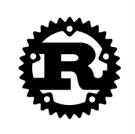


### 1.1 Rust 的核心特点

Rust 就像是一个戴着安全帽的建筑师,既严谨又高效。以下是它的主要特点(说人话版)：

- **内存安全:** 不用手动管理内存,也没有垃圾回收(GC)拖后腿。编译器在编译时就像个“安全检查员”,杜绝空指针、数据竞争等经典内存问题。

- **并发安全:** 写并发程序就像排队买奶茶——编译器保证你不会被挤乱(数据竞争)。Rust 用所有权机制让多线程代码既安全又好写。

- **高性能:** 直接编译成机器码,运行时几乎零开销。性能对标 C/C++,但少了“内存安全”的熬夜调试负担。

- **类型系统强大:** 类型系统不仅严谨,还会陪你玩“模式匹配”,帮你提前发现逻辑错误,让代码更可预测。

- **错误处理明确:** 错误不会偷偷溜走。Rust 要求你明确处理所有可能出错的情况,再也不会“运行时突然崩溃,一脸懵”。

- **宏系统好用:** 不是 C 语言那种“文本替换”宏,而是可以在编译时生成代码的“语法宏”,让你写出更灵活、更复用的代码。

- **包管理省心:** Cargo(Rust 的包管理器)大概是所有语言里体验最好的之一：依赖管理、构建、测试、发布,一条命令全搞定。

- **跨平台支持:** 写一次代码,编译到 Windows、macOS、Linux、甚至嵌入式平台,交叉编译工具链非常友好。

- **社区活跃:** 官方文档详尽,社区热情高涨,第三方库(crate)生态丰富,遇到问题不怕没人回答。

- **工具链齐全:** 编译器、格式化工具、Clippy(代码检查)、文档生成器……全都集成在 rustup 里,开箱即用。

- **零段错误:** 对,你没看错——Rust 的设计目标之一就是消灭段错误。所有权和生命周期机制保证引用永远有效。

- **迭代器与闭包:** 处理集合数据时,迭代器和闭包让你写出既简洁又高效的代码,像写脚本语言一样顺手。

怎么样?是不是感觉 Rust 像个“全能选手”?

不过,吹得再天花乱坠,不如实际用起来。那么,真正让我们选择 Rust 的理由是什么?

---

### 1.2 为什么选择 Rust?

Rust 在系统编程领域带来了几个**关键突破**,是很多高级语言(如 Python、JavaScript)无法提供的：

1. **内存安全,零 GC 开销**

    ✅ 编译时检查,运行时不需要垃圾回收,既安全又高效。

2. **性能接近 C/C++**

    ✅ 没有虚拟机或解释器层,直接跑在硬件上,适合对性能敏感的场景。

3. **并发无忧**

    ✅ “无畏并发”——编译器在编译时就帮你检测数据竞争,让你安心写多线程代码。

4. **现代开发体验**

    ✅ Cargo 统一了构建、依赖管理和测试,告别“依赖地狱”。

5. **跨平台编译简单**

    ✅ 一条命令就能为不同平台生成可执行文件,部署极其方便。

**适用场景：**

- 操作系统、游戏引擎、浏览器组件等系统级软件

- 高性能网络服务、中间件

- 嵌入式开发、物联网设备

- 对安全性和可靠性要求极高的关键应用

简单说,Rust 特别适合 **“既要高性能,又要高可靠性”**的场合。虽然入门有点门槛,但长远来看,投入时间学习 Rust 是值得的。

---

### 1.3 Rust难吗?

几乎所有 Rust 初学者都会问：“Rust 是不是特别难学?”

**我的回答是：**

学习曲线**前期确实陡峭**,尤其是所有权(ownership)、借用(borrowing)和生命周期(lifetime)这几个概念,刚开始容易让人“怀疑人生”。

但这就像学骑自行车——一开始摇摇晃晃,一旦找到平衡点(我称之为“开窍瞬间”),后面就一路顺畅了。

**重要提醒：**

请**不要有畏难情绪!** 放松心态,把编译器当成一位严格但友好的教练,它每次报错都是在帮你提前避免未来的 bug。

目前大多数 Rust 教程假定你已经具备一些编程基础(比如接触过 C/C++、Java 或 JavaScript)。

这是因为 Rust 在语法设计上**有意减少了“独创性”**,很多结构你都能在其他语言里找到影子。如果你已有基础,会更容易触类旁通。

**但本书不一样!**

我会尽量用通俗的语言,带领零基础的读者一步步掌握 Rust。

好了,理论说再多不如动手试试——下一章我们就去“操场”上跑几圈,写你的第一个 Rust 程序!

---

### 1.4 热身活动：运行你的第一个 Rust 程序

纸上得来终觉浅,绝知此事要敲码!

在正式进入 Rust 世界之前,我们先来一场轻松的“键盘热身运动”。以下是几个重要的参考站点：

#### 1.4.1 必备链接(收藏起来,以后常来)

- **Rust 官方网站：**[https://www.rust-lang.org/zh-CN](https://www.rust-lang.org/zh-CN)

  (这里是 Rust 的大本营,有最新的资讯和安装指南)

- **Rust 官方文档：**[https://doc.rust-lang.org/](https://doc.rust-lang.org/)

  (相当于 Rust 的“百科全书”,遇到问题先来这里查)

- **Rust Play：**[https://play.rust-lang.org/](https://play.rust-lang.org/)

  (本节的重点! 一个免费的在线 Rust 编辑器,不用安装就能写代码)

- **Visual Studio Code：**[https://code.visualstudio.com/](https://code.visualstudio.com/)

  (我们待会儿安装的主流代码编辑器,先看看长什么样)

---

#### 1.4.2 现在就动手：在浏览器里运行 Rust

我们暂时不需要安装任何软件,因为 Rust 有一个超级贴心的“在线游乐场”—— **Rust Playground** 。

它就像 Rust 的“在线试衣间”,让你先试试合不合身。

- **⚠️ 重要提醒：** 编程是门手艺活,只看不练等于没学。

  请务必在电脑上跟着操作,**禁止**纯围观、**禁止**直接复制粘贴!

  肌肉记忆是靠敲出来的,不是看出来的。

**第一步：打开 Rust Playground**
点击这个链接：[https://play.rust-lang.org/](https://play.rust-lang.org/)

你会看到这样的界面(就像下图)：

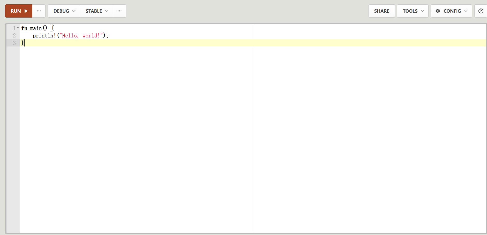

**第二步：认识你的第一段 Rust 代码**
打开后,你会看到编辑器里已经有一小段代码：

```rust
fn main() {
  println!("Hello, world!");
}
```

**代码简单解释：**

`fn main()`：定义一个叫 `main` 的函数,这是每个 Rust 程序的**起点**。

`println!("Hello, world!")`：在屏幕上打印 “Hello, world!”。

(注意那个感叹号 `!`,它表示 `println` 是一个**宏**,不是普通函数——这个细节我们以后会讲。)

**第三步：按下那个“魔法按钮”**
什么都不要改,直接点击右上角那个又大又红的 “RUN” 按钮

**第四步：见证奇迹的时刻!**
点击之后,页面下方会弹出一个输出窗口。

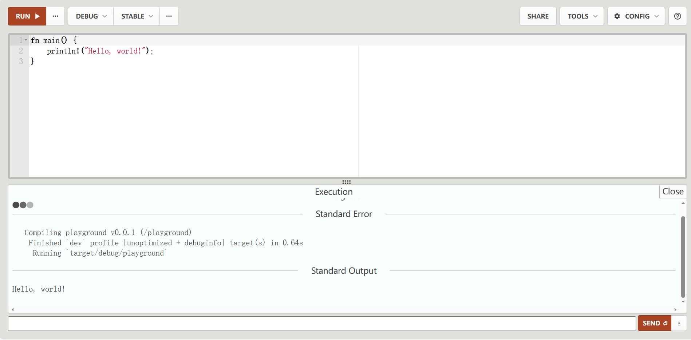

如果你看到这样一行字：

```text
Hello, world!
```

那么恭喜你!**你的第一个 Rust 程序成功运行了!**
(欢迎加入 Rustacean 大家庭!)

---

#### 1.4.2 但是……总不能一直在线写吧?

Rust Playground 很棒,但它有几个小缺点：

- 代码无法本地保存
- 不适合大型项目
- 缺少高级调试功能

所以,真正的 Rust 开发者都会使用**本地开发环境**,配合专业的代码编辑器(比如 **Visual Studio Code**)。

在第二章,我们将一起：

1. 安装 Rust 工具链(rustup、cargo 等)
2. 配置 VSCode 的 Rust 开发环境
3. 创建你的第一个本地 Rust 项目

如果刚才的 “Hello, world!” 让你感到了一丝成就感(哪怕只有一点点),那么你已经迈出了成功的第一步!

- 💡 小贴士：在 Rust Playground 里,你可以尝试修改 `println!` 里的文字,比如改成 `println!("你好,Rust!");`,再点击 RUN,看看会发生什么。

  玩得开心点,这是你的“数字沙盒”!

OK,热身结束,我们下一章正式进入 Rust 的安装与配置环节。Let’s go!

---

## 第二章-Rust环境搭建

前面我们提到,Rust 的学习曲线有点陡峭——没想到吧,从**环境搭建**开始就已经在“热身”了。不过别担心,我会像你的“技术导游”一样,带你一步步走完这个过程。

### 2.1 认识 Rust 的开发“装备库”

Rust 是一门**编译型语言**(区别于 Python、JavaScript 这类解释型语言),这意味着你需要两个核心工具：

1. **编译器：** 把 Rust 代码翻译成机器能懂的二进制文件
2. **编辑器/IDE：** 让你写代码时更舒服、更高效

Rust支持很多编辑器,官方网站公布支持的工具如下([https://www.rust-lang.org/zh-CN/tools](https://www.rust-lang.org/zh-CN/tools))：


本章我们将安装：

- **Rust 工具链** (包含编译器、包管理器等)
- **Visual Studio Code** (当前最受欢迎的轻量级编辑器之一)

---

首先,需要安装最新版的 Rust 编译工具和 Visual Studio Code。

Rust 编译工具：[https://www.rust-lang.org/zh-CN/tools/install](https://www.rust-lang.org/zh-CN/tools/install)

Visual Studio Code：[https://code.visualstudio.com/Download](https://code.visualstudio.com/Download)

这两个链接先放在这里,我们先来安装 Rust 工具链。

### 2.2 安装 Rust 工具链

#### 2.2.1 使用 Rustup 安装 Rust(官方推荐)

Rust 的安装工具叫 **rustup**,它是 Rust 的“瑞士军刀”——不仅能安装 Rust,还能管理多个版本。安装步骤很简单：

1. **访问官网：**[rustup.rs](rustup.rs)

2. **下载安装程序：**
  Windows：点击下载 `rustup-init.exe`
  macOS/Linux：复制页面上的命令到终端执行

3. **运行安装程序**,当出现选择提示时：

```text
Current installation options:

   default host triple: x86_64-pc-windows-msvc
     default toolchain: stable (default)
               profile: default
  modify PATH variable: yes

1) Proceed with installation (default)
2) Customize installation
3) Cancel installation
```

**请直接输入 `1` 并按回车**,使用默认安装选项。

- **⚠️ Windows 用户可能遇到的“惊喜”**
  如果安装时突然开始下载 **Visual Studio**(注意：不是 VS Code),别慌!
  这是因为 Rust 编译器(rustc)在 Windows 上依赖 Microsoft 的 C++ 构建工具。
  让它安心下载安装,完成后重新运行 rustup-init,再次输入 `1` 即可。

安装完成后,你会看到这样的成功提示：

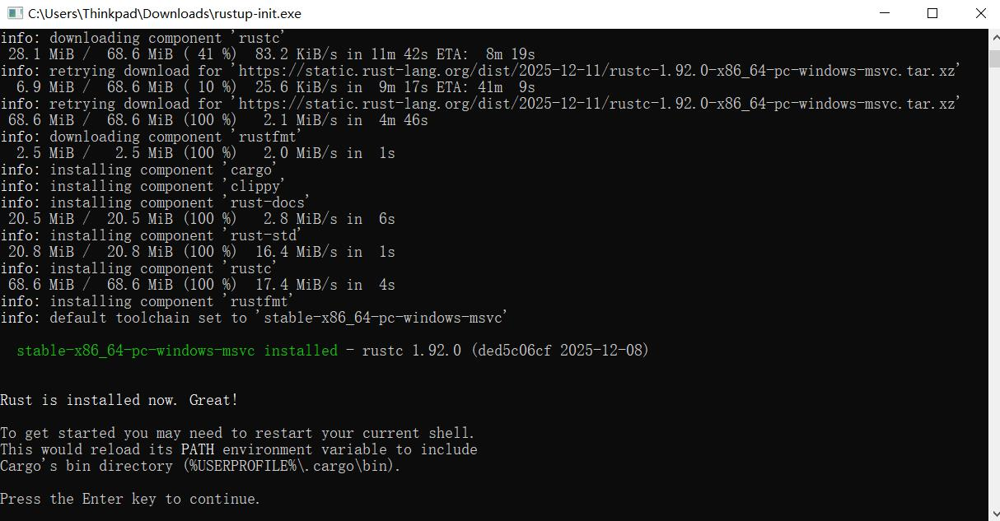

**最后一步：重启命令行窗口**,让环境变量生效。

验证安装是否成功：打开终端/命令行,输入：

```bash
rustc --version
```

如果显示类似 `rustc 1.76.0 (07dca489a 2024-02-04)` 的信息,恭喜你!🎉

---

#### 2.2.2 VS & VSCode

VS 和 VS Code,傻傻分不清楚?

你可能注意到刚才提到了 **Visual Studio(VS)**,而我们马上要安装的是 **Visual Studio Code(VS Code)**。它们是什么关系?

| 特性 | Visual Studio(VS) | Visual Studio Code(VS Code) |
| ------ | -------------------- | -------------------------------- |
| 定位 | 重量级全能 IDE | 轻量级代码编辑器 |
| 大小 | 安装全插件通常 20-40 GB | 约 200-300 MB |
| 启动速度 | 像启动大型游戏 | 像打开记事本 |
| 适用语言 | C++、C#、.NET、Python 等 | 几乎所有语言(通过插件) |
| 扩展性 | 功能固定,扩展有限 | 海量插件市场 |
| 关系 | “重量级哥哥” | “轻量版弟弟” |

**简单说：**

- **VS** 是“重型卡车”,适合大型企业级项目
- **VS Code** 是“智能小车”,灵活快速,适合大多数开发场景

对于 Rust 开发(以及大多数现代编程),**VS Code 完全够用**,而且对电脑配置更友好。

---

### 2.3 安装 Visual Studio Code

#### 2.3.1 下载与安装

1. **访问下载页面：**[https://code.visualstudio.com/Download](https://code.visualstudio.com/Download)
2. **选择对应系统版本：**

    Windows：注意区分 **System Installer**(管理员账户)和 **User Installer**(普通账户)

    macOS：下载 `.dmg` 文件

    Linux：根据发行版选择 `.deb` 或 `.rpm`
3. **运行安装程序**,按提示操作：

    接受许可协议 `✓`

    选择安装位置(默认即可)`✓`

    **推荐勾选：**

      ☑ 创建桌面快捷方式

      ☑ 将 VS Code 添加到右键菜单(方便快速打开文件)

      ☑ 将 `code` 命令添加到 PATH(方便在终端中启动)
4. 点击“安装”,等待完成。

安装完成后启动 VS Code,你会看到这样的界面：

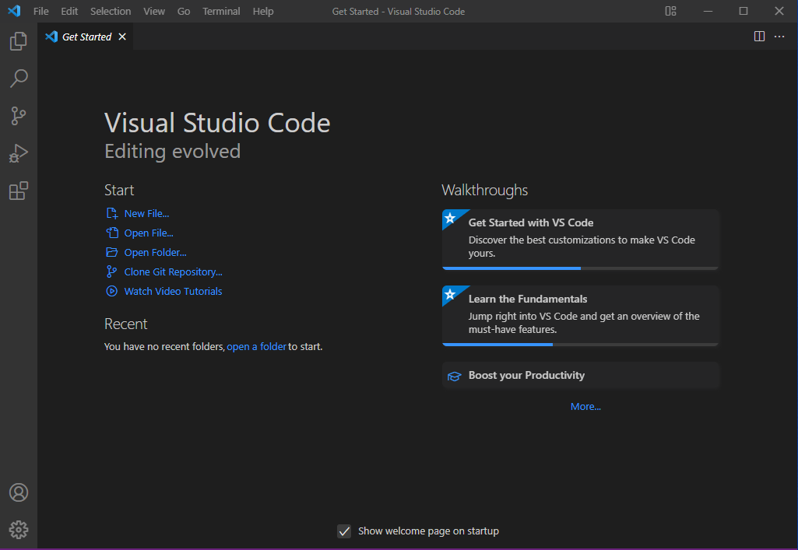

#### 2.3.2 安装中文语言包(可选但推荐)

可这满屏的英文对我们国内开发者来说有点不太友好,所以接下来我们来安装汉化包!

1. 点击左侧边栏的 **扩展图标**(四个方块那个)
2. 在搜索框输入 `Chinese`
3. 找到 **Chinese (Simplified) Language Pack for Visual Studio Code**(图标是小地球🌐)
4. 点击“安装”


最后**重启 VS Code**,界面就会变成中文啦!

---

📦 安装完成清单

✅ **Rust 工具链：**`rustc`、`cargo`、`rustup`

✅ **VS Code 编辑器：** 轻量高效的代码编辑环境

✅ **中文界面(可选)：** 更友好的开发体验

---

- Rustacean 小贴士：

  如果在安装过程中遇到任何问题,请随时查阅 Rust 官方安装指南,或在本项目的 Issue 中提问。记住,每个 Rust 开发者都经历过这个阶段——你不是一个人在战斗!

---

#### 2.3.3 配置 VS Code：安装 Rust 必备插件

前面我们已经装好了 Rust 工具链和 VS Code,现在需要让它们“联姻”成功。毕竟,一个没有插件的 IDE 就像没有调味料的泡面————能吃,但体验不太好。

**插件一：rust-analyzer(必备!)**
这是 Rust 开发的“大脑插件”,提供代码补全、错误检查、文档提示等核心功能。

1. 点击左侧边栏的**扩展图标**(四个方块那个,或者按 `Ctrl+Shift+X`)
2. 在搜索框输入 `rust-analyzer`
3. 找到官方插件 **rust-analyzer**
4. 点击“安装”

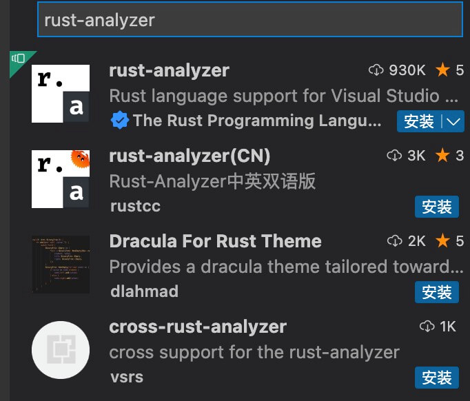

**重要提示：**

- 安装完成后可能需要等待一段时间,因为它要下载语言服务器

- 如果遇到“正在下载语言服务器”的提示,喝杯咖啡耐心等待一下

**插件二：Native Debug**
这一步其实和安装Chinese、rust-analyzer插件一样,用同样的方法安装一下Native Debug。


最后,重启 VS Code 让插件生效。现在你的 Rust 开发环境已经武装到牙齿了!

### 2.4 第一次实战：创建并运行 Rust 项目

理论说够了,现在是动手时间!让我们在本地运行第一个 Rust 程序。

#### 2.4.1 创建项目目录

首先,给你的 Rust 学习之旅找个“家”。比如：

- Windows：`E:\Dev\Learn_Rust`
- macOS/Linux：`~/Dev/Learn_Rust`

#### 2.4.2 用 VS Code 打开文件夹

打开 VS Code → 点击“文件” → “打开文件夹” → 选择刚才创建的目录：

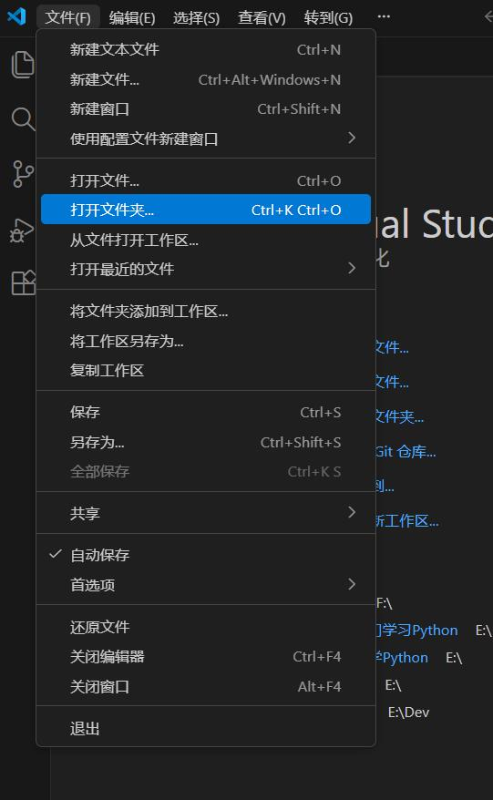

#### 2.4.3 召唤终端

在 VS Code 中按 Ctrl+`(反引号键)或者点击菜单栏的“终端” → “新建终端”：

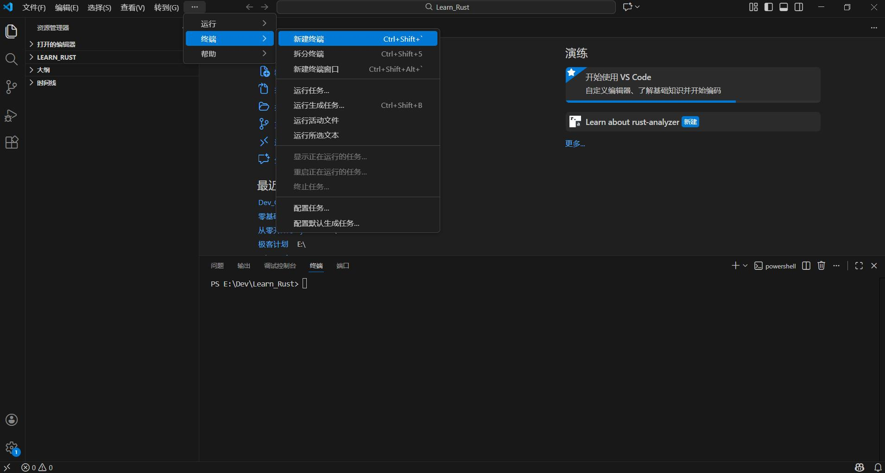

#### 2.4.4 创建第一个 Rust 项目

在终端中输入以下命令：

```bash
cargo new first
```

这会创建一个名为 `first` 的新目录,里面已经包含了：

- `src/main.rs`：你的第一个 Rust 程序
- `Cargo.toml`：项目配置文件(类似 package.json)
- `.gitignore`：Git 忽略文件

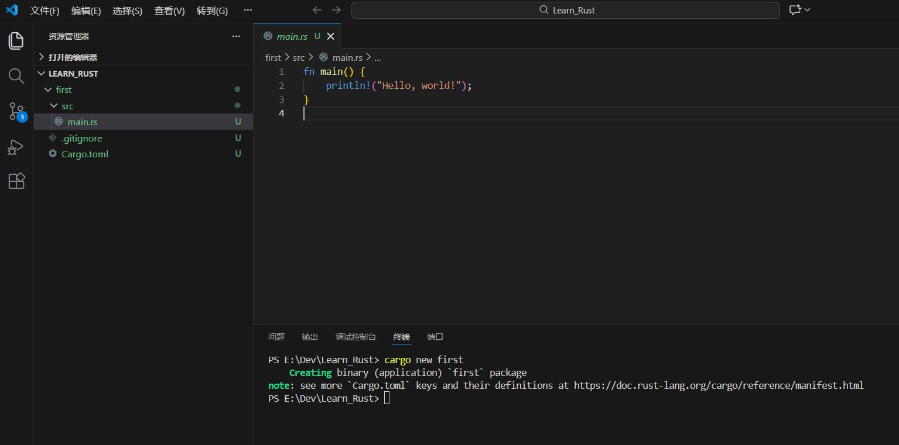

**📁 文件结构说明：**

```text
first-project/
├── Cargo.toml    # 项目配置文件
├── src/
│   └── main.rs   # 程序入口文件
└── .gitignore    # Git 忽略文件
```

#### 2.4.5 进入项目并运行

继续在终端中输入：

```bash
cd first
cargo run
```

**魔法时刻：**`cargo run` 会自动：

1. 编译你的代码
2. 运行编译后的程序

你应该会看到：

```text
   Compiling first-project v0.1.0 (/path/to/first-project)
    Finished dev [unoptimized + debuginfo] target(s) in 1.50s
     Running `target/debug/first-project`
Hello, world!
```

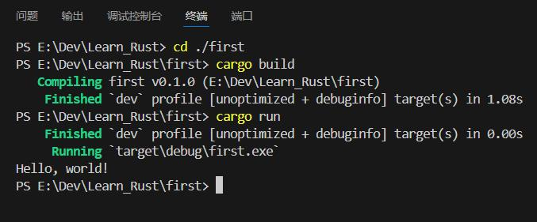

**恭喜!你的第一个本地 Rust 程序运行成功!**

---

**⚠️ 常见问题处理**
问题：遇到链接器错误

如果你在执行 `cargo build` 或 `cargo run` 时看到这样的错误：

```text
error: linker `link.exe` not found
  |
  = note: 系统找不到指定的文件。 (os error 2)
```

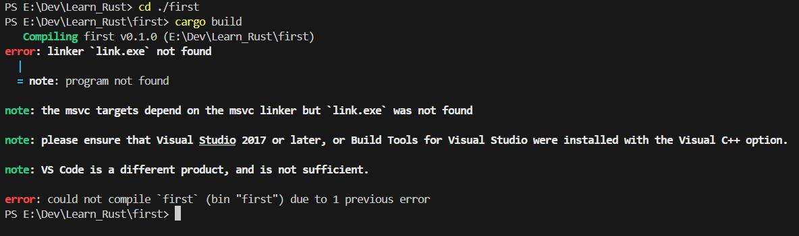

**原因：** 在 Windows 上，Rust 的 MSVC 工具链需要 Visual Studio 的 C++ 构建工具。

**解决方案：**

1. 检查是否已安装 VS Build Tools：
   - 打开“开始菜单” → 搜索“Visual Studio Installer”
   - 如果已安装，请跳转到第 2 步

2. 如果已卸载或从未安装：
   - 下载 [Visual Studio Build Tools](https://visualstudio.microsoft.com/zh-hans/downloads/#build-tools-for-visual-studio-2022)
   - 运行安装程序
   - **关键步骤：** 勾选“使用 C++ 的桌面开发”

3. **重启终端/VS Code**，再次尝试 cargo build

---

**🤔 为什么需要这个？**

- Rust 编译器（rustc）本身不包含链接器，它需要调用系统的链接器将编译后的代码“组装”成可执行文件。在 Windows 上，这个链接器是 link.exe，它属于 Visual Studio 构建工具。

---

**✅ 环境搭建完成清单**
现在你应该拥有：

- ✅ Rust 工具链（rustc, cargo, rustup）

- ✅ VS Code 编辑器

- ✅ rust-analyzer 插件（智能代码辅助）

- ✅ CodeLLDB 插件（调试支持）

- ✅ 第一个本地运行的 Rust 项目

---

**🚀 下一步：深入 Rust 语法**
环境已经就绪，下一章我们将正式开始学习 Rust 的核心语法。从变量、数据类型到函数和控制流，一步一步构建你的 Rust 知识体系。

**💪 给初学者的鼓励：**

- 如果你成功看到了“Hello, world!”，你已经战胜了 90% 的新手可能遇到的安装问题。后面的学习虽然也有挑战，但至少环境配置这个“大魔王”已经被你打败了！

准备好进入 Rust 的核心世界了吗？让我们继续前进！🦀

## 第三章-Cargo：你的 Rust 开发“瑞士军刀”🔧

欢迎来到 Cargo 的世界！如果说 Rust 编译器是你的“发动机”，那么 Cargo 就是整辆车的“控制系统”——它让你开得更稳、更快，还帮你管理“燃料”（依赖库）。

### 3.1 Cargo 是什么？

简单来说，Cargo 是 Rust 的**官方构建系统** + **包管理器**二合一工具。它就像 Rust 项目的“超级管家”：

| 角色 | 具体职责 |
| ------ | -------------------- |
| 🎯 项目管理员 | 创建项目结构、管理配置文件、组织代码 |
| 📦 包管理器 | 下载依赖、版本控制、解决依赖冲突 |
| 🔨 构建工程师 | 编译代码、链接库、优化二进制文件 |
| 🧪 质量检测员 | 运行测试、检查代码质量 |

想象一下：没有 Cargo，你得手动下载依赖、管理版本、配置编译器……有了 Cargo，你只需要几个简单命令，它帮你搞定一切！

### 3.2 Cargo 的核心特性

为什么Cargo它这么香？

Cargo 的强大体现在这些方面：

1. 📁 智能项目管理

   - 通过 `cargo new` 一键生成标准项目结构
   - `Cargo.toml` 文件管理所有配置和依赖（就像 Node.js 的 `package.json`）

2. 📦 强大的依赖管理

   - 自动从 crates.io（Rust 的官方包仓库）下载依赖
   - 版本锁定机制（`Cargo.lock` 文件）确保每次构建结果一致
   - 支持 Git 仓库、本地路径等多种依赖来源

3. ⚡ 高效的构建系统

   - **增量编译：** 只重新编译修改过的文件，大幅提升构建速度
   - **并行编译：** 利用多核 CPU 加速编译过程
   - **构建缓存：** 缓存已编译的依赖，避免重复工作

4. 🔍 全方位的质量保障

   - `cargo check`：快速语法检查（比完整编译快 10 倍！）
   - `cargo test`：运行单元测试和集成测试
   - `cargo clippy`：代码质量检查（像一位严格的代码审查员）

5. 🌍 跨平台支持

   - 一套命令通吃 Windows、macOS、Linux
   - 轻松交叉编译到其他平台（如嵌入式设备）

6. 🔧 丰富的扩展能力

   - 自定义构建脚本（`build.rs`）
   - 条件编译和特性标志（features）
   - 插件系统（可通过 `cargo install` 安装各种工具）

7. 📊 专业级工具链

   - `cargo bench`：基准测试，测量代码性能
   - `cargo doc`：生成漂亮的 API 文档（自动托管到 [docs.rs](https://docs.rs/)）
   - `cargo publish`：一键发布到 [crates.io](https://crates.io/)

8. 💡 开发者友好设计

   - **离线支持：** 断网也能正常开发（依赖已缓存）
   - **环境变量覆盖：** 灵活调整构建行为
   - **插件生态：** 数百个第三方工具扩展 Cargo 功能

### 3.3 Cargo 常用命令速查表

以下是你每天都会用到的 Cargo 命令，建议收藏：

| 命令 | 作用 | 使用频率 |
| ------ | ------ | ------ |
| `cargo new <项目名>` | 创建新项目 | ⭐⭐⭐⭐⭐（一次） |
| `cargo build` | 编译项目（生成可执行文件） | ⭐⭐⭐⭐ |
| `cargo run` | 编译并运行项目 | ⭐⭐⭐⭐⭐ |
| `cargo check` | 快速检查语法错误（不生成二进制文件） | ⭐⭐⭐⭐⭐ |
| `cargo test` | 运行所有测试 | ⭐⭐⭐⭐ |
| `cargo clean` | 清理构建产物（释放磁盘空间） | ⭐⭐⭐ |
| `cargo update` | 更新依赖到最新兼容版本 | ⭐⭐⭐ |
| `cargo add <包名>` | 添加新依赖（最方便的方式！） | ⭐⭐⭐⭐ |
| `cargo doc --open` | 生成并打开项目文档 | ⭐⭐ |
| `cargo clippy` | 代码 lint 检查（推荐安装） | ⭐⭐⭐ |
| `cargo fmt` | 自动格式化代码（保持代码风格统一） | ⭐⭐⭐⭐ |

#### 3.3.1 💻 实际演练一下

让我们重温上一节的操作，看看 Cargo 的实际工作流程：

```bash
# 1. 创建新项目
cargo new my_awesome_project
cd my_awesome_project

# 2. 快速检查代码（0.5秒完成）
cargo check

# 3. 编译项目
cargo build

# 4. 运行项目
cargo run

# 5. 添加一个依赖（比如用于处理时间的库）
cargo add chrono

# 6. 查看项目结构
tree .  # Windows 可用 `dir /s`
```

你会看到 Cargo 创建的标准结构：

```text
my_awesome_project/
├── Cargo.toml      # 项目配置和依赖
├── Cargo.lock      # 依赖版本锁定（自动生成）
├── src/
│   └── main.rs     # 程序入口
└── target/         # 构建产物（编译后生成）
```

#### 3.3.2 🎯 Cargo 的设计哲学

Cargo 的核心设计原则是 **“约定优于配置”**。这意味着：

1. **标准化：** 所有 Rust 项目都有相似的结构
2. **自动化：** 常见操作都有默认行为
3. **可重现：** 在任何机器上构建结果都一致
4. **社区友好：** 统一的工作流方便协作

> 🦀 Rustacean 小贴士：
刚开始学习时，重点关注 `cargo run`、`cargo check`、`cargo add` 这几个命令
养成使用 `cargo check` 的习惯，它比 `cargo build` 快得多
不要手动编辑 `Cargo.lock` 文件！它由 Cargo 自动管理
使用 `cargo --help` 查看所有命令，`cargo <命令> --help` 查看具体用法

### 3.4 在 VSCode 中配置 Rust 工程

Cargo 是一个不错的构建工具，如果使 VSCode 与它相配合那么 VSCode 将会是一个十分便捷的开发环境。

在上一章中我们建立了 greeting 工程，现在我们用 VSCode 打开 `learn_rust` 文件夹（**注意不是 `first`**）。

打开 learn_rust 之后，在里面新建一个新的文件夹 **`.vscode`** （注意 vscode 前面的点，如果有这个文件夹就不需要新建了）。在新建的 .vscode 文件夹里新建两个文件 `tasks.json` 和 `launch.json`，文件内容如下：

tasks.json 文件

```json
{ 
    "version":"2.0.0", 
    "tasks":[ 
        { 
            "label":"build", 
            "type":"shell", 
            "command":"cargo", 
            "args":["build"] 
        } 
    ] 
}
```

launch.json 文件（适用在 Windows 系统上）

```json
{ 
    "version":"0.2.0", 
    "configurations":[ 
        { 
            "name":"(Windows)启动", 
            "preLaunchTask":"build", 
            "type":"cppvsdbg", 
            "request":"launch", 
            "program":"${workspaceFolder}/target/debug/${workspaceFolderBasename}.exe", 
            "args":[], 
            "stopAtEntry":false, 
            "cwd":"${workspaceFolder}", 
            "environment":[], 
            "externalConsole":false 
        }, 
        { 
            "name":"(gdb)启动", 
            "type":"cppdbg", 
            "request":"launch", 
            "program":"${workspaceFolder}/target/debug/${workspaceFolderBasename}.exe", 
            "args":[], 
            "stopAtEntry":false, 
            "cwd":"${workspaceFolder}", 
            "environment":[], 
            "externalConsole":false, 
            "MIMode":"gdb", 
            "miDebuggerPath":"这里填GDB所在的目录", 
            "setupCommands":[ 
                { 
                    "description":"为 gdb 启用整齐打印", 
                    "text":"-enable-pretty-printing", 
                    "ignoreFailures":true 
                } 
            ] 
        } 
    ] 
}
```

launch.json 文件（适用在 Linux 系统上）

```json
{
    "version":"0.2.0",
    "configurations":[
        {
            "name":"Debug",
            "type":"gdb",
            "preLaunchTask":"build",
            "request":"launch",
            "target":"${workspaceFolder}/target/debug/${workspaceFolderBasename}",
            "cwd":"${workspaceFolder}"
        }
    ]
}
```

launch.json 文件（适用在 Mac OS 系统上）

```json
{
    "version":"0.2.0",
    "configurations":[
        {
            "name":"(lldb) 启动",
            "type":"cppdbg",
            "preLaunchTask":"build",
            "request":"launch",
            "program":"${workspaceFolder}/target/debug/${workspaceFolderBasename}",
            "args":[],
            "stopAtEntry":false,
            "cwd":"${workspaceFolder}",
            "environment":[],
            "externalConsole":false,
            "MIMode":"lldb"
        }
    ]
}
```

然后点击 VSCode 左栏的 "运行"。

如果你使用的是 MSVC 选择 "(Windows) 启动"。

如果使用的是 MinGW 且安装了 GDB 选择"(gdb)启动"，gdb 启动前请注意填写 launch.json 中的 "miDebuggerPath"。

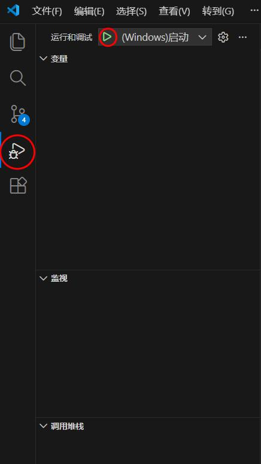

程序就会开始调试运行了。运行输出将出现在"调试控制台"中：

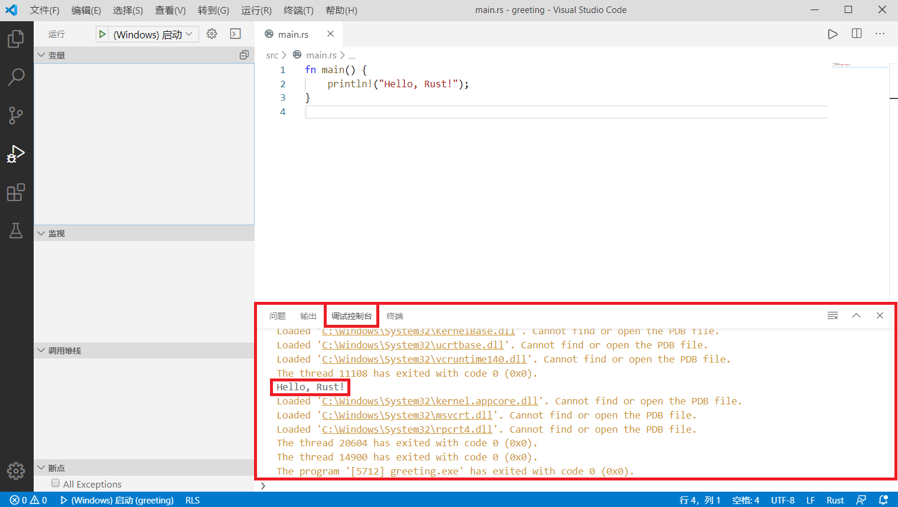

在 VSCode 中调试 Rust
调试程序的方法与其它环境相似，只需要在行号的左侧点击红点就可以设置断点，在运行中遇到断点会暂停，以供开发者监视实时变量的值。

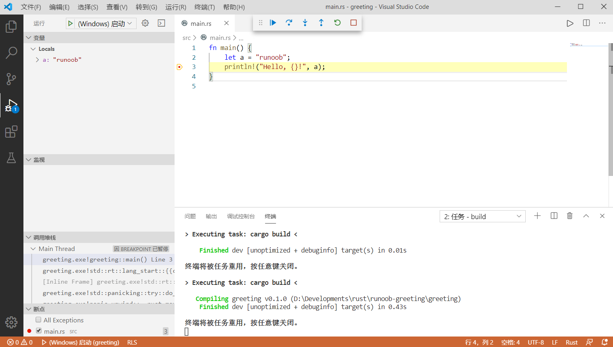

> Cargo 可能是你遇到过最贴心的构建工具。下一章，我们将深入 Rust 语法，开始真正的编程之旅！准备好敲代码了吗？🚀
